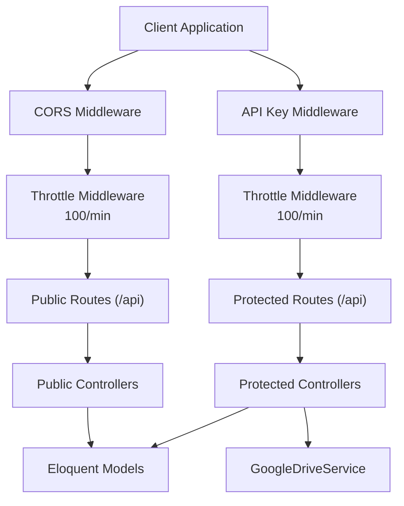
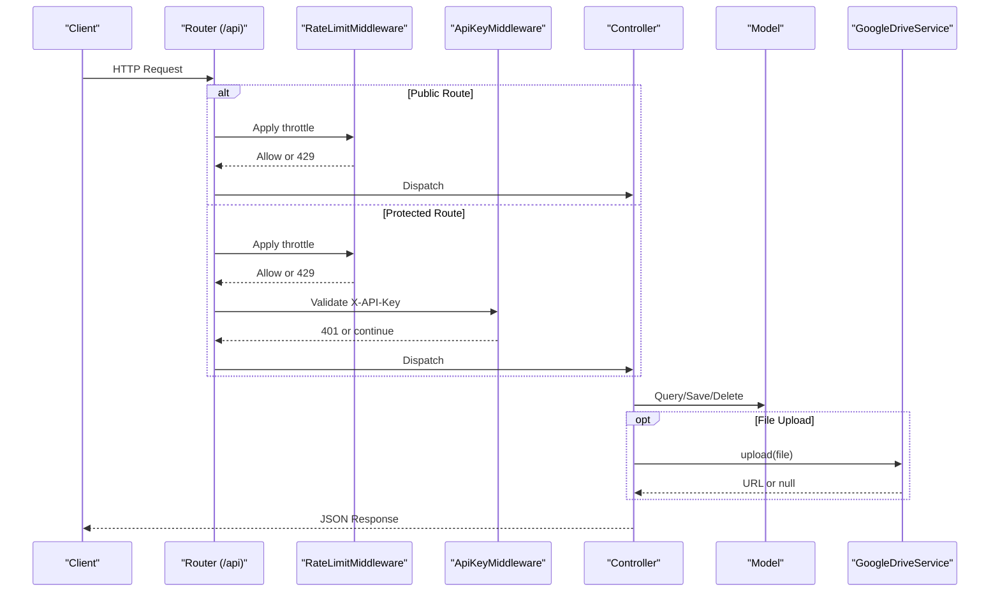
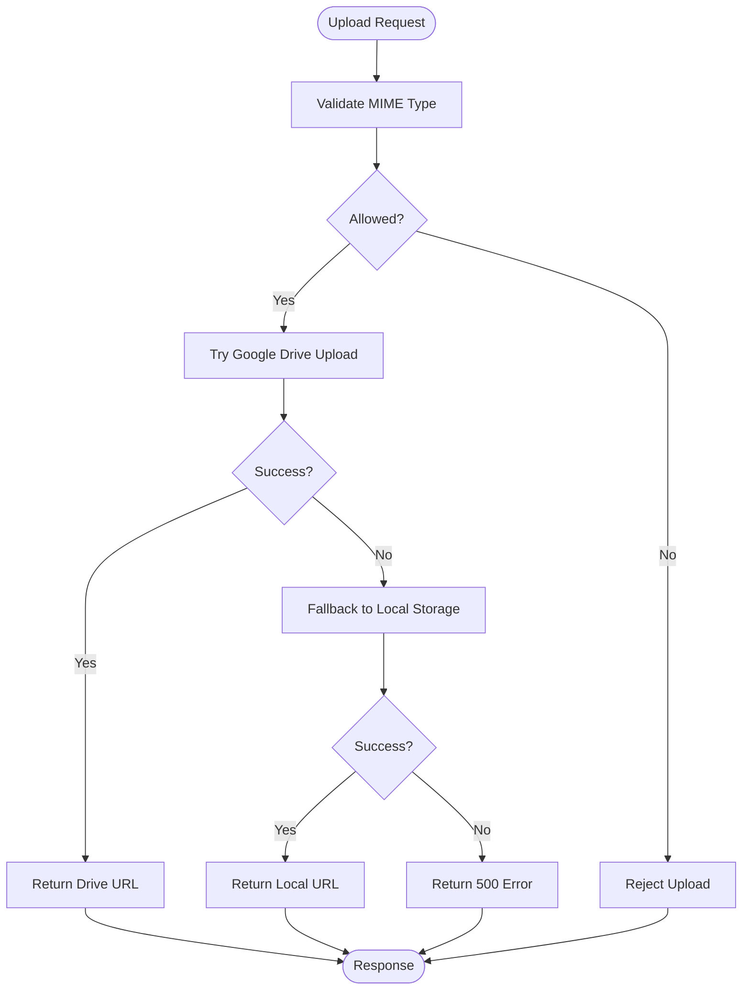
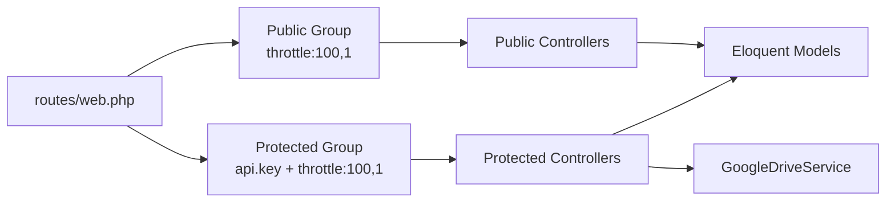
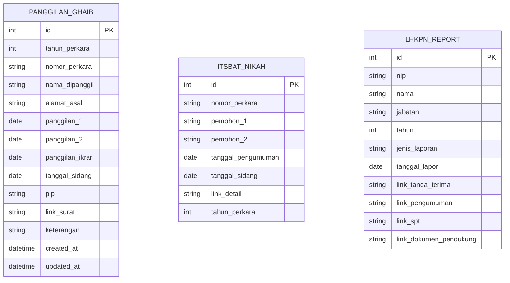

# API Reference

<cite>
**Referenced Files in This Document**
- [routes/web.php](file://routes/web.php)
- [ApiKeyMiddleware.php](file://app/Http/Middleware/ApiKeyMiddleware.php)
- [RateLimitMiddleware.php](file://app/Http/Middleware/RateLimitMiddleware.php)
- [CorsMiddleware.php](file://app/Http/Middleware/CorsMiddleware.php)
- [Controller.php](file://app/Http/Controllers/Controller.php)
- [PanggilanController.php](file://app/Http/Controllers/PanggilanController.php)
- [ItsbatNikahController.php](file://app/Http/Controllers/ItsbatNikahController.php)
- [LhkpnController.php](file://app/Http/Controllers/LhkpnController.php)
- [LraReportController.php](file://app/Http/Controllers/LraReportController.php)
- [Panggilan.php](file://app/Models/Panggilan.php)
- [ItsbatNikah.php](file://app/Models/ItsbatNikah.php)
- [LhkpnReport.php](file://app/Models/LhkpnReport.php)
- [GoogleDriveService.php](file://app/Services/GoogleDriveService.php)
- [composer.json](file://composer.json)
</cite>

## Table of Contents
1. [Introduction](#introduction)
2. [Project Structure](#project-structure)
3. [Core Components](#core-components)
4. [Architecture Overview](#architecture-overview)
5. [Detailed Component Analysis](#detailed-component-analysis)
6. [Dependency Analysis](#dependency-analysis)
7. [Performance Considerations](#performance-considerations)
8. [Troubleshooting Guide](#troubleshooting-guide)
9. [Conclusion](#conclusion)
10. [Appendices](#appendices)

## Introduction
This document provides comprehensive API documentation for the Lumen RESTful API backend. It covers:
- Authentication and security headers
- Rate limiting behavior (100 requests per minute)
- CORS configuration for cross-origin requests
- Public read-only endpoints for modules such as Panggilan Ghaib, Itsbat Nikah, and LHKPN Reports
- Protected CRUD endpoints requiring an API key
- Standardized JSON response formats, pagination, and common error codes
- Parameter validation and sanitization
- Practical curl examples for typical usage scenarios
- Performance considerations and security best practices

## Project Structure
The API is organized around a set of controllers grouped under two route prefixes:
- Public read-only endpoints under /api prefixed by a global throttle middleware
- Protected CRUD endpoints under /api prefixed by API key and throttle middleware

**Diagram sources**
- [routes/web.php:13-76](file://routes/web.php#L13-L76)
- [routes/web.php:78-164](file://routes/web.php#L78-L164)
- [CorsMiddleware.php:14-62](file://app/Http/Middleware/CorsMiddleware.php#L14-L62)
- [ApiKeyMiddleware.php:14-39](file://app/Http/Middleware/ApiKeyMiddleware.php#L14-L39)
- [RateLimitMiddleware.php:15-39](file://app/Http/Middleware/RateLimitMiddleware.php#L15-L39)

**Section sources**
- [routes/web.php:13-164](file://routes/web.php#L13-L164)

## Core Components
- Authentication
  - API key header: X-API-Key
  - Environment variable: API_KEY
  - Security: timing-safe comparison and randomized delay on failure
- Rate Limiting
  - 100 requests per minute per client IP
  - X-RateLimit-Limit and X-RateLimit-Remaining headers returned
- CORS
  - Origins configured via environment variable and trusted domains
  - Strict allowlist; no wildcard origins in production
  - Security headers included (X-Content-Type-Options, X-Frame-Options, X-XSS-Protection)
- Input Sanitization
  - Base controller strips HTML tags from string fields except specific exceptions
- File Upload
  - Prefer Google Drive with fallback to local storage
  - MIME-type validation based on magic bytes

**Section sources**
- [ApiKeyMiddleware.php:14-39](file://app/Http/Middleware/ApiKeyMiddleware.php#L14-L39)
- [RateLimitMiddleware.php:15-39](file://app/Http/Middleware/RateLimitMiddleware.php#L15-L39)
- [CorsMiddleware.php:14-62](file://app/Http/Middleware/CorsMiddleware.php#L14-L62)
- [Controller.php:18-95](file://app/Http/Controllers/Controller.php#L18-L95)

## Architecture Overview
The API enforces authentication and rate limiting at the routing level. Public endpoints are read-only and throttled globally. Protected endpoints require an API key and support full CRUD operations.

**Diagram sources**
- [routes/web.php:13-164](file://routes/web.php#L13-L164)
- [RateLimitMiddleware.php:15-39](file://app/Http/Middleware/RateLimitMiddleware.php#L15-L39)
- [ApiKeyMiddleware.php:14-39](file://app/Http/Middleware/ApiKeyMiddleware.php#L14-L39)
- [LraReportController.php:198-232](file://app/Http/Controllers/LraReportController.php#L198-L232)

## Detailed Component Analysis

### Authentication and Security Headers
- Header requirement: X-API-Key
- Validation: timing-safe comparison against environment variable API_KEY
- Failure behavior: randomized delay plus 401 Unauthorized
- Rate limiting: 100 requests per minute per IP
- CORS: strict allowlist origins, security headers, preflight handling

**Section sources**
- [ApiKeyMiddleware.php:14-39](file://app/Http/Middleware/ApiKeyMiddleware.php#L14-L39)
- [RateLimitMiddleware.php:15-39](file://app/Http/Middleware/RateLimitMiddleware.php#L15-L39)
- [CorsMiddleware.php:14-62](file://app/Http/Middleware/CorsMiddleware.php#L14-L62)

### Standardized JSON Response Formats
All endpoints return a consistent envelope:
- success: boolean
- data: object or array (may be omitted if not applicable)
- Additional metadata fields vary by endpoint (e.g., pagination fields)

Common error envelope:
- success: false
- message: string describing the error

Pagination envelope (when paginated):
- data: array
- current_page: number
- last_page: number
- per_page: number
- total: number

Headers:
- X-RateLimit-Limit and X-RateLimit-Remaining are set on successful responses

**Section sources**
- [PanggilanController.php:49-56](file://app/Http/Controllers/PanggilanController.php#L49-L56)
- [ItsbatNikahController.php:35-42](file://app/Http/Controllers/ItsbatNikahController.php#L35-L42)
- [LhkpnController.php:45-52](file://app/Http/Controllers/LhkpnController.php#L45-L52)
- [LraReportController.php:47-54](file://app/Http/Controllers/LraReportController.php#L47-L54)
- [RateLimitMiddleware.php:36-38](file://app/Http/Middleware/RateLimitMiddleware.php#L36-L38)

### Public Read-Only Endpoints (100 requests/minute)
These endpoints are available without authentication and are throttled globally.

- Panggilan Ghaib
  - GET /api/panggilan
    - Query parameters: tahun (integer), limit (1–100)
    - Response: paginated items
  - GET /api/panggilan/{id}
    - Path parameter: id (positive integer)
    - Response: single item
  - GET /api/panggilan/tahun/{tahun}
    - Path parameter: tahun (2000–2100)
    - Response: array with total count

- Itsbat Nikah
  - GET /api/itsbat
    - Query parameters: tahun (integer), q (search term), limit (default 10)
    - Response: paginated items
  - GET /api/itsbat/{id}
    - Path parameter: id (positive integer)
    - Response: single item

- Panggilan e-Court
  - GET /api/panggilan-ecourt
  - GET /api/panggilan-ecourt/{id}
  - GET /api/panggilan-ecourt/tahun/{tahun}

- Agenda Pimpinan
  - GET /api/agenda
  - GET /api/agenda/{id}

- LHKPN Reports
  - GET /api/lhkpn
    - Query parameters: tahun (integer), jenis (enum), q (search by name/nip)
    - Response: paginated items
  - GET /api/lhkpn/{id}

- Realisasi Anggaran
  - GET /api/anggaran
  - GET /api/anggaran/{id}
  - GET /api/pagu

- DIPA POK
  - GET /api/dipapok
  - GET /api/dipapok/{id}

- Aset BMN
  - GET /api/aset-bmn
  - GET /api/aset-bmn/{id}

- SAKIP
  - GET /api/sakip
  - GET /api/sakip/{id}
  - GET /api/sakip/tahun/{tahun}

- Laporan Pengaduan
  - GET /api/laporan-pengaduan
  - GET /api/laporan-pengaduan/{id}
  - GET /api/laporan-pengaduan/tahun/{tahun}

- Keuangan Perkara
  - GET /api/keuangan-perkara
  - GET /api/keuangan-perkara/{id}
  - GET /api/keuangan-perkara/tahun/{tahun}

- Sisa Panjar
  - GET /api/sisa-panjar
  - GET /api/sisa-panjar/{id}
  - GET /api/sisa-panjar/tahun/{tahun}

- MOU
  - GET /api/mou
  - GET /api/mou/{id}

- LRA Reports
  - GET /api/lra
  - GET /api/lra/{id}

Curl examples (public):
- List Panggilan Ghaib with pagination:
  - curl -s "https://dataweb.pa-penajam.go.id/api/panggilan?limit=10"
- Get a specific record:
  - curl -s "https://dataweb.pa-penajam.go.id/api/panggilan/1"
- Search Itsbat Nikah:
  - curl -s "https://dataweb.pa-penajam.go.id/api/itsbat?q=perkara&limit=5"

**Section sources**
- [routes/web.php:13-76](file://routes/web.php#L13-L76)
- [PanggilanController.php:31-82](file://app/Http/Controllers/PanggilanController.php#L31-L82)
- [ItsbatNikahController.php:10-43](file://app/Http/Controllers/ItsbatNikahController.php#L10-L43)
- [LhkpnController.php:11-53](file://app/Http/Controllers/LhkpnController.php#L11-L53)
- [LraReportController.php:20-78](file://app/Http/Controllers/LraReportController.php#L20-L78)

### Protected CRUD Endpoints (Requires X-API-Key)
All protected endpoints require the X-API-Key header and are throttled at 100 requests/minute.

- Panggilan Ghaib
  - POST /api/panggilan
  - PUT /api/panggilan/{id}
  - DELETE /api/panggilan/{id}
  - Validation rules and allowed fields are enforced; file upload supported

- Itsbat Nikah
  - POST /api/itsbat
  - PUT /api/itsbat/{id}
  - DELETE /api/itsbat/{id}
  - Validation includes uniqueness and optional file upload

- Panggilan e-Court
  - POST /api/panggilan-ecourt
  - PUT /api/panggilan-ecourt/{id}
  - DELETE /api/panggilan-ecourt/{id}

- Agenda Pimpinan
  - POST /api/agenda
  - PUT /api/agenda/{id}
  - DELETE /api/agenda/{id}

- LHKPN Reports
  - POST /api/lhkpn
  - PUT /api/lhkpn/{id}
  - DELETE /api/lhkpn/{id}
  - Supports multiple file uploads mapped to specific fields

- Realisasi Anggaran
  - POST /api/anggaran
  - PUT /api/anggaran/{id}
  - DELETE /api/anggaran/{id}

- Pagu Anggaran
  - POST /api/pagu
  - DELETE /api/pagu/{id}

- DIPA POK
  - POST /api/dipapok
  - PUT /api/dipapok/{id}
  - DELETE /api/dipapok/{id}

- Aset BMN
  - POST /api/aset-bmn
  - PUT /api/aset-bmn/{id}
  - DELETE /api/aset-bmn/{id}

- SAKIP
  - POST /api/sakip
  - PUT /api/sakip/{id}
  - DELETE /api/sakip/{id}

- Laporan Pengaduan
  - POST /api/laporan-pengaduan
  - PUT /api/laporan-pengaduan/{id}
  - DELETE /api/laporan-pengaduan/{id}

- Keuangan Perkara
  - POST /api/keuangan-perkara
  - PUT /api/keuangan-perkara/{id}
  - DELETE /api/keuangan-perkara/{id}

- Sisa Panjar
  - POST /api/sisa-panjar
  - PUT /api/sisa-panjar/{id}
  - DELETE /api/sisa-panjar/{id}

- MOU
  - POST /api/mou
  - PUT /api/mou/{id}
  - DELETE /api/mou/{id}

- LRA Reports
  - POST /api/lra
  - PUT /api/lra/{id}
  - DELETE /api/lra/{id}

Curl examples (protected):
- Create a new Panggilan Ghaib record:
  - curl -s -X POST "https://dataweb.pa-penajam.go.id/api/panggilan" -H "X-API-Key: YOUR_API_KEY" -F "field=value" -F "file_upload=@/path/to/file.pdf"
- Update an existing record:
  - curl -s -X PUT "https://dataweb.pa-penajam.go.id/api/panggilan/1" -H "X-API-Key: YOUR_API_KEY" -F "field=new_value"
- Delete a record:
  - curl -s -X DELETE "https://dataweb.pa-penajam.go.id/api/panggilan/1" -H "X-API-Key: YOUR_API_KEY"

Notes:
- Replace YOUR_API_KEY with your configured API key
- For file uploads, use multipart/form-data with appropriate field names as per endpoint validation rules

**Section sources**
- [routes/web.php:78-164](file://routes/web.php#L78-L164)
- [PanggilanController.php:115-330](file://app/Http/Controllers/PanggilanController.php#L115-L330)
- [ItsbatNikahController.php:45-224](file://app/Http/Controllers/ItsbatNikahController.php#L45-L224)
- [LhkpnController.php:55-144](file://app/Http/Controllers/LhkpnController.php#L55-L144)
- [LraReportController.php:80-196](file://app/Http/Controllers/LraReportController.php#L80-L196)

### Parameter Validation and Sanitization
- Validation rules are enforced per endpoint using framework validation mechanisms
- Allowed fields are restricted to prevent mass assignment
- Input sanitization strips HTML tags from string fields, with exceptions for specific fields (e.g., links)
- File uploads validated by MIME type based on content, not extension

**Section sources**
- [PanggilanController.php:118-136](file://app/Http/Controllers/PanggilanController.php#L118-L136)
- [ItsbatNikahController.php:47-53](file://app/Http/Controllers/ItsbatNikahController.php#L47-L53)
- [LhkpnController.php:57-68](file://app/Http/Controllers/LhkpnController.php#L57-L68)
- [LraReportController.php:82-89](file://app/Http/Controllers/LraReportController.php#L82-L89)
- [Controller.php:18-29](file://app/Http/Controllers/Controller.php#L18-L29)

### File Upload Behavior
- Preferred destination: Google Drive
- Fallback: local storage under public/uploads with randomized filenames
- MIME validation performed on uploaded content
- On success, endpoints return URLs pointing to the uploaded assets

**Diagram sources**
- [Controller.php:40-95](file://app/Http/Controllers/Controller.php#L40-L95)
- [LraReportController.php:198-232](file://app/Http/Controllers/LraReportController.php#L198-L232)
- [GoogleDriveService.php:38-82](file://app/Services/GoogleDriveService.php#L38-L82)

**Section sources**
- [Controller.php:40-95](file://app/Http/Controllers/Controller.php#L40-L95)
- [LraReportController.php:198-232](file://app/Http/Controllers/LraReportController.php#L198-L232)
- [GoogleDriveService.php:38-82](file://app/Services/GoogleDriveService.php#L38-L82)

### CORS Configuration
- Origins are configured via environment variable and combined with trusted domains
- Preflight OPTIONS requests are handled with appropriate headers
- Security headers included to mitigate common web vulnerabilities

**Section sources**
- [CorsMiddleware.php:14-62](file://app/Http/Middleware/CorsMiddleware.php#L14-L62)

### Pagination Implementation
- Default and maximum limits enforced per endpoint
- Consistent pagination envelope fields across endpoints

**Section sources**
- [PanggilanController.php:44-47](file://app/Http/Controllers/PanggilanController.php#L44-L47)
- [ItsbatNikahController.php:32-42](file://app/Http/Controllers/ItsbatNikahController.php#L32-L42)
- [LhkpnController.php:42-52](file://app/Http/Controllers/LhkpnController.php#L42-L52)
- [LraReportController.php:38-54](file://app/Http/Controllers/LraReportController.php#L38-L54)

### Error Handling Patterns
- Standardized error envelope with success=false and message
- HTTP status codes aligned with request semantics (400, 401, 404, 429, 500)
- Rate limit responses include Retry-After header

**Section sources**
- [ApiKeyMiddleware.php:20-36](file://app/Http/Middleware/ApiKeyMiddleware.php#L20-L36)
- [RateLimitMiddleware.php:22-28](file://app/Http/Middleware/RateLimitMiddleware.php#L22-L28)
- [PanggilanController.php:65-104](file://app/Http/Controllers/PanggilanController.php#L65-L104)
- [ItsbatNikahController.php:123-136](file://app/Http/Controllers/ItsbatNikahController.php#L123-L136)
- [LhkpnController.php:94-102](file://app/Http/Controllers/LhkpnController.php#L94-L102)
- [LraReportController.php:59-72](file://app/Http/Controllers/LraReportController.php#L59-L72)

## Dependency Analysis
- Controllers depend on Eloquent models for persistence
- Protected endpoints optionally depend on GoogleDriveService for file storage
- Middleware enforce cross-cutting concerns (CORS, rate limiting, API key)

**Diagram sources**
- [routes/web.php:13-164](file://routes/web.php#L13-L164)
- [GoogleDriveService.php:38-82](file://app/Services/GoogleDriveService.php#L38-L82)

**Section sources**
- [routes/web.php:13-164](file://routes/web.php#L13-L164)
- [composer.json:11-14](file://composer.json#L11-L14)

## Performance Considerations
- Global throttle of 100 requests per minute helps prevent abuse and ensures fair usage
- Pagination limits reduce payload sizes and memory usage
- File uploads are validated by MIME type to avoid oversized or malicious content
- Google Drive fallback reduces local disk I/O and improves scalability

[No sources needed since this section provides general guidance]

## Troubleshooting Guide
- 401 Unauthorized: Verify X-API-Key header matches configured API_KEY
- 429 Too Many Requests: Respect rate limit; observe Retry-After header
- 404 Not Found: Resource does not exist or invalid ID
- 400 Bad Request: Validation errors; check required fields and formats
- 500 Internal Server Error: Server-side failures during file upload or processing

Common checks:
- Confirm CORS allowlist includes your Origin
- Ensure file MIME types are permitted
- Validate numeric ranges and formats for date and integer fields

**Section sources**
- [ApiKeyMiddleware.php:20-36](file://app/Http/Middleware/ApiKeyMiddleware.php#L20-L36)
- [RateLimitMiddleware.php:22-28](file://app/Http/Middleware/RateLimitMiddleware.php#L22-L28)
- [CorsMiddleware.php:44-48](file://app/Http/Middleware/CorsMiddleware.php#L44-L48)

## Conclusion
This API provides a secure, rate-limited, and CORS-aware interface for accessing legal and administrative datasets. Public endpoints offer read-only access with pagination and search capabilities, while protected endpoints enable full CRUD operations with robust validation, sanitization, and resilient file handling.

[No sources needed since this section summarizes without analyzing specific files]

## Appendices

### Endpoint Catalog (by module)
- Panggilan Ghaib
  - GET /api/panggilan
  - GET /api/panggilan/{id}
  - GET /api/panggilan/tahun/{tahun}
  - POST /api/panggilan (protected)
  - PUT /api/panggilan/{id} (protected)
  - DELETE /api/panggilan/{id} (protected)

- Itsbat Nikah
  - GET /api/itsbat
  - GET /api/itsbat/{id}
  - POST /api/itsbat (protected)
  - PUT /api/itsbat/{id} (protected)
  - DELETE /api/itsbat/{id} (protected)

- Panggilan e-Court
  - GET /api/panggilan-ecourt
  - GET /api/panggilan-ecourt/{id}
  - GET /api/panggilan-ecourt/tahun/{tahun}
  - POST /api/panggilan-ecourt (protected)
  - PUT /api/panggilan-ecourt/{id} (protected)
  - DELETE /api/panggilan-ecourt/{id} (protected)

- Agenda Pimpinan
  - GET /api/agenda
  - GET /api/agenda/{id}
  - POST /api/agenda (protected)
  - PUT /api/agenda/{id} (protected)
  - DELETE /api/agenda/{id} (protected)

- LHKPN Reports
  - GET /api/lhkpn
  - GET /api/lhkpn/{id}
  - POST /api/lhkpn (protected)
  - PUT /api/lhkpn/{id} (protected)
  - DELETE /api/lhkpn/{id} (protected)

- Realisasi Anggaran
  - GET /api/anggaran
  - GET /api/anggaran/{id}
  - POST /api/anggaran (protected)
  - PUT /api/anggaran/{id} (protected)
  - DELETE /api/anggaran/{id} (protected)

- Pagu Anggaran
  - GET /api/pagu
  - POST /api/pagu (protected)
  - DELETE /api/pagu/{id} (protected)

- DIPA POK
  - GET /api/dipapok
  - GET /api/dipapok/{id}
  - POST /api/dipapok (protected)
  - PUT /api/dipapok/{id} (protected)
  - DELETE /api/dipapok/{id} (protected)

- Aset BMN
  - GET /api/aset-bmn
  - GET /api/aset-bmn/{id}
  - POST /api/aset-bmn (protected)
  - PUT /api/aset-bmn/{id} (protected)
  - DELETE /api/aset-bmn/{id} (protected)

- SAKIP
  - GET /api/sakip
  - GET /api/sakip/{id}
  - GET /api/sakip/tahun/{tahun}
  - POST /api/sakip (protected)
  - PUT /api/sakip/{id} (protected)
  - DELETE /api/sakip/{id} (protected)

- Laporan Pengaduan
  - GET /api/laporan-pengaduan
  - GET /api/laporan-pengaduan/{id}
  - GET /api/laporan-pengaduan/tahun/{tahun}
  - POST /api/laporan-pengaduan (protected)
  - PUT /api/laporan-pengaduan/{id} (protected)
  - DELETE /api/laporan-pengaduan/{id} (protected)

- Keuangan Perkara
  - GET /api/keuangan-perkara
  - GET /api/keuangan-perkara/{id}
  - GET /api/keuangan-perkara/tahun/{tahun}
  - POST /api/keuangan-perkara (protected)
  - PUT /api/keuangan-perkara/{id} (protected)
  - DELETE /api/keuangan-perkara/{id} (protected)

- Sisa Panjar
  - GET /api/sisa-panjar
  - GET /api/sisa-panjar/{id}
  - GET /api/sisa-panjar/tahun/{tahun}
  - POST /api/sisa-panjar (protected)
  - PUT /api/sisa-panjar/{id} (protected)
  - DELETE /api/sisa-panjar/{id} (protected)

- MOU
  - GET /api/mou
  - GET /api/mou/{id}
  - POST /api/mou (protected)
  - PUT /api/mou/{id} (protected)
  - DELETE /api/mou/{id} (protected)

- LRA Reports
  - GET /api/lra
  - GET /api/lra/{id}
  - POST /api/lra (protected)
  - PUT /api/lra/{id} (protected)
  - DELETE /api/lra/{id} (protected)

### Data Models Overview

**Diagram sources**
- [Panggilan.php:11-32](file://app/Models/Panggilan.php#L11-L32)
- [ItsbatNikah.php:11-24](file://app/Models/ItsbatNikah.php#L11-L24)
- [LhkpnReport.php:11-27](file://app/Models/LhkpnReport.php#L11-L27)