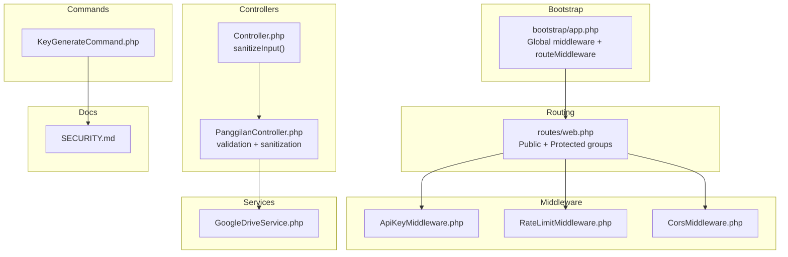
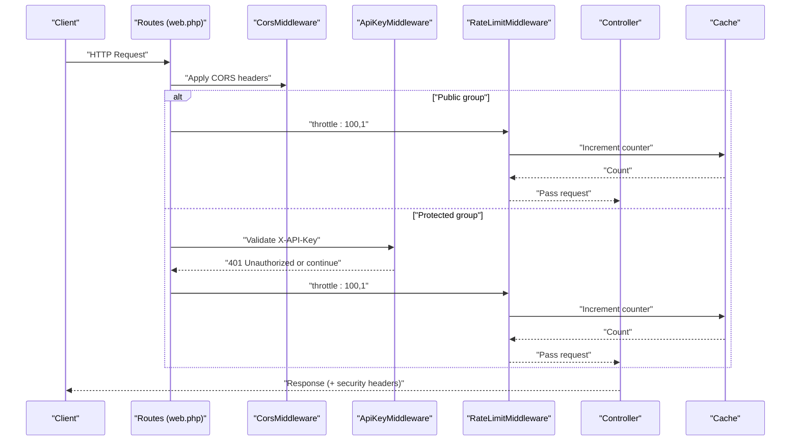
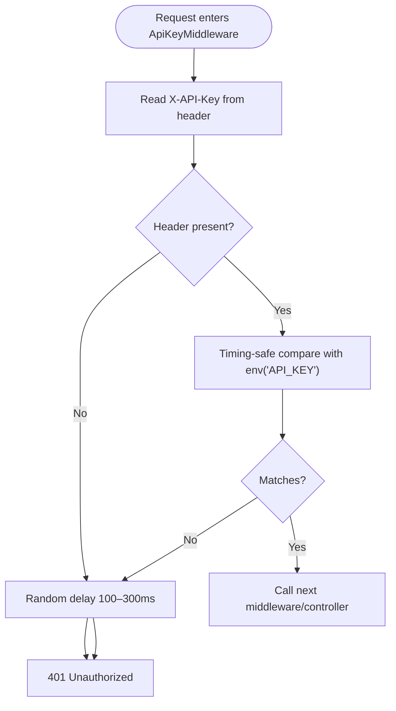
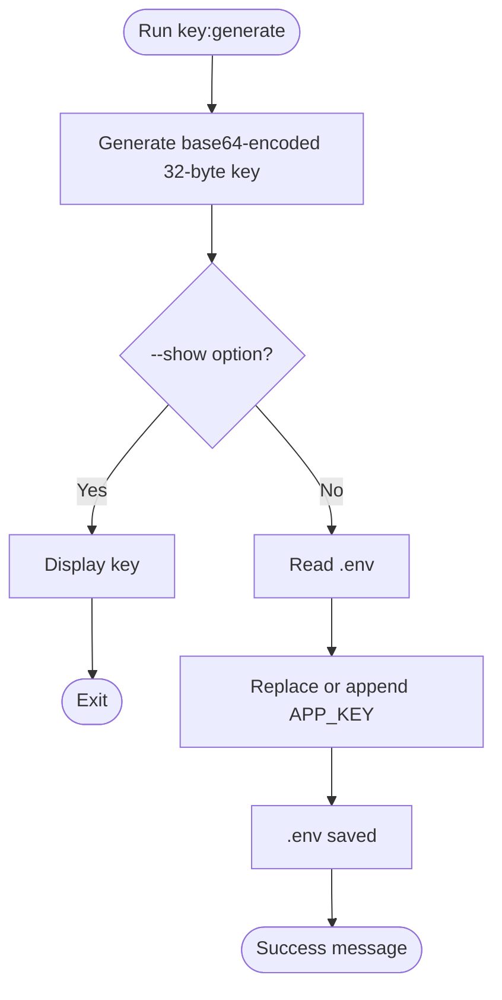
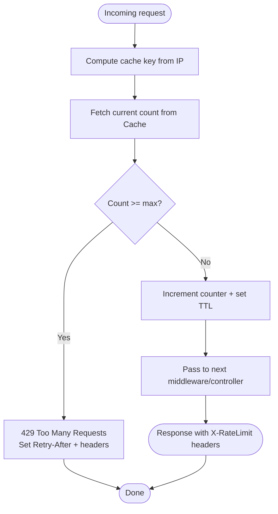
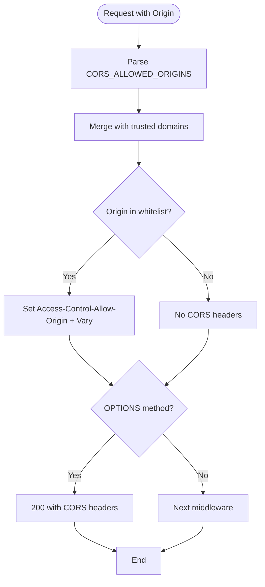
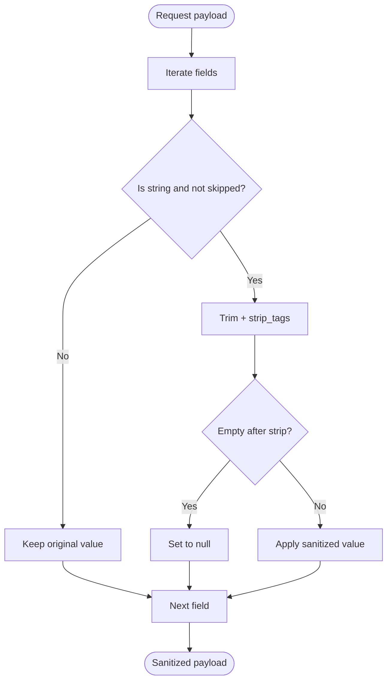
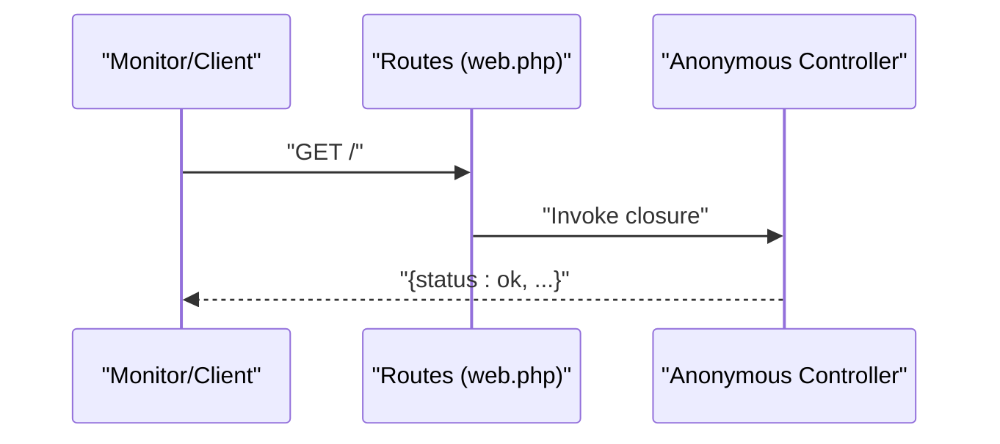
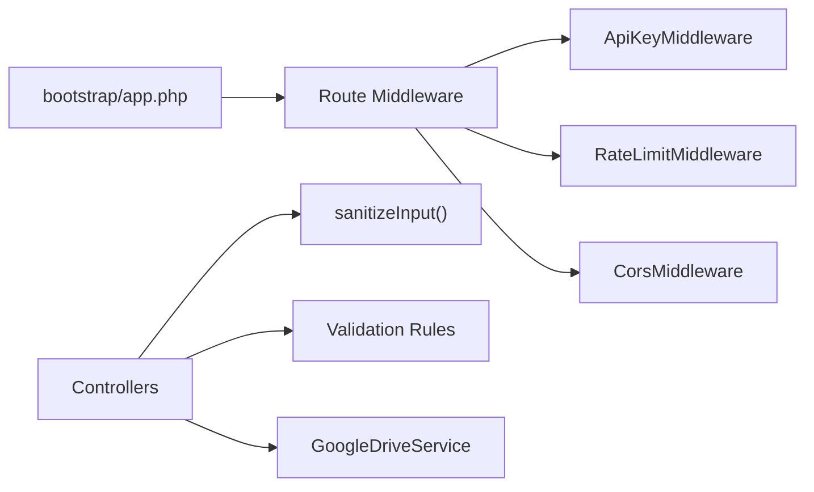

# Authentication & Security

<cite>
**Referenced Files in This Document**
- [KeyGenerateCommand.php](file://app/Console/Commands/KeyGenerateCommand.php)
- [ApiKeyMiddleware.php](file://app/Http/Middleware/ApiKeyMiddleware.php)
- [RateLimitMiddleware.php](file://app/Http/Middleware/RateLimitMiddleware.php)
- [CorsMiddleware.php](file://app/Http/Middleware/CorsMiddleware.php)
- [Handler.php](file://app/Exceptions/Handler.php)
- [Controller.php](file://app/Http/Controllers/Controller.php)
- [PanggilanController.php](file://app/Http/Controllers/PanggilanController.php)
- [app.php](file://bootstrap/app.php)
- [web.php](file://routes/web.php)
- [SECURITY.md](file://SECURITY.md)
- [GoogleDriveService.php](file://app/Services/GoogleDriveService.php)
</cite>

## Table of Contents
1. [Introduction](#introduction)
2. [Project Structure](#project-structure)
3. [Core Components](#core-components)
4. [Architecture Overview](#architecture-overview)
5. [Detailed Component Analysis](#detailed-component-analysis)
6. [Dependency Analysis](#dependency-analysis)
7. [Performance Considerations](#performance-considerations)
8. [Troubleshooting Guide](#troubleshooting-guide)
9. [Conclusion](#conclusion)
10. [Appendices](#appendices)

## Introduction
This document explains the authentication and security model of the API. It covers:
- API key authentication via a dedicated header and timing-safe validation
- How to generate secure API keys using the provided command
- Rate limiting with cache-backed counters and Retry-After headers
- Security middleware configuration, strict CORS settings, and input sanitization patterns
- Practical examples of authenticated requests, error responses, and best practices
- Health check endpoint and system status monitoring

## Project Structure
Security-related components are organized under app/Console, app/Http/Middleware, app/Exceptions, app/Http/Controllers, and app/Services. Routing defines public and protected groups with middleware attached.

**Diagram sources**
- [app.php:21-30](file://bootstrap/app.php#L21-L30)
- [web.php:13-164](file://routes/web.php#L13-L164)
- [ApiKeyMiddleware.php:14-39](file://app/Http/Middleware/ApiKeyMiddleware.php#L14-L39)
- [RateLimitMiddleware.php:15-39](file://app/Http/Middleware/RateLimitMiddleware.php#L15-L39)
- [CorsMiddleware.php:14-62](file://app/Http/Middleware/CorsMiddleware.php#L14-L62)
- [Controller.php:18-29](file://app/Http/Controllers/Controller.php#L18-L29)
- [PanggilanController.php:115-198](file://app/Http/Controllers/PanggilanController.php#L115-L198)
- [KeyGenerateCommand.php:23-50](file://app/Console/Commands/KeyGenerateCommand.php#L23-L50)
- [SECURITY.md:11-51](file://SECURITY.md#L11-L51)

**Section sources**
- [app.php:21-30](file://bootstrap/app.php#L21-L30)
- [web.php:13-164](file://routes/web.php#L13-L164)
- [SECURITY.md:11-51](file://SECURITY.md#L11-L51)

## Core Components
- API Key Authentication: Validates the X-API-Key header using timing-safe comparison and adds a randomized delay on failure.
- Rate Limiting: Enforces per-IP limits using cache-backed counters and returns Retry-After headers.
- CORS: Strict origin whitelisting with security headers and preflight handling.
- Input Sanitization: Removes HTML tags and trims strings across all controllers.
- Exception Handling: Ensures security headers are present on all error responses.

**Section sources**
- [ApiKeyMiddleware.php:14-39](file://app/Http/Middleware/ApiKeyMiddleware.php#L14-L39)
- [RateLimitMiddleware.php:15-39](file://app/Http/Middleware/RateLimitMiddleware.php#L15-L39)
- [CorsMiddleware.php:14-62](file://app/Http/Middleware/CorsMiddleware.php#L14-L62)
- [Controller.php:18-29](file://app/Http/Controllers/Controller.php#L18-L29)
- [Handler.php:36-132](file://app/Exceptions/Handler.php#L36-L132)

## Architecture Overview
The request lifecycle applies global CORS, then routes apply either public throttling or protected middleware stacks (API key + throttling). Controllers enforce validation and sanitization.

**Diagram sources**
- [web.php:13-164](file://routes/web.php#L13-L164)
- [CorsMiddleware.php:14-62](file://app/Http/Middleware/CorsMiddleware.php#L14-L62)
- [ApiKeyMiddleware.php:14-39](file://app/Http/Middleware/ApiKeyMiddleware.php#L14-L39)
- [RateLimitMiddleware.php:15-39](file://app/Http/Middleware/RateLimitMiddleware.php#L15-L39)
- [app.php:21-30](file://bootstrap/app.php#L21-L30)

## Detailed Component Analysis

### API Key Authentication
- Header requirement: X-API-Key must be present on protected write operations.
- Validation: Uses timing-safe comparison to prevent timing attacks.
- Failure handling: Adds a randomized delay to deter brute force and responds with 401 Unauthorized.
- Configuration: Requires a strong secret stored in the environment.

**Diagram sources**
- [ApiKeyMiddleware.php:14-39](file://app/Http/Middleware/ApiKeyMiddleware.php#L14-L39)

**Section sources**
- [ApiKeyMiddleware.php:14-39](file://app/Http/Middleware/ApiKeyMiddleware.php#L14-L39)
- [SECURITY.md:11-16](file://SECURITY.md#L11-L16)

### API Key Generation
- Generates a cryptographically secure key and writes it to the environment file.
- Can optionally print the key without modifying files.

**Diagram sources**
- [KeyGenerateCommand.php:23-50](file://app/Console/Commands/KeyGenerateCommand.php#L23-L50)

**Section sources**
- [KeyGenerateCommand.php:23-50](file://app/Console/Commands/KeyGenerateCommand.php#L23-L50)
- [SECURITY.md:65-71](file://SECURITY.md#L65-L71)

### Rate Limiting
- Throttling policy:
  - Public endpoints: 100 requests per minute per IP
  - Protected endpoints: 100 requests per minute per IP (as configured in routes)
- Implementation:
  - Cache-backed counters keyed by a hashed client IP
  - On limit exceeded: 429 with Retry-After header and X-RateLimit-* headers
  - Identifier excludes User-Agent to prevent easy bypass

**Diagram sources**
- [RateLimitMiddleware.php:15-39](file://app/Http/Middleware/RateLimitMiddleware.php#L15-L39)

**Section sources**
- [RateLimitMiddleware.php:15-39](file://app/Http/Middleware/RateLimitMiddleware.php#L15-L39)
- [web.php:14](file://routes/web.php#L14)
- [web.php:79](file://routes/web.php#L79)
- [SECURITY.md:17-22](file://SECURITY.md#L17-L22)

### CORS Settings
- Origins: Strict whitelist loaded from environment plus trusted domains; localhost allowed in local environments.
- Headers: Access-Control-Allow-Methods, Access-Control-Allow-Headers, Access-Control-Max-Age, plus security headers.
- Preflight: Properly handled with 200 responses.
- Error responses: Security headers included even on exceptions.

**Diagram sources**
- [CorsMiddleware.php:14-62](file://app/Http/Middleware/CorsMiddleware.php#L14-L62)
- [Handler.php:36-55](file://app/Exceptions/Handler.php#L36-L55)

**Section sources**
- [CorsMiddleware.php:14-62](file://app/Http/Middleware/CorsMiddleware.php#L14-L62)
- [Handler.php:36-55](file://app/Exceptions/Handler.php#L36-L55)
- [SECURITY.md:36-41](file://SECURITY.md#L36-L41)

### Input Sanitization Patterns
- Controllers sanitize string inputs by removing HTML tags and trimming whitespace.
- Some fields intentionally skipped (e.g., URLs, identifiers) to preserve intended content.
- Additional protections include strict validation rules and allowed MIME-type checks for uploads.

**Diagram sources**
- [Controller.php:18-29](file://app/Http/Controllers/Controller.php#L18-L29)
- [PanggilanController.php:118-136](file://app/Http/Controllers/PanggilanController.php#L118-L136)

**Section sources**
- [Controller.php:18-29](file://app/Http/Controllers/Controller.php#L18-L29)
- [PanggilanController.php:118-136](file://app/Http/Controllers/PanggilanController.php#L118-L136)
- [SECURITY.md:23-29](file://SECURITY.md#L23-L29)

### Exception Handling and Security Headers
- All error responses include security headers (X-Content-Type-Options, X-Frame-Options, X-XSS-Protection).
- CORS headers are also applied when the origin is trusted.
- Production mode suppresses sensitive exception details.

**Section sources**
- [Handler.php:36-132](file://app/Exceptions/Handler.php#L36-L132)
- [SECURITY.md:30-35](file://SECURITY.md#L30-L35)

### Health Check and Status Monitoring
- Root endpoint returns a simple JSON status for system monitoring.
- Use this endpoint to verify service availability and basic routing.

**Diagram sources**
- [web.php:5-11](file://routes/web.php#L5-L11)

**Section sources**
- [web.php:5-11](file://routes/web.php#L5-L11)

## Dependency Analysis
- Global middleware: CORS applied to all requests.
- Route middleware: api.key and throttle applied selectively.
- Controllers depend on shared sanitization utilities and validation rules.
- Uploads leverage Google Drive service with fallback to local storage.

**Diagram sources**
- [app.php:21-30](file://bootstrap/app.php#L21-L30)
- [web.php:13-164](file://routes/web.php#L13-L164)
- [Controller.php:18-29](file://app/Http/Controllers/Controller.php#L18-L29)
- [GoogleDriveService.php:38-42](file://app/Services/GoogleDriveService.php#L38-L42)

**Section sources**
- [app.php:21-30](file://bootstrap/app.php#L21-L30)
- [web.php:13-164](file://routes/web.php#L13-L164)
- [Controller.php:18-29](file://app/Http/Controllers/Controller.php#L18-L29)
- [GoogleDriveService.php:38-42](file://app/Services/GoogleDriveService.php#L38-L42)

## Performance Considerations
- Cache-backed counters avoid database overhead; ensure cache backend is tuned for high throughput.
- Timing-safe comparisons and randomized delays add negligible overhead compared to the security benefits.
- Sanitization is O(n) over input size; keep payloads reasonable to minimize processing time.

[No sources needed since this section provides general guidance]

## Troubleshooting Guide
Common issues and resolutions:
- 401 Unauthorized on protected endpoints:
  - Ensure X-API-Key header matches the configured secret.
  - Verify the environment variable is set and not empty.
- 429 Too Many Requests:
  - Respect Retry-After seconds and reduce request frequency.
  - Consider batching or caching responses client-side.
- CORS errors:
  - Confirm the Origin is in the whitelist and trusted domains.
  - Check that preflight OPTIONS requests receive appropriate headers.
- Validation failures:
  - Review field constraints and adjust payloads accordingly.
- Upload failures:
  - Confirm Google Drive service credentials and fallback storage permissions.

**Section sources**
- [ApiKeyMiddleware.php:14-39](file://app/Http/Middleware/ApiKeyMiddleware.php#L14-L39)
- [RateLimitMiddleware.php:22-28](file://app/Http/Middleware/RateLimitMiddleware.php#L22-L28)
- [CorsMiddleware.php:44-59](file://app/Http/Middleware/CorsMiddleware.php#L44-L59)
- [PanggilanController.php:118-136](file://app/Http/Controllers/PanggilanController.php#L118-L136)
- [Handler.php:57-95](file://app/Exceptions/Handler.php#L57-L95)

## Conclusion
The API employs layered security: strict CORS, API key authentication with timing-safe validation, robust rate limiting, and input sanitization. Consumers should use the documented headers, adhere to rate limits, and follow production hardening guidelines to ensure reliable and secure access.

[No sources needed since this section summarizes without analyzing specific files]

## Appendices

### Practical Examples

- Generate a new API key:
  - Use the provided command to create a secure key and update the environment file.
  - Reference: [KeyGenerateCommand.php:23-50](file://app/Console/Commands/KeyGenerateCommand.php#L23-L50)

- Make an authenticated request:
  - Include the X-API-Key header on write operations (POST/PUT/DELETE).
  - Example header: X-API-Key: YOUR_SECRET_KEY
  - Reference: [ApiKeyMiddleware.php:16-17](file://app/Http/Middleware/ApiKeyMiddleware.php#L16-L17), [web.php:79-164](file://routes/web.php#L79-L164)

- Handle rate limit responses:
  - Expect 429 with Retry-After header when exceeding limits.
  - Inspect X-RateLimit-Limit and X-RateLimit-Remaining for diagnostics.
  - Reference: [RateLimitMiddleware.php:22-38](file://app/Http/Middleware/RateLimitMiddleware.php#L22-L38)

- Health check:
  - GET the root endpoint to confirm service availability.
  - Reference: [web.php:5-11](file://routes/web.php#L5-L11)

### Security Best Practices for API Consumers
- Never expose API keys in client-side code or logs.
- Rotate keys periodically and revoke compromised keys immediately.
- Implement exponential backoff on 429 responses.
- Validate and sanitize all user-supplied inputs before sending requests.
- Monitor Retry-After and rate-limit headers to self-throttle.

**Section sources**
- [SECURITY.md:54-84](file://SECURITY.md#L54-L84)
- [RateLimitMiddleware.php:22-38](file://app/Http/Middleware/RateLimitMiddleware.php#L22-L38)
- [web.php:5-11](file://routes/web.php#L5-L11)