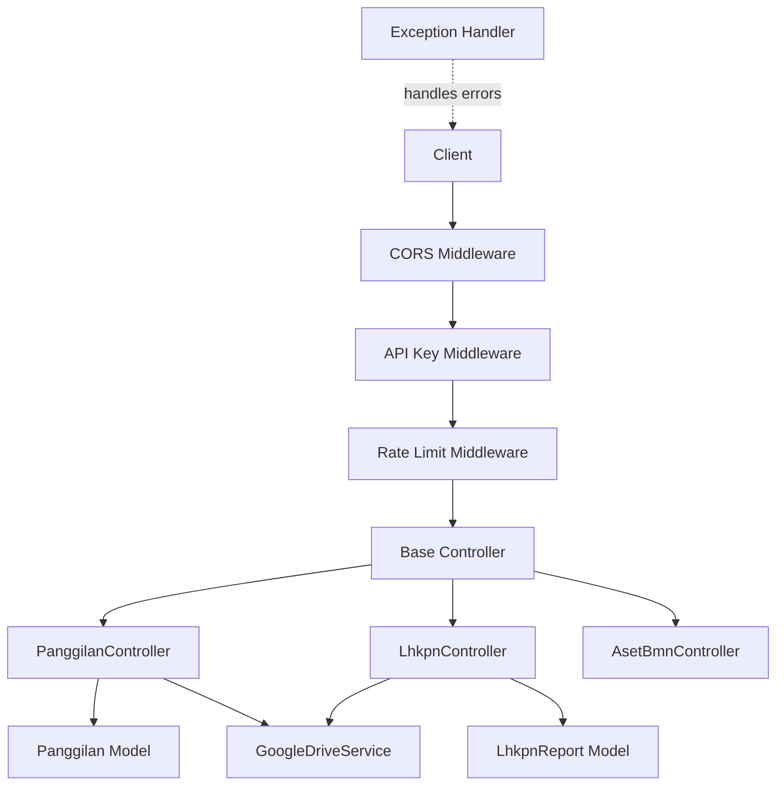
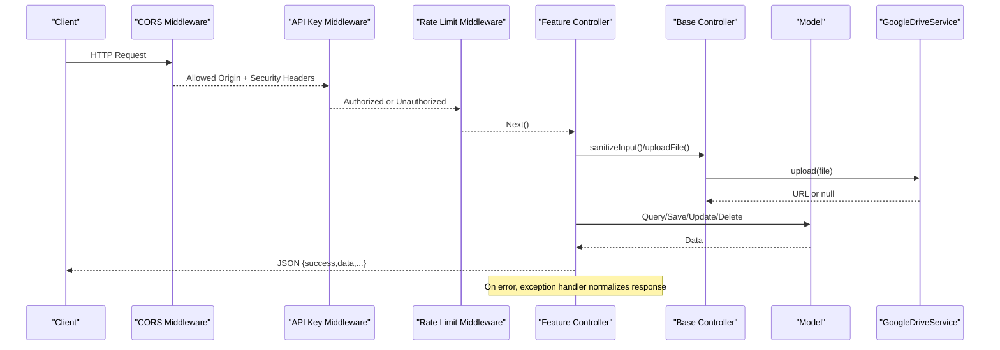
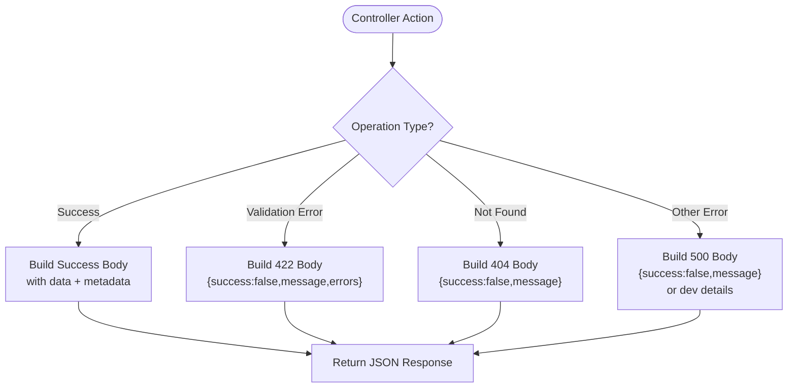
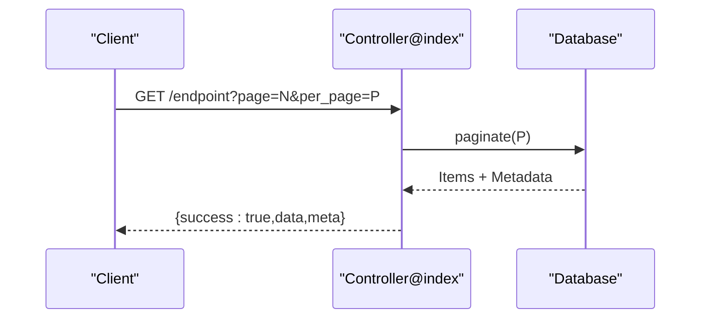
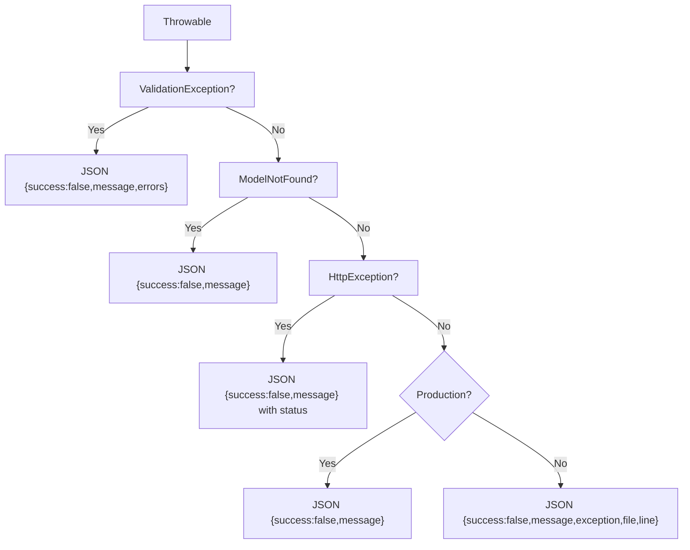
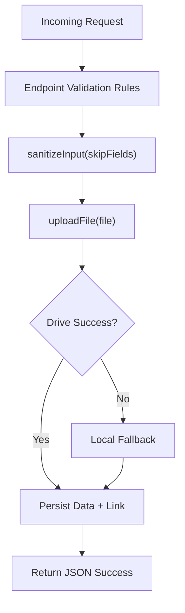
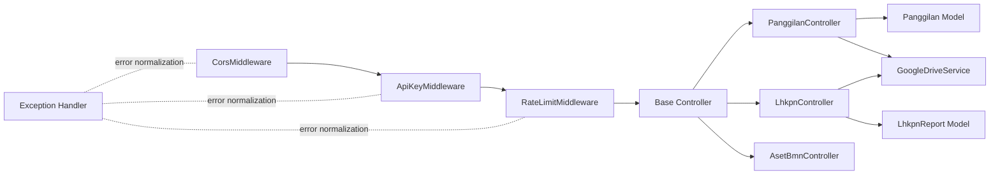

# Common API Patterns & Standards

<cite>
**Referenced Files in This Document**
- [CorsMiddleware.php](file://app/Http/Middleware/CorsMiddleware.php)
- [ApiKeyMiddleware.php](file://app/Http/Middleware/ApiKeyMiddleware.php)
- [RateLimitMiddleware.php](file://app/Http/Middleware/RateLimitMiddleware.php)
- [Handler.php](file://app/Exceptions/Handler.php)
- [Controller.php](file://app/Http/Controllers/Controller.php)
- [PanggilanController.php](file://app/Http/Controllers/PanggilanController.php)
- [LhkpnController.php](file://app/Http/Controllers/LhkpnController.php)
- [AsetBmnController.php](file://app/Http/Controllers/AsetBmnController.php)
- [Panggilan.php](file://app/Models/Panggilan.php)
- [LhkpnReport.php](file://app/Models/LhkpnReport.php)
- [GoogleDriveService.php](file://app/Services/GoogleDriveService.php)
- [SECURITY.md](file://SECURITY.md)
- [.htaccess](file://public/.htaccess)
</cite>

## Table of Contents
1. [Introduction](#introduction)
2. [Project Structure](#project-structure)
3. [Core Components](#core-components)
4. [Architecture Overview](#architecture-overview)
5. [Detailed Component Analysis](#detailed-component-analysis)
6. [Dependency Analysis](#dependency-analysis)
7. [Performance Considerations](#performance-considerations)
8. [Troubleshooting Guide](#troubleshooting-guide)
9. [Conclusion](#conclusion)
10. [Appendices](#appendices)

## Introduction
This document defines the common API patterns and standards used across all endpoints in the backend. It covers the standardized JSON response format, pagination and cursor navigation, error handling, input validation and sanitization, XSS prevention, data transformation, CORS configuration, content-type handling, response caching strategies, common query parameters, sorting and filtering, search functionality, and API versioning and deprecation policies.

## Project Structure
The API follows a layered structure:
- Middleware for CORS, API key authentication, and rate limiting
- Base controller with shared utilities (input sanitization, file upload)
- Feature-specific controllers implementing CRUD operations
- Models defining fillable attributes, casting, and output formatting
- Exception handler centralizing error responses and security headers
- Google Drive service for cloud file uploads with fallback to local storage
- Public .htaccess enforcing security headers and rewrites

**Diagram sources**
- [CorsMiddleware.php:14-62](file://app/Http/Middleware/CorsMiddleware.php#L14-L62)
- [ApiKeyMiddleware.php:14-39](file://app/Http/Middleware/ApiKeyMiddleware.php#L14-L39)
- [RateLimitMiddleware.php:15-39](file://app/Http/Middleware/RateLimitMiddleware.php#L15-L39)
- [Controller.php:18-95](file://app/Http/Controllers/Controller.php#L18-L95)
- [PanggilanController.php:31-56](file://app/Http/Controllers/PanggilanController.php#L31-L56)
- [LhkpnController.php:11-53](file://app/Http/Controllers/LhkpnController.php#L11-L53)
- [AsetBmnController.php:32-53](file://app/Http/Controllers/AsetBmnController.php#L32-L53)
- [Panggilan.php:11-32](file://app/Models/Panggilan.php#L11-L32)
- [LhkpnReport.php:11-22](file://app/Models/LhkpnReport.php#L11-L22)
- [GoogleDriveService.php:38-82](file://app/Services/GoogleDriveService.php#L38-L82)
- [Handler.php:36-132](file://app/Exceptions/Handler.php#L36-L132)

**Section sources**
- [CorsMiddleware.php:14-62](file://app/Http/Middleware/CorsMiddleware.php#L14-L62)
- [ApiKeyMiddleware.php:14-39](file://app/Http/Middleware/ApiKeyMiddleware.php#L14-L39)
- [RateLimitMiddleware.php:15-39](file://app/Http/Middleware/RateLimitMiddleware.php#L15-L39)
- [Controller.php:18-95](file://app/Http/Controllers/Controller.php#L18-L95)
- [PanggilanController.php:31-56](file://app/Http/Controllers/PanggilanController.php#L31-L56)
- [LhkpnController.php:11-53](file://app/Http/Controllers/LhkpnController.php#L11-L53)
- [AsetBmnController.php:32-53](file://app/Http/Controllers/AsetBmnController.php#L32-L53)
- [Panggilan.php:11-32](file://app/Models/Panggilan.php#L11-L32)
- [LhkpnReport.php:11-22](file://app/Models/LhkpnReport.php#L11-L22)
- [GoogleDriveService.php:38-82](file://app/Services/GoogleDriveService.php#L38-L82)
- [Handler.php:36-132](file://app/Exceptions/Handler.php#L36-L132)
- [.htaccess:38-45](file://public/.htaccess#L38-L45)

## Core Components
- Standardized JSON response format:
  - Success responses include a boolean flag, payload data, and metadata for pagination.
  - Error responses include a boolean flag, a human-readable message, and optional structured validation errors.
- Pagination:
  - Implemented via framework pagination helpers returning items plus metadata (current_page, last_page, per_page, total).
  - Default page size varies by endpoint; consult individual controller index methods for specifics.
- Cursor-based navigation:
  - Not implemented. Pagination uses page-based navigation with page number and per-page size.
- Error handling:
  - Centralized in the exception handler with consistent JSON error bodies and security headers.
  - Differentiates validation, resource-not-found, HTTP exceptions, and unhandled exceptions.
- Input validation and sanitization:
  - Strict validation rules per endpoint using framework validation mechanisms.
  - Base controller provides a sanitization utility that strips HTML tags and trims strings, with configurable skip fields.
- XSS prevention:
  - Sanitization of textual inputs, strict CORS policy, and security headers enforced at middleware and exception handler levels.
- Data transformation:
  - Models cast dates to standardized formats and expose formatted getters for consistent output.
- CORS configuration:
  - Origin whitelisting with trusted domains, method and header allowances, preflight handling, and security headers.
- Content-type handling:
  - Enforced via middleware and public .htaccess; includes nosniff, frame options, and XSS protection.
- Response caching strategies:
  - Not implemented at the API level; clients and integrators should implement appropriate caching.

**Section sources**
- [PanggilanController.php:49-56](file://app/Http/Controllers/PanggilanController.php#L49-L56)
- [LhkpnController.php:45-52](file://app/Http/Controllers/LhkpnController.php#L45-L52)
- [AsetBmnController.php:49-53](file://app/Http/Controllers/AsetBmnController.php#L49-L53)
- [Handler.php:58-95](file://app/Exceptions/Handler.php#L58-L95)
- [Controller.php:18-29](file://app/Http/Controllers/Controller.php#L18-L29)
- [CorsMiddleware.php:33-47](file://app/Http/Middleware/CorsMiddleware.php#L33-L47)
- [.htaccess:38-45](file://public/.htaccess#L38-L45)
- [Panggilan.php:25-53](file://app/Models/Panggilan.php#L25-L53)
- [LhkpnReport.php:24-27](file://app/Models/LhkpnReport.php#L24-L27)

## Architecture Overview
The API enforces a consistent flow:
- Requests pass through CORS middleware, then optional API key middleware, then rate limiter, and finally reach the base controller or feature controllers.
- Controllers validate inputs, sanitize text fields, optionally upload files to Google Drive with local fallback, and return standardized JSON responses.
- Errors are normalized by the exception handler, ensuring consistent error payloads and security headers.

**Diagram sources**
- [CorsMiddleware.php:14-62](file://app/Http/Middleware/CorsMiddleware.php#L14-L62)
- [ApiKeyMiddleware.php:14-39](file://app/Http/Middleware/ApiKeyMiddleware.php#L14-L39)
- [RateLimitMiddleware.php:15-39](file://app/Http/Middleware/RateLimitMiddleware.php#L15-L39)
- [Controller.php:18-95](file://app/Http/Controllers/Controller.php#L18-L95)
- [PanggilanController.php:115-197](file://app/Http/Controllers/PanggilanController.php#L115-L197)
- [LhkpnController.php:55-89](file://app/Http/Controllers/LhkpnController.php#L55-L89)
- [AsetBmnController.php:71-104](file://app/Http/Controllers/AsetBmnController.php#L71-L104)
- [Panggilan.php:11-32](file://app/Models/Panggilan.php#L11-L32)
- [GoogleDriveService.php:38-82](file://app/Services/GoogleDriveService.php#L38-L82)
- [Handler.php:36-132](file://app/Exceptions/Handler.php#L36-L132)

## Detailed Component Analysis

### Standardized JSON Response Format
- Success body:
  - Fields: success (boolean), data (object or array), and pagination metadata (when applicable).
  - Pagination metadata: current_page, last_page, per_page, total.
- Error body:
  - Fields: success (boolean), message (string), and optional errors (object) for validation failures.

**Diagram sources**
- [PanggilanController.php:49-56](file://app/Http/Controllers/PanggilanController.php#L49-L56)
- [LhkpnController.php:45-52](file://app/Http/Controllers/LhkpnController.php#L45-L52)
- [Handler.php:58-95](file://app/Exceptions/Handler.php#L58-L95)

**Section sources**
- [PanggilanController.php:49-56](file://app/Http/Controllers/PanggilanController.php#L49-L56)
- [LhkpnController.php:45-52](file://app/Http/Controllers/LhkpnController.php#L45-L52)
- [Handler.php:58-95](file://app/Exceptions/Handler.php#L58-L95)

### Pagination Implementation
- Page-based pagination with metadata returned alongside items.
- Default page sizes vary by endpoint; consult controller index methods for specifics.
- Sorting is applied consistently (e.g., creation date descending).

**Diagram sources**
- [PanggilanController.php:31-56](file://app/Http/Controllers/PanggilanController.php#L31-L56)
- [LhkpnController.php:11-53](file://app/Http/Controllers/LhkpnController.php#L11-L53)
- [AsetBmnController.php:32-53](file://app/Http/Controllers/AsetBmnController.php#L32-L53)

**Section sources**
- [PanggilanController.php:31-56](file://app/Http/Controllers/PanggilanController.php#L31-L56)
- [LhkpnController.php:11-53](file://app/Http/Controllers/LhkpnController.php#L11-L53)
- [AsetBmnController.php:32-53](file://app/Http/Controllers/AsetBmnController.php#L32-L53)

### Cursor-Based Navigation
- Not implemented. The system relies on page-based pagination with explicit metadata.

**Section sources**
- [PanggilanController.php:46-56](file://app/Http/Controllers/PanggilanController.php#L46-L56)
- [LhkpnController.php:42-52](file://app/Http/Controllers/LhkpnController.php#L42-L52)
- [AsetBmnController.php:43-47](file://app/Http/Controllers/AsetBmnController.php#L43-L47)

### Error Handling Patterns
- Validation errors return structured errors keyed by field.
- Resource-not-found returns a generic message.
- HTTP exceptions preserve status and message.
- Unhandled exceptions return a generic server error in production and include details in development.

**Diagram sources**
- [Handler.php:58-131](file://app/Exceptions/Handler.php#L58-L131)

**Section sources**
- [Handler.php:58-131](file://app/Exceptions/Handler.php#L58-L131)

### Input Validation and Sanitization
- Strict validation rules per endpoint using framework validators.
- Base controller sanitizes string inputs by stripping HTML tags and trimming; skip fields can be configured.
- File uploads validated by MIME type detection and stored either to Google Drive (preferred) or local storage with fallback.

**Diagram sources**
- [PanggilanController.php:118-130](file://app/Http/Controllers/PanggilanController.php#L118-L130)
- [LhkpnController.php:57-68](file://app/Http/Controllers/LhkpnController.php#L57-L68)
- [AsetBmnController.php:73-81](file://app/Http/Controllers/AsetBmnController.php#L73-L81)
- [Controller.php:18-29](file://app/Http/Controllers/Controller.php#L18-L29)
- [Controller.php:40-95](file://app/Http/Controllers/Controller.php#L40-L95)

**Section sources**
- [PanggilanController.php:118-130](file://app/Http/Controllers/PanggilanController.php#L118-L130)
- [LhkpnController.php:57-68](file://app/Http/Controllers/LhkpnController.php#L57-L68)
- [AsetBmnController.php:73-81](file://app/Http/Controllers/AsetBmnController.php#L73-L81)
- [Controller.php:18-29](file://app/Http/Controllers/Controller.php#L18-L29)
- [Controller.php:40-95](file://app/Http/Controllers/Controller.php#L40-L95)

### XSS Prevention Measures
- Textual inputs sanitized via strip_tags and trimming.
- Strict CORS policy with whitelisted origins and security headers.
- Additional security headers enforced at the web server level.

**Section sources**
- [Controller.php:18-29](file://app/Http/Controllers/Controller.php#L18-L29)
- [CorsMiddleware.php:33-47](file://app/Http/Middleware/CorsMiddleware.php#L33-L47)
- [.htaccess:38-45](file://public/.htaccess#L38-L45)

### Data Transformation Patterns
- Models cast date fields to standardized formats and expose formatted getters for consistent output.
- Date fields are normalized to YYYY-MM-DD strings for API responses.

**Section sources**
- [Panggilan.php:25-53](file://app/Models/Panggilan.php#L25-L53)
- [LhkpnReport.php:24-27](file://app/Models/LhkpnReport.php#L24-L27)

### CORS Configuration
- Origins whitelisted via environment variable and trusted domains; preflight requests handled.
- Security headers included for all responses, including error responses.

**Section sources**
- [CorsMiddleware.php:16-47](file://app/Http/Middleware/CorsMiddleware.php#L16-L47)
- [Handler.php:39-55](file://app/Exceptions/Handler.php#L39-L55)

### Content-Type Handling
- Content-Type enforcement via middleware and public .htaccess.
- Security headers include X-Content-Type-Options: nosniff.

**Section sources**
- [CorsMiddleware.php:33-40](file://app/Http/Middleware/CorsMiddleware.php#L33-L40)
- [.htaccess:38-45](file://public/.htaccess#L38-L45)

### Response Caching Strategies
- No built-in caching at the API level; recommended to implement client-side or reverse-proxy caching as needed.

**Section sources**
- [SECURITY.md:424-441](file://SECURITY.md#L424-L441)

### Common Query Parameters, Sorting, Filtering, and Search
- Common parameters:
  - tahun (integer filter, validated range)
  - per_page (pagination size)
  - page (page number)
  - q (free-text search across relevant fields)
- Sorting:
  - Creation time descending by default; some endpoints apply custom ordering logic.
- Filtering:
  - Year filters and additional category filters where supported.

**Section sources**
- [PanggilanController.php:35-41](file://app/Http/Controllers/PanggilanController.php#L35-L41)
- [LhkpnController.php:15-40](file://app/Http/Controllers/LhkpnController.php#L15-L40)
- [AsetBmnController.php:36-47](file://app/Http/Controllers/AsetBmnController.php#L36-L47)

### API Versioning Approach
- No explicit versioning scheme is present in the controllers or middleware.
- Recommendations:
  - Use path-based versioning (e.g., /api/v1/…).
  - Maintain backward compatibility by introducing new endpoints rather than changing existing ones.
  - Announce breaking changes with deprecation timelines and migration guides.

**Section sources**
- [PanggilanController.php:31-56](file://app/Http/Controllers/PanggilanController.php#L31-L56)
- [LhkpnController.php:11-53](file://app/Http/Controllers/LhkpnController.php#L11-L53)
- [AsetBmnController.php:32-53](file://app/Http/Controllers/AsetBmnController.php#L32-L53)

## Dependency Analysis

**Diagram sources**
- [CorsMiddleware.php:14-62](file://app/Http/Middleware/CorsMiddleware.php#L14-L62)
- [ApiKeyMiddleware.php:14-39](file://app/Http/Middleware/ApiKeyMiddleware.php#L14-L39)
- [RateLimitMiddleware.php:15-39](file://app/Http/Middleware/RateLimitMiddleware.php#L15-L39)
- [Controller.php:18-95](file://app/Http/Controllers/Controller.php#L18-L95)
- [PanggilanController.php:31-56](file://app/Http/Controllers/PanggilanController.php#L31-L56)
- [LhkpnController.php:11-53](file://app/Http/Controllers/LhkpnController.php#L11-L53)
- [AsetBmnController.php:32-53](file://app/Http/Controllers/AsetBmnController.php#L32-L53)
- [Panggilan.php:11-32](file://app/Models/Panggilan.php#L11-L32)
- [LhkpnReport.php:11-22](file://app/Models/LhkpnReport.php#L11-L22)
- [GoogleDriveService.php:38-82](file://app/Services/GoogleDriveService.php#L38-L82)
- [Handler.php:36-132](file://app/Exceptions/Handler.php#L36-L132)

**Section sources**
- [CorsMiddleware.php:14-62](file://app/Http/Middleware/CorsMiddleware.php#L14-L62)
- [ApiKeyMiddleware.php:14-39](file://app/Http/Middleware/ApiKeyMiddleware.php#L14-L39)
- [RateLimitMiddleware.php:15-39](file://app/Http/Middleware/RateLimitMiddleware.php#L15-L39)
- [Controller.php:18-95](file://app/Http/Controllers/Controller.php#L18-L95)
- [PanggilanController.php:31-56](file://app/Http/Controllers/PanggilanController.php#L31-L56)
- [LhkpnController.php:11-53](file://app/Http/Controllers/LhkpnController.php#L11-L53)
- [AsetBmnController.php:32-53](file://app/Http/Controllers/AsetBmnController.php#L32-L53)
- [Panggilan.php:11-32](file://app/Models/Panggilan.php#L11-L32)
- [LhkpnReport.php:11-22](file://app/Models/LhkpnReport.php#L11-L22)
- [GoogleDriveService.php:38-82](file://app/Services/GoogleDriveService.php#L38-L82)
- [Handler.php:36-132](file://app/Exceptions/Handler.php#L36-L132)

## Performance Considerations
- Pagination limits prevent excessive memory usage; enforce reasonable per_page caps.
- Rate limiting protects against abuse; tune thresholds per endpoint sensitivity.
- File uploads prefer cloud storage for scalability; local fallback ensures resilience.

**Section sources**
- [PanggilanController.php:44-44](file://app/Http/Controllers/PanggilanController.php#L44-L44)
- [RateLimitMiddleware.php:15-39](file://app/Http/Middleware/RateLimitMiddleware.php#L15-L39)
- [GoogleDriveService.php:38-82](file://app/Services/GoogleDriveService.php#L38-L82)

## Troubleshooting Guide
- Authentication failures:
  - Verify API key presence and correctness; ensure timing-safe comparison passes.
- Rate limit exceeded:
  - Respect Retry-After header; reduce request frequency.
- Validation errors:
  - Inspect structured errors in the response body for field-specific messages.
- CORS blocked:
  - Confirm origin is whitelisted and preflight requests return allowed methods/headers.
- File upload failures:
  - Check Google Drive service availability; confirm fallback to local storage logs.

**Section sources**
- [ApiKeyMiddleware.php:27-36](file://app/Http/Middleware/ApiKeyMiddleware.php#L27-L36)
- [RateLimitMiddleware.php:22-27](file://app/Http/Middleware/RateLimitMiddleware.php#L22-L27)
- [Handler.php:58-68](file://app/Exceptions/Handler.php#L58-L68)
- [CorsMiddleware.php:42-53](file://app/Http/Middleware/CorsMiddleware.php#L42-L53)
- [Controller.php:62-95](file://app/Http/Controllers/Controller.php#L62-L95)

## Conclusion
The API establishes consistent patterns for responses, pagination, error handling, validation, sanitization, and security. While cursor-based pagination is not implemented, the current design provides robust page-based navigation, strong CORS and security headers, and resilient file upload handling. Adopting explicit versioning and deprecation policies will further improve long-term maintainability and developer experience.

## Appendices
- Security configuration checklist and recommendations are documented separately for production deployment.

**Section sources**
- [SECURITY.md:54-107](file://SECURITY.md#L54-L107)