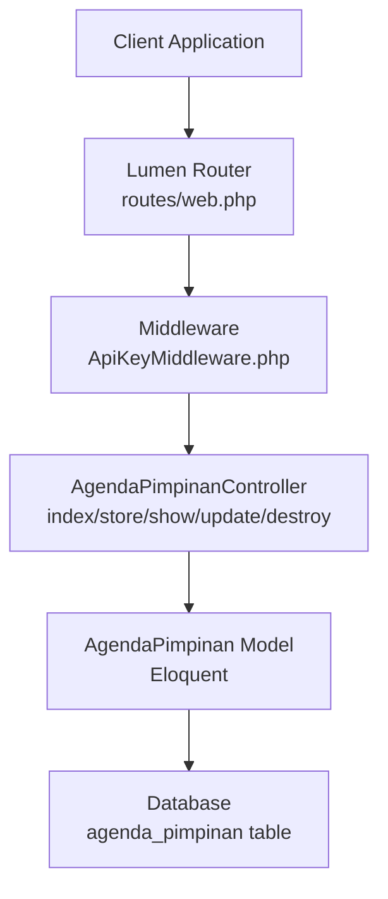
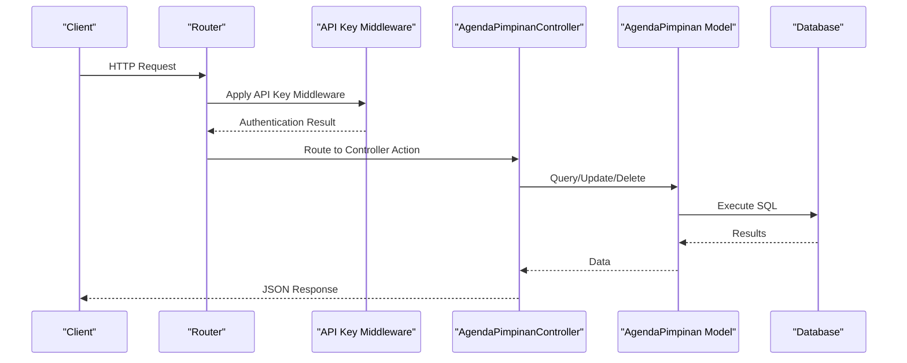
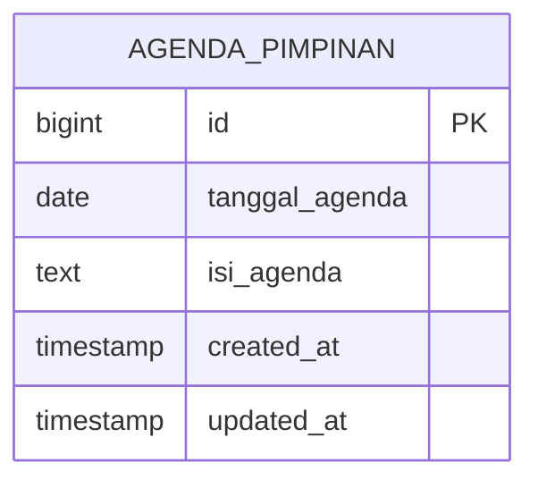
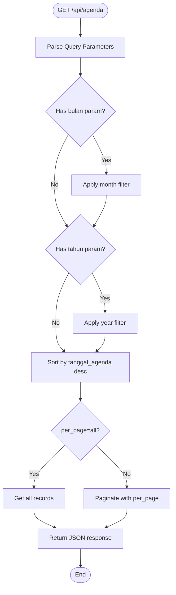
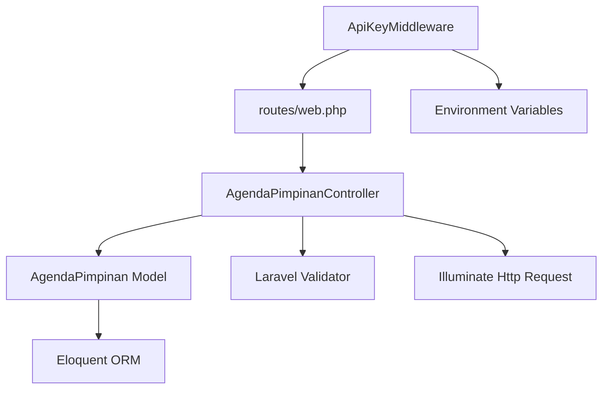

# Agenda Pimpinan CRUD Operations

<cite>
**Referenced Files in This Document**
- [AgendaPimpinanController.php](file://app/Http/Controllers/AgendaPimpinanController.php)
- [AgendaPimpinan.php](file://app/Models/AgendaPimpinan.php)
- [2026_01_26_000000_create_agenda_pimpinan_table.php](file://database/migrations/2026_01_26_000000_create_agenda_pimpinan_table.php)
- [web.php](file://routes/web.php)
- [ApiKeyMiddleware.php](file://app/Http/Middleware/ApiKeyMiddleware.php)
- [app.php](file://bootstrap/app.php)
- [SECURITY.md](file://SECURITY.md)
- [AgendaSeeder.php](file://database/seeders/AgendaSeeder.php)
</cite>

## Table of Contents
1. [Introduction](#introduction)
2. [Project Structure](#project-structure)
3. [Core Components](#core-components)
4. [Architecture Overview](#architecture-overview)
5. [Detailed Component Analysis](#detailed-component-analysis)
6. [Dependency Analysis](#dependency-analysis)
7. [Performance Considerations](#performance-considerations)
8. [Troubleshooting Guide](#troubleshooting-guide)
9. [Conclusion](#conclusion)
10. [Appendices](#appendices)

## Introduction
This document provides comprehensive API documentation for Agenda Pimpinan CRUD operations. It covers leadership meeting schedules and administrative planning functionality, focusing on:
- Creating new agenda items via POST /api/agenda
- Updating existing agenda items via PUT /api/agenda/{id} and POST /api/agenda/{id}
- Deleting agenda items via DELETE /api/agenda/{id}
- Retrieving agenda items via GET /api/agenda and GET /api/agenda/{id}
- Search and filtering capabilities using query parameters

The documentation includes request/response schemas, validation rules, authentication requirements, practical examples, and troubleshooting guidance.

## Project Structure
The Agenda Pimpinan module is implemented using Laravel Lumen and consists of:
- Controller: handles HTTP requests and responses
- Model: defines the agenda_pimpinan table structure and attributes
- Routes: define public and protected endpoints
- Middleware: enforces API key authentication and rate limiting
- Migration: creates the agenda_pimpinan database table
- Seeder: populates initial agenda data

**Diagram sources**
- [web.php:29-31](file://routes/web.php#L29-L31)
- [ApiKeyMiddleware.php:14-39](file://app/Http/Middleware/ApiKeyMiddleware.php#L14-L39)
- [AgendaPimpinanController.php:17-58](file://app/Http/Controllers/AgendaPimpinanController.php#L17-L58)
- [AgendaPimpinan.php:7-34](file://app/Models/AgendaPimpinan.php#L7-L34)

**Section sources**
- [web.php:14-76](file://routes/web.php#L14-L76)
- [app.php:22-30](file://bootstrap/app.php#L22-L30)

## Core Components
This section outlines the primary components involved in Agenda Pimpinan CRUD operations.

- AgendaPimpinanController: Implements all CRUD actions and search/filtering logic
- AgendaPimpinan Model: Defines table schema, fillable attributes, and casting
- agenda_pimpinan table: Stores agenda items with date and content fields
- API Key Middleware: Enforces authentication for protected endpoints
- Routes: Expose public and protected endpoints for agenda operations

Key implementation details:
- Controller methods: index, store, show, update, destroy
- Model attributes: tanggal_agenda (date), isi_agenda (text)
- Validation rules: required date and required text for agenda content
- Pagination support with configurable page size

**Section sources**
- [AgendaPimpinanController.php:17-162](file://app/Http/Controllers/AgendaPimpinanController.php#L17-L162)
- [AgendaPimpinan.php:21-33](file://app/Models/AgendaPimpinan.php#L21-L33)
- [2026_01_26_000000_create_agenda_pimpinan_table.php:13-17](file://database/migrations/2026_01_26_000000_create_agenda_pimpinan_table.php#L13-L17)

## Architecture Overview
The Agenda Pimpinan API follows a layered architecture:
- Presentation Layer: HTTP endpoints defined in routes
- Application Layer: Controller logic for business operations
- Domain Layer: Eloquent model for data persistence
- Infrastructure Layer: Middleware for security and routing

**Diagram sources**
- [web.php:78-102](file://routes/web.php#L78-L102)
- [ApiKeyMiddleware.php:14-39](file://app/Http/Middleware/ApiKeyMiddleware.php#L14-L39)
- [AgendaPimpinanController.php:66-86](file://app/Http/Controllers/AgendaPimpinanController.php#L66-L86)

## Detailed Component Analysis

### API Endpoints

#### GET /api/agenda
Retrieves paginated agenda items with optional filtering by month and year.

Request parameters:
- bulan: integer (01-12) for month filtering
- tahun: integer (e.g., 2025) for year filtering
- per_page: integer or "all" for total count without pagination

Response format:
- status: success/error indicator
- data: array of agenda items
- total: total records matching filters
- current_page: current page number
- last_page: total pages
- per_page: items per page

Example request:
GET /api/agenda?bulan=10&tahun=2025&per_page=5

Example response:
{
  "status": "success",
  "data": [
    {
      "id": 1,
      "tanggal_agenda": "2025-10-22",
      "isi_agenda": "Rabu, 22 Oktober 2025, Telah dilaksanakan Penandatanganan MOU...",
      "created_at": "2025-01-01T00:00:00Z",
      "updated_at": "2025-01-01T00:00:00Z"
    }
  ],
  "total": 120,
  "current_page": 1,
  "last_page": 24,
  "per_page": 5
}

**Section sources**
- [AgendaPimpinanController.php:17-58](file://app/Http/Controllers/AgendaPimpinanController.php#L17-L58)
- [web.php](file://routes/web.php#L30)

#### GET /api/agenda/{id}
Retrieves a specific agenda item by ID.

Request parameters:
- id: integer agenda identifier

Response format:
- status: success/error indicator
- data: agenda item object

Example request:
GET /api/agenda/1

Example response:
{
  "status": "success",
  "data": {
    "id": 1,
    "tanggal_agenda": "2025-10-22",
    "isi_agenda": "Rabu, 22 Oktober 2025, Telah dilaksanakan Penandatanganan MOU...",
    "created_at": "2025-01-01T00:00:00Z",
    "updated_at": "2025-01-01T00:00:00Z"
  }
}

Error response (not found):
{
  "status": "error",
  "message": "Data not found"
}

**Section sources**
- [AgendaPimpinanController.php:95-104](file://app/Http/Controllers/AgendaPimpinanController.php#L95-L104)
- [web.php](file://routes/web.php#L31)

#### POST /api/agenda
Creates a new agenda item.

Required headers:
- X-API-Key: API key for authentication

Request body:
- tanggal_agenda: required date (YYYY-MM-DD)
- isi_agenda: required text

Success response:
{
  "status": "success",
  "message": "Agenda berhasil ditambahkan",
  "data": {
    "id": 121,
    "tanggal_agenda": "2025-10-22",
    "isi_agenda": "New agenda content",
    "created_at": "2025-01-01T00:00:00Z",
    "updated_at": "2025-01-01T00:00:00Z"
  }
}

Validation error response (422 Unprocessable Entity):
{
  "status": "error",
  "errors": {
    "tanggal_agenda": ["The tanggal_agenda field is required."],
    "isi_agenda": ["The isi_agenda field is required."]
  }
}

Example authenticated request:
curl -X POST https://web-api.pa-penajam.go.id/api/agenda \
  -H "X-API-Key: YOUR_SECRET_API_KEY" \
  -H "Content-Type: application/json" \
  -d '{"tanggal_agenda":"2025-10-22","isi_agenda":"New agenda content"}'

**Section sources**
- [AgendaPimpinanController.php:66-87](file://app/Http/Controllers/AgendaPimpinanController.php#L66-L87)
- [web.php](file://routes/web.php#L99)
- [ApiKeyMiddleware.php:14-39](file://app/Http/Middleware/ApiKeyMiddleware.php#L14-L39)

#### PUT /api/agenda/{id}
Updates an existing agenda item.

Required headers:
- X-API-Key: API key for authentication

Request body:
- tanggal_agenda: optional date (YYYY-MM-DD)
- isi_agenda: optional text

Success response:
{
  "status": "success",
  "message": "Agenda berhasil diperbarui",
  "data": {
    "id": 1,
    "tanggal_agenda": "2025-10-23",
    "isi_agenda": "Updated agenda content",
    "created_at": "2025-01-01T00:00:00Z",
    "updated_at": "2025-01-01T00:00:00Z"
  }
}

Error response (not found):
{
  "status": "error",
  "message": "Data not found"
}

**Section sources**
- [AgendaPimpinanController.php:113-140](file://app/Http/Controllers/AgendaPimpinanController.php#L113-L140)
- [web.php](file://routes/web.php#L100)

#### POST /api/agenda/{id}
Alternative update endpoint using POST method.

Same behavior as PUT /api/agenda/{id} for compatibility.

**Section sources**
- [web.php](file://routes/web.php#L101)

#### DELETE /api/agenda/{id}
Deletes an existing agenda item.

Required headers:
- X-API-Key: API key for authentication

Success response:
{
  "status": "success",
  "message": "Agenda berhasil dihapus"
}

Error response (not found):
{
  "status": "error",
  "message": "Data not found"
}

**Section sources**
- [AgendaPimpinanController.php:148-162](file://app/Http/Controllers/AgendaPimpinanController.php#L148-L162)
- [web.php](file://routes/web.php#L102)

### Data Models and Validation

#### Database Schema
The agenda_pimpinan table stores:
- id: auto-incrementing primary key
- tanggal_agenda: date field for meeting date
- isi_agenda: text field for agenda content
- timestamps: created_at and updated_at

**Diagram sources**
- [2026_01_26_000000_create_agenda_pimpinan_table.php:13-17](file://database/migrations/2026_01_26_000000_create_agenda_pimpinan_table.php#L13-L17)

#### Model Definition
The AgendaPimpinan model defines:
- Table name: agenda_pimpinan
- Fillable attributes: tanggal_agenda, isi_agenda
- Attribute casting: tanggal_agenda as date

Validation rules enforced by the controller:
- tanggal_agenda: required, must be a valid date
- isi_agenda: required, must be a string

Pagination behavior:
- Default per_page: 5
- Special case: per_page=all returns all records without pagination

Filtering behavior:
- Month filtering: whereMonth('tanggal_agenda', $bulan)
- Year filtering: whereYear('tanggal_agenda', $tahun)
- Default sorting: latest dates first (desc)

**Section sources**
- [AgendaPimpinan.php:14-33](file://app/Models/AgendaPimpinan.php#L14-L33)
- [AgendaPimpinanController.php:19-32](file://app/Http/Controllers/AgendaPimpinanController.php#L19-L32)

### Authentication and Security

#### API Key Authentication
All write operations (POST, PUT, DELETE) require API key authentication via the X-API-Key header. The middleware:
- Retrieves API key from request header
- Compares with environment variable API_KEY using timing-safe comparison
- Returns 401 Unauthorized if missing or invalid
- Applies random delay to prevent brute force attacks

Rate limiting:
- Public endpoints: 100 requests per minute
- Protected endpoints: 30 requests per minute
- Returns 429 Too Many Requests with Retry-After header when exceeded

CORS protection:
- Global CORS middleware configured
- Strict origin whitelisting recommended for production

**Section sources**
- [ApiKeyMiddleware.php:14-39](file://app/Http/Middleware/ApiKeyMiddleware.php#L14-L39)
- [app.php:22-30](file://bootstrap/app.php#L22-L30)
- [SECURITY.md:11-21](file://SECURITY.md#L11-L21)

### Search and Filtering

The GET /api/agenda endpoint supports flexible search and filtering:

**Diagram sources**
- [AgendaPimpinanController.php:17-58](file://app/Http/Controllers/AgendaPimpinanController.php#L17-L58)

## Dependency Analysis
The Agenda Pimpinan module has the following dependencies:

**Diagram sources**
- [AgendaPimpinanController.php:5-7](file://app/Http/Controllers/AgendaPimpinanController.php#L5-L7)
- [AgendaPimpinan.php:5-6](file://app/Models/AgendaPimpinan.php#L5-L6)
- [web.php:29-31](file://routes/web.php#L29-L31)
- [ApiKeyMiddleware.php:14-17](file://app/Http/Middleware/ApiKeyMiddleware.php#L14-L17)

**Section sources**
- [AgendaPimpinanController.php:5-7](file://app/Http/Controllers/AgendaPimpinanController.php#L5-L7)
- [web.php:78-102](file://routes/web.php#L78-L102)

## Performance Considerations
- Pagination: Use per_page parameter to control response size; set to "all" only when necessary
- Filtering: Month and year filters utilize database indexes on tanggal_agenda
- Sorting: Default descending order optimizes recent agenda retrieval
- Rate limiting: Respect 30 requests per minute for protected endpoints
- Caching: Consider implementing cache headers for frequently accessed endpoints

## Troubleshooting Guide

Common error scenarios and resolutions:

### Authentication Issues
- 401 Unauthorized: Verify X-API-Key header matches API_KEY environment variable
- 500 Server Error: API_KEY environment variable not configured
- 429 Too Many Requests: Implement exponential backoff and reduce request frequency

### Validation Errors
- 422 Unprocessable Entity: Ensure tanggal_agenda is a valid date and isi_agenda is present
- Parameter validation failures: Check query parameter formats (bulan 01-12, tahun numeric)

### Data Access Issues
- 404 Not Found: Agenda ID does not exist in database
- Empty results: Verify filtering parameters match stored data

### Rate Limiting
- Monitor Retry-After header for automatic retry timing
- Implement client-side throttling to prevent hitting limits

**Section sources**
- [ApiKeyMiddleware.php:19-36](file://app/Http/Middleware/ApiKeyMiddleware.php#L19-L36)
- [AgendaPimpinanController.php:73-78](file://app/Http/Controllers/AgendaPimpinanController.php#L73-L78)
- [SECURITY.md:17-21](file://SECURITY.md#L17-L21)

## Conclusion
The Agenda Pimpinan CRUD API provides a robust foundation for managing leadership meeting schedules and administrative planning. Key strengths include:
- Secure authentication with API key validation
- Flexible search and filtering capabilities
- Comprehensive pagination support
- Clear error handling and validation
- Well-defined data models and database schema

The implementation follows Laravel Lumen best practices with proper separation of concerns, middleware-based security, and structured routing.

## Appendices

### Request/Response Schemas

#### Request Body - POST /api/agenda
- tanggal_agenda: string, required, date format YYYY-MM-DD
- isi_agenda: string, required, text content

#### Request Body - PUT /api/agenda/{id}
- tanggal_agenda: string, optional, date format YYYY-MM-DD
- isi_agenda: string, optional, text content

#### Response Body - Success
- status: string, "success" or "error"
- message: string, operation result message (optional)
- data: object or array, agenda item(s)
- errors: object, validation errors (when applicable)
- total: integer, total matching records (for paginated lists)
- current_page: integer, current page number
- last_page: integer, total pages
- per_page: integer, items per page

### Example Usage Patterns

#### Successful Creation
curl -X POST https://web-api.pa-penajam.go.id/api/agenda \
  -H "X-API-Key: YOUR_SECRET_KEY" \
  -H "Content-Type: application/json" \
  -d '{"tanggal_agenda":"2025-10-22","isi_agenda":"Leadership meeting agenda"}'

#### Successful Update
curl -X PUT https://web-api.pa-penajam.go.id/api/agenda/1 \
  -H "X-API-Key: YOUR_SECRET_KEY" \
  -H "Content-Type: application/json" \
  -d '{"isi_agenda":"Updated meeting agenda"}'

#### Successful Deletion
curl -X DELETE https://web-api.pa-penajam.go.id/api/agenda/1 \
  -H "X-API-Key: YOUR_SECRET_KEY"

#### Search with Filters
curl "https://web-api.pa-penajam.go.id/api/agenda?bulan=10&tahun=2025&per_page=10"

### Database Population
Initial agenda data is seeded from structured text containing dates and agenda content. The seeder normalizes whitespace and parses Indonesian date formats (e.g., "22 Oktober 2025") into ISO date format.

**Section sources**
- [AgendaSeeder.php:21-61](file://database/seeders/AgendaSeeder.php#L21-L61)