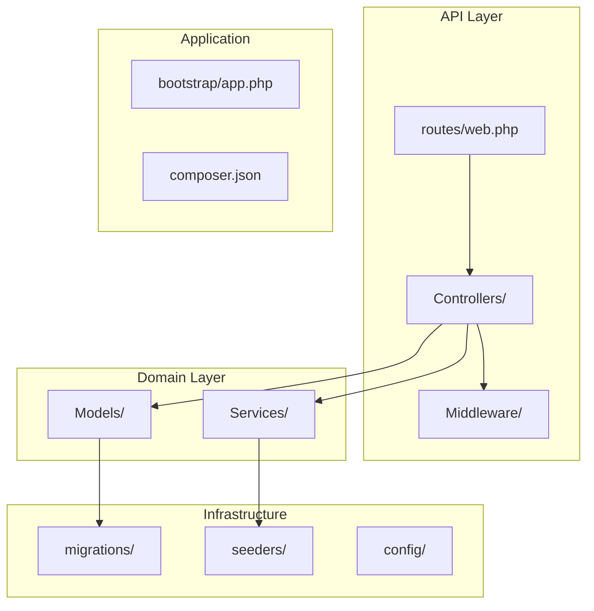
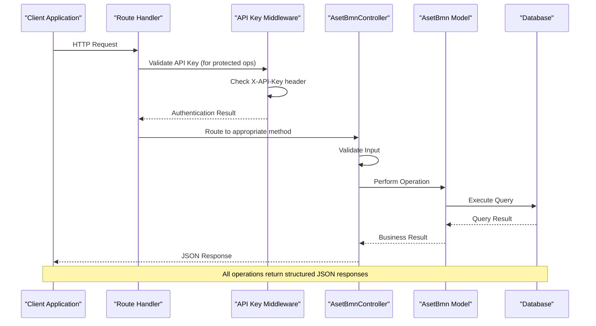
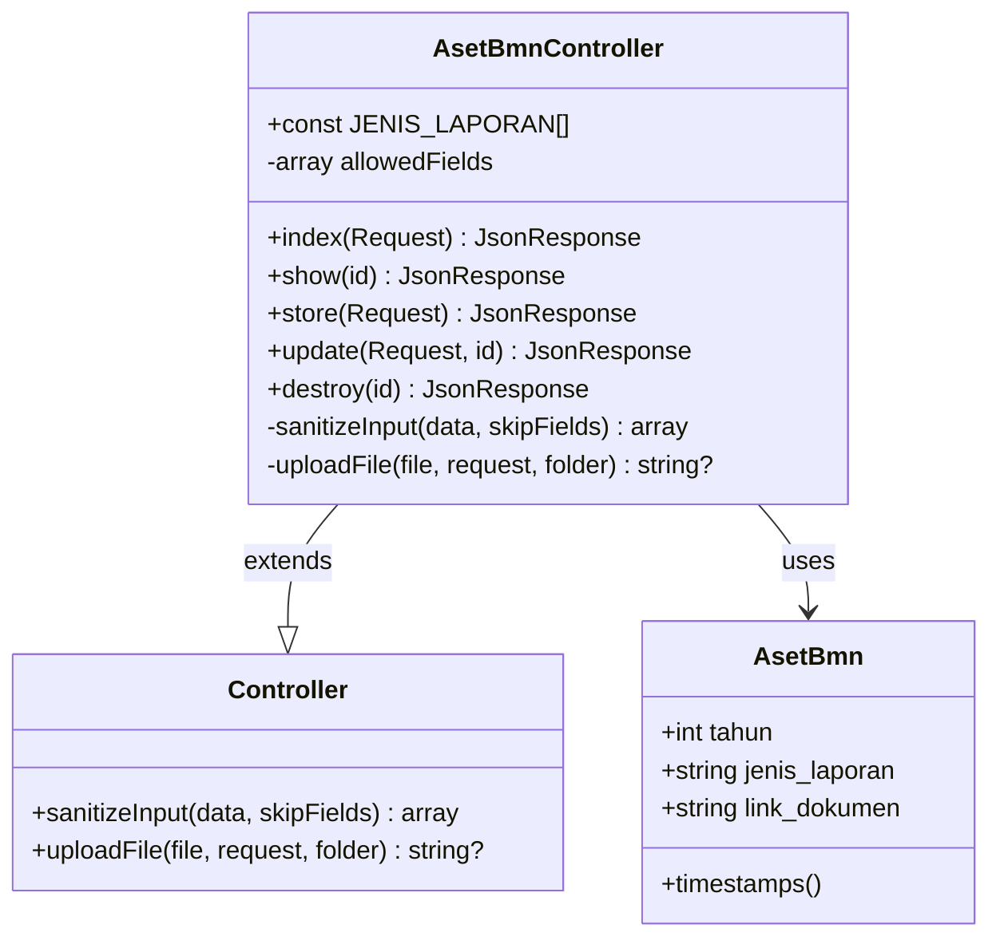
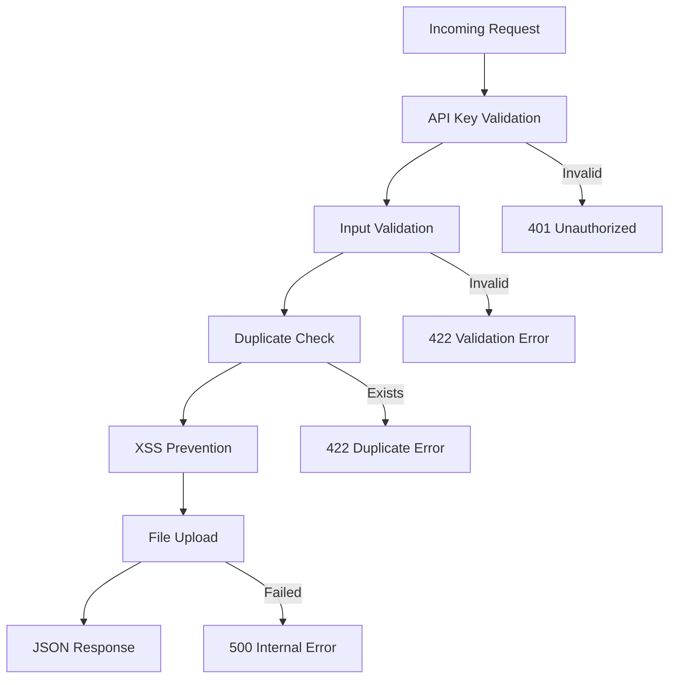

# Aset BMN CRUD Operations

<cite>
**Referenced Files in This Document**
- [AsetBmnController.php](file://app/Http/Controllers/AsetBmnController.php)
- [AsetBmn.php](file://app/Models/AsetBmn.php)
- [2026_02_26_000000_create_aset_bmn_table.php](file://database/migrations/2026_02_26_000000_create_aset_bmn_table.php)
- [web.php](file://routes/web.php)
- [ApiKeyMiddleware.php](file://app/Http/Middleware/ApiKeyMiddleware.php)
- [Controller.php](file://app/Http/Controllers/Controller.php)
- [AsetBmnSeeder.php](file://database/seeders/AsetBmnSeeder.php)
- [app.php](file://bootstrap/app.php)
- [SECURITY.md](file://SECURITY.md)
</cite>

## Table of Contents
1. [Introduction](#introduction)
2. [Project Structure](#project-structure)
3. [Core Components](#core-components)
4. [Architecture Overview](#architecture-overview)
5. [Detailed Component Analysis](#detailed-component-analysis)
6. [API Endpoints](#api-endpoints)
7. [Data Validation and Security](#data-validation-and-security)
8. [Practical Examples](#practical-examples)
9. [Search Functionality](#search-functionality)
10. [Troubleshooting Guide](#troubleshooting-guide)
11. [Conclusion](#conclusion)

## Introduction

This document provides comprehensive API documentation for Aset BMN (Government Asset Management) CRUD operations. The system manages government assets through a RESTful API that supports creating, reading, updating, and deleting asset records. The API follows modern security practices including API key authentication, rate limiting, input validation, and protection against common web vulnerabilities.

The Aset BMN module specifically handles government asset reporting documents including position reports, inventory reports, and condition reports across different fiscal periods. The system ensures data integrity through database constraints and provides comprehensive validation for all operations.

## Project Structure

The Aset BMN API follows a standard Laravel Lumen application structure with clear separation of concerns:



**Diagram sources**
- [web.php:1-165](file://routes/web.php#L1-L165)
- [app.php:1-55](file://bootstrap/app.php#L1-L55)

**Section sources**
- [web.php:1-165](file://routes/web.php#L1-L165)
- [app.php:1-55](file://bootstrap/app.php#L1-L55)

## Core Components

The Aset BMN system consists of several key components that work together to provide comprehensive asset management functionality:

### Controller Layer
The `AsetBmnController` serves as the primary interface for all asset-related operations, implementing standard CRUD functionality with additional validation and security measures.

### Model Layer
The `AsetBmn` model represents the database entity with strict field definitions and type casting for data integrity.

### Middleware Layer
Security middleware provides API key authentication, rate limiting, and cross-origin resource sharing controls.

### Routing Layer
The routing system defines endpoint patterns and applies appropriate middleware based on operation type (public vs protected).

**Section sources**
- [AsetBmnController.php:9-167](file://app/Http/Controllers/AsetBmnController.php#L9-L167)
- [AsetBmn.php:7-21](file://app/Models/AsetBmn.php#L7-L21)

## Architecture Overview

The Aset BMN API follows a layered architecture pattern with clear separation between presentation, business logic, and data access layers:



**Diagram sources**
- [web.php:46-128](file://routes/web.php#L46-L128)
- [ApiKeyMiddleware.php:14-39](file://app/Http/Middleware/ApiKeyMiddleware.php#L14-L39)
- [AsetBmnController.php:71-163](file://app/Http/Controllers/AsetBmnController.php#L71-L163)

## Detailed Component Analysis

### AsetBmnController Implementation

The controller implements comprehensive CRUD operations with built-in validation and error handling:



**Diagram sources**
- [AsetBmnController.php:9-167](file://app/Http/Controllers/AsetBmnController.php#L9-L167)
- [Controller.php:7-97](file://app/Http/Controllers/Controller.php#L7-L97)
- [AsetBmn.php:7-21](file://app/Models/AsetBmn.php#L7-L21)

**Section sources**
- [AsetBmnController.php:9-167](file://app/Http/Controllers/AsetBmnController.php#L9-L167)
- [Controller.php:7-97](file://app/Http/Controllers/Controller.php#L7-L97)

### Data Model and Database Schema

The database schema enforces data integrity through constraints and indexing:

```mermaid
erDiagram
ASSET_BMN {
bigint id PK
smallint tahun
varchar jenis_laporan
text link_dokumen
timestamp created_at
timestamp updated_at
}
CONSTRAINT uk_aset_bmn_tahun_laporan UNIQUE(tahun, jenis_laporan)
INDEX idx_aset_bmn_tahun ON tahun
```

**Diagram sources**
- [2026_02_26_000000_create_aset_bmn_table.php:14-22](file://database/migrations/2026_02_26_000000_create_aset_bmn_table.php#L14-L22)

**Section sources**
- [2026_02_26_000000_create_aset_bmn_table.php:14-22](file://database/migrations/2026_02_26_000000_create_aset_bmn_table.php#L14-L22)
- [AsetBmn.php:11-19](file://app/Models/AsetBmn.php#L11-L19)

## API Endpoints

### Public Endpoints (Read-Only)

#### GET /api/aset-bmn
Retrieve all Aset BMN records with pagination and sorting.

**Response Format:**
```json
{
  "success": true,
  "data": [
    {
      "id": 1,
      "tahun": 2025,
      "jenis_laporan": "Laporan Posisi BMN Di Neraca - Semester I",
      "link_dokumen": "https://drive.google.com/...",
      "created_at": "2024-01-15T10:30:00Z",
      "updated_at": "2024-01-15T10:30:00Z"
    }
  ],
  "total": 6
}
```

#### GET /api/aset-bmn/{id}
Retrieve a specific Aset BMN record by ID.

**Response Format:**
```json
{
  "success": true,
  "data": {
    "id": 1,
    "tahun": 2025,
    "jenis_laporan": "Laporan Posisi BMN Di Neraca - Semester I",
    "link_dokumen": "https://drive.google.com/...",
    "created_at": "2024-01-15T10:30:00Z",
    "updated_at": "2024-01-15T10:30:00Z"
  }
}
```

### Protected Endpoints (Write Operations)

#### POST /api/aset-bmn
Create a new Aset BMN record.

**Request Headers:**
- `X-API-Key: YOUR_SECRET_API_KEY`
- `Content-Type: application/json`

**Request Body:**
```json
{
  "tahun": 2025,
  "jenis_laporan": "Laporan Posisi BMN Di Neraca - Semester I",
  "file_dokumen": "binary_data"
}
```

**Response Format:**
```json
{
  "success": true,
  "data": {
    "id": 7,
    "tahun": 2025,
    "jenis_laporan": "Laporan Posisi BMN Di Neraca - Semester I",
    "link_dokumen": "https://drive.google.com/...",
    "created_at": "2024-01-15T10:30:00Z",
    "updated_at": "2024-01-15T10:30:00Z"
  }
}
```

#### PUT /api/aset-bmn/{id}
Update an existing Aset BMN record.

**Request Headers:**
- `X-API-Key: YOUR_SECRET_API_KEY`
- `Content-Type: application/json`

**Request Body:**
```json
{
  "tahun": 2025,
  "jenis_laporan": "Laporan Posisi BMN Di Neraca - Tahunan",
  "file_dokumen": "binary_data"
}
```

**Response Format:**
```json
{
  "success": true,
  "data": {
    "id": 7,
    "tahun": 2025,
    "jenis_laporan": "Laporan Posisi BMN Di Neraca - Tahunan",
    "link_dokumen": "https://drive.google.com/...",
    "created_at": "2024-01-15T10:30:00Z",
    "updated_at": "2024-01-15T10:30:00Z"
  }
}
```

#### DELETE /api/aset-bmn/{id}
Delete an Aset BMN record.

**Response Format:**
```json
{
  "success": true,
  "message": "Data berhasil dihapus"
}
```

**Section sources**
- [web.php:46-128](file://routes/web.php#L46-L128)
- [AsetBmnController.php:32-163](file://app/Http/Controllers/AsetBmnController.php#L32-L163)

## Data Validation and Security

### Input Validation Rules

The API implements comprehensive validation for all write operations:

| Field | Type | Required | Validation Rules | Description |
|-------|------|----------|------------------|-------------|
| tahun | integer | Yes | required, integer, min:2000, max:2100 | Fiscal year (2000-2100) |
| jenis_laporan | string | Yes | required, string | Report type from predefined list |
| file_dokumen | file | No | nullable, file, mimes:pdf,doc,docx,xls,xlsx, max:10240 | Document file up to 10MB |

### Valid Report Types

The system accepts only specific report types:

1. `Laporan Posisi BMN Di Neraca - Semester I`
2. `Laporan Posisi BMN Di Neraca - Semester II`
3. `Laporan Posisi BMN Di Neraca - Tahunan`
4. `Laporan Barang Kuasa Pengguna - Persediaan - Semester I`
5. `Laporan Barang Kuasa Pengguna - Persediaan - Semester II`
6. `Laporan Kondisi Barang - Tahunan`

### Security Measures

The API implements multiple security layers:



**Diagram sources**
- [ApiKeyMiddleware.php:14-39](file://app/Http/Middleware/ApiKeyMiddleware.php#L14-L39)
- [AsetBmnController.php:73-92](file://app/Http/Controllers/AsetBmnController.php#L73-L92)

**Section sources**
- [ApiKeyMiddleware.php:14-39](file://app/Http/Middleware/ApiKeyMiddleware.php#L14-L39)
- [AsetBmnController.php:73-137](file://app/Http/Controllers/AsetBmnController.php#L73-L137)

## Practical Examples

### Successful Creation Example

**Request:**
```
POST /api/aset-bmn
X-API-Key: YOUR_SECRET_API_KEY
Content-Type: application/json

{
  "tahun": 2025,
  "jenis_laporan": "Laporan Posisi BMN Di Neraca - Semester I",
  "file_dokumen": "[binary_data]"
}
```

**Response:**
```json
{
  "success": true,
  "data": {
    "id": 7,
    "tahun": 2025,
    "jenis_laporan": "Laporan Posisi BMN Di Neraca - Semester I",
    "link_dokumen": "https://drive.google.com/file/d/.../view?usp=sharing",
    "created_at": "2024-01-15T10:30:00Z",
    "updated_at": "2024-01-15T10:30:00Z"
  }
}
```

### Validation Error Example

**Request:**
```
POST /api/aset-bmn
X-API-Key: YOUR_SECRET_API_KEY
Content-Type: application/json

{
  "tahun": 1999,
  "jenis_laporan": "Invalid Report Type"
}
```

**Response:**
```json
{
  "success": false,
  "message": "Jenis laporan tidak valid"
}
```

### Duplicate Record Error Example

**Request:**
```
POST /api/aset-bmn
X-API-Key: YOUR_SECRET_API_KEY
Content-Type: application/json

{
  "tahun": 2025,
  "jenis_laporan": "Laporan Posisi BMN Di Neraca - Semester I"
}
```

**Response:**
```json
{
  "success": false,
  "message": "Data untuk tahun dan jenis laporan tersebut sudah ada"
}
```

### File Upload Success Example

**Request:**
```
POST /api/aset-bmn
X-API-Key: YOUR_SECRET_API_KEY
Content-Type: multipart/form-data

{
  "tahun": 2025,
  "jenis_laporan": "Laporan Posisi BMN Di Neraca - Tahunan",
  "file_dokumen": "[PDF file]"
}
```

**Response:**
```json
{
  "success": true,
  "data": {
    "id": 8,
    "tahun": 2025,
    "jenis_laporan": "Laporan Posisi BMN Di Neraca - Tahunan",
    "link_dokumen": "https://drive.google.com/file/d/.../view?usp=sharing",
    "created_at": "2024-01-15T10:30:00Z",
    "updated_at": "2024-01-15T10:30:00Z"
  }
}
```

**Section sources**
- [AsetBmnController.php:71-105](file://app/Http/Controllers/AsetBmnController.php#L71-L105)
- [AsetBmnController.php:110-149](file://app/Http/Controllers/AsetBmnController.php#L110-L149)

## Search Functionality

### Filtering by Year

The API supports filtering records by fiscal year through query parameters:

**Endpoint:** `GET /api/aset-bmn?tahun=2025`

**Response:**
```json
{
  "success": true,
  "data": [
    {
      "id": 1,
      "tahun": 2025,
      "jenis_laporan": "Laporan Posisi BMN Di Neraca - Semester I",
      "link_dokumen": "https://drive.google.com/...",
      "created_at": "2024-01-15T10:30:00Z",
      "updated_at": "2024-01-15T10:30:00Z"
    }
  ],
  "total": 1
}
```

### Sorting and Ordering

Results are automatically sorted by:
1. Year (descending order)
2. Report type (specific order defined in the system)

**Section sources**
- [AsetBmnController.php:32-54](file://app/Http/Controllers/AsetBmnController.php#L32-L54)

## Troubleshooting Guide

### Common Issues and Solutions

#### Authentication Failures
**Problem:** `401 Unauthorized` response
**Cause:** Missing or invalid `X-API-Key` header
**Solution:** Ensure the API key is set in the `X-API-Key` header and matches the server configuration

#### Validation Errors
**Problem:** `422 Unprocessable Entity` response
**Cause:** Invalid input data or missing required fields
**Solution:** Verify all required fields are present and meet validation criteria

#### Duplicate Record Errors
**Problem:** `422 Unprocessable Entity` with duplicate message
**Cause:** Attempting to create/update with existing year-report combination
**Solution:** Use unique year-report combinations or update existing records

#### File Upload Issues
**Problem:** File upload fails during creation/update
**Cause:** Invalid file type or size exceeding limits
**Solution:** Ensure files are PDF, DOC, DOCX, XLS, or XLSX with size ≤ 10MB

#### Rate Limiting
**Problem:** `429 Too Many Requests` response
**Cause:** Exceeded request limits
**Solution:** Wait for the throttle period or contact administrators for higher limits

**Section sources**
- [ApiKeyMiddleware.php:20-36](file://app/Http/Middleware/ApiKeyMiddleware.php#L20-L36)
- [AsetBmnController.php:73-92](file://app/Http/Controllers/AsetBmnController.php#L73-L92)

## Conclusion

The Aset BMN CRUD API provides a comprehensive solution for managing government asset reporting documents with strong security measures and validation. The system supports all standard CRUD operations with proper authentication, input validation, and error handling. The modular architecture ensures maintainability and extensibility while the security middleware protects against common web vulnerabilities.

Key strengths of the implementation include:
- Comprehensive input validation with clear error messages
- Strong authentication through API keys
- Protection against duplicate entries through database constraints
- Secure file upload handling with MIME type validation
- Automatic XSS prevention through input sanitization
- Structured JSON responses for consistent client integration

The API is designed for production use with proper error handling, rate limiting, and security headers that enhance reliability and protect against various attack vectors.