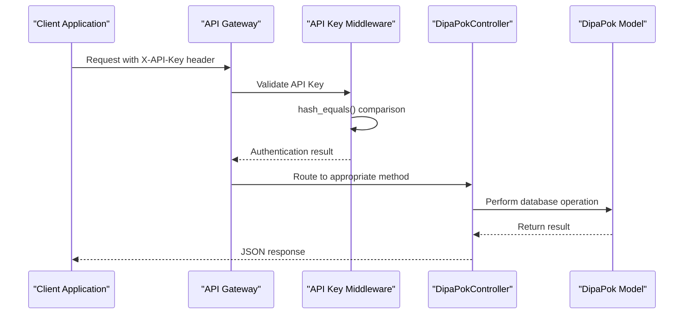
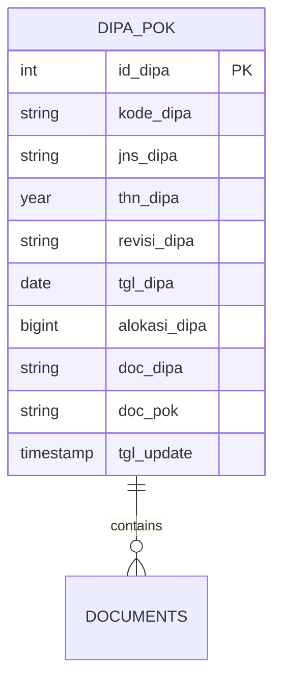
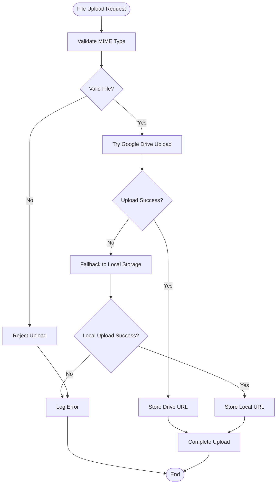

# DIPA Pok CRUD Operations

<cite>
**Referenced Files in This Document**
- [DipaPokController.php](file://app/Http/Controllers/DipaPokController.php)
- [DipaPok.php](file://app/Models/DipaPok.php)
- [2026_02_19_000000_create_dipapok_table.php](file://database/migrations/2026_02_19_000000_create_dipapok_table.php)
- [DipaPokSeeder.php](file://database/seeders/DipaPokSeeder.php)
- [web.php](file://routes/web.php)
- [ApiKeyMiddleware.php](file://app/Http/Middleware/ApiKeyMiddleware.php)
- [Controller.php](file://app/Http/Controllers/Controller.php)
- [joomla-integration-dipapok.html](file://docs/joomla-integration-dipapok.html)
</cite>

## Table of Contents
1. [Introduction](#introduction)
2. [API Endpoints Overview](#api-endpoints-overview)
3. [Authentication and Security](#authentication-and-security)
4. [Core Data Model](#core-data-model)
5. [CRUD Operations](#crud-operations)
6. [Search and Filtering](#search-and-filtering)
7. [Request/Response Schemas](#requestresponse-schemas)
8. [Validation Rules](#validation-rules)
9. [File Upload Handling](#file-upload-handling)
10. [Practical Examples](#practical-examples)
11. [Error Handling](#error-handling)
12. [Performance Considerations](#performance-considerations)
13. [Troubleshooting Guide](#troubleshooting-guide)
14. [Conclusion](#conclusion)

## Introduction

The DIPA Pok API provides comprehensive CRUD operations for managing Annual Budget Planning documents (DIPA - Dokumen Induk Pelaksanaan Anggaran and POK - Program Operasional Kegiatan). This API enables authorized clients to create, read, update, and delete budget planning records with support for multi-year planning cycles, strategic budget allocation tracking, and performance monitoring capabilities.

The system supports both public read operations and protected write operations, with robust validation, file upload capabilities, and comprehensive search functionality for efficient budget management workflows.

## API Endpoints Overview

The DIPA Pok API follows RESTful conventions with the following endpoint structure:

```mermaid
graph TB
subgraph "Public Endpoints (GET)"
A[GET /api/dipapok] --> A1[Retrieve all DIPA/POK records]
B[GET /api/dipapok/{id}] --> B1[Get specific record]
end
subgraph "Protected Endpoints (POST/PUT/DELETE)"
C[POST /api/dipapok] --> C1[Create new DIPA/POK]
D[PUT /api/dipapok/{id}] --> D1[Update existing record]
E[POST /api/dipapok/{id}] --> E1[Alternative update method]
F[DELETE /api/dipapok/{id}] --> F1[Delete record]
end
subgraph "Rate Limiting"
G[100 requests/minute] --> H[Public endpoints]
I[100 requests/minute] --> J[Protected endpoints]
end
```

**Section sources**
- [web.php:42-44](file://routes/web.php#L42-L44)
- [web.php:119-123](file://routes/web.php#L119-L123)

## Authentication and Security

### API Key Authentication

All protected CRUD operations require a valid API key passed in the request header:

**Header Requirement:**
```
X-API-Key: YOUR_API_KEY_HERE
```

### Security Implementation

The API implements multiple security layers:

1. **API Key Validation**: Uses timing-safe comparison (`hash_equals()`) to prevent timing attacks
2. **Rate Limiting**: 100 requests per minute for both public and protected endpoints
3. **Input Sanitization**: Automatic XSS prevention for string inputs
4. **File Upload Security**: MIME type validation based on file content, not just extensions
5. **CSRF Protection**: CORS middleware enabled for cross-origin resource sharing



**Diagram sources**
- [ApiKeyMiddleware.php:14-39](file://app/Http/Middleware/ApiKeyMiddleware.php#L14-L39)
- [web.php:79-123](file://routes/web.php#L79-L123)

**Section sources**
- [ApiKeyMiddleware.php:14-39](file://app/Http/Middleware/ApiKeyMiddleware.php#L14-L39)
- [Controller.php:18-29](file://app/Http/Controllers/Controller.php#L18-L29)

## Core Data Model

The DIPA Pok system manages budget planning documents with the following database structure:



### Key Fields and Properties

| Field | Type | Description | Constraints |
|-------|------|-------------|-------------|
| `id_dipa` | Integer | Primary key | Auto-increment |
| `kode_dipa` | String (8) | Unique identifier code | Required, unique |
| `jns_dipa` | String (255) | Type of DIPA/POK | Required |
| `thn_dipa` | Year | Budget year | Required |
| `revisi_dipa` | String (40) | Revision level | Required |
| `tgl_dipa` | Date | Document date | Required |
| `alokasi_dipa` | Big Integer | Budget allocation amount | Required |
| `doc_dipa` | String (255) | DIPA document URL | Nullable |
| `doc_pok` | String (255) | POK document URL | Nullable |
| `tgl_update` | Timestamp | Last update timestamp | Auto-generated |

**Section sources**
- [DipaPok.php:15-34](file://app/Models/DipaPok.php#L15-L34)
- [2026_02_19_000000_create_dipapok_table.php:11-24](file://database/migrations/2026_02_19_000000_create_dipapok_table.php#L11-L24)

## CRUD Operations

### GET /api/dipapok - Retrieve All Records

**Purpose**: Fetch all DIPA/POK records with pagination support

**Query Parameters**:
- `tahun` (optional): Filter by budget year
- `q` (optional): Search across `jns_dipa` and `revisi_dipa`
- `per_page` (optional): Items per page (default: 15)

**Response Format**:
```json
{
  "success": true,
  "data": [
    {
      "id": 1,
      "kode_dipa": "20250100",
      "jns_dipa": "Badan Urusan Administrasi - MARI",
      "thn_dipa": 2025,
      "revisi_dipa": "Dipa Awal",
      "tgl_dipa": "2024-12-02",
      "alokasi_dipa": 3291366700,
      "doc_dipa": "https://drive.google.com/...",
      "doc_pok": "https://drive.google.com/...",
      "tgl_update": "2024-01-01T00:00:00Z"
    }
  ],
  "total": 100,
  "current_page": 1,
  "last_page": 5,
  "per_page": 20
}
```

### GET /api/dipapok/{id} - Get Specific Record

**Purpose**: Retrieve a single DIPA/POK record by ID

**Response**: Returns the complete record object or 404 if not found

### POST /api/dipapok - Create New Record

**Purpose**: Add a new DIPA/POK record to the system

**Required Fields**:
- `thn_dipa`: Integer year (required)
- `revisi_dipa`: String (max 50 chars) - "Dipa Awal" or "Revisi X"
- `jns_dipa`: String (max 100 chars) - "Badan Urusan Administrasi - MARI" or "Direktorat Jendral Badan Peradilan Agama"
- `tgl_dipa`: Date in YYYY-MM-DD format
- `alokasi_dipa`: Numeric budget amount

**Optional Fields**:
- `file_doc_dipa`: PDF file upload (max 10MB)
- `file_doc_pok`: PDF file upload (max 10MB)

### PUT /api/dipapok/{id} - Update Existing Record

**Purpose**: Modify an existing DIPA/POK record

**Same validation rules as POST apply**

### POST /api/dipapok/{id} - Alternative Update Method

**Purpose**: Provides an alternative endpoint for updates using POST method

**Same functionality as PUT endpoint**

### DELETE /api/dipapok/{id} - Delete Record

**Purpose**: Remove a DIPA/POK record from the system

**Response**: Confirmation message or 404 if not found

**Section sources**
- [DipaPokController.php:10-39](file://app/Http/Controllers/DipaPokController.php#L10-L39)
- [DipaPokController.php:41-96](file://app/Http/Controllers/DipaPokController.php#L41-L96)
- [DipaPokController.php:115-169](file://app/Http/Controllers/DipaPokController.php#L115-L169)
- [DipaPokController.php:171-188](file://app/Http/Controllers/DipaPokController.php#L171-L188)

## Search and Filtering

### Advanced Search Capabilities

The API supports sophisticated search functionality:

1. **Year Filtering**: `GET /api/dipapok?tahun=2025`
2. **Text Search**: `GET /api/dipapok?q=Direktorat`
3. **Combined Filters**: `GET /api/dipapok?tahun=2025&q=Administrasi`
4. **Pagination**: `GET /api/dipapok?per_page=50`

### Search Logic

The search functionality operates on:
- `jns_dipa`: Department/agency name
- `revisi_dipa`: Revision level (e.g., "Dipa Awal", "Revisi 1")

**Section sources**
- [DipaPokController.php:14-24](file://app/Http/Controllers/DipaPokController.php#L14-L24)

## Request/Response Schemas

### Request Schemas

**Create/Update Request Body**:
```json
{
  "thn_dipa": 2025,
  "revisi_dipa": "Dipa Awal",
  "jns_dipa": "Badan Urusan Administrasi - MARI",
  "tgl_dipa": "2024-12-02",
  "alokasi_dipa": 3291366700,
  "file_doc_dipa": "binary_pdf_content",
  "file_doc_pok": "binary_pdf_content"
}
```

**Response Schemas**:

**Success Response**:
```json
{
  "success": true,
  "data": {},
  "message": "Data DIPA/POK berhasil ditambahkan"
}
```

**Error Response**:
```json
{
  "success": false,
  "message": "Validation failed: The tahun field is required."
}
```

**Section sources**
- [DipaPokController.php:43-51](file://app/Http/Controllers/DipaPokController.php#L43-L51)
- [DipaPokController.php:126-134](file://app/Http/Controllers/DipaPokController.php#L126-L134)

## Validation Rules

### Field Validation Requirements

| Field | Validation Rule | Description |
|-------|----------------|-------------|
| `thn_dipa` | `required|integer` | Must be a valid integer year |
| `revisi_dipa` | `required|string|max:50` | Revision identifier string |
| `jns_dipa` | `required|string|max:100` | Department/agency type |
| `tgl_dipa` | `required|date` | Valid date format |
| `alokasi_dipa` | `required|numeric` | Budget amount as number |
| `file_doc_dipa` | `nullable|file|mimes:pdf|max:10240` | Optional PDF file (10MB max) |
| `file_doc_pok` | `nullable|file|mimes:pdf|max:10240` | Optional PDF file (10MB max) |

### Special Validation Logic

**Kode Generation**: Automatically generates unique `kode_dipa` based on:
- Year (4 digits): `thn_dipa`
- Department code: "01" for "Badan Urusan Administrasi - MARI", "04" otherwise
- Revision number: "00" for "Dipa Awal", padded numeric value for revisions

**Section sources**
- [DipaPokController.php:63-71](file://app/Http/Controllers/DipaPokController.php#L63-L71)

## File Upload Handling

### Supported File Types

The API accepts the following file types for document uploads:
- PDF files (primary use case)
- Microsoft Word documents
- Excel spreadsheets
- JPEG images
- PNG images

### Upload Security Features

1. **MIME Type Validation**: Validates file content using magic bytes, not just extensions
2. **Size Limits**: Maximum 10MB per file
3. **Storage Options**: 
   - Google Drive integration (preferred)
   - Local fallback storage
4. **Filename Security**: Randomized filenames to prevent guessing

### Upload Process Flow



**Diagram sources**
- [Controller.php:40-95](file://app/Http/Controllers/Controller.php#L40-L95)

**Section sources**
- [Controller.php:40-95](file://app/Http/Controllers/Controller.php#L40-L95)

## Practical Examples

### Successful CRUD Operations

**Create Operation Example**:
```bash
curl -X POST "https://web-api.pa-penajam.go.id/api/dipapok" \
  -H "X-API-Key: YOUR_API_KEY" \
  -H "Content-Type: multipart/form-data" \
  -F "thn_dipa=2025" \
  -F "revisi_dipa=Dipa Awal" \
  -F "jns_dipa=Badan Urusan Administrasi - MARI" \
  -F "tgl_dipa=2024-12-02" \
  -F "alokasi_dipa=3291366700" \
  -F "file_doc_dipa=@dipa_document.pdf" \
  -F "file_doc_pok=@pok_document.pdf"
```

**Update Operation Example**:
```bash
curl -X PUT "https://web-api.pa-penajam.go.id/api/dipapok/1" \
  -H "X-API-Key: YOUR_API_KEY" \
  -H "Content-Type: multipart/form-data" \
  -F "thn_dipa=2025" \
  -F "alokasi_dipa=3500000000"
```

**Search Operation Example**:
```bash
curl "https://web-api.pa-penajam.go.id/api/dipapok?tahun=2025&per_page=20"
```

### Validation Error Response

**Example Error Response**:
```json
{
  "success": false,
  "message": "Validation failed: The tahun field is required."
}
```

**Section sources**
- [web.php:119-123](file://routes/web.php#L119-L123)

## Error Handling

### Standard Error Responses

| Status Code | Response Format | Description |
|-------------|----------------|-------------|
| 200 | Success JSON | Successful operation |
| 400 | Error JSON | Validation errors |
| 401 | Error JSON | Unauthorized (invalid API key) |
| 404 | Error JSON | Resource not found |
| 500 | Error JSON | Server configuration error |

### Error Response Format
```json
{
  "success": false,
  "message": "Error description"
}
```

### Authentication Error Handling

The API implements several security measures for unauthorized access:
- Timing-safe API key comparison
- Randomized delays to prevent brute force attacks
- Comprehensive logging of security events

**Section sources**
- [ApiKeyMiddleware.php:20-36](file://app/Http/Middleware/ApiKeyMiddleware.php#L20-L36)

## Performance Considerations

### Database Optimization

1. **Indexing**: `thn_dipa` column is indexed for efficient year-based queries
2. **Pagination**: Default 15 items per page with configurable limits
3. **Sorting**: Results sorted by year (descending) then code (descending)

### API Performance Features

1. **Rate Limiting**: Prevents abuse and ensures fair usage
2. **CORS Enabled**: Supports cross-origin requests
3. **Efficient Pagination**: Server-side pagination for large datasets

### Scalability Recommendations

1. **Use Filtering**: Leverage `tahun` and `q` parameters to reduce result sets
2. **Optimize Queries**: Combine filters for better performance
3. **Batch Operations**: Consider bulk operations for multiple updates

**Section sources**
- [2026_02_19_000000_create_dipapok_table.php:23](file://database/migrations/2026_02_19_000000_create_dipapok_table.php#L23)
- [DipaPokController.php:26-29](file://app/Http/Controllers/DipaPokController.php#L26-L29)

## Troubleshooting Guide

### Common Issues and Solutions

**Issue**: 401 Unauthorized Response
- **Cause**: Missing or invalid API key
- **Solution**: Verify `X-API-Key` header contains correct API key

**Issue**: 400 Validation Error
- **Cause**: Missing required fields or invalid data types
- **Solution**: Check field requirements and data formats

**Issue**: 404 Not Found
- **Cause**: Non-existent record ID
- **Solution**: Verify the record exists before attempting updates/deletes

**Issue**: File Upload Failure
- **Cause**: Invalid file type or size exceeded
- **Solution**: Ensure PDF files under 10MB, verify MIME type validation

### Debugging Tips

1. **Test Public Endpoints First**: Verify API connectivity with GET requests
2. **Check Rate Limits**: Monitor request frequency to avoid throttling
3. **Validate Data Types**: Ensure all numeric fields are integers
4. **Verify File Content**: Confirm uploaded files match allowed MIME types

**Section sources**
- [ApiKeyMiddleware.php:28-36](file://app/Http/Middleware/ApiKeyMiddleware.php#L28-L36)
- [Controller.php:54-60](file://app/Http/Controllers/Controller.php#L54-L60)

## Conclusion

The DIPA Pok API provides a comprehensive solution for managing annual budget planning documents with robust security, validation, and search capabilities. The system supports multi-year planning cycles, strategic budget allocation tracking, and performance monitoring through its RESTful interface.

Key strengths include:
- **Security**: Multi-layered authentication and validation
- **Flexibility**: Comprehensive search and filtering options
- **Scalability**: Optimized database design and pagination
- **Integration**: Seamless file upload capabilities with cloud storage support

The API is designed to support both automated integrations and manual administrative workflows, making it suitable for various use cases in budget management and financial planning.