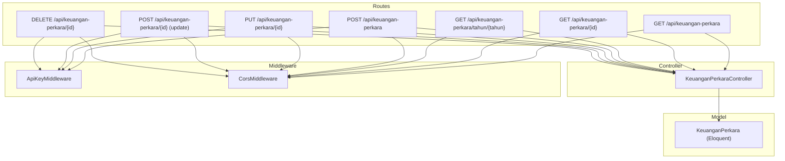
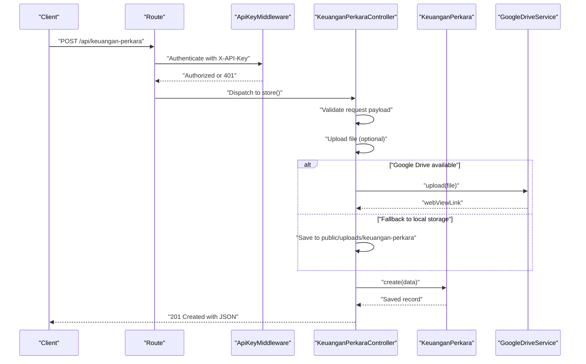
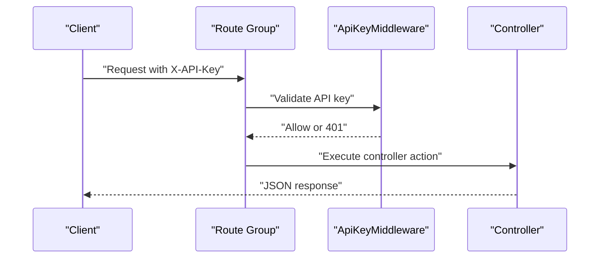
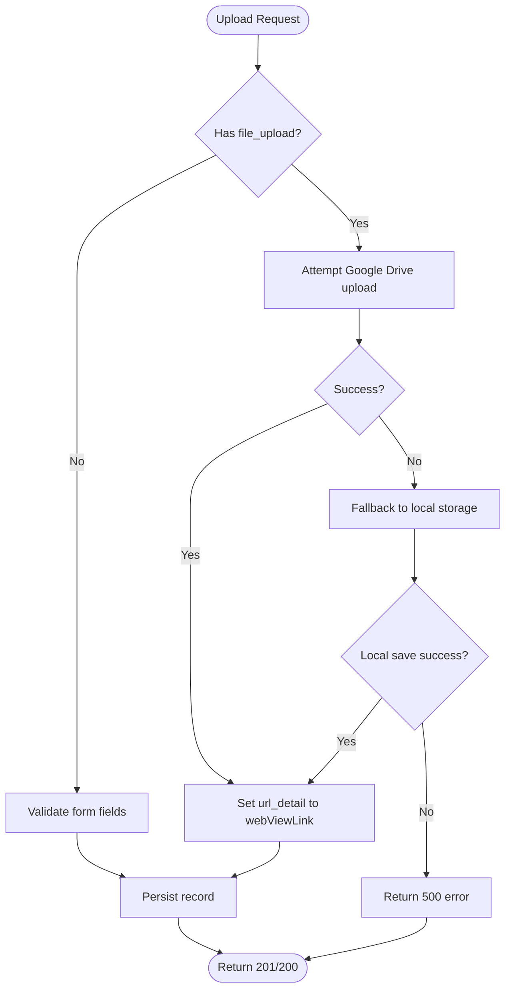
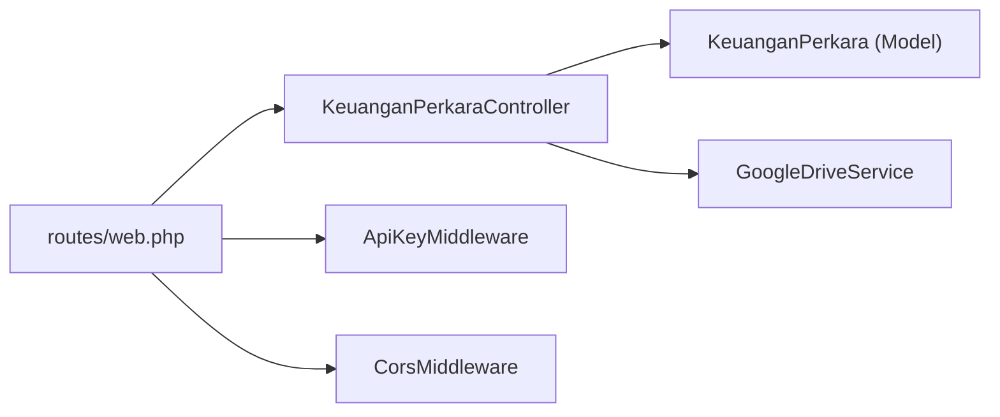

# Keuangan Perkara CRUD Operations

<cite>
**Referenced Files in This Document**
- [web.php](file://routes/web.php)
- [KeuanganPerkaraController.php](file://app/Http/Controllers/KeuanganPerkaraController.php)
- [KeuanganPerkara.php](file://app/Models/KeuanganPerkara.php)
- [2026_04_01_000000_create_keuangan_perkara_table.php](file://database/migrations/2026_04_01_000000_create_keuangan_perkara_table.php)
- [ApiKeyMiddleware.php](file://app/Http/Middleware/ApiKeyMiddleware.php)
- [CorsMiddleware.php](file://app/Http/Middleware/CorsMiddleware.php)
- [GoogleDriveService.php](file://app/Services/GoogleDriveService.php)
- [app.php](file://bootstrap/app.php)
</cite>

## Table of Contents
1. [Introduction](#introduction)
2. [Project Structure](#project-structure)
3. [Core Components](#core-components)
4. [Architecture Overview](#architecture-overview)
5. [Detailed Component Analysis](#detailed-component-analysis)
6. [Dependency Analysis](#dependency-analysis)
7. [Performance Considerations](#performance-considerations)
8. [Troubleshooting Guide](#troubleshooting-guide)
9. [Conclusion](#conclusion)

## Introduction
This document provides comprehensive API documentation for Keuangan Perkara CRUD operations, focusing on legal case financial tracking. It covers:
- POST /api/keuangan-perkara for creating new monthly financial records
- PUT /api/keuangan-perkara/{id} and POST /api/keuangan-perkara/{id} for updates
- DELETE /api/keuangan-perkara/{id} for removal
- Search and filtering via GET endpoints
- Authentication via API key header
- Validation rules, request/response schemas, and error handling
- Practical examples for authenticated requests, validation errors, and successful operations

## Project Structure
The Keuangan Perkara module is implemented as part of a Lumen application with the following relevant components:
- Routes define the API endpoints under the /api prefix
- Controller handles business logic and validation
- Model defines the database schema and attributes
- Migration enforces database structure and constraints
- Middleware secures protected endpoints with API key and CORS policies
- Optional Google Drive service supports file uploads



**Diagram sources**
- [web.php:60-68](file://routes/web.php#L60-L68)
- [web.php:142-146](file://routes/web.php#L142-L146)
- [KeuanganPerkaraController.php:15-190](file://app/Http/Controllers/KeuanganPerkaraController.php#L15-L190)
- [KeuanganPerkara.php:7-26](file://app/Models/KeuanganPerkara.php#L7-L26)
- [ApiKeyMiddleware.php:14-39](file://app/Http/Middleware/ApiKeyMiddleware.php#L14-L39)
- [CorsMiddleware.php:14-62](file://app/Http/Middleware/CorsMiddleware.php#L14-L62)

**Section sources**
- [web.php:60-68](file://routes/web.php#L60-L68)
- [web.php:142-146](file://routes/web.php#L142-L146)
- [app.php:22-30](file://bootstrap/app.php#L22-L30)

## Core Components
- Controller: Implements CRUD operations, validation, and file upload handling with Google Drive fallback
- Model: Defines fillable attributes, casts, and constants for month names
- Migration: Creates the keuangan_perkara table with unique constraints and indexes
- Middleware: Enforces API key authentication and CORS security headers

Key responsibilities:
- Index/search: GET /api/keuangan-perkara with optional year filter
- Show: GET /api/keuangan-perkara/{id}
- Yearly: GET /api/keuangan-perkara/tahun/{tahun}
- Create: POST /api/keuangan-perkara with file upload support
- Update: PUT /api/keuangan-perkara/{id} and POST /api/keuangan-perkara/{id}
- Delete: DELETE /api/keuangan-perkara/{id}

**Section sources**
- [KeuanganPerkaraController.php:15-190](file://app/Http/Controllers/KeuanganPerkaraController.php#L15-L190)
- [KeuanganPerkara.php:7-26](file://app/Models/KeuanganPerkara.php#L7-L26)
- [2026_04_01_000000_create_keuangan_perkara_table.php:9-23](file://database/migrations/2026_04_01_000000_create_keuangan_perkara_table.php#L9-L23)

## Architecture Overview
The API follows a layered architecture:
- HTTP Layer: Routes define endpoints and apply middleware groups
- Application Layer: Controller orchestrates validation, persistence, and file handling
- Domain Layer: Eloquent model encapsulates data access and casting
- Infrastructure Layer: Optional Google Drive service for file storage



**Diagram sources**
- [web.php:142-146](file://routes/web.php#L142-L146)
- [ApiKeyMiddleware.php:14-39](file://app/Http/Middleware/ApiKeyMiddleware.php#L14-L39)
- [KeuanganPerkaraController.php:57-120](file://app/Http/Controllers/KeuanganPerkaraController.php#L57-L120)
- [GoogleDriveService.php:38-82](file://app/Services/GoogleDriveService.php#L38-L82)

## Detailed Component Analysis

### API Endpoints and Schemas

#### GET /api/keuangan-perkara
- Purpose: Retrieve paginated financial records with optional year filter
- Query parameters:
  - tahun (optional): integer year between 2000 and 2100
- Response:
  - success: boolean
  - data: array of records
  - total: integer count

Validation:
- Filters invalid years gracefully by ignoring out-of-range values

**Section sources**
- [web.php:60-61](file://routes/web.php#L60-L61)
- [KeuanganPerkaraController.php:15-33](file://app/Http/Controllers/KeuanganPerkaraController.php#L15-L33)

#### GET /api/keuangan-perkara/{id}
- Purpose: Retrieve a specific record by ID
- Path parameters:
  - id: numeric identifier
- Response:
  - success: boolean
  - data: single record or error message

Behavior:
- Returns 404 if not found

**Section sources**
- [web.php:62](file://routes/web.php#L62)
- [KeuanganPerkaraController.php:48-55](file://app/Http/Controllers/KeuanganPerkaraController.php#L48-L55)

#### GET /api/keuangan-perkara/tahun/{tahun}
- Purpose: Retrieve all months for a given year
- Path parameters:
  - tahun: integer year between 2000 and 2100
- Response:
  - success: boolean
  - data: array ordered by month ascending
  - total: integer count

Behavior:
- Returns 400 for invalid year range

**Section sources**
- [web.php:63](file://routes/web.php#L63)
- [KeuanganPerkaraController.php:35-46](file://app/Http/Controllers/KeuanganPerkaraController.php#L35-L46)

#### POST /api/keuangan-perkara
- Purpose: Create a new monthly financial record
- Required fields:
  - tahun: integer, min 2000, max 2100
  - bulan: integer, min 1, max 12
- Optional fields:
  - saldo_awal: integer, min 0 (only valid for January)
  - penerimaan: integer, min 0
  - pengeluaran: integer, min 0
  - url_detail: string, max 1000 characters
  - file_upload: file (pdf, doc, docx, jpg, jpeg, png), max 10MB
- Response:
  - success: boolean
  - message: operation result
  - data: created record

Constraints:
- Unique constraint on (tahun, bulan) prevents duplicates
- File upload attempts Google Drive first; falls back to local storage if unavailable

Validation rules summary:
- tahun: required, integer, 2000..2100
- bulan: required, integer, 1..12
- saldo_awal: nullable, integer, min 0
- penerimaan: nullable, integer, min 0
- pengeluaran: nullable, integer, min 0
- url_detail: nullable, string, max 1000
- file_upload: nullable, file, allowed types, max 10240KB

**Section sources**
- [web.php:143](file://routes/web.php#L143)
- [KeuanganPerkaraController.php:57-120](file://app/Http/Controllers/KeuanganPerkaraController.php#L57-L120)
- [2026_04_01_000000_create_keuangan_perkara_table.php:11-21](file://database/migrations/2026_04_01_000000_create_keuangan_perkara_table.php#L11-L21)

#### PUT /api/keuangan-perkara/{id}
- Purpose: Update an existing record by ID
- Path parameters:
  - id: numeric identifier
- Request body fields (all optional):
  - saldo_awal: integer, min 0
  - penerimaan: integer, min 0
  - pengeluaran: integer, min 0
  - url_detail: string, max 1000
  - file_upload: file (pdf, doc, docx, jpg, jpeg, png), max 10MB
- Response:
  - success: boolean
  - message: operation result
  - data: updated record

Behavior:
- Returns 404 if not found
- Replaces url_detail with uploaded file link if provided

**Section sources**
- [web.php:144](file://routes/web.php#L144)
- [KeuanganPerkaraController.php:122-180](file://app/Http/Controllers/KeuanganPerkaraController.php#L122-L180)

#### POST /api/keuangan-perkara/{id} (Update)
- Purpose: Alternative update endpoint using POST
- Behavior: Same as PUT /api/keuangan-perkara/{id}

**Section sources**
- [web.php:145](file://routes/web.php#L145)
- [KeuanganPerkaraController.php:122-180](file://app/Http/Controllers/KeuanganPerkaraController.php#L122-L180)

#### DELETE /api/keuangan-perkara/{id}
- Purpose: Remove a record by ID
- Path parameters:
  - id: numeric identifier
- Response:
  - success: boolean
  - message: operation result

Behavior:
- Returns 404 if not found

**Section sources**
- [web.php:146](file://routes/web.php#L146)
- [KeuanganPerkaraController.php:182-190](file://app/Http/Controllers/KeuanganPerkaraController.php#L182-L190)

### Data Model and Database Schema
The model defines the persisted attributes and their types. The migration enforces uniqueness and indexing.

```mermaid
erDiagram
KEUANGAN_PERKARA {
bigint id PK
smallint tahun
tinyint bulan
bigint saldo_awal
bigint penerimaan
bigint pengeluaran
string url_detail
timestamp created_at
timestamp updated_at
}
KEUANGAN_PERKARA ||--o{| "Unique constraint" : "(tahun, bulan)"
KEUANGAN_PERKARA ||--o| "Index" : "tahun"
```

**Diagram sources**
- [KeuanganPerkara.php:11-26](file://app/Models/KeuanganPerkara.php#L11-L26)
- [2026_04_01_000000_create_keuangan_perkara_table.php:11-23](file://database/migrations/2026_04_01_000000_create_keuangan_perkara_table.php#L11-L23)

**Section sources**
- [KeuanganPerkara.php:7-26](file://app/Models/KeuanganPerkara.php#L7-L26)
- [2026_04_01_000000_create_keuangan_perkara_table.php:9-23](file://database/migrations/2026_04_01_000000_create_keuangan_perkara_table.php#L9-L23)

### Authentication and Security
- API key enforcement: Protected routes require X-API-Key header
- CORS policy: Strict origin whitelisting with security headers
- Rate limiting: Applied globally and per-group



**Diagram sources**
- [web.php:78-79](file://routes/web.php#L78-L79)
- [ApiKeyMiddleware.php:14-39](file://app/Http/Middleware/ApiKeyMiddleware.php#L14-L39)
- [CorsMiddleware.php:14-62](file://app/Http/Middleware/CorsMiddleware.php#L14-L62)

**Section sources**
- [web.php:78-79](file://routes/web.php#L78-L79)
- [ApiKeyMiddleware.php:14-39](file://app/Http/Middleware/ApiKeyMiddleware.php#L14-L39)
- [CorsMiddleware.php:14-62](file://app/Http/Middleware/CorsMiddleware.php#L14-L62)
- [app.php:22-30](file://bootstrap/app.php#L22-L30)

### File Upload Workflow
The controller supports optional file uploads with Google Drive integration and local fallback.



**Diagram sources**
- [KeuanganPerkaraController.php:78-108](file://app/Http/Controllers/KeuanganPerkaraController.php#L78-L108)
- [GoogleDriveService.php:38-82](file://app/Services/GoogleDriveService.php#L38-L82)

**Section sources**
- [KeuanganPerkaraController.php:78-108](file://app/Http/Controllers/KeuanganPerkaraController.php#L78-L108)
- [GoogleDriveService.php:38-82](file://app/Services/GoogleDriveService.php#L38-L82)

## Dependency Analysis
- Routes depend on the controller actions
- Controller depends on the model and optional Google Drive service
- Middleware applies to protected route group
- CORS middleware applies to all routes



**Diagram sources**
- [web.php:60-68](file://routes/web.php#L60-L68)
- [web.php:142-146](file://routes/web.php#L142-L146)
- [KeuanganPerkaraController.php:5-7](file://app/Http/Controllers/KeuanganPerkaraController.php#L5-L7)
- [GoogleDriveService.php:9-22](file://app/Services/GoogleDriveService.php#L9-L22)
- [ApiKeyMiddleware.php:14-39](file://app/Http/Middleware/ApiKeyMiddleware.php#L14-L39)
- [CorsMiddleware.php:14-62](file://app/Http/Middleware/CorsMiddleware.php#L14-L62)

**Section sources**
- [web.php:60-68](file://routes/web.php#L60-L68)
- [web.php:142-146](file://routes/web.php#L142-L146)
- [KeuanganPerkaraController.php:5-7](file://app/Http/Controllers/KeuanganPerkaraController.php#L5-L7)

## Performance Considerations
- Index on tahun improves yearly queries
- Unique constraint on (tahun, bulan) ensures data integrity and efficient duplicate detection
- File uploads are asynchronous; consider queueing for high-volume scenarios
- CORS and rate limiting reduce overhead and improve security

## Troubleshooting Guide
Common issues and resolutions:
- 401 Unauthorized: Verify X-API-Key header matches configured API key
- 400 Bad Request: Ensure year is within 2000–2100 for year-based endpoints
- 404 Not Found: Confirm record ID exists before update/delete
- 422 Unprocessable Entity: Check field constraints (min/max values, allowed file types)
- 500 Internal Server Error: Review server logs for upload failures; fallback to local storage may be triggered

Operational tips:
- Use GET /api/keuangan-perkara/tahun/{tahun} to validate data presence
- Test with minimal payload first, then add optional fields
- Ensure CORS Allowed Origins includes your client origin

**Section sources**
- [ApiKeyMiddleware.php:14-39](file://app/Http/Middleware/ApiKeyMiddleware.php#L14-L39)
- [KeuanganPerkaraController.php:35-46](file://app/Http/Controllers/KeuanganPerkaraController.php#L35-L46)
- [KeuanganPerkaraController.php:122-180](file://app/Http/Controllers/KeuanganPerkaraController.php#L122-L180)

## Conclusion
The Keuangan Perkara API provides robust CRUD capabilities for monthly financial tracking with strong validation, secure authentication, and flexible file handling. The documented endpoints, schemas, and workflows enable reliable integration for legal case financial data management.