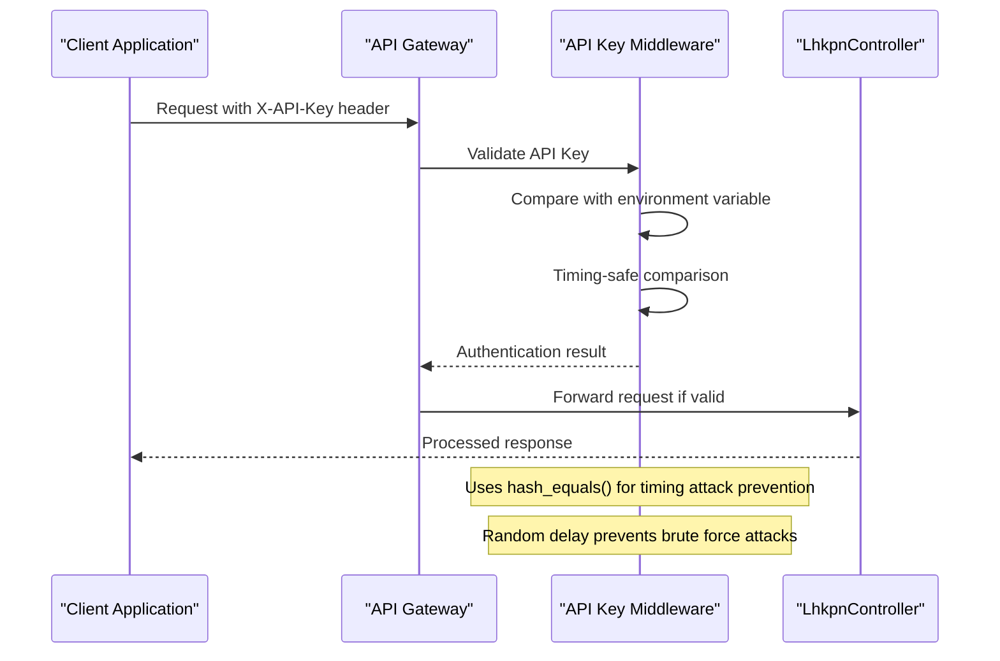
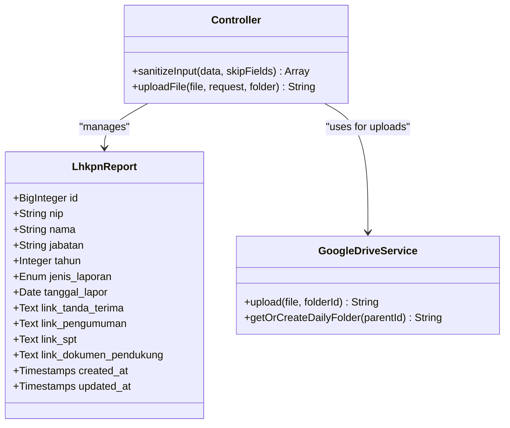
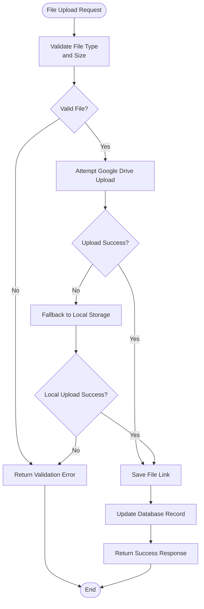

# LHKPN Reports CRUD Operations

<cite>
**Referenced Files in This Document**
- [LhkpnController.php](file://app/Http/Controllers/LhkpnController.php)
- [LhkpnReport.php](file://app/Models/LhkpnReport.php)
- [web.php](file://routes/web.php)
- [ApiKeyMiddleware.php](file://app/Http/Middleware/ApiKeyMiddleware.php)
- [CorsMiddleware.php](file://app/Http/Middleware/CorsMiddleware.php)
- [Controller.php](file://app/Http/Controllers/Controller.php)
- [GoogleDriveService.php](file://app/Services/GoogleDriveService.php)
- [2026_02_02_162040_create_lhkpn_reports_table.php](file://database/migrations/2026_02_02_162040_create_lhkpn_reports_table.php)
- [2026_02_10_000003_update_lhkpn_reports_add_links.php](file://database/migrations/2026_02_10_000003_update_lhkpn_reports_add_links.php)
- [LhkpnSeeder.php](file://database/seeders/LhkpnSeeder.php)
</cite>

## Table of Contents
1. [Introduction](#introduction)
2. [API Endpoints Overview](#api-endpoints-overview)
3. [Authentication and Security](#authentication-and-security)
4. [Data Model and Schema](#data-model-and-schema)
5. [CRUD Operations](#crud-operations)
6. [Search and Filtering](#search-and-filtering)
7. [File Upload Management](#file-upload-management)
8. [Validation Rules](#validation-rules)
9. [Response Formats](#response-formats)
10. [Practical Examples](#practical-examples)
11. [Error Handling](#error-handling)
12. [Performance Considerations](#performance-considerations)
13. [Troubleshooting Guide](#troubleshooting-guide)
14. [Conclusion](#conclusion)

## Introduction

The LHKPN (Laporan Harta Kekayaan Pejabat Negara) Reports module provides comprehensive CRUD operations for managing government employee financial disclosure reports. This system enables authorized applications to create, read, update, and delete asset and income declaration records for public officials, ensuring transparency and compliance with anti-corruption regulations.

The module supports both LHKPN (Annual Asset Declaration) and SPT Tahunan (Annual Income Tax Declaration) report types, with integrated document management capabilities for scanned PDFs, official letters, and supporting documentation.

## API Endpoints Overview

The LHKPN Reports API follows RESTful conventions with dedicated endpoints for each operation:

```mermaid
graph TB
subgraph "Public Endpoints"
A[GET /api/lhkpn] --> A1[Retrieve all reports]
B[GET /api/lhkpn/{id}] --> B1[Get specific report]
end
subgraph "Protected Endpoints"
C[POST /api/lhkpn] --> C1[Create new report]
D[PUT /api/lhkpn/{id}] --> D1[Update existing report]
E[POST /api/lhkpn/{id}] --> E1[Update existing report]
F[DELETE /api/lhkpn/{id}] --> F1[Delete report]
end
subgraph "Security Layer"
G[X-API-Key Header] --> H[API Key Validation]
I[CORS Policy] --> J[Origin Whitelisting]
end
C -.-> H
D -.-> H
E -.-> H
F -.-> H
```

**Diagram sources**
- [web.php:33-108](file://routes/web.php#L33-L108)
- [ApiKeyMiddleware.php:14-39](file://app/Http/Middleware/ApiKeyMiddleware.php#L14-L39)

**Section sources**
- [web.php:33-108](file://routes/web.php#L33-L108)

## Authentication and Security

### API Key Authentication

All write operations (POST, PUT, DELETE) require a valid API key passed via the `X-API-Key` HTTP header:



**Diagram sources**
- [ApiKeyMiddleware.php:14-39](file://app/Http/Middleware/ApiKeyMiddleware.php#L14-L39)
- [web.php:78-108](file://routes/web.php#L78-L108)

### CORS Configuration

The system implements strict CORS policies with trusted domain whitelisting:

- **Production Domains**: `pa-penajam.go.id`, `www.pa-penajam.go.id`, `dataweb.pa-penajam.go.id`
- **Development Domain**: `localhost:3000` (when `APP_ENV=local`)
- **Allowed Headers**: `Content-Type`, `X-API-Key`, `Accept`
- **Allowed Methods**: `GET`, `POST`, `PUT`, `DELETE`, `OPTIONS`

**Section sources**
- [ApiKeyMiddleware.php:14-39](file://app/Http/Middleware/ApiKeyMiddleware.php#L14-L39)
- [CorsMiddleware.php:14-62](file://app/Http/Middleware/CorsMiddleware.php#L14-L62)

## Data Model and Schema

The LHKPN Report model defines the core structure for financial disclosure records:



**Diagram sources**
- [LhkpnReport.php:7-27](file://app/Models/LhkpnReport.php#L7-L27)
- [Controller.php:18-95](file://app/Http/Controllers/Controller.php#L18-L95)
- [GoogleDriveService.php:9-82](file://app/Services/GoogleDriveService.php#L9-L82)

### Database Schema Evolution

The schema has evolved to support comprehensive document management:

| Field | Type | Description | Constraints |
|-------|------|-------------|-------------|
| `id` | BigInteger | Primary key | Auto-increment |
| `nip` | String | Government employee ID | Indexed, Required |
| `nama` | String | Full name | Required |
| `jabatan` | String | Official position | Required |
| `tahun` | Year | Reporting year | Required |
| `jenis_laporan` | Enum | Report type | LHKPN or SPT Tahunan |
| `tanggal_lapor` | Date | Submission date | Nullable |
| `link_tanda_terima` | Text | Receipt link | Nullable |
| `link_pengumuman` | Text | Announcement link | Nullable |
| `link_spt` | Text | Tax return link | Nullable |
| `link_dokumen_pendukung` | Text | Supporting documents | Nullable |

**Section sources**
- [2026_02_02_162040_create_lhkpn_reports_table.php:14-25](file://database/migrations/2026_02_02_162040_create_lhkpn_reports_table.php#L14-L25)
- [2026_02_10_000003_update_lhkpn_reports_add_links.php:14-17](file://database/migrations/2026_02_10_000003_update_lhkpn_reports_add_links.php#L14-L17)

## CRUD Operations

### Create New Report (POST /api/lhkpn)

Creates a new LHKPN report with comprehensive validation and optional file uploads.

**Request Format:**
- **Method**: POST
- **Headers**: `Content-Type: application/json`, `X-API-Key: YOUR_API_KEY`
- **Body**: JSON object containing report fields

**Response Format:**
- **Status**: 201 Created on success
- **Body**: JSON object with success flag and created report data

### Update Report (PUT /api/lhkpn/{id})

Updates an existing LHKPN report with validation and optional file replacement.

**Request Format:**
- **Method**: PUT
- **Headers**: `Content-Type: application/json`, `X-API-Key: YOUR_API_KEY`
- **URL Parameters**: `{id}` - Report identifier
- **Body**: JSON object with fields to update

**Response Format:**
- **Status**: 200 OK on success
- **Body**: JSON object with success flag and updated report data

### Update Report (POST /api/lhkpn/{id})

Alternative update endpoint using POST method for compatibility.

**Request Format:**
- **Method**: POST
- **Headers**: `Content-Type: application/json`, `X-API-Key: YOUR_API_KEY`
- **URL Parameters**: `{id}` - Report identifier
- **Body**: JSON object with fields to update

### Delete Report (DELETE /api/lhkpn/{id})

Removes a LHKPN report from the system.

**Request Format:**
- **Method**: DELETE
- **Headers**: `X-API-Key: YOUR_API_KEY`
- **URL Parameters**: `{id}` - Report identifier

**Response Format:**
- **Status**: 200 OK on success
- **Body**: JSON object with success flag and deletion message

**Section sources**
- [LhkpnController.php:55-144](file://app/Http/Controllers/LhkpnController.php#L55-L144)
- [web.php:104-108](file://routes/web.php#L104-L108)

## Search and Filtering

The API provides robust search capabilities through multiple query parameters:

### Available Filters

| Parameter | Description | Example |
|-----------|-------------|---------|
| `tahun` | Filter by reporting year | `?tahun=2024` |
| `jenis` | Filter by report type | `?jenis=LHKPN` |
| `q` | Full-text search by name or NIP | `?q=John` |

### Sorting and Pagination

Results are automatically sorted by:
1. Year (descending)
2. Position hierarchy (based on Perma 7 Tahun 2015)
3. Name (ascending)

Pagination defaults to 15 items per page with configurable page size.

**Section sources**
- [LhkpnController.php:11-53](file://app/Http/Controllers/LhkpnController.php#L11-L53)

## File Upload Management

### Supported File Types

The system accepts multiple document formats for various report components:

| Field | Allowed Extensions | Maximum Size | Purpose |
|-------|-------------------|--------------|---------|
| `file_tanda_terima` | pdf, doc, docx, jpg, jpeg, png | 5MB | Receipt documentation |
| `file_pengumuman` | pdf, doc, docx, jpg, jpeg, png | 5MB | Official announcement |
| `file_spt` | pdf, doc, docx, jpg, jpeg, png | 5MB | Annual tax return |
| `file_dokumen_pendukung` | pdf, doc, docx, jpg, jpeg, png | 5MB | Supporting documents |

### Upload Process



**Diagram sources**
- [Controller.php:40-95](file://app/Http/Controllers/Controller.php#L40-L95)
- [GoogleDriveService.php:38-82](file://app/Services/GoogleDriveService.php#L38-L82)

### Storage Strategy

1. **Primary**: Google Drive with automatic daily folder organization
2. **Fallback**: Local filesystem storage with randomized filenames
3. **Security**: MIME type validation based on file content, not extension
4. **Accessibility**: Publicly readable links for document sharing

**Section sources**
- [Controller.php:40-95](file://app/Http/Controllers/Controller.php#L40-L95)
- [GoogleDriveService.php:38-82](file://app/Services/GoogleDriveService.php#L38-L82)

## Validation Rules

### Required Fields

All CRUD operations validate the following mandatory fields:

| Field | Type | Validation | Description |
|-------|------|------------|-------------|
| `nip` | String | Required | Government employee identification number |
| `nama` | String | Required | Full name of the official |
| `jabatan` | String | Required | Official position/title |
| `tahun` | Integer | Required, integer | Reporting year (4-digit) |
| `jenis_laporan` | Enum | Required, in: LHKPN,SPT Tahunan | Report type classification |

### Optional Fields

| Field | Type | Validation | Description |
|-------|------|------------|-------------|
| `tanggal_lapor` | Date | Nullable, date | Submission date |
| `file_tanda_terima` | File | Nullable, file,mimes,png | Receipt documentation |
| `file_pengumuman` | File | Nullable, file,mimes,png | Official announcement |
| `file_spt` | File | Nullable, file,mimes,png | Annual tax return |
| `file_dokumen_pendukung` | File | Nullable, file,mimes,png | Supporting documents |

### Advanced Validation Features

- **Timing-Safe Comparison**: Prevents timing attacks during authentication
- **MIME Type Verification**: Validates file content rather than relying on extensions
- **Rate Limiting**: 100 requests per minute per IP address
- **Input Sanitization**: XSS protection for string inputs

**Section sources**
- [LhkpnController.php:57-68](file://app/Http/Controllers/LhkpnController.php#L57-L68)
- [LhkpnController.php:104-115](file://app/Http/Controllers/LhkpnController.php#L104-L115)

## Response Formats

### Standard Success Response

```json
{
  "success": true,
  "data": {
    "id": 1,
    "nip": "198012312005011001",
    "nama": "John Doe",
    "jabatan": "Ketua Pengadilan Negeri",
    "tahun": 2024,
    "jenis_laporan": "LHKPN",
    "tanggal_lapor": "2025-01-15",
    "link_tanda_terima": "https://drive.google.com/file/d/...",
    "link_pengumuman": "https://drive.google.com/file/d/...",
    "link_spt": "https://drive.google.com/file/d/...",
    "link_dokumen_pendukung": "https://drive.google.com/file/d/..."
  }
}
```

### Pagination Response (GET /api/lhkpn)

```json
{
  "success": true,
  "data": [...],
  "total": 1250,
  "current_page": 1,
  "last_page": 84,
  "per_page": 15
}
```

### Error Response Format

```json
{
  "success": false,
  "message": "Validation failed: The nip field is required."
}
```

**Section sources**
- [LhkpnController.php:45-52](file://app/Http/Controllers/LhkpnController.php#L45-L52)
- [LhkpnController.php:95](file://app/Http/Controllers/LhkpnController.php#L95)
- [LhkpnController.php:142](file://app/Http/Controllers/LhkpnController.php#L142)

## Practical Examples

### Creating a New Report

**Request:**
```
POST /api/lhkpn
X-API-Key: YOUR_ACTUAL_API_KEY
Content-Type: application/json

{
  "nip": "198012312005011001",
  "nama": "John Doe",
  "jabatan": "Ketua Pengadilan Negeri",
  "tahun": 2024,
  "jenis_laporan": "LHKPN",
  "tanggal_lapor": "2025-01-15"
}
```

**Response:**
```json
{
  "success": true,
  "data": {
    "id": 1,
    "nip": "198012312005011001",
    "nama": "John Doe",
    "jabatan": "Ketua Pengadilan Negeri",
    "tahun": 2024,
    "jenis_laporan": "LHKPN",
    "tanggal_lapor": "2025-01-15"
  }
}
```

### Updating a Report with File Upload

**Request:**
```
PUT /api/lhkpn/1
X-API-Key: YOUR_ACTUAL_API_KEY
Content-Type: multipart/form-data

Form Data:
- file_tanda_terima: [PDF file]
- file_pengumuman: [PDF file]
- file_spt: [PDF file]
- file_dokumen_pendukung: [PDF file]
```

**Response:**
```json
{
  "success": true,
  "data": {
    "id": 1,
    "nip": "198012312005011001",
    "nama": "John Doe",
    "jabatan": "Ketua Pengadilan Negeri",
    "tahun": 2024,
    "jenis_laporan": "LHKPN",
    "tanggal_lapor": "2025-01-15",
    "link_tanda_terima": "https://drive.google.com/file/d/...",
    "link_pengumuman": "https://drive.google.com/file/d/...",
    "link_spt": "https://drive.google.com/file/d/...",
    "link_dokumen_pendukung": "https://drive.google.com/file/d/..."
  }
}
```

### Searching Reports

**Request:**
```
GET /api/lhkpn?q=john&jenis=LHKPN&tahun=2024
```

**Response:**
```json
{
  "success": true,
  "data": [...],
  "total": 2,
  "current_page": 1,
  "last_page": 1,
  "per_page": 15
}
```

### Error Response Example

**Request:**
```
POST /api/lhkpn
X-API-Key: INVALID_KEY
Content-Type: application/json

{
  "nip": "invalid"
}
```

**Response:**
```json
{
  "success": false,
  "message": "Validation failed: The nip field is required."
}
```

## Error Handling

### Common HTTP Status Codes

| Status Code | Scenario | Response |
|-------------|----------|----------|
| 200 | Successful GET/PUT/DELETE | Standard success response |
| 201 | Successful POST | Created resource with data |
| 400 | Validation errors | Error with validation messages |
| 401 | Unauthorized | API key missing or invalid |
| 404 | Resource not found | Not found error |
| 429 | Rate limit exceeded | Too many requests |
| 500 | Server configuration error | Internal server error |

### Authentication Errors

- **Missing API Key**: Returns 401 with "Unauthorized" message
- **Invalid API Key**: Returns 401 with "Unauthorized" message (with random delay)
- **Server Configuration Error**: Returns 500 with "Server configuration error" message

### Validation Errors

- **Required Fields**: Specific field validation messages
- **File Upload Errors**: MIME type or size validation failures
- **Resource Not Found**: 404 responses for non-existent records

**Section sources**
- [ApiKeyMiddleware.php:20-36](file://app/Http/Middleware/ApiKeyMiddleware.php#L20-L36)
- [LhkpnController.php:95](file://app/Http/Controllers/LhkpnController.php#L95)
- [LhkpnController.php:142](file://app/Http/Controllers/LhkpnController.php#L142)

## Performance Considerations

### Database Optimization

- **Indexing**: NIP field is indexed for faster lookups
- **Pagination**: Default 15 items per page with configurable size
- **Sorting**: Optimized ordering by year and position hierarchy

### File Upload Performance

- **Asynchronous Processing**: File uploads occur during request processing
- **Storage Redundancy**: Google Drive primary with local fallback
- **Content Validation**: MIME type verification prevents malicious uploads

### Security Measures

- **Rate Limiting**: 100 requests per minute per IP
- **Input Sanitization**: Automatic XSS protection
- **Timing Attack Prevention**: Hash-based comparison for API keys

## Troubleshooting Guide

### Common Issues and Solutions

**Issue**: API returns 401 Unauthorized
- **Cause**: Missing or invalid X-API-Key header
- **Solution**: Verify API key configuration and header format

**Issue**: File upload fails with 400 error
- **Cause**: Invalid file type or size exceeding 5MB limit
- **Solution**: Check allowed MIME types and file size constraints

**Issue**: Search returns empty results
- **Cause**: Incorrect filter parameters or no matching records
- **Solution**: Verify filter values and check database content

**Issue**: CORS errors in browser console
- **Cause**: Origin not in allowed whitelist
- **Solution**: Configure CORS_ALLOWED_ORIGINS environment variable

### Debug Information

The system logs detailed information for troubleshooting:
- File upload attempts and failures
- API key validation results
- Database query performance
- Error stack traces for exceptions

**Section sources**
- [Controller.php:55-94](file://app/Http/Controllers/Controller.php#L55-L94)
- [ApiKeyMiddleware.php:20-36](file://app/Http/Middleware/ApiKeyMiddleware.php#L20-L36)

## Conclusion

The LHKPN Reports CRUD system provides a comprehensive solution for managing government employee financial disclosure reports. With robust authentication, flexible search capabilities, and integrated document management, it supports transparency and compliance requirements while maintaining security and performance standards.

The modular architecture allows for easy maintenance and future enhancements, while the standardized response formats ensure consistent integration with client applications. The system's emphasis on security through proper authentication, input validation, and secure file handling makes it suitable for production environments handling sensitive government data.