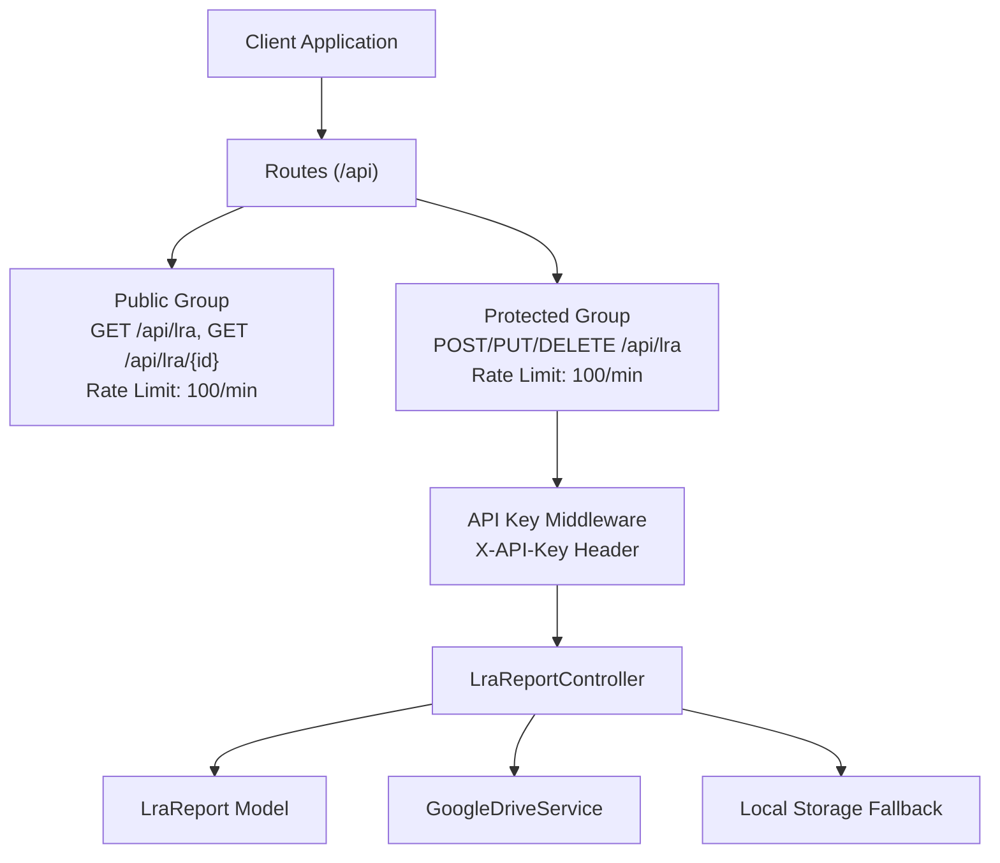
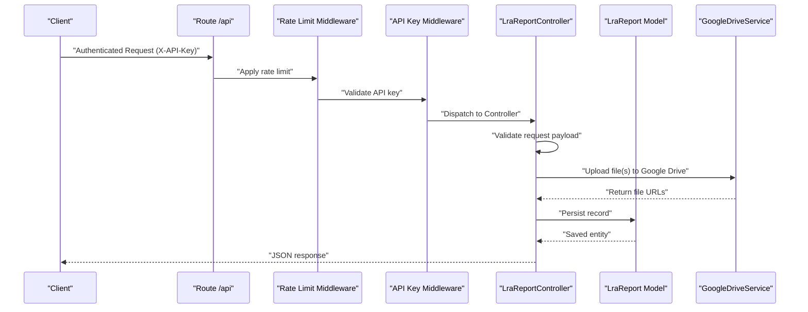
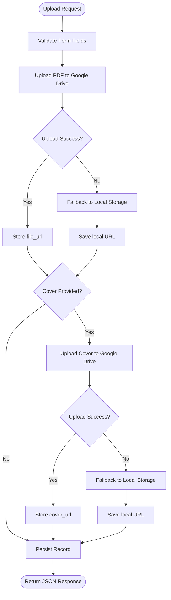
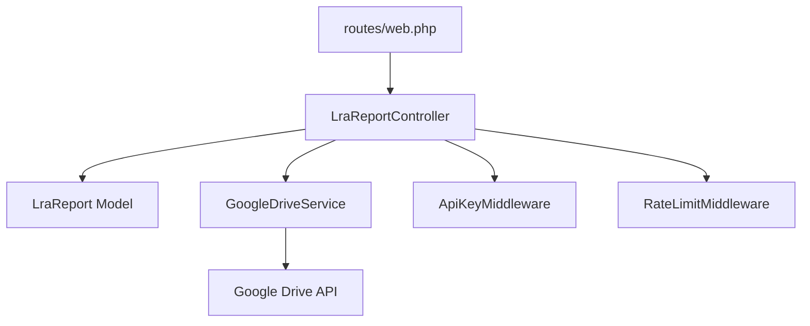

# LRA Reports CRUD Operations

<cite>
**Referenced Files in This Document**
- [routes/web.php](file://routes/web.php)
- [app/Http/Controllers/LraReportController.php](file://app/Http/Controllers/LraReportController.php)
- [app/Models/LraReport.php](file://app/Models/LraReport.php)
- [app/Http/Middleware/ApiKeyMiddleware.php](file://app/Http/Middleware/ApiKeyMiddleware.php)
- [app/Http/Middleware/RateLimitMiddleware.php](file://app/Http/Middleware/RateLimitMiddleware.php)
- [app/Services/GoogleDriveService.php](file://app/Services/GoogleDriveService.php)
- [database/migrations/2026_04_01_000002_create_lra_reports_table.php](file://database/migrations/2026_04_01_000002_create_lra_reports_table.php)
- [database/migrations/2026_04_02_000000_rename_triwulan_to_periode_on_lra_reports.php](file://database/migrations/2026_04_02_000000_rename_triwulan_to_periode_on_lra_reports.php)
- [database/seeders/LraReportSeeder.php](file://database/seeders/LraReportSeeder.php)
- [docs/plans/2026-04-01-lra-module-design.md](file://docs/plans/2026-04-01-lra-module-design.md)
</cite>

## Table of Contents
1. [Introduction](#introduction)
2. [Project Structure](#project-structure)
3. [Core Components](#core-components)
4. [Architecture Overview](#architecture-overview)
5. [Detailed Component Analysis](#detailed-component-analysis)
6. [Dependency Analysis](#dependency-analysis)
7. [Performance Considerations](#performance-considerations)
8. [Troubleshooting Guide](#troubleshooting-guide)
9. [Conclusion](#conclusion)
10. [Appendices](#appendices)

## Introduction
This document provides comprehensive API documentation for LRA (Laporan Realisasi Anggaran) Reports CRUD operations. It covers:
- Creating new financial reports via POST /api/lra
- Updating existing reports via PUT /api/lra/{id} and POST /api/lra/{id}
- Deleting reports via DELETE /api/lra/{id}
- Retrieving paginated lists and single records via GET /api/lra and GET /api/lra/{id}
- Authentication using X-API-Key header
- Validation rules for quarterly reporting cycles, document management, and financial statement categorization
- Practical examples for authenticated requests, validation errors, and successful operations

## Project Structure
The LRA module follows a flat table design with a single model and controller. Routes are defined under the /api prefix with public and protected groups. Authentication is enforced via an API key middleware, and rate limiting is applied to all routes.

**Diagram sources**
- [routes/web.php:74-76](file://routes/web.php#L74-L76)
- [routes/web.php:160-163](file://routes/web.php#L160-L163)
- [app/Http/Controllers/LraReportController.php:80-116](file://app/Http/Controllers/LraReportController.php#L80-L116)
- [app/Http/Controllers/LraReportController.php:118-171](file://app/Http/Controllers/LraReportController.php#L118-L171)
- [app/Http/Controllers/LraReportController.php:173-196](file://app/Http/Controllers/LraReportController.php#L173-L196)
- [app/Http/Middleware/ApiKeyMiddleware.php:14-39](file://app/Http/Middleware/ApiKeyMiddleware.php#L14-L39)
- [app/Services/GoogleDriveService.php:38-82](file://app/Services/GoogleDriveService.php#L38-L82)

**Section sources**
- [routes/web.php:14-164](file://routes/web.php#L14-L164)
- [docs/plans/2026-04-01-lra-module-design.md:33-70](file://docs/plans/2026-04-01-lra-module-design.md#L33-L70)

## Core Components
- LraReportController: Implements CRUD operations, validation, file upload to Google Drive, and pagination.
- LraReport Model: Defines fillable attributes and type casting for the lra_reports table.
- GoogleDriveService: Handles file uploads to Google Drive with daily folder organization and fallback to local storage.
- API Key Middleware: Enforces authentication via X-API-Key header with timing-safe comparison.
- Rate Limit Middleware: Applies rate limiting to prevent abuse.

**Section sources**
- [app/Http/Controllers/LraReportController.php:11-234](file://app/Http/Controllers/LraReportController.php#L11-L234)
- [app/Models/LraReport.php:7-23](file://app/Models/LraReport.php#L7-L23)
- [app/Services/GoogleDriveService.php:9-117](file://app/Services/GoogleDriveService.php#L9-L117)
- [app/Http/Middleware/ApiKeyMiddleware.php:8-41](file://app/Http/Middleware/ApiKeyMiddleware.php#L8-L41)
- [app/Http/Middleware/RateLimitMiddleware.php:9-49](file://app/Http/Middleware/RateLimitMiddleware.php#L9-L49)

## Architecture Overview
The LRA API is structured around a protected CRUD interface with public read endpoints. Requests pass through rate limiting and API key validation before reaching the controller, which manages file uploads and database persistence.

**Diagram sources**
- [routes/web.php:78-163](file://routes/web.php#L78-L163)
- [app/Http/Middleware/ApiKeyMiddleware.php:14-39](file://app/Http/Middleware/ApiKeyMiddleware.php#L14-L39)
- [app/Http/Controllers/LraReportController.php:80-116](file://app/Http/Controllers/LraReportController.php#L80-L116)
- [app/Services/GoogleDriveService.php:38-82](file://app/Services/GoogleDriveService.php#L38-L82)

## Detailed Component Analysis

### API Endpoints and Schemas

#### GET /api/lra
- Purpose: Retrieve paginated list of LRA reports with optional filters.
- Query Parameters:
  - tahun (integer): Filter by year (2000–2100).
  - jenis_dipa (string): Filter by DIPA type ("DIPA 01", "DIPA 04").
  - limit/per_page (integer): Items per page (min 1, max 100).
- Response:
  - success (boolean)
  - data (array of report objects)
  - total (integer)
  - current_page (integer)
  - last_page (integer)
  - per_page (integer)

Validation rules:
- tahun: integer between 2000 and 2100.
- jenis_dipa: must be one of "DIPA 01", "DIPA 04".

Pagination ordering:
- Sorts by tahun desc, jenis_dipa asc, periode asc.

**Section sources**
- [routes/web.php:74](file://routes/web.php#L74)
- [app/Http/Controllers/LraReportController.php:20-55](file://app/Http/Controllers/LraReportController.php#L20-L55)
- [database/migrations/2026_04_01_000002_create_lra_reports_table.php:11-22](file://database/migrations/2026_04_01_000002_create_lra_reports_table.php#L11-L22)

#### GET /api/lra/{id}
- Purpose: Retrieve a single LRA report by ID.
- Path Parameter:
  - id (integer): Report ID (must be > 0).
- Response:
  - success (boolean)
  - data (object: report)

Error responses:
- 400 Bad Request: Invalid ID.
- 404 Not Found: Report not found.

**Section sources**
- [routes/web.php:75](file://routes/web.php#L75)
- [app/Http/Controllers/LraReportController.php:57-78](file://app/Http/Controllers/LraReportController.php#L57-L78)

#### POST /api/lra
- Purpose: Create a new LRA report with uploaded files.
- Headers:
  - Content-Type: multipart/form-data
  - X-API-Key: Required
- Form Fields:
  - tahun (required, integer, 2000–2100)
  - jenis_dipa (required, "DIPA 01" or "DIPA 04")
  - periode (required, "semester_1", "semester_2", "unaudited", "audited")
  - judul (required, string, max 255)
  - file_upload (required, PDF, max 10MB)
  - cover_upload (optional, image: jpg, jpeg, png, webp, max 5MB)

Processing:
- Validates input fields.
- Uploads PDF to Google Drive; optional cover image to Google Drive.
- Stores file_url and cover_url (if provided).
- Returns created record.

Success response:
- 201 Created with success flag and created data.

Error responses:
- 400 Bad Request: Invalid ID or validation failure.
- 401 Unauthorized: Missing or invalid API key.
- 429 Too Many Requests: Rate limit exceeded.
- 500 Internal Server Error: Upload or persistence failure.

**Section sources**
- [routes/web.php:160](file://routes/web.php#L160)
- [app/Http/Controllers/LraReportController.php:80-116](file://app/Http/Controllers/LraReportController.php#L80-L116)
- [app/Http/Middleware/ApiKeyMiddleware.php:14-39](file://app/Http/Middleware/ApiKeyMiddleware.php#L14-L39)
- [app/Http/Middleware/RateLimitMiddleware.php:15-39](file://app/Http/Middleware/RateLimitMiddleware.php#L15-L39)
- [app/Services/GoogleDriveService.php:38-82](file://app/Services/GoogleDriveService.php#L38-L82)

#### PUT /api/lra/{id}
- Purpose: Update an existing LRA report.
- Path Parameter:
  - id (integer): Report ID (must be > 0).
- Headers:
  - Content-Type: multipart/form-data
  - X-API-Key: Required
- Form Fields:
  - tahun (required, integer, 2000–2100)
  - jenis_dipa (required, "DIPA 01" or "DIPA 04")
  - periode (required, "semester_1", "semester_2", "unaudited", "audited")
  - judul (required, string, max 255)
  - file_upload (optional, PDF, max 10MB)
  - cover_upload (optional, image: jpg, jpeg, png, webp, max 5MB)

Processing:
- Validates input fields.
- Optionally replaces file_url and/or cover_url if new files are provided.
- Updates record and returns fresh data.

Success response:
- 200 OK with success flag and updated data.

Error responses:
- 400 Bad Request: Invalid ID.
- 404 Not Found: Report not found.
- 401 Unauthorized: Missing or invalid API key.
- 429 Too Many Requests: Rate limit exceeded.
- 500 Internal Server Error: Upload or persistence failure.

**Section sources**
- [routes/web.php:161](file://routes/web.php#L161)
- [app/Http/Controllers/LraReportController.php:118-171](file://app/Http/Controllers/LraReportController.php#L118-L171)

#### POST /api/lra/{id} (Update)
- Purpose: Alternative update endpoint using POST semantics.
- Behavior: Same as PUT /api/lra/{id}.

**Section sources**
- [routes/web.php:162](file://routes/web.php#L162)
- [app/Http/Controllers/LraReportController.php:118-171](file://app/Http/Controllers/LraReportController.php#L118-L171)

#### DELETE /api/lra/{id}
- Purpose: Delete an existing LRA report.
- Path Parameter:
  - id (integer): Report ID (must be > 0).
- Headers:
  - X-API-Key: Required

Success response:
- 200 OK with success flag.

Error responses:
- 400 Bad Request: Invalid ID.
- 404 Not Found: Report not found.
- 401 Unauthorized: Missing or invalid API key.
- 429 Too Many Requests: Rate limit exceeded.

**Section sources**
- [routes/web.php:163](file://routes/web.php#L163)
- [app/Http/Controllers/LraReportController.php:173-196](file://app/Http/Controllers/LraReportController.php#L173-L196)

### Data Model and Validation Rules

#### Database Schema (lra_reports)
- Fields:
  - id (bigint, PK)
  - tahun (integer)
  - jenis_dipa (string, length 10)
  - periode (string, length 20)
  - judul (string, length 255)
  - file_url (string, length 500)
  - cover_url (string, length 500, nullable)
  - timestamps

- Constraints:
  - Unique composite: (tahun, jenis_dipa, periode)

Notes:
- The column was renamed from triwulan to periode during migration, with values mapped as:
  - 1 → "semester_1"
  - 2 → "semester_2"
  - 3 → "unaudited"
  - 4 → "audited"

**Section sources**
- [database/migrations/2026_04_01_000002_create_lra_reports_table.php:11-22](file://database/migrations/2026_04_01_000002_create_lra_reports_table.php#L11-L22)
- [database/migrations/2026_04_02_000000_rename_triwulan_to_periode_on_lra_reports.php:12-32](file://database/migrations/2026_04_02_000000_rename_triwulan_to_periode_on_lra_reports.php#L12-L32)
- [app/Models/LraReport.php:11-22](file://app/Models/LraReport.php#L11-L22)

#### Controller Validation Rules
- tahun: required, integer, min 2000, max 2100
- jenis_dipa: required, in: "DIPA 01","DIPA 04"
- periode: required, in: "semester_1","semester_2","unaudited","audited"
- judul: required, string, max 255
- file_upload: required, file, PDF, max 10MB
- cover_upload: optional, file, images (jpg,jpeg,png,webp), max 5MB

**Section sources**
- [app/Http/Controllers/LraReportController.php:82-89](file://app/Http/Controllers/LraReportController.php#L82-L89)
- [app/Http/Controllers/LraReportController.php:135-142](file://app/Http/Controllers/LraReportController.php#L135-L142)

### File Upload and Storage Flow
The controller uploads files to Google Drive via GoogleDriveService. If Google Drive upload fails, it falls back to storing files locally under public/uploads/lra and public/uploads/lra/covers.

**Diagram sources**
- [app/Http/Controllers/LraReportController.php:198-232](file://app/Http/Controllers/LraReportController.php#L198-L232)
- [app/Services/GoogleDriveService.php:38-82](file://app/Services/GoogleDriveService.php#L38-L82)

**Section sources**
- [app/Http/Controllers/LraReportController.php:96-115](file://app/Http/Controllers/LraReportController.php#L96-L115)
- [app/Http/Controllers/LraReportController.php:149-170](file://app/Http/Controllers/LraReportController.php#L149-L170)
- [app/Services/GoogleDriveService.php:38-82](file://app/Services/GoogleDriveService.php#L38-L82)

### Authentication and Rate Limiting
- Authentication: X-API-Key header is required for protected endpoints. The middleware performs a timing-safe comparison against the configured API key and adds a random delay on failure to mitigate timing attacks.
- Rate Limiting: Applied globally with a default of 100 requests per minute per client IP. Responses include X-RateLimit-Limit and X-RateLimit-Remaining headers.

**Section sources**
- [app/Http/Middleware/ApiKeyMiddleware.php:14-39](file://app/Http/Middleware/ApiKeyMiddleware.php#L14-L39)
- [routes/web.php:14](file://routes/web.php#L14)
- [routes/web.php:78-163](file://routes/web.php#L78-L163)
- [app/Http/Middleware/RateLimitMiddleware.php:15-39](file://app/Http/Middleware/RateLimitMiddleware.php#L15-L39)

## Dependency Analysis
The LRA module integrates tightly with the routing layer, middleware stack, and external services.

**Diagram sources**
- [routes/web.php:74-76](file://routes/web.php#L74-L76)
- [routes/web.php:160-163](file://routes/web.php#L160-L163)
- [app/Http/Controllers/LraReportController.php:80-116](file://app/Http/Controllers/LraReportController.php#L80-L116)
- [app/Services/GoogleDriveService.php:38-82](file://app/Services/GoogleDriveService.php#L38-L82)
- [app/Http/Middleware/ApiKeyMiddleware.php:14-39](file://app/Http/Middleware/ApiKeyMiddleware.php#L14-L39)
- [app/Http/Middleware/RateLimitMiddleware.php:15-39](file://app/Http/Middleware/RateLimitMiddleware.php#L15-L39)

**Section sources**
- [routes/web.php:74-76](file://routes/web.php#L74-L76)
- [routes/web.php:160-163](file://routes/web.php#L160-L163)
- [app/Http/Controllers/LraReportController.php:80-116](file://app/Http/Controllers/LraReportController.php#L80-L116)
- [app/Services/GoogleDriveService.php:38-82](file://app/Services/GoogleDriveService.php#L38-L82)

## Performance Considerations
- File Uploads: Prefer smaller PDFs and images to reduce upload time and storage costs. Consider compressing assets before upload.
- Pagination: Use limit/per_page to control payload size; avoid requesting very large pages.
- Rate Limits: Respect the 100 requests/minute limit to prevent throttling.
- Storage Fallback: Local fallback is slower than cloud storage; failures should be logged and retried appropriately.

[No sources needed since this section provides general guidance]

## Troubleshooting Guide
Common issues and resolutions:
- 401 Unauthorized:
  - Ensure X-API-Key header matches the server configuration.
  - Verify the API key is set and not empty.
- 429 Too Many Requests:
  - Reduce request frequency or implement client-side retry with exponential backoff.
- 500 Internal Server Error on Upload:
  - Check Google Drive service credentials and permissions.
  - Confirm fallback storage directories exist and are writable.
- Invalid ID Errors:
  - Ensure ID is a positive integer.
- Validation Failures:
  - Confirm field types and value ranges match documented rules.

**Section sources**
- [app/Http/Middleware/ApiKeyMiddleware.php:20-36](file://app/Http/Middleware/ApiKeyMiddleware.php#L20-L36)
- [app/Http/Middleware/RateLimitMiddleware.php:22-28](file://app/Http/Middleware/RateLimitMiddleware.php#L22-L28)
- [app/Http/Controllers/LraReportController.php:110-115](file://app/Http/Controllers/LraReportController.php#L110-L115)
- [app/Http/Controllers/LraReportController.php:165-170](file://app/Http/Controllers/LraReportController.php#L165-L170)

## Conclusion
The LRA Reports API provides a robust, authenticated CRUD interface for managing financial statements with integrated document storage. It supports flexible filtering, pagination, and secure file handling with cloud-first upload and local fallback. Adhering to the documented schemas and validation rules ensures reliable operation across clients and integrations.

[No sources needed since this section summarizes without analyzing specific files]

## Appendices

### Practical Examples

#### Example: Create a New LRA Report (POST /api/lra)
- Headers:
  - Content-Type: multipart/form-data
  - X-API-Key: YOUR_API_KEY
- FormData:
  - tahun: 2025
  - jenis_dipa: "DIPA 01"
  - periode: "semester_1"
  - judul: "LRA Semester 1 DIPA 01"
  - file_upload: PDF (<= 10MB)
  - cover_upload: JPEG/PNG/WebP (<= 5MB, optional)

Success Response (201):
- success: true
- message: "Data LRA berhasil ditambahkan"
- data: { id, tahun, jenis_dipa, periode, judul, file_url, cover_url, timestamps }

#### Example: Update an Existing LRA Report (PUT /api/lra/{id})
- Path: /api/lra/{id} where id > 0
- Headers:
  - Content-Type: multipart/form-data
  - X-API-Key: YOUR_API_KEY
- FormData:
  - tahun: 2025
  - jenis_dipa: "DIPA 01"
  - periode: "semester_2"
  - judul: "Updated LRA Title"
  - file_upload: PDF (<= 10MB, optional)
  - cover_upload: Image (<= 5MB, optional)

Success Response (200):
- success: true
- message: "Data LRA berhasil diperbarui"
- data: Updated report object

#### Example: Delete an LRA Report (DELETE /api/lra/{id})
- Path: /api/lra/{id} where id > 0
- Headers:
  - X-API-Key: YOUR_API_KEY

Success Response (200):
- success: true
- message: "Data LRA berhasil dihapus"

#### Example: Retrieve Paginated Reports (GET /api/lra)
- Query: ?tahun=2025&jenis_dipa=DIPA%2001&limit=10
- Response:
  - success: true
  - data: Array of reports
  - total, current_page, last_page, per_page

#### Example: Retrieve Single Report (GET /api/lra/{id})
- Path: /api/lra/{id}
- Response:
  - success: true
  - data: Report object

#### Example: Validation Error Response
- POST /api/lra with invalid fields:
  - 422 Unprocessable Entity (controller-level validation)
  - Or 400 Bad Request (invalid ID)
- Response:
  - success: false
  - message: Specific validation error message

#### Example: Authentication Failure (401)
- Missing or invalid X-API-Key:
  - Response: "Unauthorized"
  - Includes randomized delay to mitigate timing attacks

**Section sources**
- [routes/web.php:74-76](file://routes/web.php#L74-L76)
- [routes/web.php:160-163](file://routes/web.php#L160-L163)
- [app/Http/Controllers/LraReportController.php:80-116](file://app/Http/Controllers/LraReportController.php#L80-L116)
- [app/Http/Controllers/LraReportController.php:118-171](file://app/Http/Controllers/LraReportController.php#L118-L171)
- [app/Http/Controllers/LraReportController.php:173-196](file://app/Http/Controllers/LraReportController.php#L173-L196)
- [app/Http/Middleware/ApiKeyMiddleware.php:28-36](file://app/Http/Middleware/ApiKeyMiddleware.php#L28-L36)

### Data Seeding Reference
The seeder creates predefined LRA entries across years and DIPA types, demonstrating the supported combinations and file URL patterns.

**Section sources**
- [database/seeders/LraReportSeeder.php:12-35](file://database/seeders/LraReportSeeder.php#L12-L35)