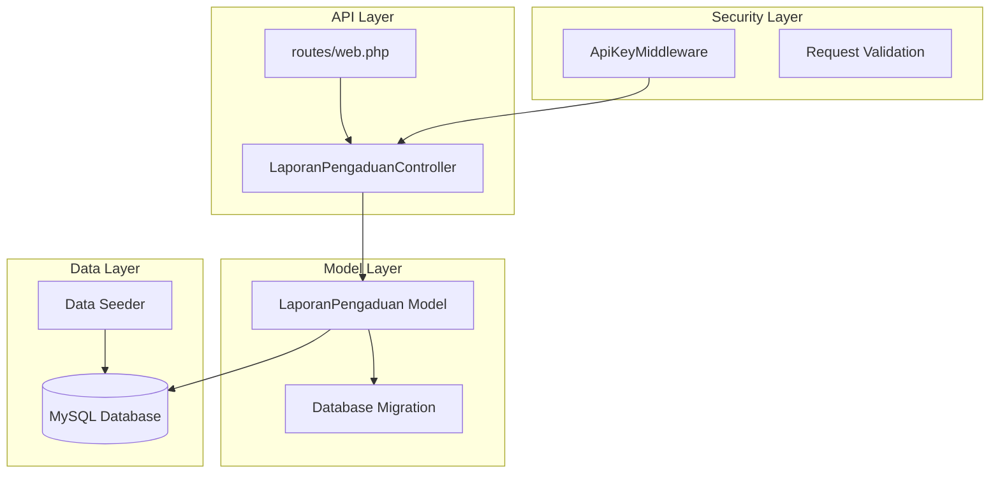
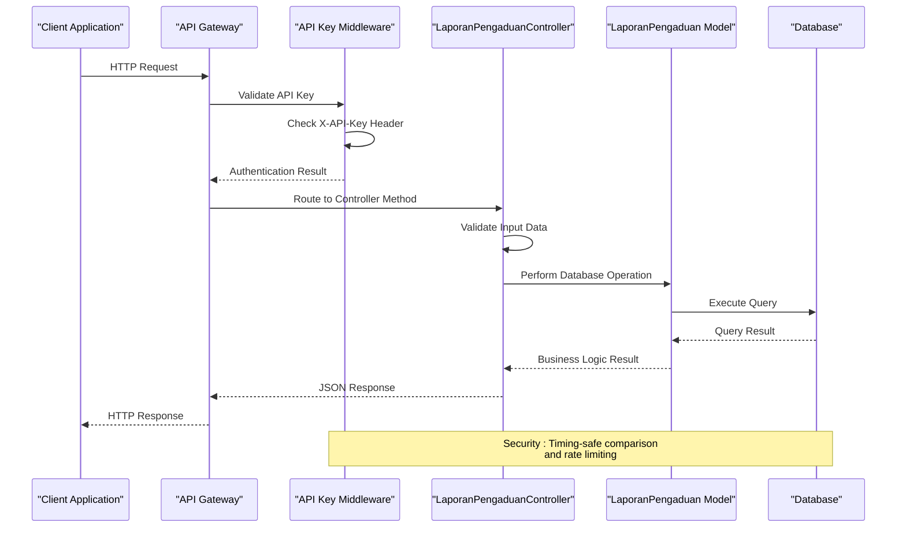
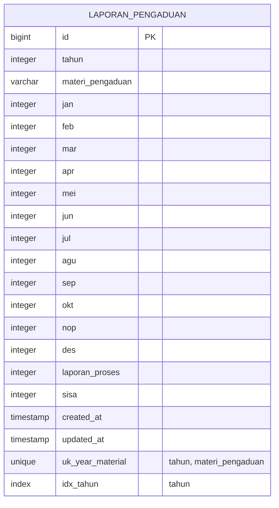
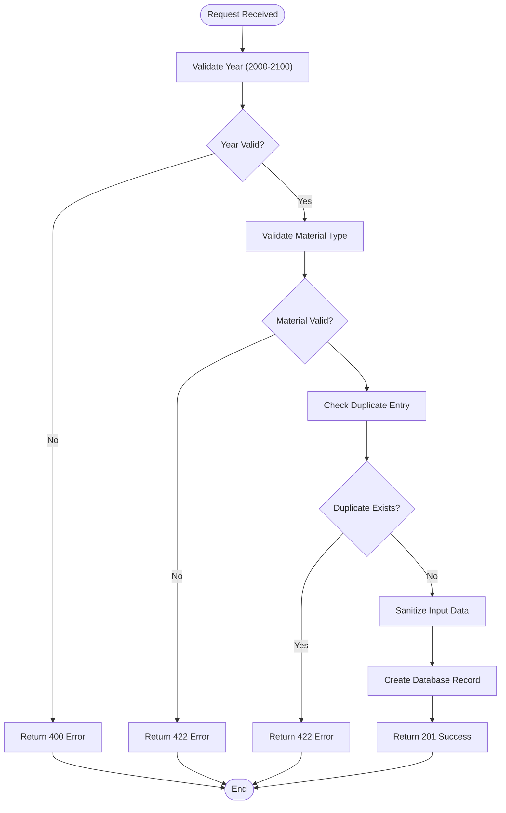

# Laporan Pengaduan CRUD Operations

<cite>
**Referenced Files in This Document**
- [LaporanPengaduanController.php](file://app/Http/Controllers/LaporanPengaduanController.php)
- [LaporanPengaduan.php](file://app/Models/LaporanPengaduan.php)
- [2026_03_31_000002_create_laporan_pengaduan_table.php](file://database/migrations/2026_03_31_000002_create_laporan_pengaduan_table.php)
- [web.php](file://routes/web.php)
- [ApiKeyMiddleware.php](file://app/Http/Middleware/ApiKeyMiddleware.php)
- [Controller.php](file://app/Http/Controllers/Controller.php)
- [LaporanPengaduanSeeder.php](file://database/seeders/LaporanPengaduanSeeder.php)
- [joomla-integration-laporan-pengaduan.html](file://docs/joomla-integration-laporan-pengaduan.html)
</cite>

## Table of Contents
1. [Introduction](#introduction)
2. [Project Structure](#project-structure)
3. [Core Components](#core-components)
4. [Architecture Overview](#architecture-overview)
5. [Detailed Component Analysis](#detailed-component-analysis)
6. [API Reference](#api-reference)
7. [Validation Rules](#validation-rules)
8. [Search and Filtering](#search-and-filtering)
9. [Practical Examples](#practical-examples)
10. [Performance Considerations](#performance-considerations)
11. [Troubleshooting Guide](#troubleshooting-guide)
12. [Conclusion](#conclusion)

## Introduction

The Laporan Pengaduan module provides comprehensive CRUD (Create, Read, Update, Delete) operations for managing citizen complaint reports within the Pengadilan Agama Penajam system. This API enables authorized clients to track and manage various categories of judicial complaints, including ethical violations, abuse of authority, misconduct, and administrative errors.

The system follows a structured approach to complaint categorization with predefined material types and monthly tracking mechanisms. It supports both individual record operations and bulk data retrieval with year-based filtering capabilities.

## Project Structure

The Laporan Pengaduan functionality is organized within the Laravel Lumen framework following standard MVC architecture patterns:



**Diagram sources**
- [web.php:55-58](file://routes/web.php#L55-L58)
- [LaporanPengaduanController.php:9-137](file://app/Http/Controllers/LaporanPengaduanController.php#L9-L137)
- [LaporanPengaduan.php:7-44](file://app/Models/LaporanPengaduan.php#L7-L44)

**Section sources**
- [web.php:1-165](file://routes/web.php#L1-L165)
- [LaporanPengaduanController.php:1-137](file://app/Http/Controllers/LaporanPengaduanController.php#L1-L137)

## Core Components

### Controller Implementation

The LaporanPengaduanController serves as the primary interface for all CRUD operations, implementing comprehensive validation and data sanitization mechanisms.

**Key Features:**
- **Protected Routes**: All write operations require API key authentication
- **Input Validation**: Strict validation rules for all incoming data
- **Data Sanitization**: XSS prevention through HTML tag stripping
- **Unique Constraints**: Prevents duplicate entries for year-material combinations
- **Error Handling**: Comprehensive error responses with appropriate HTTP status codes

### Model Definition

The LaporanPengaduan model defines the data structure and business logic for complaint records:

**Supported Complaint Categories:**
1. Ethical Violations Against Code of Conduct or Behavioral Guidelines
2. Abuse of Authority or Position
3. Civil Servant Disciplinary Violations
4. Questionable Acts
5. Procedural Law Violations
6. Administrative Mistakes
7. Unsatisfactory Public Service

**Monthly Tracking Fields:**
- Individual monthly counts for each complaint category
- Processed report tracking
- Remaining balance calculations

**Section sources**
- [LaporanPengaduanController.php:11-137](file://app/Http/Controllers/LaporanPengaduanController.php#L11-L137)
- [LaporanPengaduan.php:34-42](file://app/Models/LaporanPengaduan.php#L34-L42)

## Architecture Overview

The system implements a layered architecture with clear separation of concerns:



**Diagram sources**
- [ApiKeyMiddleware.php:14-39](file://app/Http/Middleware/ApiKeyMiddleware.php#L14-L39)
- [LaporanPengaduanController.php:74-106](file://app/Http/Controllers/LaporanPengaduanController.php#L74-L106)
- [web.php:78-164](file://routes/web.php#L78-L164)

## Detailed Component Analysis

### Database Schema Analysis

The database schema supports comprehensive complaint tracking with the following structure:



**Diagram sources**
- [2026_03_31_000002_create_laporan_pengaduan_table.php:11-33](file://database/migrations/2026_03_31_000002_create_laporan_pengaduan_table.php#L11-L33)

### Request Validation Flow

The validation process ensures data integrity and prevents malicious input:



**Diagram sources**
- [LaporanPengaduanController.php:76-100](file://app/Http/Controllers/LaporanPengaduanController.php#L76-L100)
- [LaporanPengaduan.php:34-42](file://app/Models/LaporanPengaduan.php#L34-L42)

**Section sources**
- [2026_03_31_000002_create_laporan_pengaduan_table.php:11-33](file://database/migrations/2026_03_31_000002_create_laporan_pengaduan_table.php#L11-L33)
- [LaporanPengaduanController.php:74-106](file://app/Http/Controllers/LaporanPengaduanController.php#L74-L106)

## API Reference

### Authentication Requirements

All protected endpoints require API key authentication through the `X-API-Key` header:

**Header Requirements:**
- Header Name: `X-API-Key`
- Header Value: Valid API key from environment configuration
- Authentication Method: Timing-safe comparison to prevent timing attacks

### Endpoint Definitions

#### GET /api/laporan-pengaduan
**Description:** Retrieve all complaint records with optional year filtering

**Query Parameters:**
- `tahun` (optional): Integer year between 2000-2100

**Response Format:**
```json
{
  "success": true,
  "data": [
    {
      "id": 1,
      "tahun": 2024,
      "materi_pengaduan": "Pelanggaran Terhadap Kode Etik Atau Pedoman Perilaku Hakim",
      "jan": 15,
      "feb": 12,
      "mar": 18,
      "apr": null,
      "mei": null,
      "jun": null,
      "jul": null,
      "agu": null,
      "sep": null,
      "okt": null,
      "nop": null,
      "des": null,
      "laporan_proses": 5,
      "sisa": 3,
      "created_at": "2024-01-15T10:30:00Z",
      "updated_at": "2024-01-15T10:30:00Z"
    }
  ],
  "total": 7
}
```

#### GET /api/laporan-pengaduan/{id}
**Description:** Retrieve a specific complaint record by ID

**Path Parameters:**
- `id`: Integer record identifier

**Response Format:**
```json
{
  "success": true,
  "data": {
    "id": 1,
    "tahun": 2024,
    "materi_pengaduan": "Pelanggaran Terhadap Kode Etik Atau Pedoman Perilaku Hakim",
    "jan": 15,
    "feb": 12,
    "mar": 18,
    "apr": null,
    "mei": null,
    "jun": null,
    "jul": null,
    "agu": null,
    "sep": null,
    "okt": null,
    "nop": null,
    "des": null,
    "laporan_proses": 5,
    "sisa": 3,
    "created_at": "2024-01-15T10:30:00Z",
    "updated_at": "2024-01-15T10:30:00Z"
  }
}
```

#### GET /api/laporan-pengaduan/tahun/{tahun}
**Description:** Retrieve all complaint records for a specific year

**Path Parameters:**
- `tahun`: Integer year between 2000-2100

**Response Format:**
```json
{
  "success": true,
  "data": [
    {
      "id": 1,
      "tahun": 2024,
      "materi_pengaduan": "Pelanggaran Terhadap Kode Etik Atau Pedoman Perilaku Hakim",
      "jan": 15,
      "feb": 12,
      "mar": 18,
      "apr": null,
      "mei": null,
      "jun": null,
      "jul": null,
      "agu": null,
      "sep": null,
      "okt": null,
      "nop": null,
      "des": null,
      "laporan_proses": 5,
      "sisa": 3,
      "created_at": "2024-01-15T10:30:00Z",
      "updated_at": "2024-01-15T10:30:00Z"
    }
  ],
  "total": 7
}
```

#### POST /api/laporan-pengaduan
**Description:** Create a new complaint record

**Request Headers:**
- `X-API-Key`: Required for authentication
- `Content-Type: application/json`

**Request Body:**
```json
{
  "tahun": 2024,
  "materi_pengaduan": "Pelanggaran Terhadap Kode Etik Atau Pedoman Perilaku Hakim",
  "jan": 15,
  "feb": 12,
  "mar": 18,
  "apr": 0,
  "mei": 0,
  "jun": 0,
  "jul": 0,
  "agu": 0,
  "sep": 0,
  "okt": 0,
  "nop": 0,
  "des": 0,
  "laporan_proses": 5,
  "sisa": 3
}
```

**Response Format:**
```json
{
  "success": true,
  "message": "Data berhasil disimpan",
  "data": {
    "id": 1,
    "tahun": 2024,
    "materi_pengaduan": "Pelanggaran Terhadap Kode Etik Atau Pedoman Perilaku Hakim",
    "jan": 15,
    "feb": 12,
    "mar": 18,
    "apr": 0,
    "mei": 0,
    "jun": 0,
    "jul": 0,
    "agu": 0,
    "sep": 0,
    "okt": 0,
    "nop": 0,
    "des": 0,
    "laporan_proses": 5,
    "sisa": 3,
    "created_at": "2024-01-15T10:30:00Z",
    "updated_at": "2024-01-15T10:30:00Z"
  }
}
```

#### PUT /api/laporan-pengaduan/{id}
**Description:** Update an existing complaint record

**Path Parameters:**
- `id`: Integer record identifier

**Request Headers:**
- `X-API-Key`: Required for authentication
- `Content-Type: application/json`

**Request Body:**
```json
{
  "jan": 20,
  "feb": 15,
  "laporan_proses": 8,
  "sisa": 2
}
```

**Response Format:**
```json
{
  "success": true,
  "message": "Data berhasil diperbarui",
  "data": {
    "id": 1,
    "tahun": 2024,
    "materi_pengaduan": "Pelanggaran Terhadap Kode Etik Atau Pedoman Perilaku Hakim",
    "jan": 20,
    "feb": 15,
    "mar": 18,
    "apr": 0,
    "mei": 0,
    "jun": 0,
    "jul": 0,
    "agu": 0,
    "sep": 0,
    "okt": 0,
    "nop": 0,
    "des": 0,
    "laporan_proses": 8,
    "sisa": 2,
    "created_at": "2024-01-15T10:30:00Z",
    "updated_at": "2024-01-15T10:30:00Z"
  }
}
```

#### POST /api/laporan-pengaduan/{id}
**Description:** Alternative update endpoint using POST method

**Path Parameters:**
- `id`: Integer record identifier

**Request Headers:**
- `X-API-Key`: Required for authentication
- `Content-Type: application/json`

**Request Body:**
```json
{
  "jan": 20,
  "feb": 15,
  "laporan_proses": 8,
  "sisa": 2
}
```

**Response Format:**
```json
{
  "success": true,
  "message": "Data berhasil diperbarui",
  "data": {
    "id": 1,
    "tahun": 2024,
    "materi_pengaduan": "Pelanggaran Terhadap Kode Etik Atau Pedoman Perilaku Hakim",
    "jan": 20,
    "feb": 15,
    "mar": 18,
    "apr": 0,
    "mei": 0,
    "jun": 0,
    "jul": 0,
    "agu": 0,
    "sep": 0,
    "okt": 0,
    "nop": 0,
    "des": 0,
    "laporan_proses": 8,
    "sisa": 2,
    "created_at": "2024-01-15T10:30:00Z",
    "updated_at": "2024-01-15T10:30:00Z"
  }
}
```

#### DELETE /api/laporan-pengaduan/{id}
**Description:** Delete a complaint record

**Path Parameters:**
- `id`: Integer record identifier

**Request Headers:**
- `X-API-Key`: Required for authentication

**Response Format:**
```json
{
  "success": true,
  "message": "Data berhasil dihapus"
}
```

**Section sources**
- [web.php:55-140](file://routes/web.php#L55-L140)
- [LaporanPengaduanController.php:30-135](file://app/Http/Controllers/LaporanPengaduanController.php#L30-L135)

## Validation Rules

### Input Validation Specifications

The system implements comprehensive validation rules to ensure data integrity:

**Required Fields:**
- `tahun`: Integer between 2000-2100
- `materi_pengaduan`: String matching predefined categories

**Optional Monthly Fields:**
- `jan` through `des`: Integer values ≥ 0 (nullable)
- `laporan_proses`: Integer values ≥ 0 (nullable)
- `sisa`: Integer values ≥ 0 (nullable)

**Validation Logic:**
1. **Year Validation**: Ensures temporal consistency
2. **Material Validation**: Restricts to approved complaint categories
3. **Duplicate Prevention**: Prevents identical year-material combinations
4. **Integer Casting**: Converts string values to integers safely

### Error Response Formats

**Validation Error (HTTP 422):**
```json
{
  "success": false,
  "message": "Materi pengaduan tidak valid."
}
```

**Not Found Error (HTTP 404):**
```json
{
  "success": false,
  "message": "Data tidak ditemukan"
}
```

**Authentication Error (HTTP 401):**
```json
{
  "success": false,
  "message": "Unauthorized"
}
```

**Section sources**
- [LaporanPengaduanController.php:76-100](file://app/Http/Controllers/LaporanPengaduanController.php#L76-L100)
- [ApiKeyMiddleware.php:28-36](file://app/Http/Middleware/ApiKeyMiddleware.php#L28-L36)

## Search and Filtering

### Year-Based Filtering

The system supports flexible year-based filtering through multiple endpoints:

**Filter Methods:**
1. **Query Parameter Filter**: `GET /api/laporan-pengaduan?tahun=2024`
2. **Direct Year Endpoint**: `GET /api/laporan-pengaduan/tahun/2024`

**Sorting Behavior:**
- Results sorted by year in descending order
- Within each year, sorted by complaint category priority

**Category Priority Order:**
1. Ethical Violations
2. Abuse of Authority
3. Disciplinary Violations
4. Questionable Acts
5. Procedural Law Violations
6. Administrative Mistakes
7. Unsatisfactory Public Service

### Data Retrieval Patterns

**Complete Dataset Retrieval:**
```javascript
// Get all records with default sorting
fetch('https://api.pa-penajam.go.id/api/laporan-pengaduan')
  .then(response => response.json())
  .then(data => console.log(data));
```

**Year-Specific Retrieval:**
```javascript
// Get records for specific year
fetch('https://api.pa-penajam.go.id/api/laporan-pengaduan?tahun=2024')
  .then(response => response.json())
  .then(data => console.log(data));
```

**Section sources**
- [LaporanPengaduanController.php:30-63](file://app/Http/Controllers/LaporanPengaduanController.php#L30-L63)
- [LaporanPengaduanSeeder.php:32-42](file://database/seeders/LaporanPengaduanSeeder.php#L32-L42)

## Practical Examples

### Successful CRUD Operations

**Creating a New Complaint Record:**
```bash
curl -X POST https://api.pa-penajam.go.id/api/laporan-pengaduan \
  -H "X-API-Key: YOUR_API_KEY_HERE" \
  -H "Content-Type: application/json" \
  -d '{
    "tahun": 2024,
    "materi_pengaduan": "Pelanggaran Terhadap Kode Etik Atau Pedoman Perilaku Hakim",
    "jan": 15,
    "feb": 12,
    "mar": 18,
    "laporan_proses": 5,
    "sisa": 3
  }'
```

**Updating Existing Records:**
```bash
curl -X PUT https://api.pa-penajam.go.id/api/laporan-pengaduan/1 \
  -H "X-API-Key: YOUR_API_KEY_HERE" \
  -H "Content-Type: application/json" \
  -d '{
    "feb": 18,
    "mar": 20,
    "laporan_proses": 8
  }'
```

**Retrieving Specific Records:**
```bash
curl -X GET https://api.pa-penajam.go.id/api/laporan-pengaduan/1 \
  -H "X-API-Key: YOUR_API_KEY_HERE"
```

### Error Handling Examples

**Authentication Failure:**
```bash
curl -X GET https://api.pa-penajam.go.id/api/laporan-pengaduan \
  -H "X-API-Key: INVALID_KEY"
```

**Expected Response:**
```json
{
  "success": false,
  "message": "Unauthorized"
}
```

**Duplicate Entry Prevention:**
```bash
curl -X POST https://api.pa-penajam.go.id/api/laporan-pengaduan \
  -H "X-API-Key: YOUR_API_KEY_HERE" \
  -H "Content-Type: application/json" \
  -d '{
    "tahun": 2024,
    "materi_pengaduan": "Pelanggaran Terhadap Kode Etik Atau Pedoman Perilaku Hakim"
  }'
```

**Expected Response:**
```json
{
  "success": false,
  "message": "Data untuk tahun dan materi tersebut sudah ada."
}
```

### Search Functionality Examples

**Year-Based Search:**
```bash
curl -X GET "https://api.pa-penajam.go.id/api/laporan-pengaduan?tahun=2024" \
  -H "X-API-Key: YOUR_API_KEY_HERE"
```

**Individual Record Retrieval:**
```bash
curl -X GET "https://api.pa-penajam.go.id/api/laporan-pengaduan/1" \
  -H "X-API-Key: YOUR_API_KEY_HERE"
```

**Section sources**
- [joomla-integration-laporan-pengaduan.html:236-251](file://docs/joomla-integration-laporan-pengaduan.html#L236-L251)

## Performance Considerations

### Database Optimization

**Indexing Strategy:**
- Composite unique index on `(tahun, materi_pengaduan)` prevents duplicates efficiently
- Single-column index on `tahun` enables fast year-based queries
- Automatic timestamp indexing for audit trails

**Query Optimization:**
- Field ordering ensures consistent result presentation
- Efficient WHERE clause usage for year filtering
- Minimal SELECT operations to reduce bandwidth

### Security Measures

**Authentication Security:**
- Timing-safe API key comparison prevents timing attacks
- Configurable API key through environment variables
- Randomized delays to mitigate brute force attempts

**Input Security:**
- HTML tag stripping prevents XSS attacks
- Integer casting ensures numeric data integrity
- Null handling for optional fields

### Rate Limiting

**Request Throttling:**
- 100 requests per minute for all endpoints
- Separate limits for public and protected routes
- Configurable through middleware configuration

## Troubleshooting Guide

### Common Issues and Solutions

**Authentication Problems:**
- **Issue**: 401 Unauthorized responses
- **Cause**: Missing or invalid API key header
- **Solution**: Verify `X-API-Key` header contains valid API key

**Validation Errors:**
- **Issue**: 422 Unprocessable Entity responses
- **Cause**: Invalid year range or unauthorized material type
- **Solution**: Ensure year is between 2000-2100 and material matches predefined categories

**Duplicate Entry Errors:**
- **Issue**: 422 responses for duplicate data
- **Cause**: Same year-material combination already exists
- **Solution**: Use UPDATE endpoint for existing records or modify the material type

**Database Connection Issues:**
- **Issue**: 500 Internal Server Error during validation
- **Cause**: Missing API key configuration
- **Solution**: Verify `API_KEY` environment variable is set

### Debugging Tips

**Enable Detailed Logging:**
- Check application logs for validation failures
- Monitor rate limit violations
- Review authentication attempts

**Testing Strategies:**
- Test validation rules independently
- Verify database constraints
- Validate response formats

**Section sources**
- [ApiKeyMiddleware.php:20-25](file://app/Http/Middleware/ApiKeyMiddleware.php#L20-L25)
- [LaporanPengaduanController.php:93-100](file://app/Http/Controllers/LaporanPengaduanController.php#L93-L100)

## Conclusion

The Laporan Pengaduan CRUD operations provide a robust foundation for managing citizen complaint reporting within the judicial system. The implementation demonstrates strong security practices, comprehensive validation, and flexible querying capabilities.

**Key Strengths:**
- Secure API key authentication with timing-safe comparisons
- Comprehensive input validation preventing data integrity issues
- Flexible year-based filtering for efficient data retrieval
- Well-defined complaint categories supporting systematic tracking
- Proper error handling with meaningful response messages

**Implementation Benefits:**
- Supports automated data collection from external systems
- Enables real-time monitoring through web integrations
- Provides historical trend analysis through year-based queries
- Maintains data consistency through unique constraints
- Offers extensible architecture for future enhancements

The system successfully balances security, usability, and functionality, making it suitable for production deployment in judicial environments requiring reliable complaint management capabilities.