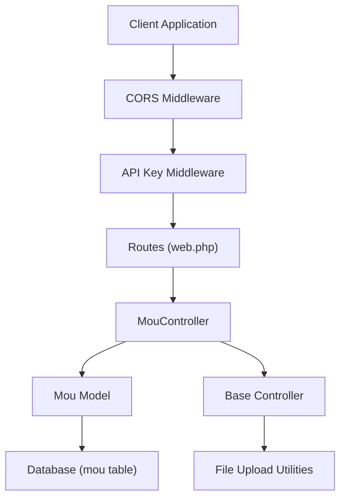
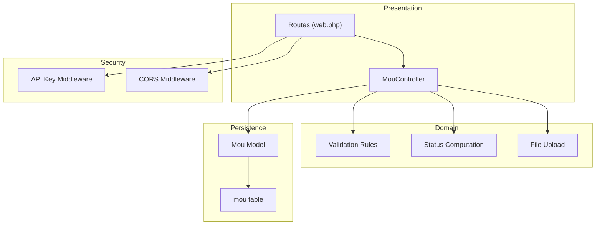
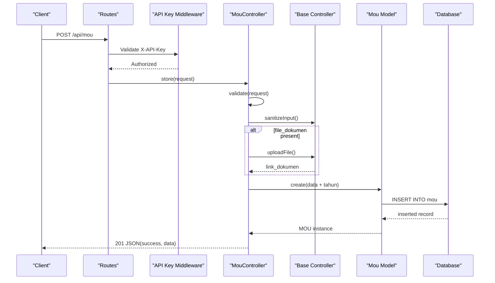
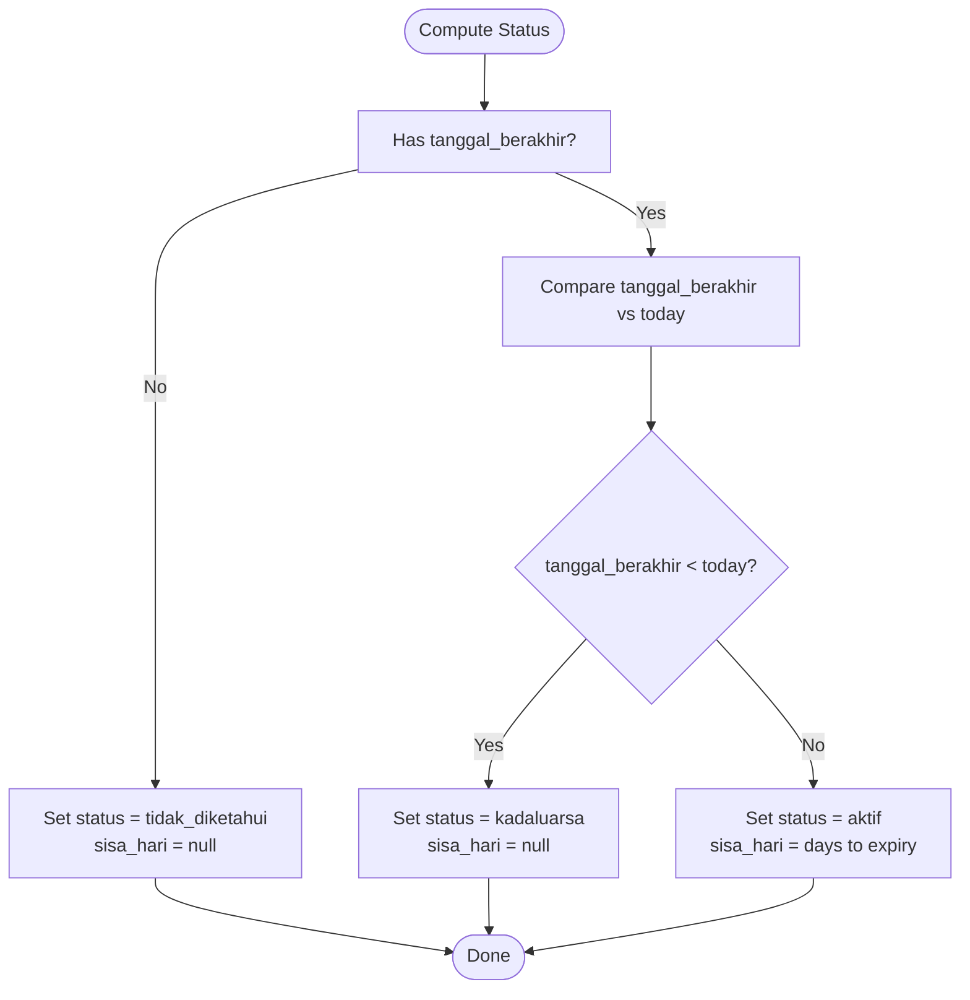
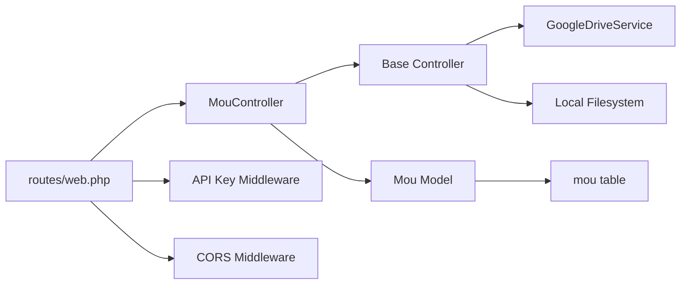
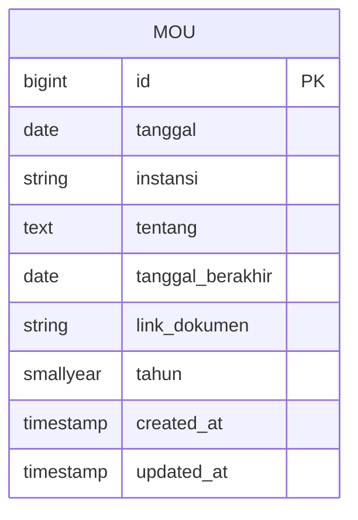

# MOU CRUD Operations

<cite>
**Referenced Files in This Document**
- [routes/web.php](file://routes/web.php)
- [app/Http/Controllers/MouController.php](file://app/Http/Controllers/MouController.php)
- [app/Http/Controllers/Controller.php](file://app/Http/Controllers/Controller.php)
- [app/Http/Middleware/ApiKeyMiddleware.php](file://app/Http/Middleware/ApiKeyMiddleware.php)
- [app/Http/Middleware/CorsMiddleware.php](file://app/Http/Middleware/CorsMiddleware.php)
- [app/Models/Mou.php](file://app/Models/Mou.php)
- [database/migrations/2026_04_01_000000_create_mou_table.php](file://database/migrations/2026_04_01_000000_create_mou_table.php)
- [database/seeders/MouSeeder.php](file://database/seeders/MouSeeder.php)
- [SECURITY.md](file://SECURITY.md)
</cite>

## Table of Contents
1. [Introduction](#introduction)
2. [Project Structure](#project-structure)
3. [Core Components](#core-components)
4. [Architecture Overview](#architecture-overview)
5. [Detailed Component Analysis](#detailed-component-analysis)
6. [Dependency Analysis](#dependency-analysis)
7. [Performance Considerations](#performance-considerations)
8. [Troubleshooting Guide](#troubleshooting-guide)
9. [Conclusion](#conclusion)
10. [Appendices](#appendices)

## Introduction
This document provides comprehensive API documentation for Memorandum of Understanding (MOU) CRUD operations. It covers:
- Endpoints for listing, viewing, creating, updating, and deleting MOU records
- Request/response schemas and validation rules
- Status calculation logic for agreement tracking
- Authentication via API key and rate limiting
- Practical examples for authenticated requests, validation errors, and successful operations
- Search and filtering via GET endpoints

The MOU module supports inter-agency agreements with dynamic status computation and optional document upload.

## Project Structure
The MOU functionality is implemented as part of the Lumen-based API backend. Key elements:
- Routes define public and protected endpoints under the /api namespace
- MouController handles all CRUD operations and applies dynamic status computation
- Mou model defines the database schema and attribute casting
- Base Controller provides input sanitization and file upload utilities
- Middleware enforces API key authentication and CORS security
- Migration and seeder define the database structure and initial data

**Diagram sources**
- [routes/web.php:70-158](file://routes/web.php#L70-L158)
- [app/Http/Controllers/MouController.php:8-134](file://app/Http/Controllers/MouController.php#L8-L134)
- [app/Http/Controllers/Controller.php:18-95](file://app/Http/Controllers/Controller.php#L18-L95)
- [app/Models/Mou.php:7-25](file://app/Models/Mou.php#L7-L25)
- [database/migrations/2026_04_01_000000_create_mou_table.php:11-23](file://database/migrations/2026_04_01_000000_create_mou_table.php#L11-L23)

**Section sources**
- [routes/web.php:70-158](file://routes/web.php#L70-L158)
- [app/Http/Controllers/MouController.php:8-134](file://app/Http/Controllers/MouController.php#L8-L134)
- [app/Models/Mou.php:7-25](file://app/Models/Mou.php#L7-L25)
- [database/migrations/2026_04_01_000000_create_mou_table.php:11-23](file://database/migrations/2026_04_01_000000_create_mou_table.php#L11-L23)

## Core Components
- Routes: Define GET (public) and POST/PUT/DELETE (protected) endpoints for MOU
- MouController: Implements index, show, store, update, destroy with validation and dynamic status computation
- Base Controller: Provides input sanitization and secure file upload
- Mou Model: Maps to the mou table with fillable attributes and casts
- Middleware: Enforces API key authentication and CORS security
- Database: Migration creates the mou table; seeder seeds initial data

**Section sources**
- [routes/web.php:70-158](file://routes/web.php#L70-L158)
- [app/Http/Controllers/MouController.php:10-134](file://app/Http/Controllers/MouController.php#L10-L134)
- [app/Http/Controllers/Controller.php:18-95](file://app/Http/Controllers/Controller.php#L18-L95)
- [app/Models/Mou.php:11-24](file://app/Models/Mou.php#L11-L24)
- [database/migrations/2026_04_01_000000_create_mou_table.php:11-23](file://database/migrations/2026_04_01_000000_create_mou_table.php#L11-L23)
- [database/seeders/MouSeeder.php:15-112](file://database/seeders/MouSeeder.php#L15-L112)

## Architecture Overview
The MOU API follows a layered architecture:
- Presentation Layer: Routes and Controllers
- Domain Layer: Business logic for validation, status computation, and file handling
- Persistence Layer: Eloquent Model mapped to the mou table
- Security Layer: API key middleware and CORS middleware

**Diagram sources**
- [routes/web.php:70-158](file://routes/web.php#L70-L158)
- [app/Http/Controllers/MouController.php:51-134](file://app/Http/Controllers/MouController.php#L51-L134)
- [app/Models/Mou.php:7-25](file://app/Models/Mou.php#L7-L25)
- [app/Http/Middleware/ApiKeyMiddleware.php:14-39](file://app/Http/Middleware/ApiKeyMiddleware.php#L14-L39)
- [app/Http/Middleware/CorsMiddleware.php:14-62](file://app/Http/Middleware/CorsMiddleware.php#L14-L62)

## Detailed Component Analysis

### Endpoints and Authentication
- Public endpoints (no API key):
  - GET /api/mou
  - GET /api/mou/{id}
- Protected endpoints (require API key):
  - POST /api/mou
  - PUT /api/mou/{id}
  - POST /api/mou/{id} (update alias)
  - DELETE /api/mou/{id}
- Authentication header: X-API-Key
- Rate limiting:
  - Public: 100 requests/minute
  - Protected: 30 requests/minute

**Section sources**
- [routes/web.php:70-158](file://routes/web.php#L70-L158)
- [app/Http/Middleware/ApiKeyMiddleware.php:14-39](file://app/Http/Middleware/ApiKeyMiddleware.php#L14-L39)
- [SECURITY.md:17-21](file://SECURITY.md#L17-L21)

### Request and Response Schemas

#### GET /api/mou
- Query parameters:
  - tahun (optional): integer year filter
  - per_page (optional): items per page (default 15)
- Response fields:
  - success: boolean
  - data: array of MOU items
  - total: integer
  - current_page: integer
  - last_page: integer
  - per_page: integer
- Dynamic fields added to each item:
  - status: string (aktif, kadaluarsa, tidak_diketahui)
  - sisa_hari: integer|null (days until expiry if active)

#### GET /api/mou/{id}
- Path parameter:
  - id: integer
- Response fields:
  - success: boolean
  - data: single MOU item with dynamic status fields

#### POST /api/mou
- Required fields:
  - tanggal: date (YYYY-MM-DD)
  - instansi: string (max 255)
  - tentang: text
- Optional fields:
  - tanggal_berakhir: date (must be >= tanggal if provided)
  - file_dokumen: file (PDF, JPG, JPEG, PNG; max 5120 KB)
- Response fields:
  - success: boolean
  - data: created MOU item (includes computed year and optional link_dokumen)

#### PUT /api/mou/{id} and POST /api/mou/{id} (update)
- Path parameter:
  - id: integer
- Same request schema as POST with optional file replacement
- Response fields:
  - success: boolean
  - data: updated MOU item

#### DELETE /api/mou/{id}
- Path parameter:
  - id: integer
- Response fields:
  - success: boolean

**Section sources**
- [routes/web.php:70-158](file://routes/web.php#L70-L158)
- [app/Http/Controllers/MouController.php:10-104](file://app/Http/Controllers/MouController.php#L10-L104)
- [app/Models/Mou.php:11-24](file://app/Models/Mou.php#L11-L24)

### Validation Rules
- tanggal: required, date
- instansi: required, max 255
- tentang: required
- tanggal_berakhir: nullable, date, after_or_equal:tanggal
- file_dokumen: nullable, file, mimes:pdf,jpg,jpeg,png, max:5120
- Additional:
  - Input sanitization strips HTML tags and trims strings
  - Year extracted from tanggal for indexing

**Section sources**
- [app/Http/Controllers/MouController.php:53-89](file://app/Http/Controllers/MouController.php#L53-L89)
- [app/Http/Controllers/Controller.php:18-29](file://app/Http/Controllers/Controller.php#L18-L29)

### Status Management and Value Calculations
Dynamic status computed per record:
- If tanggal_berakhir is null: status = tidak_diketahui, sisa_hari = null
- Else:
  - If tanggal_berakhir < today: status = kadaluarsa, sisa_hari = null
  - Else: status = aktif, sisa_hari = days between today and tanggal_berakhir

Pagination and ordering:
- Results ordered by tanggal desc
- per_page defaults to 15

**Section sources**
- [app/Http/Controllers/MouController.php:24-36](file://app/Http/Controllers/MouController.php#L24-L36)
- [app/Http/Controllers/MouController.php:115-132](file://app/Http/Controllers/MouController.php#L115-L132)

### File Upload and Storage
- Allowed MIME types: PDF, DOC, DOCX, XLS, XLSX, JPEG, PNG
- Priority: Google Drive upload; fallback to local storage
- Filename generation uses random bytes for unpredictability
- Returned link stored in link_dokumen

**Section sources**
- [app/Http/Controllers/Controller.php:40-95](file://app/Http/Controllers/Controller.php#L40-L95)

### Database Schema
- Table: mou
- Columns:
  - id: auto-increment
  - tanggal: date
  - instansi: string
  - tentang: text
  - tanggal_berakhir: date|null
  - link_dokumen: string|null
  - tahun: year
  - timestamps
- Indexes: tahun, tanggal

**Section sources**
- [database/migrations/2026_04_01_000000_create_mou_table.php:11-23](file://database/migrations/2026_04_01_000000_create_mou_table.php#L11-L23)
- [app/Models/Mou.php:9-24](file://app/Models/Mou.php#L9-L24)

### Example Workflows

#### Successful Creation (Authenticated)
- Request:
  - Method: POST
  - URL: /api/mou
  - Headers: X-API-Key: YOUR_API_KEY
  - Body: JSON with tanggal, instansi, tentang, optional tanggal_berakhir, optional file_dokumen
- Response:
  - 201 Created with success flag and created data

#### Successful Update (Authenticated)
- Request:
  - Method: PUT
  - URL: /api/mou/{id}
  - Headers: X-API-Key: YOUR_API_KEY
  - Body: JSON with fields to update
- Response:
  - 200 OK with success flag and updated data

#### Successful Deletion (Authenticated)
- Request:
  - Method: DELETE
  - URL: /api/mou/{id}
  - Headers: X-API-Key: YOUR_API_KEY
- Response:
  - 200 OK with success flag

#### Listing with Filtering
- Request:
  - Method: GET
  - URL: /api/mou?tahun=2025&per_page=10
- Response:
  - 200 OK with paginated data and dynamic status fields

#### Validation Error Response
- Triggered by missing required fields or invalid formats
- Response:
  - 422 Unprocessable Entity with validation messages

#### Unauthorized Access
- Missing or invalid X-API-Key
- Response:
  - 401 Unauthorized with message

**Section sources**
- [routes/web.php:70-158](file://routes/web.php#L70-L158)
- [app/Http/Controllers/MouController.php:51-104](file://app/Http/Controllers/MouController.php#L51-L104)
- [app/Http/Middleware/ApiKeyMiddleware.php:27-36](file://app/Http/Middleware/ApiKeyMiddleware.php#L27-L36)

### Sequence Diagram: Create MOU

**Diagram sources**
- [routes/web.php:154-158](file://routes/web.php#L154-L158)
- [app/Http/Middleware/ApiKeyMiddleware.php:14-39](file://app/Http/Middleware/ApiKeyMiddleware.php#L14-L39)
- [app/Http/Controllers/MouController.php:51-74](file://app/Http/Controllers/MouController.php#L51-L74)
- [app/Http/Controllers/Controller.php:18-95](file://app/Http/Controllers/Controller.php#L18-L95)
- [app/Models/Mou.php:11-18](file://app/Models/Mou.php#L11-L18)

### Flowchart: Status Computation

**Diagram sources**
- [app/Http/Controllers/MouController.php:115-132](file://app/Http/Controllers/MouController.php#L115-L132)

## Dependency Analysis
- Routes depend on MouController actions
- MouController depends on:
  - Validation rules
  - Base Controller for sanitization and upload
  - Mou Model for persistence
- Base Controller depends on:
  - GoogleDriveService (optional)
  - Local filesystem for fallback
- Model depends on database schema
- Middleware enforces cross-cutting concerns

**Diagram sources**
- [routes/web.php:70-158](file://routes/web.php#L70-L158)
- [app/Http/Controllers/MouController.php:5-6](file://app/Http/Controllers/MouController.php#L5-L6)
- [app/Http/Controllers/Controller.php:40-95](file://app/Http/Controllers/Controller.php#L40-L95)
- [app/Models/Mou.php:7-8](file://app/Models/Mou.php#L7-L8)
- [app/Http/Middleware/ApiKeyMiddleware.php:14-39](file://app/Http/Middleware/ApiKeyMiddleware.php#L14-L39)
- [app/Http/Middleware/CorsMiddleware.php:14-62](file://app/Http/Middleware/CorsMiddleware.php#L14-L62)

**Section sources**
- [routes/web.php:70-158](file://routes/web.php#L70-L158)
- [app/Http/Controllers/MouController.php:5-6](file://app/Http/Controllers/MouController.php#L5-L6)
- [app/Http/Controllers/Controller.php:40-95](file://app/Http/Controllers/Controller.php#L40-L95)
- [app/Models/Mou.php:7-8](file://app/Models/Mou.php#L7-L8)
- [app/Http/Middleware/ApiKeyMiddleware.php:14-39](file://app/Http/Middleware/ApiKeyMiddleware.php#L14-L39)
- [app/Http/Middleware/CorsMiddleware.php:14-62](file://app/Http/Middleware/CorsMiddleware.php#L14-L62)

## Performance Considerations
- Pagination reduces payload size; tune per_page for client needs
- Indexes on tahun and tanggal improve filtering and sorting performance
- File uploads can be heavy; consider CDN integration for link_dokumen
- Status computation runs per item during pagination; keep per_page reasonable

## Troubleshooting Guide
- 401 Unauthorized: Ensure X-API-Key header matches configured API_KEY
- 422 Validation Error: Verify required fields and date formats
- 429 Too Many Requests: Respect rate limits (100/min public, 30/min protected)
- 500 Server Configuration Error: API_KEY not set in environment
- CORS blocked: Origin not in allowed list; check CORS_ALLOWED_ORIGINS

**Section sources**
- [app/Http/Middleware/ApiKeyMiddleware.php:20-36](file://app/Http/Middleware/ApiKeyMiddleware.php#L20-L36)
- [app/Http/Middleware/CorsMiddleware.php:44-48](file://app/Http/Middleware/CorsMiddleware.php#L44-L48)
- [SECURITY.md:17-21](file://SECURITY.md#L17-L21)

## Conclusion
The MOU CRUD API provides a secure, validated, and efficient interface for managing inter-agency agreements. It includes dynamic status computation, optional document upload, robust authentication, and CORS protection. Clients should use the protected endpoints with a valid API key and adhere to rate limits for reliable operation.

## Appendices

### Appendix A: Database Schema Reference

**Diagram sources**
- [database/migrations/2026_04_01_000000_create_mou_table.php:11-23](file://database/migrations/2026_04_01_000000_create_mou_table.php#L11-L23)

### Appendix B: Initial Data Seed
- Seeds MOU records with tanggal, instansi, tentang, link_dokumen
- tanggal_berakhir intentionally omitted to demonstrate status = tidak_diketahui

**Section sources**
- [database/seeders/MouSeeder.php:15-112](file://database/seeders/MouSeeder.php#L15-L112)