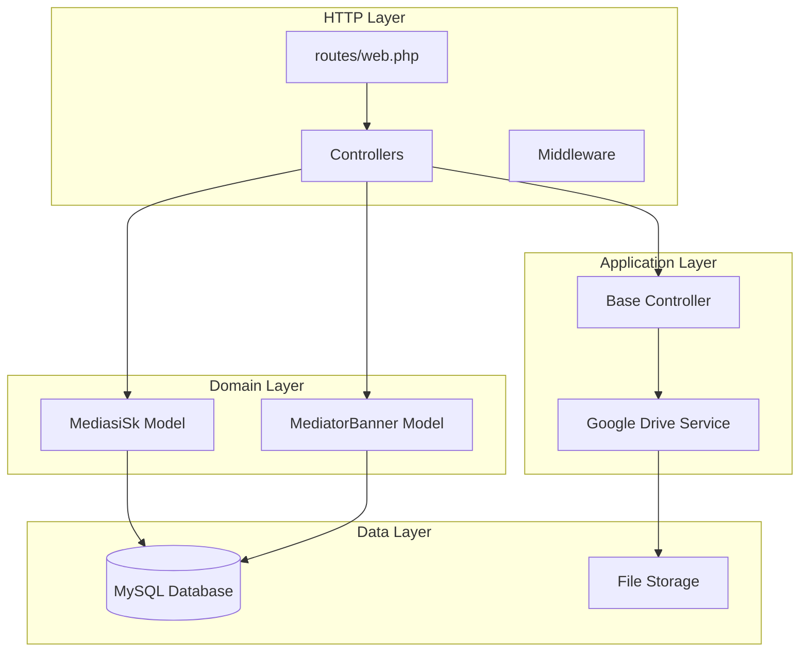
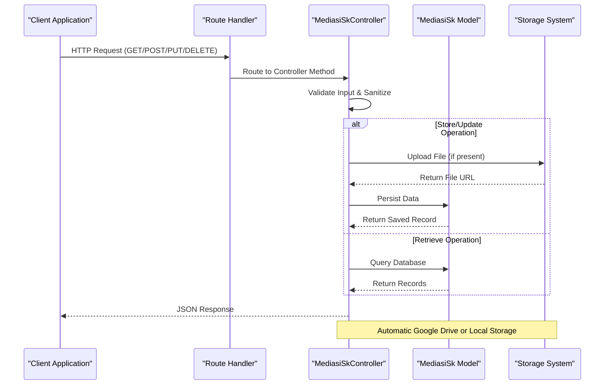
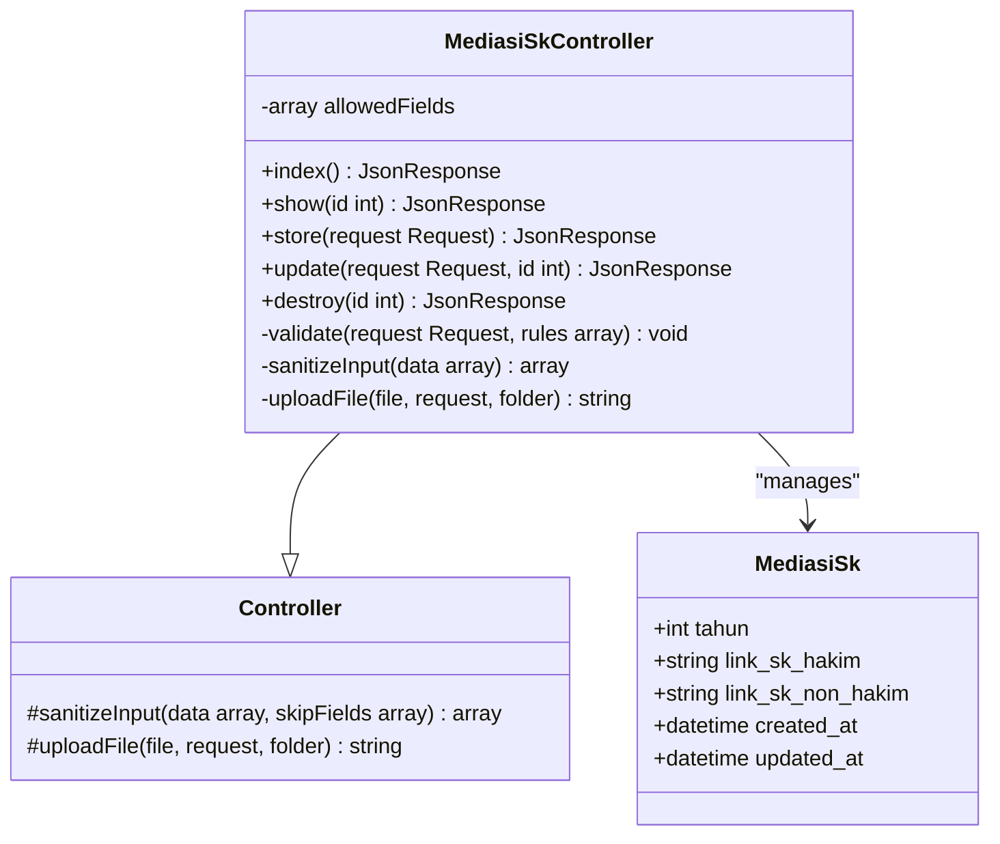
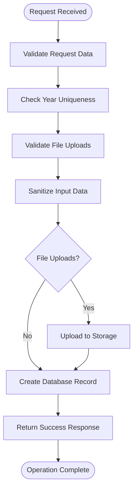
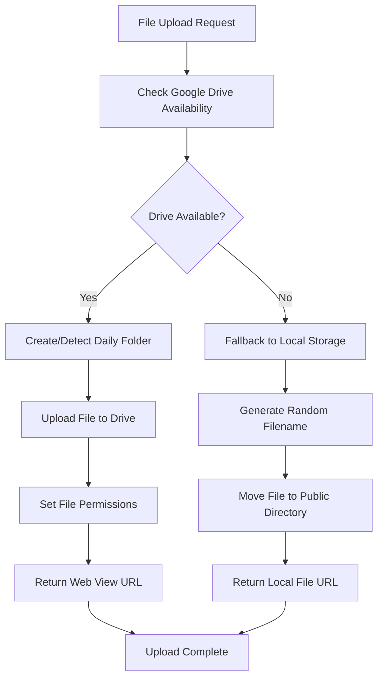
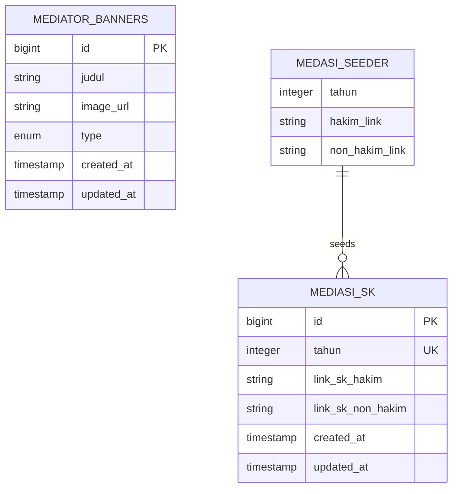

# Mediasi SK CRUD Operations

<cite>
**Referenced Files in This Document**
- [MediasiSkController.php](file://app/Http/Controllers/MediasiSkController.php)
- [MediasiSk.php](file://app/Models/MediasiSk.php)
- [MediatorBannerController.php](file://app/Http/Controllers/MediatorBannerController.php)
- [MediatorBanner.php](file://app/Models/MediatorBanner.php)
- [2026_04_05_165903_create_mediasi_sk_table.php](file://database/migrations/2026_04_05_165903_create_mediasi_sk_table.php)
- [2026_04_05_165903_create_mediator_banners_table.php](file://database/migrations/2026_04_05_165903_create_mediator_banners_table.php)
- [web.php](file://routes/web.php)
- [Controller.php](file://app/Http/Controllers/Controller.php)
- [GoogleDriveService.php](file://app/Services/GoogleDriveService.php)
- [ApiKeyMiddleware.php](file://app/Http/Middleware/ApiKeyMiddleware.php)
- [RateLimitMiddleware.php](file://app/Http/Middleware/RateLimitMiddleware.php)
- [MediasiSeeder.php](file://database/seeders/MediasiSeeder.php)
</cite>

## Table of Contents
1. [Introduction](#introduction)
2. [Project Structure](#project-structure)
3. [Core Components](#core-components)
4. [Architecture Overview](#architecture-overview)
5. [Detailed Component Analysis](#detailed-component-analysis)
6. [API Endpoints](#api-endpoints)
7. [Data Models](#data-models)
8. [Security Implementation](#security-implementation)
9. [File Upload System](#file-upload-system)
10. [Database Schema](#database-schema)
11. [Performance Considerations](#performance-considerations)
12. [Troubleshooting Guide](#troubleshooting-guide)
13. [Conclusion](#conclusion)

## Introduction

The Mediasi SK CRUD Operations module is a comprehensive system designed to manage Mediation Court (Mediasi) official documents and related media content. This module provides full CRUD (Create, Read, Update, Delete) operations for SK (Surat Keputusan) documents issued by mediators, along with banner management for mediator promotional materials.

The system integrates modern Laravel/Lumen framework capabilities with robust security measures, automated file handling, and flexible deployment options supporting both cloud storage and local file systems.

## Project Structure

The Mediasi module follows a clean MVC (Model-View-Controller) architecture pattern with clear separation of concerns:

**Diagram sources**
- [web.php:77-82](file://routes/web.php#L77-L82)
- [MediasiSkController.php:9-147](file://app/Http/Controllers/MediasiSkController.php#L9-L147)
- [MediatorBannerController.php:9-133](file://app/Http/Controllers/MediatorBannerController.php#L9-L133)

**Section sources**
- [web.php:1-182](file://routes/web.php#L1-L182)
- [MediasiSkController.php:1-147](file://app/Http/Controllers/MediasiSkController.php#L1-L147)

## Core Components

The Mediasi module consists of several key components working together to provide comprehensive mediation document management:

### Primary Controllers
- **MediasiSkController**: Handles CRUD operations for SK Mediasi documents
- **MediatorBannerController**: Manages banner images and promotional content for mediators

### Supporting Infrastructure
- **Base Controller**: Provides shared functionality for input sanitization and file upload
- **Google Drive Service**: Enables cloud-based file storage with automatic organization
- **Middleware**: Implements API key authentication and rate limiting

### Data Models
- **MediasiSk**: Represents SK Mediasi documents with year-based uniqueness
- **MediatorBanner**: Manages banner content with type categorization

**Section sources**
- [MediasiSkController.php:9-147](file://app/Http/Controllers/MediasiSkController.php#L9-L147)
- [MediatorBannerController.php:9-133](file://app/Http/Controllers/MediatorBannerController.php#L9-L133)
- [Controller.php:18-96](file://app/Http/Controllers/Controller.php#L18-L96)

## Architecture Overview

The system implements a layered architecture with clear separation between presentation, business logic, and data persistence:

**Diagram sources**
- [web.php:77-82](file://routes/web.php#L77-L82)
- [MediasiSkController.php:52-82](file://app/Http/Controllers/MediasiSkController.php#L52-L82)
- [Controller.php:40-96](file://app/Http/Controllers/Controller.php#L40-L96)

## Detailed Component Analysis

### MediasiSkController - Main CRUD Operations

The MediasiSkController provides comprehensive CRUD functionality with built-in validation and file handling:

**Diagram sources**
- [MediasiSkController.php:9-147](file://app/Http/Controllers/MediasiSkController.php#L9-L147)
- [Controller.php:7-97](file://app/Http/Controllers/Controller.php#L7-L97)
- [MediasiSk.php:7-23](file://app/Models/MediasiSk.php#L7-L23)

#### Validation Logic Flow

**Diagram sources**
- [MediasiSkController.php:54-60](file://app/Http/Controllers/MediasiSkController.php#L54-L60)
- [MediasiSkController.php:64-73](file://app/Http/Controllers/MediasiSkController.php#L64-L73)

**Section sources**
- [MediasiSkController.php:11-147](file://app/Http/Controllers/MediasiSkController.php#L11-L147)

### Base Controller - Shared Functionality

The base Controller class provides essential security features and reusable functionality:

#### Input Sanitization
- Removes HTML tags from string inputs
- Trims whitespace and handles empty strings
- Prevents XSS attacks through proper sanitization

#### File Upload Management
- Supports multiple file types (PDF, DOC, XLS, JPG, PNG)
- Validates MIME types based on file content, not just extensions
- Implements fallback mechanism between Google Drive and local storage

**Section sources**
- [Controller.php:18-96](file://app/Http/Controllers/Controller.php#L18-L96)

### Google Drive Integration

The system provides seamless cloud storage integration with automatic organization:

**Diagram sources**
- [GoogleDriveService.php:38-82](file://app/Services/GoogleDriveService.php#L38-L82)
- [Controller.php:63-94](file://app/Http/Controllers/Controller.php#L63-L94)

**Section sources**
- [GoogleDriveService.php:9-117](file://app/Services/GoogleDriveService.php#L9-L117)

## API Endpoints

The Mediasi module exposes RESTful endpoints with clear distinction between public and protected operations:

### Public Endpoints (Rate Limited: 100 requests/minute)
- `GET /api/mediasi-sk` - Retrieve all SK Mediasi documents
- `GET /api/mediasi-sk/{id}` - Retrieve specific SK document
- `GET /api/mediator-banners` - Retrieve all mediator banners
- `GET /api/mediator-banners/{id}` - Retrieve specific banner

### Protected Endpoints (API Key Required + Rate Limited: 100 requests/minute)
- `POST /api/mediasi-sk` - Create new SK document
- `PUT /api/mediasi-sk/{id}` - Update existing SK document
- `DELETE /api/mediasi-sk/{id}` - Delete SK document
- `POST /api/mediator-banners` - Create new banner
- `PUT /api/mediator-banners/{id}` - Update existing banner
- `DELETE /api/mediator-banners/{id}` - Delete banner

**Section sources**
- [web.php:77-82](file://routes/web.php#L77-L82)
- [web.php:171-181](file://routes/web.php#L171-L181)

## Data Models

### MediasiSk Model
Represents SK Mediasi documents with the following structure:

| Field | Type | Constraints | Description |
|-------|------|-------------|-------------|
| `id` | bigint | auto-increment, primary | Unique identifier |
| `tahun` | integer | unique, required | Year of SK issuance |
| `link_sk_hakim` | string | nullable, max 500 chars | PDF link for Hakim mediators |
| `link_sk_non_hakim` | string | nullable, max 500 chars | PDF link for Non-Hakim mediators |
| `created_at` | datetime | auto-populated | Record creation timestamp |
| `updated_at` | datetime | auto-populated | Last update timestamp |

### MediatorBanner Model
Manages promotional banner content:

| Field | Type | Constraints | Description |
|-------|------|-------------|-------------|
| `id` | bigint | auto-increment, primary | Unique identifier |
| `judul` | string | required, max 100 chars | Banner title |
| `image_url` | string | required, max 500 chars | Image file URL |
| `type` | enum | required ('hakim', 'non-hakim') | Mediator category |
| `created_at` | datetime | auto-populated | Record creation timestamp |
| `updated_at` | datetime | auto-populated | Last update timestamp |

**Section sources**
- [MediasiSk.php:11-21](file://app/Models/MediasiSk.php#L11-L21)
- [MediatorBanner.php:11-15](file://app/Models/MediatorBanner.php#L11-L15)

## Security Implementation

The system implements multiple layers of security to protect against common vulnerabilities:

### Authentication and Authorization
- **API Key Middleware**: Requires `X-API-Key` header for protected operations
- **Timing-Safe Comparison**: Uses `hash_equals()` to prevent timing attacks
- **Random Delays**: Implements randomized delays to mitigate brute force attempts

### Input Validation and Sanitization
- **Strict Validation Rules**: Comprehensive validation for all input fields
- **HTML Tag Removal**: Prevents XSS through `strip_tags()` usage
- **MIME Type Verification**: Validates file content type, not just extension

### Rate Limiting
- **IP-Based Tracking**: Uses client IP as unique identifier
- **Configurable Limits**: Adjustable request limits and decay periods
- **Graceful Degradation**: Returns meaningful error messages with retry information

**Section sources**
- [ApiKeyMiddleware.php:14-39](file://app/Http/Middleware/ApiKeyMiddleware.php#L14-L39)
- [RateLimitMiddleware.php:15-39](file://app/Http/Middleware/RateLimitMiddleware.php#L15-L39)
- [Controller.php:18-29](file://app/Http/Controllers/Controller.php#L18-L29)

## File Upload System

The file upload system provides flexible storage options with robust validation:

### Supported File Types
- **Documents**: PDF, Microsoft Word (.doc, .docx), Excel (.xls, .xlsx)
- **Images**: JPEG, PNG formats
- **Size Limits**: 20MB for SK documents, 5MB for banner images

### Storage Options
1. **Primary**: Google Drive with automatic daily folder organization
2. **Fallback**: Local file system storage in `public/uploads/` directory

### Security Features
- **Magic Byte Validation**: Verifies actual file content type
- **Randomized Filenames**: Prevents filename collisions and guessing
- **Public Access Control**: Configurable file visibility settings

**Section sources**
- [Controller.php:44-52](file://app/Http/Controllers/Controller.php#L44-L52)
- [Controller.php:78-85](file://app/Http/Controllers/Controller.php#L78-L85)

## Database Schema

The database schema supports both SK Mediasi documents and banner management:

**Diagram sources**
- [2026_04_05_165903_create_mediasi_sk_table.php:14-20](file://database/migrations/2026_04_05_165903_create_mediasi_sk_table.php#L14-L20)
- [2026_04_05_165903_create_mediator_banners_table.php:14-19](file://database/migrations/2026_04_05_165903_create_mediator_banners_table.php#L14-L19)

### Migration Details
- **Unique Constraints**: Year field ensures no duplicate entries per year
- **Nullable Fields**: Allows partial SK document management
- **Timestamps**: Automatic creation and update tracking

**Section sources**
- [2026_04_05_165903_create_mediasi_sk_table.php:12-21](file://database/migrations/2026_04_05_165903_create_mediasi_sk_table.php#L12-L21)
- [2026_04_05_165903_create_mediator_banners_table.php:12-21](file://database/migrations/2026_04_05_165903_create_mediator_banners_table.php#L12-L21)

## Performance Considerations

### Optimization Strategies
- **Database Indexing**: Unique index on year field for efficient lookups
- **Pagination Support**: Built-in ordering by creation date for large datasets
- **Memory Management**: Streaming file uploads to prevent memory exhaustion
- **Connection Pooling**: MySQL connection pooling for improved throughput

### Scalability Features
- **Cloud Storage**: Google Drive integration enables global scalability
- **CDN Ready**: Generated URLs support Content Delivery Network integration
- **Load Balancing**: Stateless design supports horizontal scaling

## Troubleshooting Guide

### Common Issues and Solutions

#### Authentication Failures
**Symptoms**: 401 Unauthorized responses from protected endpoints
**Causes**: Missing or invalid API key header
**Solution**: Verify `X-API-Key` header contains correct API key value

#### File Upload Errors
**Symptoms**: Upload failures with validation errors
**Causes**: Unsupported file types or size violations
**Solutions**: 
- Verify file MIME type matches allowed types
- Check file size does not exceed 20MB limit
- Ensure Google Drive credentials are properly configured

#### Database Connection Issues
**Symptoms**: Application errors during data operations
**Causes**: Incorrect database configuration
**Solutions**: 
- Verify database credentials in environment variables
- Check MySQL server connectivity
- Ensure required database migrations have been executed

#### Rate Limit Exceeded
**Symptoms**: 429 Too Many Requests responses
**Causes**: Exceeded request limits
**Solutions**: 
- Implement exponential backoff in client applications
- Reduce request frequency
- Contact administrator for higher limits

**Section sources**
- [ApiKeyMiddleware.php:27-36](file://app/Http/Middleware/ApiKeyMiddleware.php#L27-L36)
- [RateLimitMiddleware.php:22-28](file://app/Http/Middleware/RateLimitMiddleware.php#L22-L28)
- [Controller.php:54-60](file://app/Http/Controllers/Controller.php#L54-L60)

## Conclusion

The Mediasi SK CRUD Operations module provides a robust, secure, and scalable solution for managing mediation court documents and related content. The system's architecture emphasizes security, flexibility, and maintainability while providing comprehensive functionality for both public document access and administrative content management.

Key strengths include:
- **Security-First Design**: Multi-layered protection against common web vulnerabilities
- **Flexible Storage**: Cloud-first approach with reliable local fallback
- **RESTful API**: Clean, consistent interface supporting modern development practices
- **Comprehensive Validation**: Strict input validation and sanitization
- **Scalable Architecture**: Designed for growth and deployment in various environments

The module serves as a foundation for broader digital transformation initiatives within the judicial system, providing a template for similar document management systems across different domains.