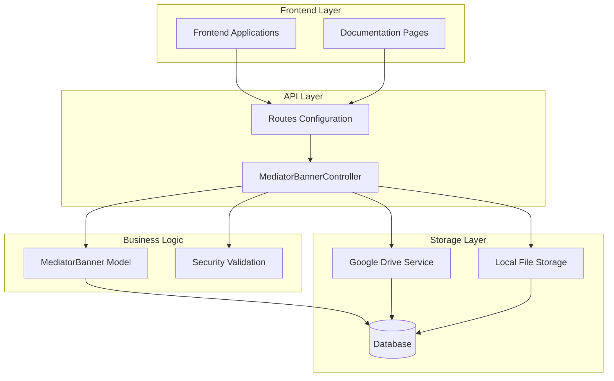
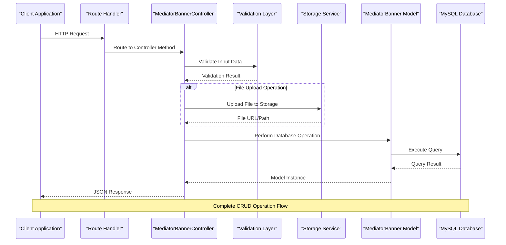
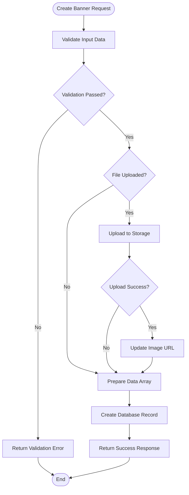
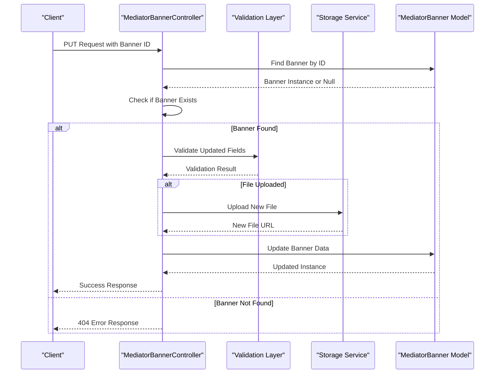
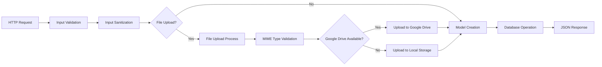

# Mediator Banners CRUD Operations

<cite>
**Referenced Files in This Document**
- [MediatorBannerController.php](file://app/Http/Controllers/MediatorBannerController.php)
- [MediatorBanner.php](file://app/Models/MediatorBanner.php)
- [Controller.php](file://app/Http/Controllers/Controller.php)
- [GoogleDriveService.php](file://app/Services/GoogleDriveService.php)
- [2026_04_05_165903_create_mediator_banners_table.php](file://database/migrations/2026_04_05_165903_create_mediator_banners_table.php)
- [MediasiSeeder.php](file://database/seeders/MediasiSeeder.php)
- [web.php](file://routes/web.php)
- [mediasi-integration.html](file://docs/mediasi-integration.html)
</cite>

## Table of Contents
1. [Introduction](#introduction)
2. [Project Structure](#project-structure)
3. [Core Components](#core-components)
4. [Architecture Overview](#architecture-overview)
5. [Detailed Component Analysis](#detailed-component-analysis)
6. [CRUD Operations](#crud-operations)
7. [Data Flow Analysis](#data-flow-analysis)
8. [Security Implementation](#security-implementation)
9. [Integration Points](#integration-points)
10. [Performance Considerations](#performance-considerations)
11. [Troubleshooting Guide](#troubleshooting-guide)
12. [Conclusion](#conclusion)

## Introduction

The Mediator Banners CRUD Operations module is a critical component of the legal system integration platform that manages dynamic banner content for mediators. This system allows administrators to manage promotional banners for both judicial mediators (hakim) and non-judicial mediators (non-hakim), with support for image uploads, validation, and secure storage mechanisms.

The module consists of a comprehensive CRUD (Create, Read, Update, Delete) interface built on the Laravel Lumen framework, featuring robust security measures, flexible file upload capabilities, and seamless integration with external systems including Google Drive storage and frontend applications.

## Project Structure

The Mediator Banners system follows a layered architecture pattern with clear separation of concerns:



**Diagram sources**
- [MediatorBannerController.php:1-134](file://app/Http/Controllers/MediatorBannerController.php#L1-L134)
- [MediatorBanner.php:1-22](file://app/Models/MediatorBanner.php#L1-L22)
- [Controller.php:1-97](file://app/Http/Controllers/Controller.php#L1-L97)

**Section sources**
- [MediatorBannerController.php:1-134](file://app/Http/Controllers/MediatorBannerController.php#L1-L134)
- [MediatorBanner.php:1-22](file://app/Models/MediatorBanner.php#L1-L22)
- [Controller.php:1-97](file://app/Http/Controllers/Controller.php#L1-L97)

## Core Components

### Database Schema

The Mediator Banners system utilizes a dedicated database table with the following structure:

| Column | Type | Constraints | Description |
|--------|------|-------------|-------------|
| `id` | BIGINT | PRIMARY KEY, AUTO_INCREMENT | Unique identifier for each banner |
| `judul` | VARCHAR(100) | NOT NULL | Banner title or caption |
| `image_url` | VARCHAR(500) | NOT NULL | URL pointing to banner image |
| `type` | ENUM('hakim','non-hakim') | NOT NULL | Banner category/type |
| `created_at` | TIMESTAMP | DEFAULT CURRENT_TIMESTAMP | Record creation timestamp |
| `updated_at` | TIMESTAMP | DEFAULT CURRENT_TIMESTAMP ON UPDATE | Last modification timestamp |

**Section sources**
- [2026_04_05_165903_create_mediator_banners_table.php:14-20](file://database/migrations/2026_04_05_165903_create_mediator_banners_table.php#L14-L20)

### Controller Architecture

The `MediatorBannerController` extends the base `Controller` class and implements comprehensive CRUD operations with built-in validation and security measures.

**Section sources**
- [MediatorBannerController.php:9-134](file://app/Http/Controllers/MediatorBannerController.php#L9-L134)
- [Controller.php:7-97](file://app/Http/Controllers/Controller.php#L7-L97)

## Architecture Overview

The system employs a multi-tiered architecture designed for scalability, security, and maintainability:



**Diagram sources**
- [MediatorBannerController.php:52-75](file://app/Http/Controllers/MediatorBannerController.php#L52-L75)
- [Controller.php:40-95](file://app/Http/Controllers/Controller.php#L40-L95)

## Detailed Component Analysis

### MediatorBannerController

The controller serves as the primary interface for all banner management operations, implementing comprehensive validation, sanitization, and error handling mechanisms.

#### Key Features:

1. **Field Validation**: Implements strict validation rules for all input fields
2. **File Upload Handling**: Supports both direct URL assignment and file upload
3. **Security Measures**: Includes XSS prevention and MIME type validation
4. **Error Handling**: Provides comprehensive error responses for invalid operations

#### Validation Rules:

| Field | Validation Rule | Description |
|-------|----------------|-------------|
| `judul` | `required|string|max:100` | Required string with maximum 100 characters |
| `image_url` | `nullable|string` | Optional URL string |
| `type` | `required|in:hakim,non-hakim` | Required enum validation |
| `image_file` | `nullable|file|mimes:jpg,jpeg,png|max:5120` | Optional file upload with size limit |

**Section sources**
- [MediatorBannerController.php:54-59](file://app/Http/Controllers/MediatorBannerController.php#L54-L59)
- [MediatorBannerController.php:90-95](file://app/Http/Controllers/MediatorBannerController.php#L90-L95)

### Base Controller Functionality

The base controller provides essential shared functionality for all controllers in the application.

#### Security Methods:

1. **Input Sanitization**: Removes HTML tags and trims whitespace from string inputs
2. **File Upload Management**: Handles both Google Drive and local storage fallback
3. **MIME Type Validation**: Validates file content type using magic bytes

**Section sources**
- [Controller.php:18-29](file://app/Http/Controllers/Controller.php#L18-L29)
- [Controller.php:40-95](file://app/Http/Controllers/Controller.php#L40-L95)

### Google Drive Service Integration

The system provides seamless integration with Google Drive for cloud-based file storage with automatic fallback mechanisms.

#### Storage Features:

1. **Automatic Folder Organization**: Creates daily subfolders based on upload date
2. **Public Access Permissions**: Configures files for public viewing
3. **Fallback Mechanism**: Automatically falls back to local storage if Google Drive fails
4. **Security Validation**: Validates file content type before upload

**Section sources**
- [GoogleDriveService.php:38-82](file://app/Services/GoogleDriveService.php#L38-L82)
- [GoogleDriveService.php:87-115](file://app/Services/GoogleDriveService.php#L87-L115)

## CRUD Operations

### Create Operation (POST)

The create operation handles the creation of new mediator banners with comprehensive validation and file upload capabilities.



**Diagram sources**
- [MediatorBannerController.php:52-75](file://app/Http/Controllers/MediatorBannerController.php#L52-L75)
- [Controller.php:40-95](file://app/Http/Controllers/Controller.php#L40-L95)

### Read Operations

The system provides two primary read operations for retrieving banner data.

#### List All Banners (GET `/api/mediator-banners`)
- Retrieves all banners ordered by creation date (newest first)
- Returns paginated results with success flag
- Public endpoint accessible without authentication

#### Get Single Banner (GET `/api/mediator-banners/{id}`)
- Retrieves specific banner by ID
- Returns 404 error if banner not found
- Includes comprehensive error handling

**Section sources**
- [MediatorBannerController.php:20-28](file://app/Http/Controllers/MediatorBannerController.php#L20-L28)
- [MediatorBannerController.php:33-47](file://app/Http/Controllers/MediatorBannerController.php#L33-L47)

### Update Operation (PUT/PATCH)

The update operation provides flexible field updates with selective validation.



**Diagram sources**
- [MediatorBannerController.php:80-111](file://app/Http/Controllers/MediatorBannerController.php#L80-L111)
- [Controller.php:40-95](file://app/Http/Controllers/Controller.php#L40-L95)

### Delete Operation (DELETE)

The delete operation removes banners from the database with proper error handling.

**Section sources**
- [MediatorBannerController.php:116-132](file://app/Http/Controllers/MediatorBannerController.php#L116-L132)

## Data Flow Analysis

### Request Processing Pipeline

The system implements a structured request processing pipeline that ensures data integrity and security:



**Diagram sources**
- [MediatorBannerController.php:61-66](file://app/Http/Controllers/MediatorBannerController.php#L61-L66)
- [Controller.php:40-95](file://app/Http/Controllers/Controller.php#L40-L95)

### Response Format Standardization

All API responses follow a consistent format structure:

| Field | Type | Description |
|-------|------|-------------|
| `success` | Boolean | Indicates operation success/failure |
| `message` | String | Human-readable status message |
| `data` | Object/Array | Contains operation results |
| `status_code` | Integer | HTTP status code (when applicable) |

**Section sources**
- [MediatorBannerController.php:24-27](file://app/Http/Controllers/MediatorBannerController.php#L24-L27)
- [MediatorBannerController.php:37-46](file://app/Http/Controllers/MediatorBannerController.php#L37-L46)

## Security Implementation

### Input Validation and Sanitization

The system implements comprehensive security measures to prevent common vulnerabilities:

#### XSS Prevention
- Automatic stripping of HTML tags from string inputs
- Whitespace trimming to prevent injection attacks
- Selective sanitization allowing controlled field bypass

#### File Upload Security
- MIME type validation using magic bytes (not just file extensions)
- Maximum file size limits (5MB)
- Supported formats: JPG, JPEG, PNG
- Randomized filename generation to prevent guessing attacks

#### Authentication and Authorization
- Protected endpoints require API key authentication
- Role-based access control for administrative operations
- CORS middleware for cross-origin resource sharing protection

**Section sources**
- [Controller.php:18-29](file://app/Http/Controllers/Controller.php#L18-L29)
- [Controller.php:42-60](file://app/Http/Controllers/Controller.php#L42-L60)
- [MediatorBannerController.php:54-59](file://app/Http/Controllers/MediatorBannerController.php#L54-L59)

### Error Handling and Logging

The system implements comprehensive error handling with detailed logging:

- Structured error responses with appropriate HTTP status codes
- Detailed error messages for debugging and monitoring
- Centralized logging for security events and system failures
- Graceful degradation when external services fail

**Section sources**
- [MediatorBannerController.php:36-40](file://app/Http/Controllers/MediatorBannerController.php#L36-L40)
- [Controller.php:55-74](file://app/Http/Controllers/Controller.php#L55-L74)

## Integration Points

### Frontend Integration

The Mediator Banners system integrates seamlessly with frontend applications through standardized APIs:

#### Frontend Data Consumption Pattern

```javascript
// Frontend JavaScript Integration
fetch(API_BASE + '/api/mediator-banners')
    .then(response => response.json())
    .then(data => {
        const banners = data.data || [];
        const container = document.getElementById('mediator-banners-section');
        
        banners.forEach(banner => {
            const bannerElement = document.createElement('div');
            bannerElement.className = 'dynamic-banner-item';
            
            const title = document.createElement('h2');
            title.textContent = banner.judul;
            
            const image = document.createElement('img');
            image.src = banner.image_url;
            image.alt = banner.judul;
            
            bannerElement.appendChild(title);
            bannerElement.appendChild(image);
            container.appendChild(bannerElement);
        });
    });
```

#### URL Processing and Validation

The frontend includes sophisticated URL processing to handle various image sources:

- Google Drive direct links conversion to preview URLs
- Local storage path resolution
- Double domain URL cleanup
- Relative path handling for API storage

**Section sources**
- [mediasi-integration.html:343-370](file://docs/mediasi-integration.html#L343-L370)
- [mediasi-integration.html:372-389](file://docs/mediasi-integration.html#L372-L389)

### Database Integration

The system maintains data integrity through comprehensive database operations:

#### Initial Data Seeding

The system includes predefined banner data for immediate functionality:

| Banner Type | Title | Image URL | Purpose |
|-------------|-------|-----------|---------|
| hakim | Daftar Mediator Hakim | External Google Drive URL | Judicial mediator listings |
| non-hakim | Daftar Mediator Non-Hakim | External Google Drive URL | Non-judicial mediator listings |

**Section sources**
- [MediasiSeeder.php:42-58](file://database/seeders/MediasiSeeder.php#L42-L58)

### API Route Configuration

The system exposes RESTful endpoints through the routing configuration:

| HTTP Method | Route | Controller Method | Description |
|-------------|-------|------------------|-------------|
| GET | `/api/mediator-banners` | `index()` | Retrieve all banners |
| GET | `/api/mediator-banners/{id}` | `show()` | Retrieve specific banner |
| POST | `/api/mediator-banners` | `store()` | Create new banner |
| PUT/PATCH | `/api/mediator-banners/{id}` | `update()` | Update existing banner |
| DELETE | `/api/mediator-banners/{id}` | `destroy()` | Delete banner |

**Section sources**
- [web.php:177-180](file://routes/web.php#L177-L180)

## Performance Considerations

### Scalability Features

The system is designed with scalability in mind through several architectural decisions:

#### Database Optimization
- Efficient indexing on frequently queried fields
- Optimized query patterns for banner retrieval
- Proper data types for optimal storage and performance

#### File Storage Optimization
- CDN-ready URL structure for efficient image delivery
- Automatic file organization by date for better storage management
- Fallback mechanisms to prevent single points of failure

#### Caching Strategies
- Response caching for frequently accessed banner lists
- Browser-side caching for static images
- Database query result caching for reduced load

### Resource Management

The system implements efficient resource management:

- File upload size limits to prevent memory exhaustion
- Proper error handling to prevent resource leaks
- Connection pooling for database operations
- Memory-efficient file processing

## Troubleshooting Guide

### Common Issues and Solutions

#### File Upload Failures
**Symptoms**: Upload requests return validation errors or empty URLs
**Causes**: 
- Unsupported file formats
- Exceeded file size limits
- Google Drive service unavailability
- Insufficient disk space

**Solutions**:
- Verify file format is JPG, JPEG, or PNG
- Ensure file size does not exceed 5MB
- Check Google Drive service availability
- Monitor server disk space

#### Database Connection Issues
**Symptoms**: CRUD operations fail with database errors
**Causes**:
- Database server downtime
- Incorrect database credentials
- Network connectivity issues
- Database connection pool exhaustion

**Solutions**:
- Verify database server status
- Check environment configuration
- Review network connectivity
- Monitor connection pool usage

#### API Authentication Failures
**Symptoms**: Protected endpoints return 401 Unauthorized errors
**Causes**:
- Invalid or missing API keys
- Expired authentication tokens
- Incorrect API key configuration
- Rate limiting exceeded

**Solutions**:
- Verify API key validity
- Check authentication token expiration
- Review API key configuration
- Implement retry logic with exponential backoff

### Debugging Tools and Techniques

#### Logging and Monitoring
- Comprehensive error logging with stack traces
- Performance metrics collection
- Database query profiling
- File upload progress tracking

#### Development Environment Setup
- Local development database configuration
- Mock Google Drive service for testing
- File upload simulation tools
- API testing frameworks

**Section sources**
- [Controller.php:55-74](file://app/Http/Controllers/Controller.php#L55-L74)
- [Controller.php:87-94](file://app/Http/Controllers/Controller.php#L87-L94)

## Conclusion

The Mediator Banners CRUD Operations module represents a comprehensive solution for managing dynamic banner content within the legal system integration platform. The system demonstrates robust architectural design, implementing industry-standard security practices, scalable storage solutions, and seamless integration capabilities.

Key strengths of the implementation include:

- **Security-First Design**: Comprehensive input validation, sanitization, and file upload security measures
- **Flexible Storage Architecture**: Dual storage approach with Google Drive integration and local fallback
- **RESTful API Design**: Clean, consistent endpoints following REST principles
- **Frontend Integration**: Seamless integration with existing frontend applications
- **Error Handling**: Comprehensive error handling with detailed logging and user feedback

The modular architecture ensures maintainability and extensibility, while the comprehensive validation and security measures protect against common vulnerabilities. The system provides a solid foundation for managing mediator banner content with room for future enhancements and scaling requirements.