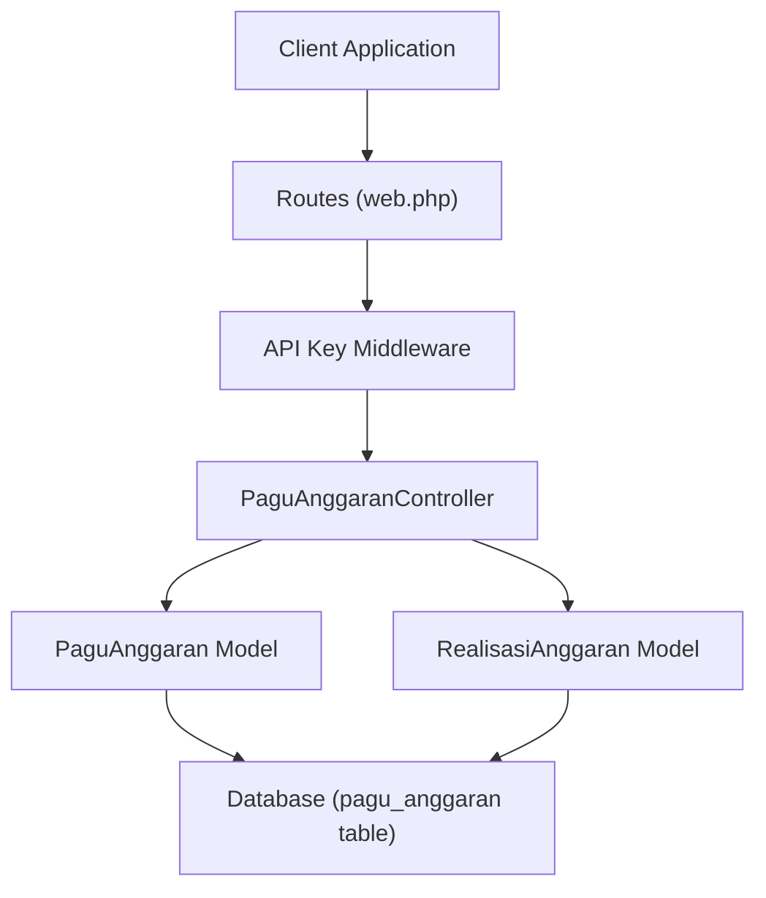
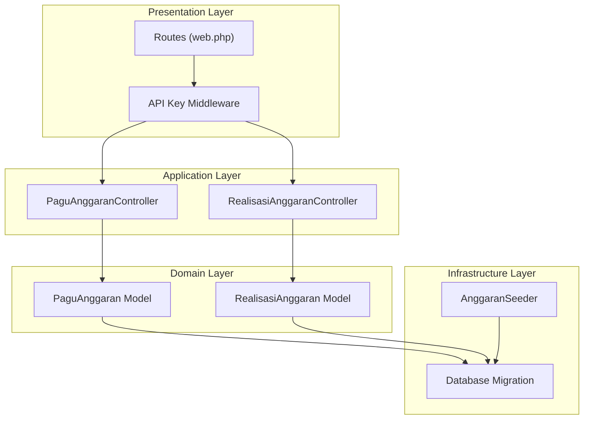
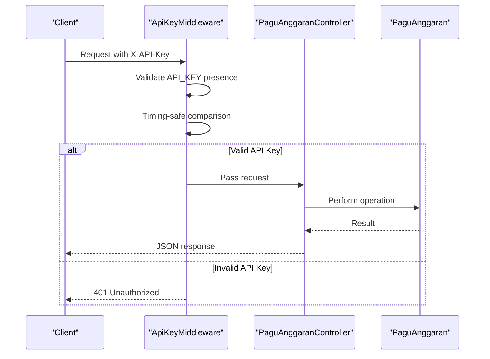
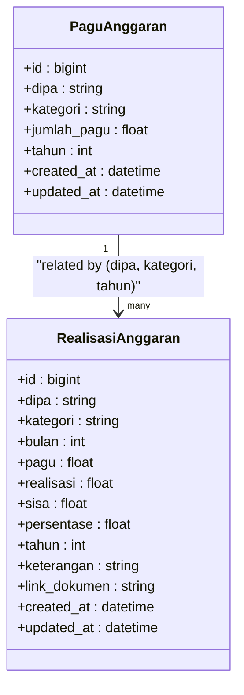
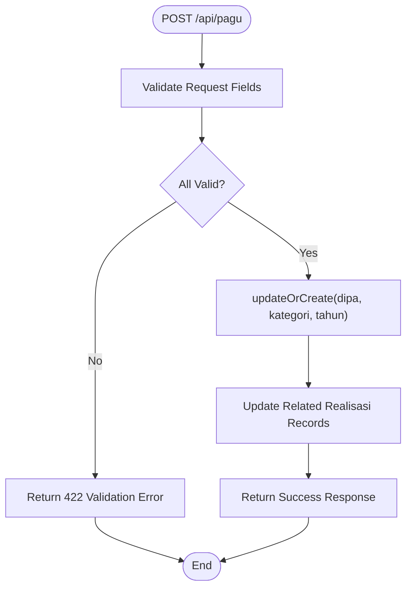
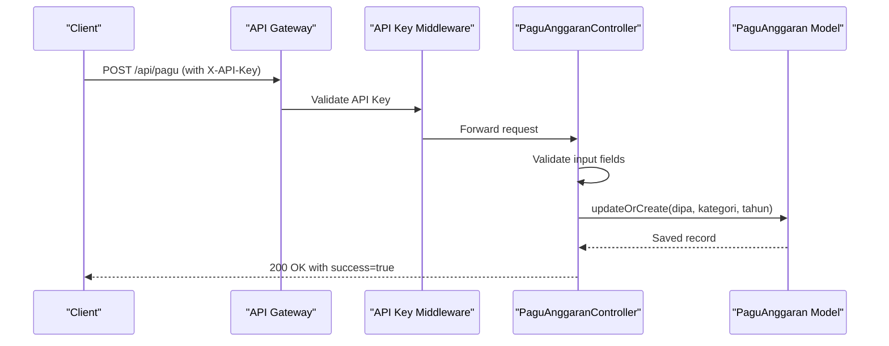
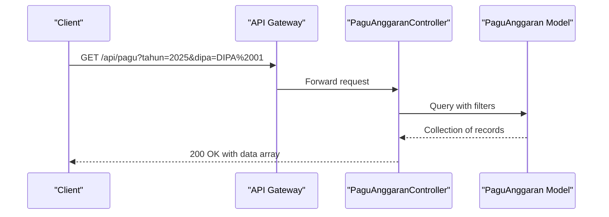
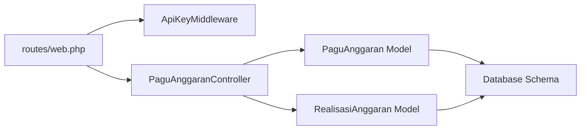

# Pagu Anggaran CRUD Operations

<cite>
**Referenced Files in This Document**
- [PaguAnggaranController.php](file://app/Http/Controllers/PaguAnggaranController.php)
- [PaguAnggaran.php](file://app/Models/PaguAnggaran.php)
- [RealisasiAnggaran.php](file://app/Models/RealisasiAnggaran.php)
- [web.php](file://routes/web.php)
- [ApiKeyMiddleware.php](file://app/Http/Middleware/ApiKeyMiddleware.php)
- [Handler.php](file://app/Exceptions/Handler.php)
- [2026_02_10_000002_create_pagu_anggaran_table.php](file://database/migrations/2026_02_10_000002_create_pagu_anggaran_table.php)
- [AnggaranSeeder.php](file://database/seeders/AnggaranSeeder.php)
</cite>

## Table of Contents
1. [Introduction](#introduction)
2. [Project Structure](#project-structure)
3. [Core Components](#core-components)
4. [Architecture Overview](#architecture-overview)
5. [Detailed Component Analysis](#detailed-component-analysis)
6. [Dependency Analysis](#dependency-analysis)
7. [Performance Considerations](#performance-considerations)
8. [Troubleshooting Guide](#troubleshooting-guide)
9. [Conclusion](#conclusion)

## Introduction
This document provides comprehensive API documentation for Pagu Anggaran CRUD operations focused on budget allocation management. It covers:
- POST /api/pagu for creating or updating budget allocations
- DELETE /api/pagu/{id} for removing allocations
- GET /api/pagu for searching and filtering budget data
- Authentication via API key header
- Validation rules for annual budget cycles, funding categories, and allocation tracking
- Practical examples for authenticated requests, validation error responses, and successful CRUD operations

## Project Structure
The Pagu Anggaran module is implemented using a Model-Controller pattern with Laravel Lumen. The key components are:
- Route definitions in the router group with API key middleware and rate limiting
- PaguAnggaranController handling index, store, and destroy operations
- PaguAnggaran model with fillable attributes and casting
- RealisasiAnggaran model maintaining related realisasi records
- Database migration defining the pagu_anggaran table schema
- Seeder populating initial budget data



**Diagram sources**
- [web.php:78-118](file://routes/web.php#L78-L118)
- [PaguAnggaranController.php:9-65](file://app/Http/Controllers/PaguAnggaranController.php#L9-L65)
- [PaguAnggaran.php:7-29](file://app/Models/PaguAnggaran.php#L7-L29)
- [RealisasiAnggaran.php:9-45](file://app/Models/RealisasiAnggaran.php#L9-L45)

**Section sources**
- [web.php:1-165](file://routes/web.php#L1-L165)
- [PaguAnggaranController.php:1-65](file://app/Http/Controllers/PaguAnggaranController.php#L1-L65)
- [PaguAnggaran.php:1-30](file://app/Models/PaguAnggaran.php#L1-L30)
- [RealisasiAnggaran.php:1-46](file://app/Models/RealisasiAnggaran.php#L1-L46)

## Core Components
- PaguAnggaranController: Implements index, store, and destroy operations with validation and related realisasi updates
- PaguAnggaran model: Defines fillable fields, casting, and mutators/accessors for amount precision
- RealisasiAnggaran model: Defines fillable fields, casting, and relationship to PaguAnggaran
- Routes: Define protected endpoints with API key middleware and rate limiting
- API Key Middleware: Validates X-API-Key header with secure comparison
- Exception Handler: Standardizes error responses with security headers

**Section sources**
- [PaguAnggaranController.php:9-65](file://app/Http/Controllers/PaguAnggaranController.php#L9-L65)
- [PaguAnggaran.php:7-29](file://app/Models/PaguAnggaran.php#L7-L29)
- [RealisasiAnggaran.php:9-45](file://app/Models/RealisasiAnggaran.php#L9-L45)
- [web.php:78-118](file://routes/web.php#L78-L118)
- [ApiKeyMiddleware.php:14-39](file://app/Http/Middleware/ApiKeyMiddleware.php#L14-L39)
- [Handler.php:36-132](file://app/Exceptions/Handler.php#L36-L132)

## Architecture Overview
The system follows a layered architecture:
- Presentation Layer: Routes define endpoints and apply middleware
- Application Layer: Controllers orchestrate business logic and validation
- Domain Layer: Models encapsulate data and relationships
- Infrastructure Layer: Database schema and seeding populate initial data



**Diagram sources**
- [web.php:78-118](file://routes/web.php#L78-L118)
- [PaguAnggaranController.php:9-65](file://app/Http/Controllers/PaguAnggaranController.php#L9-L65)
- [RealisasiAnggaranController.php:9-154](file://app/Http/Controllers/RealisasiAnggaranController.php#L9-L154)
- [PaguAnggaran.php:7-29](file://app/Models/PaguAnggaran.php#L7-L29)
- [RealisasiAnggaran.php:9-45](file://app/Models/RealisasiAnggaran.php#L9-L45)
- [2026_02_10_000002_create_pagu_anggaran_table.php:14-22](file://database/migrations/2026_02_10_000002_create_pagu_anggaran_table.php#L14-L22)
- [AnggaranSeeder.php:10-130](file://database/seeders/AnggaranSeeder.php#L10-L130)

## Detailed Component Analysis

### API Endpoints

#### GET /api/pagu
Retrieves pagu allocation records with optional filtering:
- Query parameters:
  - tahun: integer year filter
  - dipa: string DIPA filter
- Response format:
  - success: boolean flag
  - data: array of pagu allocation objects

Example request:
- GET /api/pagu?tahun=2025&dipa=DIPA%2001
- Headers: X-API-Key: YOUR_API_KEY

Example response:
```json
{
  "success": true,
  "data": [
    {
      "id": 1,
      "dipa": "DIPA 01",
      "kategori": "Belanja Pegawai",
      "jumlah_pagu": 120000000.00,
      "tahun": 2025,
      "created_at": "2025-01-01T00:00:00.000Z",
      "updated_at": "2025-01-01T00:00:00.000Z"
    }
  ]
}
```

#### POST /api/pagu
Creates or updates a pagu allocation record:
- Required fields:
  - dipa: string, required
  - kategori: string, required
  - jumlah_pagu: number, required, min 0, max 999999999999.99
  - tahun: integer, required
- Behavior:
  - Uses unique constraint on (dipa, kategori, tahun)
  - Updates related realisasi records with new pagu value
  - Returns success flag and data object

Example request:
- POST /api/pagu
- Headers: X-API-Key: YOUR_API_KEY
- Body:
```json
{
  "dipa": "DIPA 01",
  "kategori": "Belanja Modal",
  "jumlah_pagu": 50000000.00,
  "tahun": 2025
}
```

Example response:
```json
{
  "success": true,
  "data": {
    "id": 2,
    "dipa": "DIPA 01",
    "kategori": "Belanja Modal",
    "jumlah_pagu": 50000000.00,
    "tahun": 2025,
    "created_at": "2025-01-01T00:00:00.000Z",
    "updated_at": "2025-01-01T00:00:00.000Z"
  }
}
```

#### DELETE /api/pagu/{id}
Removes a pagu allocation by ID:
- Path parameter: id (integer)
- Response format:
  - success: boolean flag
  - message: deletion confirmation

Example request:
- DELETE /api/pagu/1
- Headers: X-API-Key: YOUR_API_KEY

Example response:
```json
{
  "success": true,
  "message": "Deleted"
}
```

**Section sources**
- [web.php:37-41](file://routes/web.php#L37-L41)
- [web.php:115-118](file://routes/web.php#L115-L118)
- [PaguAnggaranController.php:11-18](file://app/Http/Controllers/PaguAnggaranController.php#L11-L18)
- [PaguAnggaranController.php:20-38](file://app/Http/Controllers/PaguAnggaranController.php#L20-L38)
- [PaguAnggaranController.php:59-63](file://app/Http/Controllers/PaguAnggaranController.php#L59-L63)

### Authentication and Security
- API key validation via X-API-Key header
- Secure timing-safe comparison to prevent timing attacks
- Randomized delay on invalid attempts
- Environment variable API_KEY required for operation
- Rate limiting applied to protected routes



**Diagram sources**
- [ApiKeyMiddleware.php:14-39](file://app/Http/Middleware/ApiKeyMiddleware.php#L14-L39)
- [PaguAnggaranController.php:20-38](file://app/Http/Controllers/PaguAnggaranController.php#L20-L38)

**Section sources**
- [ApiKeyMiddleware.php:14-39](file://app/Http/Middleware/ApiKeyMiddleware.php#L14-L39)
- [web.php:78-118](file://routes/web.php#L78-L118)

### Data Models and Relationships

#### PaguAnggaran Model
- Table: pagu_anggaran
- Unique constraint: (dipa, kategori, tahun)
- Fillable fields: dipa, kategori, jumlah_pagu, tahun
- Casting: jumlah_pagu as decimal with 2 decimals, tahun as integer
- Precision handling: string storage with float accessor

#### RealisasiAnggaran Model
- Relationship: belongs to PaguAnggaran via dipa, kategori, tahun
- Fillable fields: dipa, kategori, bulan, pagu, realisasi, sisa, persentase, tahun, keterangan, link_dokumen
- Casting: numeric fields as float, tahun and bulan as integer



**Diagram sources**
- [PaguAnggaran.php:7-29](file://app/Models/PaguAnggaran.php#L7-L29)
- [RealisasiAnggaran.php:9-45](file://app/Models/RealisasiAnggaran.php#L9-L45)
- [2026_02_10_000002_create_pagu_anggaran_table.php:14-22](file://database/migrations/2026_02_10_000002_create_pagu_anggaran_table.php#L14-L22)

**Section sources**
- [PaguAnggaran.php:7-29](file://app/Models/PaguAnggaran.php#L7-L29)
- [RealisasiAnggaran.php:9-45](file://app/Models/RealisasiAnggaran.php#L9-L45)
- [2026_02_10_000002_create_pagu_anggaran_table.php:14-22](file://database/migrations/2026_02_10_000002_create_pagu_anggaran_table.php#L14-L22)

### Validation Rules and Business Logic
- POST /api/pagu validation:
  - dipa: required string
  - kategori: required string
  - jumlah_pagu: required numeric, min 0, max 999999999999.99
  - tahun: required integer
- Update behavior:
  - Uses updateOrCreate with unique constraint
  - Automatically updates related realisasi records (pagu, sisa, persentase)
- Search behavior:
  - GET /api/pagu supports tahun and dipa filters



**Diagram sources**
- [PaguAnggaranController.php:20-38](file://app/Http/Controllers/PaguAnggaranController.php#L20-L38)
- [PaguAnggaranController.php:43-57](file://app/Http/Controllers/PaguAnggaranController.php#L43-L57)

**Section sources**
- [PaguAnggaranController.php:20-38](file://app/Http/Controllers/PaguAnggaranController.php#L20-L38)
- [PaguAnggaranController.php:43-57](file://app/Http/Controllers/PaguAnggaranController.php#L43-L57)

### Database Schema
The pagu_anggaran table enforces uniqueness across three dimensions:
- dipa: string identifier
- kategori: funding category
- tahun: calendar year
- jumlah_pagu: monetary amount with 20 digits and 2 decimal places

**Section sources**
- [2026_02_10_000002_create_pagu_anggaran_table.php:14-22](file://database/migrations/2026_02_10_000002_create_pagu_anggaran_table.php#L14-L22)

### Example Workflows

#### Successful Creation Workflow


**Diagram sources**
- [web.php:115-118](file://routes/web.php#L115-L118)
- [ApiKeyMiddleware.php:14-39](file://app/Http/Middleware/ApiKeyMiddleware.php#L14-L39)
- [PaguAnggaranController.php:20-38](file://app/Http/Controllers/PaguAnggaranController.php#L20-L38)

#### Search Workflow


**Diagram sources**
- [web.php:40](file://routes/web.php#L40)
- [PaguAnggaranController.php:11-18](file://app/Http/Controllers/PaguAnggaranController.php#L11-L18)

## Dependency Analysis
The system exhibits clean separation of concerns:
- Routes depend on middleware and controllers
- Controllers depend on models for data access
- Models depend on database schema
- No circular dependencies detected



**Diagram sources**
- [web.php:78-118](file://routes/web.php#L78-L118)
- [PaguAnggaranController.php:9-65](file://app/Http/Controllers/PaguAnggaranController.php#L9-L65)
- [PaguAnggaran.php:7-29](file://app/Models/PaguAnggaran.php#L7-L29)
- [RealisasiAnggaran.php:9-45](file://app/Models/RealisasiAnggaran.php#L9-L45)

**Section sources**
- [web.php:78-118](file://routes/web.php#L78-L118)
- [PaguAnggaranController.php:9-65](file://app/Http/Controllers/PaguAnggaranController.php#L9-L65)

## Performance Considerations
- Unique constraint on (dipa, kategori, tahun) ensures efficient lookups
- updateOrCreate minimizes database round trips
- Related realisasi updates occur in batch after pagu changes
- Pagination support in related endpoints prevents large payloads
- Rate limiting protects against abuse

## Troubleshooting Guide
Common error scenarios and resolutions:
- 401 Unauthorized: Verify X-API-Key header matches configured API_KEY
- 422 Validation Error: Check required fields and data types for POST /api/pagu
- 404 Resource Not Found: Occurs when deleting non-existent pagu records
- 500 Server Configuration Error: API_KEY environment variable missing

Security considerations:
- API key validation uses timing-safe comparison to prevent timing attacks
- Randomized delays on invalid attempts mitigate brute force attempts
- All responses include security headers (X-Content-Type-Options, X-Frame-Options, X-XSS-Protection)

**Section sources**
- [ApiKeyMiddleware.php:14-39](file://app/Http/Middleware/ApiKeyMiddleware.php#L14-L39)
- [Handler.php:36-132](file://app/Exceptions/Handler.php#L36-L132)

## Conclusion
The Pagu Anggaran CRUD implementation provides a robust foundation for budget allocation management with:
- Strong validation and data integrity through unique constraints
- Automated synchronization with related realisasi records
- Secure authentication and error handling
- Clean separation of concerns and maintainable code structure
- Comprehensive search capabilities with filtering options

The documented endpoints, validation rules, and example workflows enable reliable integration for budget management applications.