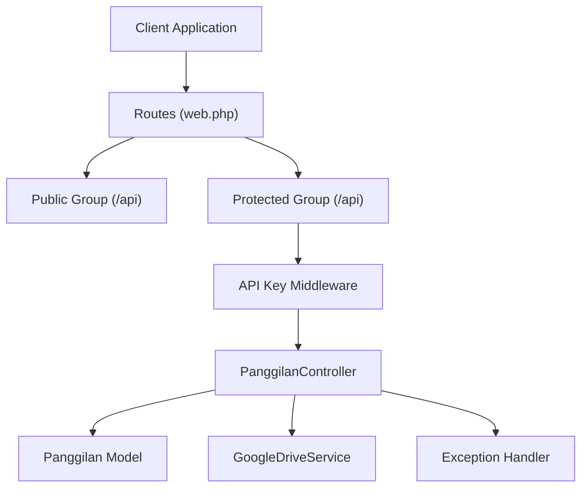
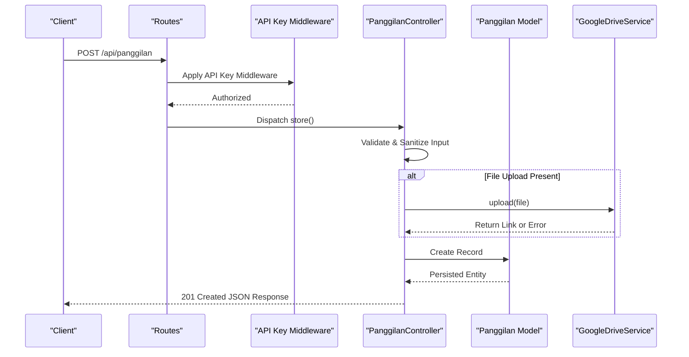
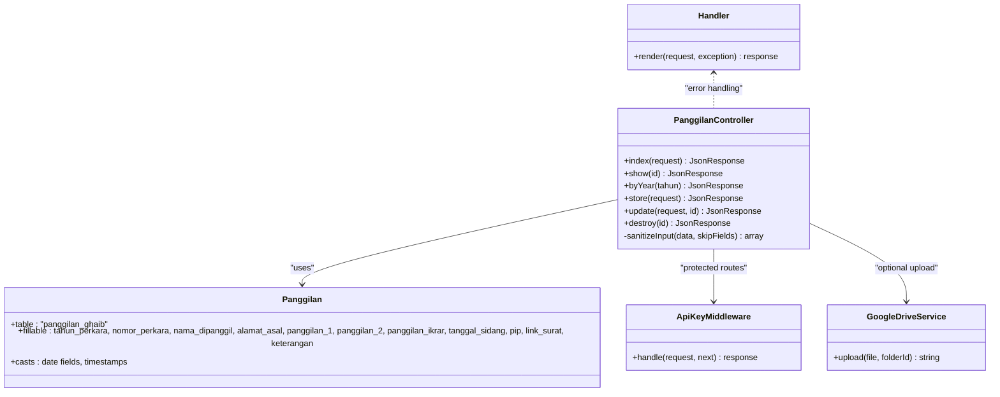
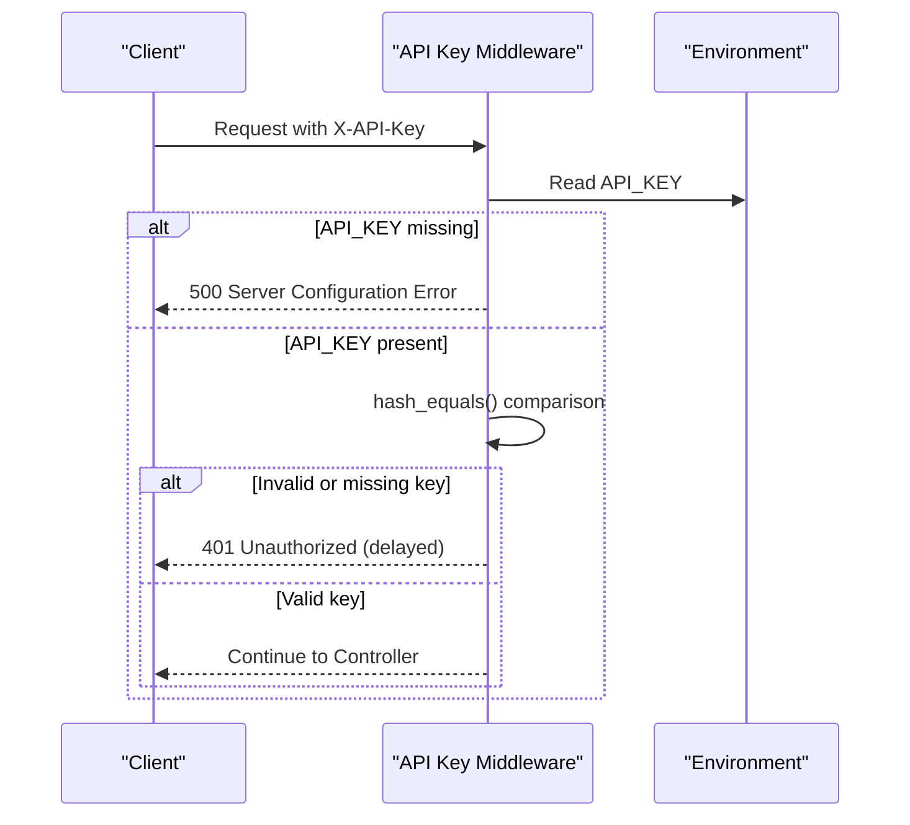
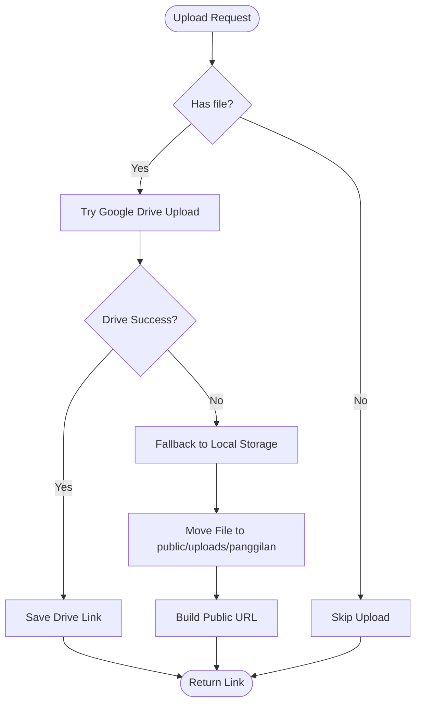
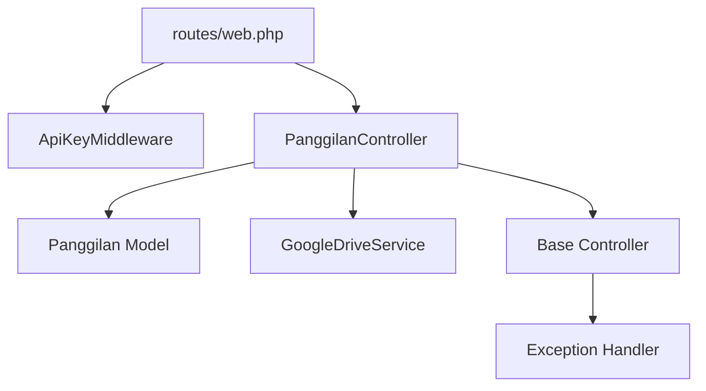

# Panggilan Ghaib CRUD Operations

<cite>
**Referenced Files in This Document**
- [routes/web.php](file://routes/web.php)
- [app/Http/Controllers/PanggilanController.php](file://app/Http/Controllers/PanggilanController.php)
- [app/Http/Controllers/Controller.php](file://app/Http/Controllers/Controller.php)
- [app/Http/Middleware/ApiKeyMiddleware.php](file://app/Http/Middleware/ApiKeyMiddleware.php)
- [app/Http/Exceptions/Handler.php](file://app/Http/Exceptions/Handler.php)
- [app/Models/Panggilan.php](file://app/Models/Panggilan.php)
- [app/Services/GoogleDriveService.php](file://app/Services/GoogleDriveService.php)
- [database/migrations/2026_01_21_000001_create_panggilan_ghaib_table.php](file://database/migrations/2026_01_21_000001_create_panggilan_ghaib_table.php)
- [database/migrations/2026_01_21_000002_add_unique_to_nomor_perkara.php](file://database/migrations/2026_01_21_000002_add_unique_to_nomor_perkara.php)
</cite>

## Table of Contents
1. [Introduction](#introduction)
2. [Project Structure](#project-structure)
3. [Core Components](#core-components)
4. [Architecture Overview](#architecture-overview)
5. [Detailed Component Analysis](#detailed-component-analysis)
6. [Dependency Analysis](#dependency-analysis)
7. [Performance Considerations](#performance-considerations)
8. [Troubleshooting Guide](#troubleshooting-guide)
9. [Conclusion](#conclusion)

## Introduction
This document provides comprehensive API documentation for the Panggilan Ghaib module, which manages case summonses and legal proceedings. It covers:
- CRUD endpoints for creating, retrieving, updating, and deleting case records
- Search and filtering capabilities by year
- Authentication via API key header
- Validation rules and error handling
- File upload support with Google Drive and local fallback
- Practical examples for authenticated requests and responses

## Project Structure
The API is built with Lumen and organized around controllers, models, middleware, and migrations. The routes define public and protected groups, with the protected group requiring an API key and enabling write operations.

**Diagram sources**
- [routes/web.php:13-164](file://routes/web.php#L13-L164)
- [app/Http/Middleware/ApiKeyMiddleware.php:14-39](file://app/Http/Middleware/ApiKeyMiddleware.php#L14-L39)
- [app/Http/Controllers/PanggilanController.php:9-332](file://app/Http/Controllers/PanggilanController.php#L9-L332)
- [app/Models/Panggilan.php:7-54](file://app/Models/Panggilan.php#L7-L54)
- [app/Services/GoogleDriveService.php:9-116](file://app/Services/GoogleDriveService.php#L9-L116)
- [app/Http/Exceptions/Handler.php:12-133](file://app/Http/Exceptions/Handler.php#L12-L133)

**Section sources**
- [routes/web.php:13-164](file://routes/web.php#L13-L164)

## Core Components
- Routes: Define public and protected endpoints for Panggilan Ghaib operations
- Controller: Implements validation, sanitization, file upload, and database persistence
- Model: Maps to the panggilan_ghaib table with fillable attributes and date casting
- Middleware: Enforces API key authentication for protected endpoints
- Exception Handler: Centralized error responses with security headers
- Google Drive Service: Optional cloud storage for uploaded files with fallback to local storage

**Section sources**
- [app/Http/Controllers/PanggilanController.php:9-332](file://app/Http/Controllers/PanggilanController.php#L9-L332)
- [app/Models/Panggilan.php:7-54](file://app/Models/Panggilan.php#L7-L54)
- [app/Http/Middleware/ApiKeyMiddleware.php:14-39](file://app/Http/Middleware/ApiKeyMiddleware.php#L14-L39)
- [app/Services/GoogleDriveService.php:9-116](file://app/Services/GoogleDriveService.php#L9-L116)
- [app/Http/Exceptions/Handler.php:12-133](file://app/Http/Exceptions/Handler.php#L12-L133)

## Architecture Overview
The system enforces authentication for write operations and applies strict validation and sanitization. File uploads are handled with a two-tier strategy: Google Drive first, followed by local storage if the cloud service fails.

**Diagram sources**
- [routes/web.php:79-84](file://routes/web.php#L79-L84)
- [app/Http/Middleware/ApiKeyMiddleware.php:14-39](file://app/Http/Middleware/ApiKeyMiddleware.php#L14-L39)
- [app/Http/Controllers/PanggilanController.php:115-198](file://app/Http/Controllers/PanggilanController.php#L115-L198)
- [app/Services/GoogleDriveService.php:38-82](file://app/Services/GoogleDriveService.php#L38-L82)
- [app/Models/Panggilan.php:7-54](file://app/Models/Panggilan.php#L7-L54)

## Detailed Component Analysis

### API Endpoints

#### GET /api/panggilan
- Purpose: Retrieve paginated list of cases with optional year filter
- Query Parameters:
  - tahun (integer, optional): Filter by year (2000–2100)
  - limit (integer, optional): Items per page (min 10, max 100)
- Response: JSON with success flag, items, pagination metadata
- Access: Public (rate-limited)

**Section sources**
- [routes/web.php:16](file://routes/web.php#L16)
- [app/Http/Controllers/PanggilanController.php:31-57](file://app/Http/Controllers/PanggilanController.php#L31-L57)

#### GET /api/panggilan/{id}
- Purpose: Retrieve a single case by ID
- Path Parameter:
  - id (integer): Positive integer ID
- Response: JSON with success flag and data, or 404 if not found
- Access: Public (rate-limited)

**Section sources**
- [routes/web.php:17](file://routes/web.php#L17)
- [app/Http/Controllers/PanggilanController.php:87-110](file://app/Http/Controllers/PanggilanController.php#L87-L110)

#### GET /api/panggilan/tahun/{tahun}
- Purpose: Retrieve up to 500 cases for a given year
- Path Parameter:
  - tahun (integer): Year between 2000 and 2100
- Response: JSON with success flag, data array, and total count
- Access: Public (rate-limited)

**Section sources**
- [routes/web.php:18](file://routes/web.php#L18)
- [app/Http/Controllers/PanggilanController.php:62-82](file://app/Http/Controllers/PanggilanController.php#L62-L82)

#### POST /api/panggilan
- Purpose: Create a new case record
- Required Headers:
  - X-API-Key: Valid API key from environment
- Request Body (JSON):
  - tahun_perkara (integer, required): Year (2000–2100)
  - nomor_perkara (string, required): Unique case number (max 50 chars, alphanumeric, slashes, dots)
  - nama_dipanggil (string, required): Name of defendant (max 255 chars)
  - alamat_asal (string, optional): Address (max 1000 chars)
  - panggilan_1 (date, optional): First summons date
  - panggilan_2 (date, optional): Second summons date
  - panggilan_ikrar (date, optional): Acknowledgment date
  - tanggal_sidang (date, optional): Hearing date
  - pip (string, optional): PIP identifier (max 100 chars)
  - file_upload (file, optional): PDF/DOC/DOCX/JPG/JPEG/PNG up to 5MB
  - keterangan (string, optional): Notes (max 1000 chars)
- Response: 201 Created with success flag and created entity
- Access: Protected (requires API key)

**Section sources**
- [routes/web.php:81](file://routes/web.php#L81)
- [app/Http/Controllers/PanggilanController.php:115-198](file://app/Http/Controllers/PanggilanController.php#L115-L198)

#### PUT /api/panggilan/{id}
- Purpose: Update an existing case by ID
- Path Parameter:
  - id (integer): Positive integer ID
- Required Headers:
  - X-API-Key: Valid API key from environment
- Request Body (JSON):
  - Same as POST but with optional fields validated conditionally
- Response: 200 OK with success flag and updated entity
- Access: Protected (requires API key)

**Section sources**
- [routes/web.php:82](file://routes/web.php#L82)
- [app/Http/Controllers/PanggilanController.php:203-300](file://app/Http/Controllers/PanggilanController.php#L203-L300)

#### POST /api/panggilan/{id}
- Purpose: Alternative update endpoint using POST for clients that cannot use PUT
- Path Parameter:
  - id (integer): Positive integer ID
- Required Headers:
  - X-API-Key: Valid API key from environment
- Request Body: Same as PUT
- Response: 200 OK with success flag and updated entity
- Access: Protected (requires API key)

**Section sources**
- [routes/web.php:83](file://routes/web.php#L83)
- [app/Http/Controllers/PanggilanController.php:203-300](file://app/Http/Controllers/PanggilanController.php#L203-L300)

#### DELETE /api/panggilan/{id}
- Purpose: Delete a case by ID
- Path Parameter:
  - id (integer): Positive integer ID
- Required Headers:
  - X-API-Key: Valid API key from environment
- Response: 200 OK with success flag
- Access: Protected (requires API key)

**Section sources**
- [routes/web.php:84](file://routes/web.php#L84)
- [app/Http/Controllers/PanggilanController.php:305-330](file://app/Http/Controllers/PanggilanController.php#L305-L330)

### Data Model and Validation

#### Database Schema (panggilan_ghaib)
- Fields:
  - id (auto-increment)
  - tahun_perkara (year)
  - nomor_perkara (string, unique)
  - nama_dipanggil (string)
  - alamat_asal (text)
  - panggilan_1 (date)
  - panggilan_2 (date)
  - panggilan_ikrar (date)
  - tanggal_sidang (date)
  - pip (string)
  - link_surat (string)
  - keterangan (text)
  - timestamps

**Section sources**
- [database/migrations/2026_01_21_000001_create_panggilan_ghaib_table.php:13-31](file://database/migrations/2026_01_21_000001_create_panggilan_ghaib_table.php#L13-L31)
- [database/migrations/2026_01_21_000002_add_unique_to_nomor_perkara.php:22-24](file://database/migrations/2026_01_21_000002_add_unique_to_nomor_perkara.php#L22-L24)
- [app/Models/Panggilan.php:11-32](file://app/Models/Panggilan.php#L11-L32)

#### Validation Rules
- Required fields for creation: tahun_perkara, nomor_perkara, nama_dipanggil
- Additional constraints:
  - nomor_perkara: unique, max length 50, allowed characters: alphanumeric, slash, dot
  - Dates: validated as dates
  - File upload: allowed types PDF/DOC/DOCX/JPG/JPEG/PNG, max size 5MB
  - Text fields: max lengths enforced

**Section sources**
- [app/Http/Controllers/PanggilanController.php:118-130](file://app/Http/Controllers/PanggilanController.php#L118-L130)
- [app/Http/Controllers/PanggilanController.php:223-235](file://app/Http/Controllers/PanggilanController.php#L223-L235)

### Authentication and Security
- API Key Header: X-API-Key must match the configured API key
- Timing-safe comparison to prevent timing attacks
- Randomized delay on unauthorized attempts
- Environment variable validation for API key presence

**Section sources**
- [app/Http/Middleware/ApiKeyMiddleware.php:14-39](file://app/Http/Middleware/ApiKeyMiddleware.php#L14-L39)

### File Upload and Storage
- Priority: Google Drive upload
- Fallback: Local storage under public/uploads/panggilan
- Generated URLs use request root plus uploads path
- Logging for both success and failure scenarios

**Section sources**
- [app/Http/Controllers/PanggilanController.php:138-189](file://app/Http/Controllers/PanggilanController.php#L138-L189)
- [app/Http/Controllers/PanggilanController.php:243-291](file://app/Http/Controllers/PanggilanController.php#L243-L291)
- [app/Services/GoogleDriveService.php:38-82](file://app/Services/GoogleDriveService.php#L38-L82)

### Error Handling
- Validation errors return 422 with structured errors
- Resource not found returns 404
- Unauthorized returns 401 after randomized delay
- Internal server errors return 500 with sanitized messages in production
- Security headers applied to all responses

**Section sources**
- [app/Http/Exceptions/Handler.php:57-95](file://app/Http/Exceptions/Handler.php#L57-L95)
- [app/Http/Controllers/PanggilanController.php:89-94](file://app/Http/Controllers/PanggilanController.php#L89-L94)
- [app/Http/Controllers/PanggilanController.php:307-313](file://app/Http/Controllers/PanggilanController.php#L307-L313)

## Architecture Overview

**Diagram sources**
- [app/Http/Controllers/PanggilanController.php:9-332](file://app/Http/Controllers/PanggilanController.php#L9-L332)
- [app/Models/Panggilan.php:7-54](file://app/Models/Panggilan.php#L7-L54)
- [app/Http/Middleware/ApiKeyMiddleware.php:8-39](file://app/Http/Middleware/ApiKeyMiddleware.php#L8-L39)
- [app/Services/GoogleDriveService.php:9-116](file://app/Services/GoogleDriveService.php#L9-L116)
- [app/Http/Exceptions/Handler.php:12-133](file://app/Http/Exceptions/Handler.php#L12-L133)

## Detailed Component Analysis

### Request/Response Schemas

#### Successful Creation (POST /api/panggilan)
- Request Body: JSON with required and optional fields as documented above
- Response Body:
  - success: boolean
  - message: string
  - data: object containing the created record

**Section sources**
- [app/Http/Controllers/PanggilanController.php:193-197](file://app/Http/Controllers/PanggilanController.php#L193-L197)

#### Successful Update (PUT /api/panggilan/{id})
- Request Body: JSON with optional fields
- Response Body:
  - success: boolean
  - message: string
  - data: object containing the updated record

**Section sources**
- [app/Http/Controllers/PanggilanController.php:295-299](file://app/Http/Controllers/PanggilanController.php#L295-L299)

#### Successful Deletion (DELETE /api/panggilan/{id})
- Response Body:
  - success: boolean
  - message: string

**Section sources**
- [app/Http/Controllers/PanggilanController.php:326-329](file://app/Http/Controllers/PanggilanController.php#L326-L329)

#### Pagination Response (GET /api/panggilan)
- Response Body:
  - success: boolean
  - data: array of records
  - current_page: integer
  - last_page: integer
  - per_page: integer
  - total: integer

**Section sources**
- [app/Http/Controllers/PanggilanController.php:49-56](file://app/Http/Controllers/PanggilanController.php#L49-L56)

#### Year Filter Response (GET /api/panggilan/tahun/{tahun})
- Response Body:
  - success: boolean
  - data: array of records
  - total: integer

**Section sources**
- [app/Http/Controllers/PanggilanController.php:77-81](file://app/Http/Controllers/PanggilanController.php#L77-L81)

### Authentication Flow

**Diagram sources**
- [app/Http/Middleware/ApiKeyMiddleware.php:14-39](file://app/Http/Middleware/ApiKeyMiddleware.php#L14-L39)

### File Upload Flow

**Diagram sources**
- [app/Http/Controllers/PanggilanController.php:138-189](file://app/Http/Controllers/PanggilanController.php#L138-L189)
- [app/Services/GoogleDriveService.php:38-82](file://app/Services/GoogleDriveService.php#L38-L82)

### Practical Examples

#### Example: Create a Case (Authenticated)
- Endpoint: POST /api/panggilan
- Headers:
  - X-API-Key: YOUR_API_KEY
- Request Body:
  - tahun_perkara: 2025
  - nomor_perkara: "123/C/2025"
  - nama_dipanggil: "John Doe"
  - file_upload: PDF/DOC/DOCX/JPG/JPEG/PNG (optional)
- Expected Response: 201 with success flag and created data

#### Example: Update a Case (Authenticated)
- Endpoint: PUT /api/panggilan/{id}
- Headers:
  - X-API-Key: YOUR_API_KEY
- Request Body:
  - nama_dipanggil: "John Smith"
  - alamat_asal: "New Address"
- Expected Response: 200 with success flag and updated data

#### Example: Delete a Case (Authenticated)
- Endpoint: DELETE /api/panggilan/{id}
- Headers:
  - X-API-Key: YOUR_API_KEY
- Expected Response: 200 with success flag

#### Example: Search Cases by Year (Public)
- Endpoint: GET /api/panggilan/tahun/{tahun}
- Query: tahun=2025
- Expected Response: 200 with success flag, data array, and total count

#### Example: Validation Error Response
- Scenario: Missing required field
- Response: 422 with success=false, message="Validation failed", errors=array

**Section sources**
- [routes/web.php:16-18](file://routes/web.php#L16-L18)
- [app/Http/Controllers/PanggilanController.php:118-130](file://app/Http/Controllers/PanggilanController.php#L118-L130)
- [app/Http/Exceptions/Handler.php:57-69](file://app/Http/Exceptions/Handler.php#L57-L69)

## Dependency Analysis

**Diagram sources**
- [routes/web.php:13-164](file://routes/web.php#L13-L164)
- [app/Http/Middleware/ApiKeyMiddleware.php:8-39](file://app/Http/Middleware/ApiKeyMiddleware.php#L8-L39)
- [app/Http/Controllers/PanggilanController.php:9-332](file://app/Http/Controllers/PanggilanController.php#L9-L332)
- [app/Models/Panggilan.php:7-54](file://app/Models/Panggilan.php#L7-L54)
- [app/Services/GoogleDriveService.php:9-116](file://app/Services/GoogleDriveService.php#L9-L116)
- [app/Http/Controllers/Controller.php:7-96](file://app/Http/Controllers/Controller.php#L7-L96)
- [app/Http/Exceptions/Handler.php:12-133](file://app/Http/Exceptions/Handler.php#L12-L133)

**Section sources**
- [routes/web.php:13-164](file://routes/web.php#L13-L164)

## Performance Considerations
- Pagination: Default limit 10, capped at 100 per page to prevent memory exhaustion
- Year filtering: Index on tahun_perkara improves query performance
- File uploads: Asynchronous cloud upload reduces request latency; local fallback ensures availability
- Rate limiting: 100 requests per minute for both public and protected groups

**Section sources**
- [app/Http/Controllers/PanggilanController.php:44-47](file://app/Http/Controllers/PanggilanController.php#L44-L47)
- [database/migrations/2026_01_21_000001_create_panggilan_ghaib_table.php:29-30](file://database/migrations/2026_01_21_000001_create_panggilan_ghaib_table.php#L29-L30)
- [routes/web.php:14](file://routes/web.php#L14)
- [routes/web.php:79](file://routes/web.php#L79)

## Troubleshooting Guide
- 401 Unauthorized: Verify X-API-Key header matches environment configuration
- 404 Not Found: Ensure ID exists and is a positive integer
- 422 Validation Failed: Review required fields and data types
- 500 Internal Server Error: Check server logs; production responses hide internal details
- Duplicate Case Number: nomor_perkara must be unique; adjust or contact administrator

**Section sources**
- [app/Http/Middleware/ApiKeyMiddleware.php:19-36](file://app/Http/Middleware/ApiKeyMiddleware.php#L19-L36)
- [app/Http/Controllers/PanggilanController.php:89-94](file://app/Http/Controllers/PanggilanController.php#L89-L94)
- [app/Http/Controllers/PanggilanController.php:307-313](file://app/Http/Controllers/PanggilanController.php#L307-L313)
- [app/Http/Exceptions/Handler.php:97-125](file://app/Http/Exceptions/Handler.php#L97-L125)
- [database/migrations/2026_01_21_000002_add_unique_to_nomor_perkara.php:22-24](file://database/migrations/2026_01_21_000002_add_unique_to_nomor_perkara.php#L22-L24)

## Conclusion
The Panggilan Ghaib API provides a secure, validated, and resilient interface for managing case summonses and legal proceedings. It enforces authentication for write operations, offers robust validation and sanitization, supports optional cloud and local file storage, and delivers consistent pagination and filtering capabilities. The documented endpoints, schemas, and examples enable reliable integration for authorized clients.