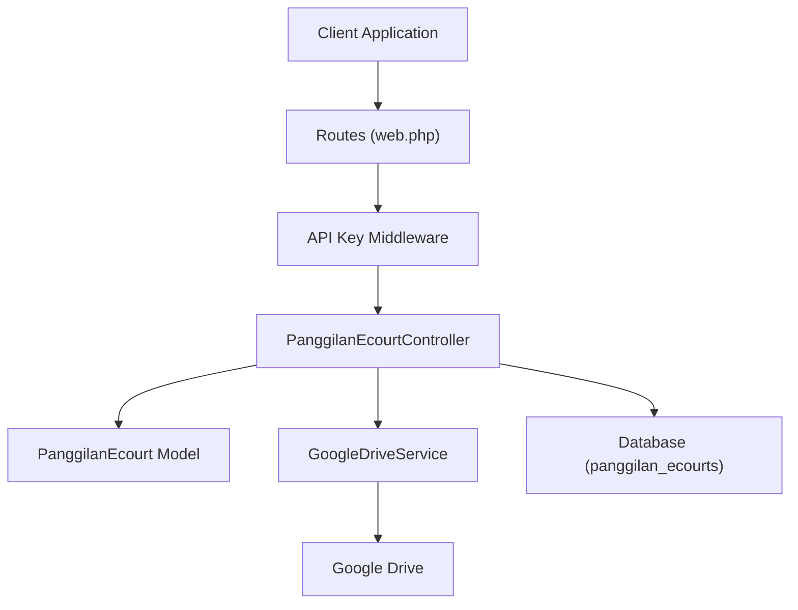
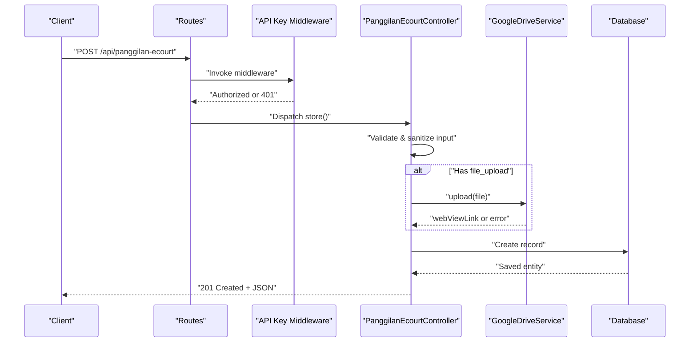
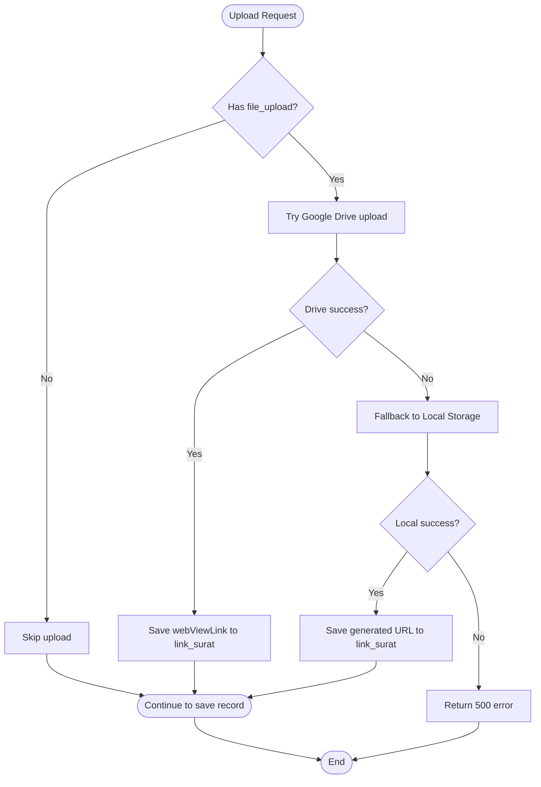
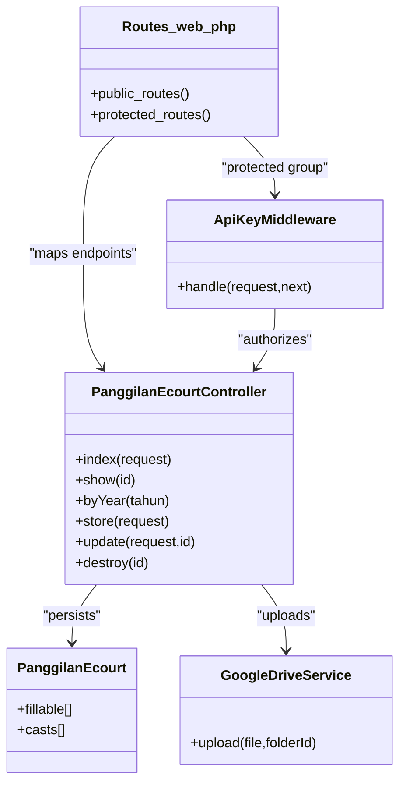

# Panggilan e-Court CRUD Operations

<cite>
**Referenced Files in This Document**
- [routes/web.php](file://routes/web.php)
- [app/Http/Controllers/PanggilanEcourtController.php](file://app/Http/Controllers/PanggilanEcourtController.php)
- [app/Models/PanggilanEcourt.php](file://app/Models/PanggilanEcourt.php)
- [database/migrations/2026_01_25_162515_create_panggilan_ecourts_table.php](file://database/migrations/2026_01_25_162515_create_panggilan_ecourts_table.php)
- [app/Http/Middleware/ApiKeyMiddleware.php](file://app/Http/Middleware/ApiKeyMiddleware.php)
- [app/Services/GoogleDriveService.php](file://app/Services/GoogleDriveService.php)
- [database/seeders/PanggilanEcourtSeeder.php](file://database/seeders/PanggilanEcourtSeeder.php)
- [composer.json](file://composer.json)
</cite>

## Table of Contents
1. [Introduction](#introduction)
2. [Project Structure](#project-structure)
3. [Core Components](#core-components)
4. [Architecture Overview](#architecture-overview)
5. [Detailed Component Analysis](#detailed-component-analysis)
6. [Dependency Analysis](#dependency-analysis)
7. [Performance Considerations](#performance-considerations)
8. [Troubleshooting Guide](#troubleshooting-guide)
9. [Conclusion](#conclusion)
10. [Appendices](#appendices)

## Introduction
This document provides comprehensive API documentation for managing digital court summonses (Panggilan e-Court) via CRUD endpoints. It covers:
- Creating new summonses with POST /api/panggilan-ecourt
- Updating existing summonses with PUT /api/panggilan-ecourt/{id} and POST /api/panggilan-ecourt/{id}
- Deleting summonses with DELETE /api/panggilan-ecourt/{id}
- Retrieving summonses with GET endpoints and filtering by year
- Request/response schemas, validation rules, and security controls
- Practical examples for authenticated requests, error handling, and successful operations

## Project Structure
The API is implemented using Laravel Lumen and exposes REST endpoints under the /api prefix. Protected endpoints require an API key via the X-API-Key header. The controller handles validation, input sanitization, optional file uploads to Google Drive with fallback to local storage, and database persistence.

**Diagram sources**
- [routes/web.php:24-96](file://routes/web.php#L24-L96)
- [app/Http/Middleware/ApiKeyMiddleware.php:14-39](file://app/Http/Middleware/ApiKeyMiddleware.php#L14-L39)
- [app/Http/Controllers/PanggilanEcourtController.php:117-201](file://app/Http/Controllers/PanggilanEcourtController.php#L117-L201)
- [app/Models/PanggilanEcourt.php:7-32](file://app/Models/PanggilanEcourt.php#L7-L32)
- [app/Services/GoogleDriveService.php:38-82](file://app/Services/GoogleDriveService.php#L38-L82)
- [database/migrations/2026_01_25_162515_create_panggilan_ecourts_table.php:13-28](file://database/migrations/2026_01_25_162515_create_panggilan_ecourts_table.php#L13-L28)

**Section sources**
- [routes/web.php:13-164](file://routes/web.php#L13-L164)
- [composer.json:11-14](file://composer.json#L11-L14)

## Core Components
- Routes: Define public and protected endpoints for Panggilan e-Court, including GET pagination/search and POST/PUT/DELETE for CRUD.
- Controller: Implements validation, input sanitization, file upload handling (Google Drive with fallback), and response formatting.
- Model: Defines fillable attributes and date casting for date fields.
- Middleware: Enforces API key authentication for protected endpoints.
- Google Drive Service: Handles secure uploads to Google Drive and generates public view links.

**Section sources**
- [routes/web.php:24-96](file://routes/web.php#L24-L96)
- [app/Http/Controllers/PanggilanEcourtController.php:117-334](file://app/Http/Controllers/PanggilanEcourtController.php#L117-L334)
- [app/Models/PanggilanEcourt.php:9-31](file://app/Models/PanggilanEcourt.php#L9-L31)
- [app/Http/Middleware/ApiKeyMiddleware.php:14-39](file://app/Http/Middleware/ApiKeyMiddleware.php#L14-L39)
- [app/Services/GoogleDriveService.php:38-82](file://app/Services/GoogleDriveService.php#L38-L82)

## Architecture Overview
The system enforces authentication for write operations and applies strict validation and sanitization. File uploads are handled via Google Drive when configured; otherwise, files are stored locally with a generated URL.

**Diagram sources**
- [routes/web.php:92-96](file://routes/web.php#L92-L96)
- [app/Http/Middleware/ApiKeyMiddleware.php:14-39](file://app/Http/Middleware/ApiKeyMiddleware.php#L14-L39)
- [app/Http/Controllers/PanggilanEcourtController.php:117-201](file://app/Http/Controllers/PanggilanEcourtController.php#L117-L201)
- [app/Services/GoogleDriveService.php:38-82](file://app/Services/GoogleDriveService.php#L38-L82)

## Detailed Component Analysis

### Endpoints and Schemas

#### GET /api/panggilan-ecourt
- Purpose: Retrieve paginated list of summonses with optional year filter.
- Query parameters:
  - limit: integer, default 500, max 2000
  - tahun: integer, validated range 2000–2100
- Response fields:
  - success: boolean
  - data: array of records
  - current_page, last_page, per_page, total: pagination metadata

Validation and behavior:
- Year parameter is sanitized and applied as a filter.
- Pagination limit is enforced to prevent excessive memory usage.

**Section sources**
- [routes/web.php:25-27](file://routes/web.php#L25-L27)
- [app/Http/Controllers/PanggilanEcourtController.php:32-59](file://app/Http/Controllers/PanggilanEcourtController.php#L32-L59)

#### GET /api/panggilan-ecourt/{id}
- Purpose: Retrieve a single summonse by ID.
- Path parameter:
  - id: positive integer
- Response fields:
  - success: boolean
  - data: single record or error message

Validation:
- ID must be greater than zero; otherwise returns 400.

**Section sources**
- [routes/web.php:26-27](file://routes/web.php#L26-L27)
- [app/Http/Controllers/PanggilanEcourtController.php:89-112](file://app/Http/Controllers/PanggilanEcourtController.php#L89-L112)

#### GET /api/panggilan-ecourt/tahun/{tahun}
- Purpose: Retrieve all summonses for a given year.
- Path parameter:
  - tahun: integer, validated range 2000–2100
- Response fields:
  - success: boolean
  - data: array of records
  - total: count

Validation:
- Year must be within 2000–2100; otherwise returns 400.

**Section sources**
- [routes/web.php:27-27](file://routes/web.php#L27-L27)
- [app/Http/Controllers/PanggilanEcourtController.php:64-84](file://app/Http/Controllers/PanggilanEcourtController.php#L64-L84)

#### POST /api/panggilan-ecourt
- Purpose: Create a new summonse.
- Required fields:
  - tahun_perkara: integer, 2000–2100
  - nomor_perkara: string, max 50 chars, allowed pattern: digits, slashes, dots, letters
  - nama_dipanggil: string, max 255 chars
- Optional fields:
  - alamat_asal: string, max 1000 chars
  - panggilan_1, panggilan_2, panggilan_3, panggilan_ikrar, tanggal_sidang: date strings (YYYY-MM-DD)
  - pip: string, max 100 chars
  - file_upload: file, mime types pdf, doc, docx, jpg, jpeg, png, max 5120 KB
  - keterangan: string, max 1000 chars
- Authentication: X-API-Key header required.
- Response fields:
  - success: boolean
  - message: operation status
  - data: created record

Behavior:
- Allowed fields are restricted to prevent mass assignment.
- Input is sanitized except for specific fields (e.g., nomor_perkara, link_surat).
- File upload attempts Google Drive; falls back to local storage if Drive fails.

**Section sources**
- [routes/web.php:92-96](file://routes/web.php#L92-L96)
- [app/Http/Controllers/PanggilanEcourtController.php:117-201](file://app/Http/Controllers/PanggilanEcourtController.php#L117-L201)
- [app/Models/PanggilanEcourt.php:9-22](file://app/Models/PanggilanEcourt.php#L9-L22)
- [database/migrations/2026_01_25_162515_create_panggilan_ecourts_table.php:13-28](file://database/migrations/2026_01_25_162515_create_panggilan_ecourts_table.php#L13-L28)

#### PUT /api/panggilan-ecourt/{id} and POST /api/panggilan-ecourt/{id}
- Purpose: Update an existing summonse.
- Path parameters:
  - id: positive integer
- Same request body as POST with optional fields.
- Authentication: X-API-Key header required.
- Response fields:
  - success: boolean
  - message: operation status
  - data: updated record (fresh)

Behavior:
- ID must be greater than zero; otherwise returns 400.
- Record must exist; otherwise returns 404.
- Allowed fields are restricted; input sanitized except specific fields.
- File upload follows the same Google Drive/local fallback logic.

**Section sources**
- [routes/web.php:94-96](file://routes/web.php#L94-L96)
- [app/Http/Controllers/PanggilanEcourtController.php:206-304](file://app/Http/Controllers/PanggilanEcourtController.php#L206-L304)

#### DELETE /api/panggilan-ecourt/{id}
- Purpose: Remove a summonse.
- Path parameters:
  - id: positive integer
- Authentication: X-API-Key header required.
- Response fields:
  - success: boolean
  - message: operation status

Behavior:
- ID must be greater than zero; otherwise returns 400.
- Record must exist; otherwise returns 404.
- Deletes the record and returns success.

**Section sources**
- [routes/web.php:96-96](file://routes/web.php#L96-L96)
- [app/Http/Controllers/PanggilanEcourtController.php:309-334](file://app/Http/Controllers/PanggilanEcourtController.php#L309-L334)

### Validation Rules and Data Types
- tahun_perkara: integer, required, min 2000, max 2100
- nomor_perkara: required, string, max 50, regex pattern allows digits, slashes, dots, letters
- nama_dipanggil: required, string, max 255
- alamat_asal: optional, string, max 1000
- panggilan_1, panggilan_2, panggilan_3, panggilan_ikrar, tanggal_sidang: optional, date strings (YYYY-MM-DD)
- pip: optional, string, max 100
- file_upload: optional, file, allowed MIME types: pdf, doc, docx, jpg, jpeg, png, max 5120 KB
- keterangan: optional, string, max 1000

Model casting:
- tahun_perkara: integer
- panggilan_1, panggilan_2, panggilan_3, panggilan_ikrar, tanggal_sidang: date

Note: The schema differs from the initial objective’s fields (nomor_perkara, nama_terdakwa, tanggal_panggilan, jenis_perkara, link_dokumen). The implemented fields are tahun_perkara, nomor_perkara, nama_dipanggil, alamat_asal, panggilan_1–4, tanggal_sidang, pip, link_surat, keterangan.

**Section sources**
- [app/Http/Controllers/PanggilanEcourtController.php:120-133](file://app/Http/Controllers/PanggilanEcourtController.php#L120-L133)
- [app/Http/Controllers/PanggilanEcourtController.php:226-239](file://app/Http/Controllers/PanggilanEcourtController.php#L226-L239)
- [app/Models/PanggilanEcourt.php:24-31](file://app/Models/PanggilanEcourt.php#L24-L31)
- [database/migrations/2026_01_25_162515_create_panggilan_ecourts_table.php:13-28](file://database/migrations/2026_01_25_162515_create_panggilan_ecourts_table.php#L13-L28)

### Search and Filtering
- GET /api/panggilan-ecourt supports:
  - limit: pagination limit (default 500, capped at 2000)
  - tahun: filter by year (validated range 2000–2100)
- GET /api/panggilan-ecourt/tahun/{tahun} filters by year with stricter validation (2000–2100) and returns up to 500 records.

**Section sources**
- [app/Http/Controllers/PanggilanEcourtController.php:32-59](file://app/Http/Controllers/PanggilanEcourtController.php#L32-L59)
- [app/Http/Controllers/PanggilanEcourtController.php:64-84](file://app/Http/Controllers/PanggilanEcourtController.php#L64-L84)

### Authentication and Security
- Protected endpoints require X-API-Key header.
- Middleware performs:
  - Environment variable check for API_KEY
  - Timing-safe comparison using hash_equals
  - Randomized delay to mitigate brute-force attacks
- Public endpoints are rate-limited (100/min); protected endpoints are rate-limited separately (configured in routes).

**Section sources**
- [routes/web.php:78-96](file://routes/web.php#L78-L96)
- [app/Http/Middleware/ApiKeyMiddleware.php:14-39](file://app/Http/Middleware/ApiKeyMiddleware.php#L14-L39)

### File Upload Handling
- Preferred storage: Google Drive.
- Fallback storage: Local filesystem under public/uploads/panggilan_ecourt.
- Generated link is stored in link_surat.

**Diagram sources**
- [app/Http/Controllers/PanggilanEcourtController.php:142-192](file://app/Http/Controllers/PanggilanEcourtController.php#L142-L192)
- [app/Services/GoogleDriveService.php:38-82](file://app/Services/GoogleDriveService.php#L38-L82)

**Section sources**
- [app/Http/Controllers/PanggilanEcourtController.php:142-192](file://app/Http/Controllers/PanggilanEcourtController.php#L142-L192)
- [app/Services/GoogleDriveService.php:38-82](file://app/Services/GoogleDriveService.php#L38-L82)

## Dependency Analysis
- Routes depend on the controller actions.
- Controller depends on:
  - Model for persistence
  - GoogleDriveService for file uploads (optional)
  - Middleware for authentication
- Model depends on Eloquent and database schema.
- GoogleDriveService depends on Google API client and environment variables.

**Diagram sources**
- [routes/web.php:24-96](file://routes/web.php#L24-L96)
- [app/Http/Middleware/ApiKeyMiddleware.php:14-39](file://app/Http/Middleware/ApiKeyMiddleware.php#L14-L39)
- [app/Http/Controllers/PanggilanEcourtController.php:117-334](file://app/Http/Controllers/PanggilanEcourtController.php#L117-L334)
- [app/Models/PanggilanEcourt.php:9-31](file://app/Models/PanggilanEcourt.php#L9-L31)
- [app/Services/GoogleDriveService.php:38-82](file://app/Services/GoogleDriveService.php#L38-L82)

**Section sources**
- [routes/web.php:24-96](file://routes/web.php#L24-L96)
- [app/Http/Controllers/PanggilanEcourtController.php:117-334](file://app/Http/Controllers/PanggilanEcourtController.php#L117-L334)
- [app/Models/PanggilanEcourt.php:9-31](file://app/Models/PanggilanEcourt.php#L9-L31)
- [app/Services/GoogleDriveService.php:38-82](file://app/Services/GoogleDriveService.php#L38-L82)

## Performance Considerations
- Pagination limit defaults to 500 with a maximum cap of 2000 to avoid memory exhaustion.
- Rate limiting is applied to public endpoints (100/min) and protected endpoints (configured in routes).
- File upload size is limited to 5120 KB to reduce bandwidth and storage pressure.
- Google Drive upload is preferred for scalability; local fallback ensures resilience.

[No sources needed since this section provides general guidance]

## Troubleshooting Guide
Common errors and resolutions:
- 400 Bad Request:
  - Invalid ID (non-positive) or invalid year out of range.
  - Invalid or missing required fields according to validation rules.
- 401 Unauthorized:
  - Missing or incorrect X-API-Key header; ensure API key matches environment configuration.
- 404 Not Found:
  - Attempting to update or delete a non-existent record.
- 500 Internal Server Error:
  - Google Drive upload failure with local storage fallback; if both fail, a 500 error is returned with a message indicating the failure.

Operational tips:
- Verify API key configuration and rate limits.
- Confirm file MIME types and size constraints for uploads.
- Check database connectivity and model casts for date fields.

**Section sources**
- [app/Http/Controllers/PanggilanEcourtController.php:91-97](file://app/Http/Controllers/PanggilanEcourtController.php#L91-L97)
- [app/Http/Controllers/PanggilanEcourtController.php:66-72](file://app/Http/Controllers/PanggilanEcourtController.php#L66-L72)
- [app/Http/Middleware/ApiKeyMiddleware.php:19-36](file://app/Http/Middleware/ApiKeyMiddleware.php#L19-L36)
- [app/Http/Controllers/PanggilanEcourtController.php:184-190](file://app/Http/Controllers/PanggilanEcourtController.php#L184-L190)

## Conclusion
The Panggilan e-Court API provides robust CRUD capabilities for digital summonses with strong validation, authentication, and resilient file handling. Public endpoints enable read-only access with pagination and year filtering, while protected endpoints support creation, updates, and deletion with API key enforcement. The documented schemas and examples facilitate integration and reliable operation.

[No sources needed since this section summarizes without analyzing specific files]

## Appendices

### Request/Response Examples

- Create Summonse (POST /api/panggilan-ecourt)
  - Headers: X-API-Key: YOUR_API_KEY
  - Body (form-data):
    - tahun_perkara: 2025
    - nomor_perkara: "40/Pdt.G/2025/PA.Pnj"
    - nama_dipanggil: "John Doe"
    - file_upload: PDF/DOC/JPG/PNG (optional)
  - Response: 201 with success flag and created record.

- Update Summonse (PUT /api/panggilan-ecourt/{id})
  - Headers: X-API-Key: YOUR_API_KEY
  - Path: /api/panggilan-ecourt/1
  - Body: Same as create with optional fields.
  - Response: 200 with success flag and updated record.

- Delete Summonse (DELETE /api/panggilan-ecourt/{id})
  - Headers: X-API-Key: YOUR_API_KEY
  - Path: /api/panggilan-ecourt/1
  - Response: 200 with success flag.

- Retrieve by Year (GET /api/panggilan-ecourt/tahun/{tahun})
  - Path: /api/panggilan-ecourt/tahun/2025
  - Response: 200 with success flag and array of records.

- Retrieve Paginated (GET /api/panggilan-ecourt)
  - Query: ?limit=500&tahun=2025
  - Response: 200 with success flag and pagination metadata.

**Section sources**
- [routes/web.php:25-96](file://routes/web.php#L25-L96)
- [app/Http/Controllers/PanggilanEcourtController.php:117-334](file://app/Http/Controllers/PanggilanEcourtController.php#L117-L334)

### Database Schema Reference
- Table: panggilan_ecourts
- Columns:
  - id: auto-increment primary key
  - tahun_perkara: integer, indexed
  - nomor_perkara: string
  - nama_dipanggil: string
  - alamat_asal: text
  - panggilan_1..panggilan_ikrar, tanggal_sidang: dates
  - pip: string
  - link_surat: string
  - keterangan: text
  - timestamps: created_at, updated_at

**Section sources**
- [database/migrations/2026_01_25_162515_create_panggilan_ecourts_table.php:13-28](file://database/migrations/2026_01_25_162515_create_panggilan_ecourts_table.php#L13-L28)

### Sample Data
- Seed data demonstrates typical fields and link_surat values for testing.

**Section sources**
- [database/seeders/PanggilanEcourtSeeder.php:18-301](file://database/seeders/PanggilanEcourtSeeder.php#L18-L301)