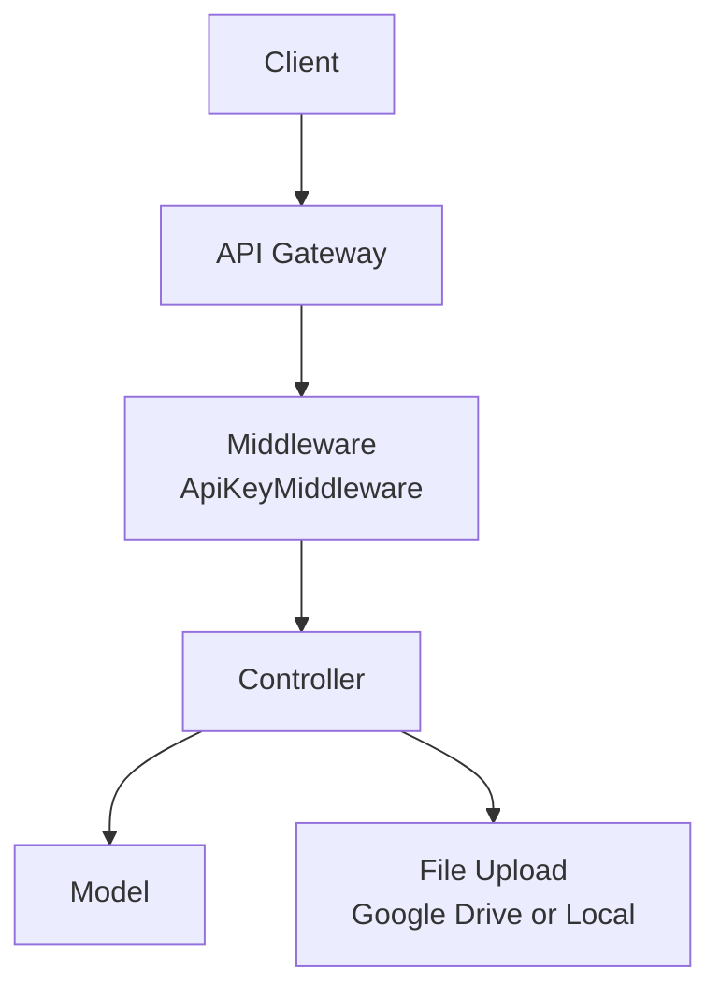
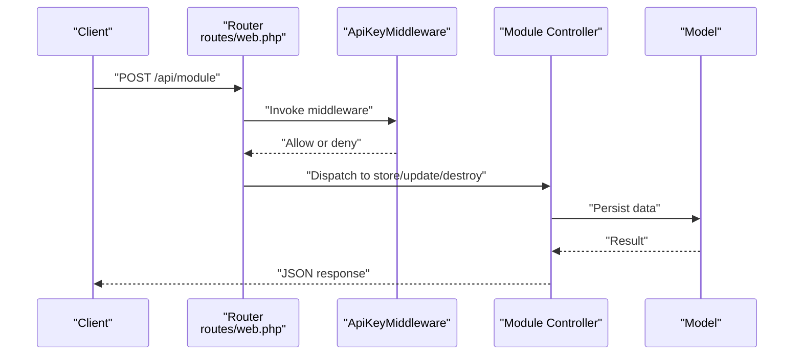
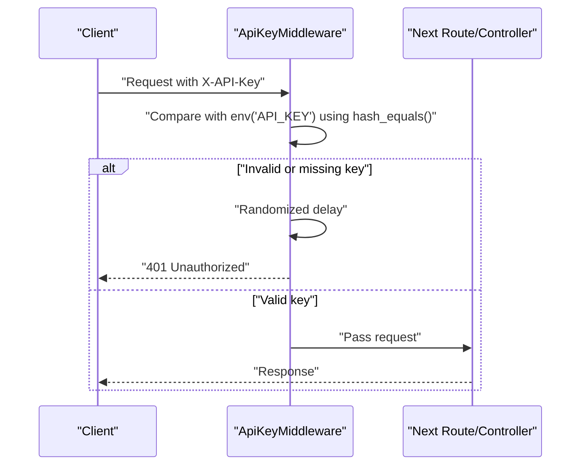
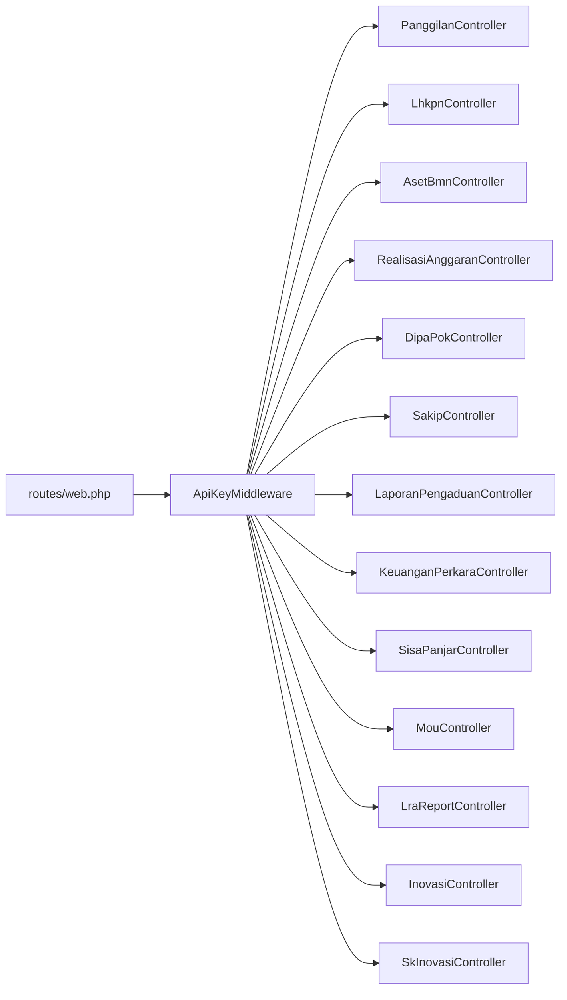
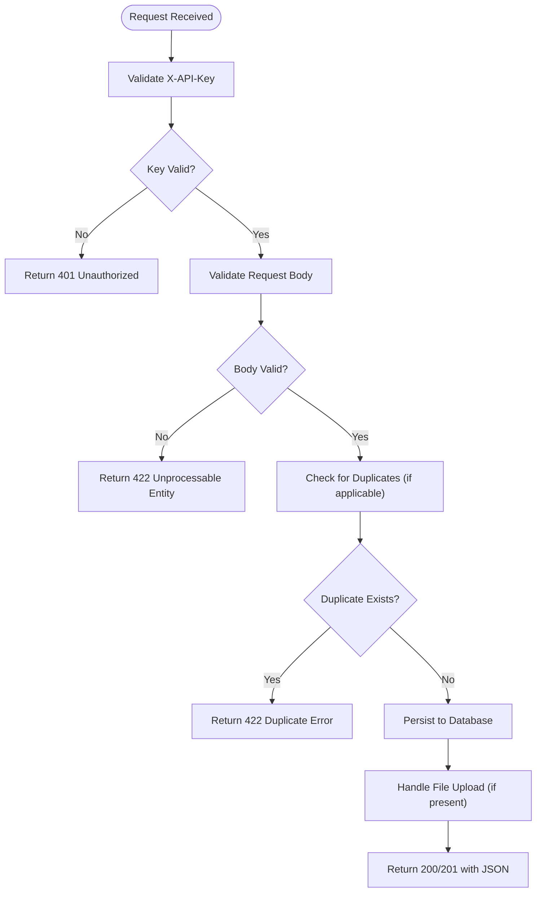

# Protected Endpoints (Full CRUD)

<cite>
**Referenced Files in This Document**
- [routes/web.php](file://routes/web.php)
- [app/Http/Middleware/ApiKeyMiddleware.php](file://app/Http/Middleware/ApiKeyMiddleware.php)
- [app/Http/Controllers/Controller.php](file://app/Http/Controllers/Controller.php)
- [app/Http/Controllers/PanggilanController.php](file://app/Http/Controllers/PanggilanController.php)
- [app/Http/Controllers/LhkpnController.php](file://app/Http/Controllers/LhkpnController.php)
- [app/Http/Controllers/AsetBmnController.php](file://app/Http/Controllers/AsetBmnController.php)
- [app/Http/Controllers/RealisasiAnggaranController.php](file://app/Http/Controllers/RealisasiAnggaranController.php)
- [app/Http/Controllers/DipaPokController.php](file://app/Http/Controllers/DipaPokController.php)
- [app/Http/Controllers/SakipController.php](file://app/Http/Controllers/SakipController.php)
- [app/Http/Controllers/LaporanPengaduanController.php](file://app/Http/Controllers/LaporanPengaduanController.php)
- [app/Http/Controllers/KeuanganPerkaraController.php](file://app/Http/Controllers/KeuanganPerkaraController.php)
- [app/Http/Controllers/SisaPanjarController.php](file://app/Http/Controllers/SisaPanjarController.php)
- [app/Http/Controllers/InovasiController.php](file://app/Http/Controllers/InovasiController.php)
- [app/Http/Controllers/SkInovasiController.php](file://app/Http/Controllers/SkInovasiController.php)
- [app/Models/Inovasi.php](file://app/Models/Inovasi.php)
- [app/Models/SkInovasi.php](file://app/Models/SkInovasi.php)
</cite>

## Update Summary
**Changes Made**
- Added Innovation Management module documentation with full CRUD operations
- Documented InovasiController endpoints for innovation records
- Documented SkInovasiController endpoints for innovation regulations/documents
- Updated endpoint catalog with innovation management sections
- Added validation rules and file upload capabilities for innovation modules

## Table of Contents
1. [Introduction](#introduction)
2. [Project Structure](#project-structure)
3. [Core Components](#core-components)
4. [Architecture Overview](#architecture-overview)
5. [Detailed Component Analysis](#detailed-component-analysis)
6. [Dependency Analysis](#dependency-analysis)
7. [Performance Considerations](#performance-considerations)
8. [Troubleshooting Guide](#troubleshooting-guide)
9. [Conclusion](#conclusion)
10. [Appendices](#appendices)

## Introduction
This document provides comprehensive API documentation for all protected CRUD endpoints requiring API key authentication. It covers HTTP methods (GET, POST, PUT, DELETE), URL patterns, request/response schemas, validation rules, error handling, and security considerations. Authentication is enforced via a middleware that validates the X-API-Key header against an environment-provided secret.

## Project Structure
The API is organized around modular controllers grouped under the Http\Controllers namespace. Routes are defined in routes/web.php, with protected endpoints grouped under api prefixed routes and guarded by middleware for API key validation and rate limiting.

**Diagram sources**
- [routes/web.php:78-164](file://routes/web.php#L78-L164)
- [app/Http/Middleware/ApiKeyMiddleware.php:14-39](file://app/Http/Middleware/ApiKeyMiddleware.php#L14-L39)

**Section sources**
- [routes/web.php:1-165](file://routes/web.php#L1-L165)

## Core Components
- Authentication: X-API-Key header validated securely with constant-time comparison and randomized delay to mitigate timing and brute-force attacks.
- Input Sanitization: Base controller provides a sanitizeInput method to strip HTML tags and trim strings, with configurable skip fields.
- File Upload: Base controller supports Google Drive fallback to local storage with strict MIME-type validation and randomized filenames.

Security highlights:
- Timing-safe API key comparison using hash_equals.
- Randomized delay on invalid key attempts.
- Strict MIME-type checks for uploaded files.
- Allowed fields arrays to prevent mass assignment.
- Validation rules for all inputs with numeric/date constraints.

**Section sources**
- [app/Http/Middleware/ApiKeyMiddleware.php:14-39](file://app/Http/Middleware/ApiKeyMiddleware.php#L14-L39)
- [app/Http/Controllers/Controller.php:18-95](file://app/Http/Controllers/Controller.php#L18-L95)

## Architecture Overview
Protected endpoints are grouped under /api with middleware applied to enforce API key and throttle limits. Each module exposes standard CRUD operations with consistent JSON responses.

**Diagram sources**
- [routes/web.php:78-164](file://routes/web.php#L78-L164)
- [app/Http/Middleware/ApiKeyMiddleware.php:14-39](file://app/Http/Middleware/ApiKeyMiddleware.php#L14-L39)

## Detailed Component Analysis

### Shared Behavior Across Modules
- Authentication: All protected endpoints require X-API-Key header.
- Rate Limiting: Grouped under throttle:100,1.
- Response Pattern: Success flag, message (when applicable), and data payload.
- Validation: Module-specific rules; common patterns include integer/date/string constraints and optional file uploads.

**Section sources**
- [routes/web.php:78-164](file://routes/web.php#L78-L164)
- [app/Http/Middleware/ApiKeyMiddleware.php:14-39](file://app/Http/Middleware/ApiKeyMiddleware.php#L14-L39)

### Endpoint Catalog

#### General Notes
- Base URL: /api
- Methods:
  - GET: Retrieve lists or single items
  - POST: Create new records
  - PUT/POST: Update records (both forms supported)
  - DELETE: Remove records
- Headers:
  - X-API-Key: Required for protected endpoints
  - Content-Type: application/json for JSON bodies; multipart/form-data for file uploads
- Pagination: Many endpoints support per_page and page parameters; some expose limit.

#### Module: Panggilan Ghaib
- URL Patterns
  - GET /api/panggilan
  - GET /api/panggilan/{id}
  - GET /api/panggilan/tahun/{tahun}
  - POST /api/panggilan
  - PUT/POST /api/panggilan/{id}
  - DELETE /api/panggilan/{id}
- Request Body (POST/PUT)
  - Fields: tahun_perkara, nomor_perkara, nama_dipanggil, alamat_asal, panggilan_1, panggilan_2, panggilan_ikrar, tanggal_sidang, pip, file_upload, keterangan
  - file_upload: PDF, DOC, DOCX, JPG, JPEG, PNG; max 5MB
- Response
  - Success: { success: true, data: ... }
  - Errors: { success: false, message: string }
- Validation Rules
  - tahun_perkara: required, integer, 2000–2100
  - nomor_perkara: required, string, max 50, alphanumeric and separators
  - nama_dipanggil: required, string, max 255
  - dates: nullable date
  - file_upload: nullable file with allowed MIME types
- Security
  - Allowed fields enforced
  - Input sanitized (HTML tags removed for most fields)
  - File upload via Google Drive with fallback to local storage
- Example Requests
  - Create:
    - curl -X POST "$BASE_URL/api/panggilan" \
      -H "X-API-Key: YOUR_API_KEY" \
      -H "Content-Type: application/json" \
      -d '{"tahun_perkara":2025,"nomor_perkara":"123/A/B","nama_dipanggil":"John Doe"}'
  - Update:
    - curl -X PUT "$BASE_URL/api/panggilan/1" \
      -H "X-API-Key: YOUR_API_KEY" \
      -H "Content-Type: application/json" \
      -d '{"pip":"Some PIP","file_upload":"@/path/to/file.pdf"}'
  - Delete:
    - curl -X DELETE "$BASE_URL/api/panggilan/1" \
      -H "X-API-Key: YOUR_API_KEY"

**Section sources**
- [routes/web.php:80-84](file://routes/web.php#L80-L84)
- [app/Http/Controllers/PanggilanController.php:115-198](file://app/Http/Controllers/PanggilanController.php#L115-L198)
- [app/Http/Controllers/PanggilanController.php:203-300](file://app/Http/Controllers/PanggilanController.php#L203-L300)
- [app/Http/Controllers/PanggilanController.php:305-330](file://app/Http/Controllers/PanggilanController.php#L305-L330)

#### Module: Itsbat Nikah
- URL Patterns
  - GET /api/itsbat
  - GET /api/itsbat/{id}
  - POST /api/itsbat
  - PUT/POST /api/itsbat/{id}
  - DELETE /api/itsbat/{id}
- Request Body (POST/PUT)
  - Fields: tahun_perkara, nomor_itsbat, nama_pasangan, tanggal_pernikahan, alamat_wali, file_upload, keterangan
  - file_upload: PDF, DOC, DOCX, JPG, JPEG, PNG; max 5MB
- Response
  - Success: { success: true, data: ... }
  - Errors: { success: false, message: string }
- Validation Rules
  - tahun_perkara: required, integer, 2000–2100
  - nomor_itsbat: required, string, max 100
  - nama_pasangan: required, string, max 255
  - tanggal_pernikahan: nullable date
  - file_upload: nullable file with allowed MIME types
- Example Requests
  - Create:
    - curl -X POST "$BASE_URL/api/itsbat" \
      -H "X-API-Key: YOUR_API_KEY" \
      -H "Content-Type: application/json" \
      -d '{"tahun_perkara":2025,"nomor_itsbat":"XYZ/123","nama_pasangan":"Jane Doe"}'

**Section sources**
- [routes/web.php:86-90](file://routes/web.php#L86-L90)
- [app/Http/Controllers/ItsbatNikahController.php:1-200](file://app/Http/Controllers/ItsbatNikahController.php#L1-L200)

#### Module: Panggilan e-Court
- URL Patterns
  - GET /api/panggilan-ecourt
  - GET /api/panggilan-ecourt/{id}
  - GET /api/panggilan-ecourt/tahun/{tahun}
  - POST /api/panggilan-ecourt
  - PUT/POST /api/panggilan-ecourt/{id}
  - DELETE /api/panggilan-ecourt/{id}
- Request Body (POST/PUT)
  - Fields: tahun_perkara, nomor_perkara, nama_dipanggil, alamat_asal, tanggal_panggilan, tanggal_sidang, jenis_perkara, file_upload, keterangan
  - file_upload: PDF, DOC, DOCX, JPG, JPEG, PNG; max 5MB
- Response
  - Success: { success: true, data: ... }
  - Errors: { success: false, message: string }
- Validation Rules
  - tahun_perkara: required, integer, 2000–2100
  - nomor_perkara: required, string, max 50
  - nama_dipanggil: required, string, max 255
  - tanggal_panggilan/tanggal_sidang: nullable date
  - file_upload: nullable file with allowed MIME types
- Example Requests
  - Create:
    - curl -X POST "$BASE_URL/api/panggilan-ecourt" \
      -H "X-API-Key: YOUR_API_KEY" \
      -H "Content-Type: application/json" \
      -d '{"tahun_perkara":2025,"nomor_perkara":"EC-123","nama_dipanggil":"John Smith"}'

**Section sources**
- [routes/web.php:92-96](file://routes/web.php#L92-L96)
- [app/Http/Controllers/PanggilanEcourtController.php:1-200](file://app/Http/Controllers/PanggilanEcourtController.php#L1-L200)

#### Module: Agenda Pimpinan
- URL Patterns
  - GET /api/agenda
  - GET /api/agenda/{id}
  - POST /api/agenda
  - PUT/POST /api/agenda/{id}
  - DELETE /api/agenda/{id}
- Request Body (POST/PUT)
  - Fields: tahun, nama_kegiatan, tempat_pelaksanaan, tanggal_mulai, tanggal_selesai, pukul_mulai, pukul_selesai, peserta, file_upload
  - file_upload: PDF, DOC, DOCX, JPG, JPEG, PNG; max 5MB
- Response
  - Success: { success: true, data: ... }
  - Errors: { success: false, message: string }
- Validation Rules
  - tahun: required, integer, 2000–2100
  - nama_kegiatan: required, string, max 255
  - tempat_pelaksanaan: required, string, max 255
  - dates/times: nullable
  - file_upload: nullable file with allowed MIME types
- Example Requests
  - Create:
    - curl -X POST "$BASE_URL/api/agenda" \
      -H "X-API-Key: YOUR_API_KEY" \
      -H "Content-Type: application/json" \
      -d '{"tahun":2025,"nama_kegiatan":"Seminar","tempat_pelaksanaan":"Virtual"}'

**Section sources**
- [routes/web.php:98-102](file://routes/web.php#L98-L102)
- [app/Http/Controllers/AgendaPimpinanController.php:1-200](file://app/Http/Controllers/AgendaPimpinanController.php#L1-L200)

#### Module: LHKPN
- URL Patterns
  - GET /api/lhkpn
  - GET /api/lhkpn/{id}
  - POST /api/lhkpn
  - PUT/POST /api/lhkpn/{id}
  - DELETE /api/lhkpn/{id}
- Request Body (POST/PUT)
  - Fields: nip, nama, jabatan, tahun, jenis_laporan, tanggal_lapor, file_tanda_terima, file_pengumuman, file_spt, file_dokumen_pendukung
  - Files: PDF, DOC, DOCX, JPG, JPEG, PNG; max 5MB each
- Response
  - Success: { success: true, data: ... }
  - Errors: { success: false, message: string }
- Validation Rules
  - jenis_laporan: required, in: LHKPN,SPT Tahunan
  - dates: nullable date
  - Files: nullable file with allowed MIME types
- Example Requests
  - Create:
    - curl -X POST "$BASE_URL/api/lhkpn" \
      -H "X-API-Key: YOUR_API_KEY" \
      -H "Content-Type: application/json" \
      -d '{"nip":"12345","nama":"Agent","jabatan":"Official","tahun":2024,"jenis_laporan":"LHKPN"}'

**Section sources**
- [routes/web.php:104-108](file://routes/web.php#L104-L108)
- [app/Http/Controllers/LhkpnController.php:55-90](file://app/Http/Controllers/LhkpnController.php#L55-L90)
- [app/Http/Controllers/LhkpnController.php:99-146](file://app/Http/Controllers/LhkpnController.php#L99-L146)

#### Module: Realisasi Anggaran
- URL Patterns
  - GET /api/anggaran
  - GET /api/anggaran/{id}
  - POST /api/anggaran
  - PUT/POST /api/anggaran/{id}
  - DELETE /api/anggaran/{id}
- Request Body (POST/PUT)
  - Fields: dipa, kategori, bulan, realisasi, tahun, file_dokumen
  - file_dokumen: PDF, JPG, JPEG, PNG; max 5MB
- Response
  - Success: { success: true, data: ... }
  - Errors: { success: false, message: string }
- Validation Rules
  - bulan: nullable integer, 0–12
  - realisasi: required, numeric
  - tahun: required, integer
  - file_dokumen: nullable file with allowed MIME types
- Master Pagu Integration
  - On read/store/update, pagu value is overridden by latest master configuration; sisa and persentase recalculated accordingly.
- Example Requests
  - Create:
    - curl -X POST "$BASE_URL/api/anggaran" \
      -H "X-API-Key: YOUR_API_KEY" \
      -H "Content-Type: application/json" \
      -d '{"dipa":"DIPA-1","kategori":"Maintenance","realisasi":5000000,"tahun":2025}'

**Section sources**
- [routes/web.php:110-113](file://routes/web.php#L110-L113)
- [app/Http/Controllers/RealisasiAnggaranController.php:55-85](file://app/Http/Controllers/RealisasiAnggaranController.php#L55-L85)
- [app/Http/Controllers/RealisasiAnggaranController.php:87-135](file://app/Http/Controllers/RealisasiAnggaranController.php#L87-L135)
- [app/Http/Controllers/RealisasiAnggaranController.php:143-152](file://app/Http/Controllers/RealisasiAnggaranController.php#L143-L152)

#### Module: Pagu Anggaran
- URL Patterns
  - GET /api/pagu
  - POST /api/pagu
  - DELETE /api/pagu/{id}
- Request Body (POST)
  - Fields: dipa, kategori, tahun, jumlah_pagu
- Response
  - Success: { success: true, data: ... }
  - Errors: { success: false, message: string }
- Validation Rules
  - jumlah_pagu: required, numeric
  - tahun: required, integer
- Example Requests
  - Create:
    - curl -X POST "$BASE_URL/api/pagu" \
      -H "X-API-Key: YOUR_API_KEY" \
      -H "Content-Type: application/json" \
      -d '{"dipa":"DIPA-1","kategori":"Operations","tahun":2025,"jumlah_pagu":10000000}'

**Section sources**
- [routes/web.php:115-117](file://routes/web.php#L115-L117)
- [app/Http/Controllers/PaguAnggaranController.php:1-200](file://app/Http/Controllers/PaguAnggaranController.php#L1-L200)

#### Module: DIPA POK
- URL Patterns
  - GET /api/dipapok
  - GET /api/dipapok/{id}
  - POST /api/dipapok
  - PUT/POST /api/dipapok/{id}
  - DELETE /api/dipapok/{id}
- Request Body (POST/PUT)
  - Fields: thn_dipa, revisi_dipa, jns_dipa, tgl_dipa, alokasi_dipa, file_doc_dipa, file_doc_pok
  - Files: PDF; max 10MB each
- Response
  - Success: { success: true, data: ... }
  - Errors: { success: false, message: string }
- Validation Rules
  - alokasi_dipa: required, numeric
  - tgl_dipa: required, date
  - file_doc_dipa/file_doc_pok: nullable file with allowed MIME types
- Automatic Code Generation
  - kode_dipa generated from thn_dipa, jns_dipa, and revisi_dipa.
- Example Requests
  - Create:
    - curl -X POST "$BASE_URL/api/dipapok" \
      -H "X-API-Key: YOUR_API_KEY" \
      -H "Content-Type: application/json" \
      -d '{"thn_dipa":2025,"revisi_dipa":"Dipa Awal","jns_dipa":"Badan Urusan Administrasi - MARI","tgl_dipa":"2025-01-01","alokasi_dipa":5000000}'

**Section sources**
- [routes/web.php:119-123](file://routes/web.php#L119-L123)
- [app/Http/Controllers/DipaPokController.php:41-96](file://app/Http/Controllers/DipaPokController.php#L41-L96)
- [app/Http/Controllers/DipaPokController.php:115-188](file://app/Http/Controllers/DipaPokController.php#L115-L188)

#### Module: Aset BMN
- URL Patterns
  - GET /api/aset-bmn
  - GET /api/aset-bmn/{id}
  - POST /api/aset-bmn
  - PUT/POST /api/aset-bmn/{id}
  - DELETE /api/aset-bmn/{id}
- Request Body (POST/PUT)
  - Fields: tahun, jenis_laporan, file_dokumen
  - file_dokumen: PDF, DOC, DOCX, XLS, XLSX; max 10MB
- Response
  - Success: { success: true, data: ... }
  - Errors: { success: false, message: string }
- Validation Rules
  - jenis_laporan: required, must be one of predefined values
  - file_dokumen: nullable file with allowed MIME types
- Duplicate Prevention
  - Prevents duplicate combinations of tahun and jenis_laporan.
- Example Requests
  - Create:
    - curl -X POST "$BASE_URL/api/aset-bmn" \
      -H "X-API-Key: YOUR_API_KEY" \
      -H "Content-Type: application/json" \
      -d '{"tahun":2025,"jenis_laporan":"Laporan Posisi BMN Di Neraca - Semester I"}'

**Section sources**
- [routes/web.php:125-128](file://routes/web.php#L125-L128)
- [app/Http/Controllers/AsetBmnController.php:71-105](file://app/Http/Controllers/AsetBmnController.php#L71-L105)
- [app/Http/Controllers/AsetBmnController.php:110-150](file://app/Http/Controllers/AsetBmnController.php#L110-L150)
- [app/Http/Controllers/AsetBmnController.php:155-163](file://app/Http/Controllers/AsetBmnController.php#L155-L163)

#### Module: SAKIP
- URL Patterns
  - GET /api/sakip
  - GET /api/sakip/{id}
  - GET /api/sakip/tahun/{tahun}
  - POST /api/sakip
  - PUT/POST /api/sakip/{id}
  - DELETE /api/sakip/{id}
- Request Body (POST/PUT)
  - Fields: tahun, jenis_dokumen, uraian, link_dokumen, file_dokumen
  - file_dokumen: PDF, DOC, DOCX, JPG, JPEG, PNG; max 20MB
- Response
  - Success: { success: true, data: ... }
  - Errors: { success: false, message: string }
- Validation Rules
  - jenis_dokumen: required, must be one of predefined values
  - file_dokumen: nullable file with allowed MIME types
- Duplicate Prevention
  - Prevents duplicate combinations of tahun and jenis_dokumen.
- Example Requests
  - Create:
    - curl -X POST "$BASE_URL/api/sakip" \
      -H "X-API-Key: YOUR_API_KEY" \
      -H "Content-Type: application/json" \
      -d '{"tahun":2025,"jenis_dokumen":"Indikator Kinerja Utama"}'

**Section sources**
- [routes/web.php:130-134](file://routes/web.php#L130-L134)
- [app/Http/Controllers/SakipController.php:111-154](file://app/Http/Controllers/SakipController.php#L111-L154)
- [app/Http/Controllers/SakipController.php:159-222](file://app/Http/Controllers/SakipController.php#L159-L222)
- [app/Http/Controllers/SakipController.php:227-250](file://app/Http/Controllers/SakipController.php#L227-L250)

#### Module: Laporan Pengaduan
- URL Patterns
  - GET /api/laporan-pengaduan
  - GET /api/laporan-pengaduan/{id}
  - GET /api/laporan-pengaduan/tahun/{tahun}
  - POST /api/laporan-pengaduan
  - PUT/POST /api/laporan-pengaduan/{id}
  - DELETE /api/laporan-pengaduan/{id}
- Request Body (POST/PUT)
  - Fields: tahun, materi_pengaduan, jan..des, laporan_proses, sisa
  - All monthly fields: nullable integers >= 0
- Response
  - Success: { success: true, data: ... }
  - Errors: { success: false, message: string }
- Validation Rules
  - materi_pengaduan: required, must be one of predefined values
  - Monthly fields: nullable integers >= 0
- Duplicate Prevention
  - Prevents duplicate combinations of tahun and materi_pengaduan.
- Example Requests
  - Create:
    - curl -X POST "$BASE_URL/api/laporan-pengaduan" \
      -H "X-API-Key: YOUR_API_KEY" \
      -H "Content-Type: application/json" \
      -d '{"tahun":2025,"materi_pengaduan":"Administrative"}'

**Section sources**
- [routes/web.php:136-141](file://routes/web.php#L136-L141)
- [app/Http/Controllers/LaporanPengaduanController.php:74-106](file://app/Http/Controllers/LaporanPengaduanController.php#L74-L106)
- [app/Http/Controllers/LaporanPengaduanController.php:108-125](file://app/Http/Controllers/LaporanPengaduanController.php#L108-L125)
- [app/Http/Controllers/LaporanPengaduanController.php:127-135](file://app/Http/Controllers/LaporanPengaduanController.php#L127-L135)

#### Module: Keuangan Perkara
- URL Patterns
  - GET /api/keuangan-perkara
  - GET /api/keuangan-perkara/{id}
  - GET /api/keuangan-perkara/tahun/{tahun}
  - POST /api/keuangan-perkara
  - PUT/POST /api/keuangan-perkara/{id}
  - DELETE /api/keuangan-perkara/{id}
- Request Body (POST/PUT)
  - Fields: tahun, bulan, saldo_awal, penerimaan, pengeluaran, url_detail, file_upload
  - file_upload: PDF, DOC, DOCX, JPG, JPEG, PNG; max 10MB
- Response
  - Success: { success: true, data: ... }
  - Errors: { success: false, message: string }
- Validation Rules
  - bulan: required, integer 1–12
  - amounts: nullable integers >= 0
  - url_detail: nullable string
  - file_upload: nullable file with allowed MIME types
- Duplicate Prevention
  - Prevents duplicate combinations of tahun and bulan.
- Example Requests
  - Create:
    - curl -X POST "$BASE_URL/api/keuangan-perkara" \
      -H "X-API-Key: YOUR_API_KEY" \
      -H "Content-Type: application/json" \
      -d '{"tahun":2025,"bulan":1,"saldo_awal":1000000}'

**Section sources**
- [routes/web.php:142-147](file://routes/web.php#L142-L147)
- [app/Http/Controllers/KeuanganPerkaraController.php:57-120](file://app/Http/Controllers/KeuanganPerkaraController.php#L57-L120)
- [app/Http/Controllers/KeuanganPerkaraController.php:122-190](file://app/Http/Controllers/KeuanganPerkaraController.php#L122-L190)

#### Module: Sisa Panjar
- URL Patterns
  - GET /api/sisa-panjar
  - GET /api/sisa-panjar/{id}
  - GET /api/sisa-panjar/tahun/{tahun}
  - POST /api/sisa-panjar
  - PUT/POST /api/sisa-panjar/{id}
  - DELETE /api/sisa-panjar/{id}
- Request Body (POST/PUT)
  - Fields: tahun, bulan, nomor_perkara, nama_penggugat_pemohon, jumlah_sisa_panjar, status, tanggal_setor_kas_negara
- Response
  - Success: { success: true, data: ... }
  - Errors: { success: false, message: string }
- Validation Rules
  - status: required, in: belum_diambil, disetor_kas_negara
  - dates: nullable date
  - nomor_perkara: required, string, max 100, regex pattern
  - jumlah_sisa_panjar: required, numeric >= 0
- Example Requests
  - Create:
    - curl -X POST "$BASE_URL/api/sisa-panjar" \
      -H "X-API-Key: YOUR_API_KEY" \
      -H "Content-Type: application/json" \
      -d '{"tahun":2025,"bulan":1,"nomor_perkara":"SP-123","jumlah_sisa_panjar":500000,"status":"belum_diambil"}'

**Section sources**
- [routes/web.php:148-153](file://routes/web.php#L148-L153)
- [app/Http/Controllers/SisaPanjarController.php:109-131](file://app/Http/Controllers/SisaPanjarController.php#L109-L131)
- [app/Http/Controllers/SisaPanjarController.php:133-171](file://app/Http/Controllers/SisaPanjarController.php#L133-L171)
- [app/Http/Controllers/SisaPanjarController.php:173-197](file://app/Http/Controllers/SisaPanjarController.php#L173-L197)

#### Module: MOU
- URL Patterns
  - GET /api/mou
  - GET /api/mou/{id}
  - POST /api/mou
  - PUT/POST /api/mou/{id}
  - DELETE /api/mou/{id}
- Request Body (POST/PUT)
  - Fields: tahun, nomor_mou, pihak_kedua, tanggal_mulai, tanggal_selesai, file_upload
  - file_upload: PDF, DOC, DOCX, JPG, JPEG, PNG; max 5MB
- Response
  - Success: { success: true, data: ... }
  - Errors: { success: false, message: string }
- Validation Rules
  - tahun: required, integer, 2000–2100
  - file_upload: nullable file with allowed MIME types
- Example Requests
  - Create:
    - curl -X POST "$BASE_URL/api/mou" \
      -H "X-API-Key: YOUR_API_KEY" \
      -H "Content-Type: application/json" \
      -d '{"tahun":2025,"nomor_mou":"MOU-123","pihak_kedua":"Partner Org"}'

**Section sources**
- [routes/web.php:154-158](file://routes/web.php#L154-L158)
- [app/Http/Controllers/MouController.php:1-200](file://app/Http/Controllers/MouController.php#L1-L200)

#### Module: LRA Report
- URL Patterns
  - GET /api/lra
  - GET /api/lra/{id}
  - POST /api/lra
  - PUT/POST /api/lra/{id}
  - DELETE /api/lra/{id}
- Request Body (POST/PUT)
  - Fields: tahun, periode, jumlah_data, file_dokumen
  - file_dokumen: PDF, DOC, DOCX, JPG, JPEG, PNG; max 5MB
- Response
  - Success: { success: true, data: ... }
  - Errors: { success: false, message: string }
- Validation Rules
  - tahun: required, integer, 2000–2100
  - periode: required, string
  - file_dokumen: nullable file with allowed MIME types
- Example Requests
  - Create:
    - curl -X POST "$BASE_URL/api/lra" \
      -H "X-API-Key: YOUR_API_KEY" \
      -H "Content-Type: application/json" \
      -d '{"tahun":2025,"periode":"Q1","jumlah_data":100}'

**Section sources**
- [routes/web.php:160-164](file://routes/web.php#L160-L164)
- [app/Http/Controllers/LraReportController.php:1-200](file://app/Http/Controllers/LraReportController.php#L1-L200)

#### Module: Innovation Management
- URL Patterns
  - GET /api/inovasi
  - GET /api/inovasi/{id}
  - POST /api/inovasi
  - PUT/POST /api/inovasi/{id}
  - DELETE /api/inovasi/{id}
- Request Body (POST/PUT)
  - Fields: nama_inovasi, deskripsi, kategori, link_dokumen, urutan, file_dokumen
  - file_dokumen: PDF, DOC, DOCX, JPG, JPEG, PNG; max 20MB
- Response
  - Success: { success: true, data: ... }
  - Errors: { success: false, message: string }
- Validation Rules
  - nama_inovasi: required, string, max 255
  - deskripsi: required, string
  - kategori: required, string, max 100
  - link_dokumen: nullable, string, max 500
  - urutan: nullable, integer, min 0
  - file_dokumen: nullable file with allowed MIME types
- Duplicate Prevention
  - Prevents duplicate combinations of nama_inovasi and kategori
- Example Requests
  - Create:
    - curl -X POST "$BASE_URL/api/inovasi" \
      -H "X-API-Key: YOUR_API_KEY" \
      -H "Content-Type: application/json" \
      -d '{"nama_inovasi":"Digital Transformation","deskripsi":"Inovasi digital untuk layanan publik","kategori":"Teknologi","urutan":1}'
  - Update:
    - curl -X PUT "$BASE_URL/api/inovasi/1" \
      -H "X-API-Key: YOUR_API_KEY" \
      -H "Content-Type: application/json" \
      -d '{"deskripsi":"Updated description","file_dokumen":"@/path/to/document.pdf"}'
  - Delete:
    - curl -X DELETE "$BASE_URL/api/inovasi/1" \
      -H "X-API-Key: YOUR_API_KEY"

**Updated** Added Innovation Management module with full CRUD operations including file upload capabilities and duplicate prevention

**Section sources**
- [routes/web.php:87-90](file://routes/web.php#L87-L90)
- [routes/web.php:196-201](file://routes/web.php#L196-L201)
- [app/Http/Controllers/InovasiController.php:22-202](file://app/Http/Controllers/InovasiController.php#L22-L202)
- [app/Models/Inovasi.php:9-24](file://app/Models/Inovasi.php#L9-L24)

#### Module: Innovation Regulations/Decrees
- URL Patterns
  - GET /api/sk-inovasi
  - GET /api/sk-inovasi/{id}
  - POST /api/sk-inovasi
  - PUT/POST /api/sk-inovasi/{id}
  - DELETE /api/sk-inovasi/{id}
- Request Body (POST/PUT)
  - Fields: tahun, nomor_sk, tentang, file, file_url, is_active
  - file: PDF, DOC, DOCX; max 5MB
  - file_url: URL string for external documents
- Response
  - Success: { success: true, data: ... }
  - Errors: { success: false, message: string }
- Validation Rules
  - tahun: required, integer, 2000–2100
  - nomor_sk: required, string, max 255
  - tentang: required, string
  - file: nullable file with allowed MIME types
  - file_url: nullable URL string
  - is_active: boolean, defaults to true
- Example Requests
  - Create:
    - curl -X POST "$BASE_URL/api/sk-inovasi" \
      -H "X-API-Key: YOUR_API_KEY" \
      -H "Content-Type: application/json" \
      -d '{"tahun":2025,"nomor_sk":"SK-001/2025","tentang":"Pedoman Inovasi","is_active":true}'
  - Update:
    - curl -X PUT "$BASE_URL/api/sk-inovasi/1" \
      -H "X-API-Key: YOUR_API_KEY" \
      -H "Content-Type: application/json" \
      -d '{"file_url":"https://example.com/document.pdf"}'
  - Delete:
    - curl -X DELETE "$BASE_URL/api/sk-inovasi/1" \
      -H "X-API-Key: YOUR_API_KEY"

**Updated** Added Innovation Regulations/Decrees module with document management capabilities

**Section sources**
- [routes/web.php:83-86](file://routes/web.php#L83-L86)
- [routes/web.php:190-195](file://routes/web.php#L190-L195)
- [app/Http/Controllers/SkInovasiController.php:11-161](file://app/Http/Controllers/SkInovasiController.php#L11-L161)
- [app/Models/SkInovasi.php:7-39](file://app/Models/SkInovasi.php#L7-L39)

### Authentication Flow

**Diagram sources**
- [app/Http/Middleware/ApiKeyMiddleware.php:14-39](file://app/Http/Middleware/ApiKeyMiddleware.php#L14-L39)

## Dependency Analysis
- Route Registration: routes/web.php defines all protected endpoints grouped under /api with middleware stack.
- Controller-to-Model: Each controller interacts with its respective Eloquent model for persistence.
- Upload Pipeline: Base controller handles file validation and upload to Google Drive with fallback to local storage.

**Diagram sources**
- [routes/web.php:78-164](file://routes/web.php#L78-L164)

**Section sources**
- [routes/web.php:78-164](file://routes/web.php#L78-L164)

## Performance Considerations
- Pagination: Many endpoints paginate results to avoid excessive memory usage.
- Rate Limiting: Throttling set to 100 requests per minute per IP to protect resources.
- File Upload Limits: Reasonable max sizes to prevent oversized payloads.
- Master Data Overrides: Realisasi Anggaran recalculates pagu/sisa/persentase from master configuration on read/update.
- Innovation Modules: File uploads up to 20MB for innovation records, 5MB for regulations/documents.

## Troubleshooting Guide
Common Issues and Resolutions:
- 401 Unauthorized
  - Cause: Missing or invalid X-API-Key header.
  - Resolution: Ensure X-API-Key matches the configured API key and is sent with every protected request.
- 400 Bad Request
  - Cause: Invalid ID or invalid query parameters.
  - Resolution: Verify ID > 0 and query parameters meet constraints (year range, integer bounds).
- 404 Not Found
  - Cause: Resource does not exist.
  - Resolution: Confirm resource exists before update/delete operations.
- 422 Unprocessable Entity
  - Cause: Validation failure (e.g., invalid enum values, duplicates).
  - Resolution: Review validation rules and ensure unique constraints are satisfied.
- 500 Internal Server Error (File Upload)
  - Cause: Failure to upload to Google Drive and fallback to local storage also failed.
  - Resolution: Check storage permissions and disk availability.
- Innovation Module Specific
  - Duplicate Prevention: When creating/updating innovation records, ensure unique combination of nama_inovasi and kategori.
  - File Upload Issues: Check file size limits (20MB for innovation records, 5MB for regulations).

**Section sources**
- [app/Http/Middleware/ApiKeyMiddleware.php:20-36](file://app/Http/Middleware/ApiKeyMiddleware.php#L20-L36)
- [app/Http/Controllers/PanggilanController.php:90-95](file://app/Http/Controllers/PanggilanController.php#L90-L95)
- [app/Http/Controllers/AsetBmnController.php:79-92](file://app/Http/Controllers/AsetBmnController.php#L79-L92)
- [app/Http/Controllers/SakipController.php:121-126](file://app/Http/Controllers/SakipController.php#L121-L126)
- [app/Http/Controllers/LaporanPengaduanController.php:93-100](file://app/Http/Controllers/LaporanPengaduanController.php#L93-L100)
- [app/Http/Controllers/KeuanganPerkaraController.php:70-76](file://app/Http/Controllers/KeuanganPerkaraController.php#L70-L76)
- [app/Http/Controllers/SisaPanjarController.php:135-139](file://app/Http/Controllers/SisaPanjarController.php#L135-L139)
- [app/Http/Controllers/InovasiController.php:86-95](file://app/Http/Controllers/InovasiController.php#L86-L95)

## Conclusion
The protected endpoints provide a consistent, secure, and validated interface for managing various datasets. Authentication via API key, robust validation, and safe file handling ensure reliable operation. The addition of innovation management modules expands the API's capabilities to handle innovation records and regulations with full CRUD operations and file upload support.

## Appendices

### Authentication Header
- X-API-Key: Required for all protected endpoints.

### File Upload MIME Types
- Allowed: PDF, DOC, DOCX, XLS, XLSX, JPG, JPEG, PNG
- Maximum Size: Varies by endpoint (commonly 5MB–20MB)
  - Innovation Records: Up to 20MB
  - Innovation Regulations/Documents: Up to 5MB

### Validation Flow

**Diagram sources**
- [app/Http/Middleware/ApiKeyMiddleware.php:14-39](file://app/Http/Middleware/ApiKeyMiddleware.php#L14-L39)
- [app/Http/Controllers/PanggilanController.php:118-130](file://app/Http/Controllers/PanggilanController.php#L118-L130)
- [app/Http/Controllers/InovasiController.php:86-95](file://app/Http/Controllers/InovasiController.php#L86-L95)