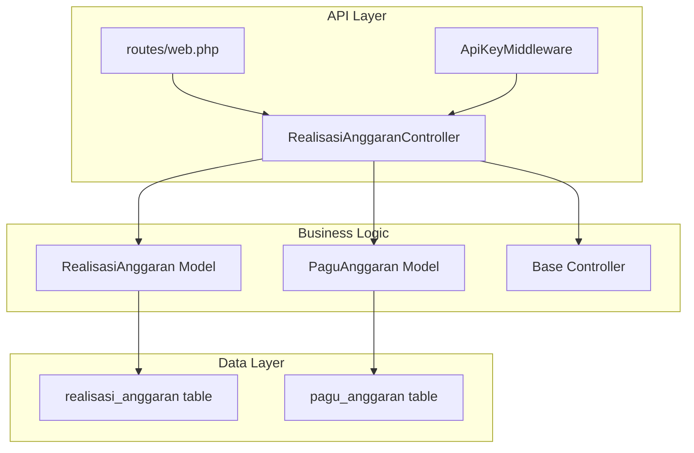
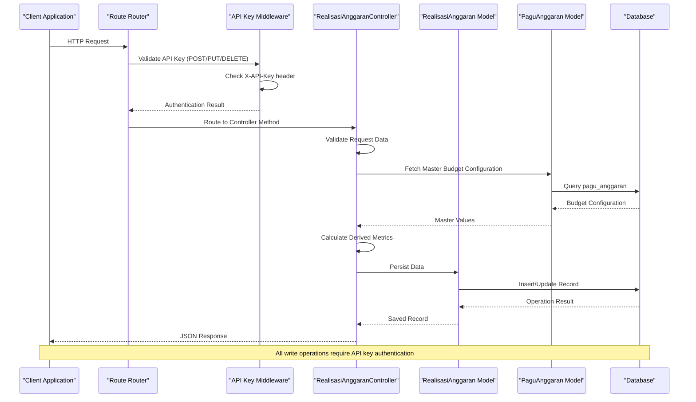
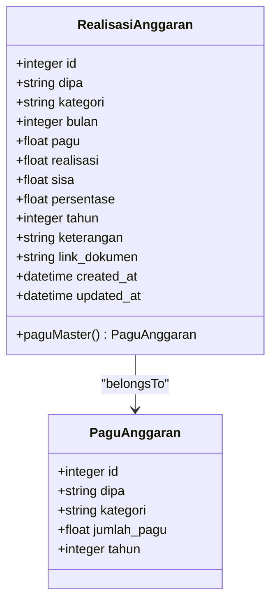
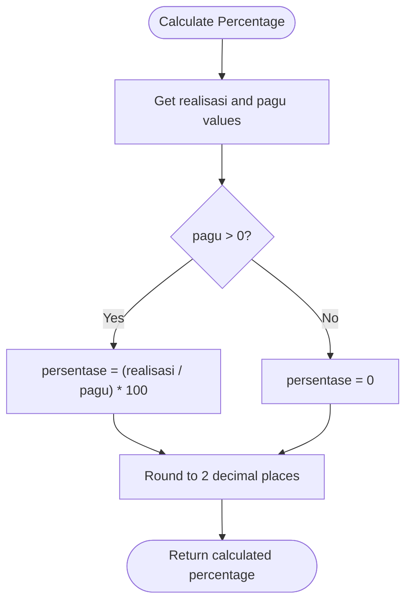
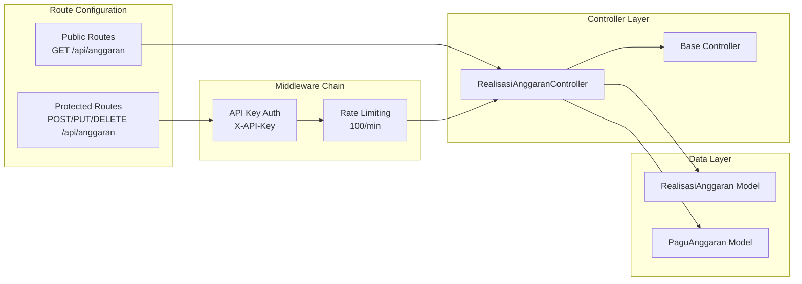
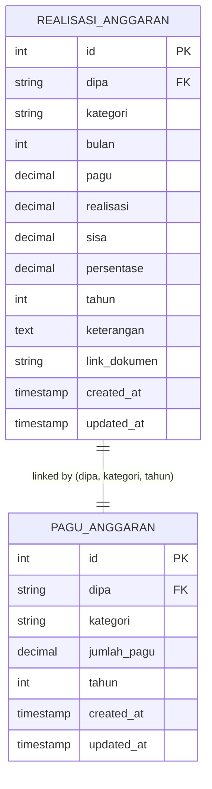

# Realisasi Anggaran CRUD Operations

<cite>
**Referenced Files in This Document**
- [RealisasiAnggaranController.php](file://app/Http/Controllers/RealisasiAnggaranController.php)
- [RealisasiAnggaran.php](file://app/Models/RealisasiAnggaran.php)
- [PaguAnggaran.php](file://app/Models/PaguAnggaran.php)
- [2026_02_10_000000_create_realisasi_anggaran_table.php](file://database/migrations/2026_02_10_000000_create_realisasi_anggaran_table.php)
- [2026_02_10_000002_create_pagu_anggaran_table.php](file://database/migrations/2026_02_10_000002_create_pagu_anggaran_table.php)
- [web.php](file://routes/web.php)
- [ApiKeyMiddleware.php](file://app/Http/Middleware/ApiKeyMiddleware.php)
- [Controller.php](file://app/Http/Controllers/Controller.php)
- [SECURITY.md](file://SECURITY.md)
</cite>

## Table of Contents
1. [Introduction](#introduction)
2. [Project Structure](#project-structure)
3. [Core Components](#core-components)
4. [Architecture Overview](#architecture-overview)
5. [Detailed Component Analysis](#detailed-component-analysis)
6. [Dependency Analysis](#dependency-analysis)
7. [Performance Considerations](#performance-considerations)
8. [Troubleshooting Guide](#troubleshooting-guide)
9. [Conclusion](#conclusion)

## Introduction
This document provides comprehensive API documentation for Realisasi Anggaran CRUD operations, focusing on monthly budget execution tracking. The system enables organizations to manage budget realization data with precise monthly reporting cycles, automated percentage calculations, and robust budget tracking mechanisms. The API supports authenticated operations for creating, updating, retrieving, and deleting budget execution records while maintaining strict validation rules and security measures.

## Project Structure
The Realisasi Anggaran module follows Laravel Lumen's MVC architecture with clear separation of concerns:



**Diagram sources**
- [web.php:37-113](file://routes/web.php#L37-L113)
- [RealisasiAnggaranController.php:9-154](file://app/Http/Controllers/RealisasiAnggaranController.php#L9-L154)

**Section sources**
- [web.php:1-165](file://routes/web.php#L1-L165)
- [RealisasiAnggaranController.php:1-154](file://app/Http/Controllers/RealisasiAnggaranController.php#L1-L154)

## Core Components
The Realisasi Anggaran system consists of several interconnected components that work together to provide comprehensive budget tracking functionality:

### Database Schema
The system utilizes two primary tables with carefully designed relationships:

**Realisasi Anggaran Table Structure:**
- Primary identifier with auto-increment
- DIPA code for organizational identification
- Category field for budget classification
- Decimal fields for precise financial calculations
- Year field for temporal organization
- Optional documentation link field
- Timestamps for record management

**Pagu Anggaran Table Structure:**
- Unique constraint on DIPA, category, and year combination
- Decimal precision for financial accuracy
- Year field for temporal filtering
- Separate master table for budget configuration

### Controller Responsibilities
The RealisasiAnggaranController handles all CRUD operations with comprehensive validation and business logic implementation. It manages file uploads, calculates derived metrics, and maintains data consistency through master-pagu synchronization.

### Model Relationships
The models establish clear relationships between budget execution records and their master configuration, enabling dynamic budget updates and historical tracking capabilities.

**Section sources**
- [2026_02_10_000000_create_realisasi_anggaran_table.php:14-25](file://database/migrations/2026_02_10_000000_create_realisasi_anggaran_table.php#L14-L25)
- [2026_02_10_000002_create_pagu_anggaran_table.php:14-22](file://database/migrations/2026_02_10_000002_create_pagu_anggaran_table.php#L14-L22)
- [RealisasiAnggaran.php:9-45](file://app/Models/RealisasiAnggaran.php#L9-L45)

## Architecture Overview
The Realisasi Anggaran API follows a secure, layered architecture with clear separation between public and protected endpoints:



**Diagram sources**
- [web.php:78-113](file://routes/web.php#L78-L113)
- [ApiKeyMiddleware.php:14-39](file://app/Http/Middleware/ApiKeyMiddleware.php#L14-L39)
- [RealisasiAnggaranController.php:55-84](file://app/Http/Controllers/RealisasiAnggaranController.php#L55-L84)

The architecture ensures that all write operations (POST, PUT, DELETE) are protected by API key authentication, while read operations (GET) remain publicly accessible. The controller layer implements comprehensive validation, calculation logic, and file upload handling.

**Section sources**
- [web.php:37-113](file://routes/web.php#L37-L113)
- [ApiKeyMiddleware.php:1-41](file://app/Http/Middleware/ApiKeyMiddleware.php#L1-L41)

## Detailed Component Analysis

### API Endpoints and Operations

#### GET /api/anggaran - Retrieve Budget Execution Records
The GET endpoint provides comprehensive search and filtering capabilities for budget execution data:

**Query Parameters:**
- `tahun`: Filter by fiscal year (integer)
- `bulan`: Filter by month (0-12, where 0 indicates annual totals)
- `dipa`: Filter by organizational code
- `q`: Search query for category names
- `per_page`: Pagination limit (default: 15)

**Response Structure:**
```json
{
  "success": true,
  "data": [
    {
      "id": 1,
      "dipa": "DIPA 01",
      "kategori": "Belanja Barang",
      "bulan": 3,
      "tahun": 2025,
      "pagu": 500000000.00,
      "realisasi": 125000000.00,
      "sisa": 375000000.00,
      "persentase": 25.00,
      "keterangan": "Realisasi bulan Maret",
      "link_dokumen": "https://example.com/document.pdf",
      "created_at": "2025-03-15T10:30:00Z",
      "updated_at": "2025-03-15T10:30:00Z",
      "master_pagu": 500000000.00
    }
  ],
  "total": 120,
  "current_page": 1,
  "last_page": 9,
  "per_page": 15
}
```

#### POST /api/anggaran - Create New Budget Execution Record
The POST endpoint creates new budget execution records with comprehensive validation and automatic calculation of derived metrics.

**Required Fields:**
- `dipa`: Organization code (required)
- `kategori`: Budget category (required)
- `realisasi`: Actual expenditure amount (required, numeric)
- `tahun`: Fiscal year (required, integer)

**Optional Fields:**
- `bulan`: Month indicator (0-12, nullable)
- `keterangan`: Description or notes (nullable)
- `file_dokumen`: Supporting document (PDF, JPG, PNG, max 5MB)

**Validation Rules:**
- `dipa`: Required string
- `kategori`: Required string
- `bulan`: Integer between 0 and 12 (inclusive)
- `realisasi`: Required numeric value
- `tahun`: Required integer
- `file_dokumen`: File validation with MIME type restrictions

**Automatic Calculations:**
- `pagu`: Fetched from master configuration table
- `sisa`: Calculated as `pagu - realisasi`
- `persentase`: Calculated as `(realisasi / pagu) * 100` (0 if pagu is 0)

**Success Response:**
```json
{
  "success": true,
  "data": {
    "id": 15,
    "dipa": "DIPA 04",
    "kategori": "Belanja Modal",
    "bulan": 3,
    "tahun": 2025,
    "pagu": 1000000000.00,
    "realisasi": 250000000.00,
    "sisa": 750000000.00,
    "persentase": 25.00,
    "keterangan": "Pembelian peralatan",
    "link_dokumen": "https://example.com/document.pdf",
    "created_at": "2025-03-15T14:22:00Z",
    "updated_at": "2025-03-15T14:22:00Z"
  }
}
```

#### PUT /api/anggaran/{id} - Update Existing Record
The PUT endpoint allows modification of existing budget execution records with the same validation rules as creation.

**Path Parameter:**
- `id`: Numeric identifier of the record to update

**Request Body:** Same as POST endpoint with validation rules applied

**Response:** Updated record with recalculated metrics

#### DELETE /api/anggaran/{id} - Remove Record
The DELETE endpoint permanently removes budget execution records from the database.

**Path Parameter:**
- `id`: Numeric identifier of the record to delete

**Response:**
```json
{
  "success": true
}
```

**Section sources**
- [RealisasiAnggaranController.php:11-53](file://app/Http/Controllers/RealisasiAnggaranController.php#L11-L53)
- [RealisasiAnggaranController.php:55-84](file://app/Http/Controllers/RealisasiAnggaranController.php#L55-L84)
- [RealisasiAnggaranController.php:87-135](file://app/Http/Controllers/RealisasiAnggaranController.php#L87-L135)

### Data Models and Relationships

#### RealisasiAnggaran Model
The model defines the core budget execution entity with comprehensive casting and relationship definitions:



**Diagram sources**
- [RealisasiAnggaran.php:9-22](file://app/Models/RealisasiAnggaran.php#L9-L22)
- [PaguAnggaran.php:7-11](file://app/Models/PaguAnggaran.php#L7-L11)

**Section sources**
- [RealisasiAnggaran.php:9-45](file://app/Models/RealisasiAnggaran.php#L9-L45)
- [PaguAnggaran.php:1-30](file://app/Models/PaguAnggaran.php#L1-L30)

### Business Logic Implementation

#### Percentage Calculation Algorithm
The system implements precise percentage calculations with fallback handling:



**Diagram sources**
- [RealisasiAnggaranController.php:80-81](file://app/Http/Controllers/RealisasiAnggaranController.php#L80-L81)
- [RealisasiAnggaranController.php:115-116](file://app/Http/Controllers/RealisasiAnggaranController.php#L115-L116)

#### File Upload Processing
The system supports secure file uploads with comprehensive validation:

**Supported File Types:**
- PDF documents
- Word documents (.doc, .docx)
- Excel spreadsheets (.xls, .xlsx)
- JPEG images
- PNG images

**Security Measures:**
- MIME type validation based on file content (not just extension)
- Maximum file size limit of 5MB
- Randomized filename generation
- Dual storage approach (Google Drive + local fallback)

**Section sources**
- [Controller.php:40-95](file://app/Http/Controllers/Controller.php#L40-L95)
- [RealisasiAnggaranController.php:68-71](file://app/Http/Controllers/RealisasiAnggaranController.php#L68-L71)

## Dependency Analysis

### Route Configuration and Middleware Chain



**Diagram sources**
- [web.php:14-76](file://routes/web.php#L14-L76)
- [web.php:78-164](file://routes/web.php#L78-L164)

### Database Relationship Schema



**Diagram sources**
- [2026_02_10_000000_create_realisasi_anggaran_table.php:14-25](file://database/migrations/2026_02_10_000000_create_realisasi_anggaran_table.php#L14-L25)
- [2026_02_10_000002_create_pagu_anggaran_table.php:14-22](file://database/migrations/2026_02_10_000002_create_pagu_anggaran_table.php#L14-L22)

**Section sources**
- [web.php:37-113](file://routes/web.php#L37-L113)
- [RealisasiAnggaranController.php:14-21](file://app/Http/Controllers/RealisasiAnggaranController.php#L14-L21)

## Performance Considerations

### Database Optimization
The system implements several indexing strategies for optimal query performance:

- **Primary Index**: Auto-increment ID for fast lookups
- **Composite Index**: (`dipa`, `kategori`, `tahun`) for efficient budget lookups
- **Individual Indexes**: `dipa` field for organizational filtering
- **Unique Constraint**: Prevents duplicate budget configurations

### Memory Management
The controller implements pagination for large datasets with configurable page sizes, preventing memory exhaustion during bulk operations.

### Calculation Efficiency
Derived metrics (sisa, persentase) are calculated on-demand using the latest master-pagu values, ensuring data consistency without redundant storage.

## Troubleshooting Guide

### Common Validation Errors

**Missing Required Fields:**
```json
{
  "success": false,
  "message": "Validation failed",
  "errors": {
    "dipa": ["The dipa field is required"],
    "kategori": ["The kategori field is required"],
    "realisasi": ["The realisasi field is required"],
    "tahun": ["The tahun field is required"]
  }
}
```

**Invalid Month Value:**
```json
{
  "success": false,
  "message": "Validation failed",
  "errors": {
    "bulan": ["The bulan must be between 0 and 12"]
  }
}
```

**File Upload Issues:**
```json
{
  "success": false,
  "message": "File upload failed",
  "errors": {
    "file_dokumen": ["The file_dokumen must be a file of type: pdf,jpg,jpeg,png"]
  }
}
```

### Authentication and Authorization

**Missing API Key:**
```json
{
  "success": false,
  "message": "Unauthorized"
}
```

**Invalid API Key:**
```json
{
  "success": false,
  "message": "Unauthorized"
}
```

**Configuration Error:**
```json
{
  "success": false,
  "message": "Server configuration error"
}
```

### Rate Limiting Issues
Exceeding the rate limit triggers a 429 status with retry information:

```json
{
  "success": false,
  "message": "Too Many Requests",
  "retry_after": 60
}
```

**Section sources**
- [ApiKeyMiddleware.php:20-36](file://app/Http/Middleware/ApiKeyMiddleware.php#L20-L36)
- [RealisasiAnggaranController.php:57-64](file://app/Http/Controllers/RealisasiAnggaranController.php#L57-L64)

## Conclusion
The Realisasi Anggaran CRUD system provides a comprehensive solution for monthly budget execution tracking with robust validation, security measures, and flexible querying capabilities. The architecture ensures data integrity through master-pagu synchronization, implements comprehensive security through API key authentication, and offers scalable performance through optimized database design and pagination. The system's modular design facilitates easy maintenance and future enhancements while maintaining backward compatibility.

The documented endpoints, validation rules, and response schemas provide clear guidance for developers integrating with the API, ensuring consistent behavior across all CRUD operations and supporting the organization's financial reporting requirements.