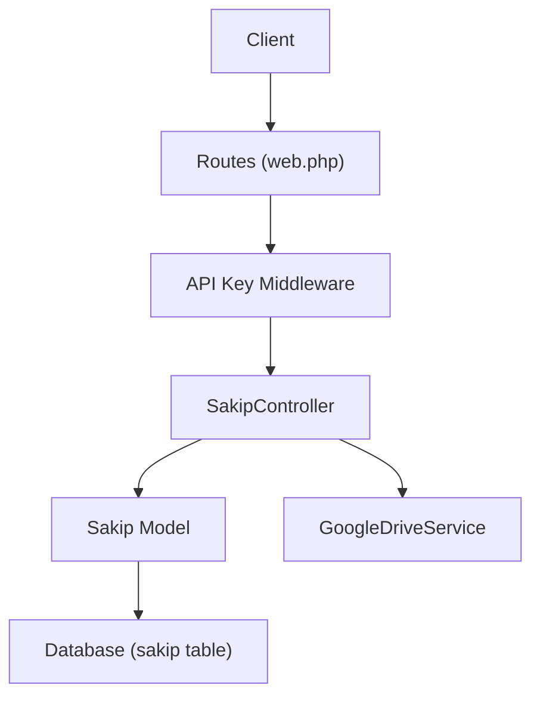
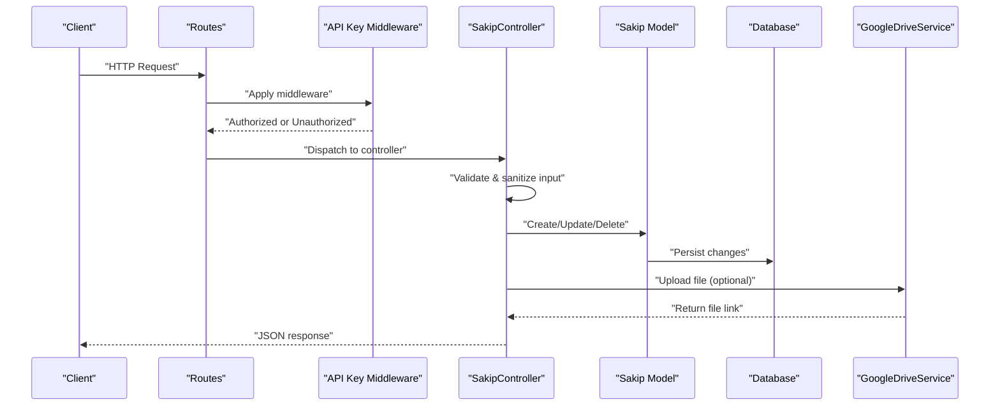
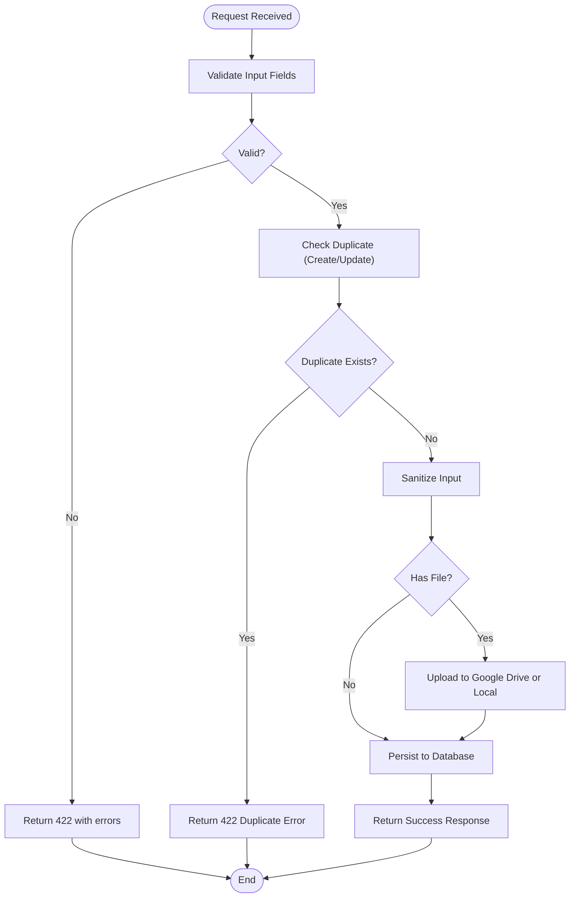
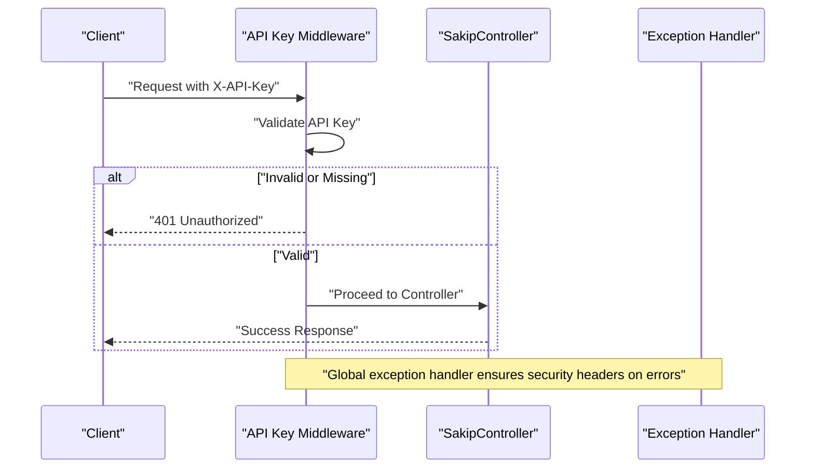
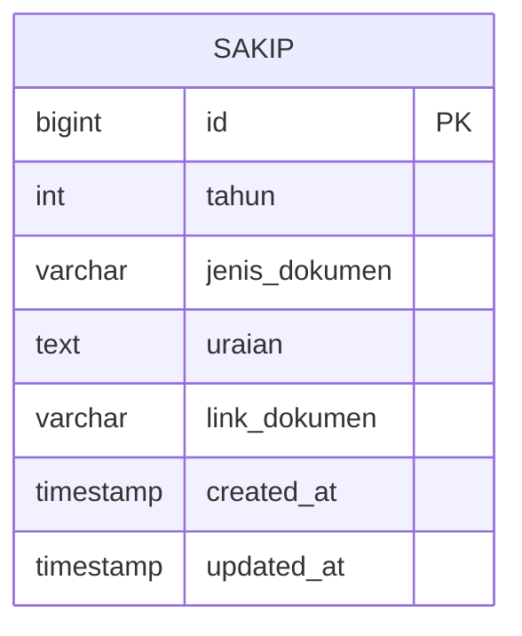
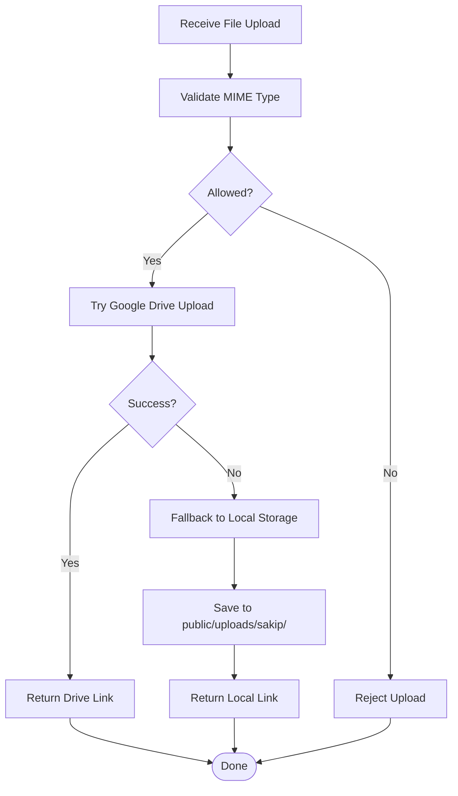
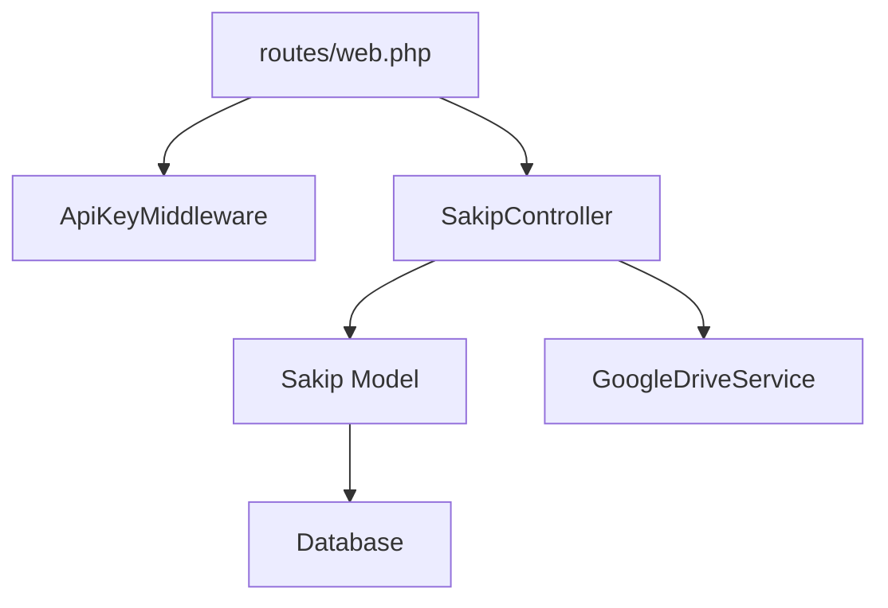

# SAKIP CRUD Operations

<cite>
**Referenced Files in This Document**
- [SakipController.php](file://app/Http/Controllers/SakipController.php)
- [Sakip.php](file://app/Models/Sakip.php)
- [2026_03_31_000001_create_sakip_table.php](file://database/migrations/2026_03_31_000001_create_sakip_table.php)
- [SakipSeeder.php](file://database/seeders/SakipSeeder.php)
- [web.php](file://routes/web.php)
- [ApiKeyMiddleware.php](file://app/Http/Middleware/ApiKeyMiddleware.php)
- [Controller.php](file://app/Http/Controllers/Controller.php)
- [GoogleDriveService.php](file://app/Services/GoogleDriveService.php)
- [app.php](file://bootstrap/app.php)
- [Handler.php](file://app/Exceptions/Handler.php)
</cite>

## Table of Contents
1. [Introduction](#introduction)
2. [Project Structure](#project-structure)
3. [Core Components](#core-components)
4. [Architecture Overview](#architecture-overview)
5. [Detailed Component Analysis](#detailed-component-analysis)
6. [Dependency Analysis](#dependency-analysis)
7. [Performance Considerations](#performance-considerations)
8. [Troubleshooting Guide](#troubleshooting-guide)
9. [Conclusion](#conclusion)
10. [Appendices](#appendices)

## Introduction
This document provides comprehensive API documentation for Strategic Planning Reports (SAKIP) CRUD operations. It covers:
- Creating new strategic plans via POST /api/sakip
- Updating existing records via PUT /api/sakip/{id} and POST /api/sakip/{id}
- Deleting records via DELETE /api/sakip/{id}
- Retrieving data via GET /api/sakip, GET /api/sakip/{id}, and GET /api/sakip/tahun/{tahun}
- Request/response schemas, validation rules, and security controls
- Practical examples for authenticated requests with API key headers, validation error responses, and successful CRUD operations
- Search and year-based filtering capabilities

## Project Structure
The SAKIP module is implemented as part of a Laravel Lumen application. Key components include:
- Routes: Public and protected endpoints for SAKIP
- Controller: Business logic for CRUD operations, validation, and file upload
- Model: Eloquent model mapping to the sakip table
- Middleware: API key authentication and rate limiting
- Services: Google Drive integration for file uploads
- Migrations and Seeders: Database schema and initial data

**Diagram sources**
- [web.php:50-134](file://routes/web.php#L50-L134)
- [ApiKeyMiddleware.php:14-39](file://app/Http/Middleware/ApiKeyMiddleware.php#L14-L39)
- [SakipController.php:9-252](file://app/Http/Controllers/SakipController.php#L9-L252)
- [Sakip.php:7-23](file://app/Models/Sakip.php#L7-L23)
- [GoogleDriveService.php:38-82](file://app/Services/GoogleDriveService.php#L38-L82)

**Section sources**
- [web.php:50-134](file://routes/web.php#L50-L134)
- [SakipController.php:9-252](file://app/Http/Controllers/SakipController.php#L9-L252)
- [Sakip.php:7-23](file://app/Models/Sakip.php#L7-L23)

## Core Components
- Routes: Define public and protected endpoints for SAKIP operations
- Controller: Implements validation, sanitization, duplicate checks, file upload, and response formatting
- Model: Defines fillable attributes and type casting for the sakip table
- Middleware: Enforces API key authentication and rate limiting
- Services: Handles Google Drive uploads with fallback to local storage

**Section sources**
- [web.php:50-134](file://routes/web.php#L50-L134)
- [SakipController.php:9-252](file://app/Http/Controllers/SakipController.php#L9-L252)
- [Sakip.php:7-23](file://app/Models/Sakip.php#L7-L23)
- [ApiKeyMiddleware.php:14-39](file://app/Http/Middleware/ApiKeyMiddleware.php#L14-L39)
- [GoogleDriveService.php:38-82](file://app/Services/GoogleDriveService.php#L38-L82)

## Architecture Overview
The SAKIP API follows a layered architecture:
- Presentation Layer: Routes define endpoint contracts
- Application Layer: Controller handles request validation, business rules, and orchestration
- Domain Layer: Model encapsulates persistence and type casting
- Infrastructure Layer: Middleware enforces security and rate limiting; Google Drive service handles file storage

**Diagram sources**
- [web.php:50-134](file://routes/web.php#L50-L134)
- [ApiKeyMiddleware.php:14-39](file://app/Http/Middleware/ApiKeyMiddleware.php#L14-L39)
- [SakipController.php:111-250](file://app/Http/Controllers/SakipController.php#L111-L250)
- [Sakip.php:7-23](file://app/Models/Sakip.php#L7-L23)
- [GoogleDriveService.php:38-82](file://app/Services/GoogleDriveService.php#L38-L82)

## Detailed Component Analysis

### Endpoint Definitions
- GET /api/sakip
  - Purpose: Retrieve paginated and ordered list of strategic planning documents
  - Query parameters:
    - tahun (optional): Integer year filter (2000–2100)
  - Response: JSON with success flag, data array, and total count
- GET /api/sakip/{id}
  - Purpose: Retrieve a specific document by ID
  - Path parameter: id (positive integer)
  - Response: JSON with success flag and data object
- GET /api/sakip/tahun/{tahun}
  - Purpose: Retrieve documents filtered by year
  - Path parameter: tahun (2000–2100)
  - Response: JSON with success flag, data array, and total count
- POST /api/sakip
  - Purpose: Create a new strategic planning document
  - Headers: X-API-Key (required for protected route)
  - Body: Form fields (multipart/form-data or form-encoded)
- PUT /api/sakip/{id}
  - Purpose: Update an existing document
  - Headers: X-API-Key (required for protected route)
  - Path parameter: id (positive integer)
  - Body: Form fields (multipart/form-data or form-encoded)
- POST /api/sakip/{id}
  - Purpose: Alternative update endpoint (idempotent update)
  - Headers: X-API-Key (required for protected route)
  - Path parameter: id (positive integer)
  - Body: Form fields (multipart/form-data or form-encoded)
- DELETE /api/sakip/{id}
  - Purpose: Delete a document
  - Headers: X-API-Key (required for protected route)
  - Path parameter: id (positive integer)

**Section sources**
- [web.php:50-134](file://routes/web.php#L50-L134)
- [SakipController.php:34-80](file://app/Http/Controllers/SakipController.php#L34-L80)
- [SakipController.php:85-106](file://app/Http/Controllers/SakipController.php#L85-L106)
- [SakipController.php:111-154](file://app/Http/Controllers/SakipController.php#L111-L154)
- [SakipController.php:159-222](file://app/Http/Controllers/SakipController.php#L159-L222)
- [SakipController.php:227-250](file://app/Http/Controllers/SakipController.php#L227-L250)

### Request and Response Schemas

#### Common Response Structure
- Success response:
  - success: Boolean
  - data: Object or Array (as applicable)
  - message: String (when applicable)
  - total: Number (for list responses)
- Error response:
  - success: Boolean (false)
  - message: String
  - errors: Object (validation errors, when applicable)

#### POST /api/sakip
- Content-Type: multipart/form-data or application/x-www-form-urlencoded
- Required fields:
  - tahun: Integer (2000–2100)
  - jenis_dokumen: String (must be one of predefined values)
- Optional fields:
  - uraian: String
  - link_dokumen: String
  - file_dokumen: File (PDF, DOC, DOCX, JPG, JPEG, PNG; max 20MB)
- Validation rules:
  - tahun: required, integer, min 2000, max 2100
  - jenis_dokumen: required, string, must be in allowed list
  - uraian: nullable, string
  - link_dokumen: nullable, string
  - file_dokumen: nullable, file, mime types: pdf, doc, docx, jpg, jpeg, png, max 20480KB
- Duplicate prevention:
  - Unique constraint on (tahun, jenis_dokumen)
- Response:
  - 201 Created on success with created item
  - 422 Unprocessable Entity on validation or duplicate errors
  - 400 Bad Request on invalid input
  - 401 Unauthorized if API key missing or invalid
  - 500 Internal Server Error on server configuration issues

#### PUT /api/sakip/{id} and POST /api/sakip/{id}
- Content-Type: multipart/form-data or application/x-www-form-urlencoded
- Path parameter: id (positive integer)
- Allowed fields:
  - tahun: Integer (2000–2100) when present
  - jenis_dokumen: String when present (must be in allowed list)
  - uraian: String
  - link_dokumen: String
  - file_dokumen: File (PDF, DOC, DOCX, JPG, JPEG, PNG; max 20MB)
- Validation rules:
  - tahun: sometimes|required, integer, min 2000, max 2100
  - jenis_dokumen: sometimes|required, string, must be in allowed list
  - uraian: nullable, string
  - link_dokumen: nullable, string
  - file_dokumen: nullable, file, mime types: pdf, doc, docx, jpg, jpeg, png, max 20480KB
- Duplicate prevention:
  - Excludes current record when checking uniqueness
- Response:
  - 200 OK on success with updated item
  - 422 Unprocessable Entity on validation or duplicate errors
  - 400 Bad Request on invalid ID or input
  - 404 Not Found if record does not exist
  - 401 Unauthorized if API key missing or invalid

#### DELETE /api/sakip/{id}
- Path parameter: id (positive integer)
- Response:
  - 200 OK on success with message
  - 400 Bad Request on invalid ID
  - 404 Not Found if record does not exist
  - 401 Unauthorized if API key missing or invalid

#### GET /api/sakip
- Query parameters:
  - tahun: Integer (2000–2100) optional
- Sorting:
  - Ordered by year descending, then by predefined document type order
- Response:
  - 200 OK with success flag, data array, and total count
  - 400 Bad Request if tahun out of range

#### GET /api/sakip/{id}
- Path parameter: id (positive integer)
- Response:
  - 200 OK with success flag and data object
  - 400 Bad Request on invalid ID
  - 404 Not Found if record does not exist

#### GET /api/sakip/tahun/{tahun}
- Path parameter: tahun (2000–2100)
- Response:
  - 200 OK with success flag, data array, and total count
  - 400 Bad Request if tahun out of range

**Section sources**
- [SakipController.php:14-29](file://app/Http/Controllers/SakipController.php#L14-L29)
- [SakipController.php:34-80](file://app/Http/Controllers/SakipController.php#L34-L80)
- [SakipController.php:85-106](file://app/Http/Controllers/SakipController.php#L85-L106)
- [SakipController.php:111-154](file://app/Http/Controllers/SakipController.php#L111-L154)
- [SakipController.php:159-222](file://app/Http/Controllers/SakipController.php#L159-L222)
- [SakipController.php:227-250](file://app/Http/Controllers/SakipController.php#L227-L250)
- [Sakip.php:11-22](file://app/Models/Sakip.php#L11-L22)
- [2026_03_31_000001_create_sakip_table.php:11-21](file://database/migrations/2026_03_31_000001_create_sakip_table.php#L11-L21)

### Validation Rules and Business Logic
- Allowed document types:
  - Indikator Kinerja Utama
  - Rencana Strategis
  - Program Kerja
  - Rencana Kinerja Tahunan
  - Perjanjian Kinerja
  - Rencana Aksi
  - Laporan Kinerja Instansi Pemerintah
- Year validation:
  - Range 2000–2100 enforced for all year-related operations
- Duplicate prevention:
  - Unique constraint on (tahun, jenis_dokumen)
  - Controller checks prevent duplicates during create/update
- File upload:
  - Supports PDF, DOC, DOCX, JPG, JPEG, PNG
  - Max size 20MB
  - MIME type validation based on file content
  - Upload to Google Drive with fallback to local storage
- Input sanitization:
  - Removes HTML tags and trims strings; empty strings become null

**Diagram sources**
- [SakipController.php:113-137](file://app/Http/Controllers/SakipController.php#L113-L137)
- [SakipController.php:176-205](file://app/Http/Controllers/SakipController.php#L176-L205)
- [Controller.php:18-29](file://app/Http/Controllers/Controller.php#L18-L29)
- [Controller.php:40-95](file://app/Http/Controllers/Controller.php#L40-L95)

**Section sources**
- [SakipController.php:14-29](file://app/Http/Controllers/SakipController.php#L14-L29)
- [SakipController.php:113-137](file://app/Http/Controllers/SakipController.php#L113-L137)
- [SakipController.php:176-205](file://app/Http/Controllers/SakipController.php#L176-L205)
- [Controller.php:18-29](file://app/Http/Controllers/Controller.php#L18-L29)
- [Controller.php:40-95](file://app/Http/Controllers/Controller.php#L40-L95)

### Authentication and Security
- API Key Requirement:
  - Protected routes require header X-API-Key
  - Middleware performs timing-safe comparison and rate limiting
- Rate Limiting:
  - 100 requests per minute for protected routes
- Error Handling:
  - Consistent JSON error responses with security headers
  - Production mode hides exception details

**Diagram sources**
- [ApiKeyMiddleware.php:14-39](file://app/Http/Middleware/ApiKeyMiddleware.php#L14-L39)
- [web.php:78-134](file://routes/web.php#L78-L134)
- [Handler.php:36-132](file://app/Exceptions/Handler.php#L36-L132)

**Section sources**
- [ApiKeyMiddleware.php:14-39](file://app/Http/Middleware/ApiKeyMiddleware.php#L14-L39)
- [web.php:78-134](file://routes/web.php#L78-L134)
- [Handler.php:36-132](file://app/Exceptions/Handler.php#L36-L132)

### Data Model and Storage
- Table: sakip
  - Columns: id, tahun (integer), jenis_dokumen (string), uraian (text), link_dokumen (string), timestamps
  - Unique constraint: (tahun, jenis_dokumen)
  - Index: tahun
- Model attributes:
  - Fillable: tahun, jenis_dokumen, uraian, link_dokumen
  - Casts: tahun as integer, timestamps as datetime

**Diagram sources**
- [2026_03_31_000001_create_sakip_table.php:11-21](file://database/migrations/2026_03_31_000001_create_sakip_table.php#L11-L21)
- [Sakip.php:11-22](file://app/Models/Sakip.php#L11-L22)

**Section sources**
- [2026_03_31_000001_create_sakip_table.php:11-21](file://database/migrations/2026_03_31_000001_create_sakip_table.php#L11-L21)
- [Sakip.php:11-22](file://app/Models/Sakip.php#L11-L22)

### File Upload Workflow
- Supported formats: PDF, DOC, DOCX, JPG, JPEG, PNG
- Size limit: 20MB
- MIME type validation performed on file content
- Storage options:
  - Google Drive: Preferred with daily subfolders
  - Local fallback: Random filename, stored under public/uploads/sakip/

**Diagram sources**
- [Controller.php:40-95](file://app/Http/Controllers/Controller.php#L40-L95)
- [GoogleDriveService.php:38-82](file://app/Services/GoogleDriveService.php#L38-L82)

**Section sources**
- [Controller.php:40-95](file://app/Http/Controllers/Controller.php#L40-L95)
- [GoogleDriveService.php:38-82](file://app/Services/GoogleDriveService.php#L38-L82)

## Dependency Analysis
- Routes depend on controller actions
- Controller depends on model and middleware
- Model depends on database schema
- Controller uses Google Drive service for file uploads
- Middleware depends on environment configuration

**Diagram sources**
- [web.php:50-134](file://routes/web.php#L50-L134)
- [ApiKeyMiddleware.php:14-39](file://app/Http/Middleware/ApiKeyMiddleware.php#L14-L39)
- [SakipController.php:9-252](file://app/Http/Controllers/SakipController.php#L9-L252)
- [Sakip.php:7-23](file://app/Models/Sakip.php#L7-L23)
- [GoogleDriveService.php:38-82](file://app/Services/GoogleDriveService.php#L38-L82)

**Section sources**
- [web.php:50-134](file://routes/web.php#L50-L134)
- [SakipController.php:9-252](file://app/Http/Controllers/SakipController.php#L9-L252)
- [Sakip.php:7-23](file://app/Models/Sakip.php#L7-L23)
- [ApiKeyMiddleware.php:14-39](file://app/Http/Middleware/ApiKeyMiddleware.php#L14-L39)
- [GoogleDriveService.php:38-82](file://app/Services/GoogleDriveService.php#L38-L82)

## Performance Considerations
- Index on tahun improves year-based queries
- Unique constraint on (tahun, jenis_dokumen) prevents duplicates and speeds up conflict checks
- File uploads are asynchronous; consider background jobs for large files
- Rate limiting protects against abuse while maintaining responsiveness
- Sorting by predefined document type order ensures consistent presentation

## Troubleshooting Guide
Common issues and resolutions:
- 401 Unauthorized
  - Cause: Missing or invalid X-API-Key header
  - Resolution: Provide correct API key via X-API-Key header
- 400 Bad Request
  - Cause: Invalid ID or out-of-range year
  - Resolution: Ensure ID > 0 and year within 2000–2100
- 404 Not Found
  - Cause: Record does not exist
  - Resolution: Verify ID or create the record first
- 422 Unprocessable Entity
  - Cause: Validation errors or duplicate document/year combination
  - Resolution: Fix field types/values or change jenis_dokumen to a unique combination
- 500 Internal Server Error
  - Cause: Missing API_KEY environment variable
  - Resolution: Set API_KEY in environment configuration

**Section sources**
- [SakipController.php:87-91](file://app/Http/Controllers/SakipController.php#L87-L91)
- [SakipController.php:63-68](file://app/Http/Controllers/SakipController.php#L63-L68)
- [SakipController.php:161-166](file://app/Http/Controllers/SakipController.php#L161-L166)
- [SakipController.php:132-137](file://app/Http/Controllers/SakipController.php#L132-L137)
- [ApiKeyMiddleware.php:20-25](file://app/Http/Middleware/ApiKeyMiddleware.php#L20-L25)

## Conclusion
The SAKIP CRUD API provides a secure, validated, and extensible interface for managing strategic planning documents. It enforces strict validation, prevents duplicates, supports flexible retrieval via filters, and integrates robust file upload capabilities with Google Drive. Authentication via API key and rate limiting ensure operational safety, while consistent error handling maintains reliability.

## Appendices

### Practical Examples

#### Create a New Strategic Plan (POST /api/sakip)
- Headers:
  - X-API-Key: YOUR_API_KEY
  - Content-Type: multipart/form-data
- Body fields:
  - tahun: 2025
  - jenis_dokumen: Rencana Strategis
  - uraian: Optional textual description
  - link_dokumen: Optional external link
  - file_dokumen: Optional PDF/DOC/JPG file
- Expected response:
  - 201 Created with success flag and created item

#### Update an Existing Plan (PUT /api/sakip/{id})
- Headers:
  - X-API-Key: YOUR_API_KEY
  - Content-Type: multipart/form-data
- Path parameter:
  - id: Positive integer
- Body fields:
  - tahun: Optional (2000–2100)
  - jenis_dokumen: Optional (must be in allowed list)
  - uraian: Optional
  - link_dokumen: Optional
  - file_dokumen: Optional
- Expected response:
  - 200 OK with success flag and updated item

#### Delete a Plan (DELETE /api/sakip/{id})
- Headers:
  - X-API-Key: YOUR_API_KEY
- Path parameter:
  - id: Positive integer
- Expected response:
  - 200 OK with success message

#### Retrieve Plans (GET /api/sakip)
- Query parameters:
  - tahun: Optional (2000–2100)
- Expected response:
  - 200 OK with success flag, data array, and total count

#### Retrieve by Year (GET /api/sakip/tahun/{tahun})
- Path parameter:
  - tahun: 2000–2100
- Expected response:
  - 200 OK with success flag, data array, and total count

#### Retrieve Specific Item (GET /api/sakip/{id})
- Path parameter:
  - id: Positive integer
- Expected response:
  - 200 OK with success flag and data object

### Validation Error Response Example
- Status: 422 Unprocessable Entity
- Body:
  - success: false
  - message: Validation failed
  - errors: Object containing field-specific validation messages

### Environment Configuration
- Required environment variables:
  - API_KEY: Secret key for API authentication
  - GOOGLE_DRIVE_CLIENT_ID: Google OAuth client ID
  - GOOGLE_DRIVE_CLIENT_SECRET: Google OAuth client secret
  - GOOGLE_DRIVE_REFRESH_TOKEN: Google OAuth refresh token
  - GOOGLE_DRIVE_ROOT_FOLDER_ID: Root folder ID for uploads

**Section sources**
- [web.php:50-134](file://routes/web.php#L50-L134)
- [SakipController.php:113-154](file://app/Http/Controllers/SakipController.php#L113-L154)
- [SakipController.php:176-222](file://app/Http/Controllers/SakipController.php#L176-L222)
- [SakipController.php:227-250](file://app/Http/Controllers/SakipController.php#L227-L250)
- [SakipController.php:34-80](file://app/Http/Controllers/SakipController.php#L34-L80)
- [SakipController.php:85-106](file://app/Http/Controllers/SakipController.php#L85-L106)
- [ApiKeyMiddleware.php:16-25](file://app/Http/Middleware/ApiKeyMiddleware.php#L16-L25)
- [GoogleDriveService.php:14-22](file://app/Services/GoogleDriveService.php#L14-L22)