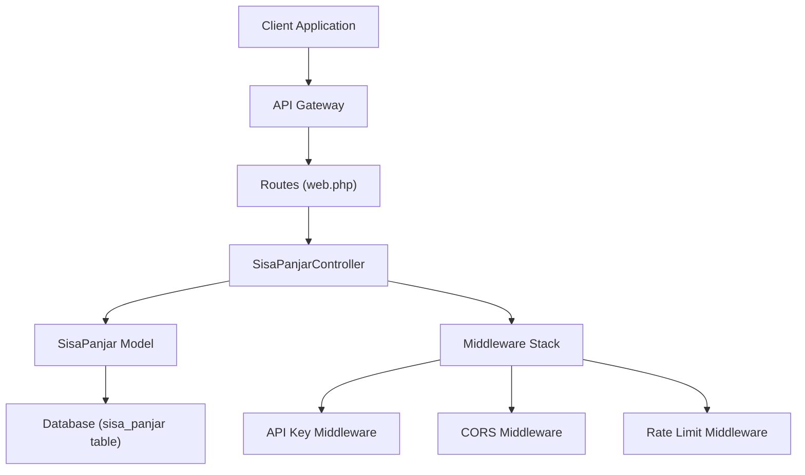
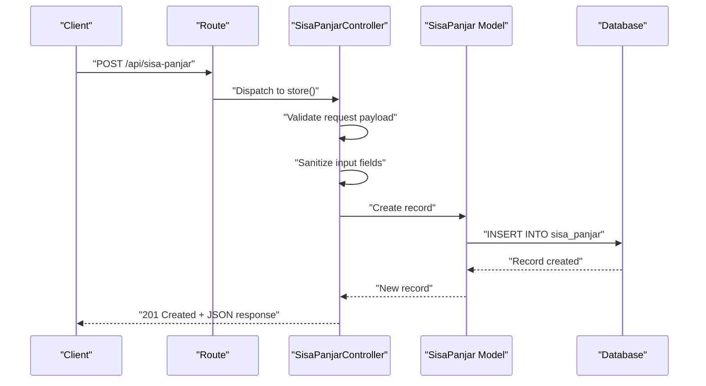
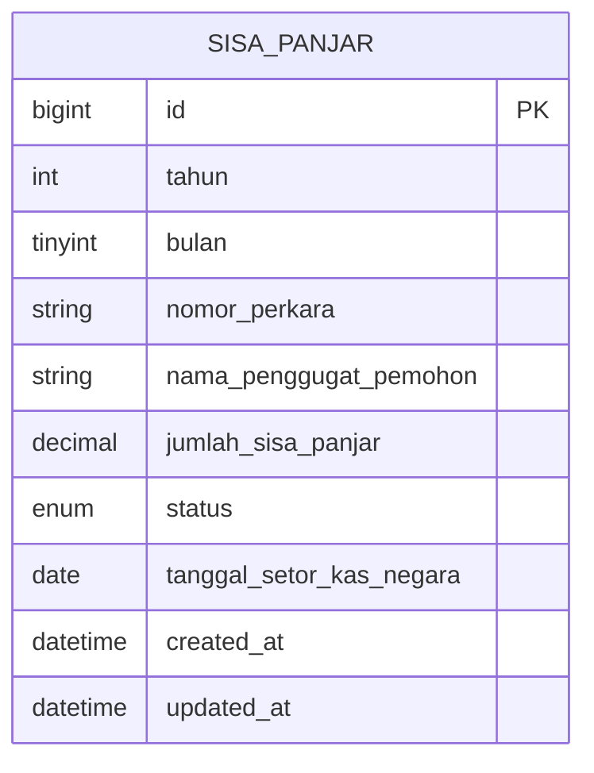
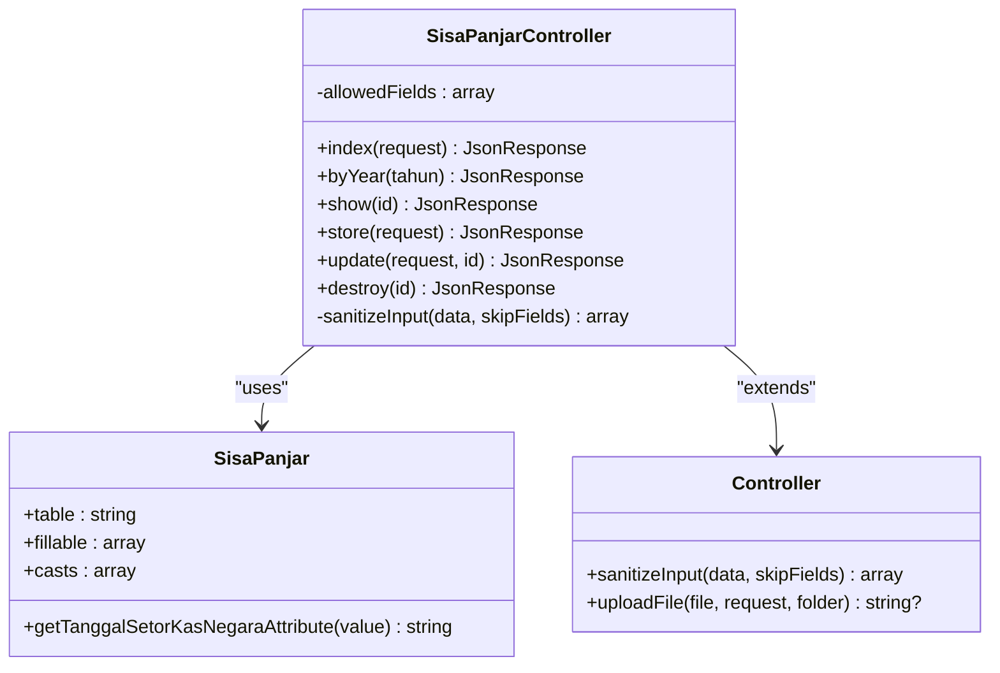

# Sisa Panjar CRUD Operations

<cite>
**Referenced Files in This Document**
- [SisaPanjarController.php](file://app/Http/Controllers/SisaPanjarController.php)
- [SisaPanjar.php](file://app/Models/SisaPanjar.php)
- [2026_04_01_000001_create_sisa_panjar_table.php](file://database/migrations/2026_04_01_000001_create_sisa_panjar_table.php)
- [web.php](file://routes/web.php)
- [ApiKeyMiddleware.php](file://app/Http/Middleware/ApiKeyMiddleware.php)
- [CorsMiddleware.php](file://app/Http/Middleware/CorsMiddleware.php)
- [RateLimitMiddleware.php](file://app/Http/Middleware/RateLimitMiddleware.php)
- [Controller.php](file://app/Http/Controllers/Controller.php)
- [sisa-panjar.html](file://docs/sisa-panjar.html)
- [sisa_panjar_joomla.md](file://docs/sisa_panjar_joomla.md)
</cite>

## Table of Contents
1. [Introduction](#introduction)
2. [Project Structure](#project-structure)
3. [Core Components](#core-components)
4. [Architecture Overview](#architecture-overview)
5. [Detailed Component Analysis](#detailed-component-analysis)
6. [Dependency Analysis](#dependency-analysis)
7. [Performance Considerations](#performance-considerations)
8. [Troubleshooting Guide](#troubleshooting-guide)
9. [Conclusion](#conclusion)
10. [Appendices](#appendices)

## Introduction
This document provides comprehensive API documentation for Sisa Panjar CRUD operations, focusing on advance payment tracking for court cases. It covers:
- POST /api/sisa-panjar for creating new panjar records
- PUT /api/sisa-panjar/{id} and POST /api/sisa-panjar/{id} for updates
- DELETE /api/sisa-panjar/{id} for removal
- GET endpoints for search and year-based filtering
- Detailed request/response schemas with validation rules
- Practical examples for authenticated requests with API key headers
- Validation error responses and successful CRUD operation examples

The Sisa Panjar module tracks remaining advance payments for legal cases, distinguishing between funds not yet withdrawn and those deposited into the state treasury.

## Project Structure
The Sisa Panjar functionality is implemented within a Laravel Lumen application. Key components include:
- Controller: Handles HTTP requests and responses
- Model: Defines database schema and attribute casting
- Migration: Creates the underlying database table
- Routes: Expose public and protected endpoints
- Middleware: Enforces API key authentication and CORS policies
- Documentation: Provides frontend integration examples

**Diagram sources**
- [web.php:65-152](file://routes/web.php#L65-L152)
- [SisaPanjarController.php:9-198](file://app/Http/Controllers/SisaPanjarController.php#L9-L198)
- [SisaPanjar.php:7-34](file://app/Models/SisaPanjar.php#L7-L34)

**Section sources**
- [web.php:1-165](file://routes/web.php#L1-L165)
- [SisaPanjarController.php:1-199](file://app/Http/Controllers/SisaPanjarController.php#L1-L199)
- [SisaPanjar.php:1-35](file://app/Models/SisaPanjar.php#L1-L35)

## Core Components
This section outlines the primary components involved in Sisa Panjar CRUD operations.

- SisaPanjarController: Implements all CRUD endpoints, input validation, sanitization, and response formatting.
- SisaPanjar Model: Defines fillable attributes, database casts, and date formatting for output.
- Database Migration: Creates the sisa_panjar table with appropriate constraints and indexes.
- Routes: Exposes both public and protected endpoints under the /api namespace.
- Middleware: Enforces API key authentication, CORS headers, and rate limiting.

Key responsibilities:
- Validation ensures data integrity and prevents malicious inputs.
- Sanitization removes HTML tags and trims whitespace for string fields.
- Pagination limits response sizes for public endpoints.
- Indexes optimize query performance for year/month/status filters.

**Section sources**
- [SisaPanjarController.php:11-198](file://app/Http/Controllers/SisaPanjarController.php#L11-L198)
- [SisaPanjar.php:11-33](file://app/Models/SisaPanjar.php#L11-L33)
- [2026_04_01_000001_create_sisa_panjar_table.php:14-30](file://database/migrations/2026_04_01_000001_create_sisa_panjar_table.php#L14-L30)
- [web.php:65-152](file://routes/web.php#L65-L152)

## Architecture Overview
The Sisa Panjar API follows a layered architecture:
- Presentation Layer: Routes define endpoint contracts and HTTP methods.
- Application Layer: Controller orchestrates validation, sanitization, persistence, and response formatting.
- Domain Layer: Model encapsulates business data and attribute casting.
- Infrastructure Layer: Middleware enforces security policies and cross-origin access.

**Diagram sources**
- [web.php:148-152](file://routes/web.php#L148-L152)
- [SisaPanjarController.php:109-131](file://app/Http/Controllers/SisaPanjarController.php#L109-L131)
- [SisaPanjar.php:11-19](file://app/Models/SisaPanjar.php#L11-L19)

**Section sources**
- [web.php:65-152](file://routes/web.php#L65-L152)
- [SisaPanjarController.php:9-198](file://app/Http/Controllers/SisaPanjarController.php#L9-L198)

## Detailed Component Analysis

### API Endpoints

#### POST /api/sisa-panjar
Purpose: Create a new Sisa Panjar record.

- Authentication: Required (X-API-Key header)
- Rate Limit: 100 requests per minute
- Request Body Fields:
  - tahun (required, integer, 2000-2100)
  - bulan (required, integer, 1-12)
  - nomor_perkara (required, string, max 100, regex pattern)
  - nama_penggugat_pemohon (required, string, max 255)
  - jumlah_sisa_panjar (required, numeric, min 0)
  - status (required, enum: belum_diambil, disetor_kas_negara)
  - tanggal_setor_kas_negara (optional, date)
- Response:
  - 201 Created on success
  - 400 Bad Request on validation failure
  - 401 Unauthorized if API key missing/invalid
  - 429 Too Many Requests if rate limit exceeded
  - 500 Internal Server Error if configuration error

Validation Rules:
- tahun: required, integer, min 2000, max 2100
- bulan: required, integer, min 1, max 12
- nomor_perkara: required, string, max 100, regex /^[0-9/.a-zA-Z\s-]+$/
- nama_penggugat_pemohon: required, string, max 255
- jumlah_sisa_panjar: required, numeric, min 0
- status: required, in [belum_diambil, disetor_kas_negara]
- tanggal_setor_kas_negara: nullable, date

Success Response Schema:
{
  "success": true,
  "message": "Data sisa panjar berhasil disimpan",
  "data": {
    "id": 1,
    "tahun": 2025,
    "bulan": 4,
    "nomor_perkara": "string",
    "nama_penggugat_pemohon": "string",
    "jumlah_sisa_panjar": "decimal",
    "status": "string",
    "tanggal_setor_kas_negara": "date|null",
    "created_at": "datetime",
    "updated_at": "datetime"
  }
}

Example Request:
curl -X POST https://api.pa-penajam.go.id/api/sisa-panjar \
  -H "X-API-Key: YOUR_API_KEY" \
  -H "Content-Type: application/json" \
  -d '{
    "tahun": 2025,
    "bulan": 4,
    "nomor_perkara": "279/Pdt.G/2025/PA.Pnj",
    "nama_penggugat_pemohon": "Nining binti Mulyana",
    "jumlah_sisa_panjar": 427000,
    "status": "disetor_kas_negara",
    "tanggal_setor_kas_negara": "2025-04-28"
  }'

**Section sources**
- [web.php:148-152](file://routes/web.php#L148-L152)
- [SisaPanjarController.php:111-131](file://app/Http/Controllers/SisaPanjarController.php#L111-L131)
- [SisaPanjar.php:21-28](file://app/Models/SisaPanjar.php#L21-L28)

#### PUT /api/sisa-panjar/{id} and POST /api/sisa-panjar/{id}
Purpose: Update an existing Sisa Panjar record.

- Authentication: Required (X-API-Key header)
- Path Parameter: id (positive integer)
- Request Body Fields: Same as POST, but fields are optional (partial updates)
- Response:
  - 200 OK on success
  - 400 Bad Request for invalid ID or validation failure
  - 404 Not Found if record does not exist
  - 401 Unauthorized if API key missing/invalid
  - 429 Too Many Requests if rate limit exceeded

Validation Rules (fields are optional):
- tahun: integer, min 2000, max 2100
- bulan: integer, min 1, max 12
- nomor_perkara: string, max 100, regex /^[0-9/.a-zA-Z\s-]+$/
- nama_penggugat_pemohon: string, max 255
- jumlah_sisa_panjar: numeric, min 0
- status: in [belum_diambil, disetor_kas_negara]
- tanggal_setor_kas_negara: nullable, date

Success Response Schema:
{
  "success": true,
  "message": "Data sisa panjar berhasil diupdate",
  "data": {
    "id": 1,
    "tahun": 2025,
    "bulan": 4,
    "nomor_perkara": "string",
    "nama_penggugat_pemohon": "string",
    "jumlah_sisa_panjar": "decimal",
    "status": "string",
    "tanggal_setor_kas_negara": "date|null",
    "created_at": "datetime",
    "updated_at": "datetime"
  }
}

Example Request:
curl -X PUT https://api.pa-penajam.go.id/api/sisa-panjar/1 \
  -H "X-API-Key: YOUR_API_KEY" \
  -H "Content-Type: application/json" \
  -d '{
    "jumlah_sisa_panjar": 400000,
    "status": "belum_diambil"
  }'

**Section sources**
- [web.php:149-152](file://routes/web.php#L149-L152)
- [SisaPanjarController.php:133-171](file://app/Http/Controllers/SisaPanjarController.php#L133-L171)

#### DELETE /api/sisa-panjar/{id}
Purpose: Remove a Sisa Panjar record.

- Authentication: Required (X-API-Key header)
- Path Parameter: id (positive integer)
- Response:
  - 200 OK on success
  - 400 Bad Request for invalid ID
  - 404 Not Found if record does not exist
  - 401 Unauthorized if API key missing/invalid
  - 429 Too Many Requests if rate limit exceeded

Success Response Schema:
{
  "success": true,
  "message": "Data sisa panjar berhasil dihapus"
}

Example Request:
curl -X DELETE https://api.pa-penajam.go.id/api/sisa-panjar/1 \
  -H "X-API-Key: YOUR_API_KEY"

**Section sources**
- [web.php:152](file://routes/web.php#L152)
- [SisaPanjarController.php:173-197](file://app/Http/Controllers/SisaPanjarController.php#L173-L197)

#### GET /api/sisa-panjar
Purpose: Retrieve paginated Sisa Panjar records with optional filters.

- Authentication: Optional (public endpoint)
- Query Parameters:
  - tahun (integer, 2000-2100)
  - status (string, enum: belum_diambil, disetor_kas_negara)
  - bulan (integer, 1-12)
  - limit (integer, min 1, max 500)
  - page (integer, default 1)
- Response:
  - 200 OK with pagination metadata
  - 400 Bad Request for invalid year
  - 429 Too Many Requests if rate limit exceeded

Response Schema:
{
  "success": true,
  "data": [
    {
      "id": 1,
      "tahun": 2025,
      "bulan": 4,
      "nomor_perkara": "string",
      "nama_penggugat_pemohon": "string",
      "jumlah_sisa_panjar": "decimal",
      "status": "string",
      "tanggal_setor_kas_negara": "date|null",
      "created_at": "datetime",
      "updated_at": "datetime"
    }
  ],
  "current_page": 1,
  "last_page": 1,
  "per_page": 10,
  "total": 25
}

Example Request:
curl "https://api.pa-penajam.go.id/api/sisa-panjar?tahun=2025&status=belum_diambil&limit=500&page=1"

**Section sources**
- [web.php:66-68](file://routes/web.php#L66-L68)
- [SisaPanjarController.php:21-61](file://app/Http/Controllers/SisaPanjarController.php#L21-L61)

#### GET /api/sisa-panjar/{id}
Purpose: Retrieve a specific Sisa Panjar record.

- Authentication: Optional (public endpoint)
- Path Parameter: id (positive integer)
- Response:
  - 200 OK on success
  - 400 Bad Request for invalid ID
  - 404 Not Found if record does not exist

Response Schema:
{
  "success": true,
  "data": {
    "id": 1,
    "tahun": 2025,
    "bulan": 4,
    "nomor_perkara": "string",
    "nama_penggugat_pemohon": "string",
    "jumlah_sisa_panjar": "decimal",
    "status": "string",
    "tanggal_setor_kas_negara": "date|null",
    "created_at": "datetime",
    "updated_at": "datetime"
  }
}

Example Request:
curl "https://api.pa-penajam.go.id/api/sisa-panjar/1"

**Section sources**
- [web.php:67](file://routes/web.php#L67)
- [SisaPanjarController.php:85-107](file://app/Http/Controllers/SisaPanjarController.php#L85-L107)

#### GET /api/sisa-panjar/tahun/{tahun}
Purpose: Retrieve all Sisa Panjar records for a given year, ordered by month and creation date.

- Authentication: Optional (public endpoint)
- Path Parameter: tahun (2000-2100)
- Response:
  - 200 OK on success
  - 400 Bad Request for invalid year

Response Schema:
{
  "success": true,
  "data": [
    {
      "id": 1,
      "tahun": 2025,
      "bulan": 4,
      "nomor_perkara": "string",
      "nama_penggugat_pemohon": "string",
      "jumlah_sisa_panjar": "decimal",
      "status": "string",
      "tanggal_setor_kas_negara": "date|null",
      "created_at": "datetime",
      "updated_at": "datetime"
    }
  ],
  "total": 25
}

Example Request:
curl "https://api.pa-penajam.go.id/api/sisa-panjar/tahun/2025"

**Section sources**
- [web.php:68](file://routes/web.php#L68)
- [SisaPanjarController.php:63-83](file://app/Http/Controllers/SisaPanjarController.php#L63-L83)

### Data Model and Database Schema
The Sisa Panjar model defines the data structure and casting rules.

**Diagram sources**
- [2026_04_01_000001_create_sisa_panjar_table.php:16-30](file://database/migrations/2026_04_01_000001_create_sisa_panjar_table.php#L16-L30)
- [SisaPanjar.php:11-28](file://app/Models/SisaPanjar.php#L11-L28)

Key characteristics:
- Primary key: id
- Fillable attributes: tahun, bulan, nomor_perkara, nama_penggugat_pemohon, jumlah_sisa_panjar, status, tanggal_setor_kas_negara
- Attribute casting:
  - tahun: integer
  - bulan: integer
  - jumlah_sisa_panjar: decimal with 2 fractional digits
  - tanggal_setor_kas_negara: date
  - created_at, updated_at: datetime
- Output formatting: tanggal_setor_kas_negara is formatted to "YYYY-MM-DD"

**Section sources**
- [SisaPanjar.php:11-33](file://app/Models/SisaPanjar.php#L11-L33)
- [2026_04_01_000001_create_sisa_panjar_table.php:16-30](file://database/migrations/2026_04_01_000001_create_sisa_panjar_table.php#L16-L30)

### Validation and Sanitization
The controller applies strict validation and sanitization to ensure data integrity and security.

Validation rules (POST):
- tahun: required, integer, min 2000, max 2100
- bulan: required, integer, min 1, max 12
- nomor_perkara: required, string, max 100, regex /^[0-9/.a-zA-Z\s-]+$/
- nama_penggugat_pemohon: required, string, max 255
- jumlah_sisa_panjar: required, numeric, min 0
- status: required, in [belum_diambil, disetor_kas_negara]
- tanggal_setor_kas_negara: nullable, date

Validation rules (PUT/POST update):
- Same as above, but fields are optional (sometimes)

Sanitization:
- sanitizeInput trims whitespace and strips HTML tags from string fields
- Skips sanitization for specific fields (e.g., nomor_perkara)
- Converts empty sanitized strings to null

**Section sources**
- [SisaPanjarController.php:111-119](file://app/Http/Controllers/SisaPanjarController.php#L111-L119)
- [SisaPanjarController.php:151-159](file://app/Http/Controllers/SisaPanjarController.php#L151-L159)
- [Controller.php:18-29](file://app/Http/Controllers/Controller.php#L18-L29)

### Middleware and Security
Security enforcement occurs at multiple layers:

- API Key Middleware:
  - Validates X-API-Key header against environment variable
  - Uses timing-safe comparison to prevent timing attacks
  - Returns 500 if API_KEY is not configured
  - Returns 401 if key is missing or invalid (with randomized delay)

- CORS Middleware:
  - Whitelists trusted origins (production domains)
  - Allows GET, POST, PUT, DELETE, OPTIONS
  - Sets security headers (X-Content-Type-Options, X-Frame-Options, X-XSS-Protection)
  - Blocks unauthorized origins

- Rate Limit Middleware:
  - Limits requests per IP address
  - Returns 429 with Retry-After header when exceeded
  - Uses cache backend (file or Redis)

- Public vs Protected Routes:
  - Public routes: GET /api/sisa-panjar, GET /api/sisa-panjar/{id}, GET /api/sisa-panjar/tahun/{tahun}
  - Protected routes: POST, PUT, POST, DELETE /api/sisa-panjar/*

**Section sources**
- [ApiKeyMiddleware.php:14-39](file://app/Http/Middleware/ApiKeyMiddleware.php#L14-L39)
- [CorsMiddleware.php:14-62](file://app/Http/Middleware/CorsMiddleware.php#L14-L62)
- [RateLimitMiddleware.php:15-39](file://app/Http/Middleware/RateLimitMiddleware.php#L15-L39)
- [web.php:14-164](file://routes/web.php#L14-L164)

### Frontend Integration Examples
The documentation includes examples for integrating with frontend applications:

- Static HTML page (sisa-panjar.html) demonstrates:
  - AJAX calls to GET /api/sisa-panjar
  - Filtering by tahun and status
  - DataTables integration with pagination and totals
  - Currency and date formatting

- Joomla integration (sisa_panjar_joomla.md) provides:
  - PHP helper functions for API consumption
  - Example layouts for displaying data grouped by month
  - Cache strategies to reduce API load

These examples illustrate how to consume the API for monthly cash flow tracking and financial reporting.

**Section sources**
- [sisa-panjar.html:266-451](file://docs/sisa-panjar.html#L266-L451)
- [sisa_panjar_joomla.md:50-449](file://docs/sisa_panjar_joomla.md#L50-L449)

## Dependency Analysis
The Sisa Panjar module exhibits clear separation of concerns with minimal coupling between components.

**Diagram sources**
- [SisaPanjarController.php:9-198](file://app/Http/Controllers/SisaPanjarController.php#L9-L198)
- [SisaPanjar.php:7-34](file://app/Models/SisaPanjar.php#L7-L34)
- [Controller.php:7-96](file://app/Http/Controllers/Controller.php#L7-L96)

Key dependencies:
- Controller extends BaseController to inherit common functionality
- SisaPanjarController depends on SisaPanjar model for persistence
- Sanitization logic is centralized in base Controller class
- Routes bind endpoints to controller methods

Potential circular dependencies: None observed.

External dependencies:
- Laravel Lumen framework for routing and HTTP handling
- Eloquent ORM for database operations
- Middleware stack for security and rate limiting

**Section sources**
- [SisaPanjarController.php:5-7](file://app/Http/Controllers/SisaPanjarController.php#L5-L7)
- [Controller.php:5](file://app/Http/Controllers/Controller.php#L5)

## Performance Considerations
- Pagination: Public endpoints limit results to 500 per page to prevent excessive memory usage and improve responsiveness.
- Indexes: Database migration creates indexes on (tahun, bulan) and status to accelerate filtering queries.
- Casting: Decimal casting for jumlah_sisa_panjar ensures precision for financial calculations.
- Middleware caching: Rate limiting uses cache backend to track request counts efficiently.

Recommendations:
- Use year-based filtering for large datasets to leverage database indexes.
- Implement client-side caching for frequently accessed data.
- Monitor rate limit headers to adjust client-side retry logic.

[No sources needed since this section provides general guidance]

## Troubleshooting Guide
Common issues and resolutions:

- 401 Unauthorized:
  - Ensure X-API-Key header is present and matches environment configuration.
  - Verify API_KEY is set in environment variables.

- 400 Bad Request:
  - Check validation rules for required fields and data types.
  - Confirm tahun and bulan are within allowed ranges.
  - Validate nomor_perkara against regex pattern.

- 404 Not Found:
  - Verify the record ID exists before attempting updates or deletions.
  - Confirm URL path parameters are integers.

- 429 Too Many Requests:
  - Implement exponential backoff in client applications.
  - Reduce request frequency or batch operations.

- CORS Issues:
  - Ensure Origin is whitelisted in environment configuration.
  - Verify Content-Type and X-API-Key headers are allowed.

- Rate Limit Headers:
  - Monitor X-RateLimit-Limit and X-RateLimit-Remaining headers.
  - Adjust client-side request scheduling accordingly.

**Section sources**
- [ApiKeyMiddleware.php:14-39](file://app/Http/Middleware/ApiKeyMiddleware.php#L14-L39)
- [CorsMiddleware.php:14-62](file://app/Http/Middleware/CorsMiddleware.php#L14-L62)
- [RateLimitMiddleware.php:15-39](file://app/Http/Middleware/RateLimitMiddleware.php#L15-L39)
- [SisaPanjarController.php:87-100](file://app/Http/Controllers/SisaPanjarController.php#L87-L100)

## Conclusion
The Sisa Panjar API provides a robust foundation for managing advance payment tracking in legal cases. Its design emphasizes:
- Strong validation and sanitization to ensure data integrity
- Clear endpoint contracts with comprehensive request/response schemas
- Security through API key authentication, CORS whitelisting, and rate limiting
- Performance optimizations via pagination and database indexing

The included documentation and frontend integration examples facilitate quick adoption for monthly cash flow tracking and financial reporting.

[No sources needed since this section summarizes without analyzing specific files]

## Appendices

### Request/Response Examples

Successful Creation (POST):
{
  "success": true,
  "message": "Data sisa panjar berhasil disimpan",
  "data": {
    "id": 1,
    "tahun": 2025,
    "bulan": 4,
    "nomor_perkara": "279/Pdt.G/2025/PA.Pnj",
    "nama_penggugat_pemohon": "Nining binti Mulyana",
    "jumlah_sisa_panjar": 427000,
    "status": "disetor_kas_negara",
    "tanggal_setor_kas_negara": "2025-04-28",
    "created_at": "2025-04-01T10:00:00.000000Z",
    "updated_at": "2025-04-01T10:00:00.000000Z"
  }
}

Validation Error Response (400):
{
  "success": false,
  "message": "The tahun must be at least 2000.",
  "errors": {
    "tahun": ["The tahun must be at least 2000."]
  }
}

Unauthorized Response (401):
{
  "success": false,
  "message": "Unauthorized"
}

Pagination Response (GET /api/sisa-panjar):
{
  "success": true,
  "data": [...],
  "current_page": 1,
  "last_page": 5,
  "per_page": 10,
  "total": 47
}

**Section sources**
- [SisaPanjarController.php:126-130](file://app/Http/Controllers/SisaPanjarController.php#L126-L130)
- [SisaPanjarController.php:111-119](file://app/Http/Controllers/SisaPanjarController.php#L111-L119)
- [ApiKeyMiddleware.php:28-36](file://app/Http/Middleware/ApiKeyMiddleware.php#L28-L36)
- [SisaPanjarController.php:53-60](file://app/Http/Controllers/SisaPanjarController.php#L53-L60)