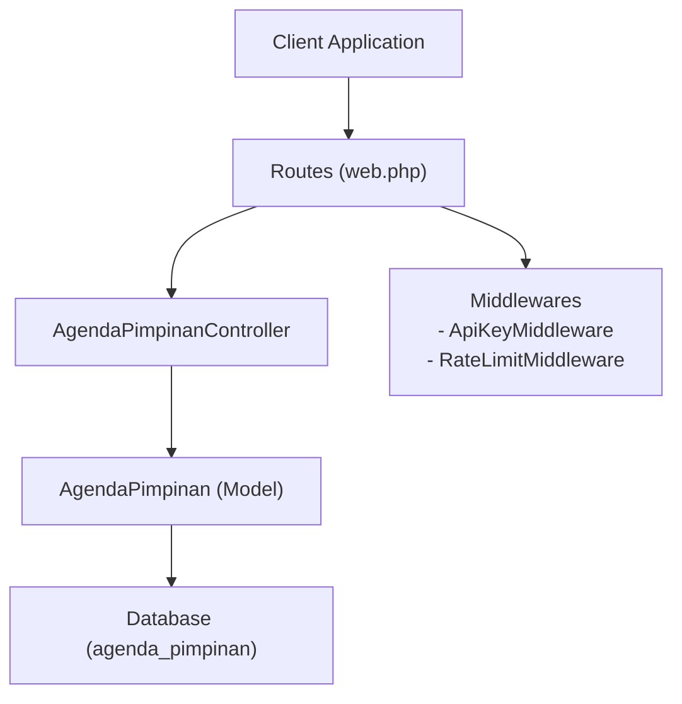
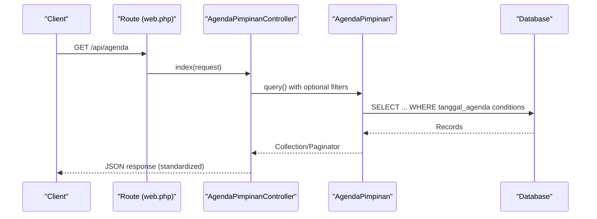
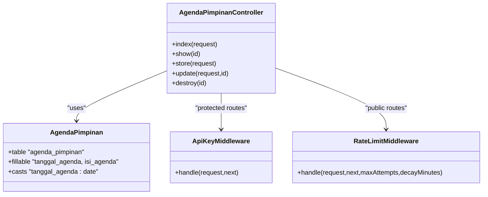
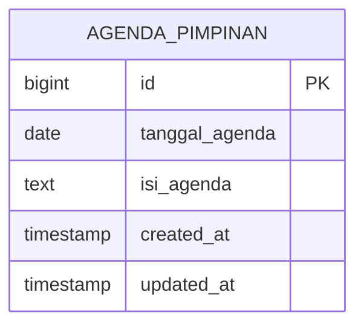

# Agenda Pimpinan (Leadership Schedules)

<cite>
**Referenced Files in This Document**
- [AgendaPimpinanController.php](file://app/Http/Controllers/AgendaPimpinanController.php)
- [AgendaPimpinan.php](file://app/Models/AgendaPimpinan.php)
- [2026_01_26_000000_create_agenda_pimpinan_table.php](file://database/migrations/2026_01_26_000000_create_agenda_pimpinan_table.php)
- [web.php](file://routes/web.php)
- [ApiKeyMiddleware.php](file://app/Http/Middleware/ApiKeyMiddleware.php)
- [RateLimitMiddleware.php](file://app/Http/Middleware/RateLimitMiddleware.php)
- [AgendaSeeder.php](file://database/seeders/AgendaSeeder.php)
</cite>

## Table of Contents
1. [Introduction](#introduction)
2. [Project Structure](#project-structure)
3. [Core Components](#core-components)
4. [Architecture Overview](#architecture-overview)
5. [Detailed Component Analysis](#detailed-component-analysis)
6. [Dependency Analysis](#dependency-analysis)
7. [Performance Considerations](#performance-considerations)
8. [Troubleshooting Guide](#troubleshooting-guide)
9. [Conclusion](#conclusion)
10. [Appendices](#appendices)

## Introduction
This document provides comprehensive API documentation for the Agenda Pimpinan (Leadership Schedules) module. It covers HTTP GET endpoints for listing agendas, retrieving individual agenda items, and date-based filtering. It specifies URL patterns, query parameters, response schemas, pagination settings, standardized response format, data validation rules, error handling, and practical curl examples for common scenarios such as meeting schedule checking, agenda item verification, and leadership availability tracking.

## Project Structure
The Agenda Pimpinan module is implemented as part of a Laravel Lumen application. The relevant components include:
- Route definitions for public and protected endpoints
- Controller logic for listing, retrieving, and managing agendas
- Eloquent model with date casting
- Database migration defining the agenda_pimpinan table
- Middleware for API key authentication and rate limiting
- Sample data seeding for demonstration

**Diagram sources**
- [web.php:29-31](file://routes/web.php#L29-L31)
- [AgendaPimpinanController.php:9-163](file://app/Http/Controllers/AgendaPimpinanController.php#L9-L163)
- [AgendaPimpinan.php:7-34](file://app/Models/AgendaPimpinan.php#L7-L34)
- [2026_01_26_000000_create_agenda_pimpinan_table.php:13-17](file://database/migrations/2026_01_26_000000_create_agenda_pimpinan_table.php#L13-L17)
- [ApiKeyMiddleware.php:14-39](file://app/Http/Middleware/ApiKeyMiddleware.php#L14-L39)
- [RateLimitMiddleware.php:15-39](file://app/Http/Middleware/RateLimitMiddleware.php#L15-L39)

**Section sources**
- [web.php:29-31](file://routes/web.php#L29-L31)
- [AgendaPimpinanController.php:9-163](file://app/Http/Controllers/AgendaPimpinanController.php#L9-L163)
- [AgendaPimpinan.php:7-34](file://app/Models/AgendaPimpinan.php#L7-L34)
- [2026_01_26_000000_create_agenda_pimpinan_table.php:13-17](file://database/migrations/2026_01_26_000000_create_agenda_pimpinan_table.php#L13-L17)
- [ApiKeyMiddleware.php:14-39](file://app/Http/Middleware/ApiKeyMiddleware.php#L14-L39)
- [RateLimitMiddleware.php:15-39](file://app/Http/Middleware/RateLimitMiddleware.php#L15-L39)

## Core Components
- Routes: Public GET endpoints for listing agendas and retrieving a specific agenda item are defined under the api prefix with throttling middleware.
- Controller: Implements index (listing with optional date filters), show (single item retrieval), and validation logic for creation/update.
- Model: Defines fillable attributes and date casting for tanggal_agenda.
- Middleware: ApiKeyMiddleware enforces API key authentication for protected routes; RateLimitMiddleware limits requests per minute.
- Database: agenda_pimpinan table stores tanggal_agenda and isi_agenda with timestamps.

**Section sources**
- [web.php:29-31](file://routes/web.php#L29-L31)
- [AgendaPimpinanController.php:17-104](file://app/Http/Controllers/AgendaPimpinanController.php#L17-L104)
- [AgendaPimpinan.php:21-33](file://app/Models/AgendaPimpinan.php#L21-L33)
- [2026_01_26_000000_create_agenda_pimpinan_table.php:13-17](file://database/migrations/2026_01_26_000000_create_agenda_pimpinan_table.php#L13-L17)
- [ApiKeyMiddleware.php:14-39](file://app/Http/Middleware/ApiKeyMiddleware.php#L14-L39)
- [RateLimitMiddleware.php:15-39](file://app/Http/Middleware/RateLimitMiddleware.php#L15-L39)

## Architecture Overview
The API follows a layered architecture:
- HTTP Layer: Routes define endpoint URLs and apply middleware.
- Controller Layer: Handles request parsing, validation, and response formatting.
- Model Layer: Encapsulates data access and casting.
- Persistence Layer: Database table schema for agenda_pimpinan.

**Diagram sources**
- [web.php:29-31](file://routes/web.php#L29-L31)
- [AgendaPimpinanController.php:17-58](file://app/Http/Controllers/AgendaPimpinanController.php#L17-L58)
- [AgendaPimpinan.php:7-34](file://app/Models/AgendaPimpinan.php#L7-L34)

## Detailed Component Analysis

### Endpoint Definitions
- Base URL: api
- Public GET endpoints:
  - List agendas: GET /api/agenda
  - Get agenda by ID: GET /api/agenda/{id}

Protected endpoints (require API key):
- Create agenda: POST /api/agenda
- Update agenda: PUT /api/agenda/{id}
- Delete agenda: DELETE /api/agenda/{id}

Notes:
- The controller’s index method does not implement month/year filters via query parameters; however, the route definitions include placeholders for year-based filtering in other modules. For Agenda Pimpinan, only the ID-based show endpoint is defined in routes. The index method supports per_page and all records via per_page=all.

**Section sources**
- [web.php:29-31](file://routes/web.php#L29-L31)
- [web.php:98-102](file://routes/web.php#L98-L102)
- [AgendaPimpinanController.php:17-58](file://app/Http/Controllers/AgendaPimpinanController.php#L17-L58)

### Query Parameters and Filtering
- per_page: Controls pagination size; accepts numeric values or the literal string "all" to disable pagination and return all records.
- bulan: Month filter (not implemented in current index method).
- tahun: Year filter (not implemented in current index method).

Current behavior:
- The index method applies orderBy('tanggal_agenda', 'desc').
- If per_page=all, the response omits pagination metadata and returns total equal to count.

Planned behavior (based on route definitions for other modules):
- Year filter via tahun parameter is commonly used in other modules.
- Month filter via bulan parameter is commonly used in other modules.

Recommendation:
- Implement month/year filters in the index method to align with route definitions and common usage patterns.

**Section sources**
- [AgendaPimpinanController.php:17-58](file://app/Http/Controllers/AgendaPimpinanController.php#L17-L58)
- [web.php:29-31](file://routes/web.php#L29-L31)

### Response Format
Standardized response envelope:
- status: success or error
- data: array or object depending on endpoint
- Pagination fields (when paginated):
  - total
  - current_page
  - last_page
  - per_page

Success responses:
- GET /api/agenda: returns paginated data envelope
- GET /api/agenda/{id}: returns single agenda object
- POST/PUT /api/agenda: returns success message and created/updated agenda object
- DELETE /api/agenda: returns success message

Error responses:
- Validation errors (422 Unprocessable Entity): includes status and errors
- Not found (404 Not Found): includes status and message
- Unauthorized (401 Unauthorized): API key missing or invalid
- Too Many Requests (429 Too Many Requests): rate limit exceeded

Headers:
- X-RateLimit-Limit and X-RateLimit-Remaining are included in responses when rate limiting is active.

**Section sources**
- [AgendaPimpinanController.php:37-57](file://app/Http/Controllers/AgendaPimpinanController.php#L37-L57)
- [AgendaPimpinanController.php:95-104](file://app/Http/Controllers/AgendaPimpinanController.php#L95-L104)
- [AgendaPimpinanController.php:68-86](file://app/Http/Controllers/AgendaPimpinanController.php#L68-L86)
- [AgendaPimpinanController.php:113-140](file://app/Http/Controllers/AgendaPimpinanController.php#L113-L140)
- [AgendaPimpinanController.php:148-162](file://app/Http/Controllers/AgendaPimpinanController.php#L148-L162)
- [ApiKeyMiddleware.php:28-36](file://app/Http/Middleware/ApiKeyMiddleware.php#L28-L36)
- [RateLimitMiddleware.php:22-39](file://app/Http/Middleware/RateLimitMiddleware.php#L22-L39)

### Data Validation Rules
- Required fields:
  - tanggal_agenda: required, date
  - isi_agenda: required, string
- Update validation:
  - Both fields are optional but if present, they must satisfy the same rules.

Validation failures return a 422 response with an errors object containing field-level messages.

**Section sources**
- [AgendaPimpinanController.php:68-78](file://app/Http/Controllers/AgendaPimpinanController.php#L68-L78)
- [AgendaPimpinanController.php:121-131](file://app/Http/Controllers/AgendaPimpinanController.php#L121-L131)

### Error Handling
- Data not found: 404 with status and message
- Validation errors: 422 with status and errors
- Unauthorized: 401 with message
- Rate limit exceeded: 429 with message and Retry-After header

**Section sources**
- [AgendaPimpinanController.php:99-101](file://app/Http/Controllers/AgendaPimpinanController.php#L99-L101)
- [AgendaPimpinanController.php:117-119](file://app/Http/Controllers/AgendaPimpinanController.php#L117-L119)
- [AgendaPimpinanController.php:152-154](file://app/Http/Controllers/AgendaPimpinanController.php#L152-L154)
- [ApiKeyMiddleware.php:28-36](file://app/Http/Middleware/ApiKeyMiddleware.php#L28-L36)
- [RateLimitMiddleware.php:22-28](file://app/Http/Middleware/RateLimitMiddleware.php#L22-L28)

### Practical Usage Examples

#### List Agendas
- Purpose: Retrieve paginated list of agendas sorted by latest date first.
- URL: GET /api/agenda
- Query parameters:
  - per_page: integer or "all"
  - tahun: year filter (not currently implemented in index)
  - bulan: month filter (not currently implemented in index)

Example:
curl -s "https://web-api.pa-penajam.go.id/api/agenda?per_page=5"

Response envelope:
{
  "status": "success",
  "data": [...],
  "total": 123,
  "current_page": 1,
  "last_page": 25,
  "per_page": 5
}

#### Retrieve Single Agenda Item
- Purpose: Fetch a specific agenda by ID.
- URL: GET /api/agenda/{id}

Example:
curl -s "https://web-api.pa-penajam.go.id/api/agenda/123"

Response:
{
  "status": "success",
  "data": {
    "id": 123,
    "tanggal_agenda": "2025-10-22",
    "isi_agenda": "Rabu, 22 Oktober 2025, Telah dilaksanakan...",
    "created_at": "2025-10-23T09:00:00Z",
    "updated_at": "2025-10-23T09:00:00Z"
  }
}

#### Schedule Filtering (Conceptual)
- Purpose: Filter agendas by year and/or month.
- URL: GET /api/agenda?tahun=YYYY&bulan=MM
- Note: Current index method does not implement these filters; they are placeholders in route definitions for other modules.

Recommended implementation:
- Add whereMonth('tanggal_agenda', $bulan) and whereYear('tanggal_agenda', $tahun) to the query builder in index.

#### Create Agenda (Protected)
- Purpose: Add a new agenda item.
- URL: POST /api/agenda
- Headers: X-API-Key: YOUR_API_KEY
- Body (application/json):
  - tanggal_agenda: required, date
  - isi_agenda: required, string

Example:
curl -s -X POST "https://web-api.pa-penajam.go.id/api/agenda" \
  -H "X-API-Key: YOUR_API_KEY" \
  -H "Content-Type: application/json" \
  -d '{"tanggal_agenda":"2025-10-25","isi_agenda":"New agenda item"}'

Response:
{
  "status": "success",
  "message": "Agenda berhasil ditambahkan",
  "data": { ... }
}

#### Update Agenda (Protected)
- Purpose: Modify an existing agenda item.
- URL: PUT /api/agenda/{id}
- Headers: X-API-Key: YOUR_API_KEY
- Body (application/json):
  - tanggal_agenda: optional, date (if provided)
  - isi_agenda: optional, string (if provided)

Example:
curl -s -X PUT "https://web-api.pa-penajam.go.id/api/agenda/123" \
  -H "X-API-Key: YOUR_API_KEY" \
  -H "Content-Type: application/json" \
  -d '{"isi_agenda":"Updated agenda content"}'

Response:
{
  "status": "success",
  "message": "Agenda berhasil diperbarui",
  "data": { ... }
}

#### Delete Agenda (Protected)
- Purpose: Remove an agenda item.
- URL: DELETE /api/agenda/{id}
- Headers: X-API-Key: YOUR_API_KEY

Example:
curl -s -X DELETE "https://web-api.pa-penajam.go.id/api/agenda/123" \
  -H "X-API-Key: YOUR_API_KEY"

Response:
{
  "status": "success",
  "message": "Agenda berhasil dihapus"
}

### Common Scenarios

#### Meeting Schedule Checking
- Use GET /api/agenda with per_page to retrieve upcoming meetings.
- Optionally filter by tahun and bulan if implemented.

#### Agenda Item Verification
- Use GET /api/agenda/{id} to verify a specific agenda item exists and inspect details.

#### Leadership Availability Tracking
- Use GET /api/agenda to list scheduled activities and infer availability windows.
- Combine with external calendar systems if needed.

## Dependency Analysis
- Routes depend on AgendaPimpinanController methods.
- Controller depends on AgendaPimpinan model for data access.
- Middleware applies to protected routes for authentication and rate limiting.
- Database migration defines agenda_pimpinan table schema.

**Diagram sources**
- [AgendaPimpinanController.php:9-163](file://app/Http/Controllers/AgendaPimpinanController.php#L9-L163)
- [AgendaPimpinan.php:14-33](file://app/Models/AgendaPimpinan.php#L14-L33)
- [ApiKeyMiddleware.php:14-39](file://app/Http/Middleware/ApiKeyMiddleware.php#L14-L39)
- [RateLimitMiddleware.php:15-39](file://app/Http/Middleware/RateLimitMiddleware.php#L15-L39)

**Section sources**
- [AgendaPimpinanController.php:9-163](file://app/Http/Controllers/AgendaPimpinanController.php#L9-L163)
- [AgendaPimpinan.php:14-33](file://app/Models/AgendaPimpinan.php#L14-L33)
- [ApiKeyMiddleware.php:14-39](file://app/Http/Middleware/ApiKeyMiddleware.php#L14-L39)
- [RateLimitMiddleware.php:15-39](file://app/Http/Middleware/RateLimitMiddleware.php#L15-L39)

## Performance Considerations
- Pagination: Use per_page to control payload size; avoid per_page=all for large datasets.
- Sorting: Default descending order by tanggal_agenda ensures recent items appear first.
- Indexing: Consider adding database indexes on tanggal_agenda for improved filtering performance.
- Rate limiting: Public endpoints are throttled; protected endpoints require API key plus throttling.

## Troubleshooting Guide
- 404 Not Found: Verify the agenda ID exists.
- 422 Unprocessable Entity: Check required fields and date format.
- 401 Unauthorized: Ensure X-API-Key header is present and correct.
- 429 Too Many Requests: Respect rate limit; wait for Retry-After seconds.

**Section sources**
- [AgendaPimpinanController.php:99-101](file://app/Http/Controllers/AgendaPimpinanController.php#L99-L101)
- [AgendaPimpinanController.php:73-78](file://app/Http/Controllers/AgendaPimpinanController.php#L73-L78)
- [ApiKeyMiddleware.php:28-36](file://app/Http/Middleware/ApiKeyMiddleware.php#L28-L36)
- [RateLimitMiddleware.php:22-28](file://app/Http/Middleware/RateLimitMiddleware.php#L22-L28)

## Conclusion
The Agenda Pimpinan module provides a straightforward API for listing and retrieving leadership schedules. While the current index method does not implement month/year filters, the route definitions indicate support for such features. Implementing the filters and enhancing documentation will improve usability for meeting schedule checking, agenda verification, and leadership availability tracking.

## Appendices

### Data Model

**Diagram sources**
- [2026_01_26_000000_create_agenda_pimpinan_table.php:13-17](file://database/migrations/2026_01_26_000000_create_agenda_pimpinan_table.php#L13-L17)

### Example Data Seed
Sample entries demonstrate date formats and agenda content structure.

**Section sources**
- [AgendaSeeder.php:65-142](file://database/seeders/AgendaSeeder.php#L65-L142)