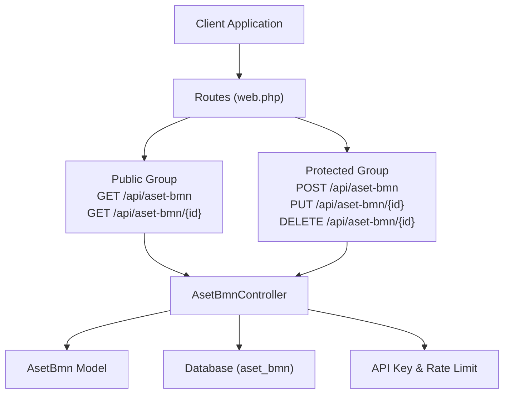
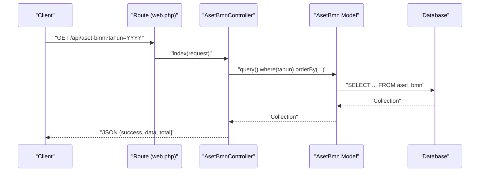
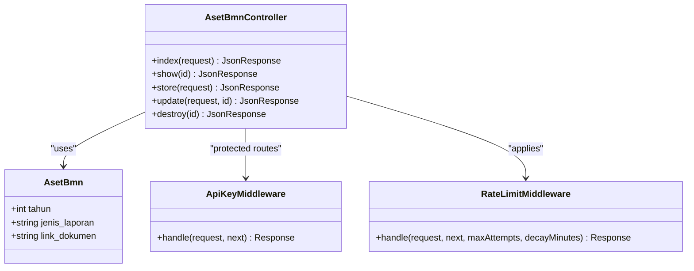

# Aset BMN (State Property)

<cite>
**Referenced Files in This Document**
- [AsetBmnController.php](file://app/Http/Controllers/AsetBmnController.php)
- [AsetBmn.php](file://app/Models/AsetBmn.php)
- [web.php](file://routes/web.php)
- [ApiKeyMiddleware.php](file://app/Http/Middleware/ApiKeyMiddleware.php)
- [RateLimitMiddleware.php](file://app/Http/Middleware/RateLimitMiddleware.php)
- [Controller.php](file://app/Http/Controllers/Controller.php)
- [AsetBmnSeeder.php](file://database/seeders/AsetBmnSeeder.php)
- [2026_02_26_000000_create_aset_bmn_table.php](file://database/migrations/2026_02_26_000000_create_aset_bmn_table.php)
- [joomla-integration-aset-bmn.html](file://docs/joomla-integration-aset-bmn.html)
</cite>

## Table of Contents
1. [Introduction](#introduction)
2. [Project Structure](#project-structure)
3. [Core Components](#core-components)
4. [Architecture Overview](#architecture-overview)
5. [Detailed Component Analysis](#detailed-component-analysis)
6. [Dependency Analysis](#dependency-analysis)
7. [Performance Considerations](#performance-considerations)
8. [Troubleshooting Guide](#troubleshooting-guide)
9. [Conclusion](#conclusion)
10. [Appendices](#appendices)

## Introduction
This document provides comprehensive API documentation for the Aset BMN (State Property) module, which manages government asset reporting and property tracking. It covers HTTP GET endpoints for listing assets, retrieving individual records, and classification-based filtering. The documentation specifies URL patterns, query parameters, response schemas, pagination settings, standardized JSON response format, data validation rules, error handling for asset identifiers, and practical curl examples for common use cases such as asset inventory and government asset tracking across different report classifications.

## Project Structure
The Aset BMN module is implemented as part of a Lumen-based API server. Key components include:
- Route definitions under the API namespace with public and protected groups
- Controller logic for listing, retrieving, and managing Aset BMN records
- Eloquent model defining the persisted attributes and casting
- Middleware for API key validation and rate limiting
- Database migration defining the table schema and constraints
- Seeder providing initial dataset for demonstration and testing



**Diagram sources**
- [web.php:46-48](file://routes/web.php#L46-L48)
- [web.php:125-128](file://routes/web.php#L125-L128)
- [AsetBmnController.php:9-166](file://app/Http/Controllers/AsetBmnController.php#L9-L166)
- [AsetBmn.php:7-20](file://app/Models/AsetBmn.php#L7-L20)

**Section sources**
- [web.php:13-76](file://routes/web.php#L13-L76)
- [web.php:78-164](file://routes/web.php#L78-L164)

## Core Components
- HTTP GET endpoints:
  - List all Aset BMN entries: GET /api/aset-bmn
  - Retrieve a single Aset BMN entry by ID: GET /api/aset-bmn/{id}
- Query parameters:
  - tahun (optional integer): filters entries by fiscal year
- Response format:
  - Standardized JSON envelope with success flag, data payload, and total count
- Validation rules:
  - tahun must be an integer within a reasonable range
  - Allowed fields for creation/update include tahun, jenis_laporan, and link_dokumen
- Error handling:
  - Not found errors return 404 with a message
  - Validation errors return 422 with a message
  - Unauthorized and server configuration errors for protected routes
  - Rate limiting returns 429 with retry-after guidance

**Section sources**
- [AsetBmnController.php:32-66](file://app/Http/Controllers/AsetBmnController.php#L32-L66)
- [AsetBmnController.php:71-105](file://app/Http/Controllers/AsetBmnController.php#L71-L105)
- [AsetBmnController.php:110-150](file://app/Http/Controllers/AsetBmnController.php#L110-L150)
- [AsetBmnController.php:155-163](file://app/Http/Controllers/AsetBmnController.php#L155-L163)
- [AsetBmn.php:11-19](file://app/Models/AsetBmn.php#L11-L19)

## Architecture Overview
The Aset BMN API follows a layered architecture:
- Routing layer defines endpoint contracts and applies middleware
- Controller layer handles request parsing, validation, and response formatting
- Model layer encapsulates persistence and attribute casting
- Middleware layer enforces API key authentication and rate limits



**Diagram sources**
- [web.php:46-48](file://routes/web.php#L46-L48)
- [AsetBmnController.php:32-54](file://app/Http/Controllers/AsetBmnController.php#L32-L54)
- [AsetBmn.php:7-20](file://app/Models/AsetBmn.php#L7-L20)

## Detailed Component Analysis

### Endpoint Definitions
- Base URL: /api/aset-bmn
- Public endpoints:
  - GET /api/aset-bmn
    - Purpose: List all Aset BMN entries with optional year filter
    - Query parameters:
      - tahun (optional): integer year to filter results
    - Response: JSON envelope containing success flag, data array, and total count
  - GET /api/aset-bmn/{id}
    - Purpose: Retrieve a single Aset BMN entry by numeric ID
    - Path parameters:
      - id: numeric identifier
    - Response: JSON envelope containing success flag and data object
- Protected endpoints:
  - POST /api/aset-bmn
    - Purpose: Create a new Aset BMN entry
    - Request body fields:
      - tahun (required): integer year
      - jenis_laporan (required): one of the predefined report types
      - file_dokumen (optional): uploaded document
    - Response: JSON envelope with created item
  - PUT /api/aset-bmn/{id}
    - Purpose: Update an existing Aset BMN entry
    - Path parameters:
      - id: numeric identifier
    - Request body fields:
      - tahun (required): integer year
      - jenis_laporan (required): one of the predefined report types
      - file_dokumen (optional): uploaded document
    - Response: JSON envelope with updated item
  - DELETE /api/aset-bmn/{id}
    - Purpose: Delete an Aset BMN entry
    - Path parameters:
      - id: numeric identifier
    - Response: JSON envelope with success message

**Section sources**
- [web.php:46-48](file://routes/web.php#L46-L48)
- [web.php:125-128](file://routes/web.php#L125-L128)
- [AsetBmnController.php:32-66](file://app/Http/Controllers/AsetBmnController.php#L32-L66)
- [AsetBmnController.php:71-105](file://app/Http/Controllers/AsetBmnController.php#L71-L105)
- [AsetBmnController.php:110-150](file://app/Http/Controllers/AsetBmnController.php#L110-L150)
- [AsetBmnController.php:155-163](file://app/Http/Controllers/AsetBmnController.php#L155-L163)

### Data Model and Schema
The Aset BMN entity persists the following attributes:
- tahun: integer year
- jenis_laporan: string report type
- link_dokumen: text URL to document (nullable)
- timestamps: created_at and updated_at

Constraints and indexing:
- Unique constraint on (tahun, jenis_laporan)
- Index on tahun for efficient filtering

Validation rules enforced by the controller:
- tahun: required, integer, min 2000, max 2100
- jenis_laporan: required, must be one of the predefined report types
- file_dokumen: optional, must be a file with allowed MIME types and size limit

**Section sources**
- [AsetBmn.php:11-19](file://app/Models/AsetBmn.php#L11-L19)
- [2026_02_26_000000_create_aset_bmn_table.php:14-22](file://database/migrations/2026_02_26_000000_create_aset_bmn_table.php#L14-L22)
- [AsetBmnController.php:73-77](file://app/Http/Controllers/AsetBmnController.php#L73-L77)
- [AsetBmnController.php:117-121](file://app/Http/Controllers/AsetBmnController.php#L117-L121)

### Response Format and Pagination
Standardized JSON response envelope:
- success: boolean indicating operation outcome
- data: array for list endpoints, object for single record endpoints
- total: integer count of items returned (list endpoints)

Pagination:
- No built-in pagination is implemented in the controller
- Results are returned as a complete collection
- Clients should implement client-side pagination if needed

Ordering:
- Results are ordered by tahun descending
- Within a year, results are ordered by a predefined sequence of report types

**Section sources**
- [AsetBmnController.php:49-53](file://app/Http/Controllers/AsetBmnController.php#L49-L53)
- [AsetBmnController.php:45-47](file://app/Http/Controllers/AsetBmnController.php#L45-L47)

### Error Handling
Common error scenarios:
- Not found (404): Returned when a requested ID does not exist
- Validation error (422): Returned for invalid input or duplicate entries
- Unauthorized (401): Returned when API key is missing or invalid
- Server configuration error (500): Returned when API key is not configured
- Too many requests (429): Returned when rate limit is exceeded

Headers:
- X-RateLimit-Limit and X-RateLimit-Remaining are included in responses

**Section sources**
- [AsetBmnController.php:62-65](file://app/Http/Controllers/AsetBmnController.php#L62-L65)
- [AsetBmnController.php:87-91](file://app/Http/Controllers/AsetBmnController.php#L87-L91)
- [AsetBmnController.php:132-136](file://app/Http/Controllers/AsetBmnController.php#L132-L136)
- [ApiKeyMiddleware.php:28-36](file://app/Http/Middleware/ApiKeyMiddleware.php#L28-L36)
- [ApiKeyMiddleware.php:20-25](file://app/Http/Middleware/ApiKeyMiddleware.php#L20-L25)
- [RateLimitMiddleware.php:22-28](file://app/Http/Middleware/RateLimitMiddleware.php#L22-L28)
- [RateLimitMiddleware.php:36-38](file://app/Http/Middleware/RateLimitMiddleware.php#L36-L38)

### Security and Middleware
- API Key Middleware:
  - Validates X-API-Key header against environment configuration
  - Uses timing-safe comparison to prevent timing attacks
  - Delays response to mitigate brute force attempts
- Rate Limit Middleware:
  - Limits requests per IP address
  - Adds rate limit headers to responses
  - Returns 429 with retry-after guidance when exceeded

**Section sources**
- [ApiKeyMiddleware.php:14-39](file://app/Http/Middleware/ApiKeyMiddleware.php#L14-L39)
- [RateLimitMiddleware.php:15-39](file://app/Http/Middleware/RateLimitMiddleware.php#L15-L39)

### Data Validation Rules
- tahun: required, integer, min 2000, max 2100
- jenis_laporan: required, must match one of the predefined report types
- file_dokumen: optional, must be a file with allowed MIME types and size limit

Allowed report types:
- Laporan Posisi BMN Di Neraca - Semester I
- Laporan Posisi BMN Di Neraca - Semester II
- Laporan Posisi BMN Di Neraca - Tahunan
- Laporan Barang Kuasa Pengguna - Persediaan - Semester I
- Laporan Barang Kuasa Pengguna - Persediaan - Semester II
- Laporan Kondisi Barang - Tahunan

**Section sources**
- [AsetBmnController.php:14-21](file://app/Http/Controllers/AsetBmnController.php#L14-L21)
- [AsetBmnController.php:73-77](file://app/Http/Controllers/AsetBmnController.php#L73-L77)
- [AsetBmnController.php:117-121](file://app/Http/Controllers/AsetBmnController.php#L117-L121)

### Curl Examples
Below are concrete curl examples demonstrating common use cases. Replace the base URL with your deployment endpoint.

- List all Aset BMN entries:
  ```bash
  curl -s "https://your-domain/api/aset-bmn"
  ```

- Filter by year (e.g., 2025):
  ```bash
  curl -s "https://your-domain/api/aset-bmn?tahun=2025"
  ```

- Retrieve a single Aset BMN entry by ID:
  ```bash
  curl -s "https://your-domain/api/aset-bmn/1"
  ```

- Asset inventory use case:
  - Use the list endpoint to retrieve all entries for a given year
  - Iterate through the returned data to build an inventory report

- Government asset tracking across classifications:
  - Use the list endpoint to retrieve all report types for a specific year
  - Group results by jenis_laporan to track different classifications

- Property verification:
  - Use the single-record endpoint to verify a specific asset by ID
  - Confirm tahun and jenis_laporan match expected values

**Section sources**
- [web.php:46-48](file://routes/web.php#L46-L48)
- [AsetBmnController.php:32-66](file://app/Http/Controllers/AsetBmnController.php#L32-L66)

## Dependency Analysis
The Aset BMN module depends on:
- Routes: Define endpoint contracts and apply middleware
- Controller: Orchestrates request handling, validation, and response formatting
- Model: Encapsulates persistence and attribute casting
- Middleware: Enforces API key and rate limiting
- Database: Provides schema and constraints for data integrity



**Diagram sources**
- [AsetBmnController.php:9-166](file://app/Http/Controllers/AsetBmnController.php#L9-L166)
- [AsetBmn.php:7-20](file://app/Models/AsetBmn.php#L7-L20)
- [ApiKeyMiddleware.php:8-39](file://app/Http/Middleware/ApiKeyMiddleware.php#L8-L39)
- [RateLimitMiddleware.php:9-39](file://app/Http/Middleware/RateLimitMiddleware.php#L9-L39)

**Section sources**
- [web.php:46-48](file://routes/web.php#L46-L48)
- [web.php:125-128](file://routes/web.php#L125-L128)
- [AsetBmnController.php:9-166](file://app/Http/Controllers/AsetBmnController.php#L9-L166)
- [AsetBmn.php:7-20](file://app/Models/AsetBmn.php#L7-L20)

## Performance Considerations
- Filtering by tahun leverages an indexed column for efficient queries
- Ordering by tahun descending and then by predefined report type sequence ensures predictable sorting
- No pagination is implemented; clients should consider client-side pagination for large datasets
- Rate limiting protects the API from abuse; consider enabling caching for frequently accessed endpoints

[No sources needed since this section provides general guidance]

## Troubleshooting Guide
- 404 Not Found:
  - Verify the ID exists in the database
  - Ensure the route path is correct
- 422 Unprocessable Entity:
  - Check tahun is within the allowed range
  - Ensure jenis_laporan matches one of the predefined types
  - Validate file_dokumen MIME type and size
- 401 Unauthorized:
  - Confirm X-API-Key header is present and correct
  - Verify API key is configured in environment
- 500 Server Configuration Error:
  - Check API key environment variable is set
- 429 Too Many Requests:
  - Respect the rate limit and retry after the indicated interval
  - Consider adding exponential backoff in client implementations

**Section sources**
- [AsetBmnController.php:62-65](file://app/Http/Controllers/AsetBmnController.php#L62-L65)
- [AsetBmnController.php:87-91](file://app/Http/Controllers/AsetBmnController.php#L87-L91)
- [AsetBmnController.php:132-136](file://app/Http/Controllers/AsetBmnController.php#L132-L136)
- [ApiKeyMiddleware.php:28-36](file://app/Http/Middleware/ApiKeyMiddleware.php#L28-L36)
- [ApiKeyMiddleware.php:20-25](file://app/Http/Middleware/ApiKeyMiddleware.php#L20-L25)
- [RateLimitMiddleware.php:22-28](file://app/Http/Middleware/RateLimitMiddleware.php#L22-L28)

## Conclusion
The Aset BMN API provides a straightforward interface for government asset management and property tracking. It supports listing entries with optional year filtering, retrieving individual records, and offers a standardized JSON response format. The module enforces strict validation rules, includes robust error handling, and applies security middleware for protection. By leveraging the documented endpoints and examples, developers can integrate asset inventory, property verification, and cross-classification tracking into their applications.

[No sources needed since this section summarizes without analyzing specific files]

## Appendices

### Appendix A: Report Types Reference
Predefined report types used for validation and ordering:
- Laporan Posisi BMN Di Neraca - Semester I
- Laporan Posisi BMN Di Neraca - Semester II
- Laporan Posisi BMN Di Neraca - Tahunan
- Laporan Barang Kuasa Pengguna - Persediaan - Semester I
- Laporan Barang Kuasa Pengguna - Persediaan - Semester II
- Laporan Kondisi Barang - Tahunan

**Section sources**
- [AsetBmnController.php:14-21](file://app/Http/Controllers/AsetBmnController.php#L14-L21)

### Appendix B: Example Dataset
The seeder provides sample data spanning multiple years and report types, demonstrating realistic usage patterns for asset reporting.

**Section sources**
- [AsetBmnSeeder.php:16-88](file://database/seeders/AsetBmnSeeder.php#L16-L88)

### Appendix C: Frontend Integration Example
The documentation page demonstrates how to consume the API to render a categorized view of assets by year and report type.

**Section sources**
- [joomla-integration-aset-bmn.html:171-292](file://docs/joomla-integration-aset-bmn.html#L171-L292)