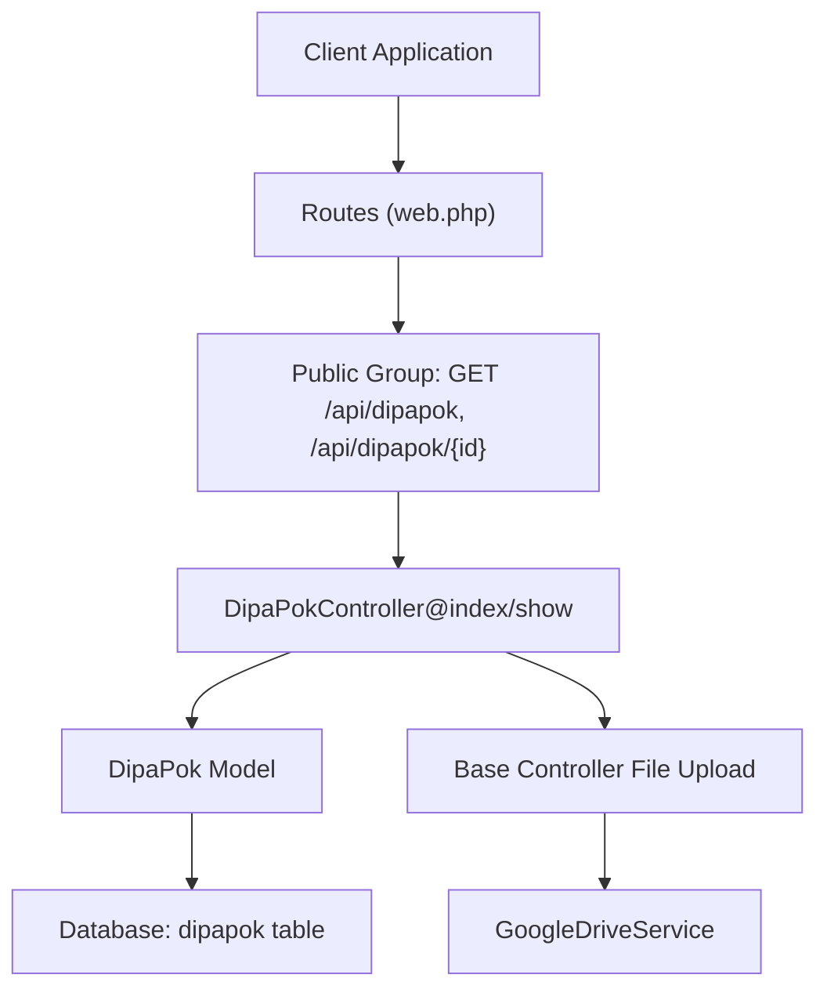
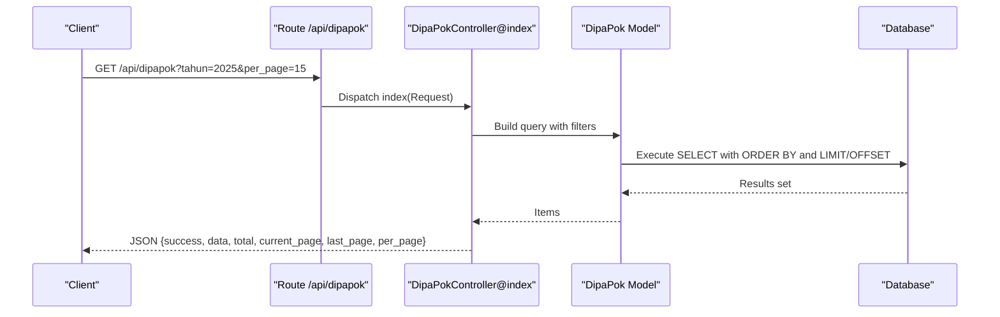
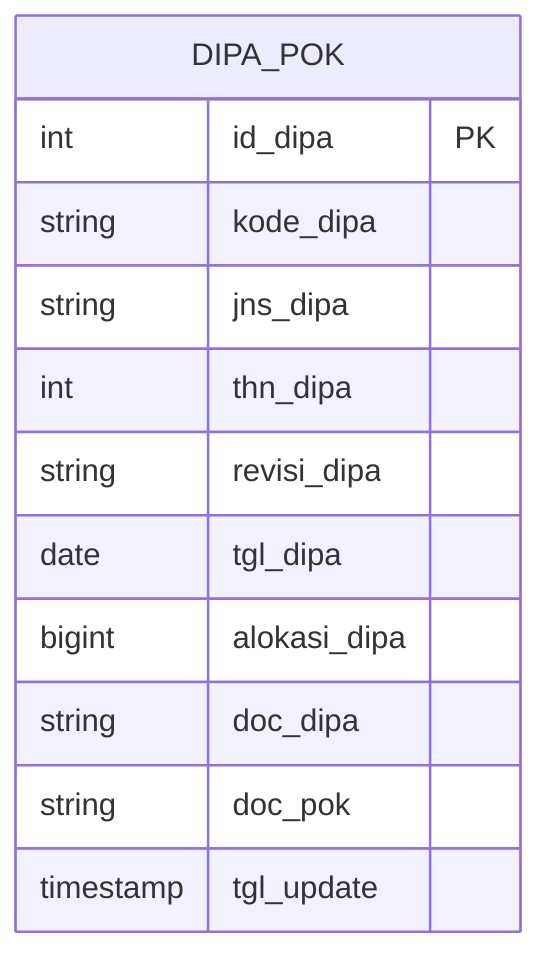
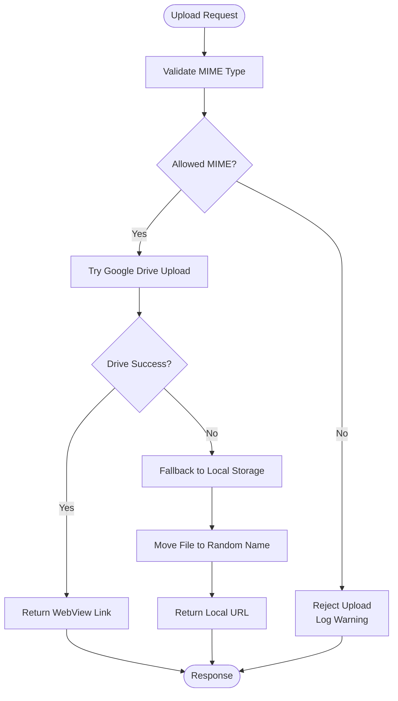
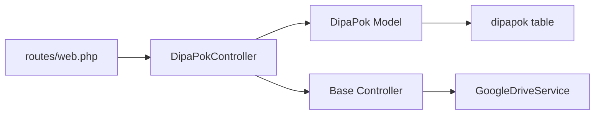

# DIPA Pok (Annual Budget Planning)

<cite>
**Referenced Files in This Document**
- [routes/web.php](file://routes/web.php)
- [app/Http/Controllers/DipaPokController.php](file://app/Http/Controllers/DipaPokController.php)
- [app/Http/Controllers/Controller.php](file://app/Http/Controllers/Controller.php)
- [app/Models/DipaPok.php](file://app/Models/DipaPok.php)
- [database/migrations/2026_02_19_000000_create_dipapok_table.php](file://database/migrations/2026_02_19_000000_create_dipapok_table.php)
- [database/seeders/DipaPokSeeder.php](file://database/seeders/DipaPokSeeder.php)
- [app/Http/Middleware/ApiKeyMiddleware.php](file://app/Http/Middleware/ApiKeyMiddleware.php)
- [app/Http/Middleware/RateLimitMiddleware.php](file://app/Http/Middleware/RateLimitMiddleware.php)
- [app/Services/GoogleDriveService.php](file://app/Services/GoogleDriveService.php)
- [docs/joomla-integration-dipapok.html](file://docs/joomla-integration-dipapok.html)
</cite>

## Table of Contents
1. [Introduction](#introduction)
2. [Project Structure](#project-structure)
3. [Core Components](#core-components)
4. [Architecture Overview](#architecture-overview)
5. [Detailed Component Analysis](#detailed-component-analysis)
6. [Dependency Analysis](#dependency-analysis)
7. [Performance Considerations](#performance-considerations)
8. [Troubleshooting Guide](#troubleshooting-guide)
9. [Conclusion](#conclusion)
10. [Appendices](#appendices)

## Introduction
This document provides comprehensive API documentation for the DIPA Pok (Annual Budget Planning) module. It covers HTTP GET endpoints for listing budget plans, retrieving individual plans, and filtering by planning years. It also documents URL patterns, query parameters, response schemas, pagination, and practical curl examples. The documentation addresses standardized response formats, validation rules, error handling, and common scenarios such as budget forecasting, long-term planning, and financial strategy analysis.

## Project Structure
The DIPA Pok module is implemented as part of a Lumen-based API. The routing exposes public GET endpoints under the api prefix, while write operations are protected by API key and rate limiting middleware. The controller interacts with the DipaPok model backed by the dipapok database table. File uploads leverage Google Drive or local storage via a shared base controller.

**Diagram sources**
- [routes/web.php:42-44](file://routes/web.php#L42-L44)
- [app/Http/Controllers/DipaPokController.php:10-113](file://app/Http/Controllers/DipaPokController.php#L10-L113)
- [app/Models/DipaPok.php:7-42](file://app/Models/DipaPok.php#L7-L42)
- [app/Http/Controllers/Controller.php:40-95](file://app/Http/Controllers/Controller.php#L40-L95)
- [app/Services/GoogleDriveService.php:38-82](file://app/Services/GoogleDriveService.php#L38-L82)

**Section sources**
- [routes/web.php:42-44](file://routes/web.php#L42-L44)
- [app/Http/Controllers/DipaPokController.php:10-113](file://app/Http/Controllers/DipaPokController.php#L10-L113)
- [app/Models/DipaPok.php:7-42](file://app/Models/DipaPok.php#L7-L42)

## Core Components
- Route definitions expose:
  - GET /api/dipapok (list plans)
  - GET /api/dipapok/{id} (retrieve single plan)
- Controller methods:
  - index(Request): filters by year and free-text search, paginates results
  - show($id): retrieves a single plan by ID
- Model attributes:
  - id_dipa, kode_dipa, jns_dipa, thn_dipa, revisi_dipa, tgl_dipa, alokasi_dipa, doc_dipa, doc_pok, tgl_update
- Validation rules:
  - Required fields for write operations include year, revision, type, date, allocation, optional PDF uploads
- Pagination:
  - Default items per page configurable via per_page query parameter

**Section sources**
- [routes/web.php:42-44](file://routes/web.php#L42-L44)
- [app/Http/Controllers/DipaPokController.php:10-113](file://app/Http/Controllers/DipaPokController.php#L10-L113)
- [app/Models/DipaPok.php:15-34](file://app/Models/DipaPok.php#L15-L34)

## Architecture Overview
The DIPA Pok API follows a layered architecture:
- Presentation: HTTP GET endpoints exposed via routes
- Application: Controllers orchestrate queries and responses
- Domain: Eloquent model encapsulates persistence and casting
- Infrastructure: Base controller handles file upload and sanitization; Google Drive service for cloud storage

**Diagram sources**
- [routes/web.php:42-44](file://routes/web.php#L42-L44)
- [app/Http/Controllers/DipaPokController.php:10-39](file://app/Http/Controllers/DipaPokController.php#L10-L39)
- [app/Models/DipaPok.php:7-42](file://app/Models/DipaPok.php#L7-L42)

## Detailed Component Analysis

### Endpoint: List Budget Plans
- Method: GET
- Path: /api/dipapok
- Query parameters:
  - tahun (optional): filter by planning year
  - q (optional): free-text search across jenis and revision fields
  - per_page (optional): items per page (default applied in controller)
- Sorting: descending by year, then by code
- Response schema:
  - success: boolean
  - data: array of plan objects
  - total: integer
  - current_page: integer
  - last_page: integer
  - per_page: integer
- Plan object fields:
  - id (alias of id_dipa)
  - kode_dipa
  - jns_dipa
  - thn_dipa
  - revisi_dipa
  - tgl_dipa
  - alokasi_dipa
  - doc_dipa
  - doc_pok
  - tgl_update

Practical curl example:
- List all plans with pagination:
  - curl "https://web-api.pa-penajam.go.id/api/dipapok?per_page=20"
- Filter by year:
  - curl "https://web-api.pa-penajam.go.id/api/dipapok?tahun=2025"
- Search across jenis and revisi:
  - curl "https://web-api.pa-penajam.go.id/api/dipapok?q=Direktorat"

Validation and error handling:
- Year filter is applied as an equality match on thn_dipa
- Free-text search matches either jenis or revisi fields
- Pagination defaults to 15 items per page if not specified

**Section sources**
- [routes/web.php:42-44](file://routes/web.php#L42-L44)
- [app/Http/Controllers/DipaPokController.php:10-39](file://app/Http/Controllers/DipaPokController.php#L10-L39)
- [app/Models/DipaPok.php:15-34](file://app/Models/DipaPok.php#L15-L34)

### Endpoint: Retrieve Single Budget Plan
- Method: GET
- Path: /api/dipapok/{id}
- Path parameter:
  - id: numeric identifier of the plan
- Response schema:
  - success: boolean
  - data: single plan object (same fields as list endpoint)
- Error handling:
  - Returns 404 with success=false when the plan does not exist

Practical curl example:
- curl "https://web-api.pa-penajam.go.id/api/dipapok/123"

**Section sources**
- [routes/web.php:43-44](file://routes/web.php#L43-L44)
- [app/Http/Controllers/DipaPokController.php:98-113](file://app/Http/Controllers/DipaPokController.php#L98-L113)
- [app/Models/DipaPok.php:15-34](file://app/Models/DipaPok.php#L15-L34)

### Write Operations (Protected)
While the objective focuses on GET endpoints, the module supports write operations under the api key-protected group. These are documented for completeness:
- POST /api/dipapok (create)
- PUT/PATCH /api/dipapok/{id} (update)
- DELETE /api/dipapok/{id} (delete)
- Validation rules include required fields for year, revision, type, date, allocation, and optional PDF uploads
- File upload pipeline supports Google Drive with fallback to local storage

Security middleware:
- API key validation via X-API-Key header
- Rate limiting enforced per IP

**Section sources**
- [routes/web.php:119-123](file://routes/web.php#L119-L123)
- [app/Http/Controllers/DipaPokController.php:41-96](file://app/Http/Controllers/DipaPokController.php#L41-L96)
- [app/Http/Controllers/Controller.php:40-95](file://app/Http/Controllers/Controller.php#L40-L95)
- [app/Http/Middleware/ApiKeyMiddleware.php:14-39](file://app/Http/Middleware/ApiKeyMiddleware.php#L14-L39)
- [app/Http/Middleware/RateLimitMiddleware.php:15-39](file://app/Http/Middleware/RateLimitMiddleware.php#L15-L39)

### Data Model and Persistence
- Table: dipapok
- Primary key: id_dipa
- Index: thn_dipa for efficient year-based queries
- Fillable fields include all plan attributes
- Casts:
  - thn_dipa as integer
  - alokasi_dipa as integer
  - tgl_dipa as date
  - tgl_update as datetime
- Attribute alias: id maps to id_dipa

**Diagram sources**
- [database/migrations/2026_02_19_000000_create_dipapok_table.php:11-24](file://database/migrations/2026_02_19_000000_create_dipapok_table.php#L11-L24)
- [app/Models/DipaPok.php:15-34](file://app/Models/DipaPok.php#L15-L34)

**Section sources**
- [database/migrations/2026_02_19_000000_create_dipapok_table.php:11-24](file://database/migrations/2026_02_19_000000_create_dipapok_table.php#L11-L24)
- [app/Models/DipaPok.php:15-34](file://app/Models/DipaPok.php#L15-L34)

### File Upload Pipeline
- Supported MIME types: PDF, DOC, DOCX, XLS, XLSX, JPEG, PNG
- Priority: Google Drive upload with fallback to local storage
- Generated URLs are stored in doc_dipa and doc_pok fields
- Security measures: MIME type verification, randomized filenames, logging on failure

**Diagram sources**
- [app/Http/Controllers/Controller.php:40-95](file://app/Http/Controllers/Controller.php#L40-L95)
- [app/Services/GoogleDriveService.php:38-82](file://app/Services/GoogleDriveService.php#L38-L82)

**Section sources**
- [app/Http/Controllers/Controller.php:40-95](file://app/Http/Controllers/Controller.php#L40-L95)
- [app/Services/GoogleDriveService.php:38-82](file://app/Services/GoogleDriveService.php#L38-L82)

## Dependency Analysis
- Routes depend on DipaPokController methods
- Controller depends on DipaPok model and base controller for file handling
- Model depends on database schema
- File upload depends on Google Drive service and environment configuration
- Middleware applies rate limiting and API key checks for protected routes

**Diagram sources**
- [routes/web.php:42-44](file://routes/web.php#L42-L44)
- [app/Http/Controllers/DipaPokController.php:10-113](file://app/Http/Controllers/DipaPokController.php#L10-L113)
- [app/Models/DipaPok.php:7-42](file://app/Models/DipaPok.php#L7-L42)
- [app/Http/Controllers/Controller.php:40-95](file://app/Http/Controllers/Controller.php#L40-L95)
- [app/Services/GoogleDriveService.php:38-82](file://app/Services/GoogleDriveService.php#L38-L82)

**Section sources**
- [routes/web.php:42-44](file://routes/web.php#L42-L44)
- [app/Http/Controllers/DipaPokController.php:10-113](file://app/Http/Controllers/DipaPokController.php#L10-L113)
- [app/Models/DipaPok.php:7-42](file://app/Models/DipaPok.php#L7-L42)
- [app/Http/Controllers/Controller.php:40-95](file://app/Http/Controllers/Controller.php#L40-L95)
- [app/Services/GoogleDriveService.php:38-82](file://app/Services/GoogleDriveService.php#L38-L82)

## Performance Considerations
- Index on thn_dipa enables efficient year-based filtering
- Pagination reduces payload size; default 15 items can be adjusted via per_page
- Free-text search uses OR across two fields; consider narrowing search scope for large datasets
- File uploads to Google Drive introduce latency; fallback to local storage ensures availability

## Troubleshooting Guide
Common issues and resolutions:
- Unauthorized access to protected endpoints:
  - Ensure X-API-Key header matches configured API key
  - Verify API key environment variable is set
- Rate limit exceeded:
  - Wait for Retry-After seconds or reduce request frequency
  - Confirm client IP is not being spoofed
- File upload failures:
  - Verify MIME type is allowed
  - Check Google Drive credentials and permissions
  - Review logs for warnings or errors during upload
- Empty or unexpected results:
  - Confirm tahun parameter is a valid integer
  - Narrow q search terms for better precision

**Section sources**
- [app/Http/Middleware/ApiKeyMiddleware.php:14-39](file://app/Http/Middleware/ApiKeyMiddleware.php#L14-L39)
- [app/Http/Middleware/RateLimitMiddleware.php:15-39](file://app/Http/Middleware/RateLimitMiddleware.php#L15-L39)
- [app/Http/Controllers/Controller.php:40-95](file://app/Http/Controllers/Controller.php#L40-L95)

## Conclusion
The DIPA Pok API provides robust GET endpoints for annual budget planning and long-term financial forecasting. It supports year-based filtering, free-text search, and pagination, returning standardized JSON responses with forecast-related fields. The module’s design emphasizes security through API keys and rate limiting, and reliability through cloud-backed file storage with local fallback. These capabilities enable effective budget forecasting, long-term planning, and financial strategy analysis.

## Appendices

### API Reference Summary
- Base URL: https://web-api.pa-penajam.go.id/api
- Public GET endpoints:
  - GET /dipapok
  - GET /dipapok/{id}

Query parameters for GET /dipapok:
- tahun: integer year
- q: free-text search term
- per_page: number of items per page

Response fields:
- success: boolean
- data: array of plan objects
- total: integer
- current_page: integer
- last_page: integer
- per_page: integer

Plan object fields:
- id, kode_dipa, jns_dipa, thn_dipa, revisi_dipa, tgl_dipa, alokasi_dipa, doc_dipa, doc_pok, tgl_update

**Section sources**
- [routes/web.php:42-44](file://routes/web.php#L42-L44)
- [app/Http/Controllers/DipaPokController.php:10-39](file://app/Http/Controllers/DipaPokController.php#L10-L39)
- [app/Models/DipaPok.php:15-34](file://app/Models/DipaPok.php#L15-L34)

### Practical Examples
- List plans:
  - curl "https://web-api.pa-penajam.go.id/api/dipapok?per_page=20"
- Filter by year:
  - curl "https://web-api.pa-penajam.go.id/api/dipapok?tahun=2025"
- Search:
  - curl "https://web-api.pa-penajam.go.id/api/dipapok?q=Direktorat"
- Retrieve single plan:
  - curl "https://web-api.pa-penajam.go.id/api/dipapok/123"

**Section sources**
- [docs/joomla-integration-dipapok.html:186-320](file://docs/joomla-integration-dipapok.html#L186-L320)