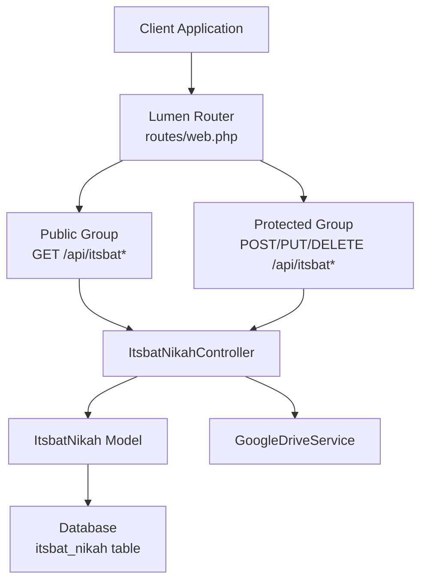
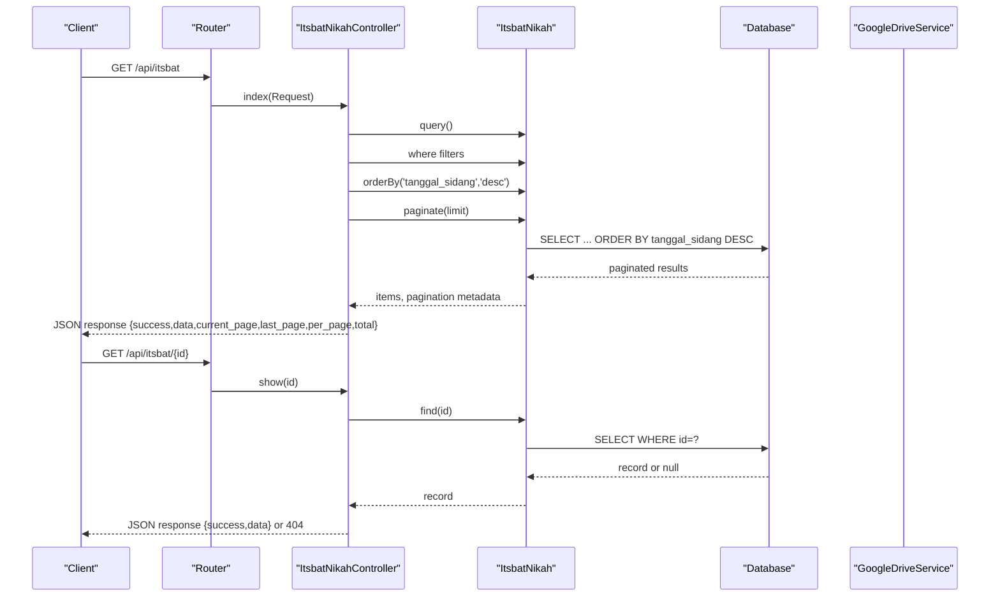
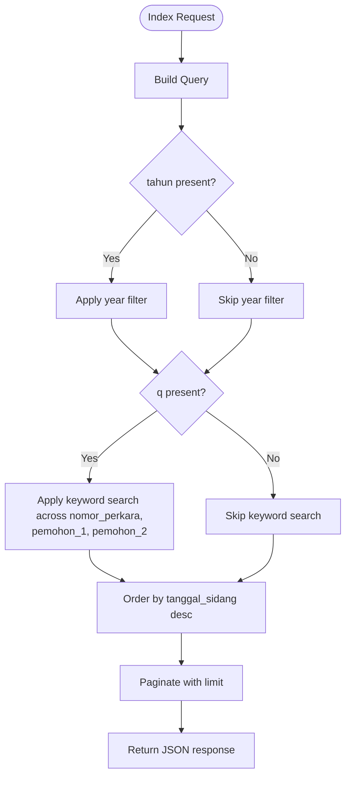
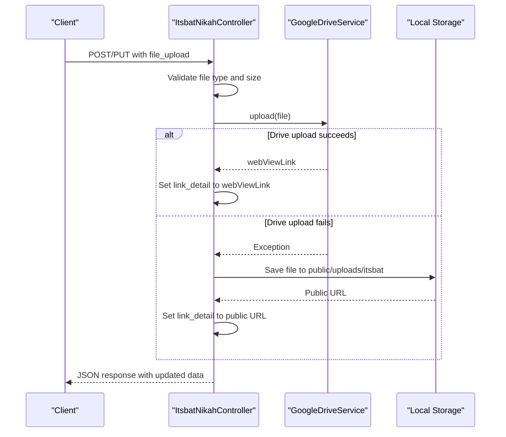
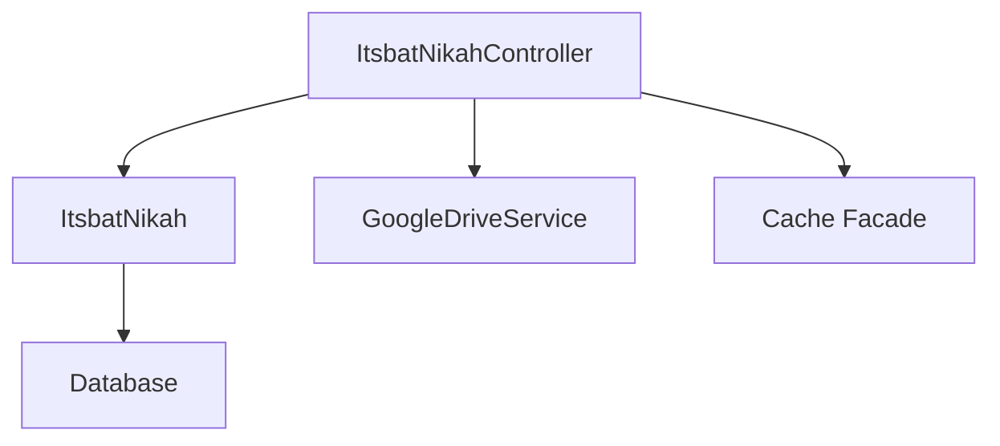
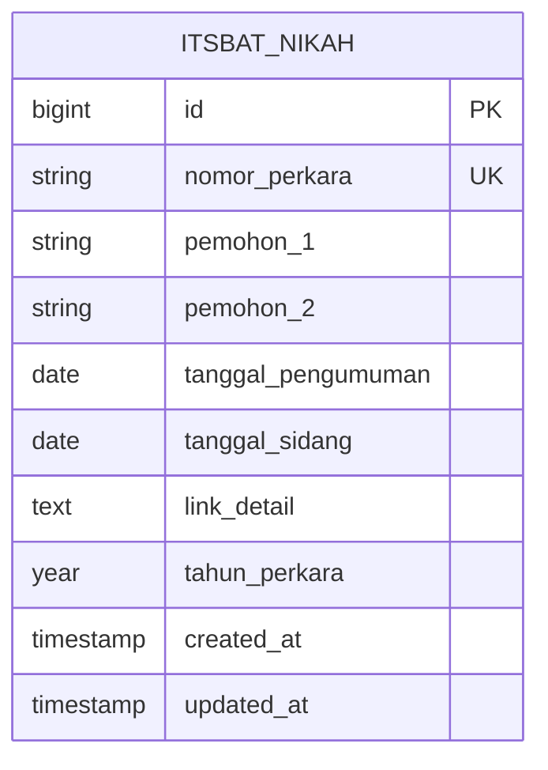

# Itsbat Nikah (Marriage Certificate Processing)

<cite>
**Referenced Files in This Document**
- [ItsbatNikahController.php](file://app/Http/Controllers/ItsbatNikahController.php)
- [ItsbatNikah.php](file://app/Models/ItsbatNikah.php)
- [web.php](file://routes/web.php)
- [GoogleDriveService.php](file://app/Services/GoogleDriveService.php)
- [ApiKeyMiddleware.php](file://app/Http/Middleware/ApiKeyMiddleware.php)
- [RateLimitMiddleware.php](file://app/Http/Middleware/RateLimitMiddleware.php)
- [Handler.php](file://app/Exceptions/Handler.php)
- [create_itsbat_nikah_table.php](file://database/migrations/2026_01_21_000003_create_itsbat_nikah_table.php)
- [ItsbatSeeder.php](file://database/seeders/ItsbatSeeder.php)
- [data_itsbat.json](file://database/seeders/data_itsbat.json)
</cite>

## Table of Contents
1. [Introduction](#introduction)
2. [Project Structure](#project-structure)
3. [Core Components](#core-components)
4. [Architecture Overview](#architecture-overview)
5. [Detailed Component Analysis](#detailed-component-analysis)
6. [Dependency Analysis](#dependency-analysis)
7. [Performance Considerations](#performance-considerations)
8. [Troubleshooting Guide](#troubleshooting-guide)
9. [Conclusion](#conclusion)
10. [Appendices](#appendices)

## Introduction
This document provides comprehensive API documentation for the Itsbat Nikah module responsible for managing marriage certificate records. It covers public endpoints for listing and retrieving marriage certificates, along with protected endpoints for creating, updating, and deleting records. The documentation specifies URL patterns, query parameters, response schemas, pagination, file upload handling, validation rules, error handling, and practical curl examples for common workflows such as certificate listing, individual retrieval, and status checking.

## Project Structure
The Itsbat Nikah module is implemented as part of a Lumen-based API backend. The module consists of:
- A controller that exposes HTTP endpoints for CRUD operations on marriage certificate records
- An Eloquent model representing the itsbat nikah table
- Route definitions under the api prefix with public and protected groups
- Middleware for API key authentication and rate limiting
- A Google Drive service for file uploads
- Database migration and seeders for initial data

**Diagram sources**
- [web.php:20-90](file://routes/web.php#L20-L90)
- [ItsbatNikahController.php:8-226](file://app/Http/Controllers/ItsbatNikahController.php#L8-L226)
- [ItsbatNikah.php:7-25](file://app/Models/ItsbatNikah.php#L7-L25)
- [GoogleDriveService.php:9-117](file://app/Services/GoogleDriveService.php#L9-L117)

**Section sources**
- [web.php:13-90](file://routes/web.php#L13-L90)
- [ItsbatNikahController.php:8-226](file://app/Http/Controllers/ItsbatNikahController.php#L8-L226)
- [ItsbatNikah.php:7-25](file://app/Models/ItsbatNikah.php#L7-L25)

## Core Components
- Controller: Implements index (list), show (retrieve), store (create), update, and destroy methods with validation and file upload handling.
- Model: Defines fillable attributes and date casting for date fields.
- Routes: Exposes public endpoints for listing and retrieving records and protected endpoints for creation, updates, and deletion.
- Middleware: Provides API key authentication and rate limiting for protected routes.
- Google Drive Service: Handles file uploads to Google Drive with fallback to local storage.

**Section sources**
- [ItsbatNikahController.php:10-226](file://app/Http/Controllers/ItsbatNikahController.php#L10-L226)
- [ItsbatNikah.php:11-25](file://app/Models/ItsbatNikah.php#L11-L25)
- [web.php:20-90](file://routes/web.php#L20-L90)
- [GoogleDriveService.php:38-82](file://app/Services/GoogleDriveService.php#L38-L82)

## Architecture Overview
The API follows a layered architecture:
- HTTP Layer: Routes define endpoint URLs and middleware application
- Controller Layer: Handles request validation, business logic, and response formatting
- Persistence Layer: Uses Eloquent ORM to interact with the itsbat_nikah table
- External Integration: Google Drive service for file storage with local fallback

**Diagram sources**
- [web.php:20-22](file://routes/web.php#L20-L22)
- [ItsbatNikahController.php:10-43](file://app/Http/Controllers/ItsbatNikahController.php#L10-L43)
- [ItsbatNikahController.php:119-128](file://app/Http/Controllers/ItsbatNikahController.php#L119-L128)

## Detailed Component Analysis

### Endpoint Definitions

#### Public Endpoints
- List Marriage Certificates
  - Method: GET
  - Path: /api/itsbat
  - Query Parameters:
    - tahun (optional): Filter by year
    - q (optional): Search by certificate number or names
    - limit (optional): Items per page (default 10)
  - Response: Standardized JSON with pagination metadata
  - Authentication: None (public)
  - Rate Limit: 100 requests per minute

- Retrieve Individual Certificate
  - Method: GET
  - Path: /api/itsbat/{id}
  - Path Parameter: id (numeric)
  - Response: Standardized JSON with success flag and data
  - Authentication: None (public)
  - Rate Limit: 100 requests per minute

#### Protected Endpoints
- Create New Certificate Record
  - Method: POST
  - Path: /api/itsbat
  - Request Body: Form-encoded or multipart with file upload support
  - Response: Standardized JSON with success flag, created data, and message
  - Authentication: X-API-Key header required
  - Rate Limit: 100 requests per minute

- Update Certificate Record
  - Method: PUT or POST
  - Path: /api/itsbat/{id}
  - Path Parameter: id (numeric)
  - Request Body: Form-encoded or multipart with file upload support
  - Response: Standardized JSON with success flag, updated data, and message
  - Authentication: X-API-Key header required
  - Rate Limit: 100 requests per minute

- Delete Certificate Record
  - Method: DELETE
  - Path: /api/itsbat/{id}
  - Path Parameter: id (numeric)
  - Response: Standardized JSON with success flag and message
  - Authentication: X-API-Key header required
  - Rate Limit: 100 requests per minute

**Section sources**
- [web.php:20-90](file://routes/web.php#L20-L90)
- [ItsbatNikahController.php:45-117](file://app/Http/Controllers/ItsbatNikahController.php#L45-L117)
- [ItsbatNikahController.php:130-208](file://app/Http/Controllers/ItsbatNikahController.php#L130-L208)
- [ItsbatNikahController.php:210-224](file://app/Http/Controllers/ItsbatNikahController.php#L210-L224)

### Request and Response Schemas

#### Standardized JSON Response Format
All endpoints return a consistent JSON envelope:
- success: Boolean indicating operation outcome
- data: Array or object containing resource data (may be omitted on errors)
- Additional fields depend on endpoint:
  - Pagination endpoints include: current_page, last_page, per_page, total
  - Creation/Update endpoints include: message
  - Error responses include: message, and validation errors when applicable

#### Request Validation Rules
- Required fields for create/update:
  - nomor_perkara (unique)
  - pemohon_1
  - tanggal_sidang (date)
  - tahun_perkara (integer)
- Optional file upload:
  - file_upload (mimes: pdf, doc, docx, jpg, jpeg, png; max: 5MB)
- Update validation excludes unique constraint on nomor_perkara for the current record

#### Data Types and Casting
- tanggal_pengumuman: date
- tanggal_sidang: date
- tahun_perkara: year (stored as integer)

**Section sources**
- [ItsbatNikahController.php:47-53](file://app/Http/Controllers/ItsbatNikahController.php#L47-L53)
- [ItsbatNikahController.php:138-143](file://app/Http/Controllers/ItsbatNikahController.php#L138-L143)
- [ItsbatNikah.php:21-24](file://app/Models/ItsbatNikah.php#L21-L24)

### Pagination and Filtering
- Default sort order: Latest sidang date descending
- Pagination: Automatic pagination with configurable limit
- Filters:
  - tahun: Exact year match
  - q: Full-text search across nomor_perkara, pemohon_1, pemohon_2

**Diagram sources**
- [ItsbatNikahController.php:10-43](file://app/Http/Controllers/ItsbatNikahController.php#L10-L43)

**Section sources**
- [ItsbatNikahController.php:14-33](file://app/Http/Controllers/ItsbatNikahController.php#L14-L33)

### File Upload Handling
- Preferred storage: Google Drive
- Fallback storage: Local filesystem under public/uploads/itsbat
- Generated links stored in link_detail field
- Daily folder organization in Google Drive based on upload date

**Diagram sources**
- [ItsbatNikahController.php:64-108](file://app/Http/Controllers/ItsbatNikahController.php#L64-L108)
- [GoogleDriveService.php:38-82](file://app/Services/GoogleDriveService.php#L38-L82)

**Section sources**
- [ItsbatNikahController.php:64-108](file://app/Http/Controllers/ItsbatNikahController.php#L64-L108)
- [GoogleDriveService.php:38-82](file://app/Services/GoogleDriveService.php#L38-L82)

### Practical Usage Examples

#### Certificate Listing
- Purpose: Retrieve paginated list of marriage certificates with optional filters
- URL: GET /api/itsbat
- Query Parameters:
  - tahun (optional): e.g., ?tahun=2025
  - q (optional): e.g., ?q=1/Pdt.P/2025/PA.Pnj
  - limit (optional): e.g., ?limit=20
- Response: JSON with pagination metadata and items

#### Individual Certificate Retrieval
- Purpose: Fetch a specific certificate by ID
- URL: GET /api/itsbat/{id}
- Path Parameter: id (numeric)
- Response: JSON with success flag and data

#### Status Checking
- Purpose: Verify existence and basic details of a certificate
- URL: GET /api/itsbat/{id}
- Response: 200 with data if found, 404 if not found

#### Certificate Verification
- Purpose: Search by certificate number or names
- URL: GET /api/itsbat?q={keyword}
- Response: Matching records ordered by latest sidang date

#### Applicant Information Retrieval
- Purpose: Retrieve details for certificate holders
- URL: GET /api/itsbat/{id}
- Response: pemohon_1 and pemohon_2 fields contain applicant names

#### Processing Status Updates
- Purpose: Update certificate details or upload supporting documents
- URL: PUT or POST /api/itsbat/{id}
- Request: Form-encoded or multipart with optional file_upload
- Response: Updated record with success flag

**Section sources**
- [web.php:20-22](file://routes/web.php#L20-L22)
- [ItsbatNikahController.php:10-43](file://app/Http/Controllers/ItsbatNikahController.php#L10-L43)
- [ItsbatNikahController.php:119-128](file://app/Http/Controllers/ItsbatNikahController.php#L119-L128)
- [ItsbatNikahController.php:130-208](file://app/Http/Controllers/ItsbatNikahController.php#L130-L208)

### Authentication and Security
- Public endpoints: No authentication required
- Protected endpoints: Require X-API-Key header
- Rate limiting: 100 requests per minute per IP
- Security headers: Applied to all responses including errors

**Section sources**
- [web.php:78-90](file://routes/web.php#L78-L90)
- [ApiKeyMiddleware.php:14-39](file://app/Http/Middleware/ApiKeyMiddleware.php#L14-L39)
- [RateLimitMiddleware.php:15-39](file://app/Http/Middleware/RateLimitMiddleware.php#L15-L39)
- [Handler.php:36-132](file://app/Exceptions/Handler.php#L36-L132)

## Dependency Analysis
The module depends on:
- Lumen framework for routing and HTTP handling
- Google API client library for Google Drive integration
- Eloquent ORM for database operations
- Cache facade for rate limiting

**Diagram sources**
- [ItsbatNikahController.php:5-6](file://app/Http/Controllers/ItsbatNikahController.php#L5-L6)
- [GoogleDriveService.php:5-7](file://app/Services/GoogleDriveService.php#L5-L7)
- [RateLimitMiddleware.php:7](file://app/Http/Middleware/RateLimitMiddleware.php#L7)

**Section sources**
- [composer.json:11-14](file://composer.json#L11-L14)
- [ItsbatNikahController.php:5-6](file://app/Http/Controllers/ItsbatNikahController.php#L5-L6)
- [GoogleDriveService.php:5-7](file://app/Services/GoogleDriveService.php#L5-L7)
- [RateLimitMiddleware.php:7](file://app/Http/Middleware/RateLimitMiddleware.php#L7)

## Performance Considerations
- Indexes on tahun_perkara, pemohon_1, and pemohon_2 improve query performance for filtered searches
- Default sorting by tanggal_sidang desc ensures recent certificates appear first
- Pagination reduces payload size for large datasets
- File uploads are asynchronous and optional; records can be created without attachments

**Section sources**
- [create_itsbat_nikah_table.php:24-28](file://database/migrations/2026_01_21_000003_create_itsbat_nikah_table.php#L24-L28)
- [ItsbatNikahController.php:30](file://app/Http/Controllers/ItsbatNikahController.php#L30)

## Troubleshooting Guide
Common issues and resolutions:
- 401 Unauthorized: Ensure X-API-Key header is set correctly for protected endpoints
- 429 Too Many Requests: Respect rate limit of 100 requests per minute
- 422 Validation Failed: Review required fields and file upload constraints
- 404 Not Found: Verify certificate ID exists
- 500 Internal Server Error: Check server logs for unhandled exceptions

**Section sources**
- [ApiKeyMiddleware.php:28-36](file://app/Http/Middleware/ApiKeyMiddleware.php#L28-L36)
- [RateLimitMiddleware.php:22-28](file://app/Http/Middleware/RateLimitMiddleware.php#L22-L28)
- [Handler.php:57-95](file://app/Exceptions/Handler.php#L57-L95)

## Conclusion
The Itsbat Nikah module provides a robust, secure, and scalable API for managing marriage certificate records. It offers flexible filtering and pagination for efficient data retrieval, supports file uploads with cloud storage integration, and enforces strict validation and security measures. The standardized JSON responses and clear endpoint definitions facilitate easy integration for external systems requiring marriage certificate tracking and processing capabilities.

## Appendices

### Database Schema

**Diagram sources**
- [create_itsbat_nikah_table.php:13-28](file://database/migrations/2026_01_21_000003_create_itsbat_nikah_table.php#L13-L28)

### Sample Data
The module includes seeded data demonstrating typical certificate records with holder names, dates, and file links.

**Section sources**
- [ItsbatSeeder.php:28-45](file://database/seeders/ItsbatSeeder.php#L28-L45)
- [data_itsbat.json:1-50](file://database/seeders/data_itsbat.json#L1-L50)