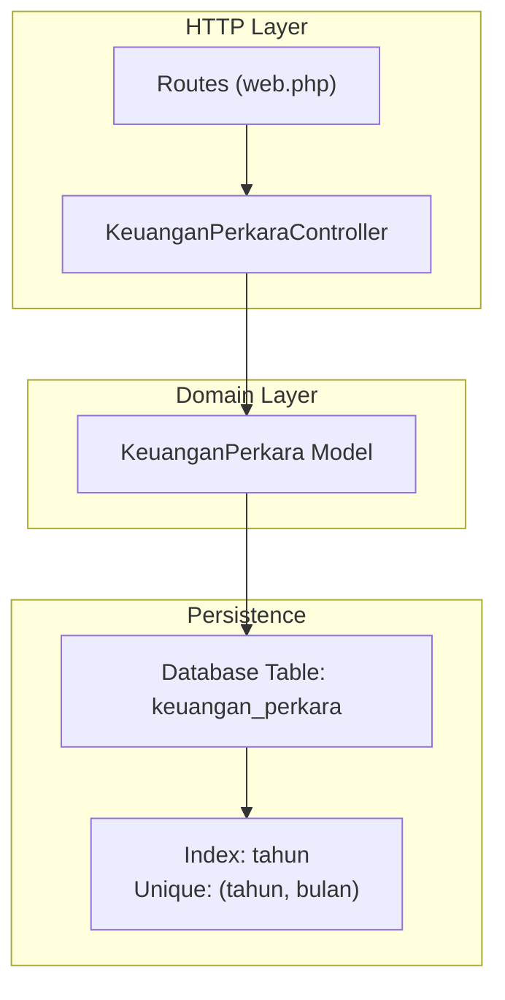
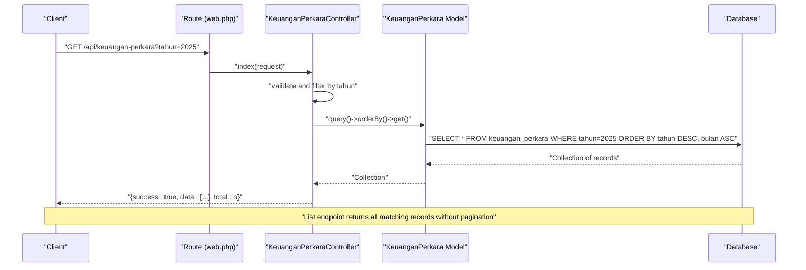
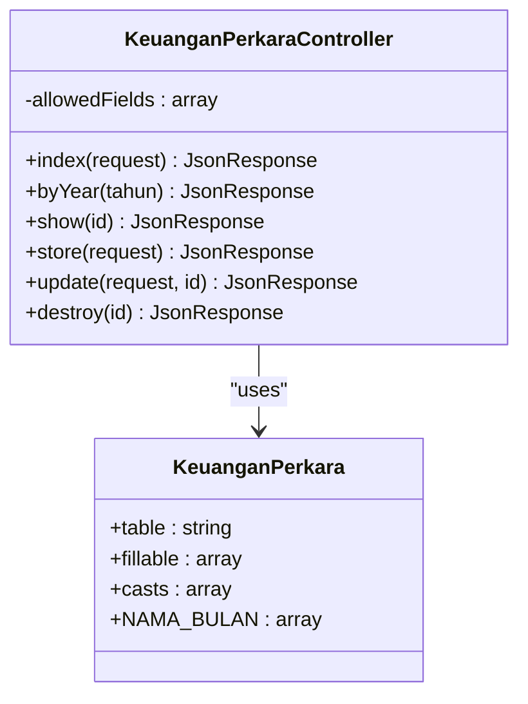
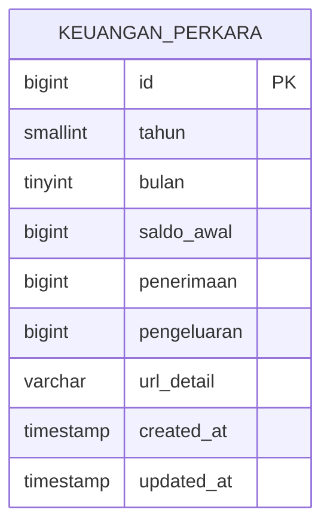
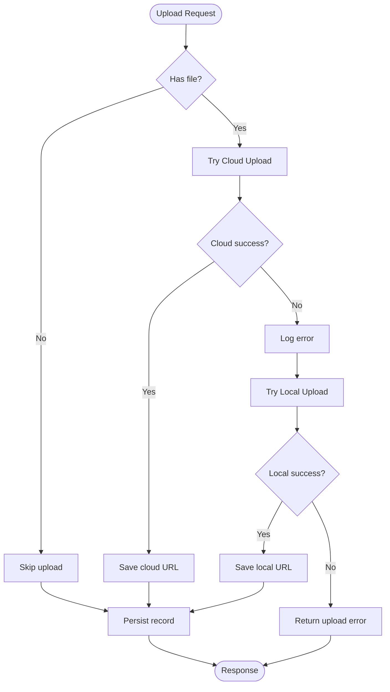
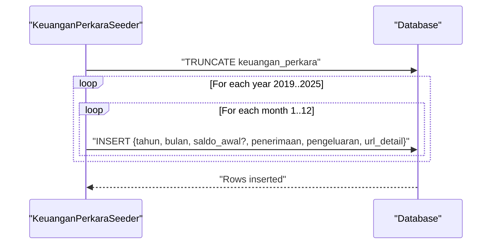
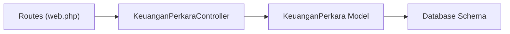

# Keuangan Perkara (Case Financials)

<cite>
**Referenced Files in This Document**
- [KeuanganPerkaraController.php](file://app/Http/Controllers/KeuanganPerkaraController.php)
- [KeuanganPerkara.php](file://app/Models/KeuanganPerkara.php)
- [2026_04_01_000000_create_keuangan_perkara_table.php](file://database/migrations/2026_04_01_000000_create_keuangan_perkara_table.php)
- [KeuanganPerkaraSeeder.php](file://database/seeders/KeuanganPerkaraSeeder.php)
- [web.php](file://routes/web.php)
- [joomla-integration-keuangan-perkara.html](file://docs/joomla-integration-keuangan-perkara.html)
</cite>

## Table of Contents
1. [Introduction](#introduction)
2. [Project Structure](#project-structure)
3. [Core Components](#core-components)
4. [Architecture Overview](#architecture-overview)
5. [Detailed Component Analysis](#detailed-component-analysis)
6. [Dependency Analysis](#dependency-analysis)
7. [Performance Considerations](#performance-considerations)
8. [Troubleshooting Guide](#troubleshooting-guide)
9. [Conclusion](#conclusion)
10. [Appendices](#appendices)

## Introduction
This document provides comprehensive API documentation for the Keuangan Perkara (Case Financials) module. It covers legal case financial tracking and cost management, focusing on monthly financial records for court proceedings. The module exposes HTTP endpoints for listing financial records, retrieving individual records, and filtering by year. It also documents the standardized JSON response format, data validation rules, and error handling for case identifiers.

The module integrates with external systems for document storage, falling back from cloud storage to local storage when necessary. It supports practical use cases such as case cost tracking, legal expense monitoring, and financial reporting for court proceedings.

## Project Structure
The Keuangan Perkara module follows Laravel/Lumen conventions:
- Controller: Handles HTTP requests and responses
- Model: Defines database schema and data casting
- Migration: Creates the financial records table with unique constraints
- Seeder: Seeds historical financial data for demonstration
- Routes: Exposes REST endpoints for CRUD operations and year-based filtering

**Diagram sources**
- [web.php:60-63](file://routes/web.php#L60-L63)
- [web.php:142-146](file://routes/web.php#L142-L146)
- [KeuanganPerkaraController.php:9-191](file://app/Http/Controllers/KeuanganPerkaraController.php#L9-L191)
- [KeuanganPerkara.php:7-42](file://app/Models/KeuanganPerkara.php#L7-L42)
- [2026_04_01_000000_create_keuangan_perkara_table.php:11-23](file://database/migrations/2026_04_01_000000_create_keuangan_perkara_table.php#L11-L23)

**Section sources**
- [web.php:60-63](file://routes/web.php#L60-L63)
- [web.php:142-146](file://routes/web.php#L142-L146)
- [KeuanganPerkaraController.php:9-191](file://app/Http/Controllers/KeuanganPerkaraController.php#L9-L191)
- [KeuanganPerkara.php:7-42](file://app/Models/KeuanganPerkara.php#L7-L42)
- [2026_04_01_000000_create_keuangan_perkara_table.php:11-23](file://database/migrations/2026_04_01_000000_create_keuangan_perkara_table.php#L11-L23)

## Core Components
This section documents the HTTP endpoints, request/response schemas, and validation rules for the Keuangan Perkara module.

### HTTP Endpoints
- List financial records with optional year filter
  - Method: GET
  - URL: `/api/keuangan-perkara`
  - Query parameters:
    - tahun (optional): Integer year between 2000 and 2100
  - Response: JSON object containing success flag, total count, and data array
  - Pagination: Not implemented; returns all matched records

- Retrieve a specific financial record by ID
  - Method: GET
  - URL: `/api/keuangan-perkara/{id}`
  - Path parameter:
    - id: Positive integer identifier
  - Response: JSON object containing success flag and data object

- Filter financial records by year
  - Method: GET
  - URL: `/api/keuangan-perkara/tahun/{tahun}`
  - Path parameter:
    - tahun: Integer year between 2000 and 2100
  - Response: JSON object containing success flag, total count, and data array ordered by month ascending

- Create a new financial record
  - Method: POST
  - URL: `/api/keuangan-perkara`
  - Request body: Form-encoded fields (see Validation Rules)
  - Response: JSON object containing success flag, message, and created data

- Update an existing financial record
  - Method: PUT/POST (supports both)
  - URL: `/api/keuangan-perkara/{id}`
  - Path parameter:
    - id: Positive integer identifier
  - Request body: Form-encoded fields (see Validation Rules)
  - Response: JSON object containing success flag, message, and updated data

- Delete a financial record
  - Method: DELETE
  - URL: `/api/keuangan-perkara/{id}`
  - Path parameter:
    - id: Positive integer identifier
  - Response: JSON object containing success flag and message

### Request Body Fields (Create/Update)
- tahun: Integer, required for creation, range 2000–2100
- bulan: Integer, required for creation, range 1–12
- saldo_awal: Integer, nullable, minimum 0 (only applicable for January)
- penerimaan: Integer, nullable, minimum 0
- pengeluaran: Integer, nullable, minimum 0
- url_detail: String, nullable, maximum 1000 characters
- file_upload: File, optional, allowed types pdf, doc, docx, jpg, jpeg, png, maximum 10MB

Validation rules:
- tahun: required, integer, min: 2000, max: 2100
- bulan: required, integer, min: 1, max: 12
- saldo_awal: nullable, integer, min: 0
- penerimaan: nullable, integer, min: 0
- pengeluaran: nullable, integer, min: 0
- url_detail: nullable, string, max: 1000
- file_upload: nullable, file, mimes: pdf, doc, docx, jpg, jpeg, png, max: 10240

### Response Schema
Standardized JSON response format:
- success: Boolean indicating operation outcome
- message: String describing the result (present on errors and successful create/update)
- data: Object or Array containing the requested resource(s)
- total: Integer count of returned items (present on list endpoints)

Individual financial record fields:
- id: Integer identifier
- tahun: Integer year
- bulan: Integer month (1–12)
- saldo_awal: Integer amount or null
- penerimaan: Integer amount or null
- pengeluaran: Integer amount or null
- url_detail: String URL or null
- created_at: Timestamp
- updated_at: Timestamp

### Error Handling
- Validation failures: 422 Unprocessable Entity with success=false and message
- Year out of range: 400 Bad Request with success=false and message
- Record not found: 404 Not Found with success=false and message
- Internal server errors: 500 Internal Server Error with success=false and message

### Practical Usage Examples
- List all financial records:
  - curl -X GET https://web-api.pa-penajam.go.id/api/keuangan-perkara
- List financial records for a specific year:
  - curl -X GET "https://web-api.pa-penajam.go.id/api/keuangan-perkara?tahun=2025"
- Retrieve a specific financial record:
  - curl -X GET https://web-api.pa-penajam.go.id/api/keuangan-perkara/1
- Filter records by year:
  - curl -X GET https://web-api.pa-penajam.go.id/api/keuangan-perkara/tahun/2025
- Create a new financial record:
  - curl -X POST https://web-api.pa-penajam.go.id/api/keuangan-perkara \
    -F "tahun=2025" \
    -F "bulan=1" \
    -F "saldo_awal=4234000" \
    -F "penerimaan=46460000" \
    -F "pengeluaran=15943500" \
    -F "url_detail=https://drive.google.com/..."
- Update an existing record:
  - curl -X PUT https://web-api.pa-penajam.go.id/api/keuangan-perkara/1 \
    -F "penerimaan=50000000" \
    -F "file_upload=@/path/to/document.pdf"
- Delete a record:
  - curl -X DELETE https://web-api.pa-penajam.go.id/api/keuangan-perkara/1

**Section sources**
- [web.php:60-63](file://routes/web.php#L60-L63)
- [web.php:142-146](file://routes/web.php#L142-L146)
- [KeuanganPerkaraController.php:15-46](file://app/Http/Controllers/KeuanganPerkaraController.php#L15-L46)
- [KeuanganPerkaraController.php:48-55](file://app/Http/Controllers/KeuanganPerkaraController.php#L48-L55)
- [KeuanganPerkaraController.php:57-120](file://app/Http/Controllers/KeuanganPerkaraController.php#L57-L120)
- [KeuanganPerkaraController.php:122-180](file://app/Http/Controllers/KeuanganPerkaraController.php#L122-L180)
- [KeuanganPerkaraController.php:182-190](file://app/Http/Controllers/KeuanganPerkaraController.php#L182-L190)

## Architecture Overview
The Keuangan Perkara module follows a layered architecture:
- HTTP Layer: Routes define endpoint contracts and map to controller actions
- Controller Layer: Implements business logic, validation, and response formatting
- Domain Layer: Model encapsulates data access and casting rules
- Persistence Layer: Database table with unique constraints and indexes

**Diagram sources**
- [web.php:60-63](file://routes/web.php#L60-L63)
- [KeuanganPerkaraController.php:15-33](file://app/Http/Controllers/KeuanganPerkaraController.php#L15-L33)
- [KeuanganPerkara.php:7-42](file://app/Models/KeuanganPerkara.php#L7-L42)
- [2026_04_01_000000_create_keuangan_perkara_table.php:11-23](file://database/migrations/2026_04_01_000000_create_keuangan_perkara_table.php#L11-L23)

**Section sources**
- [web.php:60-63](file://routes/web.php#L60-L63)
- [KeuanganPerkaraController.php:15-33](file://app/Http/Controllers/KeuanganPerkaraController.php#L15-L33)
- [KeuanganPerkara.php:7-42](file://app/Models/KeuanganPerkara.php#L7-L42)
- [2026_04_01_000000_create_keuangan_perkara_table.php:11-23](file://database/migrations/2026_04_01_000000_create_keuangan_perkara_table.php#L11-L23)

## Detailed Component Analysis

### Controller Implementation
The controller implements five primary actions:
- index: Supports optional year filtering and returns all matching records
- byYear: Validates year range and returns monthly records ordered by month
- show: Retrieves a single record by ID with not-found handling
- store: Validates input, prevents duplicates, handles file upload with cloud/local fallback, persists data
- update: Validates input, handles file upload with cloud/local fallback, updates data
- destroy: Removes a record by ID with not-found handling

**Diagram sources**
- [KeuanganPerkaraController.php:9-191](file://app/Http/Controllers/KeuanganPerkaraController.php#L9-L191)
- [KeuanganPerkara.php:7-42](file://app/Models/KeuanganPerkara.php#L7-L42)

**Section sources**
- [KeuanganPerkaraController.php:9-191](file://app/Http/Controllers/KeuanganPerkaraController.php#L9-L191)
- [KeuanganPerkara.php:7-42](file://app/Models/KeuanganPerkara.php#L7-L42)

### Data Model and Schema
The model defines:
- Table name: keuangan_perkara
- Fillable attributes: tahun, bulan, saldo_awal, penerimaan, pengeluaran, url_detail
- Type casting: tahun, bulan, saldo_awal, penerimaan, pengeluaran as integers
- Month name constants for display

**Diagram sources**
- [2026_04_01_000000_create_keuangan_perkara_table.php:11-23](file://database/migrations/2026_04_01_000000_create_keuangan_perkara_table.php#L11-L23)
- [KeuanganPerkara.php:7-42](file://app/Models/KeuanganPerkara.php#L7-L42)

**Section sources**
- [2026_04_01_000000_create_keuangan_perkara_table.php:11-23](file://database/migrations/2026_04_01_000000_create_keuangan_perkara_table.php#L11-L23)
- [KeuanganPerkara.php:7-42](file://app/Models/KeuanganPerkara.php#L7-L42)

### File Upload and Storage Integration
The controller supports uploading financial documents with a fallback mechanism:
- Attempts to upload to cloud storage via Google Drive service
- Falls back to local storage if cloud upload fails
- Generates appropriate URLs for document access

**Diagram sources**
- [KeuanganPerkaraController.php:57-120](file://app/Http/Controllers/KeuanganPerkaraController.php#L57-L120)
- [KeuanganPerkaraController.php:122-180](file://app/Http/Controllers/KeuanganPerkaraController.php#L122-L180)

**Section sources**
- [KeuanganPerkaraController.php:57-120](file://app/Http/Controllers/KeuanganPerkaraController.php#L57-L120)
- [KeuanganPerkaraController.php:122-180](file://app/Http/Controllers/KeuanganPerkaraController.php#L122-L180)

### Historical Data and Integration
Historical financial data is seeded for years 2019–2025, including:
- Annual opening balances (January)
- Monthly income, expenses, and document URLs
- Support for both local and cloud storage URLs

**Diagram sources**
- [KeuanganPerkaraSeeder.php:138-162](file://database/seeders/KeuanganPerkaraSeeder.php#L138-L162)

**Section sources**
- [KeuanganPerkaraSeeder.php:138-162](file://database/seeders/KeuanganPerkaraSeeder.php#L138-L162)

## Dependency Analysis
The module exhibits clean separation of concerns with minimal coupling:
- Routes depend on controller actions
- Controller depends on model for data access
- Model depends on database schema
- No circular dependencies detected

**Diagram sources**
- [web.php:60-63](file://routes/web.php#L60-L63)
- [web.php:142-146](file://routes/web.php#L142-L146)
- [KeuanganPerkaraController.php:9-191](file://app/Http/Controllers/KeuanganPerkaraController.php#L9-L191)
- [KeuanganPerkara.php:7-42](file://app/Models/KeuanganPerkara.php#L7-L42)
- [2026_04_01_000000_create_keuangan_perkara_table.php:11-23](file://database/migrations/2026_04_01_000000_create_keuangan_perkara_table.php#L11-L23)

**Section sources**
- [web.php:60-63](file://routes/web.php#L60-L63)
- [web.php:142-146](file://routes/web.php#L142-L146)
- [KeuanganPerkaraController.php:9-191](file://app/Http/Controllers/KeuanganPerkaraController.php#L9-L191)
- [KeuanganPerkara.php:7-42](file://app/Models/KeuanganPerkara.php#L7-L42)
- [2026_04_01_000000_create_keuangan_perkara_table.php:11-23](file://database/migrations/2026_04_01_000000_create_keuangan_perkara_table.php#L11-L23)

## Performance Considerations
- Indexing: The table includes an index on tahun and a unique composite index on (tahun, bulan), optimizing year-based queries and preventing duplicates
- Sorting: Results are sorted by year descending and month ascending for efficient presentation
- Pagination: Not implemented; consider adding limit/offset or cursor-based pagination for large datasets
- File uploads: Cloud-to-local fallback reduces latency and improves reliability; consider asynchronous processing for large files
- Caching: Implement caching for frequently accessed year filters to reduce database load

## Troubleshooting Guide
Common issues and resolutions:
- Year validation errors: Ensure tahun is between 2000 and 2100
- Duplicate entries: The unique constraint prevents multiple records for the same (tahun, bulan)
- File upload failures: Verify cloud service availability; local fallback writes to public/uploads/keuangan-perkara
- Record not found: Confirm the numeric ID exists in the database
- CORS issues: Configure CORS middleware for cross-origin requests
- Rate limiting: Apply rate limits to prevent abuse of endpoints

**Section sources**
- [KeuanganPerkaraController.php:37-39](file://app/Http/Controllers/KeuanganPerkaraController.php#L37-L39)
- [KeuanganPerkaraController.php:70-76](file://app/Http/Controllers/KeuanganPerkaraController.php#L70-L76)
- [2026_04_01_000000_create_keuangan_perkara_table.php:21](file://database/migrations/2026_04_01_000000_create_keuangan_perkara_table.php#L21)

## Conclusion
The Keuangan Perkara module provides a robust foundation for legal case financial tracking with clear HTTP endpoints, standardized responses, and comprehensive validation. It supports essential workflows for case cost tracking, legal expense monitoring, and financial reporting while integrating with external document storage systems. Future enhancements could include pagination, caching, and expanded filtering capabilities.

## Appendices
- Integration example: The module is integrated into a Joomla frontend that consumes the API to display monthly financial summaries and links to supporting documents
- Data seeding: Historical data for multiple years enables demonstration and testing of the financial reporting workflow

**Section sources**
- [joomla-integration-keuangan-perkara.html:170-336](file://docs/joomla-integration-keuangan-perkara.html#L170-L336)
- [KeuanganPerkaraSeeder.php:138-162](file://database/seeders/KeuanganPerkaraSeeder.php#L138-L162)