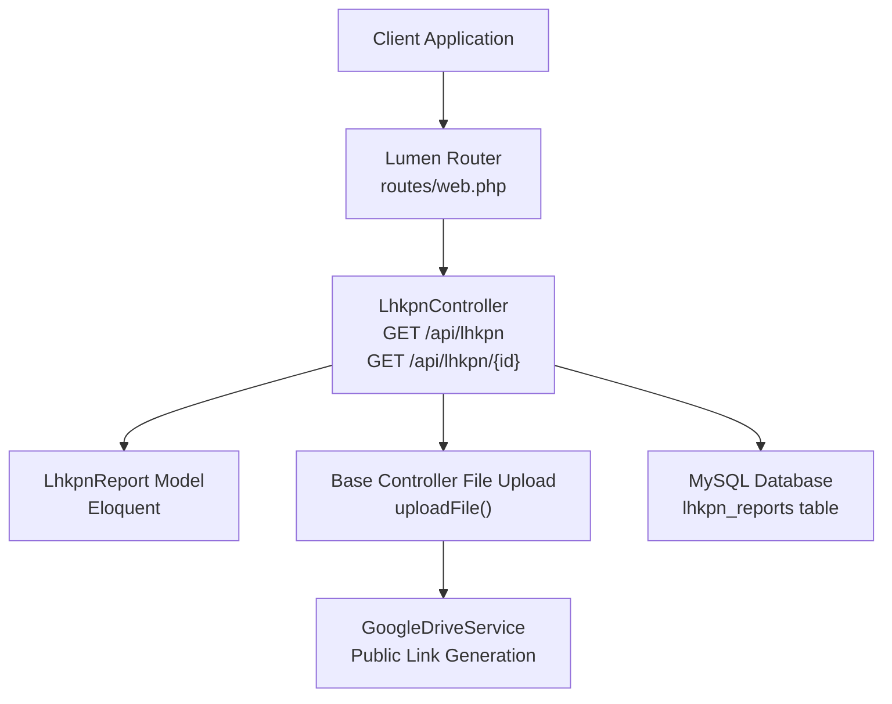
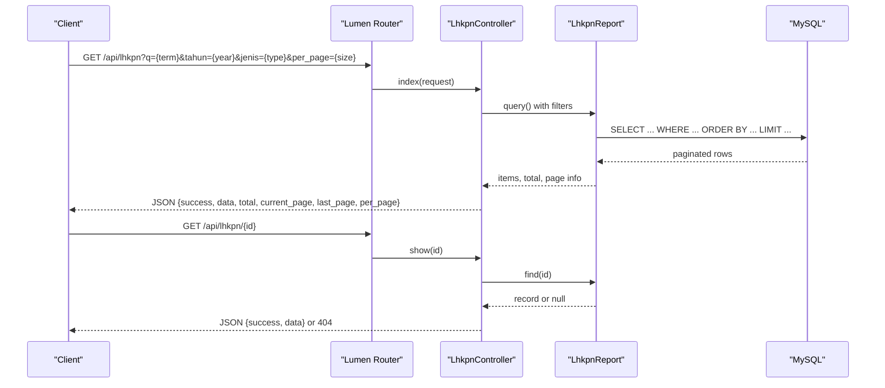
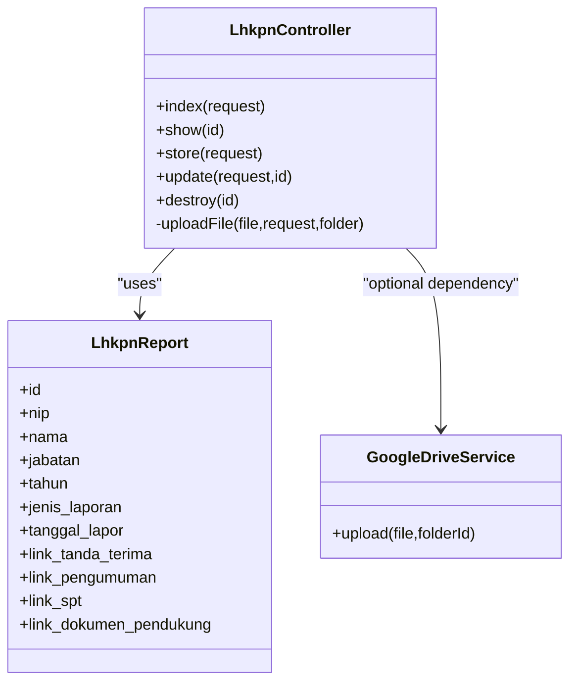
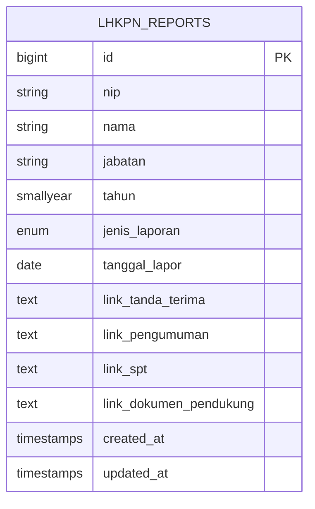

# LHKPN Reports (Asset Declarations)

<cite>
**Referenced Files in This Document**
- [routes/web.php](file://routes/web.php)
- [app/Http/Controllers/LhkpnController.php](file://app/Http/Controllers/LhkpnController.php)
- [app/Http/Controllers/Controller.php](file://app/Http/Controllers/Controller.php)
- [app/Models/LhkpnReport.php](file://app/Models/LhkpnReport.php)
- [database/migrations/2026_02_02_162040_create_lhkpn_reports_table.php](file://database/migrations/2026_02_02_162040_create_lhkpn_reports_table.php)
- [database/migrations/2026_02_10_000003_update_lhkpn_reports_add_links.php](file://database/migrations/2026_02_10_000003_update_lhkpn_reports_add_links.php)
- [database/migrations/2026_02_10_000004_rename_spt_to_lhkasn.php](file://database/migrations/2026_02_10_000004_rename_spt_to_lhkasn.php)
- [app/Exceptions/Handler.php](file://app/Exceptions/Handler.php)
- [app/Services/GoogleDriveService.php](file://app/Services/GoogleDriveService.php)
- [docs/joomla-integration-lhkpn.html](file://docs/joomla-integration-lhkpn.html)
</cite>

## Table of Contents
1. [Introduction](#introduction)
2. [Project Structure](#project-structure)
3. [Core Components](#core-components)
4. [Architecture Overview](#architecture-overview)
5. [Detailed Component Analysis](#detailed-component-analysis)
6. [Dependency Analysis](#dependency-analysis)
7. [Performance Considerations](#performance-considerations)
8. [Troubleshooting Guide](#troubleshooting-guide)
9. [Conclusion](#conclusion)
10. [Appendices](#appendices)

## Introduction
This document provides comprehensive API documentation for the LHKPN Reports module, which manages asset and income declarations for public officials. It covers HTTP GET endpoints for listing financial reports, retrieving individual declarations, and filtering by reporting periods. The documentation specifies URL patterns, query parameters, response schemas, pagination details, and error handling. It also includes practical curl examples and guidance for common use cases such as declaration verification, financial disclosure checking, and compliance monitoring.

## Project Structure
The LHKPN module is implemented as part of a Lumen-based API. The routing exposes public GET endpoints under the api prefix, while write operations are protected behind API key and rate-limiting middleware. The controller handles request validation, filtering, ordering, and pagination. Data persistence is managed via an Eloquent model backed by a MySQL migration. File attachments are optionally stored and referenced via links generated by a Google Drive service.

**Diagram sources**
- [routes/web.php:33-35](file://routes/web.php#L33-L35)
- [app/Http/Controllers/LhkpnController.php:11-53](file://app/Http/Controllers/LhkpnController.php#L11-L53)
- [app/Http/Controllers/Controller.php:40-95](file://app/Http/Controllers/Controller.php#L40-L95)
- [app/Services/GoogleDriveService.php:38-82](file://app/Services/GoogleDriveService.php#L38-L82)
- [database/migrations/2026_02_02_162040_create_lhkpn_reports_table.php:14-25](file://database/migrations/2026_02_02_162040_create_lhkpn_reports_table.php#L14-L25)

**Section sources**
- [routes/web.php:33-35](file://routes/web.php#L33-L35)
- [app/Http/Controllers/LhkpnController.php:11-53](file://app/Http/Controllers/LhkpnController.php#L11-L53)
- [app/Http/Controllers/Controller.php:40-95](file://app/Http/Controllers/Controller.php#L40-L95)
- [app/Models/LhkpnReport.php:11-27](file://app/Models/LhkpnReport.php#L11-L27)
- [database/migrations/2026_02_02_162040_create_lhkpn_reports_table.php:14-25](file://database/migrations/2026_02_02_162040_create_lhkpn_reports_table.php#L14-L25)

## Core Components
- Route definitions expose two public GET endpoints:
  - List reports: GET /api/lhkpn
  - Retrieve single report: GET /api/lhkpn/{id}
- Controller logic:
  - Filtering by year and declaration type
  - Full-text search across name and NIP
  - Custom ordering aligned with organizational hierarchy
  - Pagination with standard metadata
- Model fields include identification, position, reporting year, declaration type, filing date, and optional document links.
- File upload pipeline supports PDF and image documents, generating public links via Google Drive or local fallback.

**Section sources**
- [routes/web.php:33-35](file://routes/web.php#L33-L35)
- [app/Http/Controllers/LhkpnController.php:11-53](file://app/Http/Controllers/LhkpnController.php#L11-L53)
- [app/Models/LhkpnReport.php:11-27](file://app/Models/LhkpnReport.php#L11-L27)
- [database/migrations/2026_02_02_162040_create_lhkpn_reports_table.php:14-25](file://database/migrations/2026_02_02_162040_create_lhkpn_reports_table.php#L14-L25)
- [database/migrations/2026_02_10_000003_update_lhkpn_reports_add_links.php:14-16](file://database/migrations/2026_02_10_000003_update_lhkpn_reports_add_links.php#L14-L16)
- [database/migrations/2026_02_10_000004_rename_spt_to_lhkasn.php:18-20](file://database/migrations/2026_02_10_000004_rename_spt_to_lhkasn.php#L18-L20)

## Architecture Overview
The LHKPN API follows a layered architecture:
- Presentation: HTTP GET endpoints exposed via Lumen router
- Application: Controller orchestrates filtering, ordering, pagination, and file link generation
- Domain: Eloquent model encapsulates persistence and casting
- Infrastructure: Optional Google Drive integration for public document links

**Diagram sources**
- [routes/web.php:33-35](file://routes/web.php#L33-L35)
- [app/Http/Controllers/LhkpnController.php:11-53](file://app/Http/Controllers/LhkpnController.php#L11-L53)
- [app/Models/LhkpnReport.php:11-27](file://app/Models/LhkpnReport.php#L11-L27)

## Detailed Component Analysis

### Endpoint Definitions
- Base URL: /api
- Public GET endpoints:
  - GET /api/lhkpn
  - GET /api/lhkpn/{id}

These endpoints are defined in the router and are publicly accessible with rate limiting.

**Section sources**
- [routes/web.php:33-35](file://routes/web.php#L33-L35)

### Query Parameters for Filtering and Search
- tahun: Integer year filter
- jenis: Declaration type filter (values: LHKPN, SPT Tahunan)
- q: Full-text search across name and NIP
- per_page: Pagination size (defaults to 15 if omitted)

Ordering:
- Primary sort: year descending
- Secondary sort: custom organizational hierarchy ranking, then by name ascending

**Section sources**
- [app/Http/Controllers/LhkpnController.php:15-40](file://app/Http/Controllers/LhkpnController.php#L15-L40)

### Response Schema
Standardized JSON response format:
- success: Boolean indicating operation outcome
- data: Array of records (list endpoint) or single record (detail endpoint)
- Pagination metadata (list endpoint):
  - total: Total number of records matching filters
  - current_page: Current page number
  - last_page: Last page number
  - per_page: Number of items per page

Record fields:
- Identification: nip, nama, jabatan
- Reporting: tahun (integer), jenis_laporan (enum)
- Filing: tanggal_lapor (date)
- Documents: link_tanda_terima, link_pengumuman, link_spt, link_dokumen_pendukung

Notes:
- Document link fields may be null if no file was attached
- Enum values for jenis_laporan are constrained to LHKPN and SPT Tahunan

**Section sources**
- [app/Http/Controllers/LhkpnController.php:45-52](file://app/Http/Controllers/LhkpnController.php#L45-L52)
- [app/Models/LhkpnReport.php:11-27](file://app/Models/LhkpnReport.php#L11-L27)
- [database/migrations/2026_02_02_162040_create_lhkpn_reports_table.php:19-20](file://database/migrations/2026_02_02_162040_create_lhkpn_reports_table.php#L19-L20)
- [database/migrations/2026_02_10_000003_update_lhkpn_reports_add_links.php:14-16](file://database/migrations/2026_02_10_000003_update_lhkpn_reports_add_links.php#L14-L16)
- [database/migrations/2026_02_10_000004_rename_spt_to_lhkasn.php:18-20](file://database/migrations/2026_02_10_000004_rename_spt_to_lhkasn.php#L18-L20)

### File Upload and Document Link Handling
- Supported file types: PDF, DOC, DOCX, JPG, JPEG, PNG
- Maximum file size: 5120 KB
- Upload pipeline:
  - Validates MIME type against actual content (not just extension)
  - Attempts Google Drive upload and returns a public web view link
  - Falls back to local storage with randomized filename and returns public URL
- Link fields populated during upload:
  - link_tanda_terima
  - link_pengumuman
  - link_spt
  - link_dokumen_pendukung

**Section sources**
- [app/Http/Controllers/LhkpnController.php:57-89](file://app/Http/Controllers/LhkpnController.php#L57-L89)
- [app/Http/Controllers/Controller.php:40-95](file://app/Http/Controllers/Controller.php#L40-L95)
- [app/Services/GoogleDriveService.php:38-82](file://app/Services/GoogleDriveService.php#L38-L82)

### Error Responses
- Validation failures: 422 Unprocessable Entity with structured errors
- Resource not found: 404 Not Found
- General server errors: 500 Internal Server Error (production hides stack traces)
- Security headers are applied to all responses, including errors

**Section sources**
- [app/Exceptions/Handler.php:57-95](file://app/Exceptions/Handler.php#L57-L95)

### Data Validation Rules
- Required fields for creation/update: nip, nama, jabatan, tahun (integer), jenis_laporan (enum)
- Optional fields: tanggal_lapor (date), file attachments with MIME and size constraints
- Enum constraint ensures jenis_laporan is either LHKPN or SPT Tahunan

**Section sources**
- [app/Http/Controllers/LhkpnController.php:57-68](file://app/Http/Controllers/LhkpnController.php#L57-L68)
- [app/Http/Controllers/LhkpnController.php:104-115](file://app/Http/Controllers/LhkpnController.php#L104-L115)
- [database/migrations/2026_02_02_162040_create_lhkpn_reports_table.php:19-20](file://database/migrations/2026_02_02_162040_create_lhkpn_reports_table.php#L19-L20)

### Concrete curl Examples
- List reports with filters and pagination:
  - curl "https://web-api.pa-penajam.go.id/api/lhkpn?q=John&tahun=2025&jenis=LHKPN&per_page=20"
- Retrieve a specific declaration by ID:
  - curl "https://web-api.pa-penajam.go.id/api/lhkpn/123"
- Period-based filtering (conceptual):
  - The current implementation supports filtering by tahun and jenis via query parameters. For multi-year ranges, clients should iterate or implement application-side range logic.

Note: Replace the base URL with your deployment endpoint if different.

**Section sources**
- [routes/web.php:33-35](file://routes/web.php#L33-L35)
- [docs/joomla-integration-lhkpn.html:184](file://docs/joomla-integration-lhkpn.html#L184)

## Dependency Analysis
The LHKPN API depends on:
- Router for endpoint exposure
- Controller for request handling, validation, filtering, ordering, and pagination
- Eloquent model for data access and casting
- Google Drive service for public link generation (optional)
- Database schema for persistence

**Diagram sources**
- [app/Http/Controllers/LhkpnController.php:11-147](file://app/Http/Controllers/LhkpnController.php#L11-L147)
- [app/Models/LhkpnReport.php:7-28](file://app/Models/LhkpnReport.php#L7-L28)
- [app/Services/GoogleDriveService.php:9-117](file://app/Services/GoogleDriveService.php#L9-L117)

**Section sources**
- [app/Http/Controllers/LhkpnController.php:11-147](file://app/Http/Controllers/LhkpnController.php#L11-L147)
- [app/Models/LhkpnReport.php:7-28](file://app/Models/LhkpnReport.php#L7-L28)
- [app/Services/GoogleDriveService.php:9-117](file://app/Services/GoogleDriveService.php#L9-L117)

## Performance Considerations
- Indexing: The nip field is indexed in the database, aiding search and joins.
- Ordering: Custom secondary ordering by job title ranks reduces UI sorting overhead.
- Pagination: Defaults to 15 items per page; adjust per_page to balance responsiveness and payload size.
- File uploads: Prefer cloud storage (Google Drive) for scalability and reduced local disk usage.

[No sources needed since this section provides general guidance]

## Troubleshooting Guide
- Missing or invalid parameters:
  - Validation errors return 422 with structured errors; ensure required fields and enum values are provided.
- Record not found:
  - Accessing a non-existent ID returns 404 with a descriptive message.
- Unexpected server errors:
  - Production responses hide stack traces; inspect logs for detailed error context.
- Document link generation failures:
  - If Google Drive upload fails, the system attempts local storage; verify storage permissions and MIME type validation.

**Section sources**
- [app/Exceptions/Handler.php:57-95](file://app/Exceptions/Handler.php#L57-L95)
- [app/Http/Controllers/LhkpnController.php:92-97](file://app/Http/Controllers/LhkpnController.php#L92-L97)
- [app/Http/Controllers/Controller.php:40-95](file://app/Http/Controllers/Controller.php#L40-L95)

## Conclusion
The LHKPN Reports module offers a straightforward, secure API for listing and retrieving asset and income declarations. Its filtering, ordering, and pagination features support efficient discovery and compliance workflows. The standardized JSON responses and robust error handling facilitate reliable integrations. Optional document link generation enhances transparency by providing public access to supporting materials.

[No sources needed since this section summarizes without analyzing specific files]

## Appendices

### API Definition Summary
- GET /api/lhkpn
  - Query parameters: tahun, jenis, q, per_page
  - Response: success flag, data array, pagination metadata
- GET /api/lhkpn/{id}
  - Path parameter: id
  - Response: success flag, single data record or 404

**Section sources**
- [routes/web.php:33-35](file://routes/web.php#L33-L35)
- [app/Http/Controllers/LhkpnController.php:11-53](file://app/Http/Controllers/LhkpnController.php#L11-L53)
- [app/Http/Controllers/LhkpnController.php:92-97](file://app/Http/Controllers/LhkpnController.php#L92-L97)

### Data Model Reference

**Diagram sources**
- [database/migrations/2026_02_02_162040_create_lhkpn_reports_table.php:14-25](file://database/migrations/2026_02_02_162040_create_lhkpn_reports_table.php#L14-L25)
- [database/migrations/2026_02_10_000003_update_lhkpn_reports_add_links.php:14-16](file://database/migrations/2026_02_10_000003_update_lhkpn_reports_add_links.php#L14-L16)
- [database/migrations/2026_02_10_000004_rename_spt_to_lhkasn.php:18-20](file://database/migrations/2026_02_10_000004_rename_spt_to_lhkasn.php#L18-L20)