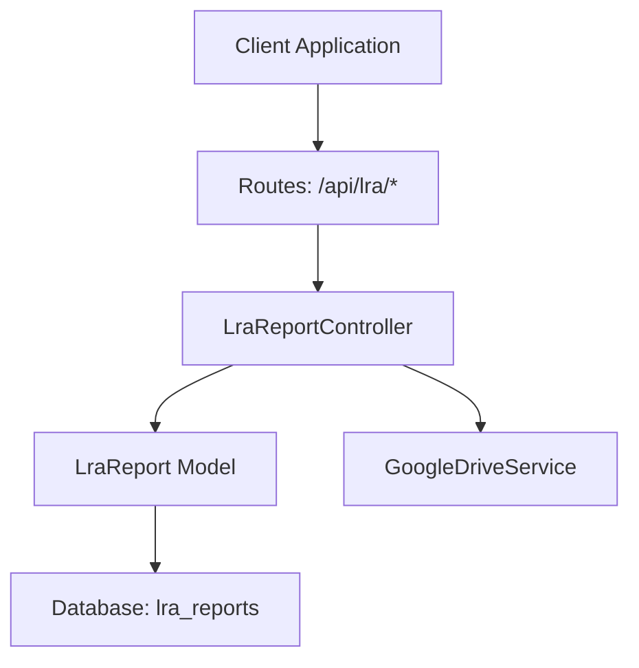
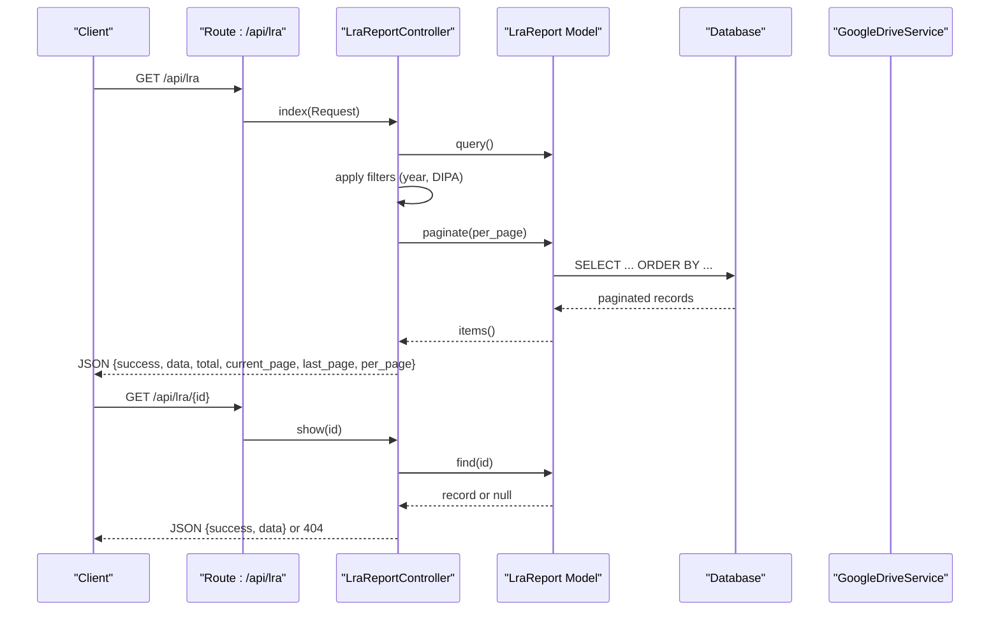
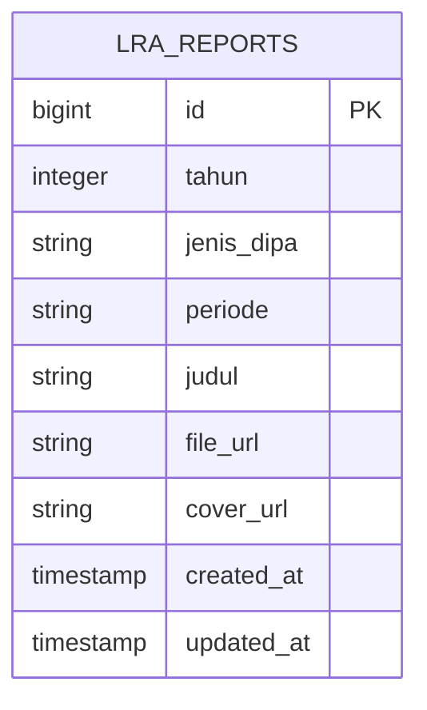

# LRA Reports (Financial Statements)

<cite>
**Referenced Files in This Document**
- [LraReportController.php](file://app/Http/Controllers/LraReportController.php)
- [LraReport.php](file://app/Models/LraReport.php)
- [GoogleDriveService.php](file://app/Services/GoogleDriveService.php)
- [web.php](file://routes/web.php)
- [2026_04_01_000002_create_lra_reports_table.php](file://database/migrations/2026_04_01_000002_create_lra_reports_table.php)
- [2026_04_02_000000_rename_triwulan_to_periode_on_lra_reports.php](file://database/migrations/2026_04_02_000000_rename_triwulan_to_periode_on_lra_reports.php)
- [LraReportSeeder.php](file://database/seeders/LraReportSeeder.php)
- [2026-04-01-lra-module-design.md](file://docs/plans/2026-04-01-lra-module-design.md)
</cite>

## Table of Contents
1. [Introduction](#introduction)
2. [Project Structure](#project-structure)
3. [Core Components](#core-components)
4. [Architecture Overview](#architecture-overview)
5. [Detailed Component Analysis](#detailed-component-analysis)
6. [Dependency Analysis](#dependency-analysis)
7. [Performance Considerations](#performance-considerations)
8. [Troubleshooting Guide](#troubleshooting-guide)
9. [Conclusion](#conclusion)
10. [Appendices](#appendices)

## Introduction
This document provides comprehensive API documentation for the LRA Reports module, which manages financial statements and reporting for the institution. It covers HTTP GET endpoints for listing financial statements, retrieving individual reports, and filtering by reporting periods. The documentation specifies URL patterns, query parameters, response schemas, pagination settings, and includes practical curl examples. It also documents the standardized JSON response format, validation rules, error handling, and common use cases such as financial statement analysis, audit tracking, and cross-period reporting.

## Project Structure
The LRA Reports module is implemented as a standard Laravel Lumen controller and model pair with a dedicated route group. The controller handles listing, filtering, retrieval, and CRUD operations for financial statements. The model maps to a flat relational table with unique constraints across year, DIPA type, and period. Routes are defined under a public API group with throttling middleware and a protected API group requiring an API key.



**Diagram sources**
- [web.php:74-76](file://routes/web.php#L74-L76)
- [LraReportController.php:11-234](file://app/Http/Controllers/LraReportController.php#L11-L234)
- [LraReport.php:7-24](file://app/Models/LraReport.php#L7-L24)
- [GoogleDriveService.php:9-117](file://app/Services/GoogleDriveService.php#L9-L117)

**Section sources**
- [web.php:74-76](file://routes/web.php#L74-L76)
- [LraReportController.php:11-234](file://app/Http/Controllers/LraReportController.php#L11-L234)
- [LraReport.php:7-24](file://app/Models/LraReport.php#L7-L24)

## Core Components
- LraReportController: Implements HTTP GET endpoints for listing and retrieving LRA reports, applies filtering by year and DIPA type, paginates results, and returns standardized JSON responses. Also handles POST/PUT/DELETE operations for administrative use.
- LraReport Model: Defines the Eloquent model for the lra_reports table, including fillable attributes and type casting for the year field.
- GoogleDriveService: Provides file upload to Google Drive with automatic daily folder organization and fallback to local storage when Google Drive is unavailable.
- Routes: Exposes public GET endpoints for listing and retrieving LRA reports and protected endpoints for administrative operations.

Key capabilities:
- Listing with pagination and filtering by year and DIPA type.
- Retrieving a single report by ID with robust error handling.
- Standardized JSON response format with success flags and metadata.
- Validation rules for administrative endpoints.

**Section sources**
- [LraReportController.php:20-78](file://app/Http/Controllers/LraReportController.php#L20-L78)
- [LraReportController.php:80-196](file://app/Http/Controllers/LraReportController.php#L80-L196)
- [LraReport.php:11-22](file://app/Models/LraReport.php#L11-L22)
- [GoogleDriveService.php:38-82](file://app/Services/GoogleDriveService.php#L38-L82)
- [web.php:74-76](file://routes/web.php#L74-L76)

## Architecture Overview
The LRA Reports API follows a straightforward MVC architecture:
- Routes define the endpoint surface area.
- Controller orchestrates request handling, validation, filtering, pagination, and response formatting.
- Model interacts with the database table lra_reports.
- GoogleDriveService handles file uploads and fallback mechanisms.



**Diagram sources**
- [web.php:74-76](file://routes/web.php#L74-L76)
- [LraReportController.php:20-55](file://app/Http/Controllers/LraReportController.php#L20-L55)
- [LraReportController.php:57-78](file://app/Http/Controllers/LraReportController.php#L57-L78)
- [LraReport.php:7-24](file://app/Models/LraReport.php#L7-L24)

## Detailed Component Analysis

### HTTP GET: List Financial Statements
- Endpoint: GET /api/lra
- Purpose: Retrieve paginated list of financial statements with optional filtering by year and DIPA type.
- Query Parameters:
  - tahun (optional): Integer year in range 2000–2100.
  - jenis_dipa (optional): String restricted to "DIPA 01" or "DIPA 04".
  - limit/per_page (optional): Integer, default 10, clamped between 1 and 100.
- Sorting: Results are ordered by year descending, then DIPA type ascending, then period ascending.
- Pagination Metadata: total, current_page, last_page, per_page.
- Response Schema:
  - success: Boolean flag indicating operation outcome.
  - data: Array of report objects.
  - total: Total count across pages.
  - current_page: Current page number.
  - last_page: Last page number.
  - per_page: Number of items per page.

Common usage:
- Retrieve all statements for a given year.
- Filter by DIPA type for targeted reporting.
- Paginate results for efficient client-side rendering.

curl examples:
- List all statements: curl -s "https://your-api.example.com/api/lra"
- Filter by year: curl -s "https://your-api.example.com/api/lra?tahun=2025"
- Filter by DIPA type: curl -s "https://your-api.example.com/api/lra?jenis_dipa=DIPA 01"
- Combine filters: curl -s "https://your-api.example.com/api/lra?tahun=2025&jenis_dipa=DIPA 01"
- Paginate: curl -s "https://your-api.example.com/api/lra?limit=20"

Validation and error handling:
- Invalid year values are ignored (no filter applied).
- Invalid DIPA values are ignored (no filter applied).
- Non-positive IDs in show() return 400 with message.
- Missing records in show() return 404 with message.

**Section sources**
- [LraReportController.php:20-55](file://app/Http/Controllers/LraReportController.php#L20-L55)
- [web.php:74](file://routes/web.php#L74)

### HTTP GET: Retrieve Individual Report
- Endpoint: GET /api/lra/{id}
- Purpose: Retrieve a single financial statement by its identifier.
- Path Parameter:
  - id: Positive integer representing the report’s primary key.
- Response Schema:
  - success: Boolean flag indicating operation outcome.
  - data: Single report object.
- Error Handling:
  - Non-positive id returns 400 with message.
  - Missing record returns 404 with message.

curl example:
- curl -s "https://your-api.example.com/api/lra/1"

**Section sources**
- [LraReportController.php:57-78](file://app/Http/Controllers/LraReportController.php#L57-L78)
- [web.php:75](file://routes/web.php#L75)

### Administrative Endpoints (Protected)
- POST /api/lra: Create a new financial statement with uploaded files.
- PUT /api/lra/{id}: Update an existing financial statement with optional file replacement.
- DELETE /api/lra/{id}: Remove a financial statement.
- Authentication: Requires API key middleware.
- Throttling: 100 requests per minute.

Validation rules (administrative):
- tahun: required, integer, min 2000, max 2100.
- jenis_dipa: required, in "DIPA 01","DIPA 04".
- periode: required, in "semester_1","semester_2","unaudited","audited".
- judul: required, string, max length 255.
- file_upload: required, file, PDF, max 10 MB.
- cover_upload: optional, file, image types JPG/JPEG/PNG/WebP, max 5 MB.

File upload flow:
- Controller calls GoogleDriveService.upload() for both PDF and cover images.
- On success, URLs are stored in file_url and cover_url.
- On failure, falls back to local storage under public/uploads/lra and public/uploads/lra/covers respectively.

curl examples (protected endpoints):
- Create: curl -s -H "X-API-Key: YOUR_KEY" -F "tahun=2025" -F "jenis_dipa=DIPA 01" -F "periode=semester_1" -F "judul=LRA Q1 DIPA 01" -F "file_upload=@report.pdf" -F "cover_upload=@cover.jpg" https://your-api.example.com/api/lra
- Update: curl -s -H "X-API-Key: YOUR_KEY" -X PUT -F "tahun=2025" -F "jenis_dipa=DIPA 01" -F "periode=semester_1" -F "judul=Updated Title" -F "file_upload=@report_updated.pdf" https://your-api.example.com/api/lra/1
- Delete: curl -s -H "X-API-Key: YOUR_KEY" -X DELETE https://your-api.example.com/api/lra/1

**Section sources**
- [LraReportController.php:80-196](file://app/Http/Controllers/LraReportController.php#L80-L196)
- [web.php:160-163](file://routes/web.php#L160-L163)
- [GoogleDriveService.php:38-82](file://app/Services/GoogleDriveService.php#L38-L82)

### Data Model and Database Schema
- Table: lra_reports
- Unique constraint: (tahun, jenis_dipa, periode)
- Columns:
  - id: bigint (primary key)
  - tahun: integer
  - jenis_dipa: string(10)
  - periode: string(20) (values: "semester_1","semester_2","unaudited","audited")
  - judul: string(255)
  - file_url: string(500)
  - cover_url: string(500) nullable
  - timestamps: created_at, updated_at

Migration history:
- Initial creation with triwulan column and unique constraint.
- Renamed triwulan to periode and mapped numeric codes to period labels.

**Section sources**
- [2026_04_01_000002_create_lra_reports_table.php:11-22](file://database/migrations/2026_04_01_000002_create_lra_reports_table.php#L11-L22)
- [2026_04_02_000000_rename_triwulan_to_periode_on_lra_reports.php:12-31](file://database/migrations/2026_04_02_000000_rename_triwulan_to_periode_on_lra_reports.php#L12-L31)
- [LraReportSeeder.php:12-34](file://database/seeders/LraReportSeeder.php#L12-L34)

### Response Format and Validation Rules
Standardized JSON response for listing:
- success: true
- data: array of report objects
- total: integer
- current_page: integer
- last_page: integer
- per_page: integer

Individual retrieval response:
- success: true/false
- data: object or null

Validation rules summary:
- tahun: integer, 2000–2100
- jenis_dipa: "DIPA 01" or "DIPA 04"
- periode: "semester_1","semester_2","unaudited","audited"
- judul: string, max 255
- file_upload: PDF, max 10 MB
- cover_upload: image (JPG/JPEG/PNG/WebP), max 5 MB

Error responses:
- 400: Invalid ID or invalid filter values.
- 404: Record not found.
- 500: Internal server errors during administrative operations.

**Section sources**
- [LraReportController.php:47-54](file://app/Http/Controllers/LraReportController.php#L47-L54)
- [LraReportController.php:57-78](file://app/Http/Controllers/LraReportController.php#L57-L78)
- [LraReportController.php:82-89](file://app/Http/Controllers/LraReportController.php#L82-L89)
- [LraReportController.php:135-142](file://app/Http/Controllers/LraReportController.php#L135-L142)

### Period-Based Filtering and Reporting Scenarios
Supported period values:
- "semester_1"
- "semester_2"
- "unaudited"
- "audited"

Filtering behavior:
- tahun: Applied only if within 2000–2100.
- jenis_dipa: Applied only if equals "DIPA 01" or "DIPA 04".

Common scenarios:
- Financial statement analysis: Use tahun and jenis_dipa filters to isolate datasets for comparative analysis.
- Audit tracking: Use audited/unaudited periods to track audit cycles and compliance.
- Comprehensive reporting: Combine pagination and sorting to generate cross-period summaries.

**Section sources**
- [LraReportController.php:24-36](file://app/Http/Controllers/LraReportController.php#L24-L36)
- [2026_04_02_000000_rename_triwulan_to_periode_on_lra_reports.php:24-27](file://database/migrations/2026_04_02_000000_rename_triwulan_to_periode_on_lra_reports.php#L24-L27)

## Dependency Analysis
The LRA Reports module exhibits low coupling and clear separation of concerns:
- Controller depends on the Model for data access and on GoogleDriveService for file handling.
- Routes depend on the Controller actions.
- Model depends on the database schema.

```mermaid
classDiagram
class LraReportController {
+index(request) JsonResponse
+show(id) JsonResponse
+store(request) JsonResponse
+update(request, id) JsonResponse
+destroy(id) JsonResponse
-uploadToGoogleDrive(file, request, localFolder) string
}
class LraReport {
+table : "lra_reports"
+fillable : ["tahun","jenis_dipa","periode","judul","file_url","cover_url"]
+casts : {"tahun" : "integer"}
}
class GoogleDriveService {
+upload(file, folderId) string
-getOrCreateDailyFolder(parentId) string
}
LraReportController --> LraReport : "uses"
LraReportController --> GoogleDriveService : "uses"
```

**Diagram sources**
- [LraReportController.php:11-234](file://app/Http/Controllers/LraReportController.php#L11-L234)
- [LraReport.php:7-24](file://app/Models/LraReport.php#L7-L24)
- [GoogleDriveService.php:9-117](file://app/Services/GoogleDriveService.php#L9-L117)

**Section sources**
- [LraReportController.php:11-234](file://app/Http/Controllers/LraReportController.php#L11-L234)
- [LraReport.php:7-24](file://app/Models/LraReport.php#L7-L24)
- [GoogleDriveService.php:9-117](file://app/Services/GoogleDriveService.php#L9-L117)

## Performance Considerations
- Pagination: Default 10 items per page with a maximum of 100, reducing payload sizes for large datasets.
- Sorting: Multi-column ordering ensures deterministic result sets.
- Filtering: Efficient database filtering by year and DIPA type.
- File uploads: Google Drive uploads are asynchronous; fallback to local storage minimizes downtime risk.
- Middleware: Public endpoints use throttling to prevent abuse; protected endpoints add API key verification.

[No sources needed since this section provides general guidance]

## Troubleshooting Guide
Common issues and resolutions:
- Invalid ID in show(): Ensure the path parameter is a positive integer; otherwise returns 400.
- Record not found: Verify the ID exists; returns 404.
- Upload failures: Controller attempts Google Drive upload; if it fails, falls back to local storage. Check logs for detailed error messages.
- Filter not applied: tahun must be within 2000–2100; jenis_dipa must be "DIPA 01" or "DIPA 04".
- Administrative errors: Validate input according to the rules; server returns 500 with error message on failure.

**Section sources**
- [LraReportController.php:59-71](file://app/Http/Controllers/LraReportController.php#L59-L71)
- [LraReportController.php:110-115](file://app/Http/Controllers/LraReportController.php#L110-L115)
- [LraReportController.php:200-231](file://app/Http/Controllers/LraReportController.php#L200-L231)

## Conclusion
The LRA Reports module provides a robust, standards-compliant API for managing financial statements. It supports efficient listing with filtering and pagination, precise retrieval by ID, and administrative operations with strong validation and resilient file handling. The documented endpoints, parameters, and response schemas enable reliable integration for financial analysis, audit tracking, and comprehensive reporting across periods and DIPA types.

[No sources needed since this section summarizes without analyzing specific files]

## Appendices

### API Reference Summary
- GET /api/lra
  - Query params: tahun, jenis_dipa, limit/per_page
  - Response: success, data[], total, current_page, last_page, per_page
- GET /api/lra/{id}
  - Response: success, data or 404
- POST /api/lra (protected)
  - Body: tahun, jenis_dipa, periode, judul, file_upload (PDF), cover_upload (optional)
  - Response: success, message, data
- PUT /api/lra/{id} (protected)
  - Body: same as POST (optional file updates)
  - Response: success, message, data
- DELETE /api/lra/{id} (protected)
  - Response: success, message

**Section sources**
- [web.php:74-76](file://routes/web.php#L74-L76)
- [web.php:160-163](file://routes/web.php#L160-L163)
- [LraReportController.php:20-78](file://app/Http/Controllers/LraReportController.php#L20-L78)
- [LraReportController.php:80-196](file://app/Http/Controllers/LraReportController.php#L80-L196)

### Data Model Diagram


**Diagram sources**
- [2026_04_01_000002_create_lra_reports_table.php:11-22](file://database/migrations/2026_04_01_000002_create_lra_reports_table.php#L11-L22)
- [2026_04_02_000000_rename_triwulan_to_periode_on_lra_reports.php:12-31](file://database/migrations/2026_04_02_000000_rename_triwulan_to_periode_on_lra_reports.php#L12-L31)