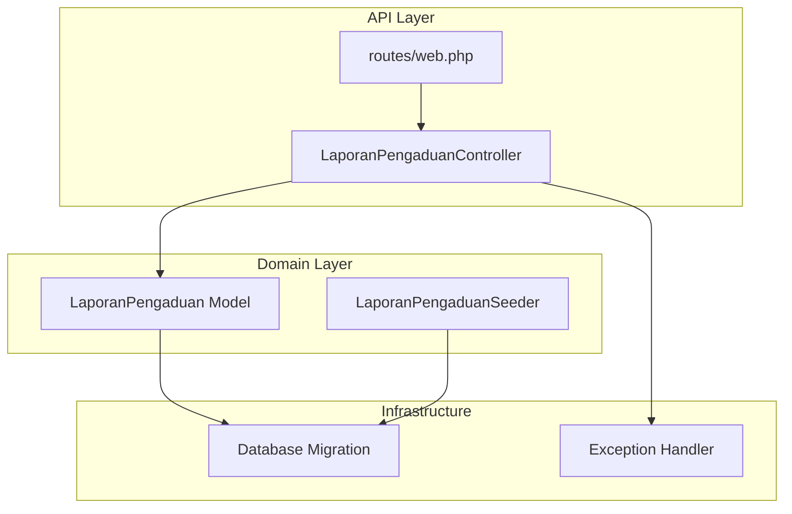
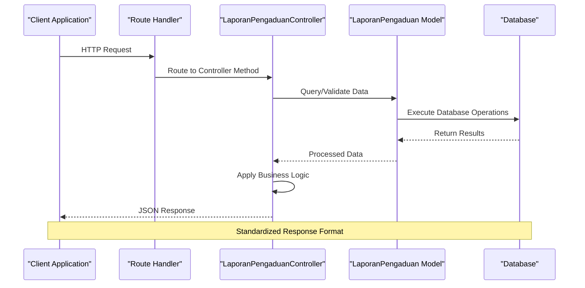
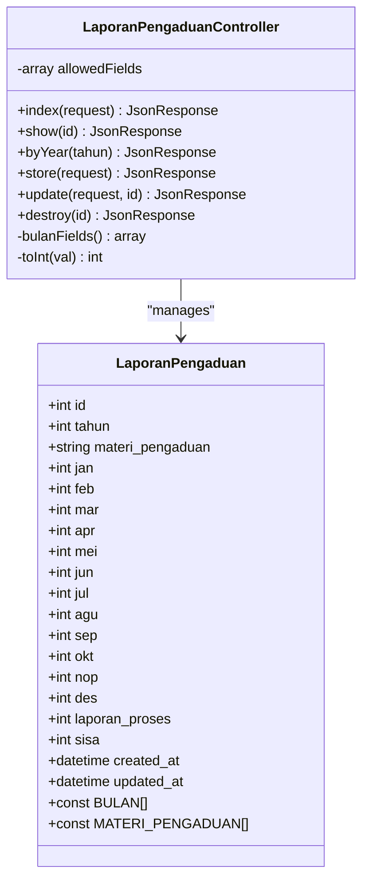
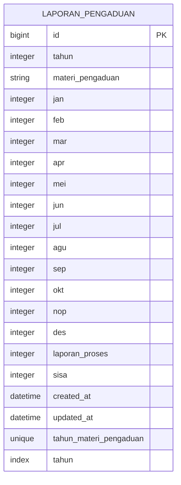
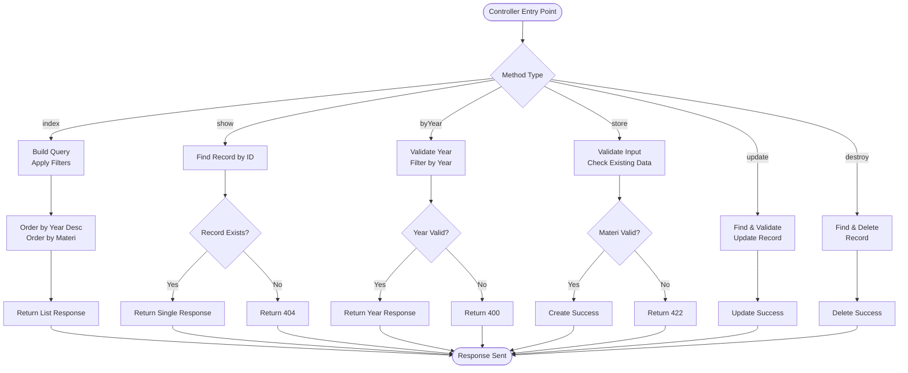
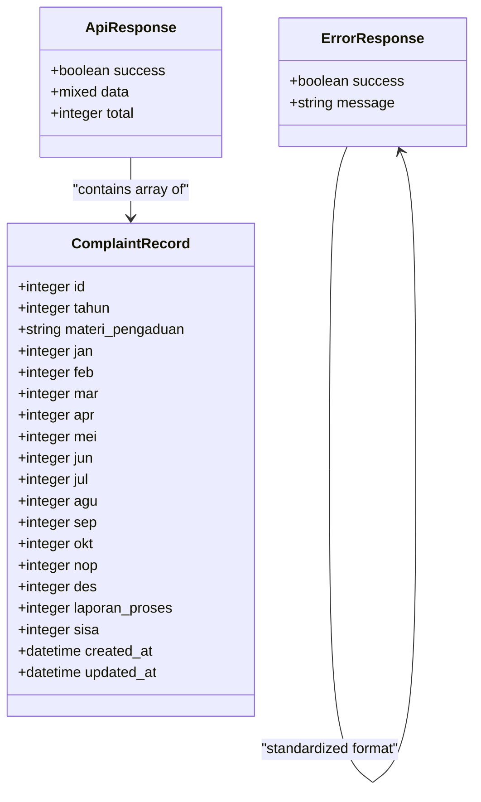
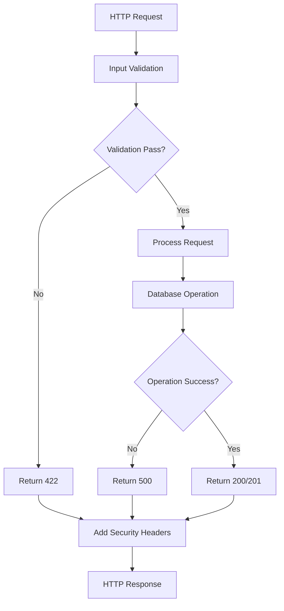

# Laporan Pengaduan (Complaint Processing)

<cite>
**Referenced Files in This Document**
- [LaporanPengaduanController.php](file://app/Http/Controllers/LaporanPengaduanController.php)
- [LaporanPengaduan.php](file://app/Models/LaporanPengaduan.php)
- [2026_03_31_000002_create_laporan_pengaduan_table.php](file://database/migrations/2026_03_31_000002_create_laporan_pengaduan_table.php)
- [web.php](file://routes/web.php)
- [Handler.php](file://app/Exceptions/Handler.php)
- [LaporanPengaduanSeeder.php](file://database/seeders/LaporanPengaduanSeeder.php)
- [joomla-integration-laporan-pengaduan.html](file://docs/joomla-integration-laporan-pengaduan.html)
</cite>

## Table of Contents
1. [Introduction](#introduction)
2. [Project Structure](#project-structure)
3. [Core Components](#core-components)
4. [Architecture Overview](#architecture-overview)
5. [Detailed Component Analysis](#detailed-component-analysis)
6. [API Reference](#api-reference)
7. [Response Schemas](#response-schemas)
8. [Data Validation Rules](#data-validation-rules)
9. [Error Handling](#error-handling)
10. [Common Use Cases](#common-use-cases)
11. [Performance Considerations](#performance-considerations)
12. [Troubleshooting Guide](#troubleshooting-guide)
13. [Conclusion](#conclusion)

## Introduction
The Laporan Pengaduan module provides comprehensive API endpoints for managing and retrieving citizen complaint data. This system tracks various types of judicial complaints including ethical violations, abuse of power, administrative errors, and public service dissatisfaction. The module supports both read-only operations for data retrieval and full CRUD operations for data management.

The API follows RESTful conventions with standardized JSON responses, comprehensive validation, and robust error handling. It integrates seamlessly with the broader legal reporting ecosystem and provides essential functionality for complaint tracking, analysis, and status monitoring across different complaint categories.

## Project Structure
The Laporan Pengaduan module is organized within the Laravel Lumen framework following standard MVC architecture patterns:



**Diagram sources**
- [web.php:55-58](file://routes/web.php#L55-L58)
- [LaporanPengaduanController.php:9-137](file://app/Http/Controllers/LaporanPengaduanController.php#L9-L137)
- [LaporanPengaduan.php:7-44](file://app/Models/LaporanPengaduan.php#L7-L44)

**Section sources**
- [web.php:1-165](file://routes/web.php#L1-L165)
- [LaporanPengaduanController.php:1-137](file://app/Http/Controllers/LaporanPengaduanController.php#L1-L137)
- [LaporanPengaduan.php:1-44](file://app/Models/LaporanPengaduan.php#L1-L44)

## Core Components
The module consists of several key components working together to provide comprehensive complaint management functionality:

### Controller Layer
The LaporanPengaduanController handles HTTP requests and implements business logic for complaint data management. It provides methods for listing, retrieving, creating, updating, and deleting complaint records.

### Model Layer
The LaporanPengaduan model defines the data structure, validation rules, and business constants for complaint categories and month mappings.

### Database Layer
The migration creates the underlying database table with appropriate constraints and indexes for efficient querying and data integrity.

### Routing Layer
The routing configuration establishes the API endpoints with proper URL patterns and middleware integration.

**Section sources**
- [LaporanPengaduanController.php:9-137](file://app/Http/Controllers/LaporanPengaduanController.php#L9-L137)
- [LaporanPengaduan.php:7-44](file://app/Models/LaporanPengaduan.php#L7-L44)
- [2026_03_31_000002_create_laporan_pengaduan_table.php:1-41](file://database/migrations/2026_03_31_000002_create_laporan_pengaduan_table.php#L1-L41)

## Architecture Overview
The Laporan Pengaduan module follows a layered architecture pattern with clear separation of concerns:



**Diagram sources**
- [web.php:55-58](file://routes/web.php#L55-L58)
- [LaporanPengaduanController.php:30-72](file://app/Http/Controllers/LaporanPengaduanController.php#L30-L72)
- [LaporanPengaduan.php:7-44](file://app/Models/LaporanPengaduan.php#L7-L44)

The architecture ensures scalability, maintainability, and consistent error handling across all operations.

## Detailed Component Analysis

### Data Model Analysis
The LaporanPengaduan model defines a comprehensive data structure for complaint tracking:



**Diagram sources**
- [LaporanPengaduan.php:7-44](file://app/Models/LaporanPengaduan.php#L7-L44)
- [LaporanPengaduanController.php:9-137](file://app/Http/Controllers/LaporanPengaduanController.php#L9-L137)

**Section sources**
- [LaporanPengaduan.php:11-30](file://app/Models/LaporanPengaduan.php#L11-L30)
- [LaporanPengaduan.php:32-42](file://app/Models/LaporanPengaduan.php#L32-L42)

### Database Schema Analysis
The database schema supports comprehensive complaint tracking with the following structure:



**Diagram sources**
- [2026_03_31_000002_create_laporan_pengaduan_table.php:11-33](file://database/migrations/2026_03_31_000002_create_laporan_pengaduan_table.php#L11-L33)

**Section sources**
- [2026_03_31_000002_create_laporan_pengaduan_table.php:11-33](file://database/migrations/2026_03_31_000002_create_laporan_pengaduan_table.php#L11-L33)

### Controller Methods Analysis
The controller implements comprehensive CRUD operations with specialized methods for complaint data management:



**Diagram sources**
- [LaporanPengaduanController.php:30-135](file://app/Http/Controllers/LaporanPengaduanController.php#L30-L135)

**Section sources**
- [LaporanPengaduanController.php:30-135](file://app/Http/Controllers/LaporanPengaduanController.php#L30-L135)

## API Reference

### Base URL
All endpoints are prefixed with `/api` and follow RESTful conventions.

### Authentication and Rate Limiting
- **Public Endpoints**: Available without authentication, subject to rate limiting (100 requests per minute)
- **Protected Endpoints**: Require API key authentication plus rate limiting (100 requests per minute)

### Endpoint Catalog

#### GET /api/laporan-pengaduan
**Description**: Retrieve all complaint records with optional year filtering
**Authentication**: Public
**Rate Limit**: 100/min

**Query Parameters**:
- `tahun` (optional): Integer year for filtering (2000-2100)

**Response**: JSON array of complaint records ordered by year (desc) then by complaint category

#### GET /api/laporan-pengaduan/{id}
**Description**: Retrieve a specific complaint record by ID
**Authentication**: Public
**Rate Limit**: 100/min

**Path Parameters**:
- `id` (required): Integer complaint ID

**Response**: Single complaint record object

#### GET /api/laporan-pengaduan/tahun/{tahun}
**Description**: Retrieve all complaint records for a specific year
**Authentication**: Public
**Rate Limit**: 100/min

**Path Parameters**:
- `tahun` (required): Integer year (2000-2100)

**Response**: Array of complaint records for the specified year ordered by complaint category

### Response Format
All successful responses follow a standardized JSON format:

```json
{
  "success": true,
  "data": [],
  "total": 0
}
```

Error responses follow a consistent format:
```json
{
  "success": false,
  "message": "Error description"
}
```

### Curl Examples

#### List All Complaints
```bash
curl -X GET "https://web-api.pa-penajam.go.id/api/laporan-pengaduan" \
  -H "Accept: application/json"
```

#### Get Specific Complaint
```bash
curl -X GET "https://web-api.pa-penajam.go.id/api/laporan-pengaduan/123" \
  -H "Accept: application/json"
```

#### Filter by Year
```bash
curl -X GET "https://web-api.pa-penajam.go.id/api/laporan-pengaduan?tahun=2024" \
  -H "Accept: application/json"
```

**Section sources**
- [web.php:55-58](file://routes/web.php#L55-L58)
- [LaporanPengaduanController.php:30-72](file://app/Http/Controllers/LaporanPengaduanController.php#L30-L72)

## Response Schemas

### Base Response Structure


**Diagram sources**
- [LaporanPengaduanController.php:45-49](file://app/Http/Controllers/LaporanPengaduanController.php#L45-L49)
- [LaporanPengaduanController.php:65-71](file://app/Http/Controllers/LaporanPengaduanController.php#L65-L71)

### Individual Complaint Record
Each complaint record contains the following fields:
- **id**: Unique identifier (auto-increment)
- **tahun**: Calendar year (2000-2100)
- **materi_pengaduan**: Complaint category (enumerated)
- **jan-dec**: Monthly complaint counts (nullable integers)
- **laporan_proses**: Processing reports count (nullable)
- **sisa**: Remaining complaints count (nullable)
- **created_at/updated_at**: Timestamps for record creation and modification

**Section sources**
- [LaporanPengaduan.php:11-30](file://app/Models/LaporanPengaduan.php#L11-L30)

## Data Validation Rules

### Input Validation
The system implements comprehensive validation for all input data:

**Required Fields**:
- `tahun`: Integer, required, range 2000-2100
- `materi_pengaduan`: String, required, must be from predefined categories

**Optional Fields**:
- All monthly fields (jan-dec): Nullable integers, minimum 0
- `laporan_proses`: Nullable integer, minimum 0
- `sisa`: Nullable integer, minimum 0

### Category Validation
The system validates complaint categories against predefined constants:
- Pelanggaran Terhadap Kode Etik Atau Pedoman Perilaku Hakim
- Penyalahgunaan Wewenang / Jabatan
- Pelanggaran Terhadap Disiplin PNS
- Perbuatan Tercela
- Pelanggaran Hukum Acara
- Kekeliruan Administrasi
- Pelayanan Publik Yang Tidak Memuaskan

### Duplicate Prevention
The system prevents duplicate entries for the same year and complaint category combination through database unique constraints.

**Section sources**
- [LaporanPengaduanController.php:76-100](file://app/Http/Controllers/LaporanPengaduanController.php#L76-L100)
- [LaporanPengaduan.php:34-42](file://app/Models/LaporanPengaduan.php#L34-L42)

## Error Handling

### HTTP Status Codes
The API uses standard HTTP status codes:
- **200**: Successful GET operations
- **201**: Successful POST operations
- **204**: Successful DELETE operations
- **400**: Bad request (invalid year format)
- **404**: Resource not found
- **422**: Validation errors
- **500**: Internal server errors

### Error Response Format
All error responses follow a consistent JSON structure:
```json
{
  "success": false,
  "message": "Error description"
}
```

### Exception Handling Pipeline
The system includes comprehensive exception handling with security headers:



**Diagram sources**
- [Handler.php:36-132](file://app/Exceptions/Handler.php#L36-L132)

**Section sources**
- [Handler.php:12-132](file://app/Exceptions/Handler.php#L12-L132)
- [LaporanPengaduanController.php:54-71](file://app/Http/Controllers/LaporanPengaduanController.php#L54-L71)

## Common Use Cases

### Complaint Tracking
The API enables comprehensive complaint tracking through:
- Year-based filtering for historical analysis
- Category-based sorting for thematic analysis
- Individual record retrieval for detailed investigation
- Bulk listing for dashboard displays

### Citizen Feedback Analysis
Organizations can leverage the API for:
- Trend analysis across complaint categories
- Seasonal pattern identification through monthly data
- Comparative analysis between years
- Volume forecasting based on historical trends

### Processing Status Monitoring
The system supports:
- Real-time monitoring of complaint processing status
- Tracking of remaining unresolved complaints
- Performance metrics calculation
- Automated alerting for overdue cases

### Integration Scenarios
The API supports various integration patterns:
- Real-time dashboard updates
- Batch processing for analytics
- Mobile application connectivity
- Legacy system integration through standardized formats

**Section sources**
- [joomla-integration-laporan-pengaduan.html:144-264](file://docs/joomla-integration-laporan-pengaduan.html#L144-L264)

## Performance Considerations

### Database Optimization
- **Index Strategy**: Unique composite index on (tahun, materi_pengaduan) for fast lookups
- **Query Optimization**: ORDER BY clauses optimized for complaint category enumeration
- **Pagination**: Built-in support for large datasets through efficient querying patterns

### Caching Opportunities
- **Category Enumeration**: Predefined constants reduce repeated validation overhead
- **Monthly Field Access**: Optimized field access patterns for reporting queries
- **Year Filtering**: Efficient year-based filtering through database indexes

### Scalability Factors
- **Rate Limiting**: Configurable rate limits prevent API abuse
- **Memory Management**: Efficient data serialization for large result sets
- **Connection Pooling**: Database connection optimization for high-throughput scenarios

## Troubleshooting Guide

### Common Issues and Solutions

**Issue**: Invalid year parameter
**Symptoms**: HTTP 400 response with validation error
**Solution**: Ensure year is within 2000-2100 range

**Issue**: Non-existent complaint ID
**Symptoms**: HTTP 404 response
**Solution**: Verify the complaint ID exists in the database

**Issue**: Duplicate complaint entry
**Symptoms**: HTTP 422 response with duplicate message
**Solution**: Use existing year/category combination or modify parameters

**Issue**: Validation failures
**Symptoms**: HTTP 422 response with error details
**Solution**: Review input data against validation rules

### Debugging Tips
- Enable API key authentication for development testing
- Use curl with verbose output for detailed request/response analysis
- Monitor rate limit headers for throttling issues
- Check server logs for unhandled exceptions

### Monitoring and Maintenance
- Regular database maintenance for optimal query performance
- Monitor API usage patterns for capacity planning
- Validate data integrity through periodic audits
- Update category enumerations as needed for compliance

**Section sources**
- [LaporanPengaduanController.php:54-100](file://app/Http/Controllers/LaporanPengaduanController.php#L54-L100)
- [Handler.php:57-95](file://app/Exceptions/Handler.php#L57-L95)

## Conclusion
The Laporan Pengaduan module provides a robust, scalable solution for managing citizen complaint data within the judicial system. Its comprehensive API design, strict validation rules, and standardized response formats ensure reliable integration across various platforms and applications.

The module's architecture supports both current operational needs and future expansion, with clear separation of concerns and comprehensive error handling. The standardized JSON responses and consistent error handling patterns facilitate easy integration with external systems while maintaining data integrity and security.

Key strengths include:
- Comprehensive complaint category coverage
- Flexible filtering and sorting capabilities
- Robust validation and error handling
- Scalable database design
- Secure API implementation with rate limiting
- Standardized response formats for interoperability

This module serves as a foundation for advanced complaint analysis, real-time monitoring, and comprehensive reporting capabilities essential for modern judicial administration.