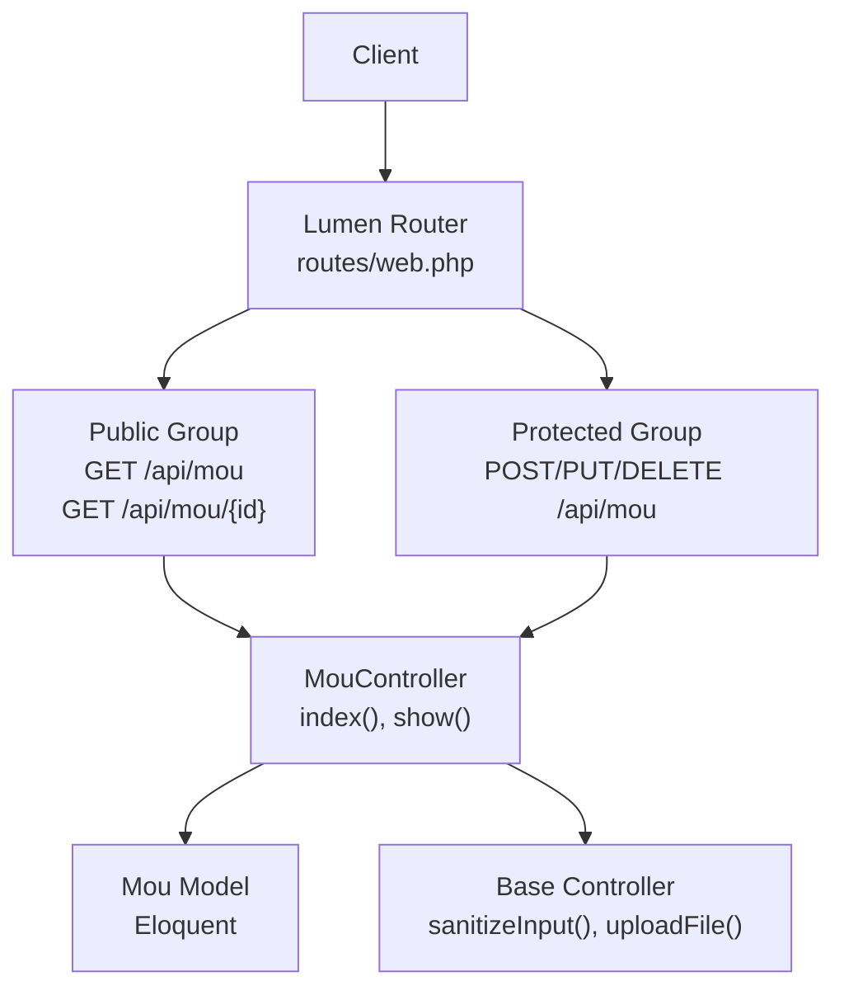
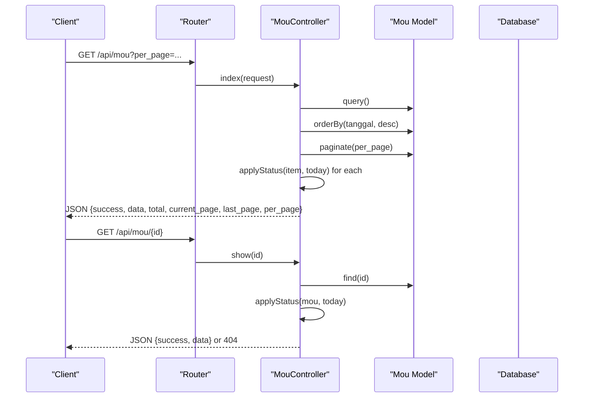
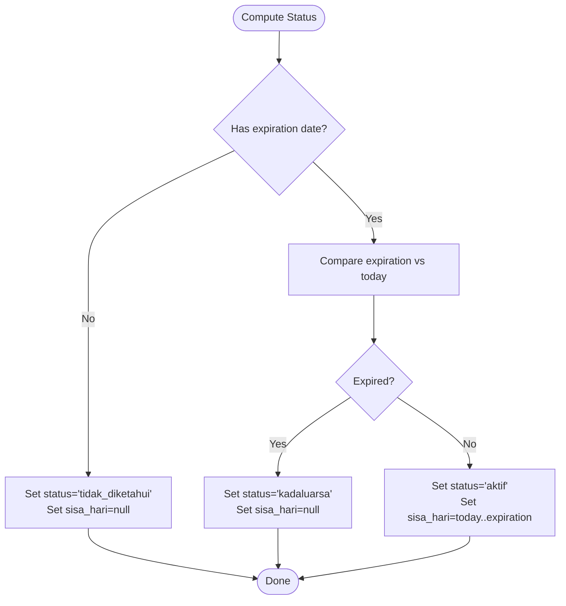
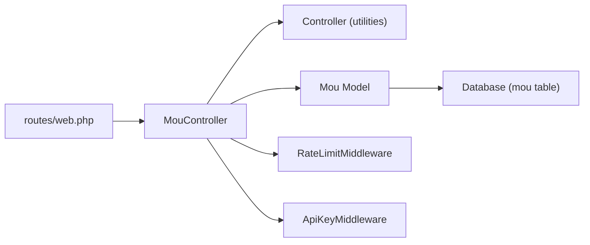

# MOU (Memorandum of Understanding)

<cite>
**Referenced Files in This Document**
- [routes/web.php](file://routes/web.php)
- [app/Http/Controllers/MouController.php](file://app/Http/Controllers/MouController.php)
- [app/Http/Controllers/Controller.php](file://app/Http/Controllers/Controller.php)
- [app/Models/Mou.php](file://app/Models/Mou.php)
- [database/migrations/2026_04_01_000000_create_mou_table.php](file://database/migrations/2026_04_01_000000_create_mou_table.php)
- [database/seeders/MouSeeder.php](file://database/seeders/MouSeeder.php)
- [app/Http/Middleware/ApiKeyMiddleware.php](file://app/Http/Middleware/ApiKeyMiddleware.php)
- [app/Http/Middleware/RateLimitMiddleware.php](file://app/Http/Middleware/RateLimitMiddleware.php)
- [app/Exceptions/Handler.php](file://app/Exceptions/Handler.php)
</cite>

## Table of Contents
1. [Introduction](#introduction)
2. [Project Structure](#project-structure)
3. [Core Components](#core-components)
4. [Architecture Overview](#architecture-overview)
5. [Detailed Component Analysis](#detailed-component-analysis)
6. [Dependency Analysis](#dependency-analysis)
7. [Performance Considerations](#performance-considerations)
8. [Troubleshooting Guide](#troubleshooting-guide)
9. [Conclusion](#conclusion)
10. [Appendices](#appendices)

## Introduction
This document provides comprehensive API documentation for the MOU (Memorandum of Understanding) module responsible for managing inter-agency agreements. It covers HTTP GET endpoints for listing agreements, retrieving individual MOUs, and pagination. It specifies URL patterns, query parameters, response schemas, and error handling. Practical curl examples demonstrate typical usage scenarios for agreement tracking, partner verification, and compliance monitoring.

## Project Structure
The MOU module is implemented as part of a Lumen-based backend. The routing exposes public GET endpoints under the api prefix, while write operations are protected behind API key and rate-limiting middleware.

**Diagram sources**
- [routes/web.php:70-76](file://routes/web.php#L70-L76)
- [routes/web.php:14-76](file://routes/web.php#L14-L76)
- [routes/web.php:154-158](file://routes/web.php#L154-L158)
- [app/Http/Controllers/MouController.php:10-49](file://app/Http/Controllers/MouController.php#L10-L49)
- [app/Http/Controllers/Controller.php:18-95](file://app/Http/Controllers/Controller.php#L18-L95)
- [app/Models/Mou.php:7-25](file://app/Models/Mou.php#L7-L25)

**Section sources**
- [routes/web.php:14-76](file://routes/web.php#L14-L76)
- [routes/web.php:70-76](file://routes/web.php#L70-L76)
- [routes/web.php:154-158](file://routes/web.php#L154-L158)

## Core Components
- HTTP GET endpoints:
  - List MOUs: GET /api/mou
  - Retrieve single MOU: GET /api/mou/{id}
- Pagination defaults and query parameters:
  - per_page: integer, default 15
  - year: optional integer year filter applied to the year index
- Response schema:
  - Standardized JSON envelope with success flag and data payload
  - Dynamic status calculation fields per item
- Data model fields:
  - Core attributes: date, agency, subject, expiration date, document link, computed year
- Status calculation:
  - Active, expired, or unknown based on expiration date and current date

Practical curl examples:
- List MOUs with default pagination:
  - curl -X GET "https://your-domain/api/mou"
- List MOUs with custom page size:
  - curl -X GET "https://your-domain/api/mou?per_page=30"
- Retrieve a specific MOU:
  - curl -X GET "https://your-domain/api/mou/123"

**Section sources**
- [routes/web.php:70-76](file://routes/web.php#L70-L76)
- [app/Http/Controllers/MouController.php:10-37](file://app/Http/Controllers/MouController.php#L10-L37)
- [app/Http/Controllers/MouController.php:39-49](file://app/Http/Controllers/MouController.php#L39-L49)
- [app/Models/Mou.php:11-24](file://app/Models/Mou.php#L11-L24)
- [database/migrations/2026_04_01_000000_create_mou_table.php:11-23](file://database/migrations/2026_04_01_000000_create_mou_table.php#L11-L23)

## Architecture Overview
The MOU API follows a layered architecture:
- Routing layer defines public endpoints for listing and viewing MOUs
- Controller layer handles requests, applies pagination, computes dynamic status, and returns standardized responses
- Model layer persists and retrieves MOU records with typed casts
- Base controller utilities provide input sanitization and secure file upload fallback

**Diagram sources**
- [routes/web.php:70-76](file://routes/web.php#L70-L76)
- [app/Http/Controllers/MouController.php:10-49](file://app/Http/Controllers/MouController.php#L10-L49)
- [app/Models/Mou.php:7-25](file://app/Models/Mou.php#L7-L25)

## Detailed Component Analysis

### Endpoint Definitions
- GET /api/mou
  - Purpose: List MOUs with pagination and dynamic status computation
  - Query parameters:
    - per_page: integer, default 15
    - year: optional integer year filter
  - Response: Standardized envelope with paginated items and metadata
- GET /api/mou/{id}
  - Purpose: Retrieve a single MOU by ID
  - Path parameter: id (numeric)
  - Response: Standardized envelope with single item or 404

Common usage scenarios:
- Agreement tracking: Use GET /api/mou with per_page and optional year filters to monitor active and expiring agreements
- Partner verification: Retrieve a specific MOU via GET /api/mou/{id} to confirm institutional signatory and subject matter
- Compliance monitoring: Filter by year to assess annual agreement volumes and status distribution

**Section sources**
- [routes/web.php:70-76](file://routes/web.php#L70-L76)
- [app/Http/Controllers/MouController.php:10-37](file://app/Http/Controllers/MouController.php#L10-L37)
- [app/Http/Controllers/MouController.php:39-49](file://app/Http/Controllers/MouController.php#L39-L49)

### Request and Response Specifications

#### GET /api/mou
- Query parameters:
  - per_page: integer, default 15
  - year: optional integer year
- Response schema (standardized envelope):
  - success: boolean
  - data: array of MOU items
  - total: integer
  - current_page: integer
  - last_page: integer
  - per_page: integer
- Item fields:
  - Core: date, agency, subject, expiration_date, document_link, year
  - Dynamic status fields:
    - status: "aktif", "kadaluarsa", or "tidak_diketahui"
    - sisa_hari: days remaining until expiration (null if expired or unknown)

#### GET /api/mou/{id}
- Path parameter:
  - id: numeric identifier
- Response schema:
  - success: boolean
  - data: single MOU item with dynamic status fields

#### Error responses
- 404 Not Found: Resource not found for GET /api/mou/{id}
- 429 Too Many Requests: Rate limit exceeded
- 401 Unauthorized: Missing or invalid API key for protected endpoints (not applicable for GET /api/mou)

**Section sources**
- [app/Http/Controllers/MouController.php:10-37](file://app/Http/Controllers/MouController.php#L10-L37)
- [app/Http/Controllers/MouController.php:39-49](file://app/Http/Controllers/MouController.php#L39-L49)
- [app/Exceptions/Handler.php:71-82](file://app/Exceptions/Handler.php#L71-L82)
- [app/Http/Middleware/RateLimitMiddleware.php:22-28](file://app/Http/Middleware/RateLimitMiddleware.php#L22-L28)

### Data Model and Storage
- Table: mou
- Columns:
  - id: primary key
  - tanggal: date
  - instansi: string
  - tentang: text
  - tanggal_berakhir: nullable date
  - link_dokumen: nullable string
  - tahun: year
  - timestamps
- Indexes:
  - year
  - tanggal

Field casting:
- tanggal: date
- tanggal_berakhir: date
- tahun: integer

Initial dataset seeding demonstrates records without expiration dates, resulting in "tidak_diketahui" status.

**Section sources**
- [database/migrations/2026_04_01_000000_create_mou_table.php:11-23](file://database/migrations/2026_04_01_000000_create_mou_table.php#L11-L23)
- [app/Models/Mou.php:11-24](file://app/Models/Mou.php#L11-L24)
- [database/seeders/MouSeeder.php:90-112](file://database/seeders/MouSeeder.php#L90-L112)

### Status Calculation Logic
Dynamic status is computed per item:
- If expiration date is missing: status "tidak_diketahui", sisa_hari null
- If expiration date is before current date: status "kadaluarsa", sisa_hari null
- Else: status "aktif", sisa_hari equals days remaining

**Diagram sources**
- [app/Http/Controllers/MouController.php:112-132](file://app/Http/Controllers/MouController.php#L112-L132)

**Section sources**
- [app/Http/Controllers/MouController.php:112-132](file://app/Http/Controllers/MouController.php#L112-L132)

### Input Sanitization and File Upload Utilities
- Input sanitization:
  - Removes HTML tags and trims strings; empty results are normalized to null
  - Applied to non-file inputs before persistence
- File upload:
  - Validates MIME type against allowed types
  - Attempts Google Drive upload; falls back to local storage
  - Generates randomized filenames and returns public URLs

These utilities support safe creation and updates of MOU documents.

**Section sources**
- [app/Http/Controllers/Controller.php:18-29](file://app/Http/Controllers/Controller.php#L18-L29)
- [app/Http/Controllers/Controller.php:40-95](file://app/Http/Controllers/Controller.php#L40-L95)

## Dependency Analysis
The MOU module integrates with routing, middleware, and the Eloquent model. The controller depends on the base controller for shared utilities and on the model for persistence.

**Diagram sources**
- [routes/web.php:70-76](file://routes/web.php#L70-L76)
- [routes/web.php:154-158](file://routes/web.php#L154-L158)
- [app/Http/Controllers/MouController.php:10-49](file://app/Http/Controllers/MouController.php#L10-L49)
- [app/Http/Controllers/Controller.php:18-95](file://app/Http/Controllers/Controller.php#L18-L95)
- [app/Models/Mou.php:7-25](file://app/Models/Mou.php#L7-L25)

**Section sources**
- [routes/web.php:70-76](file://routes/web.php#L70-L76)
- [routes/web.php:154-158](file://routes/web.php#L154-L158)
- [app/Http/Controllers/MouController.php:10-49](file://app/Http/Controllers/MouController.php#L10-L49)
- [app/Http/Controllers/Controller.php:18-95](file://app/Http/Controllers/Controller.php#L18-L95)
- [app/Models/Mou.php:7-25](file://app/Models/Mou.php#L7-L25)

## Performance Considerations
- Pagination defaults to 15 items per page; adjust per_page to balance responsiveness and bandwidth
- Year filter leverages database indexes on year and date columns for efficient queries
- Status computation runs per item during listing; keep per_page reasonable to avoid heavy client-side processing
- Consider caching frequently accessed MOU lists if traffic patterns warrant it

## Troubleshooting Guide
- 404 Not Found:
  - Occurs when retrieving a non-existent MOU ID
  - Verify the ID exists in the database
- 429 Too Many Requests:
  - Exceeded rate limit; reduce request frequency or contact administrators
- 401 Unauthorized:
  - Protected endpoints require a valid API key header; ensure X-API-Key is set correctly
- Validation errors:
  - Protected endpoints enforce strict validation; ensure required fields and formats are correct
- Status anomalies:
  - Missing expiration date yields "tidak_diketahui"; ensure expiration dates are populated for accurate status

**Section sources**
- [app/Exceptions/Handler.php:71-82](file://app/Exceptions/Handler.php#L71-L82)
- [app/Http/Middleware/RateLimitMiddleware.php:22-28](file://app/Http/Middleware/RateLimitMiddleware.php#L22-L28)
- [app/Http/Middleware/ApiKeyMiddleware.php:28-36](file://app/Http/Middleware/ApiKeyMiddleware.php#L28-L36)
- [app/Http/Controllers/MouController.php:53-59](file://app/Http/Controllers/MouController.php#L53-L59)

## Conclusion
The MOU module provides a straightforward, secure, and standardized interface for managing inter-agency agreements. Its public GET endpoints enable efficient listing and retrieval with dynamic status computation, while robust middleware ensures protection and reliability. The documented response schemas and practical examples facilitate integration for tracking, verification, and compliance monitoring.

## Appendices

### API Reference Summary
- GET /api/mou
  - Query parameters: per_page (default 15), year (optional)
  - Response: standardized envelope with paginated items and metadata
- GET /api/mou/{id}
  - Path parameter: id (numeric)
  - Response: standardized envelope with single item or 404

### Response Envelope Details
- success: boolean indicating operation outcome
- data: array (list) or object (single item)
- total, current_page, last_page, per_page: pagination metadata
- status: "aktif", "kadaluarsa", or "tidak_diketahui"
- sisa_hari: days remaining until expiration (may be null)

### Practical curl Examples
- List MOUs:
  - curl -X GET "https://your-domain/api/mou"
- List with custom page size:
  - curl -X GET "https://your-domain/api/mou?per_page=30"
- Retrieve specific MOU:
  - curl -X GET "https://your-domain/api/mou/123"