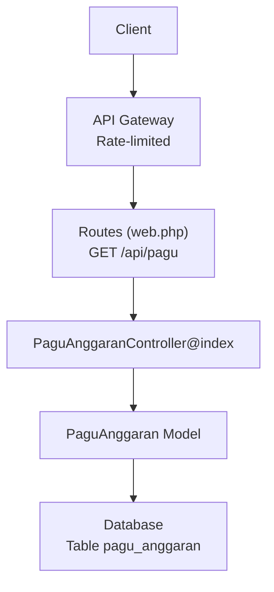
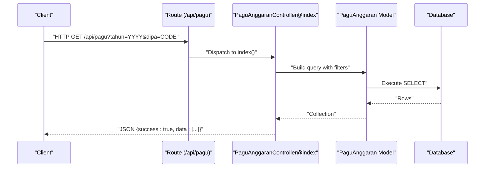
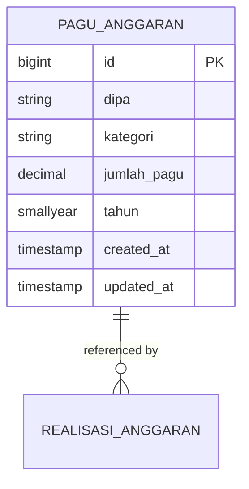
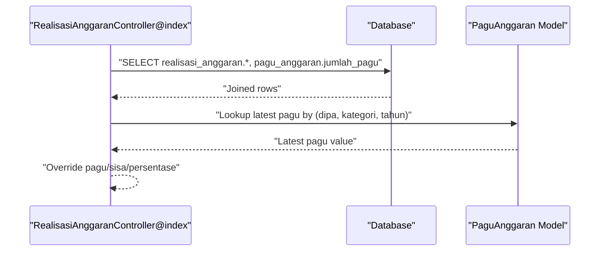
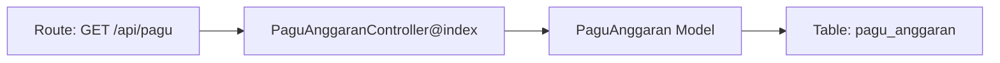

# Pagu Anggaran (Budget Allocation)

<cite>
**Referenced Files in This Document**
- [web.php](file://routes/web.php)
- [PaguAnggaranController.php](file://app/Http/Controllers/PaguAnggaranController.php)
- [PaguAnggaran.php](file://app/Models/PaguAnggaran.php)
- [RealisasiAnggaranController.php](file://app/Http/Controllers/RealisasiAnggaranController.php)
- [RealisasiAnggaran.php](file://app/Models/RealisasiAnggaran.php)
- [2026_02_10_000002_create_pagu_anggaran_table.php](file://database/migrations/2026_02_10_000002_create_pagu_anggaran_table.php)
</cite>

## Table of Contents
1. [Introduction](#introduction)
2. [Project Structure](#project-structure)
3. [Core Components](#core-components)
4. [Architecture Overview](#architecture-overview)
5. [Detailed Component Analysis](#detailed-component-analysis)
6. [Dependency Analysis](#dependency-analysis)
7. [Performance Considerations](#performance-considerations)
8. [Troubleshooting Guide](#troubleshooting-guide)
9. [Conclusion](#conclusion)

## Introduction
This document provides comprehensive API documentation for the Pagu Anggaran (Budget Allocation) module. It covers HTTP GET endpoints for listing budget allocations, filtering by budget year and DIPA code, and the standardized JSON response format. It also documents the underlying data model, validation rules, and error handling behavior. The documentation includes practical curl examples for common use cases such as budget planning, allocation verification, and funding tracking across categories.

## Project Structure
The Pagu Anggaran module is implemented as part of the API routes under the api prefix. The primary GET endpoint for listing pagu allocations is exposed via the route group with public access and rate limiting middleware. The controller handles query parameter filtering and returns a standardized JSON envelope.

**Diagram sources**
- [web.php:40](file://routes/web.php#L40)
- [PaguAnggaranController.php:11-18](file://app/Http/Controllers/PaguAnggaranController.php#L11-L18)
- [PaguAnggaran.php:7-11](file://app/Models/PaguAnggaran.php#L7-L11)
- [2026_02_10_000002_create_pagu_anggaran_table.php:14-22](file://database/migrations/2026_02_10_000002_create_pagu_anggaran_table.php#L14-L22)

**Section sources**
- [web.php:14-41](file://routes/web.php#L14-L41)

## Core Components
- Route: GET /api/pagu
  - Purpose: List pagu allocations with optional filters.
  - Authentication: Public (rate-limited).
  - Query parameters:
    - tahun (optional): Integer year filter.
    - dipa (optional): String DIPA filter.
  - Response: Standardized JSON envelope containing success flag and data array.

- Controller: PaguAnggaranController@index
  - Applies filters to the PaguAnggaran model.
  - Returns all matching records as an array.

- Model: PaguAnggaran
  - Table: pagu_anggaran
  - Fields: id, dipa, kategori, jumlah_pagu, tahun, timestamps.
  - Validation rules for creation/update are enforced in the controller.

- Database: pagu_anggaran
  - Unique constraint: (dipa, kategori, tahun) ensures one category per DIPA per year.
  - Precision: jumlah_pagu stored as decimal with 20 digits and 2 decimals.

**Section sources**
- [web.php:40](file://routes/web.php#L40)
- [PaguAnggaranController.php:11-18](file://app/Http/Controllers/PaguAnggaranController.php#L11-L18)
- [PaguAnggaran.php:7-11](file://app/Models/PaguAnggaran.php#L7-L11)
- [2026_02_10_000002_create_pagu_anggaran_table.php:14-22](file://database/migrations/2026_02_10_000002_create_pagu_anggaran_table.php#L14-L22)

## Architecture Overview
The GET /api/pagu endpoint follows a straightforward flow: the route delegates to the controller, which builds a query based on provided parameters, executes it against the PaguAnggaran model, and returns a standardized JSON response.

**Diagram sources**
- [web.php:40](file://routes/web.php#L40)
- [PaguAnggaranController.php:11-18](file://app/Http/Controllers/PaguAnggaranController.php#L11-L18)
- [PaguAnggaran.php:7-11](file://app/Models/PaguAnggaran.php#L7-L11)

## Detailed Component Analysis

### Endpoint Definition
- Method: GET
- Path: /api/pagu
- Filters:
  - tahun: integer year
  - dipa: string code
- Response envelope:
  - success: boolean
  - data: array of allocation objects

Allocation object fields:
- id: integer
- dipa: string
- kategori: string
- jumlah_pagu: number (decimal with 2 fractional digits)
- tahun: integer
- created_at: timestamp
- updated_at: timestamp

Notes:
- Pagination is not supported for GET /api/pagu; the controller returns all matched rows.
- Filtering is applied server-side using WHERE clauses on tahun and dipa.

**Section sources**
- [web.php:40](file://routes/web.php#L40)
- [PaguAnggaranController.php:11-18](file://app/Http/Controllers/PaguAnggaranController.php#L11-L18)
- [PaguAnggaran.php:7-11](file://app/Models/PaguAnggaran.php#L7-L11)
- [2026_02_10_000002_create_pagu_anggaran_table.php:14-22](file://database/migrations/2026_02_10_000002_create_pagu_anggaran_table.php#L14-L22)

### Request and Response Examples

- List all allocations:
  - curl: curl "https://web-api.pa-penajam.go.id/api/pagu"

- Filter by year:
  - curl: curl "https://web-api.pa-penajam.go.id/api/pagu?tahun=2025"

- Filter by DIPA:
  - curl: curl "https://web-api.pa-penajam.go.id/api/pagu?dipa=DIPA 01"

- Combined filters:
  - curl: curl "https://web-api.pa-penajam.go.id/api/pagu?tahun=2025&dipa=DIPA 04"

Response example:
{
  "success": true,
  "data": [
    {
      "id": 1,
      "dipa": "DIPA 01",
      "kategori": "Belanja Pegawai",
      "jumlah_pagu": 500000000.00,
      "tahun": 2025,
      "created_at": "2025-01-15T08:00:00Z",
      "updated_at": "2025-01-15T08:00:00Z"
    }
  ]
}

Validation and error handling:
- Invalid parameter types are silently ignored by the controller; only valid filters are applied.
- There is no explicit error payload for invalid parameters; clients should validate inputs prior to calling the endpoint.

**Section sources**
- [web.php:40](file://routes/web.php#L40)
- [PaguAnggaranController.php:11-18](file://app/Http/Controllers/PaguAnggaranController.php#L11-L18)

### Data Model and Constraints

Key points:
- Unique composite key: (dipa, kategori, tahun)
- Precision: jumlah_pagu is decimal with 20 digits and 2 decimals.
- Type casting: Model casts jumlah_pagu to decimal and tahun to integer.

**Diagram sources**
- [2026_02_10_000002_create_pagu_anggaran_table.php:14-22](file://database/migrations/2026_02_10_000002_create_pagu_anggaran_table.php#L14-L22)
- [PaguAnggaran.php:7-11](file://app/Models/PaguAnggaran.php#L7-L11)
- [RealisasiAnggaran.php:17-22](file://app/Models/RealisasiAnggaran.php#L17-L22)

**Section sources**
- [2026_02_10_000002_create_pagu_anggaran_table.php:14-22](file://database/migrations/2026_02_10_000002_create_pagu_anggaran_table.php#L14-L22)
- [PaguAnggaran.php:7-11](file://app/Models/PaguAnggaran.php#L7-L11)
- [RealisasiAnggaran.php:17-22](file://app/Models/RealisasiAnggaran.php#L17-L22)

### Relationship to Realisasi Anggaran
While GET /api/pagu does not support pagination, the Realisasi Anggaran module demonstrates how pagu values are consistently sourced from the latest master (PaguAnggaran) when retrieving realisasi records. This illustrates the authoritative nature of pagu data.

**Diagram sources**
- [RealisasiAnggaranController.php:11-53](file://app/Http/Controllers/RealisasiAnggaranController.php#L11-L53)
- [RealisasiAnggaran.php:17-22](file://app/Models/RealisasiAnggaran.php#L17-L22)

**Section sources**
- [RealisasiAnggaranController.php:11-53](file://app/Http/Controllers/RealisasiAnggaranController.php#L11-L53)
- [RealisasiAnggaran.php:17-22](file://app/Models/RealisasiAnggaran.php#L17-L22)

## Dependency Analysis
- Route dependency: GET /api/pagu depends on PaguAnggaranController@index.
- Controller dependency: PaguAnggaranController@index depends on PaguAnggaran model.
- Model dependency: PaguAnggaran relies on the pagu_anggaran database table.
- Data integrity: Unique constraint on (dipa, kategori, tahun) prevents duplicate category entries per DIPA per year.

**Diagram sources**
- [web.php:40](file://routes/web.php#L40)
- [PaguAnggaranController.php:11-18](file://app/Http/Controllers/PaguAnggaranController.php#L11-L18)
- [PaguAnggaran.php:7-11](file://app/Models/PaguAnggaran.php#L7-L11)
- [2026_02_10_000002_create_pagu_anggaran_table.php:14-22](file://database/migrations/2026_02_10_000002_create_pagu_anggaran_table.php#L14-L22)

**Section sources**
- [web.php:40](file://routes/web.php#L40)
- [PaguAnggaranController.php:11-18](file://app/Http/Controllers/PaguAnggaranController.php#L11-L18)
- [PaguAnggaran.php:7-11](file://app/Models/PaguAnggaran.php#L7-L11)
- [2026_02_10_000002_create_pagu_anggaran_table.php:14-22](file://database/migrations/2026_02_10_000002_create_pagu_anggaran_table.php#L14-L22)

## Performance Considerations
- Filtering: Queries are filtered by tahun and dipa; consider adding database indexes on these columns if query volume increases.
- Response size: GET /api/pagu returns all matching rows without pagination; for large datasets, expect larger payloads.
- Casting: Model casting ensures numeric precision for jumlah_pagu and integer for tahun.

[No sources needed since this section provides general guidance]

## Troubleshooting Guide
Common issues and resolutions:
- No results returned:
  - Verify tahun and dipa values match existing records.
  - Confirm the unique constraint (dipa, kategori, tahun) does not prevent expected rows from appearing.
- Unexpected empty data:
  - Ensure query parameters are integers/strings as expected by the controller.
  - The controller ignores invalid parameter types; re-check parameter names and values.
- Data validation errors:
  - Creation/updating uses strict validation in the controller; ensure payloads conform to required fields and types before calling POST endpoints.

**Section sources**
- [PaguAnggaranController.php:11-18](file://app/Http/Controllers/PaguAnggaranController.php#L11-L18)
- [PaguAnggaran.php:7-11](file://app/Models/PaguAnggaran.php#L7-L11)
- [2026_02_10_000002_create_pagu_anggaran_table.php:14-22](file://database/migrations/2026_02_10_000002_create_pagu_anggaran_table.php#L14-L22)

## Conclusion
The GET /api/pagu endpoint provides a simple, filterable interface for retrieving pagu allocation records. It supports filtering by year and DIPA, returns a standardized JSON envelope, and leverages the authoritative pagu data model. For budget planning, allocation verification, and funding tracking, combine GET /api/pagu with POST /api/pagu for updates and monitoring via GET /api/anggaran for realized figures.