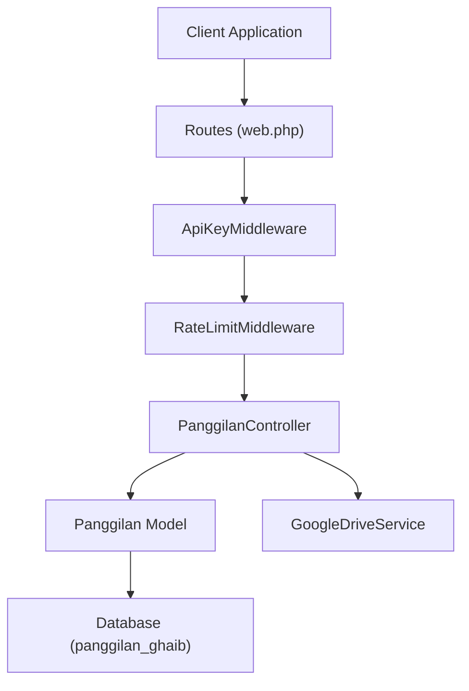
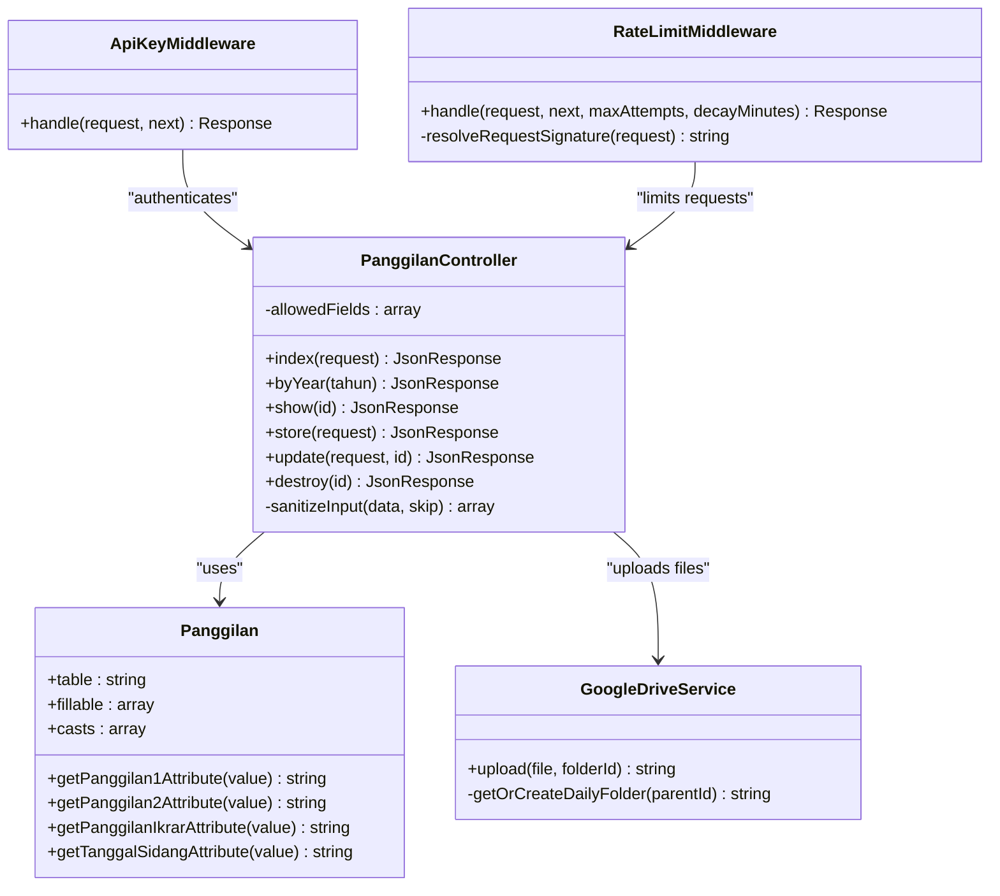
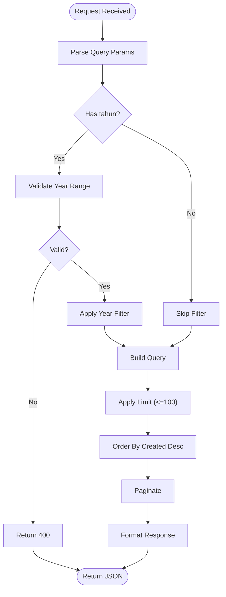
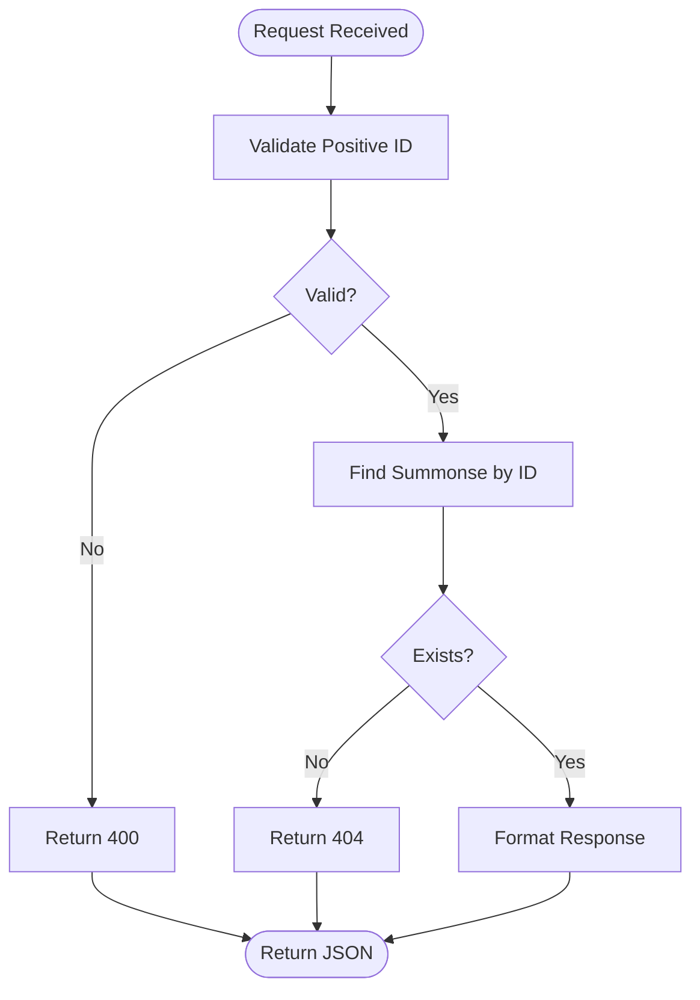
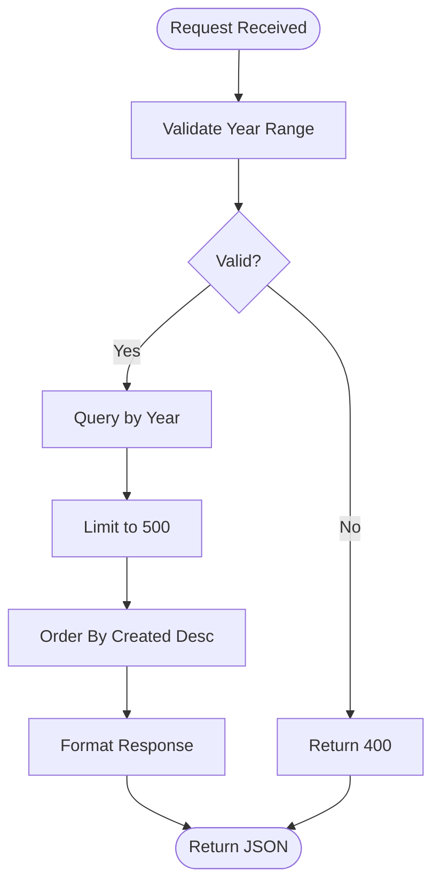
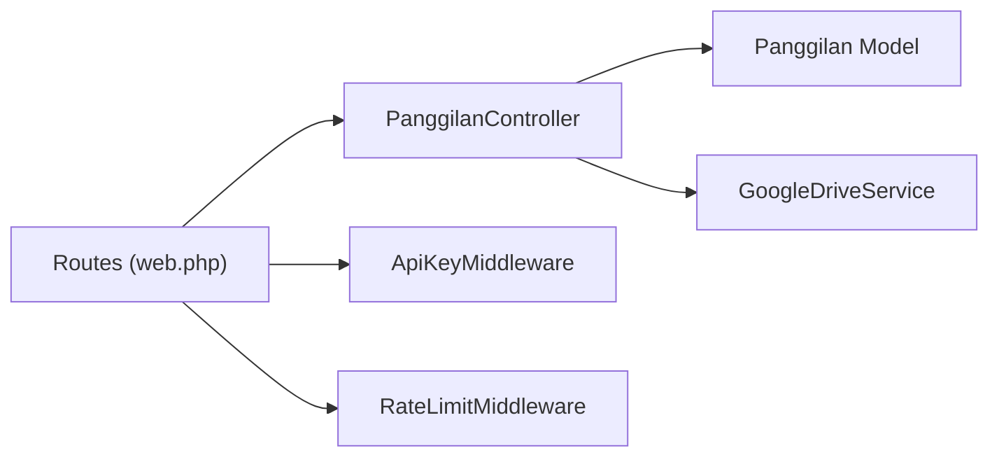

# Panggilan Ghaib (Court Summonses)

<cite>
**Referenced Files in This Document**
- [PanggilanController.php](file://app/Http/Controllers/PanggilanController.php)
- [Panggilan.php](file://app/Models/Panggilan.php)
- [2026_01_21_000001_create_panggilan_ghaib_table.php](file://database/migrations/2026_01_21_000001_create_panggilan_ghaib_table.php)
- [web.php](file://routes/web.php)
- [ApiKeyMiddleware.php](file://app/Http/Middleware/ApiKeyMiddleware.php)
- [RateLimitMiddleware.php](file://app/Http/Middleware/RateLimitMiddleware.php)
- [GoogleDriveService.php](file://app/Services/GoogleDriveService.php)
- [SECURITY.md](file://SECURITY.md)
- [data.sql](file://database/seeders/data.sql)
</cite>

## Table of Contents
1. [Introduction](#introduction)
2. [Project Structure](#project-structure)
3. [Core Components](#core-components)
4. [Architecture Overview](#architecture-overview)
5. [Detailed Component Analysis](#detailed-component-analysis)
6. [Dependency Analysis](#dependency-analysis)
7. [Performance Considerations](#performance-considerations)
8. [Troubleshooting Guide](#troubleshooting-guide)
9. [Conclusion](#conclusion)
10. [Appendices](#appendices)

## Introduction
This document provides comprehensive API documentation for the Panggilan Ghaib module, which manages court summonses and case notifications for the Penajam District Court. It covers all public endpoints for listing cases, retrieving individual cases, and filtering by year, along with protected endpoints for creating, updating, and deleting summonses. The documentation specifies URL patterns, query parameters, response schemas, pagination, search capabilities, data validation rules, error responses, rate limiting behavior, and practical curl examples for common use cases.

## Project Structure
The Panggilan Ghaib module is implemented as part of a Laravel Lumen application. The relevant components include:
- Routes: Define public and protected endpoints under the /api/panggilan namespace.
- Controller: Implements business logic for listing, filtering, retrieving, and managing summonses.
- Model: Defines the database schema and attribute casting for summonses.
- Middleware: Provides API key authentication and rate limiting.
- Services: Handles file uploads to Google Drive with fallback to local storage.
- Security: Centralized security policy and rate limiting configuration.



**Diagram sources**
- [web.php:14-84](file://routes/web.php#L14-L84)
- [PanggilanController.php:9-333](file://app/Http/Controllers/PanggilanController.php#L9-L333)
- [Panggilan.php:7-55](file://app/Models/Panggilan.php#L7-L55)
- [GoogleDriveService.php:9-117](file://app/Services/GoogleDriveService.php#L9-L117)
- [ApiKeyMiddleware.php:8-41](file://app/Http/Middleware/ApiKeyMiddleware.php#L8-L41)
- [RateLimitMiddleware.php:9-49](file://app/Http/Middleware/RateLimitMiddleware.php#L9-L49)

**Section sources**
- [web.php:14-84](file://routes/web.php#L14-L84)
- [PanggilanController.php:9-333](file://app/Http/Controllers/PanggilanController.php#L9-L333)
- [Panggilan.php:7-55](file://app/Models/Panggilan.php#L7-L55)

## Core Components
- Public endpoints (no API key required):
  - GET /api/panggilan: List all summonses with optional year filter and pagination.
  - GET /api/panggilan/{id}: Retrieve a specific summonse by numeric ID.
  - GET /api/panggilan/tahun/{tahun}: Retrieve summonses filtered by year.
- Protected endpoints (requires API key):
  - POST /api/panggilan: Create a new summonse.
  - PUT /api/panggilan/{id}: Update an existing summonse.
  - DELETE /api/panggilan/{id}: Delete a summonse.

Response schema:
- Standard JSON envelope with fields:
  - success: Boolean indicating operation outcome.
  - message: Human-readable message (present on errors and successful writes).
  - data: Array or object containing the payload.
  - Pagination fields when listing: current_page, last_page, per_page, total.
- Error responses include success=false and message with details.

Validation rules:
- Input validation is enforced for create/update operations with strict constraints on data types, lengths, formats, and optional file uploads.

Rate limiting:
- Public endpoints: 100 requests per minute per IP.
- Protected endpoints: 30 requests per minute per IP.

Security:
- API key authentication via X-API-Key header for protected endpoints.
- Timing-safe comparison and randomized delays to prevent brute-force attacks.
- XSS prevention via input sanitization and content-type verification.

**Section sources**
- [web.php:14-84](file://routes/web.php#L14-L84)
- [PanggilanController.php:31-110](file://app/Http/Controllers/PanggilanController.php#L31-L110)
- [SECURITY.md:17-51](file://SECURITY.md#L17-L51)

## Architecture Overview
The API follows a layered architecture:
- Routing layer defines endpoint patterns and applies middleware.
- Authentication and rate-limiting middleware enforce security policies.
- Controller handles request validation, data retrieval, and response formatting.
- Model encapsulates database access and attribute casting.
- Service layer manages external integrations (Google Drive) with fallback mechanisms.

```mermaid
sequenceDiagram
participant Client as "Client"
participant Router as "Routes"
participant APIKey as "ApiKeyMiddleware"
participant Throttle as "RateLimitMiddleware"
participant Ctrl as "PanggilanController"
participant Model as "Panggilan Model"
participant DB as "Database"
participant Drive as "GoogleDriveService"
Client->>Router : "HTTP Request"
Router->>APIKey : "Authenticate (protected)"
APIKey-->>Router : "Authorized or 401"
Router->>Throttle : "Apply rate limit"
Throttle-->>Ctrl : "Proceed"
Ctrl->>Model : "Query data"
Model->>DB : "Execute SQL"
DB-->>Model : "Results"
Model-->>Ctrl : "Mapped model(s)"
Ctrl->>Drive : "Upload file (optional)"
Drive-->>Ctrl : "URL or error"
Ctrl-->>Client : "JSON response"
```



**Diagram sources**
- [web.php:14-84](file://routes/web.php#L14-L84)
- [ApiKeyMiddleware.php:14-39](file://app/Http/Middleware/ApiKeyMiddleware.php#L14-L39)
- [RateLimitMiddleware.php:15-39](file://app/Http/Middleware/RateLimitMiddleware.php#L15-L39)
- [PanggilanController.php:115-198](file://app/Http/Controllers/PanggilanController.php#L115-L198)
- [Panggilan.php:7-55](file://app/Models/Panggilan.php#L7-L55)
- [GoogleDriveService.php:38-82](file://app/Services/GoogleDriveService.php#L38-L82)

## Detailed Component Analysis

### Public Endpoints

#### GET /api/panggilan
- Purpose: List all summonses with optional year filter and pagination.
- Query parameters:
  - tahun (optional): Integer year to filter cases.
  - limit (optional): Number of items per page (default 10, max 100).
- Response schema:
  - success: Boolean.
  - data: Array of summonses.
  - Pagination fields: current_page, last_page, per_page, total.
- Behavior:
  - Year filter is validated and sanitized.
  - Results are ordered by creation date descending.
  - Pagination respects the limit cap.

Common use cases:
- Case listing for dashboard display.
- Filtering by year for historical reports.

**Section sources**
- [PanggilanController.php:31-57](file://app/Http/Controllers/PanggilanController.php#L31-L57)
- [web.php:16-16](file://routes/web.php#L16-L16)

#### GET /api/panggilan/{id}
- Purpose: Retrieve a specific summonse by numeric ID.
- Path parameters:
  - id: Positive integer identifier.
- Response schema:
  - success: Boolean.
  - data: Single summonse object.
- Behavior:
  - Validates positive ID.
  - Returns 404 if not found.

Common use cases:
- Case status checking.
- Defendant information retrieval.

**Section sources**
- [PanggilanController.php:87-110](file://app/Http/Controllers/PanggilanController.php#L87-L110)
- [web.php:17-17](file://routes/web.php#L17-L17)

#### GET /api/panggilan/tahun/{tahun}
- Purpose: Retrieve summonses filtered by year.
- Path parameters:
  - tahun: Integer year (validated range).
- Response schema:
  - success: Boolean.
  - data: Array of summonses for the year.
  - total: Count of results.
- Behavior:
  - Validates year range.
  - Limits results to 500 items.

Common use cases:
- Case history tracking by year.
- Annual reporting.

**Section sources**
- [PanggilanController.php:62-82](file://app/Http/Controllers/PanggilanController.php#L62-L82)
- [web.php:18-18](file://routes/web.php#L18-L18)

### Protected Endpoints

#### POST /api/panggilan
- Purpose: Create a new summonse.
- Headers:
  - X-API-Key: Required for authentication.
- Body fields (validation enforced):
  - tahun_perkara: Required integer (2000–2100).
  - nomor_perkara: Required string (max 50), regex pattern.
  - nama_dipanggil: Required string (max 255).
  - alamat_asal: Optional string (max 1000).
  - panggilan_1: Optional date.
  - panggilan_2: Optional date.
  - panggilan_ikrar: Optional date.
  - tanggal_sidang: Optional date.
  - pip: Optional string (max 100).
  - file_upload: Optional file (PDF, DOC, DOCX, JPG, JPEG, PNG, max 5MB).
  - keterangan: Optional string (max 1000).
- Response schema:
  - success: Boolean.
  - message: Confirmation message.
  - data: Created summonse object.
- Behavior:
  - Whitelisted fields only.
  - Input sanitization (with exceptions for specific fields).
  - File upload to Google Drive with fallback to local storage.

Common use cases:
- Adding new summonses from external systems.
- Uploading supporting documents.

**Section sources**
- [PanggilanController.php:115-198](file://app/Http/Controllers/PanggilanController.php#L115-L198)
- [web.php:81-81](file://routes/web.php#L81-L81)

#### PUT /api/panggilan/{id}
- Purpose: Update an existing summonse.
- Headers:
  - X-API-Key: Required for authentication.
- Path parameters:
  - id: Positive integer identifier.
- Body fields (validation enforced):
  - Same as POST with optional fields.
- Response schema:
  - success: Boolean.
  - message: Confirmation message.
  - data: Updated summonse object (fresh).
- Behavior:
  - Validates ID and existence.
  - Whitelisted fields only.
  - File upload replaces previous attachment if provided.

Common use cases:
- Updating case dates and statuses.
- Replacing uploaded documents.

**Section sources**
- [PanggilanController.php:203-299](file://app/Http/Controllers/PanggilanController.php#L203-L299)
- [web.php:82-84](file://routes/web.php#L82-L84)

#### DELETE /api/panggilan/{id}
- Purpose: Delete a summonse.
- Headers:
  - X-API-Key: Required for authentication.
- Path parameters:
  - id: Positive integer identifier.
- Response schema:
  - success: Boolean.
  - message: Confirmation message.
- Behavior:
  - Validates ID and existence.

Common use cases:
- Removing obsolete or incorrect entries.

**Section sources**
- [PanggilanController.php:305-330](file://app/Http/Controllers/PanggilanController.php#L305-L330)
- [web.php:84-84](file://routes/web.php#L84-L84)

### Data Model and Validation

#### Database Schema (panggilan_ghaib)
- Fields:
  - tahun_perkara: Year.
  - nomor_perkara: String (unique index).
  - nama_dipanggil: String.
  - alamat_asal: Text.
  - panggilan_1, panggilan_2, panggilan_ikrar, tanggal_sidang: Dates.
  - pip: String.
  - link_surat: String.
  - keterangan: Text.
  - timestamps: Created/updated.
- Indexes:
  - Index on tahun_perkara and nomor_perkara for efficient queries.

#### Attribute Casting and Output Formatting
- Date attributes are cast to date type.
- Output dates are formatted as YYYY-MM-DD strings.

**Section sources**
- [2026_01_21_000001_create_panggilan_ghaib_table.php:13-31](file://database/migrations/2026_01_21_000001_create_panggilan_ghaib_table.php#L13-L31)
- [Panggilan.php:25-54](file://app/Models/Panggilan.php#L25-L54)

### File Upload and Storage
- Google Drive integration:
  - Uses Google Drive SDK with client credentials and refresh token.
  - Creates daily subfolders and sets public read permission.
  - Returns a web view link for the uploaded file.
- Fallback to local storage:
  - On failure, saves file to public/uploads/panggilan with sanitized filename.
  - Generates a URL based on request root.

**Section sources**
- [GoogleDriveService.php:38-82](file://app/Services/GoogleDriveService.php#L38-L82)
- [PanggilanController.php:139-189](file://app/Http/Controllers/PanggilanController.php#L139-L189)

### Security and Rate Limiting
- API key authentication:
  - Header: X-API-Key.
  - Timing-safe comparison and randomized delay on failure.
- Rate limiting:
  - Public endpoints: 100 requests per minute per IP.
  - Protected endpoints: 30 requests per minute per IP.
  - Returns Retry-After header on 429 responses.
- Additional protections:
  - Input validation and sanitization.
  - XSS prevention and content-type verification.
  - Strict CORS configuration guidance.

**Section sources**
- [ApiKeyMiddleware.php:14-39](file://app/Http/Middleware/ApiKeyMiddleware.php#L14-L39)
- [RateLimitMiddleware.php:15-39](file://app/Http/Middleware/RateLimitMiddleware.php#L15-L39)
- [SECURITY.md:17-51](file://SECURITY.md#L17-L51)

## Architecture Overview



**Diagram sources**
- [PanggilanController.php:9-333](file://app/Http/Controllers/PanggilanController.php#L9-L333)
- [Panggilan.php:7-55](file://app/Models/Panggilan.php#L7-L55)
- [GoogleDriveService.php:9-117](file://app/Services/GoogleDriveService.php#L9-L117)
- [ApiKeyMiddleware.php:8-41](file://app/Http/Middleware/ApiKeyMiddleware.php#L8-L41)
- [RateLimitMiddleware.php:9-49](file://app/Http/Middleware/RateLimitMiddleware.php#L9-L49)

## Detailed Component Analysis

### Endpoint Flow: Listing Cases with Year Filter


**Diagram sources**
- [PanggilanController.php:31-57](file://app/Http/Controllers/PanggilanController.php#L31-L57)

### Endpoint Flow: Individual Case Retrieval


**Diagram sources**
- [PanggilanController.php:87-110](file://app/Http/Controllers/PanggilanController.php#L87-L110)

### Endpoint Flow: Year-Based Listing


**Diagram sources**
- [PanggilanController.php:62-82](file://app/Http/Controllers/PanggilanController.php#L62-L82)

### Endpoint Flow: File Upload with Fallback

```mermaid
flowchart TD
Start(["Upload Request"]) --> TryDrive["Try Google Drive Upload"]
TryDrive --> DriveSuccess{"Drive Success?"}
DriveSuccess --> |Yes| SaveDrive["Save Drive Link"]
DriveSuccess --> |No| TryLocal["Try Local Storage"]
TryLocal --> LocalSuccess{"Local Success?"}
LocalSuccess --> |Yes| SaveLocal["Save Local Link"]
LocalSuccess --> |No| Return500["Return 500"]
SaveDrive --> Done(["Continue Save/Update"])
SaveLocal --> Done
Return500 --> End(["Error Response"])
Done --> End
```


**Diagram sources**
- [PanggilanController.php:139-189](file://app/Http/Controllers/PanggilanController.php#L139-L189)
- [GoogleDriveService.php:38-82](file://app/Services/GoogleDriveService.php#L38-L82)

## Dependency Analysis
- Routes depend on controller actions and middleware.
- Controller depends on the model and service for file handling.
- Middleware enforces security policies across endpoints.
- Model depends on database schema and attribute casting.



**Diagram sources**
- [web.php:14-84](file://routes/web.php#L14-L84)
- [PanggilanController.php:9-333](file://app/Http/Controllers/PanggilanController.php#L9-L333)
- [Panggilan.php:7-55](file://app/Models/Panggilan.php#L7-L55)
- [GoogleDriveService.php:9-117](file://app/Services/GoogleDriveService.php#L9-L117)
- [ApiKeyMiddleware.php:8-41](file://app/Http/Middleware/ApiKeyMiddleware.php#L8-L41)
- [RateLimitMiddleware.php:9-49](file://app/Http/Middleware/RateLimitMiddleware.php#L9-L49)

**Section sources**
- [web.php:14-84](file://routes/web.php#L14-L84)
- [PanggilanController.php:9-333](file://app/Http/Controllers/PanggilanController.php#L9-L333)

## Performance Considerations
- Pagination limits prevent excessive memory usage on large datasets.
- Database indexes on tahun_perkara and nomor_perkara improve query performance.
- File uploads are asynchronous and fall back to local storage if cloud storage fails.
- Rate limiting protects the API from abuse and ensures fair usage.

[No sources needed since this section provides general guidance]

## Troubleshooting Guide
- Unauthorized (401):
  - Ensure X-API-Key header is present and matches the configured API key.
  - Verify API key configuration and timing-safe comparison behavior.
- Too Many Requests (429):
  - Respect the rate limit (100/min for public, 30/min for protected).
  - Observe Retry-After header for backoff.
- Bad Request (400):
  - Validate input fields against the documented constraints.
  - Check year range, date formats, and file types.
- Not Found (404):
  - Confirm the summonse ID exists.
- Internal Server Error (500):
  - Review logs for file upload failures and fallback behavior.

**Section sources**
- [ApiKeyMiddleware.php:14-39](file://app/Http/Middleware/ApiKeyMiddleware.php#L14-L39)
- [RateLimitMiddleware.php:22-28](file://app/Http/Middleware/RateLimitMiddleware.php#L22-L28)
- [PanggilanController.php:118-130](file://app/Http/Controllers/PanggilanController.php#L118-L130)
- [SECURITY.md:17-51](file://SECURITY.md#L17-L51)

## Conclusion
The Panggilan Ghaib API provides a secure, well-structured interface for managing court summonses. Public endpoints enable read-only access with robust filtering and pagination, while protected endpoints support full CRUD operations with strong validation and file handling. Security measures, including API key authentication, rate limiting, and input sanitization, ensure reliable and safe usage. The documentation and examples below should facilitate integration and maintenance.

[No sources needed since this section summarizes without analyzing specific files]

## Appendices

### API Reference Summary
- Base URL: /api/panggilan
- Public endpoints:
  - GET /api/panggilan
  - GET /api/panggilan/{id}
  - GET /api/panggilan/tahun/{tahun}
- Protected endpoints:
  - POST /api/panggilan
  - PUT /api/panggilan/{id}
  - DELETE /api/panggilan/{id}

Headers:
- X-API-Key: Required for protected endpoints.

Query parameters:
- tahun (GET /api/panggilan): Integer year filter.
- limit (GET /api/panggilan): Items per page (default 10, max 100).

Response schema:
- Standard JSON envelope with success, message, data, and pagination fields.

Validation rules:
- Refer to controller validation rules for create/update operations.

Rate limiting:
- Public: 100/min per IP.
- Protected: 30/min per IP.

**Section sources**
- [web.php:14-84](file://routes/web.php#L14-L84)
- [PanggilanController.php:118-130](file://app/Http/Controllers/PanggilanController.php#L118-L130)
- [SECURITY.md:17-21](file://SECURITY.md#L17-L21)

### Curl Examples

- List cases with pagination:
  ```bash
  curl -X GET https://your-domain.com/api/panggilan
  ```

- Filter cases by year:
  ```bash
  curl -X GET https://your-domain.com/api/panggilan/tahun/2025
  ```

- Retrieve a specific case:
  ```bash
  curl -X GET https://your-domain.com/api/panggilan/123
  ```

- Create a new case (protected):
  ```bash
  curl -X POST https://your-domain.com/api/panggilan \
    -H "X-API-Key: YOUR_API_KEY" \
    -H "Content-Type: application/json" \
    -d '{"tahun_perkara":2025,"nomor_perkara":"123/Pdt.G/2025/PA.Pnj","nama_dipanggil":"John Doe"}'
  ```

- Update a case (protected):
  ```bash
  curl -X PUT https://your-domain.com/api/panggilan/123 \
    -H "X-API-Key: YOUR_API_KEY" \
    -H "Content-Type: application/json" \
    -d '{"panggilan_1":"2025-06-01","tanggal_sidang":"2025-06-15"}'
  ```

- Delete a case (protected):
  ```bash
  curl -X DELETE https://your-domain.com/api/panggilan/123 \
    -H "X-API-Key: YOUR_API_KEY"
  ```

Notes:
- Replace YOUR_API_KEY with a valid key.
- Adjust base URL to your deployment.

**Section sources**
- [web.php:14-84](file://routes/web.php#L14-L84)
- [PanggilanController.php:115-198](file://app/Http/Controllers/PanggilanController.php#L115-L198)

### Sample Data
- Seed data includes multiple years and various case attributes for testing and demonstration.

**Section sources**
- [data.sql:1-175](file://database/seeders/data.sql#L1-L175)