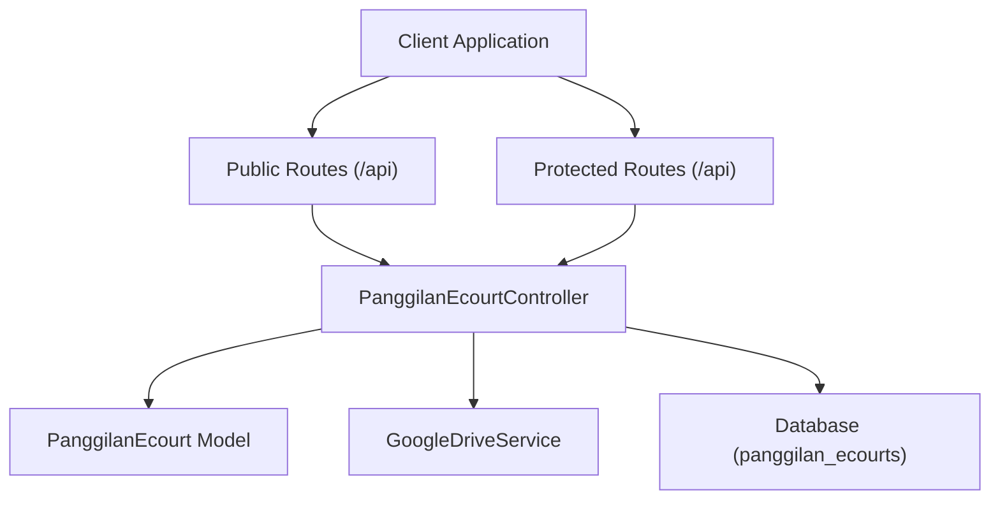
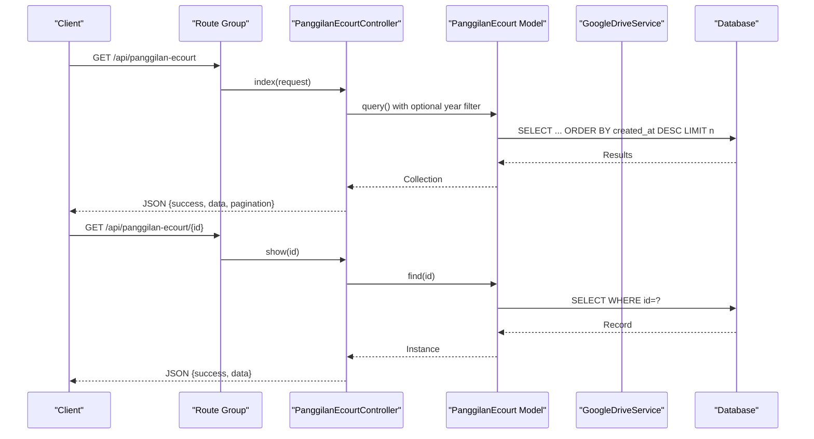
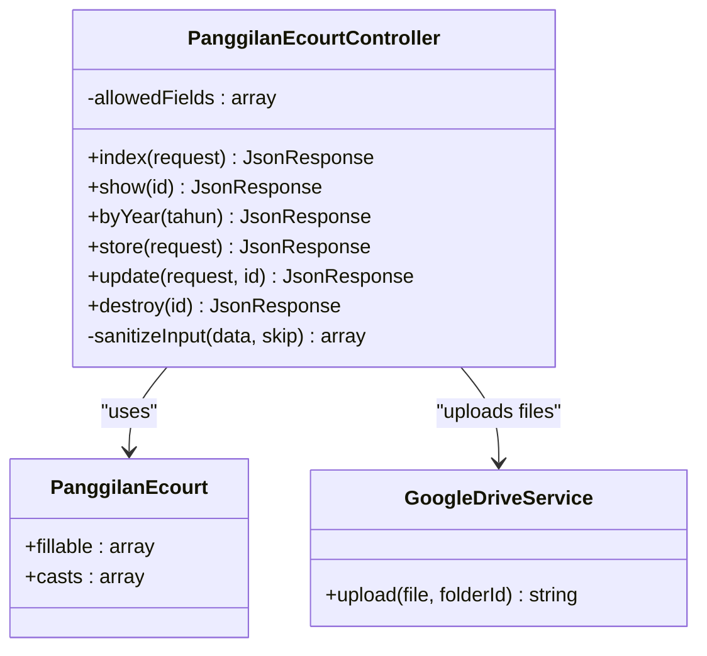
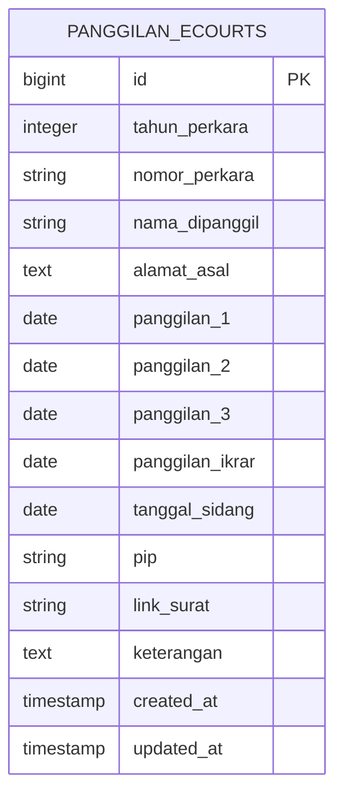

# Panggilan e-Court (Electronic Court Summons)

<cite>
**Referenced Files in This Document**
- [PanggilanEcourtController.php](file://app/Http/Controllers/PanggilanEcourtController.php)
- [PanggilanEcourt.php](file://app/Models/PanggilanEcourt.php)
- [2026_01_25_162515_create_panggilan_ecourts_table.php](file://database/migrations/2026_01_25_162515_create_panggilan_ecourts_table.php)
- [web.php](file://routes/web.php)
- [ApiKeyMiddleware.php](file://app/Http/Middleware/ApiKeyMiddleware.php)
- [RateLimitMiddleware.php](file://app/Http/Middleware/RateLimitMiddleware.php)
- [GoogleDriveService.php](file://app/Services/GoogleDriveService.php)
- [PanggilanEcourtSeeder.php](file://database/seeders/PanggilanEcourtSeeder.php)
- [SECURITY.md](file://SECURITY.md)
</cite>

## Table of Contents
1. [Introduction](#introduction)
2. [Project Structure](#project-structure)
3. [Core Components](#core-components)
4. [Architecture Overview](#architecture-overview)
5. [Detailed Component Analysis](#detailed-component-analysis)
6. [Dependency Analysis](#dependency-analysis)
7. [Performance Considerations](#performance-considerations)
8. [Troubleshooting Guide](#troubleshooting-guide)
9. [Conclusion](#conclusion)
10. [Appendices](#appendices)

## Introduction
This document provides comprehensive API documentation for the Panggilan e-Court module, which manages electronic summonses and digital case tracking for the Panggilan Ghaib PA Penajam system. It covers HTTP GET endpoints for listing digital summonses, retrieving individual summonses, and year-based filtering, along with standardized JSON response schemas, pagination details, data validation rules, error responses, rate limiting behavior, and practical curl examples for common use cases such as digital summons verification, case status tracking, and electronic notification management.

## Project Structure
The API is built on Laravel Lumen and exposes public endpoints under the /api/prefix with route groups that apply rate limiting. Protected endpoints require an API key and are throttled at a lower rate than public endpoints. The controller handles request validation, sanitization, pagination, and integrates with Google Drive for file uploads.



**Diagram sources**
- [web.php:14-76](file://routes/web.php#L14-L76)
- [PanggilanEcourtController.php:32-112](file://app/Http/Controllers/PanggilanEcourtController.php#L32-L112)
- [PanggilanEcourt.php:7-32](file://app/Models/PanggilanEcourt.php#L7-L32)
- [GoogleDriveService.php:9-22](file://app/Services/GoogleDriveService.php#L9-L22)

**Section sources**
- [web.php:14-76](file://routes/web.php#L14-L76)
- [SECURITY.md:17-21](file://SECURITY.md#L17-L21)

## Core Components
- Public endpoints (GET):
  - List all summonses with optional pagination and limit enforcement
  - Retrieve a single summonse by numeric ID
  - Filter summonses by year
- Protected endpoints (POST/PUT/DELETE):
  - Create, update, and delete summonses (require API key)
  - File upload support with Google Drive fallback to local storage
- Data model:
  - Strongly typed fields with integer casting for year and date casting for call dates and hearing date
- Middleware:
  - API key authentication for protected routes
  - Rate limiting for both public and protected routes

**Section sources**
- [PanggilanEcourtController.php:32-112](file://app/Http/Controllers/PanggilanEcourtController.php#L32-L112)
- [PanggilanEcourt.php:9-31](file://app/Models/PanggilanEcourt.php#L9-L31)
- [web.php:24-27](file://routes/web.php#L24-L27)
- [ApiKeyMiddleware.php:14-39](file://app/Http/Middleware/ApiKeyMiddleware.php#L14-L39)
- [RateLimitMiddleware.php:15-39](file://app/Http/Middleware/RateLimitMiddleware.php#L15-L39)

## Architecture Overview
The API follows a layered architecture:
- Routing layer defines public and protected route groups with middleware
- Controller layer validates inputs, applies filters, paginates results, and orchestrates file uploads
- Model layer defines fillable attributes and type casting
- Service layer handles Google Drive integration with fallback to local storage
- Database layer persists structured case data



**Diagram sources**
- [web.php:24-27](file://routes/web.php#L24-L27)
- [PanggilanEcourtController.php:32-112](file://app/Http/Controllers/PanggilanEcourtController.php#L32-L112)
- [PanggilanEcourt.php:7-32](file://app/Models/PanggilanEcourt.php#L7-L32)

## Detailed Component Analysis

### HTTP GET: List Digital Summonses
- URL Pattern: GET /api/panggilan-ecourt
- Query Parameters:
  - limit (optional): Integer, default 500, max 2000
  - tahun (optional): Integer year filter (validated 2000–2100)
- Pagination:
  - Items per page is controlled by limit
  - Response includes current_page, last_page, per_page, total
- Response Schema:
  - success: Boolean
  - data: Array of summonse objects
  - current_page, last_page, per_page, total: Numeric pagination metadata
- Error Responses:
  - 400 Bad Request: Invalid tahun parameter out of range
  - 429 Too Many Requests: Rate limit exceeded (includes Retry-After header)
- Rate Limiting:
  - Public endpoints: 100 requests per minute per IP

Common Use Cases:
- Bulk retrieval for dashboards and reporting
- Filtering by year for annual reports

**Section sources**
- [PanggilanEcourtController.php:32-59](file://app/Http/Controllers/PanggilanEcourtController.php#L32-L59)
- [web.php:24-27](file://routes/web.php#L24-L27)
- [SECURITY.md:19-21](file://SECURITY.md#L19-L21)

### HTTP GET: Retrieve Individual Summonse
- URL Pattern: GET /api/panggilan-ecourt/{id}
- Path Parameter:
  - id: Positive integer (route constraint enforces numeric)
- Response Schema:
  - success: Boolean
  - data: Single summonse object
- Error Responses:
  - 400 Bad Request: Non-positive id
  - 404 Not Found: No summonse found for id
  - 429 Too Many Requests: Rate limit exceeded
- Rate Limiting:
  - Public endpoints: 100 requests per minute per IP

Common Use Cases:
- Digital summons verification
- Case status tracking for a specific record

**Section sources**
- [PanggilanEcourtController.php:89-112](file://app/Http/Controllers/PanggilanEcourtController.php#L89-L112)
- [web.php:26-26](file://routes/web.php#L26-L26)
- [SECURITY.md:19-21](file://SECURITY.md#L19-L21)

### HTTP GET: Year-Based Filtering
- URL Pattern: GET /api/panggilan-ecourt/tahun/{tahun}
- Path Parameter:
  - tahun: Integer year (validated 2000–2100)
- Response Schema:
  - success: Boolean
  - data: Array of summonses for the given year
  - total: Count of records
- Error Responses:
  - 400 Bad Request: Invalid year out of range
- Rate Limiting:
  - Public endpoints: 100 requests per minute per IP

Common Use Cases:
- Annual case tracking
- Electronic notification management by year

**Section sources**
- [PanggilanEcourtController.php:64-84](file://app/Http/Controllers/PanggilanEcourtController.php#L64-L84)
- [web.php:27-27](file://routes/web.php#L27-L27)
- [SECURITY.md:19-21](file://SECURITY.md#L19-L21)

### Data Model and Validation Rules
- Fields (fillable):
  - tahun_perkara (integer)
  - nomor_perkara (string, max 50, regex pattern)
  - nama_dipanggil (string, max 255)
  - alamat_asal (text, max 1000)
  - panggilan_1, panggilan_2, panggilan_3, panggilan_ikrar, tanggal_sidang (dates)
  - pip (string, max 100)
  - link_surat (string)
  - keterangan (text, max 1000)
- Validation Rules (protected endpoints):
  - tahun_perkara: required, integer, min 2000, max 2100
  - nomor_perkara: required, string, max 50, regex pattern
  - nama_dipanggil: required, string, max 255
  - alamat_asal: nullable, string, max 1000
  - panggilan_* and tanggal_sidang: nullable, date
  - pip: nullable, string, max 100
  - file_upload: nullable, file, mime types pdf, doc, docx, jpg, jpeg, png, max 5120 KB
  - keterangan: nullable, string, max 1000
- Type Casting:
  - tahun_perkara: integer
  - panggilan_1, panggilan_2, panggilan_3, panggilan_ikrar, tanggal_sidang: date

**Section sources**
- [PanggilanEcourt.php:9-31](file://app/Models/PanggilanEcourt.php#L9-L31)
- [PanggilanEcourtController.php:120-133](file://app/Http/Controllers/PanggilanEcourtController.php#L120-L133)
- [2026_01_25_162515_create_panggilan_ecourts_table.php:13-28](file://database/migrations/2026_01_25_162515_create_panggilan_ecourts_table.php#L13-L28)

### File Upload and Storage
- Supported file types: pdf, doc, docx, jpg, jpeg, png
- Maximum file size: 5 MB
- Priority: Google Drive upload
- Fallback: Local storage under public/uploads/panggilan_ecourt
- Generated link stored in link_surat field

**Section sources**
- [PanggilanEcourtController.php:131-192](file://app/Http/Controllers/PanggilanEcourtController.php#L131-L192)
- [GoogleDriveService.php:38-82](file://app/Services/GoogleDriveService.php#L38-L82)

### Authentication and Rate Limiting
- API Key:
  - Header: X-API-Key
  - Required for protected endpoints (POST/PUT/DELETE)
  - Timing-safe comparison and random delay on failure
- Rate Limits:
  - Public endpoints: 100 requests per minute per IP
  - Protected endpoints: 30 requests per minute per IP
  - Exceeded limits return 429 with Retry-After header

**Section sources**
- [ApiKeyMiddleware.php:14-39](file://app/Http/Middleware/ApiKeyMiddleware.php#L14-L39)
- [RateLimitMiddleware.php:15-39](file://app/Http/Middleware/RateLimitMiddleware.php#L15-L39)
- [SECURITY.md:17-21](file://SECURITY.md#L17-L21)

### Concrete curl Examples

- List summonses with pagination and limit:
  ```bash
  curl -s "https://your-domain.com/api/panggilan-ecourt?limit=500" -H "Accept: application/json"
  ```

- Retrieve a specific summonse by ID:
  ```bash
  curl -s "https://your-domain.com/api/panggilan-ecourt/123" -H "Accept: application/json"
  ```

- Filter summonses by year:
  ```bash
  curl -s "https://your-domain.com/api/panggilan-ecourt/tahun/2025" -H "Accept: application/json"
  ```

- Create a summonse (protected endpoint, requires API key):
  ```bash
  curl -s -X POST "https://your-domain.com/api/panggilan-ecourt" \
    -H "X-API-Key: YOUR_API_KEY" \
    -H "Accept: application/json" \
    -F "tahun_perkara=2025" \
    -F "nomor_perkara=40/Pdt.G/2025/PA.Pnj" \
    -F "nama_dipanggil=John Doe" \
    -F "file_upload=@/path/to/document.pdf"
  ```

- Update a summonse (protected endpoint):
  ```bash
  curl -s -X PUT "https://your-domain.com/api/panggilan-ecourt/123" \
    -H "X-API-Key: YOUR_API_KEY" \
    -H "Accept: application/json" \
    -F "keterangan=Updated note" \
    -F "file_upload=@/path/to/updated.pdf"
  ```

- Delete a summonse (protected endpoint):
  ```bash
  curl -s -X DELETE "https://your-domain.com/api/panggilan-ecourt/123" \
    -H "X-API-Key: YOUR_API_KEY" \
    -H "Accept: application/json"
  ```

Notes:
- Replace YOUR_API_KEY with a valid API key configured in the environment.
- Adjust the base URL to your deployment domain.
- For file uploads, ensure the file path is accessible locally.

**Section sources**
- [web.php:24-27](file://routes/web.php#L24-L27)
- [ApiKeyMiddleware.php:16-35](file://app/Http/Middleware/ApiKeyMiddleware.php#L16-L35)
- [SECURITY.md:15-15](file://SECURITY.md#L15-L15)

## Dependency Analysis
The controller depends on the model for data access and on the Google Drive service for file uploads. The route group applies middleware for rate limiting and API key validation.



**Diagram sources**
- [PanggilanEcourtController.php:9-336](file://app/Http/Controllers/PanggilanEcourtController.php#L9-L336)
- [PanggilanEcourt.php:7-32](file://app/Models/PanggilanEcourt.php#L7-L32)
- [GoogleDriveService.php:9-117](file://app/Services/GoogleDriveService.php#L9-L117)

**Section sources**
- [PanggilanEcourtController.php:5-27](file://app/Http/Controllers/PanggilanEcourtController.php#L5-L27)
- [PanggilanEcourt.php:9-22](file://app/Models/PanggilanEcourt.php#L9-L22)

## Performance Considerations
- Pagination defaults to 500 items with a hard cap of 2000 to prevent memory exhaustion.
- Year filtering reduces dataset size for large deployments.
- File uploads are asynchronous and fall back to local storage if Google Drive is unavailable.
- Rate limiting protects against abuse and ensures fair resource allocation.

[No sources needed since this section provides general guidance]

## Troubleshooting Guide
- 400 Bad Request:
  - Invalid year parameter (out of range 2000–2100)
  - Invalid ID (non-positive)
  - Validation errors for required fields or file upload constraints
- 401 Unauthorized:
  - Missing or invalid X-API-Key header
- 404 Not Found:
  - Summonse not found for the given ID
- 429 Too Many Requests:
  - Exceeded rate limit; observe Retry-After header
- 500 Internal Server Error:
  - Server configuration error (e.g., missing API key)
  - Google Drive upload failure with local fallback

**Section sources**
- [PanggilanEcourtController.php:67-106](file://app/Http/Controllers/PanggilanEcourtController.php#L67-L106)
- [ApiKeyMiddleware.php:20-35](file://app/Http/Middleware/ApiKeyMiddleware.php#L20-L35)
- [RateLimitMiddleware.php:22-28](file://app/Http/Middleware/RateLimitMiddleware.php#L22-L28)

## Conclusion
The Panggilan e-Court API provides a secure, scalable solution for managing electronic summonses and digital case tracking. It offers robust public endpoints for read-only operations, strict validation and sanitization, resilient file upload handling, and strong security measures including API key authentication and rate limiting. The documented endpoints, response schemas, and curl examples enable straightforward integration for digital summons verification, case status tracking, and electronic notification management.

[No sources needed since this section summarizes without analyzing specific files]

## Appendices

### Response Schemas

- Standard Success Response:
  - success: Boolean
  - data: Mixed (array for list, object for single item)
  - Pagination metadata (when applicable): current_page, last_page, per_page, total

- Error Response:
  - success: Boolean (false)
  - message: String describing the error

**Section sources**
- [PanggilanEcourtController.php:51-58](file://app/Http/Controllers/PanggilanEcourtController.php#L51-L58)
- [PanggilanEcourtController.php:68-105](file://app/Http/Controllers/PanggilanEcourtController.php#L68-L105)

### Data Model Diagram



**Diagram sources**
- [2026_01_25_162515_create_panggilan_ecourts_table.php:13-28](file://database/migrations/2026_01_25_162515_create_panggilan_ecourts_table.php#L13-L28)

### Example Data (from Seeder)
- Sample records demonstrate typical fields including year, case number, name, address, call dates, hearing date, PIP note, and link to document.

**Section sources**
- [PanggilanEcourtSeeder.php:18-301](file://database/seeders/PanggilanEcourtSeeder.php#L18-L301)