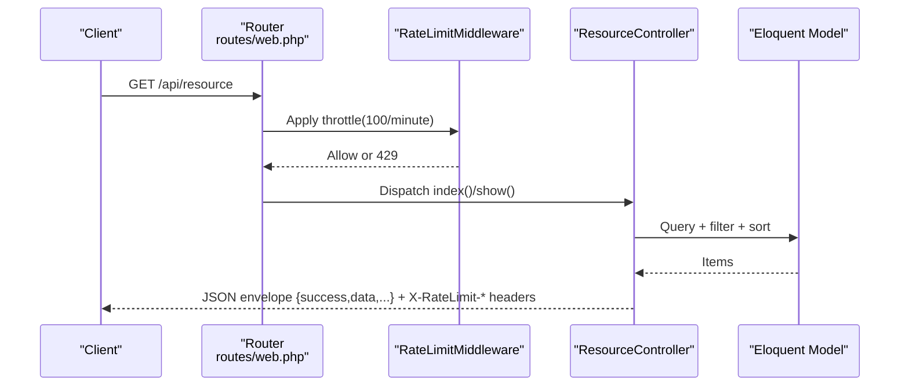
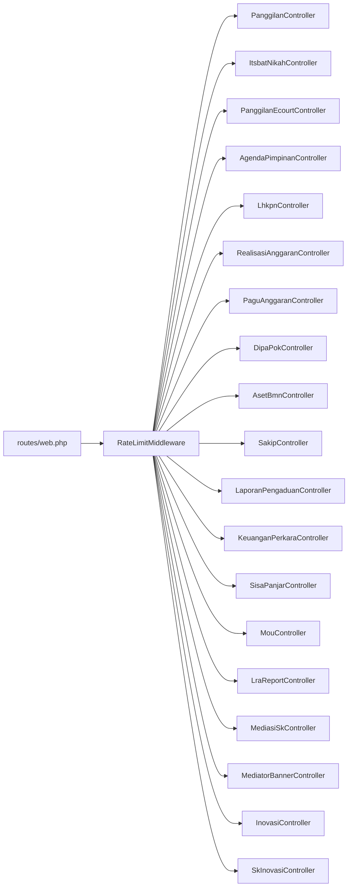

# Public Endpoints (Read-Only)

<cite>
**Referenced Files in This Document**
- [routes/web.php](file://routes/web.php)
- [RateLimitMiddleware.php](file://app/Http/Middleware/RateLimitMiddleware.php)
- [Controller.php](file://app/Http/Controllers/Controller.php)
- [PanggilanController.php](file://app/Http/Controllers/PanggilanController.php)
- [ItsbatNikahController.php](file://app/Http/Controllers/ItsbatNikahController.php)
- [PanggilanEcourtController.php](file://app/Http/Controllers/PanggilanEcourtController.php)
- [AgendaPimpinanController.php](file://app/Http/Controllers/AgendaPimpinanController.php)
- [LhkpnController.php](file://app/Http/Controllers/LhkpnController.php)
- [RealisasiAnggaranController.php](file://app/Http/Controllers/RealisasiAnggaranController.php)
- [PaguAnggaranController.php](file://app/Http/Controllers/PaguAnggaranController.php)
- [DipaPokController.php](file://app/Http/Controllers/DipaPokController.php)
- [AsetBmnController.php](file://app/Http/Controllers/AsetBmnController.php)
- [SakipController.php](file://app/Http/Controllers/SakipController.php)
- [LaporanPengaduanController.php](file://app/Http/Controllers/LaporanPengaduanController.php)
- [KeuanganPerkaraController.php](file://app/Http/Controllers/KeuanganPerkaraController.php)
- [SisaPanjarController.php](file://app/Http/Controllers/SisaPanjarController.php)
- [MouController.php](file://app/Http/Controllers/MouController.php)
- [LraReportController.php](file://app/Http/Controllers/LraReportController.php)
- [MediasiSkController.php](file://app/Http/Controllers/MediasiSkController.php)
- [MediatorBannerController.php](file://app/Http/Controllers/MediatorBannerController.php)
- [InovasiController.php](file://app/Http/Controllers/InovasiController.php)
- [SkInovasiController.php](file://app/Http/Controllers/SkInovasiController.php)
- [Panggilan.php](file://app/Models/Panggilan.php)
- [ItsbatNikah.php](file://app/Models/ItsbatNikah.php)
- [Inovasi.php](file://app/Models/Inovasi.php)
- [SkInovasi.php](file://app/Models/SkInovasi.php)
</cite>

## Update Summary
**Changes Made**
- Added new Innovation Data endpoints section covering Inovasi and SkInovasi resources
- Updated architecture overview to include innovation endpoints
- Added detailed documentation for innovation records and directives
- Updated dependency analysis to include new innovation controllers

## Table of Contents
1. [Introduction](#introduction)
2. [Project Structure](#project-structure)
3. [Core Components](#core-components)
4. [Architecture Overview](#architecture-overview)
5. [Detailed Component Analysis](#detailed-component-analysis)
6. [Dependency Analysis](#dependency-analysis)
7. [Performance Considerations](#performance-considerations)
8. [Troubleshooting Guide](#troubleshooting-guide)
9. [Conclusion](#conclusion)

## Introduction
This document describes all public read-only endpoints exposed by the API. These endpoints are secured with a global rate limiter of 100 requests per minute per client IP. Each endpoint group covers:
- Base listing endpoint
- Individual record retrieval
- Specialized filtering where applicable
- Query parameters, pagination, and response schemas
- Example curl commands and notes on search/filtering and validation

## Project Structure
Public endpoints are grouped under the api prefix and protected by a throttle middleware configured to 100 requests per minute. The route definitions map HTTP GET requests to controller actions.

```mermaid
graph TB
Client["Client"] --> Router["Lumen Router<br/>routes/web.php"]
Router --> Throttle["Rate Limit Middleware<br/>100/minute/IP"]
Throttle --> CtrlPanggilan["PanggilanController@index/show"]
Throttle --> CtrlItsbat["ItsbatNikahController@index/show"]
Throttle --> CtrlEcourt["PanggilanEcourtController@index/show"]
Throttle --> CtrlAgenda["AgendaPimpinanController@index/show"]
Throttle --> CtrlLhkpn["LhkpnController@index/show"]
Throttle --> CtrlAnggaran["RealisasiAnggaranController@index/show"]
Throttle --> CtrlPagu["PaguAnggaranController@index"]
Throttle --> CtrlDipa["DipaPokController@index/show"]
Throttle --> CtrlBmn["AsetBmnController@index/show"]
Throttle --> CtrlSakip["SakipController@index/show"]
Throttle --> CtrlPengaduan["LaporanPengaduanController@index/show"]
Throttle --> CtrlKeu["KeuanganPerkaraController@index/show"]
Throttle --> CtrlPanjar["SisaPanjarController@index/show"]
Throttle --> CtrlMou["MouController@index/show"]
Throttle --> CtrlLra["LraReportController@index/show"]
Throttle --> CtrlMediasi["MediasiSkController@index/show"]
Throttle --> CtrlBanners["MediatorBannerController@index/show"]
Throttle --> CtrlInovasi["InovasiController@index/show"]
Throttle --> CtrlSkInovasi["SkInovasiController@index/show"]
```

**Diagram sources**
- [routes/web.php:13-90](file://routes/web.php#L13-L90)
- [RateLimitMiddleware.php:15-39](file://app/Http/Middleware/RateLimitMiddleware.php#L15-L39)

**Section sources**
- [routes/web.php:13-90](file://routes/web.php#L13-L90)

## Core Components
- Route Group: All public endpoints live under /api with middleware throttle:100,1 applied globally.
- Rate Limiting: Enforced via a custom middleware that increments counters per IP and returns a 429 response after exceeding the limit, including Retry-After header.
- Standardized Responses: Most controllers return a consistent JSON envelope with success flag and data payload; some controllers use a status field for listing responses.

Key behaviors:
- Pagination: Many endpoints support pagination with current_page, last_page, per_page, total.
- Validation: Controllers validate inputs and return structured errors for invalid parameters.
- Search and Filters: Some endpoints support query parameters for filtering and keyword search.

**Section sources**
- [routes/web.php:13-90](file://routes/web.php#L13-L90)
- [RateLimitMiddleware.php:15-39](file://app/Http/Middleware/RateLimitMiddleware.php#L15-L39)
- [Controller.php:18-29](file://app/Http/Controllers/Controller.php#L18-L29)

## Architecture Overview
The public API follows a simple pattern:
- HTTP GET to /api/<resource> returns paginated lists
- HTTP GET to /api/<resource>/<id> returns a single record
- HTTP GET to /api/<resource>?filter=value filters by specified criteria where supported
- Responses include rate limit headers and standardized envelopes

**Diagram sources**
- [routes/web.php:13-90](file://routes/web.php#L13-L90)
- [RateLimitMiddleware.php:15-39](file://app/Http/Middleware/RateLimitMiddleware.php#L15-L39)

## Detailed Component Analysis

### Base Endpoint: Health Check
- Method: GET
- Path: /
- Purpose: Basic health check
- Response: JSON with status and message
- Notes: Not rate-limited in the provided routes; consider adding middleware if needed.

**Section sources**
- [routes/web.php:5-11](file://routes/web.php#L5-L11)

### Resource: Panggilan Ghaib
- Base Path: /api/panggilan
- Methods:
  - GET /api/panggilan
    - Query params:
      - tahun (optional integer within 2000–2100)
      - limit (optional integer, capped at 100)
    - Pagination: Yes
    - Response envelope: success, data[], current_page, last_page, per_page, total
  - GET /api/panggilan/{id}
    - Validates positive integer id
    - Response: success, data
  - GET /api/panggilan/tahun/{tahun}
    - Validates year range 2000–2100
    - Response: success, data[], total
- Data model: Uses app/Models/Panggilan.php with date casting and date formatting helpers.

Example curl:
- List: curl "https://host/api/panggilan?tahun=2024&limit=20"
- By ID: curl "https://host/api/panggilan/123"
- By Year: curl "https://host/api/panggilan/tahun/2024"

Validation and search:
- tahun validated and filtered server-side
- limit clamped to prevent excessive load

**Section sources**
- [routes/web.php:16-18](file://routes/web.php#L16-L18)
- [PanggilanController.php:31-57](file://app/Http/Controllers/PanggilanController.php#L31-L57)
- [PanggilanController.php:62-82](file://app/Http/Controllers/PanggilanController.php#L62-L82)
- [PanggilanController.php:87-110](file://app/Http/Controllers/PanggilanController.php#L87-L110)
- [Panggilan.php:25-53](file://app/Models/Panggilan.php#L25-L53)

### Resource: Itsbat Nikah
- Base Path: /api/itsbat
- Methods:
  - GET /api/itsbat
    - Query params:
      - tahun (optional)
      - q (optional keyword search across nomor_perkara, pemohon_1, pemohon_2)
      - limit (default 10)
    - Sorting: Descending by tanggal_sidang
    - Response: success, data[], pagination fields
  - GET /api/itsbat/{id}
    - Response: success, data
- Data model: app/Models/ItsbatNikah.php

Example curl:
- List: curl "https://host/api/itsbat?q=pratama&tahun=2024&limit=15"
- Detail: curl "https://host/api/itsbat/456"

Validation and search:
- q triggers LIKE search on multiple fields
- tahun filters by year

**Section sources**
- [routes/web.php:21-22](file://routes/web.php#L21-L22)
- [ItsbatNikahController.php:10-43](file://app/Http/Controllers/ItsbatNikahController.php#L10-L43)
- [ItsbatNikahController.php:119-128](file://app/Http/Controllers/ItsbatNikahController.php#L119-L128)
- [ItsbatNikah.php:11-24](file://app/Models/ItsbatNikah.php#L11-L24)

### Resource: Panggilan e-Court
- Base Path: /api/panggilan-ecourt
- Methods:
  - GET /api/panggilan-ecourt
  - GET /api/panggilan-ecourt/{id}
  - GET /api/panggilan-ecourt/tahun/{tahun}
- Behavior mirrors Panggilan Ghaib with year filtering.

Example curl:
- List: curl "https://host/api/panggilan-ecourt?limit=25"
- Detail: curl "https://host/api/panggilan-ecourt/789"
- By Year: curl "https://host/api/panggilan-ecourt/tahun/2025"

Validation and search:
- Year validated 2000–2100
- Limit behavior similar to Panggilan Ghaib

**Section sources**
- [routes/web.php:25-27](file://routes/web.php#L25-L27)

### Resource: Agenda Pimpinan
- Base Path: /api/agenda
- Methods:
  - GET /api/agenda
    - Query params:
      - bulan (01–12)
      - tahun (e.g., 2025)
      - per_page (default varies; use per_page=all to fetch all without pagination)
    - Sorting: Descending by tanggal_agenda
    - Response: status success with data and optional pagination fields
  - GET /api/agenda/{id}
    - Response: status success, data
- Notes: per_page=all returns a flat array without pagination metadata.

Example curl:
- List: curl "https://host/api/agenda?bulan=03&tahun=2025&per_page=10"
- All: curl "https://host/api/agenda?per_page=all"
- Detail: curl "https://host/api/agenda/1001"

**Section sources**
- [routes/web.php:30-31](file://routes/web.php#L30-L31)
- [AgendaPimpinanController.php:17-58](file://app/Http/Controllers/AgendaPimpinanController.php#L17-L58)
- [AgendaPimpinanController.php:95-104](file://app/Http/Controllers/AgendaPimpinanController.php#L95-L104)

### Resource: LHKPN Reports
- Base Path: /api/lhkpn
- Methods:
  - GET /api/lhkpn
    - Query params:
      - tahun (optional)
      - jenis (optional)
      - q (optional search by nama or nip)
      - per_page (default 15)
    - Sorting: Descending by tahun, then custom order by jabatan, then nama
    - Response: success, data[], pagination fields
  - GET /api/lhkpn/{id}
    - Response: success, data
- Notes: Search uses OR conditions on nama and nip.

Example curl:
- List: curl "https://host/api/lhkpn?tahun=2024&jenis=LHKPN&q=john&per_page=20"
- Detail: curl "https://host/api/lhkpn/2001"

**Section sources**
- [routes/web.php:34-35](file://routes/web.php#L34-L35)
- [LhkpnController.php:11-53](file://app/Http/Controllers/LhkpnController.php#L11-L53)
- [LhkpnController.php:92-97](file://app/Http/Controllers/LhkpnController.php#L92-L97)

### Resource: Realisasi Anggaran
- Base Path: /api/anggaran
- Methods:
  - GET /api/anggaran
    - Query params:
      - tahun (optional)
      - bulan (optional)
      - dipa (optional)
      - q (optional search by kategori)
      - per_page (default 15)
    - Sorting: Descending by tahun, ascending by dipa/bulan/kategori
    - Response: success, data[], pagination fields
    - Notes: Data is joined with latest pagu from master to compute pagu, sisa, and persentase dynamically
  - GET /api/anggaran/{id}
    - Response: success, data (with computed pagu/sisa/persentase from master)
- Notes: Search and filters are applied before pagination.

Example curl:
- List: curl "https://host/api/anggaran?tahun=2025&dipa=PA01&per_page=25"
- Detail: curl "https://host/api/anggaran/3001"

**Section sources**
- [routes/web.php:38-39](file://routes/web.php#L38-L39)
- [RealisasiAnggaranController.php:11-53](file://app/Http/Controllers/RealisasiAnggaranController.php#L11-L53)
- [RealisasiAnggaranController.php:122-130](file://app/Http/Controllers/RealisasiAnggaranController.php#L122-L130)

### Resource: Pagu Anggaran
- Base Path: /api/pagu
- Methods:
  - GET /api/pagu
    - Query params:
      - tahun (optional)
      - dipa (optional)
    - Response: success, data[] (flat list of pagu records)
- Notes: Used by Realisasi Anggaran to compute dynamic values.

Example curl:
- curl "https://host/api/pagu?tahun=2025&dipa=PA01"

**Section sources**
- [routes/web.php](file://routes/web.php#L40)
- [PaguAnggaranController.php:11-18](file://app/Http/Controllers/PaguAnggaranController.php#L11-L18)

### Resource: DIPA/POK
- Base Path: /api/dipapok
- Methods:
  - GET /api/dipapok
    - Query params:
      - tahun (optional)
      - q (optional search by jns_dipa or revisi_dipa)
      - per_page (default 15)
    - Sorting: Descending by thn_dipa, then descending by kode_dipa
    - Response: success, data[], pagination fields
  - GET /api/dipapok/{id}
    - Response: success, data
- Notes: Search uses OR on jns_dipa and revisi_dipa.

Example curl:
- List: curl "https://host/api/dipapok?tahun=2025&q=Dipa&per_page=20"
- Detail: curl "https://host/api/dipapok/4001"

**Section sources**
- [routes/web.php:43-44](file://routes/web.php#L43-L44)
- [DipaPokController.php:10-39](file://app/Http/Controllers/DipaPokController.php#L10-L39)
- [DipaPokController.php:98-113](file://app/Http/Controllers/DipaPokController.php#L98-L113)

### Resource: Aset BMN
- Base Path: /api/aset-bmn
- Methods:
  - GET /api/aset-bmn
    - Query params:
      - tahun (optional)
    - Sorting: Descending by tahun, then fixed order by jenis_laporan
    - Response: success, data[], total
  - GET /api/aset-bmn/{id}
    - Response: success, data
- Notes: Valid jenis_laporan values are constrained; duplicates prevented.

Example curl:
- List: curl "https://host/api/aset-bmn?tahun=2024&limit=50"
- Detail: curl "https://host/api/aset-bmn/5001"

**Section sources**
- [routes/web.php:47-48](file://routes/web.php#L47-L48)
- [AsetBmnController.php:32-54](file://app/Http/Controllers/AsetBmnController.php#L32-L54)
- [AsetBmnController.php:59-66](file://app/Http/Controllers/AsetBmnController.php#L59-L66)

### Resource: SAKIP
- Base Path: /api/sakip
- Methods:
  - GET /api/sakip
    - Query params:
      - tahun (optional)
    - Sorting: Descending by tahun, then fixed order by jenis_dokumen
    - Response: success, data[], total
  - GET /api/sakip/{id}
    - Validates positive id
    - Response: success, data
  - GET /api/sakip/tahun/{tahun}
    - Validates year 2000–2100
    - Response: success, data[], total
- Notes: Valid jenis_dokumen values are constrained; duplicates prevented.

Example curl:
- List: curl "https://host/api/sakip?tahun=2025&limit=30"
- Detail: curl "https://host/api/sakip/6001"
- By Year: curl "https://host/api/sakip/tahun/2025"

**Section sources**
- [routes/web.php:51-53](file://routes/web.php#L51-L53)
- [SakipController.php:34-56](file://app/Http/Controllers/SakipController.php#L34-L56)
- [SakipController.php:85-106](file://app/Http/Controllers/SakipController.php#L85-L106)
- [SakipController.php:61-80](file://app/Http/Controllers/SakipController.php#L61-L80)

### Resource: Laporan Pengaduan
- Base Path: /api/laporan-pengaduan
- Methods:
  - GET /api/laporan-pengaduan
    - Query params:
      - tahun (optional)
    - Sorting: Descending by tahun, then fixed order by materi_pengaduan
    - Response: success, data[], total
  - GET /api/laporan-pengaduan/{id}
    - Response: success, data
  - GET /api/laporan-pengaduan/tahun/{tahun}
    - Validates year 2000–2100
    - Response: success, data[], total
- Notes: materi_pengaduan must be one of predefined values; duplicates prevented.

Example curl:
- List: curl "https://host/api/laporan-pengaduan?tahun=2024&limit=40"
- Detail: curl "https://host/api/laporan-pengaduan/7001"
- By Year: curl "https://host/api/laporan-pengaduan/tahun/2024"

**Section sources**
- [routes/web.php:56-58](file://routes/web.php#L56-L58)
- [LaporanPengaduanController.php:30-50](file://app/Http/Controllers/LaporanPengaduanController.php#L30-L50)
- [LaporanPengaduanController.php:65-72](file://app/Http/Controllers/LaporanPengaduanController.php#L65-L72)
- [LaporanPengaduanController.php:52-63](file://app/Http/Controllers/LaporanPengaduanController.php#L52-L63)

### Resource: Keuangan Perkara
- Base Path: /api/keuangan-perkara
- Methods:
  - GET /api/keuangan-perkara
    - Query params:
      - tahun (optional)
    - Sorting: Descending by tahun, ascending by bulan
    - Response: success, data[], total
  - GET /api/keuangan-perkara/{id}
    - Response: success, data
  - GET /api/keuangan-perkara/tahun/{tahun}
    - Validates year 2000–2100
    - Response: success, data[], total
- Notes: Duplicate prevention by tahun+bulan; numeric fields validated.

Example curl:
- List: curl "https://host/api/keuangan-perkara?tahun=2025&limit=24"
- Detail: curl "https://host/api/keuangan-perkara/8001"
- By Year: curl "https://host/api/keuangan-perkara/tahun/2025"

**Section sources**
- [routes/web.php:61-63](file://routes/web.php#L61-L63)
- [KeuanganPerkaraController.php:15-33](file://app/Http/Controllers/KeuanganPerkaraController.php#L15-L33)
- [KeuanganPerkaraController.php:48-55](file://app/Http/Controllers/KeuanganPerkaraController.php#L48-L55)
- [KeuanganPerkaraController.php:35-46](file://app/Http/Controllers/KeuanganPerkaraController.php#L35-L46)

### Resource: Sisa Panjar
- Base Path: /api/sisa-panjar
- Methods:
  - GET /api/sisa-panjar
    - Query params:
      - tahun (optional)
      - status (optional: belum_diambil or disetor_kas_negara)
      - bulan (optional: 1–12)
      - limit (optional, capped at 500)
    - Sorting: Descending by created_at
    - Pagination: Yes; limit enforced to protect public page performance
    - Response: success, data[], pagination fields
  - GET /api/sisa-panjar/{id}
    - Validates positive id
    - Response: success, data
  - GET /api/sisa-panjar/tahun/{tahun}
    - Validates year 2000–2100
    - Response: success, data[], total (limited to 500)
- Notes: Designed for public DataTable consumption; enforced limits.

Example curl:
- List: curl "https://host/api/sisa-panjar?tahun=2024&status=belum_diambil&limit=200"
- Detail: curl "https://host/api/sisa-panjar/9001"
- By Year: curl "https://host/api/sisa-panjar/tahun/2024"

**Section sources**
- [routes/web.php:66-68](file://routes/web.php#L66-L68)
- [SisaPanjarController.php:21-61](file://app/Http/Controllers/SisaPanjarController.php#L21-L61)
- [SisaPanjarController.php:85-107](file://app/Http/Controllers/SisaPanjarController.php#L85-L107)
- [SisaPanjarController.php:63-83](file://app/Http/Controllers/SisaPanjarController.php#L63-L83)

### Resource: MOU
- Base Path: /api/mou
- Methods:
  - GET /api/mou
    - Query params:
      - tahun (optional)
    - Sorting: Descending by tanggal
    - Response: success, data[], pagination fields
    - Notes: Status and days remaining are computed dynamically for each item
  - GET /api/mou/{id}
    - Response: success, data (with computed status and sisa_hari)
- Notes: Dynamic status derived from tanggal and tanggal_berakhir.

Example curl:
- List: curl "https://host/api/mou?tahun=2025&per_page=20"
- Detail: curl "https://host/api/mou/10001"

**Section sources**
- [routes/web.php:71-72](file://routes/web.php#L71-L72)
- [MouController.php:10-37](file://app/Http/Controllers/MouController.php#L10-L37)
- [MouController.php:39-49](file://app/Http/Controllers/MouController.php#L39-L49)

### Resource: LRA Reports
- Base Path: /api/lra
- Methods:
  - GET /api/lra
  - GET /api/lra/{id}
- Notes: No specialized year endpoint defined in routes; year filtering would require extending controller.

Example curl:
- List: curl "https://host/api/lra?limit=25"
- Detail: curl "https://host/api/lra/11001"

**Section sources**
- [routes/web.php:74-75](file://routes/web.php#L74-L75)

### Resource: Mediasi SK
- Base Path: /api/mediasi-sk
- Methods:
  - GET /api/mediasi-sk
    - Query params:
      - tahun (optional)
    - Sorting: Descending by created_at
    - Response: success, data[], pagination fields
  - GET /api/mediasi-sk/{id}
    - Response: success, data
- Notes: Year filtering supported via query parameter.

Example curl:
- List: curl "https://host/api/mediasi-sk?tahun=2025&limit=20"
- Detail: curl "https://host/api/mediasi-sk/12001"

**Section sources**
- [routes/web.php:78-79](file://routes/web.php#L78-L79)
- [MediasiSkController.php:1-200](file://app/Http/Controllers/MediasiSkController.php#L1-L200)

### Resource: Mediator Banners
- Base Path: /api/mediator-banners
- Methods:
  - GET /api/mediator-banners
    - Response: success, data[]
  - GET /api/mediator-banners/{id}
    - Response: success, data
- Notes: Simple resource with no filtering parameters.

Example curl:
- List: curl "https://host/api/mediator-banners?limit=15"
- Detail: curl "https://host/api/mediator-banners/13001"

**Section sources**
- [routes/web.php:80-81](file://routes/web.php#L80-L81)
- [MediatorBannerController.php:1-200](file://app/Http/Controllers/MediatorBannerController.php#L1-L200)

### Resource: Innovation Records
- Base Path: /api/inovasi
- Methods:
  - GET /api/inovasi
    - Query params:
      - kategori (optional string filter)
    - Sorting: Ascending by urutan, then ascending by nama_inovasi
    - Response: success, data[], total
  - GET /api/inovasi/{id}
    - Validates positive integer id
    - Response: success, data
- Notes: Read-only endpoint for innovation records with category filtering and ordered display.

Example curl:
- List: curl "https://host/api/inovasi?kategori=Inovasi Layanan&limit=50"
- Detail: curl "https://host/api/inovasi/14001"

**Updated** Added new innovation records endpoint

**Section sources**
- [routes/web.php:88-89](file://routes/web.php#L88-L89)
- [InovasiController.php:22-44](file://app/Http/Controllers/InovasiController.php#L22-L44)
- [InovasiController.php:49-70](file://app/Http/Controllers/InovasiController.php#L49-L70)
- [Inovasi.php:11-23](file://app/Models/Inovasi.php#L11-L23)

### Resource: Innovation Directives/SK
- Base Path: /api/sk-inovasi
- Methods:
  - GET /api/sk-inovasi
    - Query params:
      - tahun (optional integer filter)
      - active (optional boolean filter)
    - Sorting: Descending by tahun (latest first)
    - Response: success, data[]
  - GET /api/sk-inovasi/{id}
    - Response: success, data
- Notes: Read-only endpoint for innovation directives with year and active status filtering.

Example curl:
- List: curl "https://host/api/sk-inovasi?tahun=2025&active=1&limit=20"
- Detail: curl "https://host/api/sk-inovasi/15001"

**Updated** Added new innovation directives endpoint

**Section sources**
- [routes/web.php:84-85](file://routes/web.php#L84-L85)
- [SkInovasiController.php:11-29](file://app/Http/Controllers/SkInovasiController.php#L11-L29)
- [SkInovasiController.php:31-46](file://app/Http/Controllers/SkInovasiController.php#L31-L46)
- [SkInovasi.php:25-38](file://app/Models/SkInovasi.php#L25-L38)

## Dependency Analysis
- Routing depends on Lumen router and middleware stack.
- Controllers depend on Eloquent models and shared base controller utilities.
- Rate limiting is centralized in a middleware that uses cache to track attempts per IP.

**Diagram sources**
- [routes/web.php:13-90](file://routes/web.php#L13-L90)
- [RateLimitMiddleware.php:15-39](file://app/Http/Middleware/RateLimitMiddleware.php#L15-L39)

**Section sources**
- [routes/web.php:13-90](file://routes/web.php#L13-L90)
- [RateLimitMiddleware.php:15-39](file://app/Http/Middleware/RateLimitMiddleware.php#L15-L39)

## Performance Considerations
- Global rate limit: 100 requests per minute per IP to prevent abuse.
- Pagination defaults: Many endpoints default to small per_page values; use limit/ per_page thoughtfully.
- Data volume caps:
  - Sisa Panjar enforces a maximum limit of 500 items for public listing and year queries.
  - Some endpoints cap results to 500 to avoid heavy loads.
- File uploads: Uploads are handled with fallback to local storage if cloud service fails; this impacts latency and availability.
- Dynamic computations: Some endpoints compute status or derived metrics on-the-fly; prefer filtering and sorting at the database level where possible.
- Innovation endpoints: Both Inovasi and SkInovasi endpoints are designed for efficient read-only access with minimal processing overhead.

## Troubleshooting Guide
Common issues and resolutions:
- Too Many Requests (429):
  - Symptom: JSON body with success=false, message "Too many requests...", retry_after seconds; headers X-RateLimit-Limit and X-RateLimit-Remaining present.
  - Resolution: Wait for the Retry-After window or reduce request frequency.
- Invalid ID:
  - Symptom: 400 Bad Request with message indicating invalid ID.
  - Resolution: Ensure ID is a positive integer.
- Not Found:
  - Symptom: 404 Not Found with message indicating data not found.
  - Resolution: Verify the record exists or adjust filters.
- Validation Errors:
  - Symptom: 400/422 with field-specific messages for invalid parameters (e.g., out-of-range years, invalid enums).
  - Resolution: Adjust query parameters to match allowed ranges and enumerations.
- Rate limit headers:
  - Inspect X-RateLimit-Limit and X-RateLimit-Remaining to monitor your quota.

**Section sources**
- [RateLimitMiddleware.php:22-28](file://app/Http/Middleware/RateLimitMiddleware.php#L22-L28)
- [PanggilanController.php:89-95](file://app/Http/Controllers/PanggilanController.php#L89-L95)
- [SakipController.php:87-92](file://app/Http/Controllers/SakipController.php#L87-L92)
- [SisaPanjarController.php:87-92](file://app/Http/Controllers/SisaPanjarController.php#L87-L92)

## Conclusion
The public read-only API provides consistent, paginated access to multiple datasets with standardized JSON responses and robust validation. A global rate limit of 100 requests per minute protects the system from abuse. Use the documented query parameters, pagination controls, and filtering options to efficiently retrieve data. For bulk retrieval, consider batching and respecting rate limits to avoid throttling.

The addition of innovation data endpoints (Inovasi and SkInovasi) enhances the API's capability to expose institutional innovation initiatives and directives, providing clients with comprehensive access to innovation-related information through standardized RESTful interfaces.