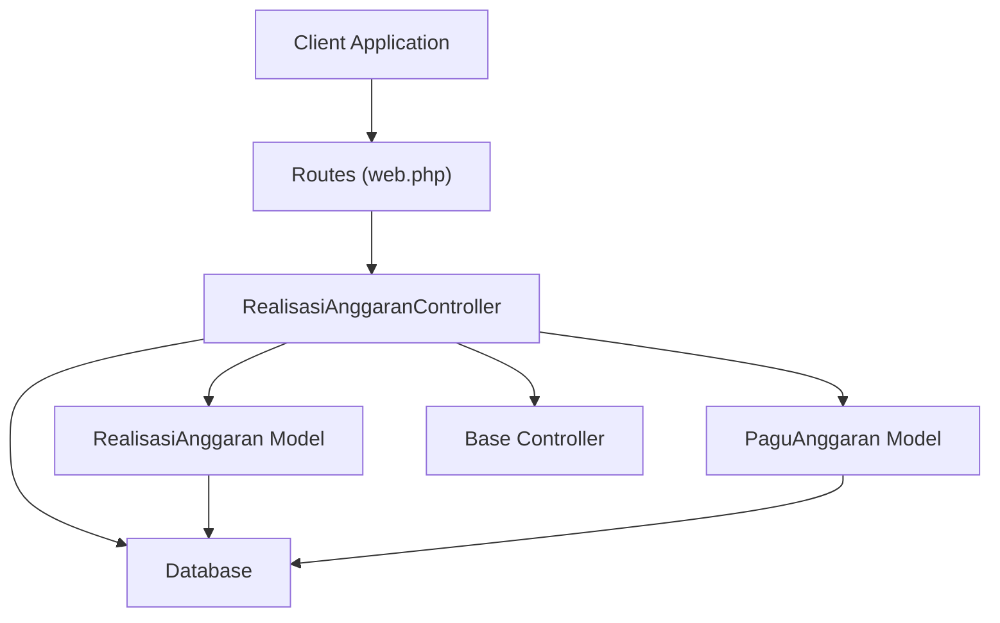
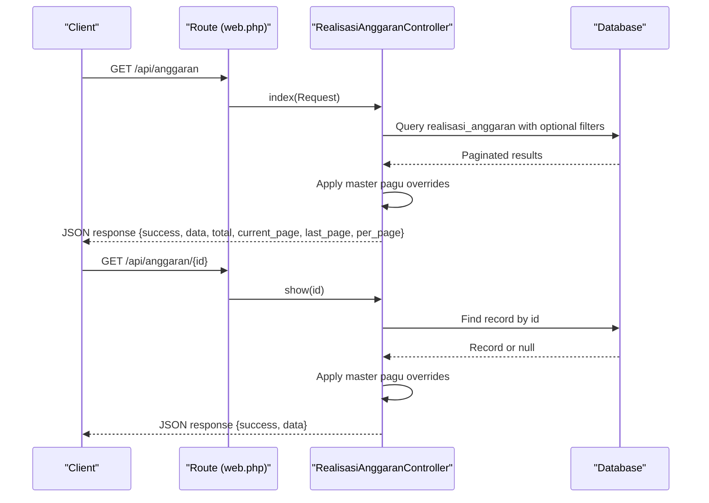
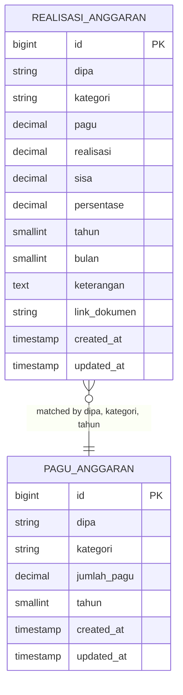
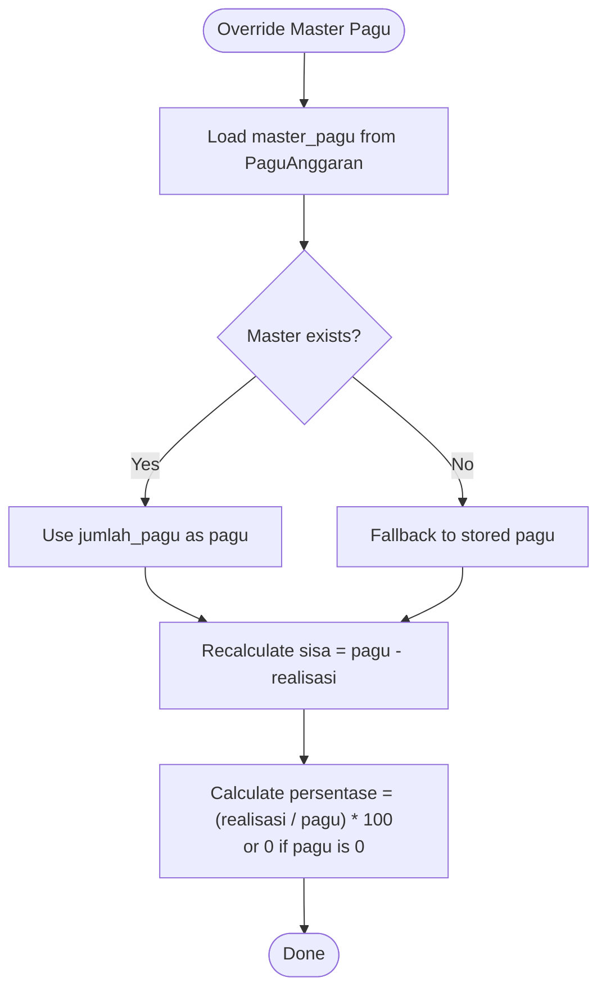
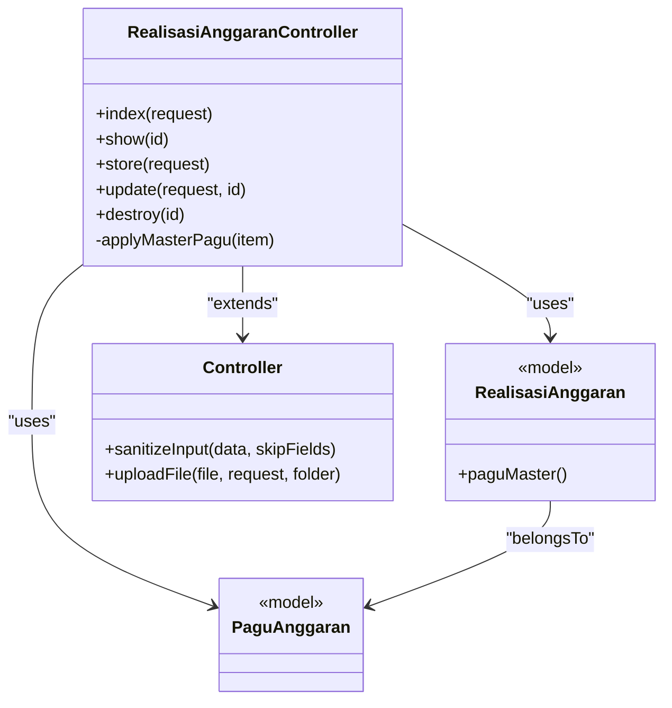

# Realisasi Anggaran (Budget Execution)

<cite>
**Referenced Files in This Document**
- [RealisasiAnggaranController.php](file://app/Http/Controllers/RealisasiAnggaranController.php)
- [RealisasiAnggaran.php](file://app/Models/RealisasiAnggaran.php)
- [PaguAnggaran.php](file://app/Models/PaguAnggaran.php)
- [Controller.php](file://app/Http/Controllers/Controller.php)
- [web.php](file://routes/web.php)
- [2026_02_10_000000_create_realisasi_anggaran_table.php](file://database/migrations/2026_02_10_000000_create_realisasi_anggaran_table.php)
- [2026_02_10_000001_update_realisasi_anggaran_add_month.php](file://database/migrations/2026_02_10_000001_update_realisasi_anggaran_add_month.php)
- [Handler.php](file://app/Exceptions/Handler.php)
- [SECURITY.md](file://SECURITY.md)
</cite>

## Table of Contents
1. [Introduction](#introduction)
2. [Project Structure](#project-structure)
3. [Core Components](#core-components)
4. [Architecture Overview](#architecture-overview)
5. [Detailed Component Analysis](#detailed-component-analysis)
6. [Dependency Analysis](#dependency-analysis)
7. [Performance Considerations](#performance-considerations)
8. [Troubleshooting Guide](#troubleshooting-guide)
9. [Conclusion](#conclusion)
10. [Appendices](#appendices)

## Introduction
This document provides comprehensive API documentation for the Realisasi Anggaran (Monthly Budget Execution) module. It covers HTTP GET endpoints for listing budget executions, retrieving individual records, and filtering by year and month. It also documents URL patterns, query parameters, response schemas including percentage calculations, pagination settings, validation rules, and error handling. Practical curl examples are included to demonstrate execution listing, individual record retrieval, and time-based filtering.

## Project Structure
The Realisasi Anggaran module is implemented as part of the backend API built with Lumen. The primary controller handles HTTP requests, while models define data structures and relationships. Routes are registered under the api prefix with public and protected groups. The module integrates with Pagu Anggaran to ensure budget figures reflect the latest master configuration.

**Diagram sources**
- [web.php:37-39](file://routes/web.php#L37-L39)
- [RealisasiAnggaranController.php:9-154](file://app/Http/Controllers/RealisasiAnggaranController.php#L9-L154)
- [RealisasiAnggaran.php:9-46](file://app/Models/RealisasiAnggaran.php#L9-L46)
- [PaguAnggaran.php:7-30](file://app/Models/PaguAnggaran.php#L7-L30)
- [Controller.php:7-97](file://app/Http/Controllers/Controller.php#L7-L97)

**Section sources**
- [web.php:37-39](file://routes/web.php#L37-L39)
- [RealisasiAnggaranController.php:9-154](file://app/Http/Controllers/RealisasiAnggaranController.php#L9-L154)
- [RealisasiAnggaran.php:9-46](file://app/Models/RealisasiAnggaran.php#L9-L46)
- [PaguAnggaran.php:7-30](file://app/Models/PaguAnggaran.php#L7-L30)
- [Controller.php:7-97](file://app/Http/Controllers/Controller.php#L7-L97)

## Core Components
- RealisasiAnggaranController: Implements index, show, store, update, and destroy actions. Provides filtering by year, month, DIPA, and category search. Applies master pagu values to override stored budget figures.
- RealisasiAnggaran Model: Defines fillable attributes, casts for numeric fields, and relationship to PaguAnggaran.
- PaguAnggaran Model: Defines fillable attributes, casts, and accessor/mutators for amount fields.
- Base Controller: Provides input sanitization and file upload utilities used by the module.
- Routes: Registers public GET endpoints for listing and viewing budget execution records.

**Section sources**
- [RealisasiAnggaranController.php:11-135](file://app/Http/Controllers/RealisasiAnggaranController.php#L11-L135)
- [RealisasiAnggaran.php:24-44](file://app/Models/RealisasiAnggaran.php#L24-L44)
- [PaguAnggaran.php:10-29](file://app/Models/PaguAnggaran.php#L10-L29)
- [Controller.php:18-95](file://app/Http/Controllers/Controller.php#L18-L95)
- [web.php:37-39](file://routes/web.php#L37-L39)

## Architecture Overview
The module follows a layered architecture:
- HTTP Layer: Routes define endpoint URLs and HTTP methods.
- Controller Layer: Handles request parsing, validation, and response formatting.
- Model Layer: Encapsulates data access and relationships.
- Persistence Layer: Database tables for realisasi_anggaran and pagu_anggaran.

**Diagram sources**
- [web.php:37-39](file://routes/web.php#L37-L39)
- [RealisasiAnggaranController.php:11-53](file://app/Http/Controllers/RealisasiAnggaranController.php#L11-L53)
- [RealisasiAnggaranController.php:122-130](file://app/Http/Controllers/RealisasiAnggaranController.php#L122-L130)

## Detailed Component Analysis

### HTTP GET: List Budget Executions
- Endpoint: GET /api/anggaran
- Purpose: Retrieve paginated list of budget executions with optional filters and search.
- Query Parameters:
  - tahun (optional): Integer year filter.
  - bulan (optional): Integer month filter (1-12).
  - dipa (optional): String DIPA filter.
  - q (optional): Search term for category names.
  - per_page (optional): Number of items per page (default 15).
- Sorting: Results are ordered by year desc, dipa asc, month asc, category asc.
- Response Schema:
  - success: Boolean indicating operation status.
  - data: Array of execution records with overridden pagu, sisa, and persentase.
  - total: Total number of records matching filters.
  - current_page: Current page number.
  - last_page: Last page number.
  - per_page: Items per page.
- Pagination: Uses Laravel paginator; includes total, current_page, last_page, per_page.
- Percentage Calculation: Persentase is computed as (realisasi / pagu) * 100, with fallback to 0 when pagu is zero.
- Filtering Behavior:
  - tahun: Filters by exact year.
  - bulan: Filters by exact month (1-12).
  - dipa: Filters by exact DIPA code.
  - q: Performs case-insensitive substring match on category.

Practical curl example:
- List all executions: curl -X GET "https://your-api-base/api/anggaran"
- Filter by year: curl -X GET "https://your-api-base/api/anggaran?tahun=2025"
- Filter by month: curl -X GET "https://your-api-base/api/anggaran?bulan=6"
- Filter by DIPA: curl -X GET "https://your-api-base/api/anggaran?dipa=DIPA01"
- Search categories: curl -X GET "https://your-api-base/api/anggaran?q=Belanja"
- Change page size: curl -X GET "https://your-api-base/api/anggaran?per_page=30"

**Section sources**
- [RealisasiAnggaranController.php:11-53](file://app/Http/Controllers/RealisasiAnggaranController.php#L11-L53)
- [web.php:37-39](file://routes/web.php#L37-L39)

### HTTP GET: Retrieve Individual Execution
- Endpoint: GET /api/anggaran/{id}
- Purpose: Fetch a single execution record by ID.
- Path Parameter:
  - id: Numeric identifier of the execution record.
- Response Schema:
  - success: Boolean indicating operation status.
  - data: Single execution record with overridden pagu, sisa, and persentase.
- Error Handling:
  - Returns 404 with success false and data null if the record does not exist.

Practical curl example:
- curl -X GET "https://your-api-base/api/anggaran/123"

**Section sources**
- [RealisasiAnggaranController.php:122-130](file://app/Http/Controllers/RealisasiAnggaranController.php#L122-L130)
- [web.php:38-39](file://routes/web.php#L38-L39)

### Data Model and Relationships
- RealisasiAnggaran Table:
  - Fields: id, dipa, kategori, pagu, realisasi, sisa, persentase, tahun, keterangan, link_dokumen, timestamps.
  - Indexes: dipa is indexed.
  - Precision: pagu, realisasi, sisa are decimal with precision suitable for currency.
- Pagu Anggaran Table:
  - Fields: id, dipa, kategori, jumlah_pagu, tahun.
  - Precision: jumlah_pagu is decimal with two decimals.
- Relationship:
  - RealisasiAnggaran belongs to PaguAnggaran via dipa, kategori, and tahun.
- Model Casting:
  - RealisasiAnggaran: pagu, realisasi, sisa, persentase as float; tahun, bulan as integer.
  - PaguAnggaran: jumlah_pagu as decimal with 2 places; tahun as integer.

**Diagram sources**
- [2026_02_10_000000_create_realisasi_anggaran_table.php:14-25](file://database/migrations/2026_02_10_000000_create_realisasi_anggaran_table.php#L14-L25)
- [2026_02_10_000001_update_realisasi_anggaran_add_month.php:14-16](file://database/migrations/2026_02_10_000001_update_realisasi_anggaran_add_month.php#L14-L16)
- [RealisasiAnggaran.php:17-22](file://app/Models/RealisasiAnggaran.php#L17-L22)
- [PaguAnggaran.php:10](file://app/Models/PaguAnggaran.php#L10)

**Section sources**
- [2026_02_10_000000_create_realisasi_anggaran_table.php:14-25](file://database/migrations/2026_02_10_000000_create_realisasi_anggaran_table.php#L14-L25)
- [2026_02_10_000001_update_realisasi_anggaran_add_month.php:14-16](file://database/migrations/2026_02_10_000001_update_realisasi_anggaran_add_month.php#L14-L16)
- [RealisasiAnggaran.php:17-22](file://app/Models/RealisasiAnggaran.php#L17-L22)
- [PaguAnggaran.php:10](file://app/Models/PaguAnggaran.php#L10)

### Percentage Calculation Logic
- The controller applies master pagu values from PaguAnggaran to ensure accuracy.
- If a matching master record exists, pagu is replaced with jumlah_pagu, sisa is recalculated as pagu - realisasi, and persentase is calculated as (realisasi / pagu) * 100.
- If no master record is found, the stored pagu value is retained.

**Diagram sources**
- [RealisasiAnggaranController.php:143-152](file://app/Http/Controllers/RealisasiAnggaranController.php#L143-L152)

**Section sources**
- [RealisasiAnggaranController.php:143-152](file://app/Http/Controllers/RealisasiAnggaranController.php#L143-L152)

### Validation and Error Handling
- Validation Rules (for write operations):
  - bulan: nullable, integer, min 0, max 12.
  - realisasi: required, numeric.
  - tahun: required, integer.
  - file_dokumen: optional, file with allowed MIME types, max size 5120 KB.
- Error Responses:
  - Validation failures return 422 with success false and errors payload.
  - Resource not found returns 404 with success false and message.
  - General HTTP exceptions return 500 with success false and sanitized message in production.
- Security Headers:
  - All responses include security headers (X-Content-Type-Options, X-Frame-Options, X-XSS-Protection).
  - CORS headers are applied for trusted origins.

Practical curl example (validation):
- curl -X POST "https://your-api-base/api/anggaran" -H "X-API-Key: YOUR_API_KEY" -F "dipa=DIPA01" -F "kategori=Belanja Barang" -F "realisasi=5000000" -F "tahun=2025" -F "bulan=13"

**Section sources**
- [RealisasiAnggaranController.php:57-64](file://app/Http/Controllers/RealisasiAnggaranController.php#L57-L64)
- [RealisasiAnggaranController.php:92-99](file://app/Http/Controllers/RealisasiAnggaranController.php#L92-L99)
- [Handler.php:57-95](file://app/Exceptions/Handler.php#L57-L95)
- [SECURITY.md:36-41](file://SECURITY.md#L36-L41)

## Dependency Analysis
- Controller depends on:
  - RealisasiAnggaran model for data access.
  - PaguAnggaran model for master budget values.
  - Base Controller for input sanitization and file upload utilities.
- Routes depend on controller actions.
- Models define relationships and casting.

**Diagram sources**
- [RealisasiAnggaranController.php:9-154](file://app/Http/Controllers/RealisasiAnggaranController.php#L9-L154)
- [RealisasiAnggaran.php:17-22](file://app/Models/RealisasiAnggaran.php#L17-L22)
- [PaguAnggaran.php:10](file://app/Models/PaguAnggaran.php#L10)
- [Controller.php:7-97](file://app/Http/Controllers/Controller.php#L7-L97)

**Section sources**
- [RealisasiAnggaranController.php:9-154](file://app/Http/Controllers/RealisasiAnggaranController.php#L9-L154)
- [RealisasiAnggaran.php:17-22](file://app/Models/RealisasiAnggaran.php#L17-L22)
- [PaguAnggaran.php:10](file://app/Models/PaguAnggaran.php#L10)
- [Controller.php:7-97](file://app/Http/Controllers/Controller.php#L7-L97)

## Performance Considerations
- Indexing: The dipa column in realisasi_anggaran is indexed, improving filter performance.
- Pagination: Default page size is 15; adjust per_page judiciously to balance responsiveness and bandwidth.
- Sorting: Multi-column ordering ensures deterministic results but may require composite indexes for optimal performance at scale.
- Master Join: Left join with pagu_anggaran ensures accurate percentages but adds join overhead; consider indexing pagu_anggaran on (dipa, kategori, tahun).

## Troubleshooting Guide
Common issues and resolutions:
- Invalid month values:
  - Ensure bulan is between 1 and 12. Values outside this range will be rejected by validation.
- Missing or invalid ID:
  - GET /api/anggaran/{id} returns 404 if the record does not exist.
- Validation failures:
  - Review required fields and data types. Correct input according to validation rules.
- CORS or security headers:
  - Verify Origin header and trusted domains configuration.
- Rate limiting:
  - Public endpoints allow 100 requests per minute; protected endpoints allow fewer. Adjust client-side retry logic accordingly.

**Section sources**
- [RealisasiAnggaranController.php:57-64](file://app/Http/Controllers/RealisasiAnggaranController.php#L57-L64)
- [RealisasiAnggaranController.php:92-99](file://app/Http/Controllers/RealisasiAnggaranController.php#L92-L99)
- [Handler.php:57-95](file://app/Exceptions/Handler.php#L57-L95)
- [SECURITY.md:17-21](file://SECURITY.md#L17-L21)

## Conclusion
The Realisasi Anggaran module provides robust HTTP GET endpoints for listing and retrieving monthly budget execution records, with flexible filtering and pagination. It ensures accurate percentage calculations by integrating with the latest master pagu values. The documented validation rules, error handling, and security measures support reliable operation for budget tracking, execution monitoring, and financial performance analysis.

## Appendices

### API Reference Summary
- GET /api/anggaran
  - Query params: tahun, bulan, dipa, q, per_page
  - Response: {success, data[], total, current_page, last_page, per_page}
- GET /api/anggaran/{id}
  - Response: {success, data}

**Section sources**
- [web.php:37-39](file://routes/web.php#L37-L39)
- [RealisasiAnggaranController.php:11-53](file://app/Http/Controllers/RealisasiAnggaranController.php#L11-L53)
- [RealisasiAnggaranController.php:122-130](file://app/Http/Controllers/RealisasiAnggaranController.php#L122-L130)