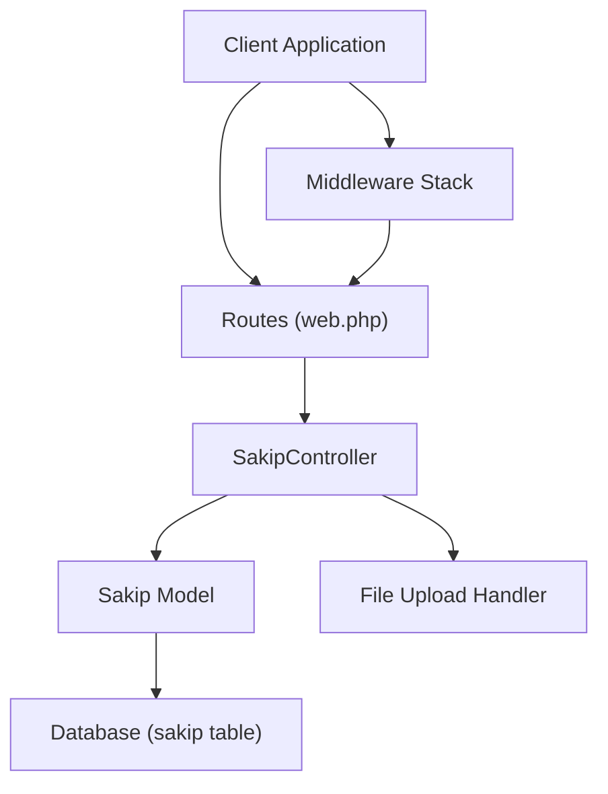
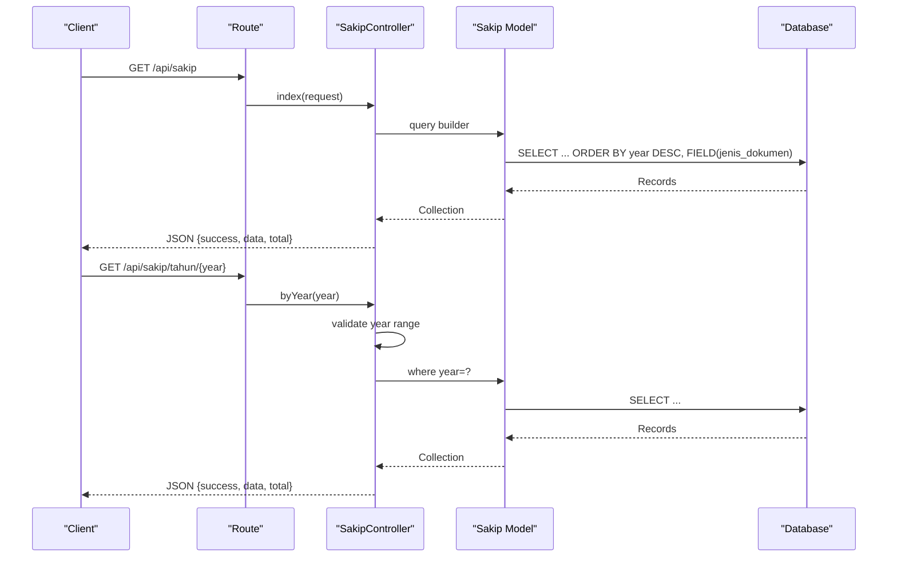
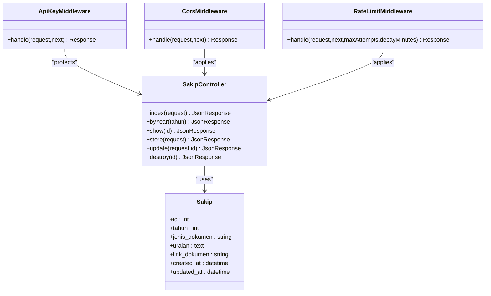

# SAKIP (Strategic Planning)

<cite>
**Referenced Files in This Document**
- [SakipController.php](file://app/Http/Controllers/SakipController.php)
- [Sakip.php](file://app/Models/Sakip.php)
- [web.php](file://routes/web.php)
- [2026_03_31_000001_create_sakip_table.php](file://database/migrations/2026_03_31_000001_create_sakip_table.php)
- [SakipSeeder.php](file://database/seeders/SakipSeeder.php)
- [CorsMiddleware.php](file://app/Http/Middleware/CorsMiddleware.php)
- [ApiKeyMiddleware.php](file://app/Http/Middleware/ApiKeyMiddleware.php)
- [RateLimitMiddleware.php](file://app/Http/Middleware/RateLimitMiddleware.php)
- [joomla-integration-sakip.html](file://docs/joomla-integration-sakip.html)
</cite>

## Table of Contents
1. [Introduction](#introduction)
2. [Project Structure](#project-structure)
3. [Core Components](#core-components)
4. [Architecture Overview](#architecture-overview)
5. [Detailed Component Analysis](#detailed-component-analysis)
6. [Dependency Analysis](#dependency-analysis)
7. [Performance Considerations](#performance-considerations)
8. [Troubleshooting Guide](#troubleshooting-guide)
9. [Conclusion](#conclusion)
10. [Appendices](#appendices)

## Introduction
This document provides comprehensive API documentation for the SAKIP (Strategic Planning) module. It covers HTTP GET endpoints for listing strategic reports, retrieving individual reports, and filtering by year. It specifies URL patterns, query parameters, response schemas, pagination details, and practical curl examples. It also documents the standardized response format, data validation rules, error handling for planning periods, and common use cases such as strategic planning analysis, performance monitoring, and goal tracking across organizational levels.

## Project Structure
The SAKIP module is implemented as part of a Lumen-based API server. The relevant components include:
- Routes: Public and protected endpoints for SAKIP
- Controller: Business logic for listing, filtering, retrieving, and managing SAKIP records
- Model: Eloquent model representing the sakip table
- Middleware: CORS, API key authentication, and rate limiting
- Database: Migration defining the sakip table schema and seed data



**Diagram sources**
- [web.php:50-54](file://routes/web.php#L50-L54)
- [SakipController.php:9-251](file://app/Http/Controllers/SakipController.php#L9-L251)
- [Sakip.php:7-23](file://app/Models/Sakip.php#L7-L23)

**Section sources**
- [web.php:50-54](file://routes/web.php#L50-L54)
- [SakipController.php:9-251](file://app/Http/Controllers/SakipController.php#L9-L251)
- [Sakip.php:7-23](file://app/Models/Sakip.php#L7-L23)

## Core Components
- SAKIP Controller: Implements public read-only endpoints for listing and filtering, plus protected endpoints for creation, updates, and deletion.
- SAKIP Model: Defines the sakip table schema, fillable attributes, and type casting.
- Routes: Declares public GET endpoints for listing, filtering by year, and retrieving by ID; protected endpoints for CRUD operations.
- Middleware: Enforces CORS, API key authentication for protected routes, and rate limiting.

Key capabilities:
- List all SAKIP documents with ordering by year descending and fixed order of document types.
- Filter by year using a query parameter.
- Retrieve a single document by numeric ID.
- Validation and uniqueness constraints for document types per year.
- Standardized JSON responses with success flags and metadata.

**Section sources**
- [SakipController.php:34-106](file://app/Http/Controllers/SakipController.php#L34-L106)
- [Sakip.php:11-22](file://app/Models/Sakip.php#L11-L22)
- [web.php:50-54](file://routes/web.php#L50-L54)

## Architecture Overview
The SAKIP API follows a layered architecture:
- Presentation Layer: Routes define endpoint contracts.
- Application Layer: Controller handles request validation, business rules, and response formatting.
- Domain Layer: Model encapsulates persistence and type casting.
- Infrastructure Layer: Middleware enforces security policies.



**Diagram sources**
- [web.php:50-54](file://routes/web.php#L50-L54)
- [SakipController.php:34-80](file://app/Http/Controllers/SakipController.php#L34-L80)
- [Sakip.php:7-23](file://app/Models/Sakip.php#L7-L23)

## Detailed Component Analysis

### Endpoint Definitions

- Base URL: `/api/sakip`
- Public endpoints (no API key required):
  - GET `/api/sakip` — List all SAKIP documents with optional year filter
  - GET `/api/sakip/{id}` — Retrieve a single SAKIP document by ID
  - GET `/api/sakip/tahun/{year}` — List SAKIP documents filtered by year
- Protected endpoints (requires API key):
  - POST `/api/sakip` — Create a new SAKIP document
  - PUT/PATCH `/api/sakip/{id}` — Update an existing SAKIP document
  - DELETE `/api/sakip/{id}` — Delete a SAKIP document

Notes:
- Year parameter must be an integer within the range 2000–2100.
- ID must be a positive integer; otherwise, a 400 error is returned.
- Protected endpoints require the header `X-API-Key`.

**Section sources**
- [web.php:50-54](file://routes/web.php#L50-L54)
- [SakipController.php:34-106](file://app/Http/Controllers/SakipController.php#L34-L106)
- [ApiKeyMiddleware.php:14-39](file://app/Http/Middleware/ApiKeyMiddleware.php#L14-L39)

### Request Parameters and Filters

- Query parameter for listing:
  - `tahun` (optional): Integer year within 2000–2100. Applies a WHERE clause on the year column.
- Path parameters:
  - `{id}`: Numeric ID for single document retrieval.
  - `{year}`: Numeric year for year-based filtering.

Validation rules:
- Year must be within 2000–2100; otherwise, a 400 error is returned.
- ID must be greater than 0; otherwise, a 400 error is returned.
- If ID does not exist, a 404 error is returned.

Ordering:
- Results are ordered by year descending.
- Document types are ordered according to a predefined list to ensure consistent presentation.

**Section sources**
- [SakipController.php:38-49](file://app/Http/Controllers/SakipController.php#L38-L49)
- [SakipController.php:61-79](file://app/Http/Controllers/SakipController.php#L61-L79)
- [SakipController.php:85-105](file://app/Http/Controllers/SakipController.php#L85-L105)

### Response Schema

Standardized response envelope:
- `success`: Boolean indicating operation outcome
- `data`: Array or object depending on endpoint
- `total`: Integer count of returned items (for list endpoints)

List response (`/api/sakip`, `/api/sakip/tahun/{year}`):
- `data`: Array of SAKIP records
- Each record includes:
  - `id`: Integer
  - `tahun`: Integer
  - `jenis_dokumen`: String (one of the allowed document types)
  - `uraian`: Text or null
  - `link_dokumen`: String URL or null
  - `created_at`: ISO datetime string
  - `updated_at`: ISO datetime string

Single record response (`/api/sakip/{id}`):
- `data`: Single SAKIP record object with the same fields as above

Creation/Update/Delete responses:
- `success`: Boolean
- `message`: String describing the outcome
- `data`: Created/updated record object (for create/update)

Error responses:
- `success`: false
- `message`: String describing the error
- Status codes:
  - 400: Invalid year or invalid ID
  - 404: Record not found
  - 422: Validation error (e.g., invalid document type)
  - 401: Unauthorized (missing or invalid API key)
  - 429: Too many requests (rate limit exceeded)

**Section sources**
- [SakipController.php:51-55](file://app/Http/Controllers/SakipController.php#L51-L55)
- [SakipController.php:75-79](file://app/Http/Controllers/SakipController.php#L75-L79)
- [SakipController.php:102-105](file://app/Http/Controllers/SakipController.php#L102-L105)
- [SakipController.php:113-137](file://app/Http/Controllers/SakipController.php#L113-L137)
- [SakipController.php:159-222](file://app/Http/Controllers/SakipController.php#L159-L222)
- [SakipController.php:227-250](file://app/Http/Controllers/SakipController.php#L227-L250)
- [ApiKeyMiddleware.php:27-36](file://app/Http/Middleware/ApiKeyMiddleware.php#L27-L36)

### Data Model and Constraints

Table: `sakip`
- Columns:
  - `id`: Auto-increment primary key
  - `tahun`: Integer
  - `jenis_dokumen`: String (max length 100)
  - `uraian`: Text (nullable)
  - `link_dokumen`: String (max length 500, nullable)
  - `created_at`, `updated_at`: Timestamps
- Unique constraint: (`tahun`, `jenis_dokumen`)
- Index: (`tahun`)

Allowed document types:
- Indikator Kinerja Utama
- Rencana Strategis
- Program Kerja
- Rencana Kinerja Tahunan
- Perjanjian Kinerja
- Rencana Aksi
- Laporan Kinerja Instansi Pemerintah

**Section sources**
- [2026_03_31_000001_create_sakip_table.php:11-21](file://database/migrations/2026_03_31_000001_create_sakip_table.php#L11-L21)
- [Sakip.php:11-16](file://app/Models/Sakip.php#L11-L16)
- [SakipController.php:14-22](file://app/Http/Controllers/SakipController.php#L14-L22)

### Practical Usage Examples

- List all SAKIP documents:
  ```bash
  curl -s "https://web-api.pa-penajam.go.id/api/sakip"
  ```

- Filter by year:
  ```bash
  curl -s "https://web-api.pa-penajam.go.id/api/sakip?tahun=2025"
  ```

- Retrieve a single document by ID:
  ```bash
  curl -s "https://web-api.pa-penajam.go.id/api/sakip/123"
  ```

- Create a new SAKIP document (protected endpoint):
  ```bash
  curl -s -X POST "https://web-api.pa-penajam.go.id/api/sakip" \
    -H "X-API-Key: YOUR_API_KEY" \
    -H "Content-Type: application/json" \
    -d '{"tahun":2025,"jenis_dokumen":"Rencana Strategis","uraian":"Strategic plan summary","link_dokumen":"https://example.com/doc.pdf"}'
  ```

- Update an existing SAKIP document (protected endpoint):
  ```bash
  curl -s -X PUT "https://web-api.pa-penajam.go.id/api/sakip/123" \
    -H "X-API-Key: YOUR_API_KEY" \
    -H "Content-Type: application/json" \
    -d '{"uraian":"Updated summary"}'
  ```

- Delete a SAKIP document (protected endpoint):
  ```bash
  curl -s -X DELETE "https://web-api.pa-penajam.go.id/api/sakip/123" \
    -H "X-API-Key: YOUR_API_KEY"
  ```

Notes:
- Replace `YOUR_API_KEY` with a valid API key configured in the environment.
- Use HTTPS for production access.

**Section sources**
- [web.php:50-54](file://routes/web.php#L50-L54)
- [ApiKeyMiddleware.php:16-17](file://app/Http/Middleware/ApiKeyMiddleware.php#L16-L17)

### Security and Middleware

- CORS: Strictly whitelisted origins; security headers enforced.
- API Key: Required for protected endpoints; timing-safe comparison to prevent timing attacks.
- Rate Limiting: Configured globally; returns retry-after information and standard headers.

**Section sources**
- [CorsMiddleware.php:14-62](file://app/Http/Middleware/CorsMiddleware.php#L14-L62)
- [ApiKeyMiddleware.php:14-39](file://app/Http/Middleware/ApiKeyMiddleware.php#L14-L39)
- [RateLimitMiddleware.php:15-39](file://app/Http/Middleware/RateLimitMiddleware.php#L15-L39)
- [web.php:14](file://routes/web.php#L14)
- [web.php:78-79](file://routes/web.php#L78-L79)

## Dependency Analysis



**Diagram sources**
- [SakipController.php:9-251](file://app/Http/Controllers/SakipController.php#L9-L251)
- [Sakip.php:7-23](file://app/Models/Sakip.php#L7-L23)
- [ApiKeyMiddleware.php:8-40](file://app/Http/Middleware/ApiKeyMiddleware.php#L8-L40)
- [CorsMiddleware.php:8-63](file://app/Http/Middleware/CorsMiddleware.php#L8-L63)
- [RateLimitMiddleware.php:9-48](file://app/Http/Middleware/RateLimitMiddleware.php#L9-L48)

**Section sources**
- [SakipController.php:9-251](file://app/Http/Controllers/SakipController.php#L9-L251)
- [Sakip.php:7-23](file://app/Models/Sakip.php#L7-L23)
- [ApiKeyMiddleware.php:8-40](file://app/Http/Middleware/ApiKeyMiddleware.php#L8-L40)
- [CorsMiddleware.php:8-63](file://app/Http/Middleware/CorsMiddleware.php#L8-L63)
- [RateLimitMiddleware.php:9-48](file://app/Http/Middleware/RateLimitMiddleware.php#L9-L48)

## Performance Considerations
- Index on `tahun`: The migration creates an index on the year column, enabling efficient filtering by year.
- Ordering: Results are ordered by year descending and by a fixed document type field order to ensure consistent presentation.
- Pagination: No built-in pagination is implemented; list endpoints return all matching records. For large datasets, consider adding pagination or limiting the number of records returned.

[No sources needed since this section provides general guidance]

## Troubleshooting Guide
Common issues and resolutions:
- Invalid year or ID:
  - Symptom: 400 error with message indicating invalid year or ID.
  - Resolution: Ensure year is within 2000–2100 and ID is a positive integer.
- Record not found:
  - Symptom: 404 error when retrieving a non-existent ID.
  - Resolution: Verify the ID exists or re-check the database.
- Invalid document type:
  - Symptom: 422 error when creating/updating with an unsupported document type.
  - Resolution: Use one of the allowed document types defined in the controller.
- Duplicate record:
  - Symptom: 422 error when attempting to create a record with the same year and document type combination.
  - Resolution: Update the existing record or change the year/document type.
- Unauthorized access:
  - Symptom: 401 error for protected endpoints.
  - Resolution: Include a valid `X-API-Key` header.
- Rate limit exceeded:
  - Symptom: 429 error with retry-after information.
  - Resolution: Wait for the indicated period or reduce request frequency.

**Section sources**
- [SakipController.php:63-68](file://app/Http/Controllers/SakipController.php#L63-L68)
- [SakipController.php:87-92](file://app/Http/Controllers/SakipController.php#L87-L92)
- [SakipController.php:121-126](file://app/Http/Controllers/SakipController.php#L121-L126)
- [SakipController.php:132-137](file://app/Http/Controllers/SakipController.php#L132-L137)
- [ApiKeyMiddleware.php:27-36](file://app/Http/Middleware/ApiKeyMiddleware.php#L27-L36)
- [RateLimitMiddleware.php:22-28](file://app/Http/Middleware/RateLimitMiddleware.php#L22-L28)

## Conclusion
The SAKIP module provides a clear, secure, and predictable API for accessing strategic planning documents. Public endpoints enable broad discovery and filtering by year, while protected endpoints support administrative operations with robust validation and security controls. The standardized response format and consistent ordering facilitate reliable client-side consumption and integration.

[No sources needed since this section summarizes without analyzing specific files]

## Appendices

### API Endpoints Summary

- GET `/api/sakip`
  - Description: List all SAKIP documents with optional year filter.
  - Query parameters: `tahun` (optional)
  - Response: JSON envelope with `success`, `data` (array), and `total` (integer)

- GET `/api/sakip/tahun/{year}`
  - Description: List SAKIP documents filtered by year.
  - Path parameters: `year` (integer, 2000–2100)
  - Response: JSON envelope with `success`, `data` (array), and `total` (integer)

- GET `/api/sakip/{id}`
  - Description: Retrieve a single SAKIP document by ID.
  - Path parameters: `id` (positive integer)
  - Response: JSON envelope with `success` and `data` (single object)

- POST `/api/sakip` (Protected)
  - Description: Create a new SAKIP document.
  - Headers: `X-API-Key`
  - Body fields: `tahun`, `jenis_dokumen`, `uraian` (optional), `link_dokumen` (optional)
  - Response: JSON envelope with `success`, `message`, and `data`

- PUT/PATCH `/api/sakip/{id}` (Protected)
  - Description: Update an existing SAKIP document.
  - Headers: `X-API-Key`
  - Path parameters: `id` (positive integer)
  - Body fields: Same as create, with optional fields
  - Response: JSON envelope with `success`, `message`, and `data`

- DELETE `/api/sakip/{id}` (Protected)
  - Description: Delete a SAKIP document.
  - Headers: `X-API-Key`
  - Path parameters: `id` (positive integer)
  - Response: JSON envelope with `success` and `message`

**Section sources**
- [web.php:50-54](file://routes/web.php#L50-L54)
- [SakipController.php:34-106](file://app/Http/Controllers/SakipController.php#L34-L106)

### Data Validation Rules

- Year range: 2000–2100
- Document type: Must be one of the allowed types
- Uniqueness: No duplicate combinations of `tahun` and `jenis_dokumen`
- ID validation: Must be greater than 0

**Section sources**
- [SakipController.php:38-43](file://app/Http/Controllers/SakipController.php#L38-L43)
- [SakipController.php:63-68](file://app/Http/Controllers/SakipController.php#L63-L68)
- [SakipController.php:113-119](file://app/Http/Controllers/SakipController.php#L113-L119)
- [SakipController.php:121-126](file://app/Http/Controllers/SakipController.php#L121-L126)
- [2026_03_31_000001_create_sakip_table.php:19](file://database/migrations/2026_03_31_000001_create_sakip_table.php#L19)

### Example Integrations

- Frontend integration example demonstrates fetching by year and rendering document links:
  - See [joomla-integration-sakip.html:254-266](file://docs/joomla-integration-sakip.html#L254-L266) for a client-side example that fetches data and renders a table.

**Section sources**
- [joomla-integration-sakip.html:254-266](file://docs/joomla-integration-sakip.html#L254-L266)