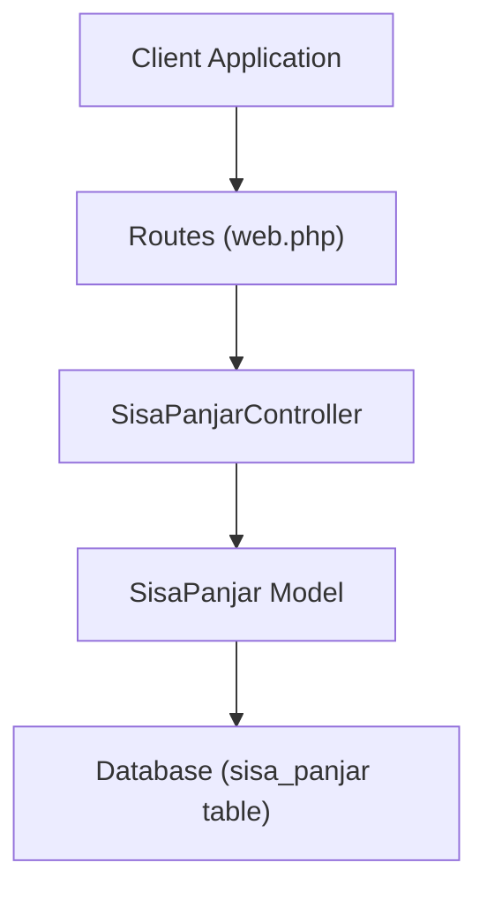
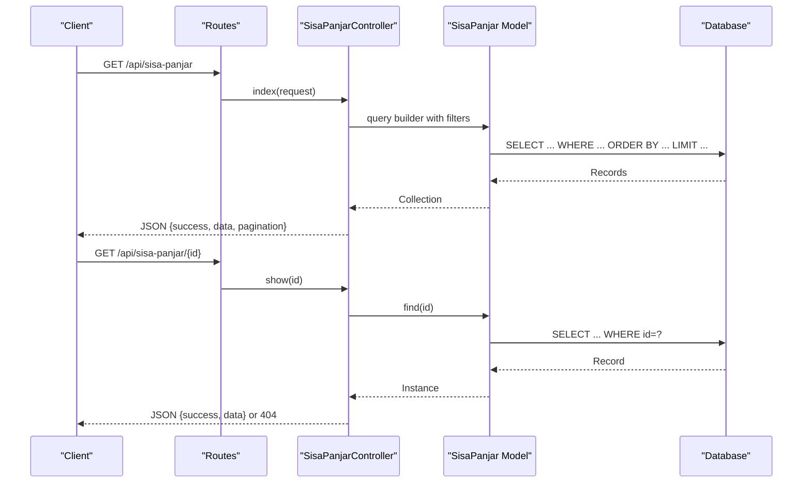
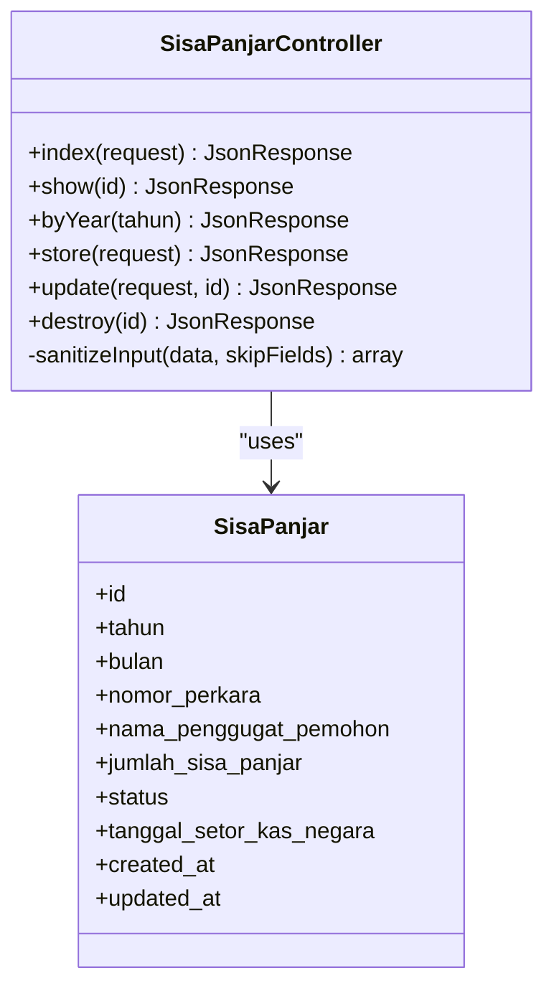
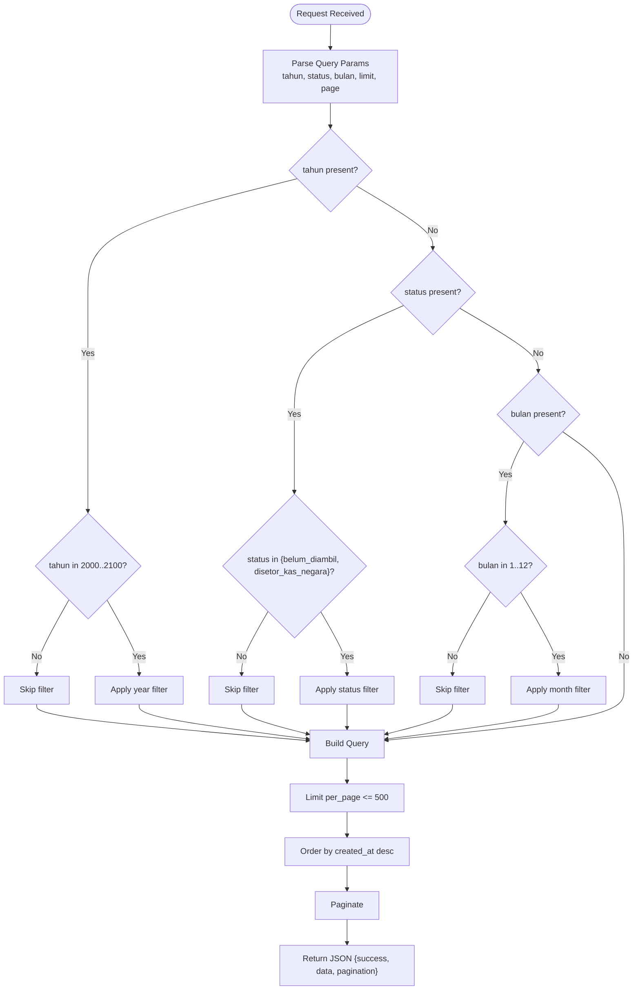
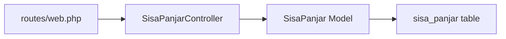

# Sisa Panjar (Advance Payments)

<cite>
**Referenced Files in This Document**
- [SisaPanjarController.php](file://app/Http/Controllers/SisaPanjarController.php)
- [SisaPanjar.php](file://app/Models/SisaPanjar.php)
- [web.php](file://routes/web.php)
- [2026_04_01_000001_create_sisa_panjar_table.php](file://database/migrations/2026_04_01_000001_create_sisa_panjar_table.php)
- [sisa-panjar.html](file://docs/sisa-panjar.html)
- [sisa_panjar_joomla.md](file://docs/sisa_panjar_joomla.md)
- [Controller.php](file://app/Http/Controllers/Controller.php)
</cite>

## Table of Contents
1. [Introduction](#introduction)
2. [Project Structure](#project-structure)
3. [Core Components](#core-components)
4. [Architecture Overview](#architecture-overview)
5. [Detailed Component Analysis](#detailed-component-analysis)
6. [Dependency Analysis](#dependency-analysis)
7. [Performance Considerations](#performance-considerations)
8. [Troubleshooting Guide](#troubleshooting-guide)
9. [Conclusion](#conclusion)
10. [Appendices](#appendices)

## Introduction
This document provides comprehensive API documentation for the Sisa Panjar module, which tracks advance payments (sisa panjar) associated with legal proceedings and manages cash flow visibility. It covers HTTP GET endpoints for listing payments, retrieving individual records, and year-based filtering, along with standardized JSON responses, pagination, validation rules, and error handling. Practical curl examples demonstrate typical use cases such as cash flow monitoring, advance payment tracking, and monthly reconciliation across payment categories.

## Project Structure
The Sisa Panjar module is implemented as part of a Laravel Lumen application. The primary components are:
- Route definitions that expose GET endpoints for listing, retrieving, and year-based filtering
- A controller that implements business logic, validation, and response formatting
- An Eloquent model that maps to the database table and defines casting rules
- A migration that creates the underlying table with appropriate indices

**Diagram sources**
- [web.php:65-68](file://routes/web.php#L65-L68)
- [SisaPanjarController.php:21-61](file://app/Http/Controllers/SisaPanjarController.php#L21-L61)
- [SisaPanjar.php:7-34](file://app/Models/SisaPanjar.php#L7-L34)
- [2026_04_01_000001_create_sisa_panjar_table.php:16-30](file://database/migrations/2026_04_01_000001_create_sisa_panjar_table.php#L16-L30)

**Section sources**
- [web.php:65-68](file://routes/web.php#L65-L68)
- [SisaPanjarController.php:11-19](file://app/Http/Controllers/SisaPanjarController.php#L11-L19)
- [SisaPanjar.php:9-28](file://app/Models/SisaPanjar.php#L9-L28)
- [2026_04_01_000001_create_sisa_panjar_table.php:16-30](file://database/migrations/2026_04_01_000001_create_sisa_panjar_table.php#L16-L30)

## Core Components
- HTTP GET endpoints:
  - List payments with pagination and optional filters
  - Retrieve a single payment by ID
  - Filter by year
- Standardized JSON response format with success flag, data payload, and pagination metadata
- Validation and sanitization for input fields
- Error handling for invalid IDs and missing records

**Section sources**
- [web.php:65-68](file://routes/web.php#L65-L68)
- [SisaPanjarController.php:21-61](file://app/Http/Controllers/SisaPanjarController.php#L21-L61)
- [SisaPanjarController.php:85-107](file://app/Http/Controllers/SisaPanjarController.php#L85-L107)
- [SisaPanjarController.php:63-83](file://app/Http/Controllers/SisaPanjarController.php#L63-L83)

## Architecture Overview
The API follows a layered architecture:
- Routing layer exposes endpoints under the /api prefix
- Controller layer handles requests, applies filters, validates inputs, and formats responses
- Model layer encapsulates persistence and data casting
- Database layer stores payment records with indices for efficient querying

**Diagram sources**
- [web.php:65-68](file://routes/web.php#L65-L68)
- [SisaPanjarController.php:21-61](file://app/Http/Controllers/SisaPanjarController.php#L21-L61)
- [SisaPanjarController.php:85-107](file://app/Http/Controllers/SisaPanjarController.php#L85-L107)

## Detailed Component Analysis

### HTTP Endpoints and Filters
- Base URL: /api
- Public endpoints (rate-limited):
  - GET /sisa-panjar
  - GET /sisa-panjar/{id}
  - GET /sisa-panjar/tahun/{tahun}

Filters and parameters for GET /sisa-panjar:
- tahun: integer (2000–2100)
- status: string (allowed values: belum_diambil, disetor_kas_negara)
- bulan: integer (1–12)
- limit: integer (min 1, max 500; default 10)
- page: integer (pagination page number)

Response format:
- success: boolean
- data: array of payment records
- current_page, last_page, per_page, total: pagination metadata

Notes:
- The client-side integration demonstrates a default limit of 500 for bulk loading.
- The byYear endpoint enforces a hard cap of 500 records.

**Section sources**
- [web.php:65-68](file://routes/web.php#L65-L68)
- [SisaPanjarController.php:21-61](file://app/Http/Controllers/SisaPanjarController.php#L21-L61)
- [SisaPanjarController.php:63-83](file://app/Http/Controllers/SisaPanjarController.php#L63-L83)
- [sisa-panjar.html:314-320](file://docs/sisa-panjar.html#L314-L320)

### Payment Record Fields and Casting
Payment record fields exposed by the API:
- id: integer
- tahun: integer
- bulan: integer (1–12)
- nomor_perkara: string (max 100)
- nama_penggugat_pemohon: string (max 255)
- jumlah_sisa_panjar: decimal (precision 15, scale 2)
- status: enum (belum_diambil, disetor_kas_negara)
- tanggal_setor_kas_negara: date (YYYY-MM-DD)
- created_at, updated_at: datetime

Casting behavior:
- tahun, bulan cast to integers
- jumlah_sisa_panjar cast to decimal with 2 decimals
- tanggal_setor_kas_negara normalized to date string
- timestamps cast to datetime

**Section sources**
- [SisaPanjar.php:11-28](file://app/Models/SisaPanjar.php#L11-L28)
- [SisaPanjar.php:30-33](file://app/Models/SisaPanjar.php#L30-L33)
- [2026_04_01_000001_create_sisa_panjar_table.php:18-25](file://database/migrations/2026_04_01_000001_create_sisa_panjar_table.php#L18-L25)

### Validation Rules and Input Sanitization
Validation rules for creation and updates:
- tahun: required, integer, min 2000, max 2100
- bulan: required, integer, min 1, max 12
- nomor_perkara: required, string, max 100, regex allowing digits, slashes, dots, letters, spaces, hyphens
- nama_penggugat_pemohon: required, string, max 255
- jumlah_sisa_panjar: required, numeric, min 0
- status: required/in update, enum (belum_diambil, disetor_kas_negara)
- tanggal_setor_kas_negara: nullable, date

Sanitization:
- Strings are trimmed and stripped of HTML tags (except nomor_perkara)
- Empty sanitized strings are converted to null

**Section sources**
- [SisaPanjarController.php:111-119](file://app/Http/Controllers/SisaPanjarController.php#L111-L119)
- [SisaPanjarController.php:151-159](file://app/Http/Controllers/SisaPanjarController.php#L151-L159)
- [Controller.php:18-29](file://app/Http/Controllers/Controller.php#L18-L29)

### Error Handling
Common error scenarios:
- Invalid ID (< 1): 400 Bad Request with message
- Record not found: 404 Not Found with message
- Invalid year in byYear: 400 Bad Request with message
- Pagination limit exceeded: enforced by controller logic (max 500)

**Section sources**
- [SisaPanjarController.php:87-100](file://app/Http/Controllers/SisaPanjarController.php#L87-L100)
- [SisaPanjarController.php:135-148](file://app/Http/Controllers/SisaPanjarController.php#L135-L148)
- [SisaPanjarController.php:175-188](file://app/Http/Controllers/SisaPanjarController.php#L175-L188)
- [SisaPanjarController.php:65-70](file://app/Http/Controllers/SisaPanjarController.php#L65-L70)

### Response Schema
Standardized JSON response for GET /sisa-panjar:
- success: boolean
- data: array of payment objects
- current_page: integer
- last_page: integer
- per_page: integer
- total: integer

Example response shape:
- See [sisa_panjar_joomla.md:26-48](file://docs/sisa_panjar_joomla.md#L26-L48)

**Section sources**
- [SisaPanjarController.php:53-60](file://app/Http/Controllers/SisaPanjarController.php#L53-L60)
- [sisa_panjar_joomla.md:26-48](file://docs/sisa_panjar_joomla.md#L26-L48)

### Pagination Settings
- Default per_page: 10
- Maximum per_page: 500
- Ordering: desc by created_at
- Additional ordering for byYear: asc by bulan, then desc by created_at

**Section sources**
- [SisaPanjarController.php:48-51](file://app/Http/Controllers/SisaPanjarController.php#L48-L51)
- [SisaPanjarController.php:72-76](file://app/Http/Controllers/SisaPanjarController.php#L72-L76)

### Data Validation Rules
- tahun: integer, 2000–2100
- bulan: integer, 1–12
- nomor_perkara: string, max 100, regex pattern for allowed characters
- nama_penggugat_pemohon: string, max 255
- jumlah_sisa_panjar: numeric, min 0
- status: enum (belum_diambil, disetor_kas_negara)
- tanggal_setor_kas_negara: date or null

**Section sources**
- [SisaPanjarController.php:111-119](file://app/Http/Controllers/SisaPanjarController.php#L111-L119)
- [SisaPanjarController.php:151-159](file://app/Http/Controllers/SisaPanjarController.php#L151-L159)

### Error Handling for Payment Identifiers
- ID must be > 0; otherwise 400 with message
- Non-existent ID returns 404 with message

**Section sources**
- [SisaPanjarController.php:87-100](file://app/Http/Controllers/SisaPanjarController.php#L87-L100)
- [SisaPanjarController.php:135-148](file://app/Http/Controllers/SisaPanjarController.php#L135-L148)
- [SisaPanjarController.php:175-188](file://app/Http/Controllers/SisaPanjarController.php#L175-L188)

### Common Use Cases
- Cash flow monitoring:
  - Use GET /sisa-panjar with tahun and status filters to monitor outstanding vs settled amounts
- Advance payment tracking:
  - Use GET /sisa-panjar/{id} to retrieve a specific payment record
- Monthly reconciliation:
  - Use GET /sisa-panjar with tahun and bulan filters to reconcile per month
  - Use GET /sisa-panjar/tahun/{tahun} to export yearly data for reconciliation

**Section sources**
- [web.php:65-68](file://routes/web.php#L65-L68)
- [SisaPanjarController.php:25-44](file://app/Http/Controllers/SisaPanjarController.php#L25-L44)
- [SisaPanjarController.php:63-83](file://app/Http/Controllers/SisaPanjarController.php#L63-L83)

## Architecture Overview

**Diagram sources**
- [SisaPanjarController.php:9-198](file://app/Http/Controllers/SisaPanjarController.php#L9-L198)
- [SisaPanjar.php:7-34](file://app/Models/SisaPanjar.php#L7-L34)

## Detailed Component Analysis

### GET /api/sisa-panjar
Behavior:
- Applies filters: tahun, status, bulan
- Enforces limit ≤ 500
- Orders by created_at desc
- Returns paginated JSON

Filter validation:
- tahun validated as integer in 2000–2100
- status validated against allowed enum
- bulan validated as integer in 1–12

Pagination:
- per_page defaults to 10, capped at 500
- current_page, last_page, total included

**Section sources**
- [SisaPanjarController.php:21-61](file://app/Http/Controllers/SisaPanjarController.php#L21-L61)
- [SisaPanjarController.php:48-51](file://app/Http/Controllers/SisaPanjarController.php#L48-L51)

### GET /api/sisa-panjar/{id}
Behavior:
- Validates ID > 0
- Retrieves record by ID
- Returns 404 if not found

**Section sources**
- [SisaPanjarController.php:85-107](file://app/Http/Controllers/SisaPanjarController.php#L85-L107)

### GET /api/sisa-panjar/tahun/{tahun}
Behavior:
- Validates year in 2000–2100
- Orders by bulan asc, then created_at desc
- Limits to 500 records

**Section sources**
- [SisaPanjarController.php:63-83](file://app/Http/Controllers/SisaPanjarController.php#L63-L83)

### Data Flow for Listing Payments

**Diagram sources**
- [SisaPanjarController.php:21-61](file://app/Http/Controllers/SisaPanjarController.php#L21-L61)
- [SisaPanjarController.php:48-51](file://app/Http/Controllers/SisaPanjarController.php#L48-L51)

## Dependency Analysis

**Diagram sources**
- [web.php:65-68](file://routes/web.php#L65-L68)
- [SisaPanjarController.php:5](file://app/Http/Controllers/SisaPanjarController.php#L5)
- [SisaPanjar.php:9](file://app/Models/SisaPanjar.php#L9)
- [2026_04_01_000001_create_sisa_panjar_table.php:16](file://database/migrations/2026_04_01_000001_create_sisa_panjar_table.php#L16)

**Section sources**
- [web.php:65-68](file://routes/web.php#L65-L68)
- [SisaPanjarController.php:5](file://app/Http/Controllers/SisaPanjarController.php#L5)
- [SisaPanjar.php:9](file://app/Models/SisaPanjar.php#L9)
- [2026_04_01_000001_create_sisa_panjar_table.php:16](file://database/migrations/2026_04_01_000001_create_sisa_panjar_table.php#L16)

## Performance Considerations
- Indexes on (tahun, bulan) and status improve filtering performance.
- Limit per_page to reduce payload size and client-side rendering overhead.
- The byYear endpoint caps results at 500 to prevent heavy client-side processing.
- Consider caching for frequently accessed year filters to reduce database load.

**Section sources**
- [2026_04_01_000001_create_sisa_panjar_table.php:27-29](file://database/migrations/2026_04_01_000001_create_sisa_panjar_table.php#L27-L29)
- [SisaPanjarController.php:48](file://app/Http/Controllers/SisaPanjarController.php#L48)
- [SisaPanjarController.php:75](file://app/Http/Controllers/SisaPanjarController.php#L75)

## Troubleshooting Guide
- 400 Bad Request:
  - Invalid ID (< 1)
  - Invalid year in byYear
  - Invalid tahun/status/bulan values
- 404 Not Found:
  - Non-existent ID
- Unexpected empty data:
  - Verify filters (tahun, status, bulan) match expected values
  - Check pagination parameters (page, limit)
- Large payloads:
  - Reduce limit or apply additional filters

**Section sources**
- [SisaPanjarController.php:87-100](file://app/Http/Controllers/SisaPanjarController.php#L87-L100)
- [SisaPanjarController.php:135-148](file://app/Http/Controllers/SisaPanjarController.php#L135-L148)
- [SisaPanjarController.php:175-188](file://app/Http/Controllers/SisaPanjarController.php#L175-L188)
- [SisaPanjarController.php:65-70](file://app/Http/Controllers/SisaPanjarController.php#L65-L70)

## Conclusion
The Sisa Panjar API provides a robust foundation for advance payment tracking and cash flow management. Its standardized JSON responses, strict validation, and practical filters enable reliable integration for monitoring, reconciliation, and reporting across different payment categories and timeframes.

## Appendices

### API Reference Summary
- Base URL: /api
- Public endpoints:
  - GET /sisa-panjar
  - GET /sisa-panjar/{id}
  - GET /sisa-panjar/tahun/{tahun}

Filters for GET /sisa-panjar:
- tahun: integer (2000–2100)
- status: string (belum_diambil, disetor_kas_negara)
- bulan: integer (1–12)
- limit: integer (1–500)
- page: integer

Response fields:
- success: boolean
- data: array of payment objects
- current_page, last_page, per_page, total: pagination metadata

**Section sources**
- [web.php:65-68](file://routes/web.php#L65-L68)
- [SisaPanjarController.php:21-61](file://app/Http/Controllers/SisaPanjarController.php#L21-L61)
- [SisaPanjarController.php:63-83](file://app/Http/Controllers/SisaPanjarController.php#L63-L83)

### Concrete curl Examples
- List payments with pagination and filters:
  - curl -X GET "https://web-api.pa-penajam.go.id/api/sisa-panjar?tahun=2025&status=belum_diambil&limit=25&page=1"
- Retrieve a specific payment:
  - curl -X GET "https://web-api.pa-penajam.go.id/api/sisa-panjar/123"
- Filter by year:
  - curl -X GET "https://web-api.pa-penajam.go.id/api/sisa-panjar/tahun/2025"

Notes:
- Replace the base URL with your deployment’s host if different.
- Adjust query parameters according to your use case.

**Section sources**
- [sisa-panjar.html:314-320](file://docs/sisa-panjar.html#L314-L320)
- [web.php:65-68](file://routes/web.php#L65-L68)