# Administrative Models

<cite>
**Referenced Files in This Document**
- [LaporanPengaduan.php](file://app/Models/LaporanPengaduan.php)
- [KeuanganPerkara.php](file://app/Models/KeuanganPerkara.php)
- [SisaPanjar.php](file://app/Models/SisaPanjar.php)
- [Mou.php](file://app/Models/Mou.php)
- [LraReport.php](file://app/Models/LraReport.php)
- [Sakip.php](file://app/Models/Sakip.php)
- [AsetBmn.php](file://app/Models/AsetBmn.php)
- [DipaPok.php](file://app/Models/DipaPok.php)
- [PaguAnggaran.php](file://app/Models/PaguAnggaran.php)
- [LaporanPengaduanController.php](file://app/Http/Controllers/LaporanPengaduanController.php)
- [KeuanganPerkaraController.php](file://app/Http/Controllers/KeuanganPerkaraController.php)
- [SisaPanjarController.php](file://app/Http/Controllers/SisaPanjarController.php)
- [MouController.php](file://app/Http/Controllers/MouController.php)
- [LraReportController.php](file://app/Http/Controllers/LraReportController.php)
- [SakipController.php](file://app/Http/Controllers/SakipController.php)
- [AsetBmnController.php](file://app/Http/Controllers/AsetBmnController.php)
- [DipaPokController.php](file://app/Http/Controllers/DipaPokController.php)
- [PaguAnggaranController.php](file://app/Http/Controllers/PaguAnggaranController.php)
</cite>

## Table of Contents
1. [Introduction](#introduction)
2. [Project Structure](#project-structure)
3. [Core Components](#core-components)
4. [Architecture Overview](#architecture-overview)
5. [Detailed Component Analysis](#detailed-component-analysis)
6. [Dependency Analysis](#dependency-analysis)
7. [Performance Considerations](#performance-considerations)
8. [Troubleshooting Guide](#troubleshooting-guide)
9. [Conclusion](#conclusion)
10. [Appendices](#appendices)

## Introduction
This document describes the administrative data models and their supporting workflows for budget tracking, case financials, and organizational management. It covers the LaporanPengaduan (complaint processing), KeuanganPerkara (case financials), SisaPanjar (advance payments), Mou (memoranda of understanding), LraReport (financial statements), Sakip (strategic planning), AsetBmn (state property), DipaPok (annual budget planning), and PaguAnggaran (budget allocation) models. For each model, we explain supported administrative workflows, validation rules, reporting capabilities, and the mathematical calculations embedded in the system. We also provide examples of administrative reporting, budget reconciliation, and compliance tracking scenarios.

## Project Structure
The administrative models are implemented as Eloquent models under app/Models and exposed via REST controllers under app/Http/Controllers. Each controller encapsulates CRUD operations, input validation, file uploads (when applicable), and pagination. The models define fillable attributes, type casting, constants for enumerations, and computed behaviors.

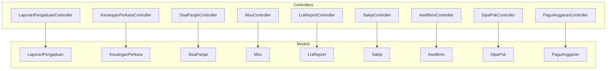

**Diagram sources**
- [LaporanPengaduan.php:1-44](file://app/Models/LaporanPengaduan.php#L1-L44)
- [KeuanganPerkara.php:1-43](file://app/Models/KeuanganPerkara.php#L1-L43)
- [SisaPanjar.php:1-35](file://app/Models/SisaPanjar.php#L1-L35)
- [Mou.php:1-25](file://app/Models/Mou.php#L1-L25)
- [LraReport.php:1-24](file://app/Models/LraReport.php#L1-L24)
- [Sakip.php:1-24](file://app/Models/Sakip.php#L1-L24)
- [AsetBmn.php:1-21](file://app/Models/AsetBmn.php#L1-L21)
- [DipaPok.php:1-43](file://app/Models/DipaPok.php#L1-L43)
- [PaguAnggaran.php:1-30](file://app/Models/PaguAnggaran.php#L1-L30)
- [LaporanPengaduanController.php:1-137](file://app/Http/Controllers/LaporanPengaduanController.php#L1-L137)
- [KeuanganPerkaraController.php:1-192](file://app/Http/Controllers/KeuanganPerkaraController.php#L1-L192)
- [SisaPanjarController.php:1-199](file://app/Http/Controllers/SisaPanjarController.php#L1-L199)
- [MouController.php:1-134](file://app/Http/Controllers/MouController.php#L1-L134)
- [LraReportController.php:1-234](file://app/Http/Controllers/LraReportController.php#L1-L234)
- [SakipController.php:1-252](file://app/Http/Controllers/SakipController.php#L1-L252)
- [AsetBmnController.php:1-167](file://app/Http/Controllers/AsetBmnController.php#L1-L167)
- [DipaPokController.php:1-192](file://app/Http/Controllers/DipaPokController.php#L1-L192)
- [PaguAnggaranController.php:1-65](file://app/Http/Controllers/PaguAnggaranController.php#L1-L65)

**Section sources**
- [LaporanPengaduan.php:1-44](file://app/Models/LaporanPengaduan.php#L1-L44)
- [KeuanganPerkara.php:1-43](file://app/Models/KeuanganPerkara.php#L1-L43)
- [SisaPanjar.php:1-35](file://app/Models/SisaPanjar.php#L1-L35)
- [Mou.php:1-25](file://app/Models/Mou.php#L1-L25)
- [LraReport.php:1-24](file://app/Models/LraReport.php#L1-L24)
- [Sakip.php:1-24](file://app/Models/Sakip.php#L1-L24)
- [AsetBmn.php:1-21](file://app/Models/AsetBmn.php#L1-L21)
- [DipaPok.php:1-43](file://app/Models/DipaPok.php#L1-L43)
- [PaguAnggaran.php:1-30](file://app/Models/PaguAnggaran.php#L1-L30)
- [LaporanPengaduanController.php:1-137](file://app/Http/Controllers/LaporanPengaduanController.php#L1-L137)
- [KeuanganPerkaraController.php:1-192](file://app/Http/Controllers/KeuanganPerkaraController.php#L1-L192)
- [SisaPanjarController.php:1-199](file://app/Http/Controllers/SisaPanjarController.php#L1-L199)
- [MouController.php:1-134](file://app/Http/Controllers/MouController.php#L1-L134)
- [LraReportController.php:1-234](file://app/Http/Controllers/LraReportController.php#L1-L234)
- [SakipController.php:1-252](file://app/Http/Controllers/SakipController.php#L1-L252)
- [AsetBmnController.php:1-167](file://app/Http/Controllers/AsetBmnController.php#L1-L167)
- [DipaPokController.php:1-192](file://app/Http/Controllers/DipaPokController.php#L1-L192)
- [PaguAnggaranController.php:1-65](file://app/Http/Controllers/PaguAnggaranController.php#L1-L65)

## Core Components
This section summarizes each model’s purpose, fields, validations, and reporting characteristics.

- LaporanPengaduan
  - Purpose: Track complaint statistics by month and category per year.
  - Fields: Year, category, monthly counts, processed and remaining counts.
  - Validations: Year range, category enumeration, non-negative integers for counts.
  - Reporting: Ordered by predefined categories; supports yearly retrieval and totals.
  - Calculations: None embedded; aggregation handled by queries.

- KeuanganPerkara
  - Purpose: Monthly case financial summary (opening balance, receipts, expenditures).
  - Fields: Year, month, opening balance, receipts, expenditures, optional detail link.
  - Validations: Year/month ranges, non-negative amounts, optional file upload.
  - Reporting: Monthly ordering; supports file upload to cloud/local storage.
  - Calculations: None embedded; derived metrics (e.g., closing balance) can be computed externally.

- SisaPanjar
  - Purpose: Track advance payment balances per case with settlement status.
  - Fields: Year, month, case number, claimant, remaining amount, status, settlement date.
  - Validations: Year/month ranges, numeric amount, status enumeration, optional date.
  - Reporting: Pagination with filters; supports status-based queries.
  - Calculations: None embedded; settlement date normalization to date type.

- Mou
  - Purpose: Memoranda of understanding records with dynamic status and expiry.
  - Fields: Dates, institution, subject, end date, document link, extracted year.
  - Validations: Date ranges, MIME types, optional file upload.
  - Reporting: Dynamic status “active”/“expired”/“unknown”; pagination.
  - Calculations: Expiry status and days remaining computed at runtime.

- LraReport
  - Purpose: Financial statements (LRA) with period and classification.
  - Fields: Year, DIPA type, period, title, file and cover URLs.
  - Validations: Enumerations for DIPA type and period, PDF upload for file.
  - Reporting: Paginated results; supports file upload to cloud/local.
  - Calculations: None embedded; documents referenced by URL.

- Sakip
  - Purpose: Strategic planning documents with fixed types.
  - Fields: Year, document type, description, document link.
  - Validations: Document type enumeration, optional file upload.
  - Reporting: Fixed order of document types; supports duplicates check.
  - Calculations: None embedded.

- AsetBmn
  - Purpose: State property reports with fixed report types.
  - Fields: Year, report type, document link.
  - Validations: Report type enumeration, optional file upload.
  - Reporting: Fixed order of report types; supports duplicates check.
  - Calculations: None embedded.

- DipaPok
  - Purpose: Annual budget planning documents with auto-generated code.
  - Fields: Internal ID, code, type, year, revision, issuance date, allocation, document links, last update.
  - Validations: Numeric/year/date constraints, optional PDF uploads.
  - Reporting: Searchable by year and keywords; paginated.
  - Calculations: Auto-generated code from type/year/revision.

- PaguAnggaran
  - Purpose: Budget ceilings per DIPA and category per year.
  - Fields: DIPA, category, amount, year.
  - Validations: Non-negative numeric amount, year range.
  - Reporting: Upsert semantics; updates related realization records.
  - Calculations: Recompute related realization records’ remaining balance and percentage upon update.

**Section sources**
- [LaporanPengaduan.php:1-44](file://app/Models/LaporanPengaduan.php#L1-L44)
- [KeuanganPerkara.php:1-43](file://app/Models/KeuanganPerkara.php#L1-L43)
- [SisaPanjar.php:1-35](file://app/Models/SisaPanjar.php#L1-L35)
- [Mou.php:1-25](file://app/Models/Mou.php#L1-L25)
- [LraReport.php:1-24](file://app/Models/LraReport.php#L1-L24)
- [Sakip.php:1-24](file://app/Models/Sakip.php#L1-L24)
- [AsetBmn.php:1-21](file://app/Models/AsetBmn.php#L1-L21)
- [DipaPok.php:1-43](file://app/Models/DipaPok.php#L1-L43)
- [PaguAnggaran.php:1-30](file://app/Models/PaguAnggaran.php#L1-L30)

## Architecture Overview
The system follows a layered architecture:
- Controllers handle HTTP requests, validation, file uploads, and pagination.
- Models define persistence, casting, and constants.
- Business logic for derived metrics resides in controllers (e.g., percentage computation, status derivation).

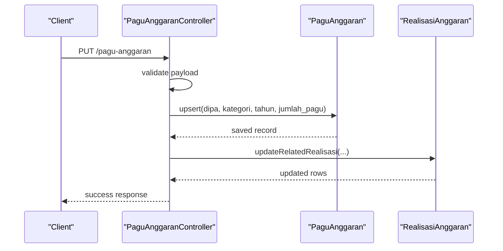

**Diagram sources**
- [PaguAnggaranController.php:20-57](file://app/Http/Controllers/PaguAnggaranController.php#L20-L57)
- [PaguAnggaran.php:1-30](file://app/Models/PaguAnggaran.php#L1-L30)

**Section sources**
- [PaguAnggaranController.php:1-65](file://app/Http/Controllers/PaguAnggaranController.php#L1-L65)
- [PaguAnggaran.php:1-30](file://app/Models/PaguAnggaran.php#L1-L30)

## Detailed Component Analysis

### LaporanPengaduan (Complaint Processing)
- Administrative workflows:
  - Create/update complaint counts per category and month.
  - Retrieve yearly summaries ordered by predefined categories.
  - Prevent duplicate entries per year-category combination.
- Data validation:
  - Year within a realistic range.
  - Category must match a predefined list.
  - Monthly and derived counters must be non-negative integers.
- Reporting:
  - Results ordered by category sequence.
  - Supports filtering by year.
- Mathematical computations:
  - No embedded calculations; totals can be aggregated via queries.

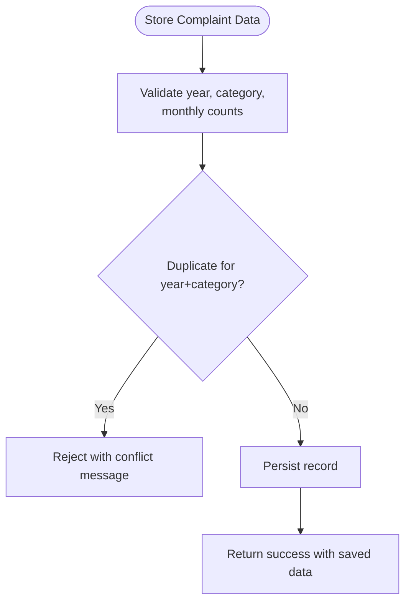

**Diagram sources**
- [LaporanPengaduanController.php:74-106](file://app/Http/Controllers/LaporanPengaduanController.php#L74-L106)
- [LaporanPengaduan.php:11-42](file://app/Models/LaporanPengaduan.php#L11-L42)

**Section sources**
- [LaporanPengaduan.php:1-44](file://app/Models/LaporanPengaduan.php#L1-L44)
- [LaporanPengaduanController.php:1-137](file://app/Http/Controllers/LaporanPengaduanController.php#L1-L137)

### KeuanganPerkara (Case Financials)
- Administrative workflows:
  - Record monthly financial summaries for cases.
  - Upload supporting documents to cloud or local storage.
  - Prevent duplicate entries per year-month combination.
- Data validation:
  - Year and month ranges enforced.
  - Amounts non-negative; optional file upload with MIME/type limits.
- Reporting:
  - Sort by year desc, month asc.
  - Optional file link returned for detail.
- Mathematical computations:
  - No embedded calculations; closing balance can be derived externally.

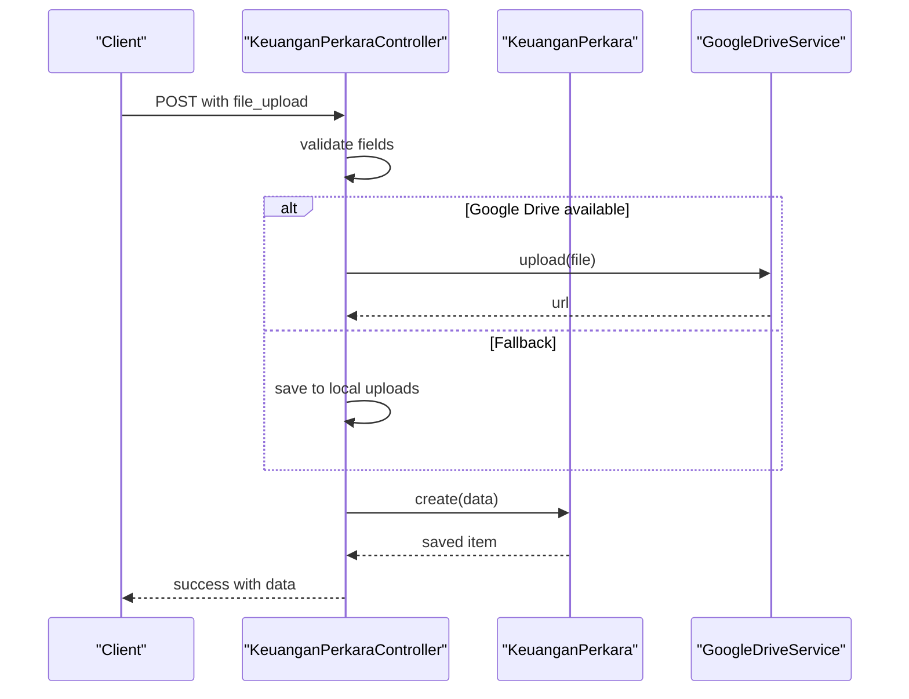

**Diagram sources**
- [KeuanganPerkaraController.php:57-120](file://app/Http/Controllers/KeuanganPerkaraController.php#L57-L120)
- [KeuanganPerkara.php:1-43](file://app/Models/KeuanganPerkara.php#L1-L43)

**Section sources**
- [KeuanganPerkara.php:1-43](file://app/Models/KeuanganPerkara.php#L1-L43)
- [KeuanganPerkaraController.php:1-192](file://app/Http/Controllers/KeuanganPerkaraController.php#L1-L192)

### SisaPanjar (Advance Payments)
- Administrative workflows:
  - Register remaining advance amounts per case.
  - Update settlement status and date.
  - Filter by year/status/month with pagination.
- Data validation:
  - Year/month ranges, numeric amount, status enumeration, optional date.
- Reporting:
  - Paginated results; supports status filtering.
- Mathematical computations:
  - No embedded calculations; settlement date normalized to date type.

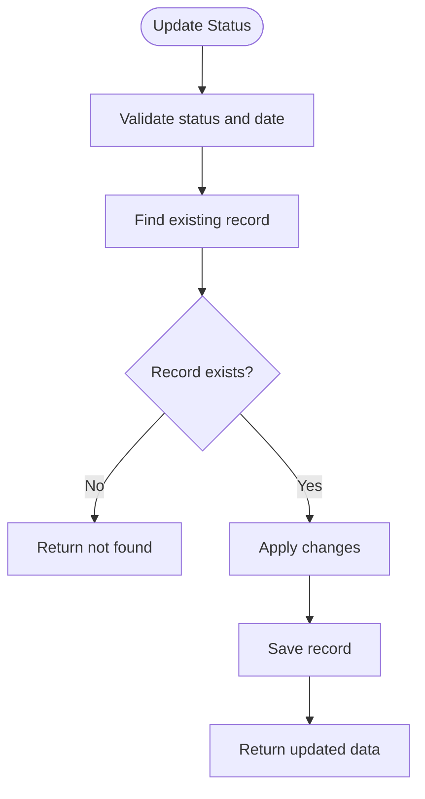

**Diagram sources**
- [SisaPanjarController.php:133-171](file://app/Http/Controllers/SisaPanjarController.php#L133-L171)
- [SisaPanjar.php:1-35](file://app/Models/SisaPanjar.php#L1-L35)

**Section sources**
- [SisaPanjar.php:1-35](file://app/Models/SisaPanjar.php#L1-L35)
- [SisaPanjarController.php:1-199](file://app/Http/Controllers/SisaPanjarController.php#L1-L199)

### Mou (Memoranda of Understanding)
- Administrative workflows:
  - Add/update MOU with document upload.
  - Compute dynamic status (“active”, “expired”, “unknown”) and days remaining.
- Data validation:
  - Date ranges, MIME constraints, optional file upload.
- Reporting:
  - Paginated with status and remaining days computed per item.
- Mathematical computations:
  - Status and days remaining computed at runtime using today’s date.

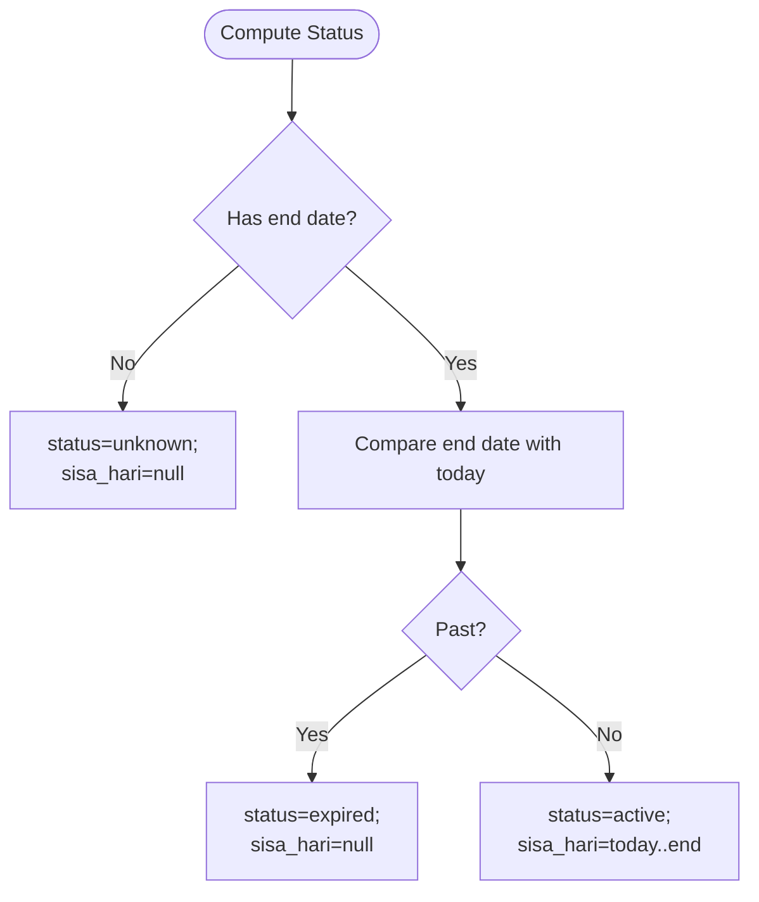

**Diagram sources**
- [MouController.php:112-132](file://app/Http/Controllers/MouController.php#L112-L132)
- [Mou.php:1-25](file://app/Models/Mou.php#L1-L25)

**Section sources**
- [Mou.php:1-25](file://app/Models/Mou.php#L1-L25)
- [MouController.php:1-134](file://app/Http/Controllers/MouController.php#L1-L134)

### LraReport (Financial Statements)
- Administrative workflows:
  - Manage LRA reports with period and classification.
  - Upload PDF and optional cover image to cloud/local.
- Data validation:
  - Enumerations for DIPA type and period; file constraints.
- Reporting:
  - Paginated results ordered by year/type/period.
- Mathematical computations:
  - None embedded; documents referenced by URL.

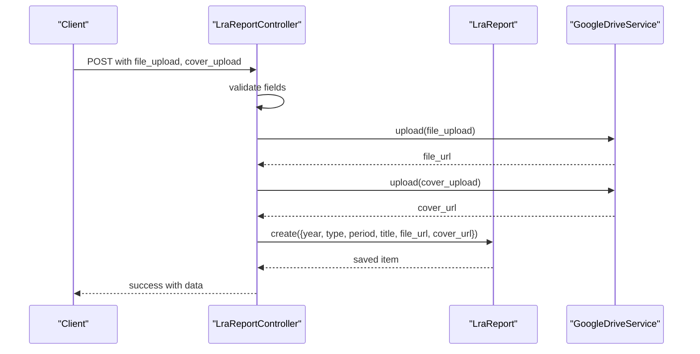

**Diagram sources**
- [LraReportController.php:80-116](file://app/Http/Controllers/LraReportController.php#L80-L116)
- [LraReport.php:1-24](file://app/Models/LraReport.php#L1-L24)

**Section sources**
- [LraReport.php:1-24](file://app/Models/LraReport.php#L1-L24)
- [LraReportController.php:1-234](file://app/Http/Controllers/LraReportController.php#L1-L234)

### Sakip (Strategic Planning)
- Administrative workflows:
  - Store strategic planning documents with fixed types.
  - Prevent duplicates by year-type combination.
- Data validation:
  - Document type enumeration, optional file upload.
- Reporting:
  - Fixed order of document types; supports duplicates check.
- Mathematical computations:
  - None embedded.

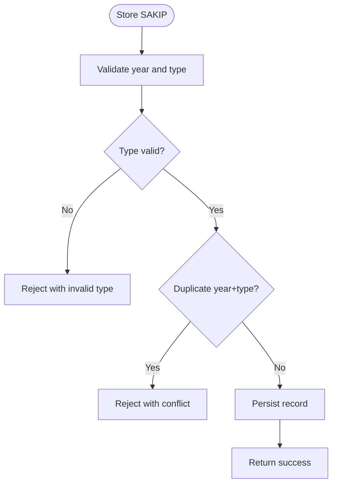

**Diagram sources**
- [SakipController.php:111-154](file://app/Http/Controllers/SakipController.php#L111-L154)
- [Sakip.php:1-24](file://app/Models/Sakip.php#L1-L24)

**Section sources**
- [Sakip.php:1-24](file://app/Models/Sakip.php#L1-L24)
- [SakipController.php:1-252](file://app/Http/Controllers/SakipController.php#L1-L252)

### AsetBmn (State Property)
- Administrative workflows:
  - Manage state property reports with fixed types.
  - Prevent duplicates by year-type combination.
- Data validation:
  - Report type enumeration, optional file upload.
- Reporting:
  - Fixed order of report types; supports duplicates check.
- Mathematical computations:
  - None embedded.

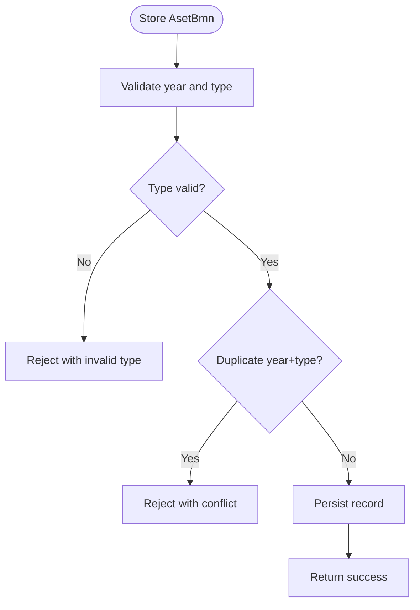

**Diagram sources**
- [AsetBmnController.php:71-105](file://app/Http/Controllers/AsetBmnController.php#L71-L105)
- [AsetBmn.php:1-21](file://app/Models/AsetBmn.php#L1-L21)

**Section sources**
- [AsetBmn.php:1-21](file://app/Models/AsetBmn.php#L1-L21)
- [AsetBmnController.php:1-167](file://app/Http/Controllers/AsetBmnController.php#L1-L167)

### DipaPok (Annual Budget Planning)
- Administrative workflows:
  - Manage annual budget planning documents.
  - Auto-generate internal code from type/year/revision.
  - Upload DIPA and POK documents.
- Data validation:
  - Numeric/year/date constraints, optional PDF uploads.
- Reporting:
  - Searchable by year and keywords; paginated.
- Mathematical computations:
  - Auto-generated code; no runtime calculations.

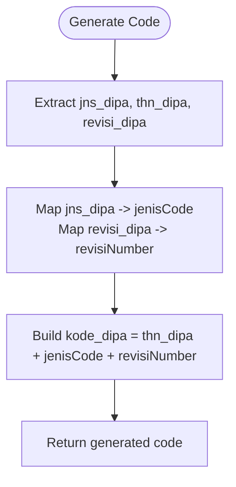

**Diagram sources**
- [DipaPokController.php:63-71](file://app/Http/Controllers/DipaPokController.php#L63-L71)
- [DipaPok.php:1-43](file://app/Models/DipaPok.php#L1-L43)

**Section sources**
- [DipaPok.php:1-43](file://app/Models/DipaPok.php#L1-L43)
- [DipaPokController.php:1-192](file://app/Http/Controllers/DipaPokController.php#L1-L192)

### PaguAnggaran (Budget Allocation)
- Administrative workflows:
  - Upsert budget ceilings per DIPA/category/year.
  - Automatically reconcile related realization records.
- Data validation:
  - Non-negative numeric amount, year range.
- Reporting:
  - Simple GET with optional filters; returns persisted records.
- Mathematical computations:
  - Recompute related realization records’ remaining balance and percentage when pagu changes.

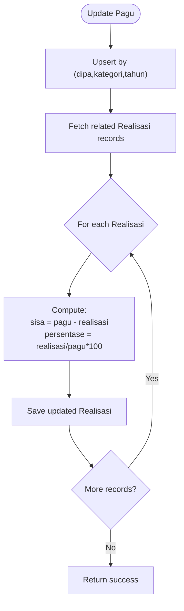

**Diagram sources**
- [PaguAnggaranController.php:29-57](file://app/Http/Controllers/PaguAnggaranController.php#L29-L57)
- [PaguAnggaran.php:1-30](file://app/Models/PaguAnggaran.php#L1-L30)

**Section sources**
- [PaguAnggaran.php:1-30](file://app/Models/PaguAnggaran.php#L1-L30)
- [PaguAnggaranController.php:1-65](file://app/Http/Controllers/PaguAnggaranController.php#L1-L65)

## Dependency Analysis
- Controllers depend on their respective models for persistence and on shared base controller utilities for sanitization and file upload helpers.
- PaguAnggaranController depends on RealisasiAnggaran records to reconcile derived metrics.
- MouController computes status dynamically using Carbon dates.
- LraReportController and others rely on GoogleDriveService for cloud uploads with local fallback.

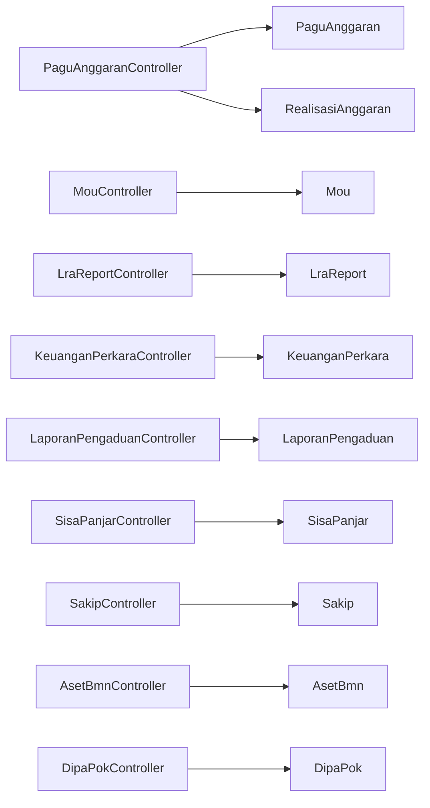

**Diagram sources**
- [PaguAnggaranController.php:1-65](file://app/Http/Controllers/PaguAnggaranController.php#L1-L65)
- [PaguAnggaran.php:1-30](file://app/Models/PaguAnggaran.php#L1-L30)
- [MouController.php:1-134](file://app/Http/Controllers/MouController.php#L1-L134)
- [Mou.php:1-25](file://app/Models/Mou.php#L1-L25)
- [LraReportController.php:1-234](file://app/Http/Controllers/LraReportController.php#L1-L234)
- [LraReport.php:1-24](file://app/Models/LraReport.php#L1-L24)
- [KeuanganPerkaraController.php:1-192](file://app/Http/Controllers/KeuanganPerkaraController.php#L1-L192)
- [KeuanganPerkara.php:1-43](file://app/Models/KeuanganPerkara.php#L1-L43)
- [LaporanPengaduanController.php:1-137](file://app/Http/Controllers/LaporanPengaduanController.php#L1-L137)
- [LaporanPengaduan.php:1-44](file://app/Models/LaporanPengaduan.php#L1-L44)
- [SisaPanjarController.php:1-199](file://app/Http/Controllers/SisaPanjarController.php#L1-L199)
- [SisaPanjar.php:1-35](file://app/Models/SisaPanjar.php#L1-L35)
- [SakipController.php:1-252](file://app/Http/Controllers/SakipController.php#L1-L252)
- [Sakip.php:1-24](file://app/Models/Sakip.php#L1-L24)
- [AsetBmnController.php:1-167](file://app/Http/Controllers/AsetBmnController.php#L1-L167)
- [AsetBmn.php:1-21](file://app/Models/AsetBmn.php#L1-L21)
- [DipaPokController.php:1-192](file://app/Http/Controllers/DipaPokController.php#L1-L192)
- [DipaPok.php:1-43](file://app/Models/DipaPok.php#L1-L43)

**Section sources**
- [PaguAnggaranController.php:1-65](file://app/Http/Controllers/PaguAnggaranController.php#L1-L65)
- [MouController.php:1-134](file://app/Http/Controllers/MouController.php#L1-L134)
- [LraReportController.php:1-234](file://app/Http/Controllers/LraReportController.php#L1-L234)
- [KeuanganPerkaraController.php:1-192](file://app/Http/Controllers/KeuanganPerkaraController.php#L1-L192)
- [LaporanPengaduanController.php:1-137](file://app/Http/Controllers/LaporanPengaduanController.php#L1-L137)
- [SisaPanjarController.php:1-199](file://app/Http/Controllers/SisaPanjarController.php#L1-L199)
- [SakipController.php:1-252](file://app/Http/Controllers/SakipController.php#L1-L252)
- [AsetBmnController.php:1-167](file://app/Http/Controllers/AsetBmnController.php#L1-L167)
- [DipaPokController.php:1-192](file://app/Http/Controllers/DipaPokController.php#L1-L192)

## Performance Considerations
- Pagination: Several controllers use pagination to limit payload sizes (e.g., SisaPanjar limits to 500 items for public views).
- Indexing: Queries filter by year and sort by month/year; ensure database indexes on these columns for optimal performance.
- File uploads: Cloud fallback reduces server load but adds latency; consider CDN and caching for document URLs.
- Derived metrics: Recomputing related realization records after pagu updates is efficient for moderate volumes; monitor for large-scale reconciliation workloads.

[No sources needed since this section provides general guidance]

## Troubleshooting Guide
- Validation failures:
  - Year out of range, invalid enumerations, or mismatched types cause 422 responses.
- Duplicate entries:
  - Controllers reject duplicates for year+category (LaporanPengaduan), year+type (Sakip/AsetBmn), and year+month (KeuanganPerkara).
- File upload errors:
  - Google Drive unavailability triggers local fallback; verify permissions and quotas.
- Missing records:
  - Controllers return 404 for non-existent IDs; ensure correct IDs are used.
- Status computation:
  - Mou status depends on current date; confirm timezone and date parsing.

**Section sources**
- [LaporanPengaduanController.php:93-100](file://app/Http/Controllers/LaporanPengaduanController.php#L93-L100)
- [KeuanganPerkaraController.php:69-76](file://app/Http/Controllers/KeuanganPerkaraController.php#L69-L76)
- [SakipController.php:128-137](file://app/Http/Controllers/SakipController.php#L128-L137)
- [AsetBmnController.php:83-92](file://app/Http/Controllers/AsetBmnController.php#L83-L92)
- [MouController.php:115-132](file://app/Http/Controllers/MouController.php#L115-L132)
- [LraReportController.php:198-232](file://app/Http/Controllers/LraReportController.php#L198-L232)
- [SisaPanjarController.php:173-197](file://app/Http/Controllers/SisaPanjarController.php#L173-L197)

## Conclusion
These administrative models provide structured support for budget tracking, case financials, and organizational management. They enforce strong validation, maintain fixed enumerations for consistency, and compute dynamic statuses where needed. Controllers orchestrate workflows, handle file uploads, and reconcile related records—particularly for budget allocations. The documented flows and validations enable reliable administrative reporting, budget reconciliation, and compliance tracking.

[No sources needed since this section summarizes without analyzing specific files]

## Appendices
- Example administrative reporting scenarios:
  - Monthly case financial summaries: Use KeuanganPerkara to compile receipts and expenditures per month; export totals for audit.
  - Complaint trends: Aggregate LaporanPengaduan by category and month to produce trend reports.
  - Budget reconciliation: After updating PaguAnggaran, reconcile RealisasiAnggaran to reflect new ceilings and percentages.
  - Compliance tracking: Monitor Mou status and remaining days to ensure timely renewals.
  - Strategic documents: Publish Sakip and AsetBmn reports in fixed order for oversight.

[No sources needed since this section provides general guidance]