# Advance Payments Model (SisaPanjar)

<cite>
**Referenced Files in This Document**
- [SisaPanjar.php](file://app/Models/SisaPanjar.php)
- [SisaPanjarController.php](file://app/Http/Controllers/SisaPanjarController.php)
- [2026_04_01_000001_create_sisa_panjar_table.php](file://database/migrations/2026_04_01_000001_create_sisa_panjar_table.php)
- [SisaPanjarSeeder.php](file://database/seeders/SisaPanjarSeeder.php)
- [sisa-panjar.html](file://docs/sisa-panjar.html)
- [sisa_panjar_joomla.md](file://docs/sisa_panjar_joomla.md)
- [KeuanganPerkara.php](file://app/Models/KeuanganPerkara.php)
- [KeuanganPerkaraController.php](file://app/Http/Controllers/KeuanganPerkaraController.php)
- [web.php](file://routes/web.php)
</cite>

## Table of Contents
1. [Introduction](#introduction)
2. [Project Structure](#project-structure)
3. [Core Components](#core-components)
4. [Architecture Overview](#architecture-overview)
5. [Detailed Component Analysis](#detailed-component-analysis)
6. [Dependency Analysis](#dependency-analysis)
7. [Performance Considerations](#performance-considerations)
8. [Troubleshooting Guide](#troubleshooting-guide)
9. [Conclusion](#conclusion)
10. [Appendices](#appendices)

## Introduction
This document explains the SisaPanjar model and its ecosystem for managing advance payment tracking and cash flow management for court operations. It focuses on:
- Monthly advance payment reconciliation system
- Cash register management and payment distribution tracking
- Payment status tracking and reporting
- Relationship between advance payments and operational expenses
- Approval workflows and reimbursement processes
- Examples of cash flow management scenarios, monthly reconciliation procedures, and administrative payment tracking workflows

The SisaPanjar module tracks remaining advance payments (sisa panjar) from court cases, categorizing them by status ("belum_diambil" vs "disetor_kas_negara") and month/year for reconciliation and reporting.

## Project Structure
The SisaPanjar feature spans the model, controller, migration, seeder, API routes, and frontend integration documentation.

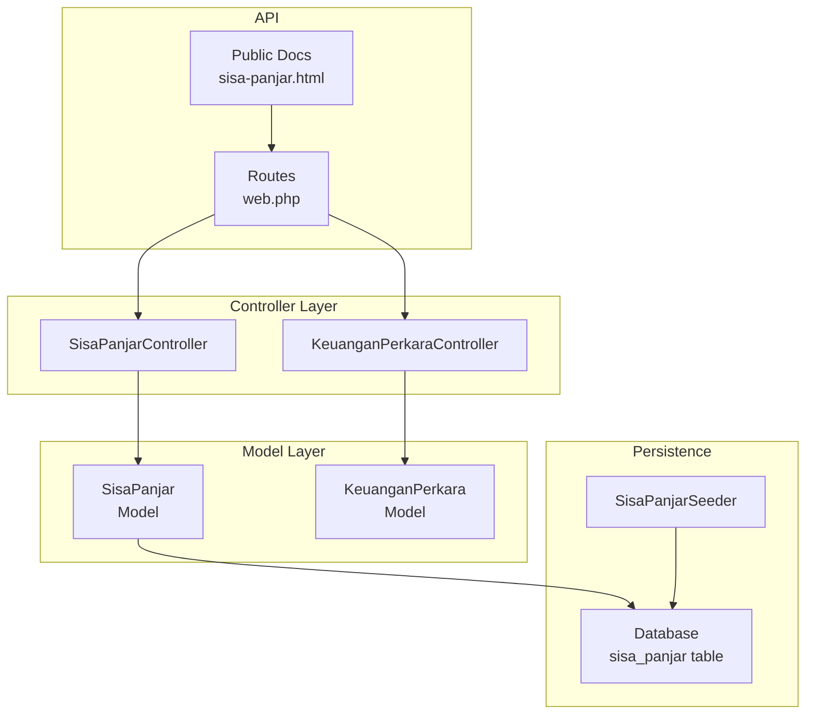

**Diagram sources**
- [SisaPanjar.php:1-35](file://app/Models/SisaPanjar.php#L1-L35)
- [KeuanganPerkara.php:1-43](file://app/Models/KeuanganPerkara.php#L1-L43)
- [SisaPanjarController.php:1-199](file://app/Http/Controllers/SisaPanjarController.php#L1-L199)
- [KeuanganPerkaraController.php:1-192](file://app/Http/Controllers/KeuanganPerkaraController.php#L1-L192)
- [2026_04_01_000001_create_sisa_panjar_table.php:1-43](file://database/migrations/2026_04_01_000001_create_sisa_panjar_table.php#L1-L43)
- [SisaPanjarSeeder.php:1-274](file://database/seeders/SisaPanjarSeeder.php#L1-L274)
- [web.php:65-68](file://routes/web.php#L65-L68)
- [sisa-panjar.html:1-453](file://docs/sisa-panjar.html#L1-L453)

**Section sources**
- [SisaPanjar.php:1-35](file://app/Models/SisaPanjar.php#L1-L35)
- [SisaPanjarController.php:1-199](file://app/Http/Controllers/SisaPanjarController.php#L1-L199)
- [2026_04_01_000001_create_sisa_panjar_table.php:1-43](file://database/migrations/2026_04_01_000001_create_sisa_panjar_table.php#L1-L43)
- [SisaPanjarSeeder.php:1-274](file://database/seeders/SisaPanjarSeeder.php#L1-L274)
- [web.php:65-68](file://routes/web.php#L65-L68)
- [sisa-panjar.html:1-453](file://docs/sisa-panjar.html#L1-L453)

## Core Components
- SisaPanjar Model: Defines the data structure, casting, and accessor for the sisa panjar record.
- SisaPanjarController: Implements API endpoints for listing, filtering, retrieving by year, creating, updating, and deleting sisa panjar records.
- Database Migration: Creates the sisa_panjar table with indexes for efficient querying.
- Seeder: Seeds historical sisa panjar records for demonstration and testing.
- Frontend Integration: Public HTML page and Joomla integration guide for displaying and filtering sisa panjar data.

Key responsibilities:
- Track remaining advance payments per case
- Categorize by month and year
- Track status and settlement date
- Provide APIs for admin and public consumption
- Enable reconciliation and reporting

**Section sources**
- [SisaPanjar.php:1-35](file://app/Models/SisaPanjar.php#L1-L35)
- [SisaPanjarController.php:1-199](file://app/Http/Controllers/SisaPanjarController.php#L1-L199)
- [2026_04_01_000001_create_sisa_panjar_table.php:1-43](file://database/migrations/2026_04_01_000001_create_sisa_panjar_table.php#L1-L43)
- [SisaPanjarSeeder.php:1-274](file://database/seeders/SisaPanjarSeeder.php#L1-L274)
- [sisa-panjar.html:1-453](file://docs/sisa-panjar.html#L1-L453)

## Architecture Overview
The SisaPanjar module follows a standard MVC pattern with explicit API endpoints and public documentation pages.

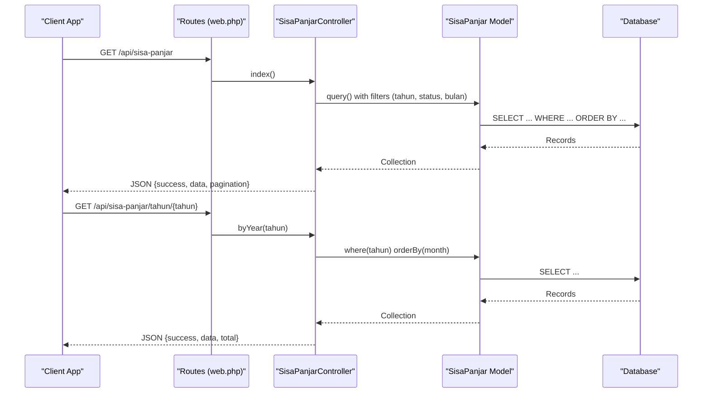

**Diagram sources**
- [web.php:65-68](file://routes/web.php#L65-L68)
- [SisaPanjarController.php:21-83](file://app/Http/Controllers/SisaPanjarController.php#L21-L83)
- [SisaPanjar.php:1-35](file://app/Models/SisaPanjar.php#L1-L35)

## Detailed Component Analysis

### SisaPanjar Model
The model defines the sisa panjar entity with:
- Table name: sisa_panjar
- Fillable attributes: tahun, bulan, nomor_perkara, nama_penggugat_pemohon, jumlah_sisa_panjar, status, tanggal_setor_kas_negara
- Casts: tahun and bulan as integers, jumlah_sisa_panjar as decimal with 2 decimals, tanggal_setor_kas_negara as date, timestamps as datetime
- Accessor: formatted date for tanggal_setor_kas_negara

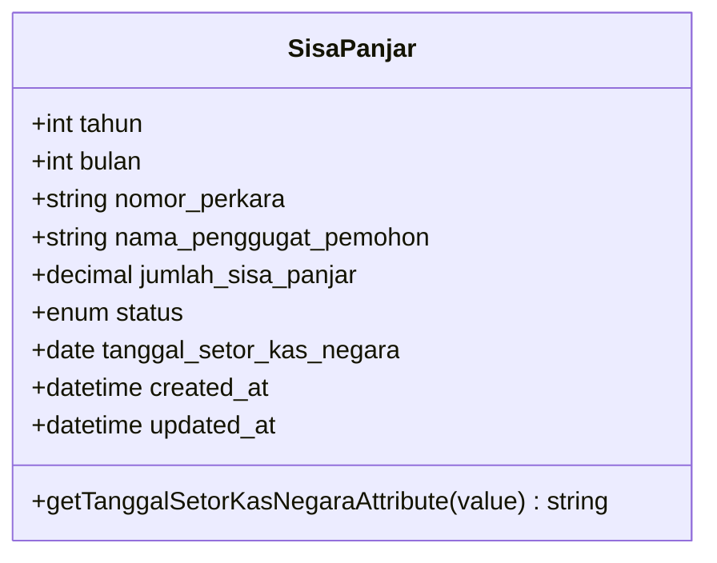

**Diagram sources**
- [SisaPanjar.php:7-35](file://app/Models/SisaPanjar.php#L7-L35)

**Section sources**
- [SisaPanjar.php:1-35](file://app/Models/SisaPanjar.php#L1-L35)

### SisaPanjarController
Endpoints:
- GET /api/sisa-panjar: List with pagination and filters (tahun, status, bulan). Limits to 500 for public page performance.
- GET /api/sisa-panjar/{id}: Retrieve a single record.
- GET /api/sisa-panjar/tahun/{tahun}: Retrieve all records for a given year.
- POST /api/sisa-panjar: Create a new record with validation.
- PUT /api/sisa-panjar/{id}: Update an existing record with validation.
- DELETE /api/sisa-panjar/{id}: Delete a record.

Validation and sanitization:
- Strict validation for numeric ranges and enums
- Sanitization for nomor_perkara field
- Pagination limit enforced for public consumption

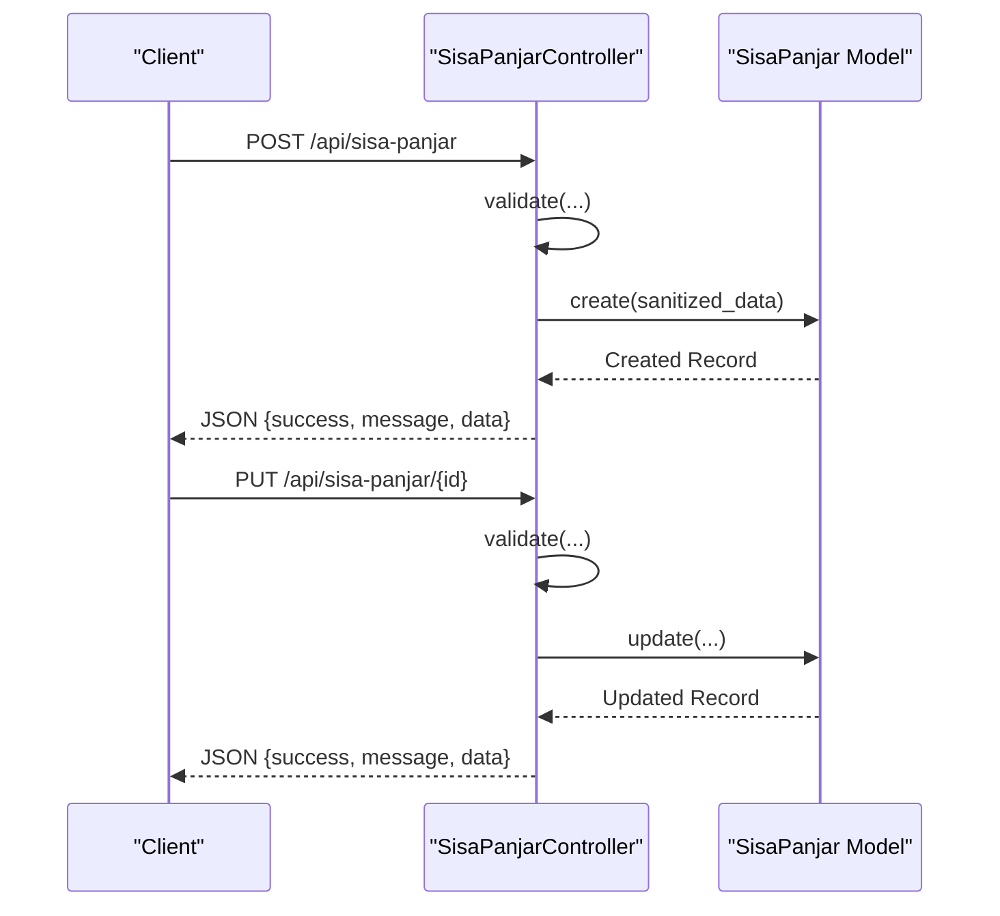

**Diagram sources**
- [SisaPanjarController.php:109-171](file://app/Http/Controllers/SisaPanjarController.php#L109-L171)
- [SisaPanjar.php:1-35](file://app/Models/SisaPanjar.php#L1-L35)

**Section sources**
- [SisaPanjarController.php:1-199](file://app/Http/Controllers/SisaPanjarController.php#L1-L199)

### Database Migration and Seeder
- Migration creates the sisa_panjar table with:
  - Indexes on (tahun, bulan) and status for fast filtering
  - Enum status with default "belum_diambil"
  - Decimal amount with precision for currency
- Seeder populates historical records spanning multiple years, mixing "belum_diambil" and "disetor_kas_negara" statuses

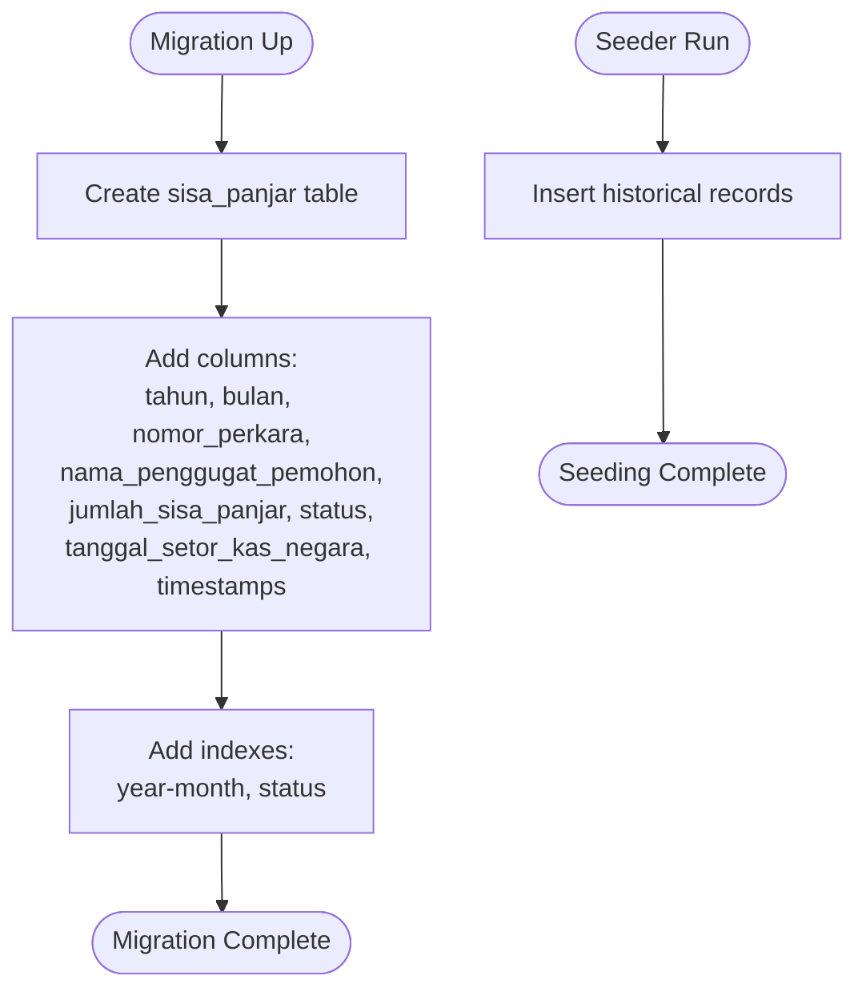

**Diagram sources**
- [2026_04_01_000001_create_sisa_panjar_table.php:14-31](file://database/migrations/2026_04_01_000001_create_sisa_panjar_table.php#L14-L31)
- [SisaPanjarSeeder.php:15-274](file://database/seeders/SisaPanjarSeeder.php#L15-L274)

**Section sources**
- [2026_04_01_000001_create_sisa_panjar_table.php:1-43](file://database/migrations/2026_04_01_000001_create_sisa_panjar_table.php#L1-L43)
- [SisaPanjarSeeder.php:1-274](file://database/seeders/SisaPanjarSeeder.php#L1-L274)

### Frontend Integration (Public Page and Joomla)
- Public HTML page uses DataTables to display sisa panjar data with:
  - Filters for tahun and status
  - Footer aggregation of total amounts
  - Client-side rendering and formatting
- Joomla integration guide provides helper functions and template layouts to embed the data in Joomla sites.

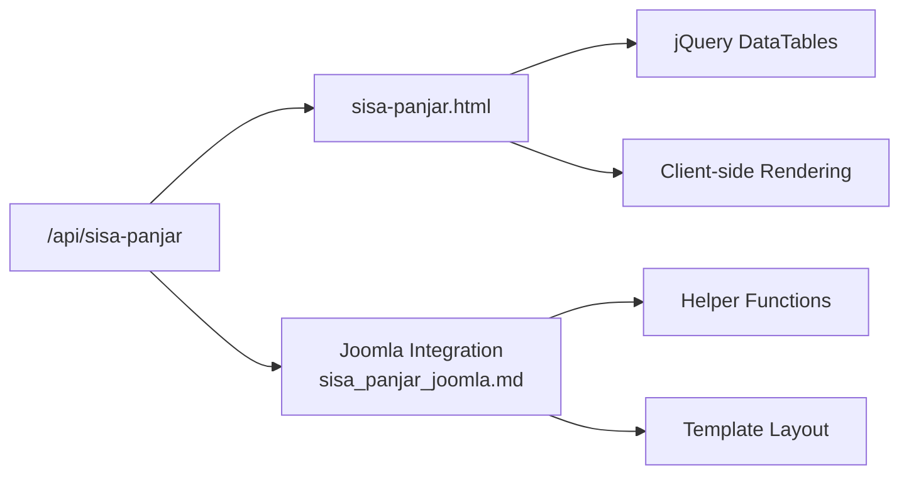

**Diagram sources**
- [sisa-panjar.html:266-452](file://docs/sisa-panjar.html#L266-L452)
- [sisa_panjar_joomla.md:50-295](file://docs/sisa_panjar_joomla.md#L50-L295)

**Section sources**
- [sisa-panjar.html:1-453](file://docs/sisa-panjar.html#L1-L453)
- [sisa_panjar_joomla.md:1-449](file://docs/sisa_panjar_joomla.md#L1-L449)

### Relationship to Operational Expenses and Cash Flow
While SisaPanjar specifically tracks remaining advance payments, it complements the KeuanganPerkara module which reports monthly cash flow (income and expenses) for court operations. Together, they support:
- Monthly reconciliation: Compare sisa panjar status against monthly cash flow trends
- Expense tracking: Link operational expenses to case-related cash movements
- Reporting: Generate consolidated monthly reports combining sisa panjar and cash flow data

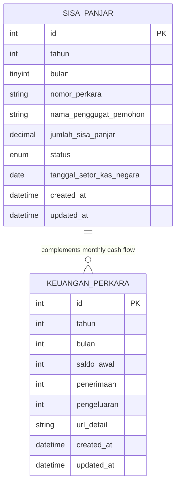

**Diagram sources**
- [KeuanganPerkara.php:7-43](file://app/Models/KeuanganPerkara.php#L7-L43)
- [SisaPanjar.php:7-35](file://app/Models/SisaPanjar.php#L7-L35)

**Section sources**
- [KeuanganPerkara.php:1-43](file://app/Models/KeuanganPerkara.php#L1-L43)
- [KeuanganPerkaraController.php:1-192](file://app/Http/Controllers/KeuanganPerkaraController.php#L1-L192)

## Architecture Overview
The SisaPanjar module integrates with the broader financial reporting ecosystem through shared routes and complementary models.

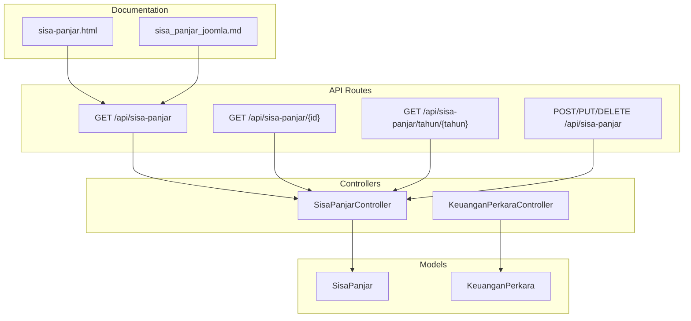

**Diagram sources**
- [web.php:65-68](file://routes/web.php#L65-L68)
- [SisaPanjarController.php:1-199](file://app/Http/Controllers/SisaPanjarController.php#L1-L199)
- [KeuanganPerkaraController.php:1-192](file://app/Http/Controllers/KeuanganPerkaraController.php#L1-L192)
- [sisa-panjar.html:1-453](file://docs/sisa-panjar.html#L1-L453)
- [sisa_panjar_joomla.md:1-449](file://docs/sisa_panjar_joomla.md#L1-L449)

## Detailed Component Analysis

### Monthly Advance Payment Reconciliation System
- Filtering by tahun and status enables monthly reconciliation:
  - "belum_diambil" indicates outstanding sisa panjar requiring follow-up
  - "disetor_kas_negara" indicates settlement to government treasury
- The byYear endpoint orders by month ascending for chronological reconciliation.

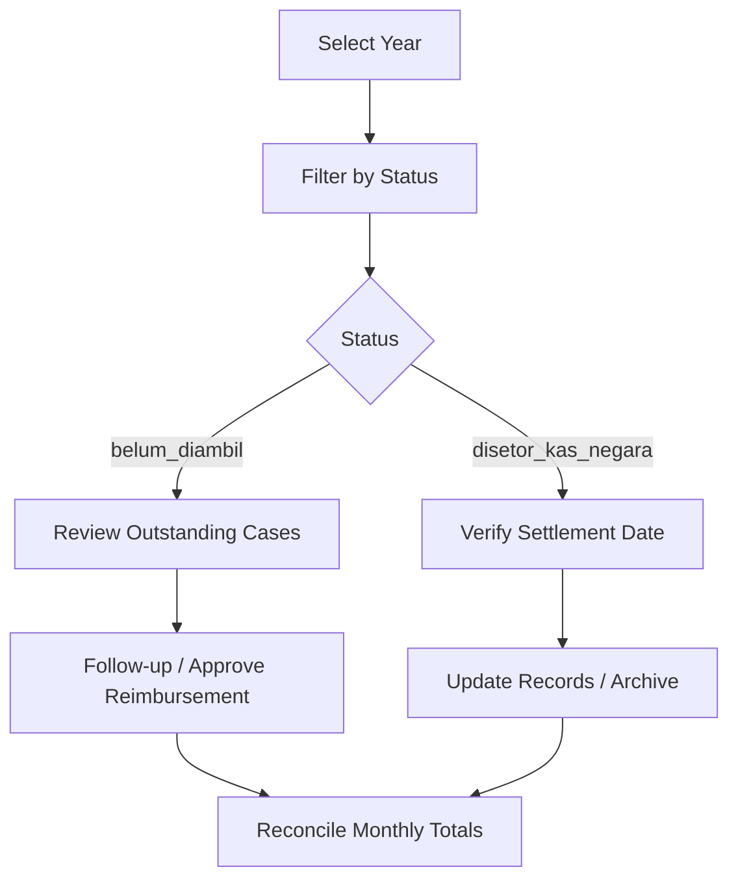

**Section sources**
- [SisaPanjarController.php:63-83](file://app/Http/Controllers/SisaPanjarController.php#L63-L83)
- [SisaPanjar.php:21-28](file://app/Models/SisaPanjar.php#L21-L28)

### Cash Register Management and Payment Distribution Tracking
- The model stores jumlah_sisa_panjar as a decimal amount, enabling precise cash tracking.
- tanggal_setor_kas_negara captures the settlement date, linking sisa panjar to cash register entries.
- Frontend displays totals and supports filtering to monitor cash distribution.

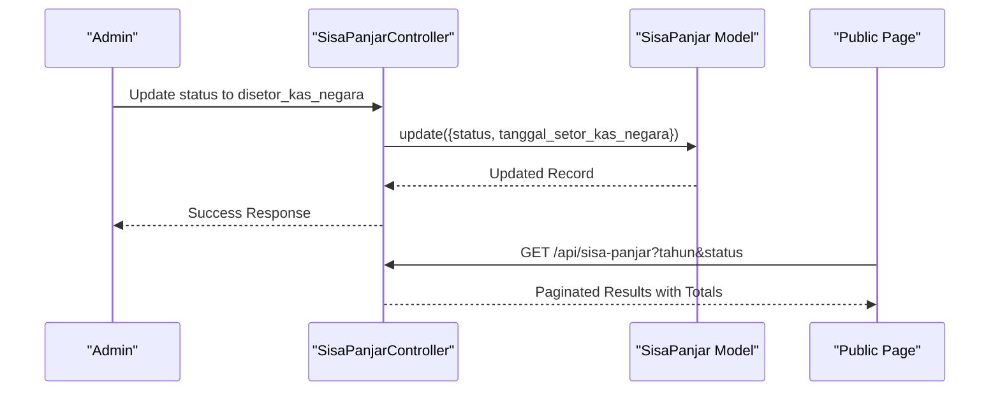

**Section sources**
- [SisaPanjarController.php:133-171](file://app/Http/Controllers/SisaPanjarController.php#L133-L171)
- [sisa-panjar.html:412-421](file://docs/sisa-panjar.html#L412-L421)

### Payment Status Tracking and Reporting
- Status enum supports two states: "belum_diambil" and "disetor_kas_negara".
- The public page aggregates totals and renders status badges for quick identification.

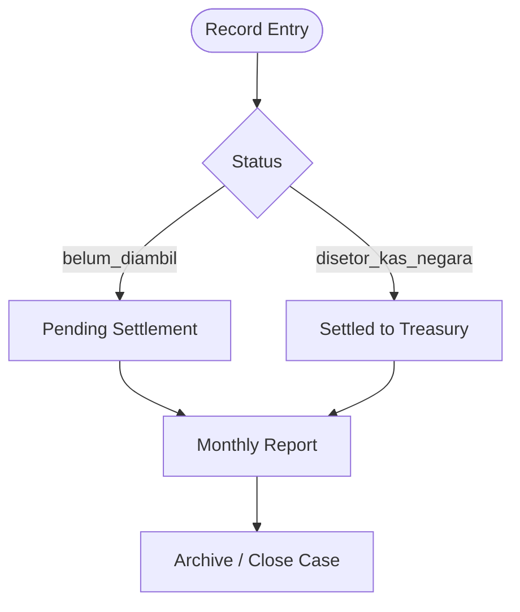

**Section sources**
- [2026_04_01_000001_create_sisa_panjar_table.php:23-24](file://database/migrations/2026_04_01_000001_create_sisa_panjar_table.php#L23-L24)
- [sisa-panjar.html:412-421](file://docs/sisa-panjar.html#L412-L421)

### Relationship Between Advance Payments and Operational Expenses
- SisaPanjar tracks remaining advance payments per case.
- KeuanganPerkara tracks monthly income and expenses for the court.
- Together, they enable:
  - Cash flow monitoring aligned with case outcomes
  - Expense attribution to specific cases
  - Reconciliation of sisa panjar against operational cash movements

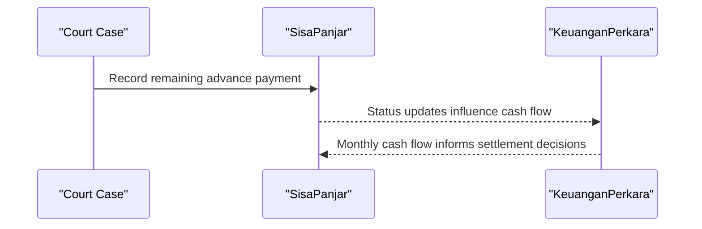

**Section sources**
- [KeuanganPerkara.php:1-43](file://app/Models/KeuanganPerkara.php#L1-L43)
- [KeuanganPerkaraController.php:1-192](file://app/Http/Controllers/KeuanganPerkaraController.php#L1-L192)

### Approval Workflows and Reimbursement Processes
- Validation ensures data integrity during creation and updates.
- Status transitions require administrative action (e.g., marking as settled).
- The public page and Joomla integration provide visibility for oversight.

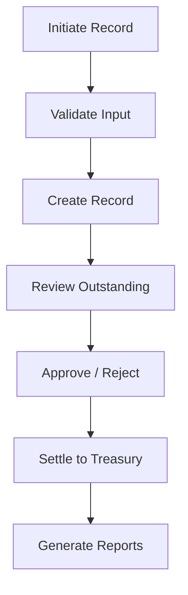

**Section sources**
- [SisaPanjarController.php:109-171](file://app/Http/Controllers/SisaPanjarController.php#L109-L171)
- [sisa-panjar.html:212-217](file://docs/sisa-panjar.html#L212-L217)

### Examples of Cash Flow Management Scenarios
- Scenario 1: Monthly reconciliation
  - Filter by tahun and status to identify outstanding sisa panjar
  - Cross-reference with KeuanganPerkara monthly cash flow
  - Update records and generate consolidated report
- Scenario 2: Administrative tracking
  - Use byYear endpoint to review annual trends
  - Apply frontend filters to drill down by month and status
  - Export or archive processed records

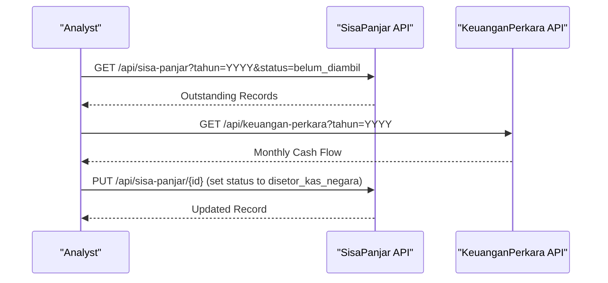

**Section sources**
- [SisaPanjarController.php:63-83](file://app/Http/Controllers/SisaPanjarController.php#L63-L83)
- [KeuanganPerkaraController.php:35-46](file://app/Http/Controllers/KeuanganPerkaraController.php#L35-L46)

## Dependency Analysis
- SisaPanjarController depends on SisaPanjar model for persistence and validation.
- Routes define the public and protected endpoints for SisaPanjar.
- Public documentation pages depend on the API for live data.
- KeuanganPerkara provides complementary cash flow data for reconciliation.

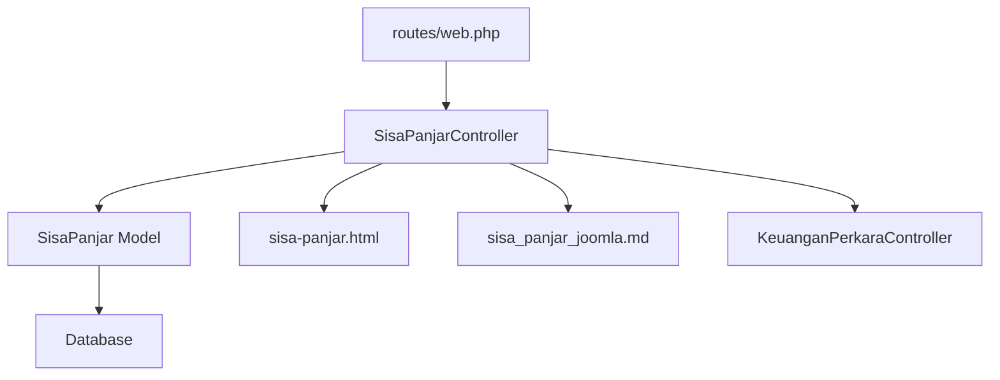

**Diagram sources**
- [web.php:65-68](file://routes/web.php#L65-L68)
- [SisaPanjarController.php:1-199](file://app/Http/Controllers/SisaPanjarController.php#L1-L199)
- [sisa-panjar.html:1-453](file://docs/sisa-panjar.html#L1-L453)
- [sisa_panjar_joomla.md:1-449](file://docs/sisa_panjar_joomla.md#L1-L449)
- [KeuanganPerkaraController.php:1-192](file://app/Http/Controllers/KeuanganPerkaraController.php#L1-L192)

**Section sources**
- [web.php:65-68](file://routes/web.php#L65-L68)
- [SisaPanjarController.php:1-199](file://app/Http/Controllers/SisaPanjarController.php#L1-L199)

## Performance Considerations
- Pagination limit of 500 items for public consumption to prevent heavy client-side rendering.
- Database indexes on (tahun, bulan) and status improve query performance for filtering.
- Frontend DataTables handle client-side sorting and aggregation efficiently.

[No sources needed since this section provides general guidance]

## Troubleshooting Guide
Common issues and resolutions:
- Invalid ID or missing records: Ensure ID > 0 and record exists before update/delete.
- Invalid year/month filters: Validate ranges (tahun 2000–2100, bulan 1–12).
- Duplicate data: Use byYear endpoint to check existing records before insertion.
- File upload failures (when extending to KeuanganPerkara): Verify Google Drive service availability or fallback to local storage.

**Section sources**
- [SisaPanjarController.php:133-197](file://app/Http/Controllers/SisaPanjarController.php#L133-L197)
- [KeuanganPerkaraController.php:57-120](file://app/Http/Controllers/KeuanganPerkaraController.php#L57-L120)

## Conclusion
The SisaPanjar module provides a robust foundation for tracking and reconciling advance payments in court operations. By integrating with the KeuanganPerkara module and leveraging public documentation pages, it enables transparent, auditable cash flow management. The model’s strict validation, controller’s comprehensive endpoints, and frontend integrations collectively support monthly reconciliation, payment distribution tracking, and administrative oversight.

[No sources needed since this section summarizes without analyzing specific files]

## Appendices

### API Definitions
- GET /api/sisa-panjar: List with pagination and filters (tahun, status, bulan)
- GET /api/sisa-panjar/{id}: Retrieve a single record
- GET /api/sisa-panjar/tahun/{tahun}: Retrieve all records for a given year
- POST /api/sisa-panjar: Create a new record
- PUT /api/sisa-panjar/{id}: Update an existing record
- DELETE /api/sisa-panjar/{id}: Delete a record

**Section sources**
- [web.php:65-68](file://routes/web.php#L65-L68)
- [SisaPanjarController.php:21-197](file://app/Http/Controllers/SisaPanjarController.php#L21-L197)

### Data Structure Summary
- SisaPanjar fields: tahun, bulan, nomor_perkara, nama_penggugat_pemohon, jumlah_sisa_panjar, status, tanggal_setor_kas_negara, timestamps
- Status enum: belum_diambil, disetor_kas_negara
- Amount precision: decimal with 2 decimals for currency

**Section sources**
- [SisaPanjar.php:11-28](file://app/Models/SisaPanjar.php#L11-L28)
- [2026_04_01_000001_create_sisa_panjar_table.php:18-25](file://database/migrations/2026_04_01_000001_create_sisa_panjar_table.php#L18-L25)