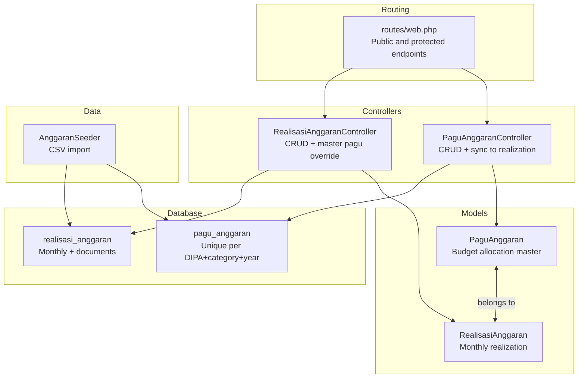
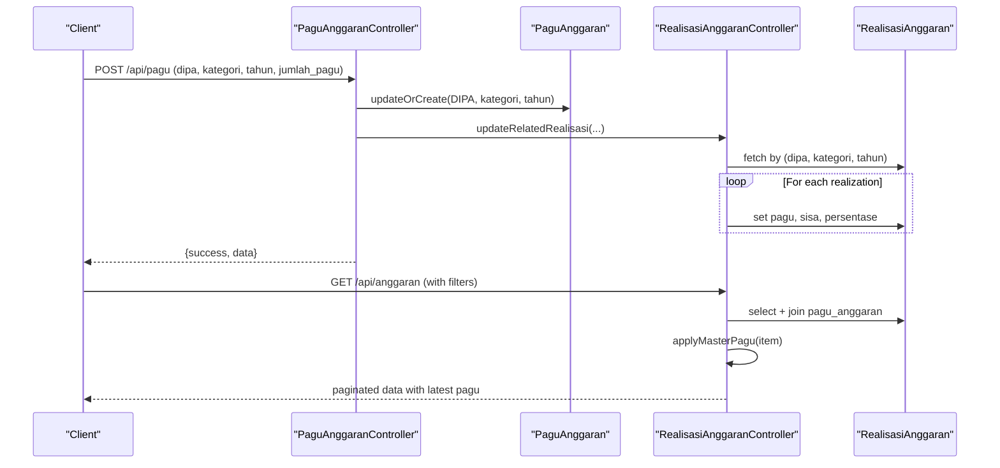
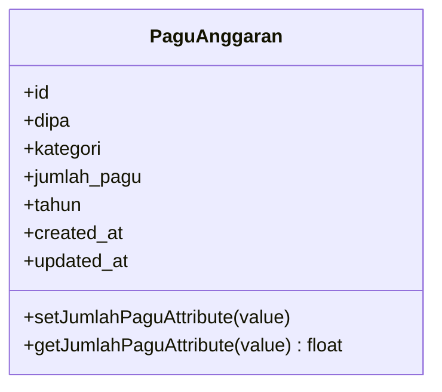
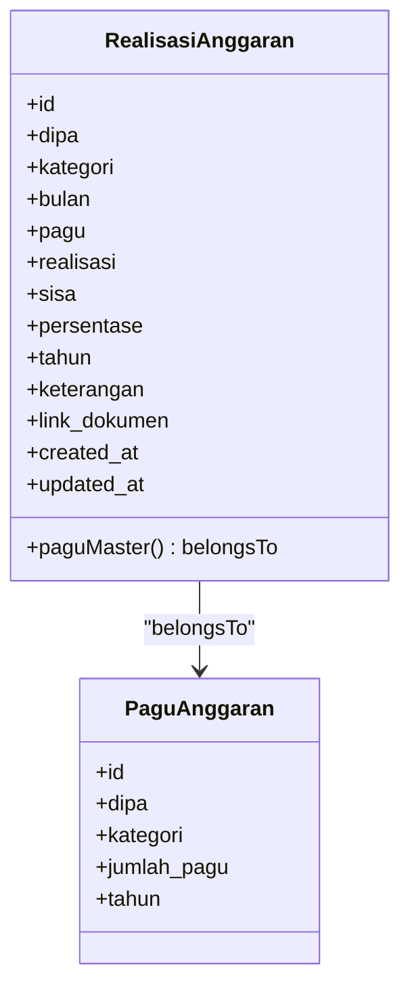
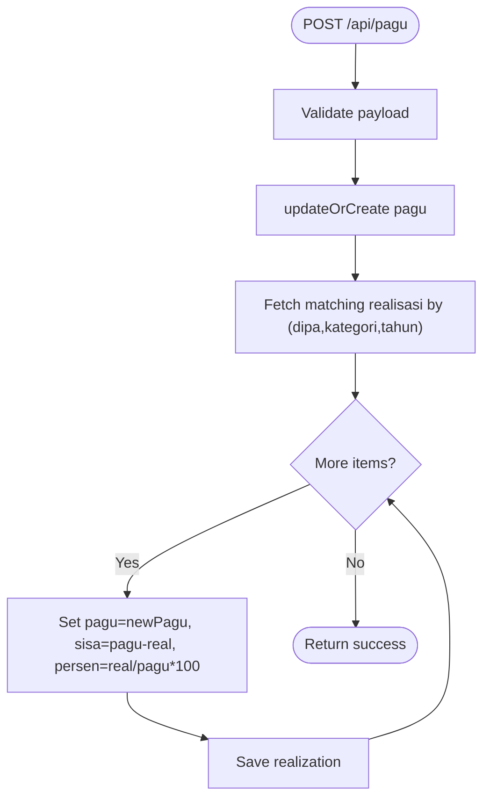
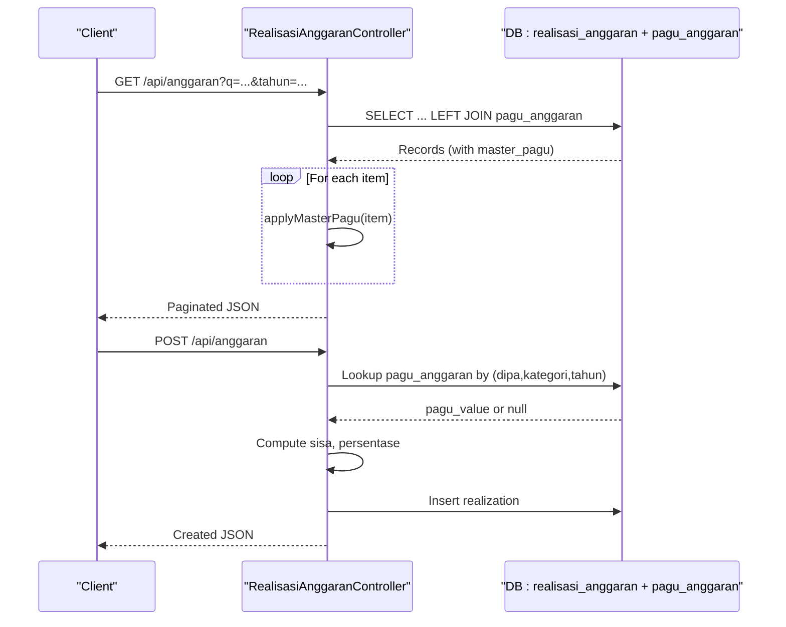
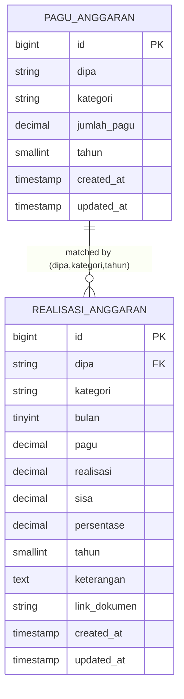
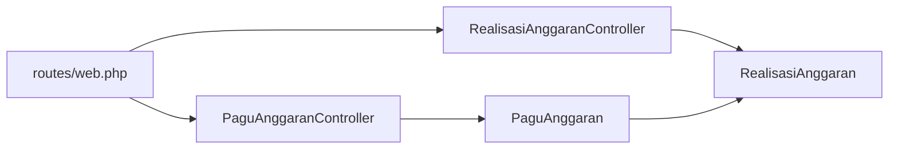

# Budget Allocation Model (PaguAnggaran)

<cite>
**Referenced Files in This Document**
- [PaguAnggaran.php](file://app/Models/PaguAnggaran.php)
- [RealisasiAnggaran.php](file://app/Models/RealisasiAnggaran.php)
- [PaguAnggaranController.php](file://app/Http/Controllers/PaguAnggaranController.php)
- [RealisasiAnggaranController.php](file://app/Http/Controllers/RealisasiAnggaranController.php)
- [create_pagu_anggaran_table.php](file://database/migrations/2026_02_10_000002_create_pagu_anggaran_table.php)
- [create_realisasi_anggaran_table.php](file://database/migrations/2026_02_10_000000_create_realisasi_anggaran_table.php)
- [update_realisasi_anggaran_add_month.php](file://database/migrations/2026_02_10_000001_update_realisasi_anggaran_add_month.php)
- [AnggaranSeeder.php](file://database/seeders/AnggaranSeeder.php)
- [web.php](file://routes/web.php)
- [joomla-integration-anggaran.html](file://docs/joomla-integration-anggaran.html)
</cite>

## Table of Contents
1. [Introduction](#introduction)
2. [Project Structure](#project-structure)
3. [Core Components](#core-components)
4. [Architecture Overview](#architecture-overview)
5. [Detailed Component Analysis](#detailed-component-analysis)
6. [Dependency Analysis](#dependency-analysis)
7. [Performance Considerations](#performance-considerations)
8. [Troubleshooting Guide](#troubleshooting-guide)
9. [Conclusion](#conclusion)
10. [Appendices](#appendices)

## Introduction
This document describes the budget allocation model centered around the PaguAnggaran entity, which manages budget allocation and funding tracking across categories and programs. It explains:
- How budget allocation is modeled and persisted
- Category-based funding distribution and monthly realization tracking
- Expenditure monitoring via the realization table
- Overspending detection mechanisms
- Relationship between budget allocation and program implementation
- Approval and reporting workflows supported by the system

The model integrates tightly with the realization tracking system to ensure that monthly expenditures are always evaluated against the latest approved budget.

## Project Structure
The budget allocation module spans models, controllers, database migrations, and supporting data seeding and routing:

**Diagram sources**
- [PaguAnggaran.php:1-30](file://app/Models/PaguAnggaran.php#L1-L30)
- [RealisasiAnggaran.php:1-46](file://app/Models/RealisasiAnggaran.php#L1-L46)
- [PaguAnggaranController.php:1-65](file://app/Http/Controllers/PaguAnggaranController.php#L1-L65)
- [RealisasiAnggaranController.php:1-154](file://app/Http/Controllers/RealisasiAnggaranController.php#L1-L154)
- [create_pagu_anggaran_table.php:1-33](file://database/migrations/2026_02_10_000002_create_pagu_anggaran_table.php#L1-L33)
- [create_realisasi_anggaran_table.php:1-36](file://database/migrations/2026_02_10_000000_create_realisasi_anggaran_table.php#L1-L36)
- [update_realisasi_anggaran_add_month.php:1-30](file://database/migrations/2026_02_10_000001_update_realisasi_anggaran_add_month.php#L1-L30)
- [web.php:1-165](file://routes/web.php#L1-L165)
- [AnggaranSeeder.php:1-130](file://database/seeders/AnggaranSeeder.php#L1-L130)

**Section sources**
- [web.php:37-41](file://routes/web.php#L37-L41)
- [web.php:115-117](file://routes/web.php#L115-L117)

## Core Components
- PaguAnggaran: Master budget allocation record keyed by DIPA, category, and year. It stores the approved budget amount and ensures uniqueness per DIPA+category+year.
- RealisasiAnggaran: Monthly realization record linked to the master budget. It tracks pagu, realisasi, sisa, persentase, and optional supporting document links.
- PaguAnggaranController: CRUD for budget allocations, with automatic synchronization to existing realizations when pagu changes.
- RealisasiAnggaranController: CRUD for monthly realizations, with dynamic override of pagu from the latest master budget.

Key behaviors:
- Realization calculations are derived from pagu and realisasi, with sisa = pagu − realisasi and persentase computed as realisasi/pagu × 100.
- When pagu is updated, related realizations are recalculated to reflect the new budget.
- The system supports filtering by year, month, DIPA, and category for reporting and oversight.

**Section sources**
- [PaguAnggaran.php:7-29](file://app/Models/PaguAnggaran.php#L7-L29)
- [RealisasiAnggaran.php:9-45](file://app/Models/RealisasiAnggaran.php#L9-L45)
- [PaguAnggaranController.php:20-57](file://app/Http/Controllers/PaguAnggaranController.php#L20-L57)
- [RealisasiAnggaranController.php:55-120](file://app/Http/Controllers/RealisasiAnggaranController.php#L55-L120)

## Architecture Overview
The system follows a master-detail architecture:
- PaguAnggaran serves as the master budget authority.
- RealisasiAnggaran depends on the master for accurate budget values and computes derived metrics.
- Controllers expose REST endpoints for creation, updates, and retrieval, with route protection and throttling.

**Diagram sources**
- [PaguAnggaranController.php:20-57](file://app/Http/Controllers/PaguAnggaranController.php#L20-L57)
- [RealisasiAnggaranController.php:11-53](file://app/Http/Controllers/RealisasiAnggaranController.php#L11-L53)
- [create_pagu_anggaran_table.php:14-22](file://database/migrations/2026_02_10_000002_create_pagu_anggaran_table.php#L14-L22)
- [create_realisasi_anggaran_table.php:14-25](file://database/migrations/2026_02_10_000000_create_realisasi_anggaran_table.php#L14-L25)

## Detailed Component Analysis

### PaguAnggaran Model
Responsibilities:
- Persist approved budget per DIPA, category, and year.
- Normalize numeric amounts to prevent precision loss during persistence.
- Provide typed accessors and mutators for amount fields.

Data structure:
- Fields: id, dipa, kategori, jumlah_pagu (decimal), tahun, timestamps.
- Unique constraint: (dipa, kategori, tahun) ensures one budget per category per DIPA per year.

Behavior:
- Mutator converts numeric input to string before saving to maintain precision.
- Accessor returns amount as float for convenient computation.

**Diagram sources**
- [PaguAnggaran.php:7-29](file://app/Models/PaguAnggaran.php#L7-L29)
- [create_pagu_anggaran_table.php:14-22](file://database/migrations/2026_02_10_000002_create_pagu_anggaran_table.php#L14-L22)

**Section sources**
- [PaguAnggaran.php:10-28](file://app/Models/PaguAnggaran.php#L10-L28)
- [create_pagu_anggaran_table.php:18-20](file://database/migrations/2026_02_10_000002_create_pagu_anggaran_table.php#L18-L20)

### RealisasiAnggaran Model
Responsibilities:
- Track monthly budget utilization per DIPA, category, and year.
- Maintain derived metrics: pagu, realisasi, sisa, persentase.
- Support optional document linkage for auditability.

Data structure:
- Fields: id, dipa, kategori, bulan, pagu, realisasi, sisa, persentase, tahun, keterangan, link_dokumen, timestamps.
- Indexes: dipa for efficient filtering.

Relationships:
- Belongs to PaguAnggaran via matching dipa, kategori, tahun.

**Diagram sources**
- [RealisasiAnggaran.php:9-22](file://app/Models/RealisasiAnggaran.php#L9-L22)
- [create_realisasi_anggaran_table.php:14-25](file://database/migrations/2026_02_10_000000_create_realisasi_anggaran_table.php#L14-L25)
- [create_pagu_anggaran_table.php:14-22](file://database/migrations/2026_02_10_000002_create_pagu_anggaran_table.php#L14-L22)

**Section sources**
- [RealisasiAnggaran.php:17-22](file://app/Models/RealisasiAnggaran.php#L17-L22)
- [RealisasiAnggaran.php:24-44](file://app/Models/RealisasiAnggaran.php#L24-L44)

### PaguAnggaranController
Endpoints:
- GET /api/pagu: List pagu with optional filters (tahun, dipa).
- POST /api/pagu: Create or update pagu; triggers synchronization to realizations.
- DELETE /api/pagu/{id}: Remove pagu.

Processing logic:
- Validation enforces required fields and numeric bounds.
- updateOrCreate ensures a single pagu per DIPA+category+year.
- updateRelatedRealisasi recalculates pagu, sisa, and persentase for all matching realizations.

**Diagram sources**
- [PaguAnggaranController.php:20-57](file://app/Http/Controllers/PaguAnggaranController.php#L20-L57)

**Section sources**
- [PaguAnggaranController.php:11-18](file://app/Http/Controllers/PaguAnggaranController.php#L11-L18)
- [PaguAnggaranController.php:20-38](file://app/Http/Controllers/PaguAnggaranController.php#L20-L38)
- [PaguAnggaranController.php:59-64](file://app/Http/Controllers/PaguAnggaranController.php#L59-L64)

### RealisasiAnggaranController
Endpoints:
- GET /api/anggaran: Paginated list with optional filters (tahun, bulan, dipa, q=search).
- GET /api/anggaran/{id}: Retrieve single realization with latest pagu applied.
- POST /api/anggaran: Create realization; derive pagu from master if exists.
- PUT /api/anggaran/{id}: Update realization; re-derive pagu from master.
- DELETE /api/anggaran/{id}: Remove realization.

Processing logic:
- Index query joins with pagu_anggaran to always present the latest pagu value.
- applyMasterPagu overrides stored pagu with master value and recomputes sisa and persentase.
- Store/update fetch master pagu dynamically and compute derived fields.

**Diagram sources**
- [RealisasiAnggaranController.php:11-53](file://app/Http/Controllers/RealisasiAnggaranController.php#L11-L53)
- [RealisasiAnggaranController.php:55-85](file://app/Http/Controllers/RealisasiAnggaranController.php#L55-L85)
- [RealisasiAnggaranController.php:143-152](file://app/Http/Controllers/RealisasiAnggaranController.php#L143-L152)

**Section sources**
- [RealisasiAnggaranController.php:11-53](file://app/Http/Controllers/RealisasiAnggaranController.php#L11-L53)
- [RealisasiAnggaranController.php:143-152](file://app/Http/Controllers/RealisasiAnggaranController.php#L143-L152)

### Database Schema and Seeding
Schema highlights:
- pagu_anggaran: Unique composite key (dipa, kategori, tahun); decimal(20,2) for jumlah_pagu; year field for tahun.
- realisasi_anggaran: decimal fields for pagu, realisasi, sisa, persentase; integer field bulan (1–12); nullable link_dokumen; indexed dipa.

Seeding:
- AnggaranSeeder reads CSV files for years 2023–2025, creates PaguAnggaran entries per DIPA and category, and seeds monthly RealisasiAnggaran rows with computed sisa and persentase.

**Diagram sources**
- [create_pagu_anggaran_table.php:14-22](file://database/migrations/2026_02_10_000002_create_pagu_anggaran_table.php#L14-L22)
- [create_realisasi_anggaran_table.php:14-25](file://database/migrations/2026_02_10_000000_create_realisasi_anggaran_table.php#L14-L25)
- [update_realisasi_anggaran_add_month.php:14-17](file://database/migrations/2026_02_10_000001_update_realisasi_anggaran_add_month.php#L14-L17)

**Section sources**
- [AnggaranSeeder.php:20-121](file://database/seeders/AnggaranSeeder.php#L20-L121)

## Dependency Analysis
- Controllers depend on models for persistence and on each other for cross-entity updates.
- Models define relationships and casting for precise numeric handling.
- Routing exposes public and protected endpoints with rate limiting and API key middleware.

**Diagram sources**
- [web.php:37-41](file://routes/web.php#L37-L41)
- [web.php:115-117](file://routes/web.php#L115-L117)
- [PaguAnggaranController.php:5-6](file://app/Http/Controllers/PaguAnggaranController.php#L5-L6)
- [RealisasiAnggaranController.php:5-6](file://app/Http/Controllers/RealisasiAnggaranController.php#L5-L6)

**Section sources**
- [web.php:13-76](file://routes/web.php#L13-L76)
- [web.php:78-164](file://routes/web.php#L78-L164)

## Performance Considerations
- Numeric precision: Using decimal(20,2) for monetary fields prevents floating-point drift.
- Casting: Accessors/mutators normalize numeric types for safe persistence and computation.
- Indexing: Indexed dipa in realisasi_anggaran accelerates filtering queries.
- Join strategy: Controllers join with pagu_anggaran to avoid stale values and ensure latest budget is used for reporting.
- Pagination: Controllers paginate results to manage large datasets efficiently.

[No sources needed since this section provides general guidance]

## Troubleshooting Guide
Common issues and resolutions:
- Stale pagu values in reports: Ensure index queries join with pagu_anggaran and applyMasterPagu to override stored pagu with the latest value.
- Unexpected zero percentages: Verify pagu is greater than zero before computing percentage; fallback to zero is handled in controllers.
- Missing document links: Confirm file upload validation and storage path; controller sets link_dokumen when a valid file is uploaded.
- Duplicate pagu entries: Unique constraint on (dipa, kategori, tahun) prevents duplicates; use updateOrCreate to safely reconcile changes.
- Overspending detection: Monitor sisa values; when sisa becomes negative, it indicates overspending relative to the latest pagu.

**Section sources**
- [RealisasiAnggaranController.php:14-53](file://app/Http/Controllers/RealisasiAnggaranController.php#L14-L53)
- [RealisasiAnggaranController.php:143-152](file://app/Http/Controllers/RealisasiAnggaranController.php#L143-L152)
- [PaguAnggaranController.php:43-57](file://app/Http/Controllers/PaguAnggaranController.php#L43-L57)

## Conclusion
The PaguAnggaran model provides a robust foundation for budget allocation and oversight. By centralizing approved budgets and synchronizing them to monthly realizations, the system ensures accurate, up-to-date tracking of fund utilization. Controllers enforce validation, maintain referential integrity, and support comprehensive reporting and auditing through document links and filtered queries.

[No sources needed since this section summarizes without analyzing specific files]

## Appendices

### Budget Allocation Methodology
- Approval process: Approved budgets are stored in pagu_anggaran with unique keys (dipa, kategori, tahun).
- Distribution: Monthly realizations under each category accumulate against the approved pagu.
- Monitoring: RealisasiAnggaranController computes sisa and persentase using the latest pagu.

**Section sources**
- [create_pagu_anggaran_table.php:18-20](file://database/migrations/2026_02_10_000002_create_pagu_anggaran_table.php#L18-L20)
- [RealisasiAnggaranController.php:73-84](file://app/Http/Controllers/RealisasiAnggaranController.php#L73-L84)

### Category-Based Funding Distribution
- Categories: Examples include Belanja Pegawai, Belanja Barang, Belanja Modal, POSBAKUM, Pembebasan Biaya Perkara, Sidang Di Luar Gedung.
- Distribution: One pagu per category per DIPA per year; monthly realizations track progress per category.

**Section sources**
- [AnggaranSeeder.php:41-85](file://database/seeders/AnggaranSeeder.php#L41-L85)

### Expenditure Monitoring and Overspending Detection
- Real-time calculation: sisa = pagu − realisasi; persentase = (realisasi/pagu) × 100.
- Overspending: Negative sisa indicates overspending relative to the latest pagu.
- Reporting: Filters by year, month, DIPA, and category enable targeted oversight.

**Section sources**
- [RealisasiAnggaranController.php:78-84](file://app/Http/Controllers/RealisasiAnggaranController.php#L78-L84)
- [RealisasiAnggaranController.php:108-120](file://app/Http/Controllers/RealisasiAnggaranController.php#L108-L120)

### Approval Processes and Reporting Requirements
- Endpoints:
  - Public: GET /api/pagu, GET /api/anggaran
  - Protected: POST/PUT/DELETE for pagu and anggaran with API key and rate limiting
- Reporting: Frontend integration consumes /api/anggaran to render pagu, realisasi, sisa, and persentase with interactive tabs and DataTables.

**Section sources**
- [web.php:37-41](file://routes/web.php#L37-L41)
- [web.php:115-117](file://routes/web.php#L115-L117)
- [joomla-integration-anggaran.html:172-264](file://docs/joomla-integration-anggaran.html#L172-L264)