# Budget Planning Model (DipaPok)

<cite>
**Referenced Files in This Document**
- [DipaPok.php](file://app/Models/DipaPok.php)
- [DipaPokController.php](file://app/Http/Controllers/DipaPokController.php)
- [create_dipapok_table.php](file://database/migrations/2026_02_19_000000_create_dipapok_table.php)
- [DipaPokSeeder.php](file://database/seeders/DipaPokSeeder.php)
- [PaguAnggaran.php](file://app/Models/PaguAnggaran.php)
- [PaguAnggaranController.php](file://app/Http/Controllers/PaguAnggaranController.php)
- [RealisasiAnggaran.php](file://app/Models/RealisasiAnggaran.php)
- [RealisasiAnggaranController.php](file://app/Http/Controllers/RealisasiAnggaranController.php)
- [create_pagu_anggaran_table.php](file://database/migrations/2026_02_10_000002_create_pagu_anggaran_table.php)
- [create_realisasi_anggaran_table.php](file://database/migrations/2026_02_10_000000_create_realisasi_anggaran_table.php)
- [web.php](file://routes/web.php)
- [joomla-integration-dipapok.html](file://docs/joomla-integration-dipapok.html)
- [composer.json](file://composer.json)
</cite>

## Table of Contents
1. [Introduction](#introduction)
2. [Project Structure](#project-structure)
3. [Core Components](#core-components)
4. [Architecture Overview](#architecture-overview)
5. [Detailed Component Analysis](#detailed-component-analysis)
6. [Dependency Analysis](#dependency-analysis)
7. [Performance Considerations](#performance-considerations)
8. [Troubleshooting Guide](#troubleshooting-guide)
9. [Conclusion](#conclusion)
10. [Appendices](#appendices)

## Introduction
This document describes the comprehensive budget planning model centered around the DIPA/POK (Annual Budget Planning and Long-term Financial Forecasting) system. It explains the multi-year budget planning framework, expenditure projections, and fiscal planning methodologies implemented in the backend API. The model integrates three primary components:
- DIPA/POK documentation management
- Annual budget allocation (pagu)
- Monthly expenditure tracking and reporting

The system supports approval workflows through document approvals (DIPA and POK), fiscal planning via categorized allocations, and monitoring through monthly realizations with automated recalculations against master budget data.

## Project Structure
The budget planning module is organized around Laravel Lumen MVC patterns with dedicated models, controllers, migrations, and seeders. The API exposes endpoints for CRUD operations on DIPA/POK, pagu allocations, and monthly realizations.

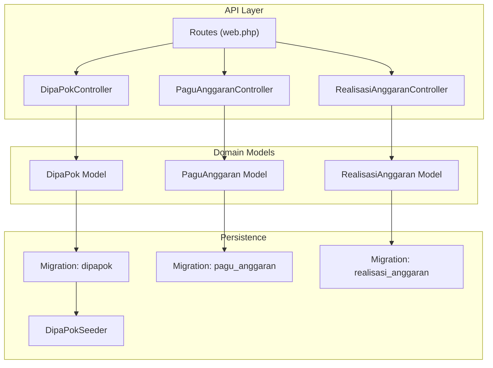

**Diagram sources**
- [web.php:14-164](file://routes/web.php#L14-L164)
- [DipaPokController.php:8-192](file://app/Http/Controllers/DipaPokController.php#L8-L192)
- [PaguAnggaranController.php:9-65](file://app/Http/Controllers/PaguAnggaranController.php#L9-L65)
- [RealisasiAnggaranController.php:9-154](file://app/Http/Controllers/RealisasiAnggaranController.php#L9-L154)
- [DipaPok.php:7-42](file://app/Models/DipaPok.php#L7-L42)
- [PaguAnggaran.php:7-29](file://app/Models/PaguAnggaran.php#L7-L29)
- [RealisasiAnggaran.php:9-45](file://app/Models/RealisasiAnggaran.php#L9-L45)
- [create_dipapok_table.php:11-24](file://database/migrations/2026_02_19_000000_create_dipapok_table.php#L11-L24)
- [create_pagu_anggaran_table.php:14-22](file://database/migrations/2026_02_10_000002_create_pagu_anggaran_table.php#L14-L22)
- [create_realisasi_anggaran_table.php:14-25](file://database/migrations/2026_02_10_000000_create_realisasi_anggaran_table.php#L14-L25)
- [DipaPokSeeder.php:10-65](file://database/seeders/DipaPokSeeder.php#L10-L65)

**Section sources**
- [web.php:14-164](file://routes/web.php#L14-L164)
- [composer.json:22-27](file://composer.json#L22-L27)

## Core Components
This section outlines the three pillars of the budget planning model: DIPA/POK documentation, pagu allocations, and monthly realizations.

- DIPA/POK Management
  - Stores annual budget planning documents and long-term financial forecasts.
  - Supports document uploads for DIPA and POK, with automatic PDF validation and file size limits.
  - Generates standardized codes combining year, department type, and revision level.

- Pagu Allocation
  - Manages annual budget allocations per category and year.
  - Enforces uniqueness constraints per DIPA, category, and year.
  - Automatically updates related realizations when pagu values change.

- Monthly Realization Tracking
  - Tracks monthly expenditures per category and year.
  - Maintains pagu, realization, remaining balance, and percentage metrics.
  - Joins with master pagu data to ensure latest values are reflected.

**Section sources**
- [DipaPok.php:15-34](file://app/Models/DipaPok.php#L15-L34)
- [DipaPokController.php:41-96](file://app/Http/Controllers/DipaPokController.php#L41-L96)
- [PaguAnggaran.php:10-28](file://app/Models/PaguAnggaran.php#L10-L28)
- [PaguAnggaranController.php:20-37](file://app/Http/Controllers/PaguAnggaranController.php#L20-L37)
- [RealisasiAnggaran.php:24-44](file://app/Models/RealisasiAnggaran.php#L24-L44)
- [RealisasiAnggaranController.php:55-84](file://app/Http/Controllers/RealisasiAnggaranController.php#L55-L84)

## Architecture Overview
The system follows a layered architecture:
- Presentation: HTML integration page for DIPA/POK display and filtering
- API: REST endpoints for DIPA/POK, pagu, and realizations
- Domain: Eloquent models encapsulating business logic
- Persistence: Migrations defining schema and seeders populating historical data

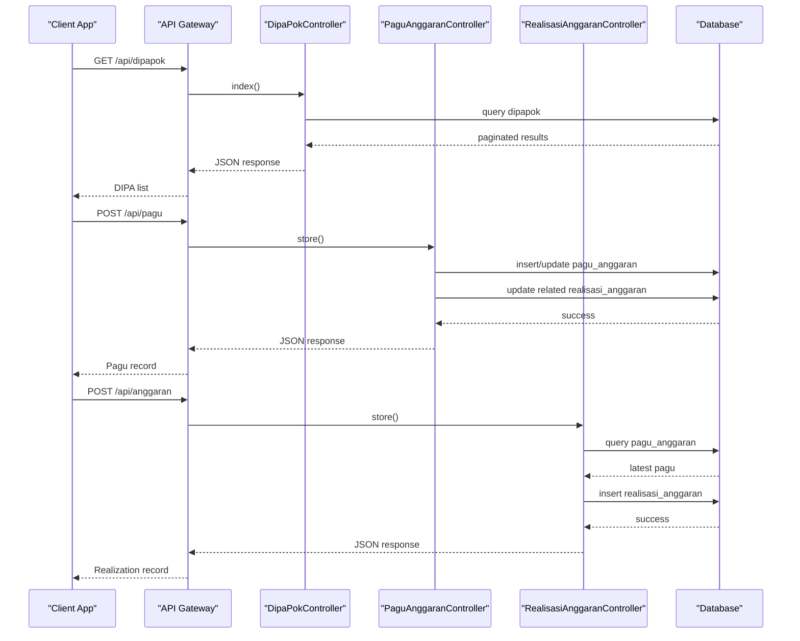

**Diagram sources**
- [web.php:42-123](file://routes/web.php#L42-L123)
- [DipaPokController.php:10-39](file://app/Http/Controllers/DipaPokController.php#L10-L39)
- [PaguAnggaranController.php:20-37](file://app/Http/Controllers/PaguAnggaranController.php#L20-L37)
- [RealisasiAnggaranController.php:55-84](file://app/Http/Controllers/RealisasiAnggaranController.php#L55-L84)

## Detailed Component Analysis

### DIPA/POK Model and Controller
The DIPA/POK component manages annual budget planning documents and long-term financial forecasts. It supports:
- Filtering by year and search across jenis and revisi
- Automatic code generation based on jenis, tahun, and revisi
- File upload for DIPA and POK documents with validation
- Pagination and structured JSON responses

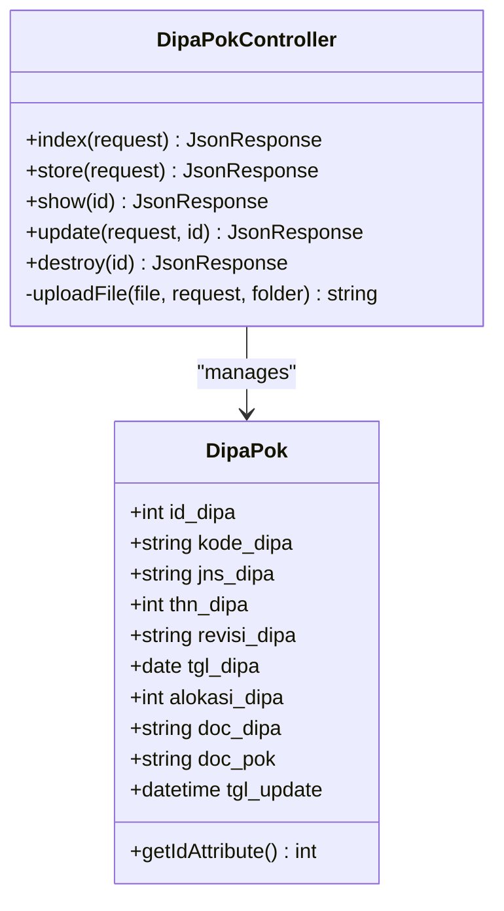

**Diagram sources**
- [DipaPok.php:7-42](file://app/Models/DipaPok.php#L7-L42)
- [DipaPokController.php:8-192](file://app/Http/Controllers/DipaPokController.php#L8-L192)

**Section sources**
- [DipaPok.php:15-41](file://app/Models/DipaPok.php#L15-L41)
- [DipaPokController.php:10-96](file://app/Http/Controllers/DipaPokController.php#L10-L96)
- [create_dipapok_table.php:11-24](file://database/migrations/2026_02_19_000000_create_dipapok_table.php#L11-L24)
- [DipaPokSeeder.php:16-62](file://database/seeders/DipaPokSeeder.php#L16-L62)

### Pagu Allocation Model and Controller
The pagu allocation component defines annual budget ceilings per category and year. It ensures:
- Unique constraint per DIPA, category, and year
- Decimal precision for monetary values
- Automatic recalculation of related realizations when pagu changes

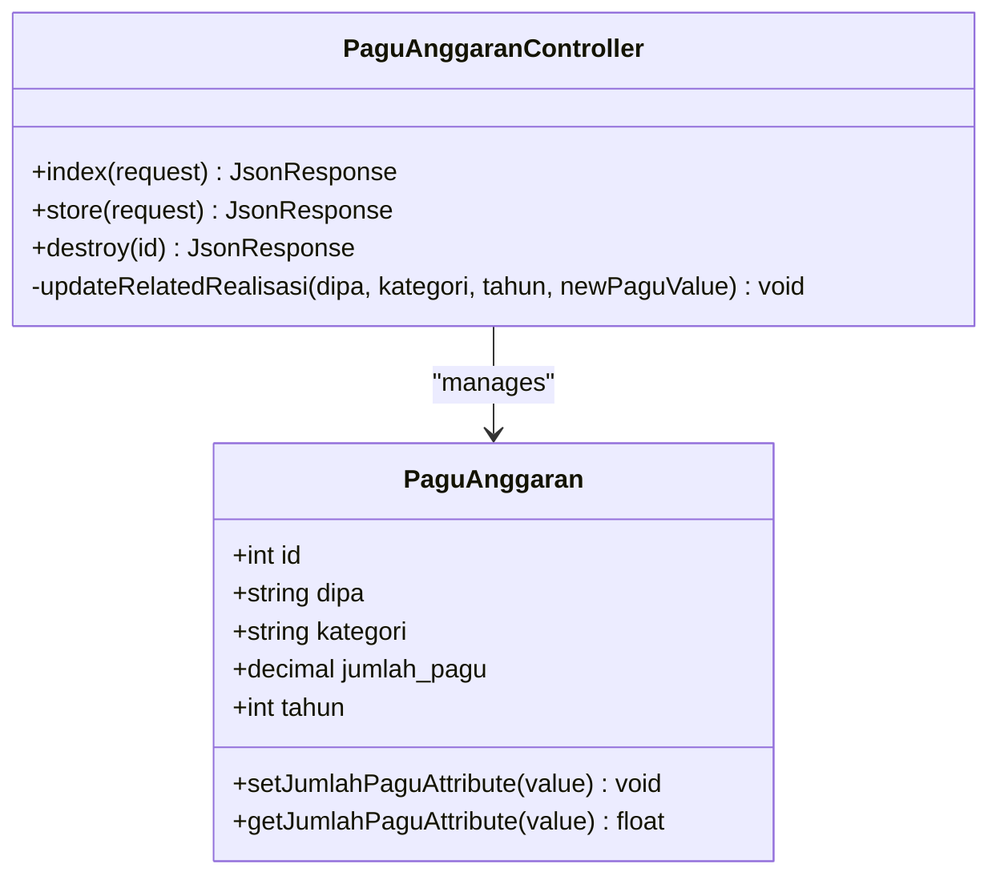

**Diagram sources**
- [PaguAnggaran.php:7-29](file://app/Models/PaguAnggaran.php#L7-L29)
- [PaguAnggaranController.php:9-65](file://app/Http/Controllers/PaguAnggaranController.php#L9-L65)
- [create_pagu_anggaran_table.php:14-22](file://database/migrations/2026_02_10_000002_create_pagu_anggaran_table.php#L14-L22)

**Section sources**
- [PaguAnggaran.php:10-28](file://app/Models/PaguAnggaran.php#L10-L28)
- [PaguAnggaranController.php:20-57](file://app/Http/Controllers/PaguAnggaranController.php#L20-L57)
- [create_pagu_anggaran_table.php:14-22](file://database/migrations/2026_02_10_000002_create_pagu_anggaran_table.php#L14-L22)

### Monthly Realization Model and Controller
The monthly realization component tracks expenditures and maintains derived metrics:
- Pagu, realization, remaining balance, and percentage computed dynamically
- Join with master pagu to reflect the latest allocation
- File upload support for supporting documentation

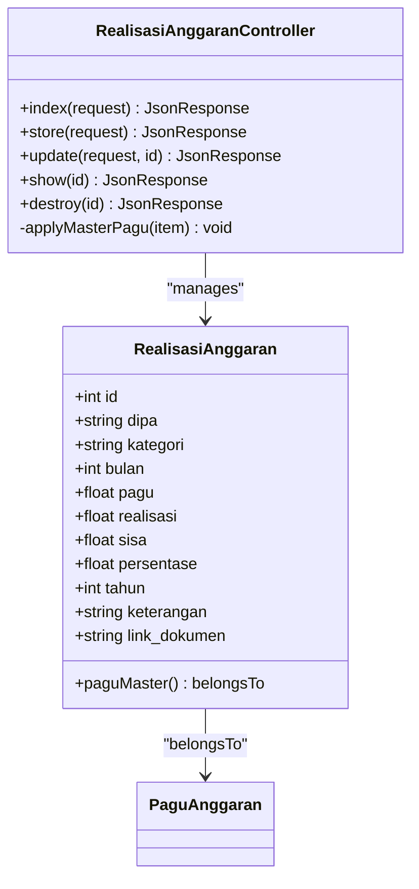

**Diagram sources**
- [RealisasiAnggaran.php:9-45](file://app/Models/RealisasiAnggaran.php#L9-L45)
- [RealisasiAnggaranController.php:9-154](file://app/Http/Controllers/RealisasiAnggaranController.php#L9-L154)
- [create_realisasi_anggaran_table.php:14-25](file://database/migrations/2026_02_10_000000_create_realisasi_anggaran_table.php#L14-L25)

**Section sources**
- [RealisasiAnggaran.php:17-22](file://app/Models/RealisasiAnggaran.php#L17-L22)
- [RealisasiAnggaranController.php:11-53](file://app/Http/Controllers/RealisasiAnggaranController.php#L11-L53)
- [create_realisasi_anggaran_table.php:14-25](file://database/migrations/2026_02_10_000000_create_realisasi_anggaran_table.php#L14-L25)

### Data Flow and Business Logic
The following flowcharts illustrate key business processes:

#### DIPA/POK Creation Workflow
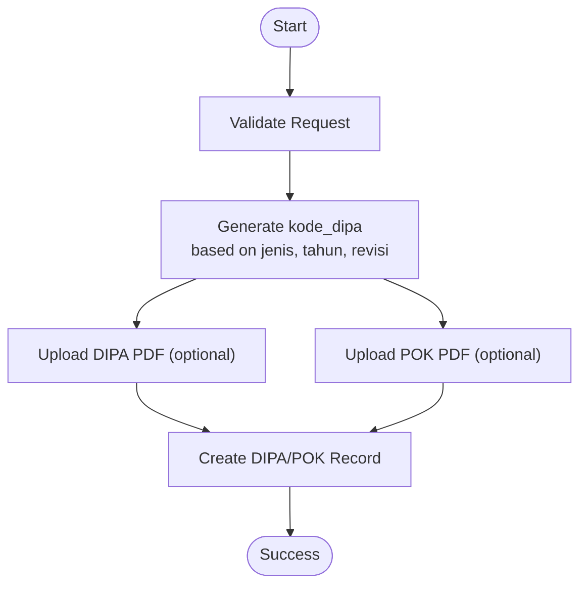

**Diagram sources**
- [DipaPokController.php:43-96](file://app/Http/Controllers/DipaPokController.php#L43-L96)

#### Pagu Update Impact on Realizations
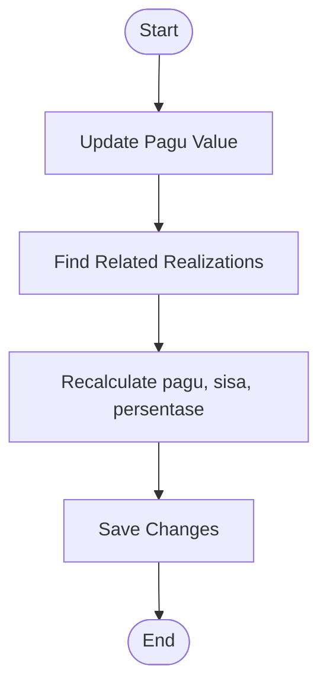

**Diagram sources**
- [PaguAnggaranController.php:29-57](file://app/Http/Controllers/PaguAnggaranController.php#L29-L57)

#### Realization Creation with Master Pagu
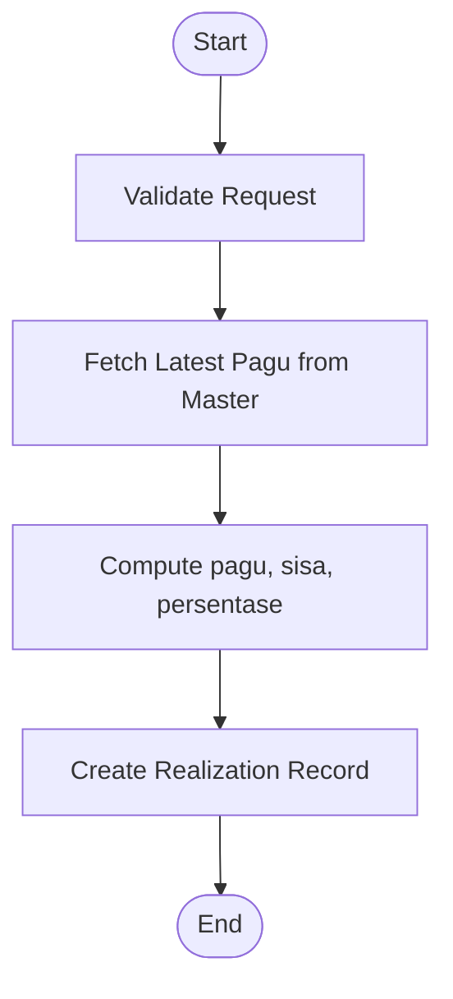

**Diagram sources**
- [RealisasiAnggaranController.php:73-84](file://app/Http/Controllers/RealisasiAnggaranController.php#L73-L84)

## Dependency Analysis
The system exhibits clear separation of concerns with explicit dependencies:
- Controllers depend on models for persistence and business logic
- Models define relationships and data casting
- Migrations establish schema and constraints
- Seeders populate historical data for testing and demonstration
- Routes expose endpoints grouped by security middleware

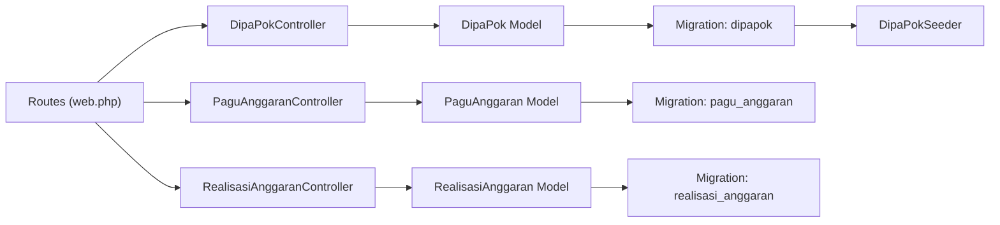

**Diagram sources**
- [web.php:42-123](file://routes/web.php#L42-L123)
- [DipaPokController.php:5](file://app/Http/Controllers/DipaPokController.php#L5)
- [PaguAnggaranController.php:5](file://app/Http/Controllers/PaguAnggaranController.php#L5)
- [RealisasiAnggaranController.php:5](file://app/Http/Controllers/RealisasiAnggaranController.php#L5)
- [DipaPok.php:7](file://app/Models/DipaPok.php#L7)
- [PaguAnggaran.php:7](file://app/Models/PaguAnggaran.php#L7)
- [RealisasiAnggaran.php:9](file://app/Models/RealisasiAnggaran.php#L9)
- [create_dipapok_table.php:11-24](file://database/migrations/2026_02_19_000000_create_dipapok_table.php#L11-L24)
- [create_pagu_anggaran_table.php:14-22](file://database/migrations/2026_02_10_000002_create_pagu_anggaran_table.php#L14-L22)
- [create_realisasi_anggaran_table.php:14-25](file://database/migrations/2026_02_10_000000_create_realisasi_anggaran_table.php#L14-L25)
- [DipaPokSeeder.php:12-14](file://database/seeders/DipaPokSeeder.php#L12-L14)

**Section sources**
- [web.php:14-164](file://routes/web.php#L14-L164)
- [composer.json:22-27](file://composer.json#L22-L27)

## Performance Considerations
- Indexing: The dipapok table includes an index on tahun_dipa to accelerate filtering by year.
- Pagination: Controllers implement pagination to limit response sizes for large datasets.
- Decimal Precision: Monetary fields use decimal types with appropriate precision to prevent overflow and rounding errors.
- Master-Priority Calculations: Realization calculations are performed server-side to ensure consistency and avoid client-side drift.

[No sources needed since this section provides general guidance]

## Troubleshooting Guide
Common issues and resolutions:
- File Upload Failures
  - Verify MIME types and size limits for PDF and image files.
  - Confirm upload folder permissions and Google Drive service availability.

- Validation Errors
  - Ensure required fields (tahun, revisi, jenis, tanggal, alokasi) are present and correctly typed.
  - Pagu values must be numeric and within acceptable ranges.

- Missing Master Pagu Values
  - When pagu is not found for a realization, the system falls back to stored values; ensure master data exists for accurate calculations.

**Section sources**
- [DipaPokController.php:43-51](file://app/Http/Controllers/DipaPokController.php#L43-L51)
- [PaguAnggaranController.php:22-27](file://app/Http/Controllers/PaguAnggaranController.php#L22-L27)
- [RealisasiAnggaranController.php:57-64](file://app/Http/Controllers/RealisasiAnggaranController.php#L57-L64)

## Conclusion
The DIPA/POK budget planning model provides a robust foundation for multi-year budget planning, expenditure projections, and fiscal monitoring. By integrating document management, pagu allocation, and monthly realizations, the system enables transparent approval workflows, accurate forecasting, and continuous monitoring. The modular design and explicit data relationships facilitate scalability and maintenance.

[No sources needed since this section summarizes without analyzing specific files]

## Appendices

### API Endpoints Summary
- DIPA/POK
  - GET /api/dipapok
  - GET /api/dipapok/{id}
  - POST /api/dipapok
  - PUT /api/dipapok/{id}
  - DELETE /api/dipapok/{id}

- Pagu
  - GET /api/pagu
  - POST /api/pagu
  - DELETE /api/pagu/{id}

- Realisasi
  - GET /api/anggaran
  - GET /api/anggaran/{id}
  - POST /api/anggaran
  - PUT /api/anggaran/{id}
  - DELETE /api/anggaran/{id}

**Section sources**
- [web.php:42-123](file://routes/web.php#L42-L123)

### Data Model Relationships
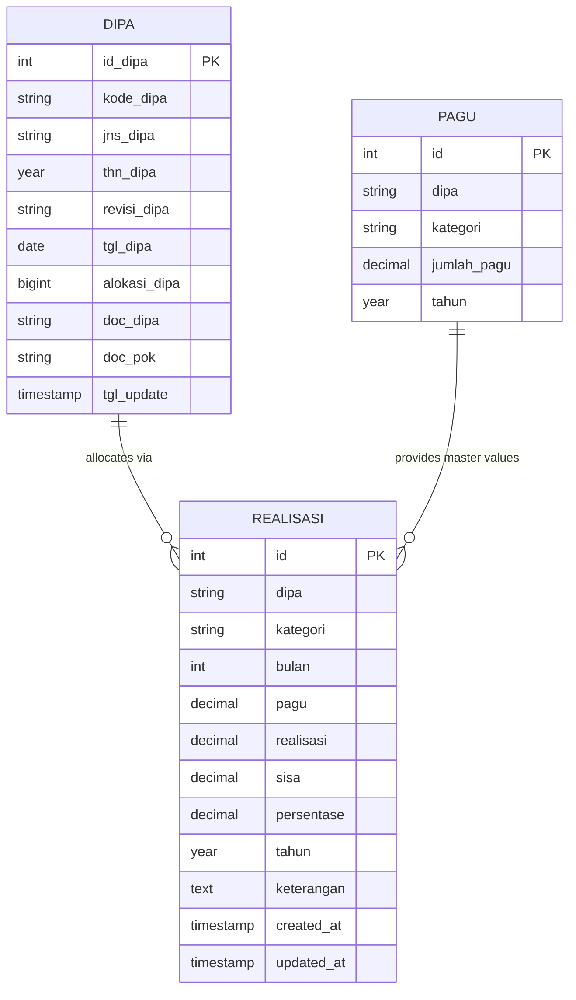

**Diagram sources**
- [create_dipapok_table.php:11-24](file://database/migrations/2026_02_19_000000_create_dipapok_table.php#L11-L24)
- [create_pagu_anggaran_table.php:14-22](file://database/migrations/2026_02_10_000002_create_pagu_anggaran_table.php#L14-L22)
- [create_realisasi_anggaran_table.php:14-25](file://database/migrations/2026_02_10_000000_create_realisasi_anggaran_table.php#L14-L25)

### Integration Example: DIPA/POK Display
The frontend integration demonstrates filtering by year and rendering currency and document links.

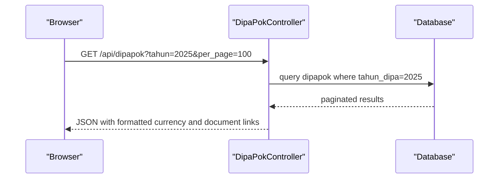

**Diagram sources**
- [joomla-integration-dipapok.html:186-320](file://docs/joomla-integration-dipapok.html#L186-L320)
- [DipaPokController.php:10-39](file://app/Http/Controllers/DipaPokController.php#L10-L39)