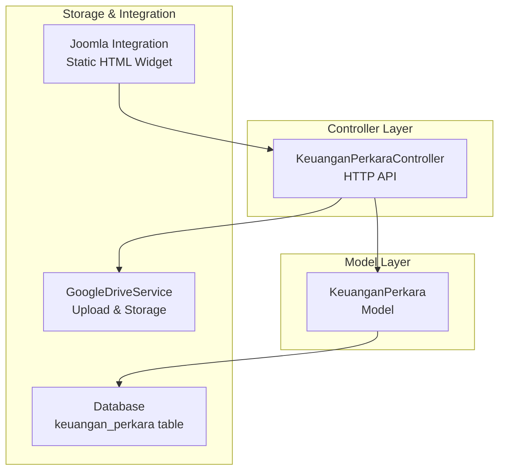
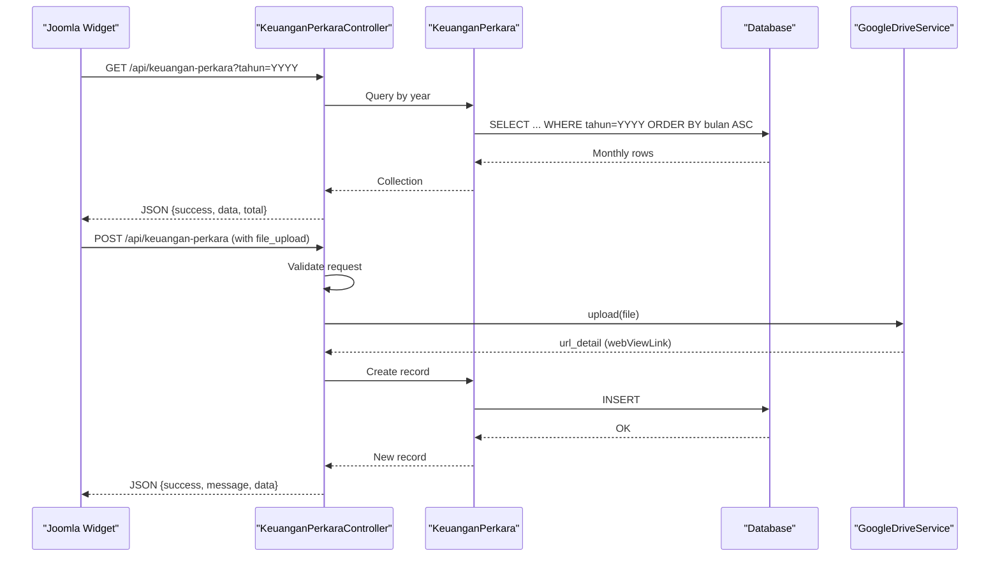
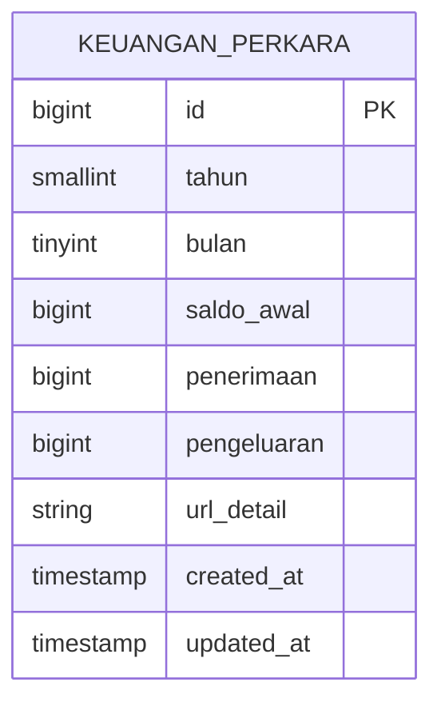
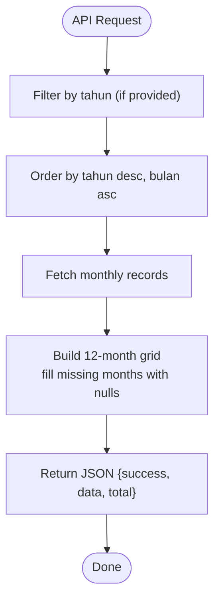
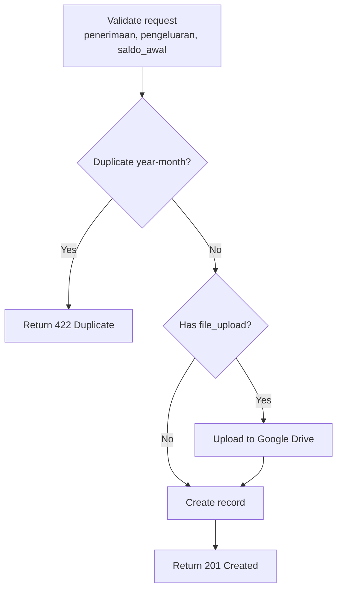
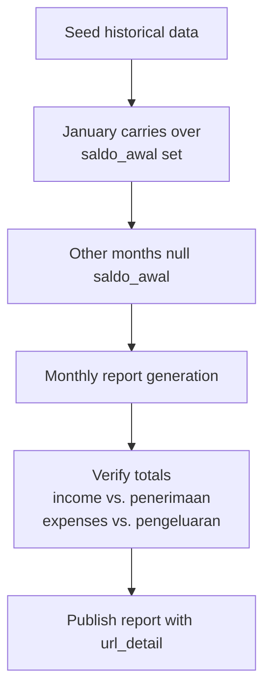
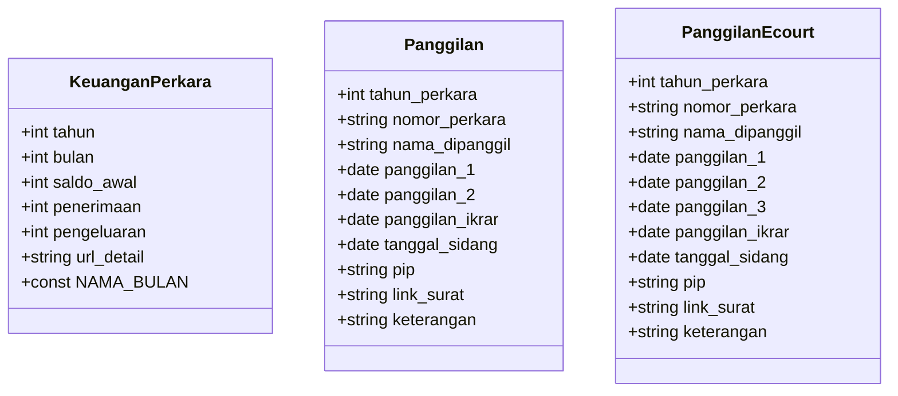
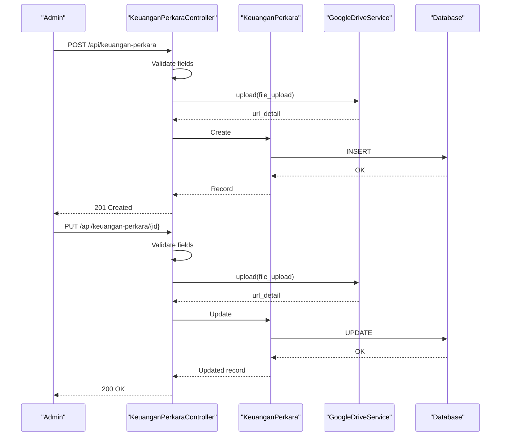
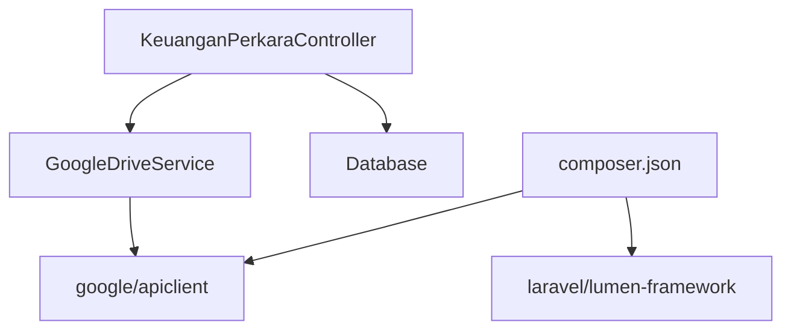

# Case Financials Model (KeuanganPerkara)

<cite>
**Referenced Files in This Document**
- [KeuanganPerkara.php](file://app/Models/KeuanganPerkara.php)
- [KeuanganPerkaraController.php](file://app/Http/Controllers/KeuanganPerkaraController.php)
- [2026_04_01_000000_create_keuangan_perkara_table.php](file://database/migrations/2026_04_01_000000_create_keuangan_perkara_table.php)
- [KeuanganPerkaraSeeder.php](file://database/seeders/KeuanganPerkaraSeeder.php)
- [GoogleDriveService.php](file://app/Services/GoogleDriveService.php)
- [joomla-integration-keuangan-perkara.html](file://docs/joomla-integration-keuangan-perkara.html)
- [Panggilan.php](file://app/Models/Panggilan.php)
- [PanggilanEcourt.php](file://app/Models/PanggilanEcourt.php)
- [2026_01_21_000001_create_panggilan_ghaib_table.php](file://database/migrations/2026_01_21_000001_create_panggilan_ghaib_table.php)
- [2026_01_25_162515_create_panggilan_ecourts_table.php](file://database/migrations/2026_01_25_162515_create_panggilan_ecourts_table.php)
- [composer.json](file://composer.json)
</cite>

## Table of Contents
1. [Introduction](#introduction)
2. [Project Structure](#project-structure)
3. [Core Components](#core-components)
4. [Architecture Overview](#architecture-overview)
5. [Detailed Component Analysis](#detailed-component-analysis)
6. [Dependency Analysis](#dependency-analysis)
7. [Performance Considerations](#performance-considerations)
8. [Troubleshooting Guide](#troubleshooting-guide)
9. [Conclusion](#conclusion)
10. [Appendices](#appendices)

## Introduction
This document describes the KeuanganPerkara model and its ecosystem for managing legal case financial management and cost tracking within the court system. It explains the monthly financial reporting system, case cost categorization, payment tracking mechanisms, and the integration with court case management systems. It also documents the data structure for case financial transactions, monthly reconciliation processes, cost allocation methods, and administrative financial management processes.

The KeuanganPerkara module captures monthly financial snapshots for legal cases, including income, expenses, opening balances, and supporting documentation links. It provides APIs for ingestion, querying, and updates, and integrates with external systems for document storage and presentation.

## Project Structure
The KeuanganPerkara module is implemented as a Laravel Eloquent model with a dedicated controller and migration. Supporting components include a Google Drive integration service for document uploads and a static HTML integration for displaying financial reports within the court's Joomla site.

**Diagram sources**
- [KeuanganPerkara.php:1-43](file://app/Models/KeuanganPerkara.php#L1-L43)
- [KeuanganPerkaraController.php:1-192](file://app/Http/Controllers/KeuanganPerkaraController.php#L1-L192)
- [2026_04_01_000000_create_keuangan_perkara_table.php:1-30](file://database/migrations/2026_04_01_000000_create_keuangan_perkara_table.php#L1-L30)
- [GoogleDriveService.php:1-117](file://app/Services/GoogleDriveService.php#L1-L117)
- [joomla-integration-keuangan-perkara.html:170-337](file://docs/joomla-integration-keuangan-perkara.html#L170-L337)

**Section sources**
- [KeuanganPerkara.php:1-43](file://app/Models/KeuanganPerkara.php#L1-L43)
- [KeuanganPerkaraController.php:1-192](file://app/Http/Controllers/KeuanganPerkaraController.php#L1-L192)
- [2026_04_01_000000_create_keuangan_perkara_table.php:1-30](file://database/migrations/2026_04_01_000000_create_keuangan_perkara_table.php#L1-L30)
- [GoogleDriveService.php:1-117](file://app/Services/GoogleDriveService.php#L1-L117)
- [joomla-integration-keuangan-perkara.html:170-337](file://docs/joomla-integration-keuangan-perkara.html#L170-L337)

## Core Components
- KeuanganPerkara model: Defines the monthly financial snapshot structure, including year, month, opening balance, income, expenses, and document link. It includes a constant mapping of month numbers to Indonesian names.
- KeuanganPerkaraController: Provides REST endpoints for listing, filtering, retrieving, creating, updating, and deleting monthly financial records. It validates inputs, prevents duplicates, and manages document uploads to Google Drive or local storage.
- Database migration: Creates the keuangan_perkara table with unique constraints on year-month combinations and indexes for efficient querying.
- Seeder: Seeds historical monthly financial data with opening balances carried over from previous years and document URLs.
- GoogleDriveService: Handles secure uploads to Google Drive, creates daily subfolders, and returns public view links.
- Joomla integration: Static HTML widget that consumes the API to present monthly financial summaries with filters and resolved document links.

**Section sources**
- [KeuanganPerkara.php:1-43](file://app/Models/KeuanganPerkara.php#L1-L43)
- [KeuanganPerkaraController.php:1-192](file://app/Http/Controllers/KeuanganPerkaraController.php#L1-L192)
- [2026_04_01_000000_create_keuangan_perkara_table.php:1-30](file://database/migrations/2026_04_01_000000_create_keuangan_perkara_table.php#L1-L30)
- [KeuanganPerkaraSeeder.php:1-164](file://database/seeders/KeuanganPerkaraSeeder.php#L1-L164)
- [GoogleDriveService.php:1-117](file://app/Services/GoogleDriveService.php#L1-L117)
- [joomla-integration-keuangan-perkara.html:170-337](file://docs/joomla-integration-keuangan-perkara.html#L170-L337)

## Architecture Overview
The KeuanganPerkara system follows a layered architecture:
- Presentation: Joomla widget consumes the API and renders monthly financial data.
- API: KeuanganPerkaraController exposes endpoints for CRUD operations and filtering.
- Business Logic: Validation, duplicate prevention, and document upload orchestration.
- Persistence: Eloquent model mapped to the keuangan_perkara table.
- External Integration: Google Drive service for document storage and sharing.

**Diagram sources**
- [KeuanganPerkaraController.php:15-46](file://app/Http/Controllers/KeuanganPerkaraController.php#L15-L46)
- [KeuanganPerkaraController.php:57-120](file://app/Http/Controllers/KeuanganPerkaraController.php#L57-L120)
- [GoogleDriveService.php:38-82](file://app/Services/GoogleDriveService.php#L38-L82)
- [KeuanganPerkara.php:11-26](file://app/Models/KeuanganPerkara.php#L11-L26)

## Detailed Component Analysis

### Data Model and Schema
The keuangan_perkara table stores monthly financial snapshots with:
- Year and month as integer fields forming a unique composite key.
- Opening balance (carry-over from prior year) stored only for January.
- Income and expense fields as big integers.
- A URL field for linking to supporting documents hosted locally or externally.

**Diagram sources**
- [2026_04_01_000000_create_keuangan_perkara_table.php:11-23](file://database/migrations/2026_04_01_000000_create_keuangan_perkara_table.php#L11-L23)

**Section sources**
- [2026_04_01_000000_create_keuangan_perkara_table.php:11-23](file://database/migrations/2026_04_01_000000_create_keuangan_perkara_table.php#L11-L23)
- [KeuanganPerkara.php:11-26](file://app/Models/KeuanganPerkara.php#L11-L26)

### Monthly Financial Reporting System
Monthly reporting is achieved through:
- Filtering by year via query parameter.
- Sorting by year descending and month ascending.
- Returning a fixed 12-row layout for each year, with missing months filled as nulls.

**Diagram sources**
- [KeuanganPerkaraController.php:15-33](file://app/Http/Controllers/KeuanganPerkaraController.php#L15-L33)
- [joomla-integration-keuangan-perkara.html:221-260](file://docs/joomla-integration-keuangan-perkara.html#L221-L260)

**Section sources**
- [KeuanganPerkaraController.php:15-33](file://app/Http/Controllers/KeuanganPerkaraController.php#L15-L33)
- [joomla-integration-keuangan-perkara.html:221-260](file://docs/joomla-integration-keuangan-perkara.html#L221-L260)

### Case Cost Categorization and Payment Tracking
Cost categorization is implicit in the monthly structure:
- Income: penerimaan
- Expenses: pengeluaran
- Opening balance: saldo_awal (only populated for January)

Payment tracking is managed via:
- Unique constraint on year-month to prevent duplicate entries.
- Validation rules ensuring numeric and non-negative amounts.
- Optional document linkage via url_detail.

**Diagram sources**
- [KeuanganPerkaraController.php:59-76](file://app/Http/Controllers/KeuanganPerkaraController.php#L59-L76)
- [KeuanganPerkaraController.php:80-108](file://app/Http/Controllers/KeuanganPerkaraController.php#L80-L108)

**Section sources**
- [KeuanganPerkaraController.php:59-76](file://app/Http/Controllers/KeuanganPerkaraController.php#L59-L76)
- [KeuanganPerkaraController.php:80-108](file://app/Http/Controllers/KeuanganPerkaraController.php#L80-L108)

### Monthly Reconciliation Processes
Reconciliation is performed by comparing:
- Reported income vs. recorded penerimaan
- Reported expenses vs. recorded pengeluaran
- Opening balance alignment for January

The system ensures:
- Unique year-month combinations.
- Consistent month numbering and names via model constants.
- Historical data seeding with opening balances and document URLs.

**Diagram sources**
- [KeuanganPerkaraSeeder.php:16-162](file://database/seeders/KeuanganPerkaraSeeder.php#L16-L162)
- [KeuanganPerkara.php:28-41](file://app/Models/KeuanganPerkara.php#L28-L41)

**Section sources**
- [KeuanganPerkaraSeeder.php:16-162](file://database/seeders/KeuanganPerkaraSeeder.php#L16-L162)
- [KeuanganPerkara.php:28-41](file://app/Models/KeuanganPerkara.php#L28-L41)

### Cost Allocation Methods
Cost allocation is straightforward:
- Each month’s pengeluaran is associated with that month’s penerimaan.
- Opening balance is allocated to the first month of the year.
- No cross-period allocation is enforced by the model; allocation decisions are external to this module.

**Section sources**
- [KeuanganPerkara.php:11-26](file://app/Models/KeuanganPerkara.php#L11-L26)

### Integration with Court Case Management Systems
While KeuanganPerkara focuses on financials, it complements case management through:
- Shared identifiers: Both KeuanganPerkara and case management systems use year and month for temporal alignment.
- Document linkage: url_detail can reference case-related documents hosted on external systems.
- Complementary APIs: Case scheduling and summoning data are available via separate models/controllers, enabling cross-system correlation.

**Diagram sources**
- [KeuanganPerkara.php:7-42](file://app/Models/KeuanganPerkara.php#L7-L42)
- [Panggilan.php:7-55](file://app/Models/Panggilan.php#L7-L55)
- [PanggilanEcourt.php:7-32](file://app/Models/PanggilanEcourt.php#L7-L32)

**Section sources**
- [Panggilan.php:7-55](file://app/Models/Panggilan.php#L7-L55)
- [PanggilanEcourt.php:7-32](file://app/Models/PanggilanEcourt.php#L7-L32)
- [2026_01_21_000001_create_panggilan_ghaib_table.php:13-31](file://database/migrations/2026_01_21_000001_create_panggilan_ghaib_table.php#L13-L31)
- [2026_01_25_162515_create_panggilan_ecourts_table.php:13-28](file://database/migrations/2026_01_25_162515_create_panggilan_ecourts_table.php#L13-L28)

### Administrative Financial Management Processes
Administrative processes include:
- Data ingestion: POST endpoint with validation and duplicate prevention.
- Document management: Priority to Google Drive upload; fallback to local storage with sanitized filenames.
- Retrieval: GET endpoints for listing, filtering by year, and fetching individual records.
- Updates: PUT endpoint with selective validation and optional document replacement.
- Deletion: DELETE endpoint for removing records.

**Diagram sources**
- [KeuanganPerkaraController.php:57-120](file://app/Http/Controllers/KeuanganPerkaraController.php#L57-L120)
- [KeuanganPerkaraController.php:122-180](file://app/Http/Controllers/KeuanganPerkaraController.php#L122-L180)
- [GoogleDriveService.php:38-82](file://app/Services/GoogleDriveService.php#L38-L82)

**Section sources**
- [KeuanganPerkaraController.php:57-120](file://app/Http/Controllers/KeuanganPerkaraController.php#L57-L120)
- [KeuanganPerkaraController.php:122-180](file://app/Http/Controllers/KeuanganPerkaraController.php#L122-L180)
- [GoogleDriveService.php:38-82](file://app/Services/GoogleDriveService.php#L38-L82)

## Dependency Analysis
External dependencies and integrations:
- Google API client library for Google Drive integration.
- Laravel Lumen framework for routing and HTTP handling.
- Database schema with unique constraints and indexes for performance.

**Diagram sources**
- [composer.json:11-15](file://composer.json#L11-L15)
- [GoogleDriveService.php:5-22](file://app/Services/GoogleDriveService.php#L5-L22)
- [KeuanganPerkaraController.php:82-86](file://app/Http/Controllers/KeuanganPerkaraController.php#L82-L86)

**Section sources**
- [composer.json:11-15](file://composer.json#L11-L15)
- [GoogleDriveService.php:5-22](file://app/Services/GoogleDriveService.php#L5-L22)
- [KeuanganPerkaraController.php:82-86](file://app/Http/Controllers/KeuanganPerkaraController.php#L82-L86)

## Performance Considerations
- Indexing: The table includes an index on tahun and a unique constraint on tahun-bulan, optimizing queries by year and preventing duplicates.
- Pagination: While the current API returns all records for a given year, consider adding pagination for large datasets.
- File uploads: Prefer Google Drive for scalability; local fallback is available but increases server storage overhead.
- Data types: Using bigInteger for monetary fields avoids overflow risks for large sums.

[No sources needed since this section provides general guidance]

## Troubleshooting Guide
Common issues and resolutions:
- Duplicate year-month entries: The controller checks for existing records and returns a conflict response. Ensure unique year-month combinations.
- Google Drive upload failures: The controller attempts Google Drive upload first; if it fails, it falls back to local storage. Check environment variables and network connectivity.
- Validation errors: Ensure numeric inputs for amounts and valid year ranges. The controller enforces strict validation rules.
- Document URL resolution: The Joomla integration resolves relative URLs to absolute paths. Verify url_detail values and base URLs.

**Section sources**
- [KeuanganPerkaraController.php:69-76](file://app/Http/Controllers/KeuanganPerkaraController.php#L69-L76)
- [KeuanganPerkaraController.php:91-107](file://app/Http/Controllers/KeuanganPerkaraController.php#L91-L107)
- [joomla-integration-keuangan-perkara.html:186-191](file://docs/joomla-integration-keuangan-perkara.html#L186-L191)

## Conclusion
The KeuanganPerkara module provides a robust foundation for monthly legal case financial reporting, integrating seamlessly with document storage and presentation systems. Its design emphasizes data integrity, scalability, and ease of administration, while complementing broader case management workflows through shared temporal and document-linkage mechanisms.

[No sources needed since this section summarizes without analyzing specific files]

## Appendices

### API Endpoints Summary
- GET /api/keuangan-perkara?tahun={year}: List all months for a given year.
- GET /api/keuangan-perkara/{id}: Retrieve a specific record.
- POST /api/keuangan-perkara: Create a new monthly financial record with optional file upload.
- PUT /api/keuangan-perkara/{id}: Update an existing record with optional file upload.
- DELETE /api/keuangan-perkara/{id}: Remove a record.

**Section sources**
- [KeuanganPerkaraController.php:15-46](file://app/Http/Controllers/KeuanganPerkaraController.php#L15-L46)
- [KeuanganPerkaraController.php:48-56](file://app/Http/Controllers/KeuanganPerkaraController.php#L48-L56)
- [KeuanganPerkaraController.php:57-120](file://app/Http/Controllers/KeuanganPerkaraController.php#L57-L120)
- [KeuanganPerkaraController.php:122-180](file://app/Http/Controllers/KeuanganPerkaraController.php#L122-L180)
- [KeuanganPerkaraController.php:182-190](file://app/Http/Controllers/KeuanganPerkaraController.php#L182-L190)

### Data Model Attributes
- tahun: Integer year.
- bulan: Integer month (1–12).
- saldo_awal: Opening balance for the year (only for January).
- penerimaan: Income for the month.
- pengeluaran: Expenses for the month.
- url_detail: Link to supporting document.

**Section sources**
- [KeuanganPerkara.php:11-26](file://app/Models/KeuanganPerkara.php#L11-L26)

### Document Upload Behavior
- Priority: Google Drive upload using configured credentials and folder ID.
- Fallback: Local storage under public/uploads/keuangan-perkara with sanitized filenames.
- Output: url_detail contains either Google Drive or local URL.

**Section sources**
- [KeuanganPerkaraController.php:80-108](file://app/Http/Controllers/KeuanganPerkaraController.php#L80-L108)
- [KeuanganPerkaraController.php:139-167](file://app/Http/Controllers/KeuanganPerkaraController.php#L139-L167)
- [GoogleDriveService.php:38-82](file://app/Services/GoogleDriveService.php#L38-L82)