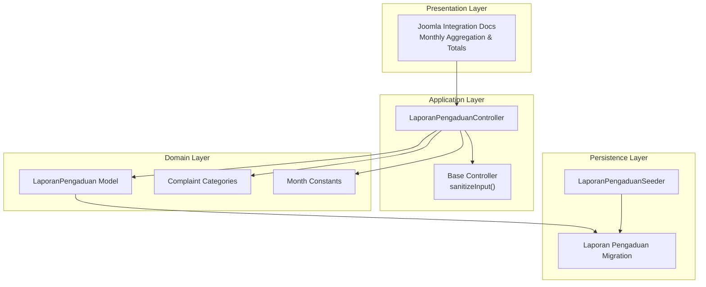
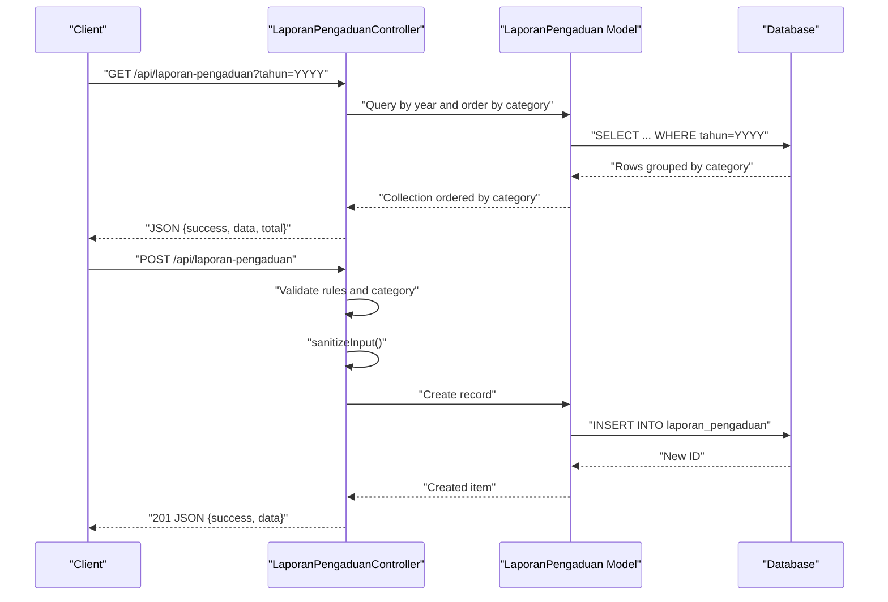
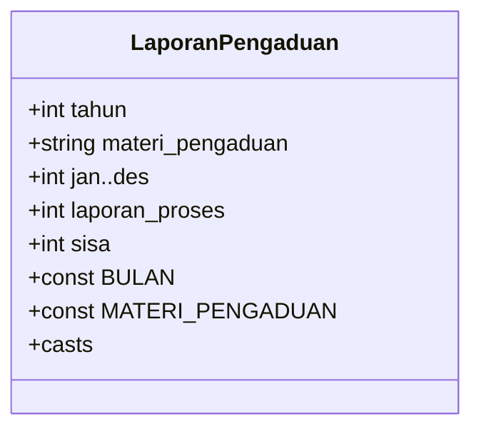
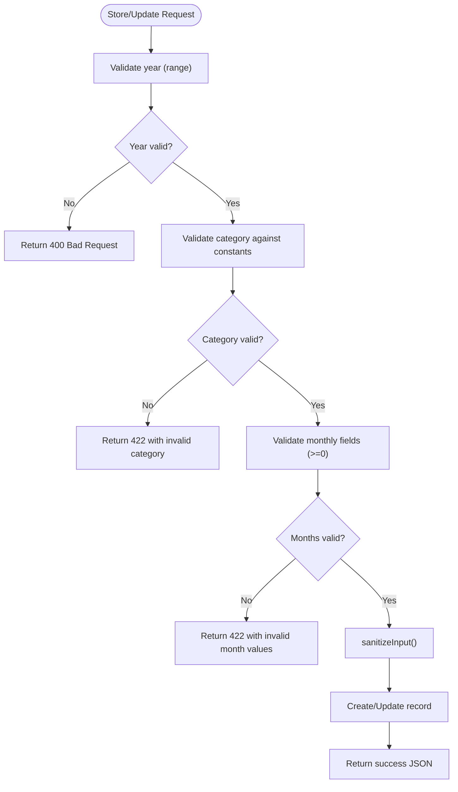
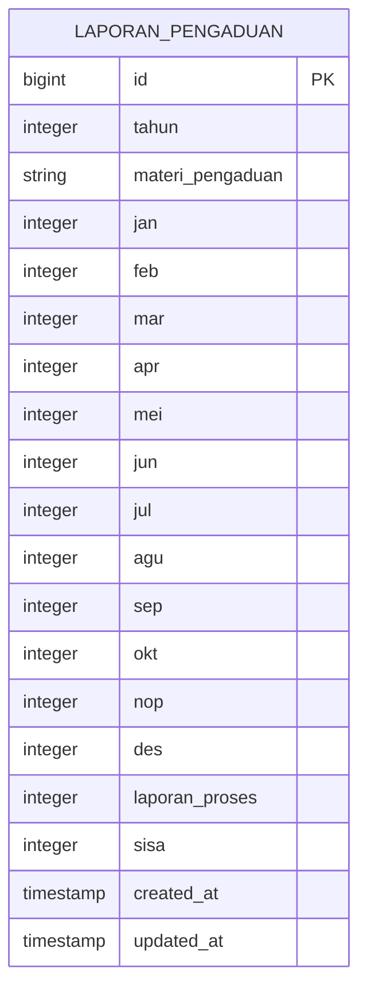
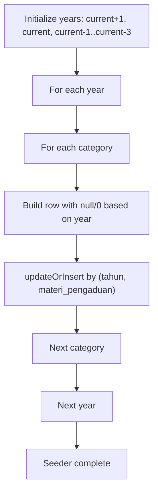
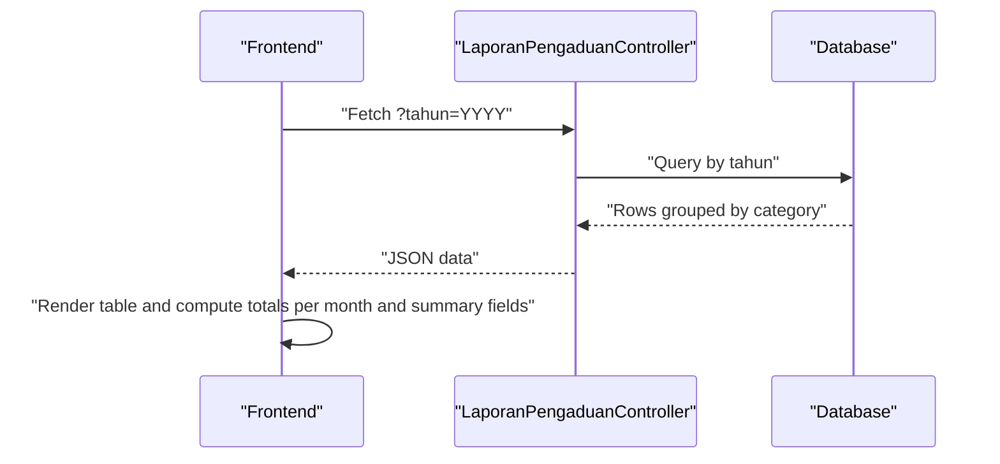
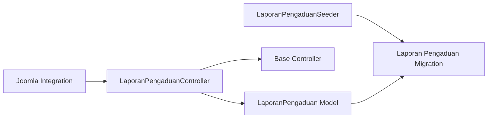

# Complaint Processing Model (LaporanPengaduan)

<cite>
**Referenced Files in This Document**
- [LaporanPengaduan.php](file://app/Models/LaporanPengaduan.php)
- [LaporanPengaduanController.php](file://app/Http/Controllers/LaporanPengaduanController.php)
- [2026_03_31_000002_create_laporan_pengaduan_table.php](file://database/migrations/2026_03_31_000002_create_laporan_pengaduan_table.php)
- [LaporanPengaduanSeeder.php](file://database/seeders/LaporanPengaduanSeeder.php)
- [Controller.php](file://app/Http/Controllers/Controller.php)
- [joomla-integration-laporan-pengaduan.html](file://docs/joomla-integration-laporan-pengaduan.html)
</cite>

## Table of Contents
1. [Introduction](#introduction)
2. [Project Structure](#project-structure)
3. [Core Components](#core-components)
4. [Architecture Overview](#architecture-overview)
5. [Detailed Component Analysis](#detailed-component-analysis)
6. [Dependency Analysis](#dependency-analysis)
7. [Performance Considerations](#performance-considerations)
8. [Troubleshooting Guide](#troubleshooting-guide)
9. [Conclusion](#conclusion)

## Introduction
This document describes the LaporanPengaduan model and its associated controller, focusing on the monthly complaint tracking system across a 12-month period (January–December), annual reporting capabilities, and the complaint categorization framework. It also documents data validation rules, integer casting for numerical months, and the relationship between processed complaints and remaining complaints. Practical examples illustrate complaint reporting workflows, monthly aggregation patterns, and administrative tracking scenarios.

## Project Structure
The LaporanPengaduan module comprises:
- Model definition with fillable attributes, casts, constants for month keys and categories
- Controller with CRUD operations, input sanitization, and validation rules
- Database migration defining the table schema and indexes
- Seeder generating yearly rows for multiple years and categories
- Frontend integration documentation showing how monthly totals and totals for processed/remaining complaints are computed

**Diagram sources**
- [LaporanPengaduanController.php:1-137](file://app/Http/Controllers/LaporanPengaduanController.php#L1-L137)
- [LaporanPengaduan.php:1-44](file://app/Models/LaporanPengaduan.php#L1-L44)
- [2026_03_31_000002_create_laporan_pengaduan_table.php:1-41](file://database/migrations/2026_03_31_000002_create_laporan_pengaduan_table.php#L1-L41)
- [LaporanPengaduanSeeder.php:1-61](file://database/seeders/LaporanPengaduanSeeder.php#L1-L61)
- [Controller.php:1-97](file://app/Http/Controllers/Controller.php#L1-L97)
- [joomla-integration-laporan-pengaduan.html:1-265](file://docs/joomla-integration-laporan-pengaduan.html#L1-L265)

**Section sources**
- [LaporanPengaduan.php:1-44](file://app/Models/LaporanPengaduan.php#L1-L44)
- [LaporanPengaduanController.php:1-137](file://app/Http/Controllers/LaporanPengaduanController.php#L1-L137)
- [2026_03_31_000002_create_laporan_pengaduan_table.php:1-41](file://database/migrations/2026_03_31_000002_create_laporan_pengaduan_table.php#L1-L41)
- [LaporanPengaduanSeeder.php:1-61](file://database/seeders/LaporanPengaduanSeeder.php#L1-L61)
- [Controller.php:1-97](file://app/Http/Controllers/Controller.php#L1-L97)
- [joomla-integration-laporan-pengaduan.html:1-265](file://docs/joomla-integration-laporan-pengaduan.html#L1-L265)

## Core Components
- LaporanPengaduan Model
  - Table: laporan_pengaduan
  - Fillable fields include year, complaint subject, monthly counts (jan–des), and two summary fields: laporan_proses and sisa
  - Casts ensure numerical fields are integers and timestamps are datetime
  - Constants define the 12-month keys and the list of complaint categories

- LaporanPengaduanController
  - Defines allowed fields and month-related fields
  - Provides index, byYear, show, store, update, and destroy actions
  - Implements validation rules for numeric, non-negative values for monthly and summary fields
  - Enforces category validation against model constants
  - Prevents duplicate entries per year and category via unique constraint
  - Uses sanitizeInput to strip tags and trim strings, converting empty strings to null

- Database Migration
  - Creates the laporan_pengaduan table with integer columns for each month and summary fields
  - Adds a unique composite index on (tahun, materi_pengaduan) and an index on tahun

- Seeder
  - Generates rows for multiple years and categories
  - Initializes monthly fields and summary fields as null for future/current years, zero for past years
  - Uses updateOrInsert to maintain uniqueness

- Frontend Integration (Joomla)
  - Renders complaint categories and monthly values
  - Computes totals across months and for laporan_proses and sisa
  - Demonstrates client-side aggregation patterns

**Section sources**
- [LaporanPengaduan.php:1-44](file://app/Models/LaporanPengaduan.php#L1-L44)
- [LaporanPengaduanController.php:1-137](file://app/Http/Controllers/LaporanPengaduanController.php#L1-L137)
- [2026_03_31_000002_create_laporan_pengaduan_table.php:1-41](file://database/migrations/2026_03_31_000002_create_laporan_pengaduan_table.php#L1-L41)
- [LaporanPengaduanSeeder.php:1-61](file://database/seeders/LaporanPengaduanSeeder.php#L1-L61)
- [joomla-integration-laporan-pengaduan.html:140-265](file://docs/joomla-integration-laporan-pengaduan.html#L140-L265)

## Architecture Overview
The system follows a layered architecture:
- Presentation: Frontend integration renders aggregated data and year tabs
- Application: Controller validates and sanitizes input, enforces business rules, and orchestrates persistence
- Domain: Model encapsulates attributes, casts, and constants
- Persistence: Migration defines schema; Seeder seeds initial data

**Diagram sources**
- [LaporanPengaduanController.php:30-106](file://app/Http/Controllers/LaporanPengaduanController.php#L30-L106)
- [LaporanPengaduan.php:1-44](file://app/Models/LaporanPengaduan.php#L1-L44)
- [2026_03_31_000002_create_laporan_pengaduan_table.php:11-33](file://database/migrations/2026_03_31_000002_create_laporan_pengaduan_table.php#L11-L33)

## Detailed Component Analysis

### Model: LaporanPengaduan
- Purpose: Encapsulate complaint tracking data for a single year and category
- Attributes:
  - Year: integer
  - Materi pengaduan: string (category)
  - Monthly counters: jan–des (integers)
  - Summary fields: laporan_proses and sisa (integers)
- Casting ensures consistent numeric handling for analytics and aggregations
- Constants:
  - Month keys: jan–des
  - Categories: ethical violations, abuse of power, misconduct, criminal procedure violations, administrative errors, public service dissatisfaction

**Diagram sources**
- [LaporanPengaduan.php:7-42](file://app/Models/LaporanPengaduan.php#L7-L42)

**Section sources**
- [LaporanPengaduan.php:1-44](file://app/Models/LaporanPengaduan.php#L1-L44)

### Controller: LaporanPengaduanController
- Responsibilities:
  - Retrieve and filter records by year
  - Validate and sanitize input
  - Enforce category validity and uniqueness
  - Provide CRUD endpoints with appropriate HTTP responses
- Validation rules:
  - Year: required integer within a reasonable range
  - Materi pengaduan: required string matching predefined categories
  - Monthly fields: nullable integers greater than or equal to zero
- Sanitization:
  - Removes HTML tags and trims strings; empty strings become null
- Business rules:
  - Unique constraint prevents duplicate year+category combinations
  - Category must be one of the predefined values

**Diagram sources**
- [LaporanPengaduanController.php:74-125](file://app/Http/Controllers/LaporanPengaduanController.php#L74-L125)
- [Controller.php:18-29](file://app/Http/Controllers/Controller.php#L18-L29)

**Section sources**
- [LaporanPengaduanController.php:1-137](file://app/Http/Controllers/LaporanPengaduanController.php#L1-L137)
- [Controller.php:1-97](file://app/Http/Controllers/Controller.php#L1-L97)

### Database Migration: Laporan Pengaduan Table
- Schema:
  - Integer year and category string
  - Twelve integer month columns (nullable)
  - Two integer summary columns (nullable)
  - Timestamps
  - Unique index on (tahun, materi_pengaduan)
  - Index on tahun for efficient filtering
- Implications:
  - Supports fast year-based queries
  - Ensures one row per year per category

**Diagram sources**
- [2026_03_31_000002_create_laporan_pengaduan_table.php:11-33](file://database/migrations/2026_03_31_000002_create_laporan_pengaduan_table.php#L11-L33)

**Section sources**
- [2026_03_31_000002_create_laporan_pengaduan_table.php:1-41](file://database/migrations/2026_03_31_000002_create_laporan_pengaduan_table.php#L1-L41)

### Seeder: Initial Data Generation
- Strategy:
  - Generates data for current year, next year, and three previous years
  - Iterates over all categories
  - For future/present years: initializes monthly and summary fields as null
  - For past years: initializes as zero
  - Uses updateOrInsert to maintain uniqueness and avoid duplicates

**Diagram sources**
- [LaporanPengaduanSeeder.php:20-44](file://database/seeders/LaporanPengaduanSeeder.php#L20-L44)

**Section sources**
- [LaporanPengaduanSeeder.php:1-61](file://database/seeders/LaporanPengaduanSeeder.php#L1-L61)

### Frontend Integration: Monthly Aggregation and Totals
- Rendering:
  - Displays categories and monthly values
  - Shows laporan_proses and sisa columns
- Aggregation:
  - Computes totals per month and for laporan_proses and sisa
  - Uses integer casting for aggregation
- Example behavior:
  - Null values are rendered as a placeholder
  - Totals are computed client-side across visible rows

**Diagram sources**
- [joomla-integration-laporan-pengaduan.html:236-251](file://docs/joomla-integration-laporan-pengaduan.html#L236-L251)

**Section sources**
- [joomla-integration-laporan-pengaduan.html:140-265](file://docs/joomla-integration-laporan-pengaduan.html#L140-L265)

## Dependency Analysis
- Model depends on Eloquent ORM and database schema defined by migration
- Controller depends on Model and Base Controller for sanitization
- Seeder depends on Model and database schema
- Frontend depends on API responses and expects specific field names

**Diagram sources**
- [LaporanPengaduanController.php:1-137](file://app/Http/Controllers/LaporanPengaduanController.php#L1-L137)
- [LaporanPengaduan.php:1-44](file://app/Models/LaporanPengaduan.php#L1-L44)
- [2026_03_31_000002_create_laporan_pengaduan_table.php:1-41](file://database/migrations/2026_03_31_000002_create_laporan_pengaduan_table.php#L1-L41)
- [LaporanPengaduanSeeder.php:1-61](file://database/seeders/LaporanPengaduanSeeder.php#L1-L61)
- [Controller.php:1-97](file://app/Http/Controllers/Controller.php#L1-L97)
- [joomla-integration-laporan-pengaduan.html:1-265](file://docs/joomla-integration-laporan-pengaduan.html#L1-L265)

**Section sources**
- [LaporanPengaduanController.php:1-137](file://app/Http/Controllers/LaporanPengaduanController.php#L1-L137)
- [LaporanPengaduan.php:1-44](file://app/Models/LaporanPengaduan.php#L1-L44)
- [2026_03_31_000002_create_laporan_pengaduan_table.php:1-41](file://database/migrations/2026_03_31_000002_create_laporan_pengaduan_table.php#L1-L41)
- [LaporanPengaduanSeeder.php:1-61](file://database/seeders/LaporanPengaduanSeeder.php#L1-L61)
- [Controller.php:1-97](file://app/Http/Controllers/Controller.php#L1-L97)
- [joomla-integration-laporan-pengaduan.html:1-265](file://docs/joomla-integration-laporan-pengaduan.html#L1-L265)

## Performance Considerations
- Index on tahun enables fast filtering by year
- Unique index on (tahun, materi_pengaduan) prevents duplicates and supports efficient upserts
- Integer casting ensures predictable numeric operations for aggregations
- Client-side aggregation in frontend is straightforward due to integer fields and consistent null handling

[No sources needed since this section provides general guidance]

## Troubleshooting Guide
- Duplicate entry error when creating:
  - Cause: Attempting to insert another row for the same year and category
  - Resolution: Update existing row or change category/year combination
  - Reference: [LaporanPengaduanController.php:93-100](file://app/Http/Controllers/LaporanPengaduanController.php#L93-L100)

- Invalid category error:
  - Cause: materi_pengaduan not included in predefined categories
  - Resolution: Use one of the accepted categories
  - Reference: [LaporanPengaduanController.php:86-91](file://app/Http/Controllers/LaporanPengaduanController.php#L86-L91), [LaporanPengaduan.php:34-42](file://app/Models/LaporanPengaduan.php#L34-L42)

- Invalid month value error:
  - Cause: Non-integer or negative values in monthly fields
  - Resolution: Ensure numeric values >= 0
  - Reference: [LaporanPengaduanController.php:80-82](file://app/Http/Controllers/LaporanPengaduanController.php#L80-L82), [LaporanPengaduanController.php:115-118](file://app/Http/Controllers/LaporanPengaduanController.php#L115-L118)

- Data not found when updating/deleting:
  - Cause: Record with given ID does not exist
  - Resolution: Verify ID or fetch latest data
  - Reference: [LaporanPengaduanController.php:110-113](file://app/Http/Controllers/LaporanPengaduanController.php#L110-L113), [LaporanPengaduanController.php:129-132](file://app/Http/Controllers/LaporanPengaduanController.php#L129-L132)

- XSS prevention:
  - Mechanism: sanitizeInput strips HTML tags and trims strings
  - Reference: [Controller.php:18-29](file://app/Http/Controllers/Controller.php#L18-L29)

**Section sources**
- [LaporanPengaduanController.php:74-135](file://app/Http/Controllers/LaporanPengaduanController.php#L74-L135)
- [LaporanPengaduan.php:34-42](file://app/Models/LaporanPengaduan.php#L34-L42)
- [Controller.php:18-29](file://app/Http/Controllers/Controller.php#L18-L29)

## Conclusion
The LaporanPengaduan model and controller provide a robust foundation for monthly complaint tracking and annual reporting. The 12-month data structure, integer casting, and explicit category lists enable reliable aggregations and consistent reporting. The unique constraint and validation rules prevent data anomalies, while the frontend integration demonstrates practical monthly and summary aggregations. Together, these components support administrative tracking and transparent public reporting of citizen complaints.