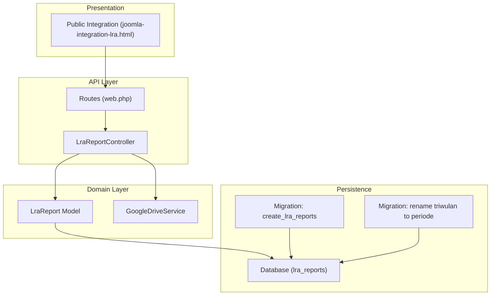
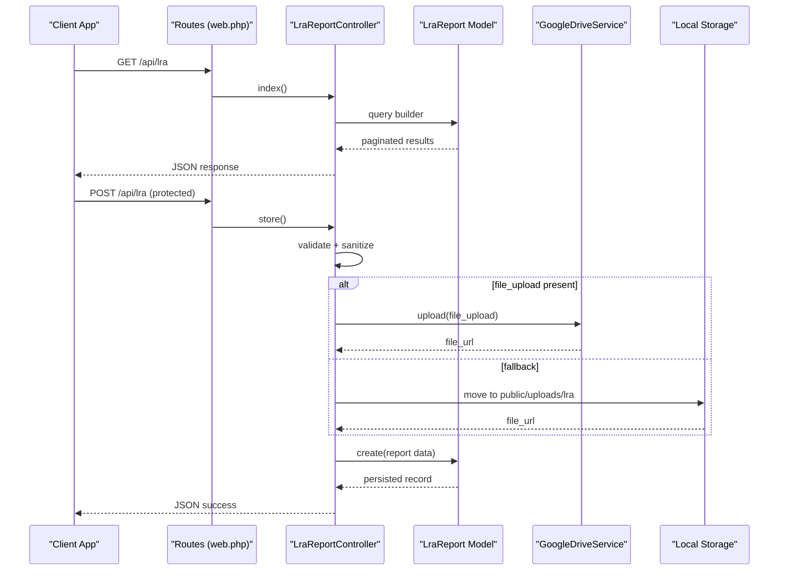
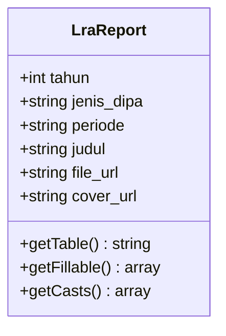
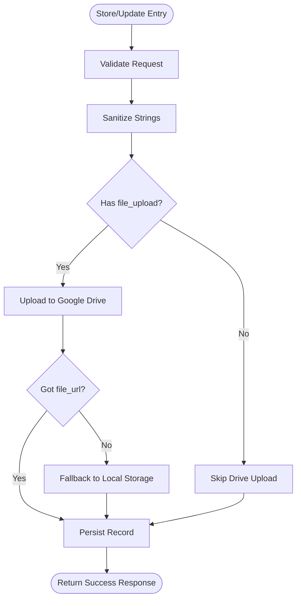
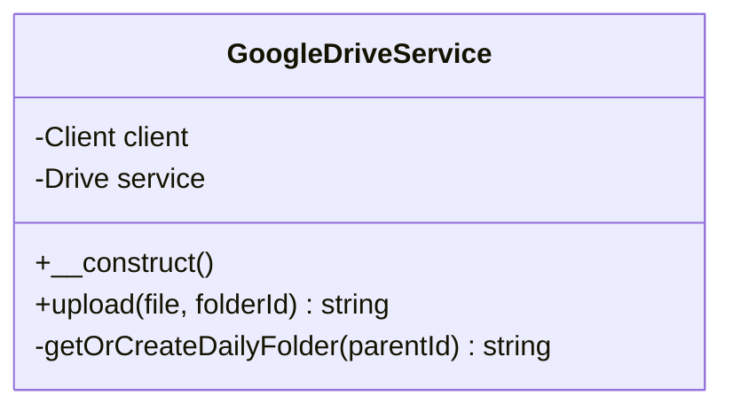
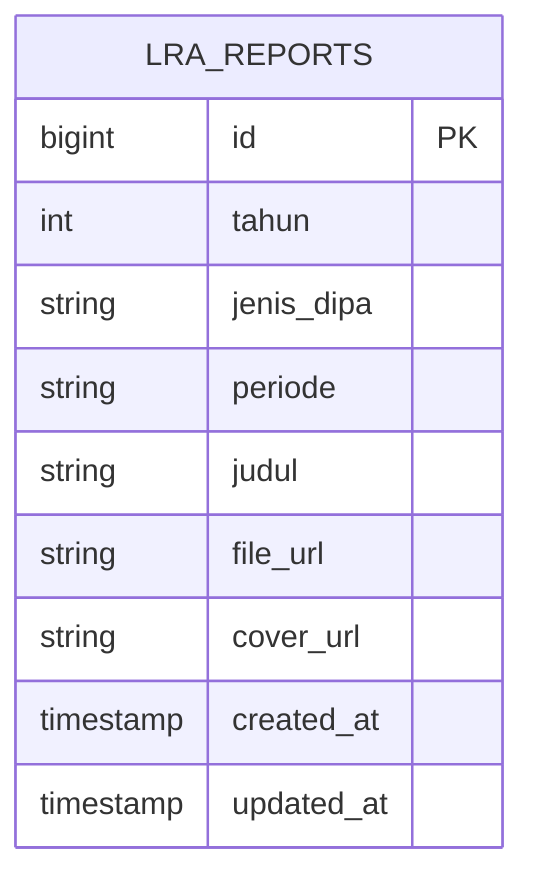
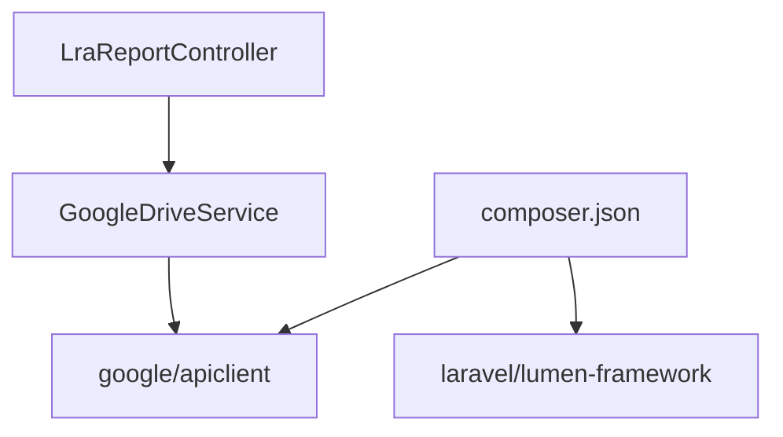

# Financial Statements Model (LraReport)

<cite>
**Referenced Files in This Document**
- [LraReport.php](file://app/Models/LraReport.php)
- [LraReportController.php](file://app/Http/Controllers/LraReportController.php)
- [GoogleDriveService.php](file://app/Services/GoogleDriveService.php)
- [2026_04_01_000002_create_lra_reports_table.php](file://database/migrations/2026_04_01_000002_create_lra_reports_table.php)
- [2026_04_02_000000_rename_triwulan_to_periode_on_lra_reports.php](file://database/migrations/2026_04_02_000000_rename_triwulan_to_periode_on_lra_reports.php)
- [LraReportSeeder.php](file://database/seeders/LraReportSeeder.php)
- [web.php](file://routes/web.php)
- [2026-04-01-lra-module-design.md](file://docs/plans/2026-04-01-lra-module-design.md)
- [2026-04-01-lra-module-plan.md](file://docs/plans/2026-04-01-lra-module-plan.md)
- [joomla-integration-lra.html](file://docs/joomla-integration-lra.html)
- [composer.json](file://composer.json)
</cite>

## Table of Contents
1. [Introduction](#introduction)
2. [Project Structure](#project-structure)
3. [Core Components](#core-components)
4. [Architecture Overview](#architecture-overview)
5. [Detailed Component Analysis](#detailed-component-analysis)
6. [Dependency Analysis](#dependency-analysis)
7. [Performance Considerations](#performance-considerations)
8. [Troubleshooting Guide](#troubleshooting-guide)
9. [Conclusion](#conclusion)
10. [Appendices](#appendices)

## Introduction
This document describes the LraReport model and its ecosystem for generating and managing financial statements and reporting. It explains the period-based reporting system (renamed from quarterly to period-based), financial statement formatting, and the automated workflows that support publication and retrieval of LRA documents. It also outlines the relationship between LRA reports and financial auditing processes, including validation and approval mechanisms, and provides examples of financial statement generation and periodic reporting scenarios.

## Project Structure
The LRA module follows a clean Laravel Lumen architecture with a dedicated model, controller, service, database migrations, and a public integration page. The routes are separated into public and protected groups with rate limiting and API key enforcement.

**Diagram sources**
- [web.php:14-76](file://routes/web.php#L14-L76)
- [LraReportController.php:11-234](file://app/Http/Controllers/LraReportController.php#L11-L234)
- [LraReport.php:7-23](file://app/Models/LraReport.php#L7-L23)
- [GoogleDriveService.php:9-116](file://app/Services/GoogleDriveService.php#L9-L116)
- [2026_04_01_000002_create_lra_reports_table.php:9-22](file://database/migrations/2026_04_01_000002_create_lra_reports_table.php#L9-L22)
- [2026_04_02_000000_rename_triwulan_to_periode_on_lra_reports.php:10-31](file://database/migrations/2026_04_02_000000_rename_triwulan_to_periode_on_lra_reports.php#L10-L31)
- [joomla-integration-lra.html:170-200](file://docs/joomla-integration-lra.html#L170-L200)

**Section sources**
- [web.php:14-76](file://routes/web.php#L14-L76)
- [LraReportController.php:11-234](file://app/Http/Controllers/LraReportController.php#L11-L234)
- [LraReport.php:7-23](file://app/Models/LraReport.php#L7-L23)
- [GoogleDriveService.php:9-116](file://app/Services/GoogleDriveService.php#L9-L116)
- [2026_04_01_000002_create_lra_reports_table.php:9-22](file://database/migrations/2026_04_01_000002_create_lra_reports_table.php#L9-L22)
- [2026_04_02_000000_rename_triwulan_to_periode_on_lra_reports.php:10-31](file://database/migrations/2026_04_02_000000_rename_triwulan_to_periode_on_lra_reports.php#L10-L31)
- [joomla-integration-lra.html:170-200](file://docs/joomla-integration-lra.html#L170-L200)

## Core Components
- LraReport Model: Defines the entity schema, fillable attributes, and casting for the lra_reports table.
- LraReportController: Implements CRUD operations, input validation, sanitization, and file upload to Google Drive with fallback to local storage.
- GoogleDriveService: Handles Google Drive uploads, creates daily subfolders, and returns public view links.
- Database Migrations: Define the lra_reports table structure and the renaming of triwulan to periode with unique constraints.
- Public Integration: A static HTML page that fetches LRA data from the API and renders cards grouped by year and DIPA type.

**Section sources**
- [LraReport.php:7-23](file://app/Models/LraReport.php#L7-L23)
- [LraReportController.php:11-234](file://app/Http/Controllers/LraReportController.php#L11-L234)
- [GoogleDriveService.php:9-116](file://app/Services/GoogleDriveService.php#L9-L116)
- [2026_04_01_000002_create_lra_reports_table.php:9-22](file://database/migrations/2026_04_01_000002_create_lra_reports_table.php#L9-L22)
- [2026_04_02_000000_rename_triwulan_to_periode_on_lra_reports.php:10-31](file://database/migrations/2026_04_02_000000_rename_triwulan_to_periode_on_lra_reports.php#L10-L31)
- [joomla-integration-lra.html:170-200](file://docs/joomla-integration-lra.html#L170-L200)

## Architecture Overview
The LRA reporting system is built around a flat relational model with explicit CRUD endpoints. Data is validated and sanitized before persistence. Documents are uploaded to Google Drive with a fallback to local storage. The public page consumes the API to present a responsive grid of LRA documents.

**Diagram sources**
- [web.php:74-76](file://routes/web.php#L74-L76)
- [LraReportController.php:20-55](file://app/Http/Controllers/LraReportController.php#L20-L55)
- [LraReportController.php:80-116](file://app/Http/Controllers/LraReportController.php#L80-L116)
- [LraReportController.php:198-232](file://app/Http/Controllers/LraReportController.php#L198-L232)
- [GoogleDriveService.php:38-82](file://app/Services/GoogleDriveService.php#L38-L82)

## Detailed Component Analysis

### LraReport Model
The model defines the entity for LRA reports with:
- Table name: lra_reports
- Fillable attributes: tahun, jenis_dipa, periode, judul, file_url, cover_url
- Casting: tahun as integer

**Diagram sources**
- [LraReport.php:7-23](file://app/Models/LraReport.php#L7-L23)

**Section sources**
- [LraReport.php:7-23](file://app/Models/LraReport.php#L7-L23)

### LraReportController
Responsibilities:
- Index: filters by tahun and jenis_dipa, paginates, sorts by year desc, jenis_dipa asc, periode asc.
- Show: retrieves a single report by ID with validation.
- Store: validates required fields, sanitizes strings, uploads files to Google Drive or falls back to local storage, persists record.
- Update: similar to store but updates existing record and optionally replaces files.
- Destroy: deletes a report by ID.
- uploadToGoogleDrive: orchestrates Drive upload with logging and fallback to local storage.

**Diagram sources**
- [LraReportController.php:80-116](file://app/Http/Controllers/LraReportController.php#L80-L116)
- [LraReportController.php:118-171](file://app/Http/Controllers/LraReportController.php#L118-L171)
- [LraReportController.php:198-232](file://app/Http/Controllers/LraReportController.php#L198-L232)

**Section sources**
- [LraReportController.php:20-55](file://app/Http/Controllers/LraReportController.php#L20-L55)
- [LraReportController.php:57-78](file://app/Http/Controllers/LraReportController.php#L57-L78)
- [LraReportController.php:80-116](file://app/Http/Controllers/LraReportController.php#L80-L116)
- [LraReportController.php:118-171](file://app/Http/Controllers/LraReportController.php#L118-L171)
- [LraReportController.php:173-196](file://app/Http/Controllers/LraReportController.php#L173-L196)
- [LraReportController.php:198-232](file://app/Http/Controllers/LraReportController.php#L198-L232)

### GoogleDriveService
Features:
- Initializes Google API client with environment credentials.
- Creates or finds a daily subfolder under the configured root folder.
- Uploads files and sets public read permission.
- Returns a web view link for the uploaded file.

**Diagram sources**
- [GoogleDriveService.php:9-116](file://app/Services/GoogleDriveService.php#L9-L116)

**Section sources**
- [GoogleDriveService.php:9-116](file://app/Services/GoogleDriveService.php#L9-L116)

### Database Migrations and Data Model
- Initial creation defines lra_reports with tahun, jenis_dipa, triwulan, judul, file_url, cover_url, timestamps, and a unique constraint on (tahun, jenis_dipa, triwulan).
- Renaming migration renames triwulan to periode, updates values to semantic labels, and re-applies unique constraint on (tahun, jenis_dipa, periode).
- Seeder seeds representative LRA entries for two DIPA types across multiple years and periods.

**Diagram sources**
- [2026_04_01_000002_create_lra_reports_table.php:11-22](file://database/migrations/2026_04_01_000002_create_lra_reports_table.php#L11-L22)
- [2026_04_02_000000_rename_triwulan_to_periode_on_lra_reports.php:12-31](file://database/migrations/2026_04_02_000000_rename_triwulan_to_periode_on_lra_reports.php#L12-L31)

**Section sources**
- [2026_04_01_000002_create_lra_reports_table.php:9-22](file://database/migrations/2026_04_01_000002_create_lra_reports_table.php#L9-L22)
- [2026_04_02_000000_rename_triwulan_to_periode_on_lra_reports.php:10-31](file://database/migrations/2026_04_02_000000_rename_triwulan_to_periode_on_lra_reports.php#L10-L31)
- [LraReportSeeder.php:10-36](file://database/seeders/LraReportSeeder.php#L10-L36)

### Period-Based Reporting System
- Period values: semester_1, semester_2, unaudited, audited.
- Sorting order: semester_1, semester_2, unaudited, audited.
- Unique constraint ensures one report per (tahun, jenis_dipa, periode).

**Section sources**
- [2026_04_02_000000_rename_triwulan_to_periode_on_lra_reports.php:24-27](file://database/migrations/2026_04_02_000000_rename_triwulan_to_periode_on_lra_reports.php#L24-L27)
- [joomla-integration-lra.html:224-242](file://docs/joomla-integration-lra.html#L224-L242)

### Financial Statement Formatting and Automated Workflows
- File upload workflow: PDF for the main report, optional cover image.
- Public presentation: Responsive grid layout with cover thumbnails and titles.
- API pagination and filtering enable efficient browsing and discovery.

**Section sources**
- [LraReportController.php:82-89](file://app/Http/Controllers/LraReportController.php#L82-L89)
- [LraReportController.php:96-101](file://app/Http/Controllers/LraReportController.php#L96-L101)
- [joomla-integration-lra.html:170-200](file://docs/joomla-integration-lra.html#L170-L200)

### Relationship to Auditing Processes
- Period semantics: audited vs unaudited distinguish between reviewed and unreviewed statements.
- Validation and approval: Protected endpoints require API key and enforce strict validation to ensure data integrity prior to publication.
- Public accessibility: Once published, reports are accessible via public API and embedded pages.

**Section sources**
- [LraReportController.php:135-142](file://app/Http/Controllers/LraReportController.php#L135-L142)
- [web.php:78-164](file://routes/web.php#L78-L164)

### Examples and Scenarios
- Generating a new LRA report: POST /api/lra with file_upload and optional cover_upload; receives a public file_url.
- Retrieving a specific report: GET /api/lra/{id} returns the report metadata and links.
- Listing reports by year: GET /api/lra?tahun=YYYY&per_page=100.
- Periodic reporting: Each (tahun, jenis_dipa, periode) uniquely identifies a report; audited/unaudited indicates review status.

**Section sources**
- [LraReportController.php:20-55](file://app/Http/Controllers/LraReportController.php#L20-L55)
- [LraReportController.php:57-78](file://app/Http/Controllers/LraReportController.php#L57-L78)
- [LraReportController.php:80-116](file://app/Http/Controllers/LraReportController.php#L80-L116)
- [joomla-integration-lra.html:188-200](file://docs/joomla-integration-lra.html#L188-L200)

## Dependency Analysis
External dependencies and integrations:
- Google API Client for Drive integration.
- Laravel Lumen framework for routing and ORM.
- Environment variables for Google Drive credentials and permissions.

**Diagram sources**
- [composer.json:11-14](file://composer.json#L11-L14)
- [LraReportController.php:5](file://app/Http/Controllers/LraReportController.php#L5)
- [GoogleDriveService.php:5-21](file://app/Services/GoogleDriveService.php#L5-L21)

**Section sources**
- [composer.json:11-14](file://composer.json#L11-L14)
- [LraReportController.php:5](file://app/Http/Controllers/LraReportController.php#L5)
- [GoogleDriveService.php:5-21](file://app/Services/GoogleDriveService.php#L5-L21)

## Performance Considerations
- Pagination: The index endpoint supports configurable per_page with a cap to prevent excessive loads.
- File size limits: PDF and cover uploads have maximum sizes to control bandwidth and storage.
- Rate limiting: Public endpoints are throttled to 100 requests per minute; protected endpoints share the same policy.
- Storage fallback: Local storage is used as a backup when Google Drive upload fails, ensuring availability.

**Section sources**
- [LraReportController.php:38-45](file://app/Http/Controllers/LraReportController.php#L38-L45)
- [LraReportController.php:87-88](file://app/Http/Controllers/LraReportController.php#L87-L88)
- [LraReportController.php:140-141](file://app/Http/Controllers/LraReportController.php#L140-L141)
- [LraReportController.php:216-231](file://app/Http/Controllers/LraReportController.php#L216-L231)

## Troubleshooting Guide
Common issues and resolutions:
- Invalid ID errors: Ensure numeric IDs greater than zero for show/update/delete operations.
- Upload failures: Verify Google Drive credentials and network connectivity; the controller logs errors and falls back to local storage.
- Validation errors: Confirm input matches allowed values (e.g., jenis_dipa in DIPA 01, DIPA 04; periode in semester_1, semester_2, unaudited, audited).
- API key missing: Protected endpoints require a valid API key in the request headers.

**Section sources**
- [LraReportController.php:59-64](file://app/Http/Controllers/LraReportController.php#L59-L64)
- [LraReportController.php:120-125](file://app/Http/Controllers/LraReportController.php#L120-L125)
- [LraReportController.php:82-89](file://app/Http/Controllers/LraReportController.php#L82-L89)
- [LraReportController.php:135-142](file://app/Http/Controllers/LraReportController.php#L135-L142)
- [web.php:78-164](file://routes/web.php#L78-L164)

## Conclusion
The LraReport module provides a robust, period-based financial reporting system with strong validation, secure upload workflows, and a clean separation of concerns. The period semantics (semester_1, semester_2, unaudited, audited) align with typical financial reporting cycles and auditing stages. The public integration enables easy discovery and access to LRA documents, while protected endpoints ensure controlled data management.

## Appendices

### API Endpoints Summary
- GET /api/lra: List reports with optional tahun and pagination.
- GET /api/lra/{id}: Retrieve a specific report.
- POST /api/lra (protected): Create a new report with file uploads.
- PUT /api/lra/{id} (protected): Update an existing report with optional file replacements.
- DELETE /api/lra/{id} (protected): Remove a report.

**Section sources**
- [web.php:74-76](file://routes/web.php#L74-L76)
- [web.php:160-163](file://routes/web.php#L160-L163)