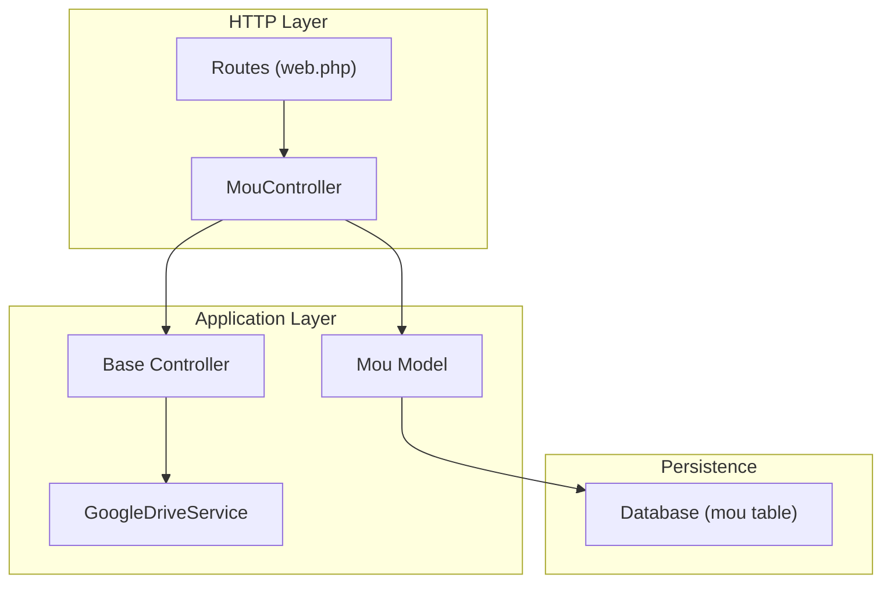
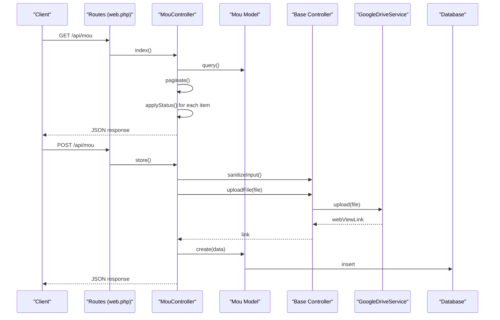
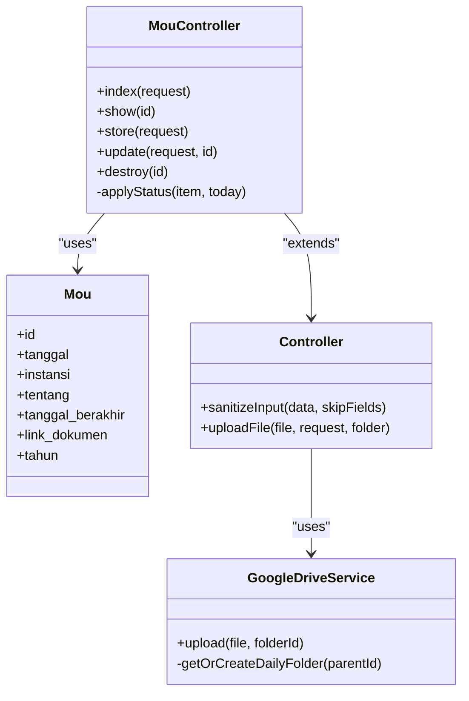
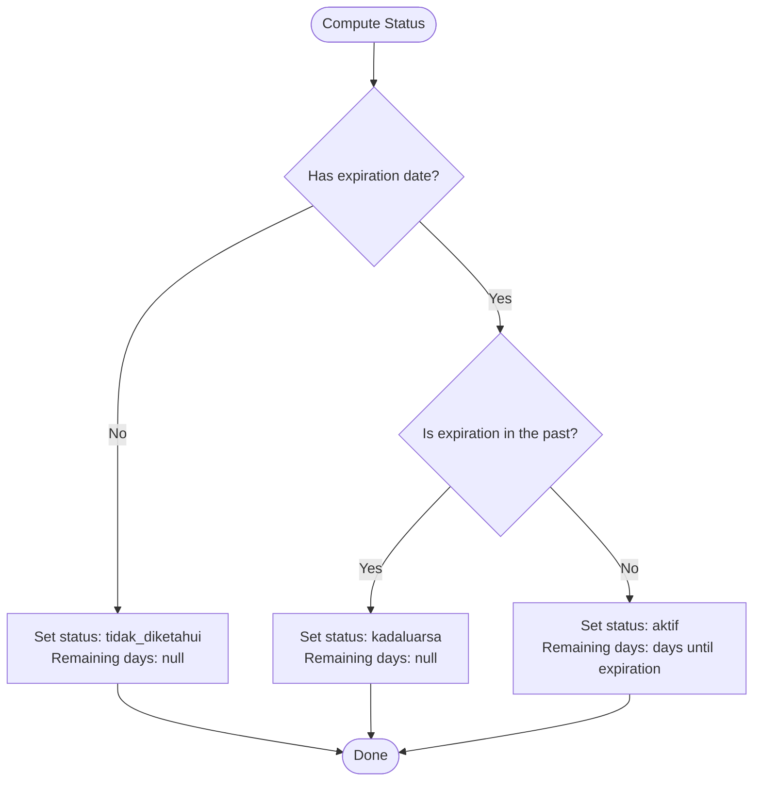
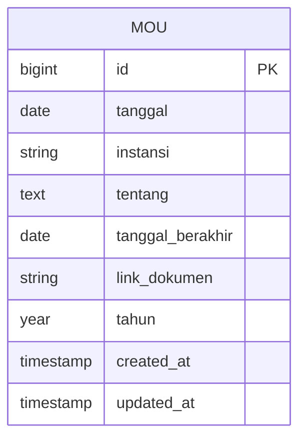

# Memorandum of Understanding Model (Mou)

<cite>
**Referenced Files in This Document**
- [Mou.php](file://app/Models/Mou.php)
- [MouController.php](file://app/Http/Controllers/MouController.php)
- [Controller.php](file://app/Http/Controllers/Controller.php)
- [GoogleDriveService.php](file://app/Services/GoogleDriveService.php)
- [2026_04_01_000000_create_mou_table.php](file://database/migrations/2026_04_01_000000_create_mou_table.php)
- [MouSeeder.php](file://database/seeders/MouSeeder.php)
- [web.php](file://routes/web.php)
</cite>

## Table of Contents
1. [Introduction](#introduction)
2. [Project Structure](#project-structure)
3. [Core Components](#core-components)
4. [Architecture Overview](#architecture-overview)
5. [Detailed Component Analysis](#detailed-component-analysis)
6. [Dependency Analysis](#dependency-analysis)
7. [Performance Considerations](#performance-considerations)
8. [Troubleshooting Guide](#troubleshooting-guide)
9. [Conclusion](#conclusion)
10. [Appendices](#appendices)

## Introduction
This document describes the Memorandum of Understanding (MOU) model that tracks inter-agency agreements within the system. It covers the data model, lifecycle management, status tracking, and compliance monitoring capabilities. The MOU module enables organizations to record agreements, manage documents, and monitor agreement expiration dates. It also integrates with Google Drive for document storage and provides paginated, filtered listings with dynamic status computation.

## Project Structure
The MOU module is implemented as a standard Laravel/Lumen application feature with a dedicated model, controller, migration, seeder, and routing configuration. The controller inherits shared functionality for input sanitization and secure file uploads.

**Diagram sources**
- [web.php:70-72](file://routes/web.php#L70-L72)
- [MouController.php:8-134](file://app/Http/Controllers/MouController.php#L8-L134)
- [Mou.php:7-25](file://app/Models/Mou.php#L7-L25)
- [Controller.php:18-96](file://app/Http/Controllers/Controller.php#L18-L96)
- [GoogleDriveService.php:9-117](file://app/Services/GoogleDriveService.php#L9-L117)

**Section sources**
- [web.php:70-72](file://routes/web.php#L70-L72)
- [MouController.php:8-134](file://app/Http/Controllers/MouController.php#L8-L134)
- [Mou.php:7-25](file://app/Models/Mou.php#L7-L25)
- [Controller.php:18-96](file://app/Http/Controllers/Controller.php#L18-L96)
- [GoogleDriveService.php:9-117](file://app/Services/GoogleDriveService.php#L9-L117)

## Core Components
- Model: Defines the MOU entity, attributes, casting, and table mapping.
- Controller: Implements CRUD operations, input validation, file upload, and dynamic status computation.
- Base Controller: Provides shared utilities for input sanitization and secure file uploads.
- Google Drive Service: Handles cloud storage integration for uploaded documents.
- Migration: Creates the persistent schema for MOU records.
- Seeder: Seeds initial MOU data for demonstration and testing.

**Section sources**
- [Mou.php:7-25](file://app/Models/Mou.php#L7-L25)
- [MouController.php:8-134](file://app/Http/Controllers/MouController.php#L8-L134)
- [Controller.php:18-96](file://app/Http/Controllers/Controller.php#L18-L96)
- [GoogleDriveService.php:9-117](file://app/Services/GoogleDriveService.php#L9-L117)
- [2026_04_01_000000_create_mou_table.php:9-24](file://database/migrations/2026_04_01_000000_create_mou_table.php#L9-L24)
- [MouSeeder.php:9-114](file://database/seeders/MouSeeder.php#L9-L114)

## Architecture Overview
The MOU module follows a layered architecture:
- HTTP requests are routed to the MouController.
- The controller validates inputs, handles file uploads, persists data, and computes dynamic status.
- The model encapsulates persistence and attribute casting.
- The base controller provides reusable security and upload utilities.
- Google Drive service is used for cloud storage when available, with local fallback.

**Diagram sources**
- [web.php:70-72](file://routes/web.php#L70-L72)
- [MouController.php:10-37](file://app/Http/Controllers/MouController.php#L10-L37)
- [MouController.php:51-74](file://app/Http/Controllers/MouController.php#L51-L74)
- [Controller.php:18-96](file://app/Http/Controllers/Controller.php#L18-L96)
- [GoogleDriveService.php:38-82](file://app/Services/GoogleDriveService.php#L38-L82)
- [Mou.php:7-25](file://app/Models/Mou.php#L7-L25)

## Detailed Component Analysis

### Data Model: Mou
The MOU model defines the persisted attributes and their types. It maps to the mou table and casts date fields appropriately. The model exposes fillable attributes for controlled mass assignment.

Key attributes:
- tanggal: signing date
- instansi: agency name
- tentang: subject/title
- tanggal_berakhir: expiration date (nullable)
- link_dokumen: document link (nullable)
- tahun: derived year from tanggal

Casting ensures consistent handling of date/time values.

**Section sources**
- [Mou.php:7-25](file://app/Models/Mou.php#L7-L25)
- [2026_04_01_000000_create_mou_table.php:11-19](file://database/migrations/2026_04_01_000000_create_mou_table.php#L11-L19)

### Controller: MouController
Responsibilities:
- Listing MOUs with pagination and optional year filtering.
- Showing individual MOU with dynamic status computation.
- Creating and updating MOUs with validation and file upload.
- Deleting MOUs.
- Applying dynamic status and remaining days calculation.

Validation rules:
- tanggal: required date
- instansi: required string with max length
- tentang: required text
- tanggal_berakhir: optional date, must be after or equal to tanggal
- file_dokumen: optional file with allowed MIME types and size limit

Dynamic status computation:
- If no expiration date is set, status is “tidak_diketahui” and remaining days are null.
- If expiration date is in the past, status is “kadaluarsa” and remaining days are null.
- Otherwise, status is “aktif” and remaining days equals days until expiration.

Pagination and ordering:
- Results are ordered by tanggal descending.
- per_page defaults to 15 items.

**Section sources**
- [MouController.php:10-37](file://app/Http/Controllers/MouController.php#L10-L37)
- [MouController.php:39-49](file://app/Http/Controllers/MouController.php#L39-L49)
- [MouController.php:51-74](file://app/Http/Controllers/MouController.php#L51-L74)
- [MouController.php:76-104](file://app/Http/Controllers/MouController.php#L76-L104)
- [MouController.php:106-110](file://app/Http/Controllers/MouController.php#L106-L110)
- [MouController.php:115-132](file://app/Http/Controllers/MouController.php#L115-L132)

### Base Controller Utilities
Shared utilities:
- sanitizeInput: strips HTML tags and trims strings, returning null for empty strings.
- uploadFile: validates MIME type using magic bytes, attempts Google Drive upload, falls back to local storage, and returns a public URL.

Security measures:
- MIME type validation prevents malicious file uploads.
- Randomized filenames reduce predictability.
- Google Drive fallback ensures availability.

**Section sources**
- [Controller.php:18-29](file://app/Http/Controllers/Controller.php#L18-L29)
- [Controller.php:40-96](file://app/Http/Controllers/Controller.php#L40-L96)

### Google Drive Service
Cloud storage integration:
- Initializes Google Drive client using environment credentials.
- Uploads files to a daily subfolder under a configured root folder.
- Makes uploaded files publicly readable.
- Returns a web view link for the uploaded file.

Fallback behavior:
- If daily folder creation fails, upload proceeds to root folder.
- Errors are logged and handled gracefully.

**Section sources**
- [GoogleDriveService.php:9-117](file://app/Services/GoogleDriveService.php#L9-L117)

### Database Migration and Seeding
Migration:
- Creates the mou table with indexed year and date fields for efficient querying.
- Defines nullable expiration date and document link fields.

Seeder:
- Seeds historical MOU entries from legacy data.
- Sets year derived from tanggal.
- Leaves expiration date null to demonstrate “tidak_diketahui” status.

**Section sources**
- [2026_04_01_000000_create_mou_table.php:9-24](file://database/migrations/2026_04_01_000000_create_mou_table.php#L9-L24)
- [MouSeeder.php:90-114](file://database/seeders/MouSeeder.php#L90-L114)

### Routing
Public routes:
- GET /api/mou: list MOUs
- GET /api/mou/{id}: show MOU

Protected routes:
- POST /api/mou: create MOU
- PUT /api/mou/{id}: update MOU
- DELETE /api/mou/{id}: delete MOU

Rate limiting and API key middleware are applied to protected routes.

**Section sources**
- [web.php:70-72](file://routes/web.php#L70-L72)
- [web.php:154-158](file://routes/web.php#L154-L158)

## Dependency Analysis
The MOU module exhibits clean separation of concerns:
- Controller depends on the Model for persistence and on Base Controller for utilities.
- Base Controller depends on GoogleDriveService when available.
- GoogleDriveService depends on Google APIs and environment configuration.
- Migration and Seeder define the schema and initial dataset.

**Diagram sources**
- [MouController.php:8-134](file://app/Http/Controllers/MouController.php#L8-L134)
- [Mou.php:7-25](file://app/Models/Mou.php#L7-L25)
- [Controller.php:7-96](file://app/Http/Controllers/Controller.php#L7-L96)
- [GoogleDriveService.php:9-117](file://app/Services/GoogleDriveService.php#L9-L117)

**Section sources**
- [MouController.php:8-134](file://app/Http/Controllers/MouController.php#L8-L134)
- [Mou.php:7-25](file://app/Models/Mou.php#L7-L25)
- [Controller.php:7-96](file://app/Http/Controllers/Controller.php#L7-L96)
- [GoogleDriveService.php:9-117](file://app/Services/GoogleDriveService.php#L9-L117)

## Performance Considerations
- Indexes: The year and date fields are indexed to optimize filtering and sorting.
- Pagination: Default page size is 15; clients can adjust via per_page query parameter.
- Status computation: Dynamic status is computed per item during listing and single-item retrieval, adding minimal overhead.
- File uploads: MIME validation and cloud storage fallback ensure reliability; consider CDN caching for frequently accessed documents.

[No sources needed since this section provides general guidance]

## Troubleshooting Guide
Common issues and resolutions:
- Validation errors on creation/update:
  - Ensure tanggal is a valid date and tanggal_berakhir is after or equal to tanggal when provided.
  - Limit file_dokumen to allowed MIME types and size.
- Missing document link:
  - Verify Google Drive service credentials and permissions if cloud upload is preferred.
  - Confirm local uploads are enabled and public/uploads/mou directory is writable.
- Status shows “tidak_diketahui”:
  - Expected when tanggal_berakhir is null; set an expiration date to compute active/expired status.
- Expiration date in the past:
  - Status becomes “kadaluarsa”; update tanggal_berakhir to reactivate.

**Section sources**
- [MouController.php:53-59](file://app/Http/Controllers/MouController.php#L53-L59)
- [MouController.php:83-89](file://app/Http/Controllers/MouController.php#L83-L89)
- [Controller.php:44-60](file://app/Http/Controllers/Controller.php#L44-L60)
- [MouController.php:115-132](file://app/Http/Controllers/MouController.php#L115-L132)

## Conclusion
The MOU module provides a robust foundation for managing inter-agency agreements with strong validation, secure file handling, and dynamic status tracking. It supports year-based filtering, paginated listing, and integrates with cloud storage for document management. While the current model focuses on basic lifecycle tracking, future enhancements could include explicit status transitions, compliance milestones, and performance metrics aligned with organizational objectives.

[No sources needed since this section summarizes without analyzing specific files]

## Appendices

### API Definitions
- List MOUs
  - Method: GET
  - Path: /api/mou
  - Query parameters:
    - tahun: integer (optional)
    - per_page: integer (default: 15)
  - Response: JSON with items, total, current_page, last_page, per_page

- Show MOU
  - Method: GET
  - Path: /api/mou/{id}
  - Response: JSON with data and computed status fields

- Create MOU
  - Method: POST
  - Path: /api/mou
  - Body fields:
    - tanggal: date (required)
    - instansi: string (required)
    - tentang: text (required)
    - tanggal_berakhir: date (optional)
    - file_dokumen: file (optional)
  - Response: JSON with created data

- Update MOU
  - Method: PUT
  - Path: /api/mou/{id}
  - Body fields: same as create
  - Response: JSON with updated data

- Delete MOU
  - Method: DELETE
  - Path: /api/mou/{id}
  - Response: JSON success indicator

**Section sources**
- [web.php:70-72](file://routes/web.php#L70-L72)
- [web.php:154-158](file://routes/web.php#L154-L158)
- [MouController.php:10-37](file://app/Http/Controllers/MouController.php#L10-L37)
- [MouController.php:39-49](file://app/Http/Controllers/MouController.php#L39-L49)
- [MouController.php:51-74](file://app/Http/Controllers/MouController.php#L51-L74)
- [MouController.php:76-104](file://app/Http/Controllers/MouController.php#L76-L104)
- [MouController.php:106-110](file://app/Http/Controllers/MouController.php#L106-L110)

### Status Computation Flow

**Diagram sources**
- [MouController.php:115-132](file://app/Http/Controllers/MouController.php#L115-L132)

### Data Model Diagram

**Diagram sources**
- [2026_04_01_000000_create_mou_table.php:11-19](file://database/migrations/2026_04_01_000000_create_mou_table.php#L11-L19)