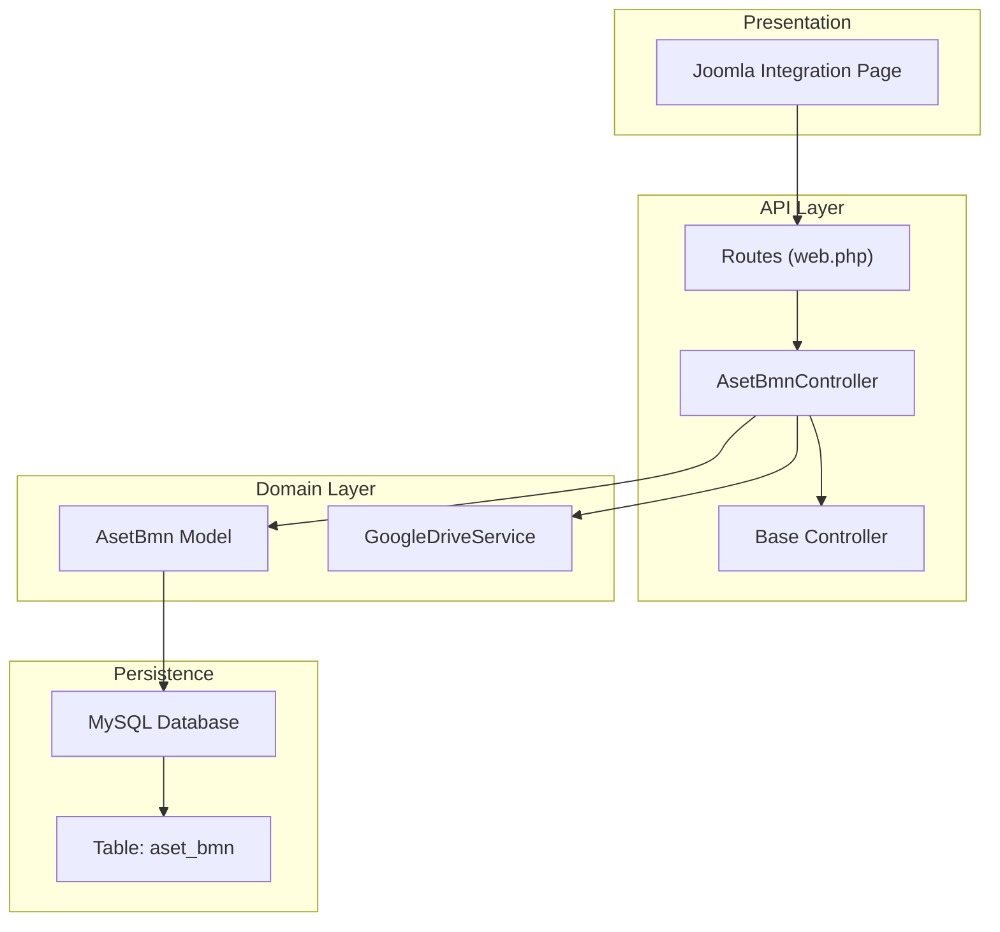
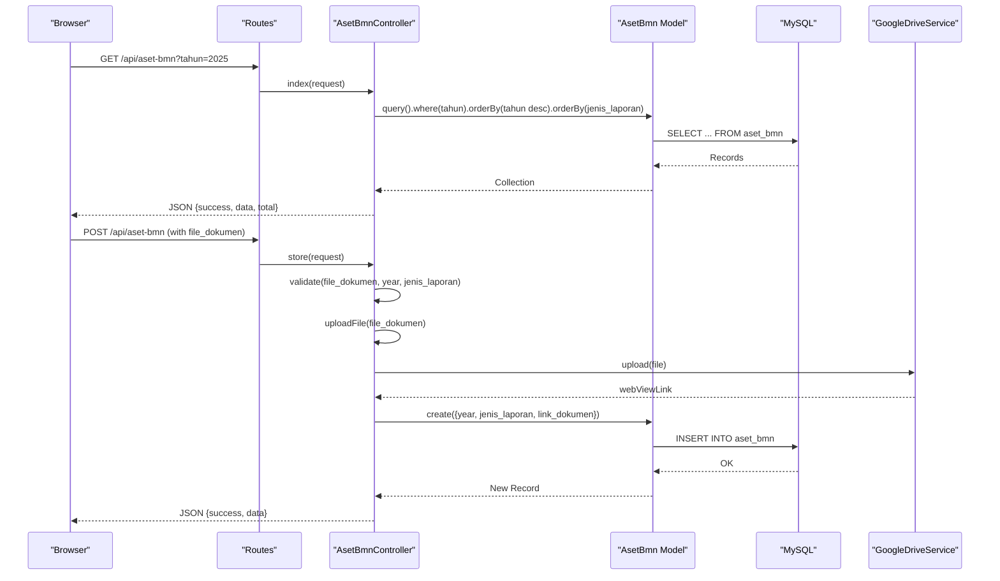
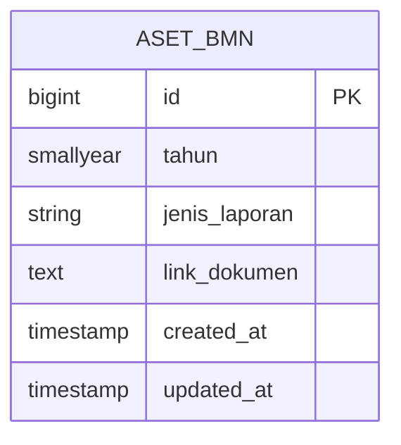
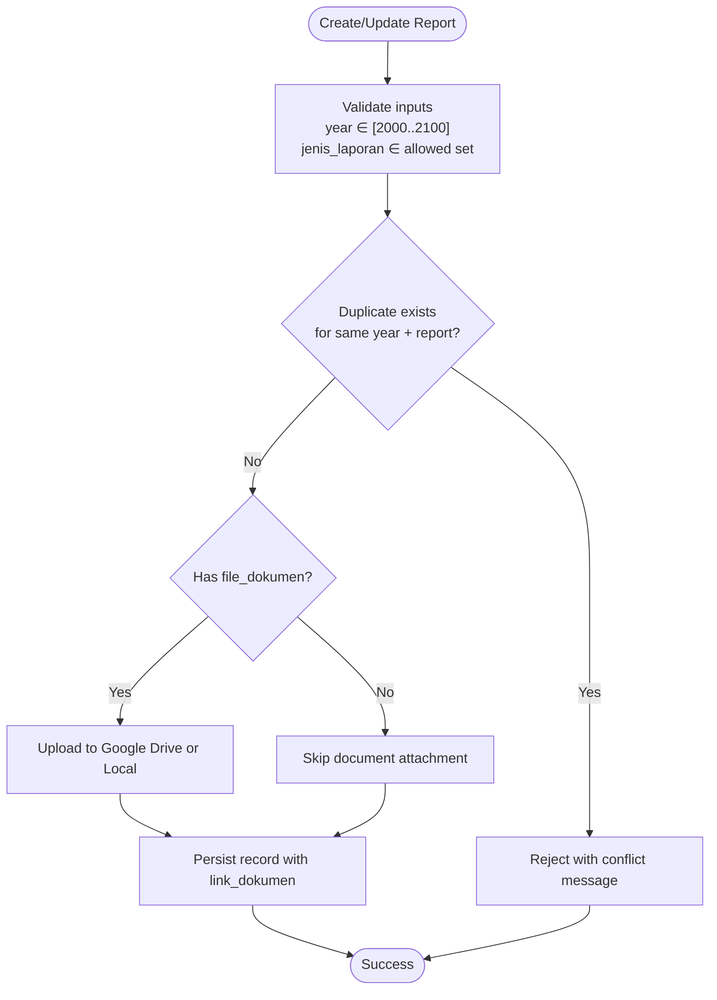
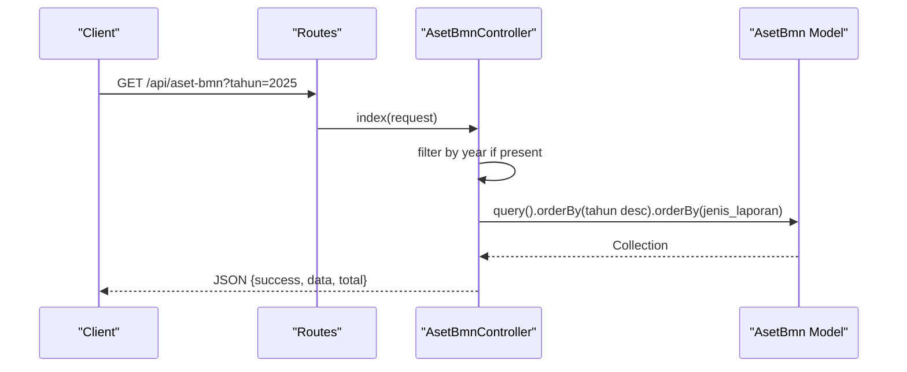
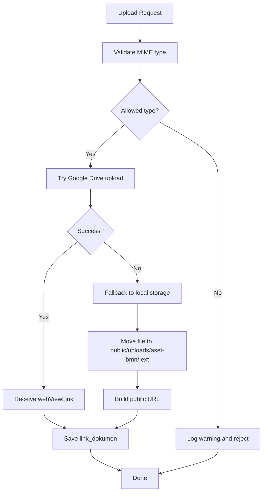
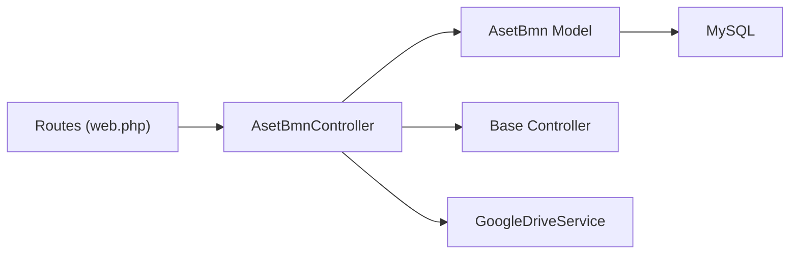

# State Property Model (AsetBmn)

<cite>
**Referenced Files in This Document**
- [AsetBmn.php](file://app/Models/AsetBmn.php)
- [2026_02_26_000000_create_aset_bmn_table.php](file://database/migrations/2026_02_26_000000_create_aset_bmn_table.php)
- [AsetBmnController.php](file://app/Http/Controllers/AsetBmnController.php)
- [Controller.php](file://app/Http/Controllers/Controller.php)
- [GoogleDriveService.php](file://app/Services/GoogleDriveService.php)
- [AsetBmnSeeder.php](file://database/seeders/AsetBmnSeeder.php)
- [web.php](file://routes/web.php)
- [joomla-integration-aset-bmn.html](file://docs/joomla-integration-aset-bmn.html)
- [database.php](file://config/database.php)
</cite>

## Table of Contents
1. [Introduction](#introduction)
2. [Project Structure](#project-structure)
3. [Core Components](#core-components)
4. [Architecture Overview](#architecture-overview)
5. [Detailed Component Analysis](#detailed-component-analysis)
6. [Dependency Analysis](#dependency-analysis)
7. [Performance Considerations](#performance-considerations)
8. [Troubleshooting Guide](#troubleshooting-guide)
9. [Conclusion](#conclusion)
10. [Appendices](#appendices)

## Introduction
This document describes the State Property Model (AsetBmn) responsible for managing government asset and property reporting. It focuses on the asset inventory system, property classification via predefined report types, and the lifecycle of state property records from creation to archival. The model tracks annual and periodic reports related to state-owned assets, supports document uploads, and integrates with external systems for document storage and presentation.

The system does not implement asset valuation, maintenance tracking, or explicit budget allocation workflows. Instead, it centralizes reporting data and document links for transparency and auditability.

## Project Structure
The AsetBmn module comprises:
- Model: Defines the persisted entity and data casting
- Migration: Creates the underlying table with constraints
- Controller: Implements CRUD operations, validation, and document upload
- Base Controller: Provides input sanitization and secure file upload
- Google Drive Service: Handles cloud storage integration for uploaded documents
- Seeder: Seeds historical report data with document links
- Routes: Exposes public read-only and protected write APIs
- Frontend Integration: Demonstrates consumption of the API for report browsing

**Diagram sources**
- [web.php:46-48](file://routes/web.php#L46-L48)
- [AsetBmnController.php:9-167](file://app/Http/Controllers/AsetBmnController.php#L9-L167)
- [Controller.php:18-97](file://app/Http/Controllers/Controller.php#L18-L97)
- [AsetBmn.php:7-21](file://app/Models/AsetBmn.php#L7-L21)
- [GoogleDriveService.php:9-117](file://app/Services/GoogleDriveService.php#L9-L117)
- [2026_02_26_000000_create_aset_bmn_table.php:14-22](file://database/migrations/2026_02_26_000000_create_aset_bmn_table.php#L14-L22)
- [joomla-integration-aset-bmn.html:172-292](file://docs/joomla-integration-aset-bmn.html#L172-L292)

**Section sources**
- [web.php:46-48](file://routes/web.php#L46-L48)
- [AsetBmnController.php:9-167](file://app/Http/Controllers/AsetBmnController.php#L9-L167)
- [AsetBmn.php:7-21](file://app/Models/AsetBmn.php#L7-L21)
- [2026_02_26_000000_create_aset_bmn_table.php:14-22](file://database/migrations/2026_02_26_000000_create_aset_bmn_table.php#L14-L22)
- [Controller.php:18-97](file://app/Http/Controllers/Controller.php#L18-L97)
- [GoogleDriveService.php:9-117](file://app/Services/GoogleDriveService.php#L9-L117)
- [joomla-integration-aset-bmn.html:172-292](file://docs/joomla-integration-aset-bmn.html#L172-L292)

## Core Components
- AsetBmn Model
  - Table: aset_bmn
  - Fillable attributes: year, report type, document link
  - Casting: year as integer
  - Unique constraint: combination of year and report type
- AsetBmnController
  - Public read-only endpoint for listing and retrieving reports
  - Protected endpoints for creating, updating, and deleting reports
  - Validation for input fields and file uploads
  - Duplicate prevention by year and report type
  - Sorting by year descending and predefined report order
- Base Controller
  - Input sanitization to prevent XSS
  - Secure file upload with MIME-type validation and fallback to local storage
- GoogleDriveService
  - Uploads files to Google Drive with daily subfolders and public read permissions
- Seeder
  - Seeds historical report entries with document links
- Routes
  - Public: GET /api/aset-bmn, GET /api/aset-bmn/{id}
  - Protected: POST /api/aset-bmn, PUT /api/aset-bmn/{id}, DELETE /api/aset-bmn/{id}

**Section sources**
- [AsetBmn.php:7-21](file://app/Models/AsetBmn.php#L7-L21)
- [2026_02_26_000000_create_aset_bmn_table.php:14-22](file://database/migrations/2026_02_26_000000_create_aset_bmn_table.php#L14-L22)
- [AsetBmnController.php:14-54](file://app/Http/Controllers/AsetBmnController.php#L14-L54)
- [AsetBmnController.php:71-105](file://app/Http/Controllers/AsetBmnController.php#L71-L105)
- [AsetBmnController.php:110-150](file://app/Http/Controllers/AsetBmnController.php#L110-L150)
- [AsetBmnController.php:155-163](file://app/Http/Controllers/AsetBmnController.php#L155-L163)
- [Controller.php:18-97](file://app/Http/Controllers/Controller.php#L18-L97)
- [GoogleDriveService.php:38-82](file://app/Services/GoogleDriveService.php#L38-L82)
- [AsetBmnSeeder.php:16-109](file://database/seeders/AsetBmnSeeder.php#L16-L109)
- [web.php:46-48](file://routes/web.php#L46-L48)
- [web.php:125-128](file://routes/web.php#L125-L128)

## Architecture Overview
The AsetBmn module follows a layered architecture:
- Presentation: HTML page consumes the API to render report listings
- API: Routes expose endpoints handled by the controller
- Domain: Controller orchestrates validation, sanitization, and persistence
- Persistence: Eloquent model interacts with MySQL table
- Storage: Optional Google Drive integration for document hosting

**Diagram sources**
- [web.php:46-48](file://routes/web.php#L46-L48)
- [web.php:125-128](file://routes/web.php#L125-L128)
- [AsetBmnController.php:32-54](file://app/Http/Controllers/AsetBmnController.php#L32-L54)
- [AsetBmnController.php:71-105](file://app/Http/Controllers/AsetBmnController.php#L71-L105)
- [Controller.php:40-95](file://app/Http/Controllers/Controller.php#L40-L95)
- [GoogleDriveService.php:38-82](file://app/Services/GoogleDriveService.php#L38-L82)
- [AsetBmn.php:7-21](file://app/Models/AsetBmn.php#L7-L21)
- [2026_02_26_000000_create_aset_bmn_table.php:14-22](file://database/migrations/2026_02_26_000000_create_aset_bmn_table.php#L14-L22)

## Detailed Component Analysis

### Data Model and Schema
The AsetBmn entity persists report metadata and document links:
- Fields
  - id: auto-increment primary key
  - tahun: year (indexed)
  - jenis_laporan: report type (string)
  - link_dokumen: nullable text for document URL
  - timestamps: created_at and updated_at
- Constraints
  - Unique index on (tahun, jenis_laporan)
  - Year range validated (2000–2100)
- Casting
  - tahun cast to integer

**Diagram sources**
- [2026_02_26_000000_create_aset_bmn_table.php:14-22](file://database/migrations/2026_02_26_000000_create_aset_bmn_table.php#L14-L22)
- [AsetBmn.php:11-19](file://app/Models/AsetBmn.php#L11-L19)

**Section sources**
- [2026_02_26_000000_create_aset_bmn_table.php:14-22](file://database/migrations/2026_02_26_000000_create_aset_bmn_table.php#L14-L22)
- [AsetBmn.php:11-19](file://app/Models/AsetBmn.php#L11-L19)

### Report Types and Classification
The system defines a fixed set of report types used to classify state property records:
- Laporan Posisi BMN Di Neraca - Semester I
- Laporan Posisi BMN Di Neraca - Semester II
- Laporan Posisi BMN Di Neraca - Tahunan
- Laporan Barang Kuasa Pengguna - Persediaan - Semester I
- Laporan Barang Kuasa Pengguna - Persediaan - Semester II
- Laporan Kondisi Barang - Tahunan

These classifications enable structured inventory reporting aligned with financial and administrative cycles.

**Section sources**
- [AsetBmnController.php:14-21](file://app/Http/Controllers/AsetBmnController.php#L14-L21)

### Asset Lifecycle Management
Lifecycle stages supported by the model:
- Creation
  - Validate year and report type
  - Prevent duplicates for the same year and report type
  - Optionally attach a document via upload
- Retrieval
  - List with filtering by year
  - Retrieve individual records
- Updates
  - Re-validate inputs and prevent duplicate conflicts
  - Replace or update document link
- Deletion
  - Remove records when no longer applicable

**Diagram sources**
- [AsetBmnController.php:73-81](file://app/Http/Controllers/AsetBmnController.php#L73-L81)
- [AsetBmnController.php:83-92](file://app/Http/Controllers/AsetBmnController.php#L83-L92)
- [Controller.php:40-95](file://app/Http/Controllers/Controller.php#L40-L95)
- [GoogleDriveService.php:38-82](file://app/Services/GoogleDriveService.php#L38-L82)

**Section sources**
- [AsetBmnController.php:71-105](file://app/Http/Controllers/AsetBmnController.php#L71-L105)
- [AsetBmnController.php:110-150](file://app/Http/Controllers/AsetBmnController.php#L110-L150)
- [AsetBmnController.php:155-163](file://app/Http/Controllers/AsetBmnController.php#L155-L163)
- [Controller.php:40-95](file://app/Http/Controllers/Controller.php#L40-L95)
- [GoogleDriveService.php:38-82](file://app/Services/GoogleDriveService.php#L38-L82)

### API Endpoints and Workflows
Public read-only:
- GET /api/aset-bmn: List reports, filtered by optional year, ordered by year desc and predefined report order
- GET /api/aset-bmn/{id}: Retrieve a single report

Protected write operations:
- POST /api/aset-bmn: Create a new report with optional document
- PUT /api/aset-bmn/{id}: Update an existing report with optional document replacement
- DELETE /api/aset-bmn/{id}: Remove a report

**Diagram sources**
- [web.php:46-48](file://routes/web.php#L46-L48)
- [AsetBmnController.php:32-54](file://app/Http/Controllers/AsetBmnController.php#L32-L54)

**Section sources**
- [web.php:46-48](file://routes/web.php#L46-L48)
- [web.php:125-128](file://routes/web.php#L125-L128)
- [AsetBmnController.php:32-54](file://app/Http/Controllers/AsetBmnController.php#L32-L54)
- [AsetBmnController.php:59-66](file://app/Http/Controllers/AsetBmnController.php#L59-L66)

### Document Upload and Storage
- MIME-type validation is performed on the actual file content, not just extension
- Priority: Google Drive upload; fallback to local storage with randomized filenames
- Uploaded files receive a public view link when hosted on Google Drive
- Local uploads are served from the application’s public uploads directory

**Diagram sources**
- [Controller.php:40-95](file://app/Http/Controllers/Controller.php#L40-L95)
- [GoogleDriveService.php:38-82](file://app/Services/GoogleDriveService.php#L38-L82)

**Section sources**
- [Controller.php:40-95](file://app/Http/Controllers/Controller.php#L40-L95)
- [GoogleDriveService.php:38-82](file://app/Services/GoogleDriveService.php#L38-L82)

### Inventory Tracking Scenarios
- Scenario 1: Fetch latest reports by year
  - Call GET /api/aset-bmn?tahun=2025
  - Response includes all report types for that year, sorted by year desc and predefined order
- Scenario 2: Add a new report with document
  - POST /api/aset-bmn with fields: tahun, jenis_laporan, file_dokumen
  - System validates inputs, checks uniqueness, uploads document, and creates record
- Scenario 3: Update an existing report
  - PUT /api/aset-bmn/{id} with updated fields
  - System validates inputs, prevents duplicate conflicts, optionally replaces document

**Section sources**
- [AsetBmnController.php:32-54](file://app/Http/Controllers/AsetBmnController.php#L32-L54)
- [AsetBmnController.php:71-105](file://app/Http/Controllers/AsetBmnController.php#L71-L105)
- [AsetBmnController.php:110-150](file://app/Http/Controllers/AsetBmnController.php#L110-L150)

### Property Administration Processes
- Maintaining report coverage
  - Ensure each report type exists per year to avoid gaps in inventory visibility
- Document governance
  - Use the upload mechanism to attach official documents; maintain link_dokumen for traceability
- Access control
  - Public read endpoints for transparency; protected write endpoints require API key and rate limits

**Section sources**
- [AsetBmnController.php:14-21](file://app/Http/Controllers/AsetBmnController.php#L14-L21)
- [web.php:14-164](file://routes/web.php#L14-L164)

## Dependency Analysis
- Model depends on Eloquent ORM and MySQL
- Controller depends on Model, Base Controller utilities, and Google Drive Service
- Routes depend on Controller actions
- Frontend integration depends on API endpoints

**Diagram sources**
- [web.php:46-48](file://routes/web.php#L46-L48)
- [web.php:125-128](file://routes/web.php#L125-L128)
- [AsetBmnController.php:9-167](file://app/Http/Controllers/AsetBmnController.php#L9-L167)
- [Controller.php:18-97](file://app/Http/Controllers/Controller.php#L18-L97)
- [AsetBmn.php:7-21](file://app/Models/AsetBmn.php#L7-L21)
- [GoogleDriveService.php:9-117](file://app/Services/GoogleDriveService.php#L9-L117)

**Section sources**
- [web.php:46-48](file://routes/web.php#L46-L48)
- [web.php:125-128](file://routes/web.php#L125-L128)
- [AsetBmnController.php:9-167](file://app/Http/Controllers/AsetBmnController.php#L9-L167)
- [Controller.php:18-97](file://app/Http/Controllers/Controller.php#L18-L97)
- [AsetBmn.php:7-21](file://app/Models/AsetBmn.php#L7-L21)
- [GoogleDriveService.php:9-117](file://app/Services/GoogleDriveService.php#L9-L117)

## Performance Considerations
- Indexing
  - Year column is indexed to support filtering queries efficiently
- Sorting
  - Predefined ordering minimizes client-side sorting overhead
- File uploads
  - MIME validation avoids storing malicious content
  - Daily folder organization in Google Drive improves long-term manageability
- Scalability
  - Consider pagination for large result sets in future enhancements

[No sources needed since this section provides general guidance]

## Troubleshooting Guide
- Duplicate report error
  - Symptom: Validation error indicating duplicate for the same year and report type
  - Resolution: Change either the year or report type to ensure uniqueness
- Invalid report type
  - Symptom: Validation error for jenis_laporan not in allowed set
  - Resolution: Use one of the predefined report types
- File upload rejected
  - Symptom: Upload fails with MIME type warning
  - Resolution: Verify the file MIME type matches allowed types; retry with supported formats
- Google Drive upload failure
  - Symptom: Fallback to local storage or missing public link
  - Resolution: Check environment variables for Google Drive credentials and root folder ID; review logs for errors
- Record not found
  - Symptom: 404 response when retrieving or updating a specific report
  - Resolution: Confirm the record ID exists and is accessible

**Section sources**
- [AsetBmnController.php:79-81](file://app/Http/Controllers/AsetBmnController.php#L79-L81)
- [AsetBmnController.php:83-92](file://app/Http/Controllers/AsetBmnController.php#L83-L92)
- [AsetBmnController.php:117-125](file://app/Http/Controllers/AsetBmnController.php#L117-L125)
- [AsetBmnController.php:127-137](file://app/Http/Controllers/AsetBmnController.php#L127-L137)
- [Controller.php:54-60](file://app/Http/Controllers/Controller.php#L54-L60)
- [Controller.php:68-74](file://app/Http/Controllers/Controller.php#L68-L74)
- [AsetBmnController.php:61-65](file://app/Http/Controllers/AsetBmnController.php#L61-L65)
- [AsetBmnController.php:112-115](file://app/Http/Controllers/AsetBmnController.php#L112-L115)

## Conclusion
The AsetBmn module provides a focused solution for state property reporting and document linkage. It enforces data integrity through unique constraints and validation, offers secure file handling with cloud and local storage options, and exposes clean public and protected APIs. While it does not implement asset valuation or budget allocation workflows, it serves as a reliable foundation for transparency and auditability of government asset inventories.

[No sources needed since this section summarizes without analyzing specific files]

## Appendices

### Appendix A: Environment Variables for Google Drive Integration
- GOOGLE_DRIVE_CLIENT_ID
- GOOGLE_DRIVE_CLIENT_SECRET
- GOOGLE_DRIVE_REFRESH_TOKEN
- GOOGLE_DRIVE_ROOT_FOLDER_ID

**Section sources**
- [GoogleDriveService.php:17-19](file://app/Services/GoogleDriveService.php#L17-L19)
- [GoogleDriveService.php:40-42](file://app/Services/GoogleDriveService.php#L40-L42)

### Appendix B: Database Connection Configuration
- Default driver: mysql
- Host, port, database, username, password configurable via environment variables

**Section sources**
- [database.php:9-23](file://config/database.php#L9-L23)

### Appendix C: Frontend Consumption Example
- The integration page demonstrates fetching reports by year and rendering document links
- Uses the public API endpoint and displays grouped sections for report types

**Section sources**
- [joomla-integration-aset-bmn.html:172-292](file://docs/joomla-integration-aset-bmn.html#L172-L292)