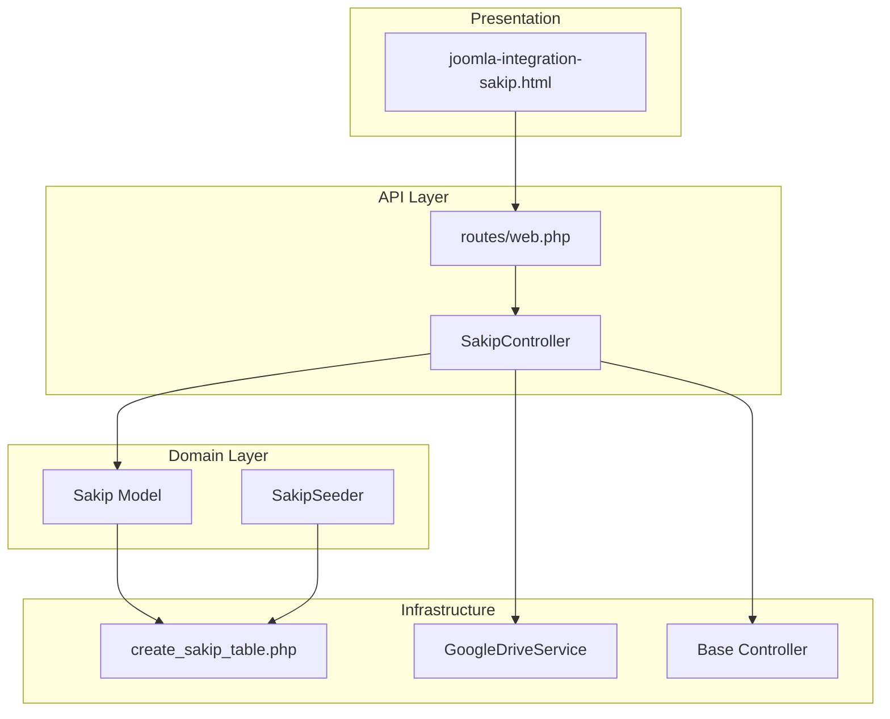
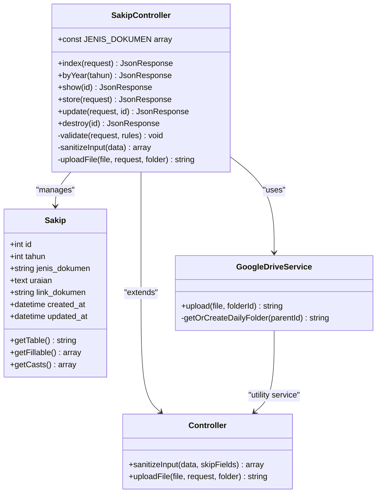
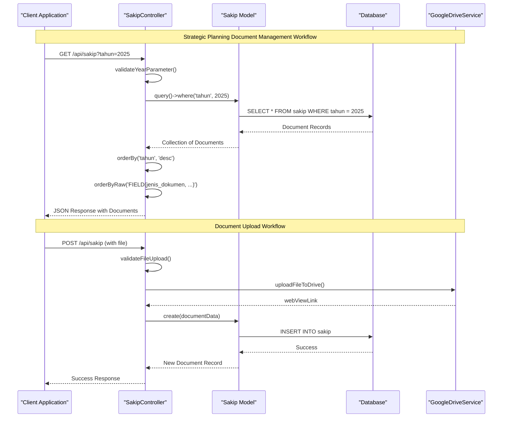
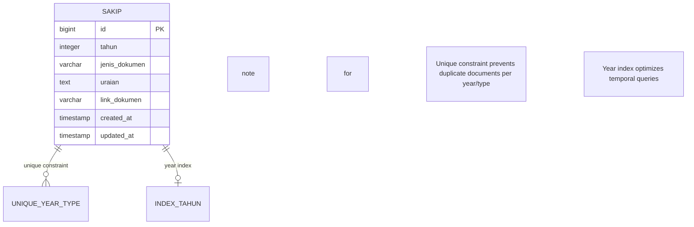
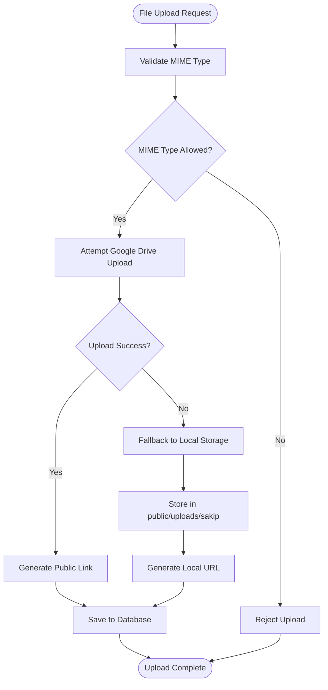
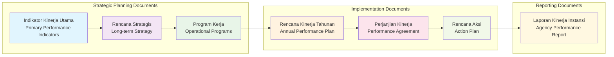
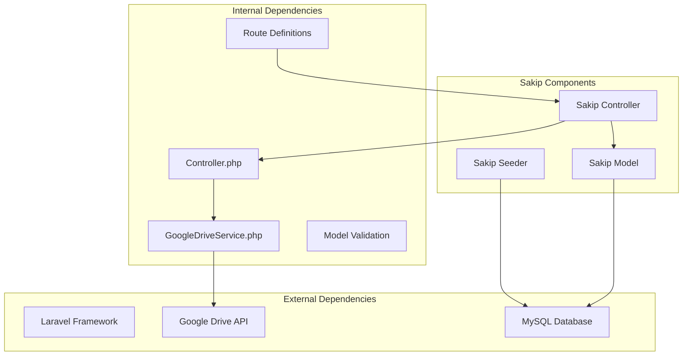

# Strategic Planning Model (Sakip)

<cite>
**Referenced Files in This Document**
- [Sakip.php](file://app/Models/Sakip.php)
- [SakipController.php](file://app/Http/Controllers/SakipController.php)
- [create_sakip_table.php](file://database/migrations/2026_03_31_000001_create_sakip_table.php)
- [SakipSeeder.php](file://database/seeders/SakipSeeder.php)
- [Controller.php](file://app/Http/Controllers/Controller.php)
- [GoogleDriveService.php](file://app/Services/GoogleDriveService.php)
- [web.php](file://routes/web.php)
- [joomla-integration-sakip.html](file://docs/joomla-integration-sakip.html)
</cite>

## Table of Contents
1. [Introduction](#introduction)
2. [Project Structure](#project-structure)
3. [Core Components](#core-components)
4. [Architecture Overview](#architecture-overview)
5. [Detailed Component Analysis](#detailed-component-analysis)
6. [Dependency Analysis](#dependency-analysis)
7. [Performance Considerations](#performance-considerations)
8. [Troubleshooting Guide](#troubleshooting-guide)
9. [Conclusion](#conclusion)
10. [Appendices](#appendices)

## Introduction
This document provides comprehensive documentation for the Strategic Planning Model (Sakip) that manages strategic planning reports and organizational performance tracking. Sakip serves as the System for Government Agency Performance Accountability (SAKIP), integrating planning, budgeting, and performance reporting systems. The model tracks strategic objectives through various planning documents including key performance indicators, strategic plans, work programs, annual performance plans, performance agreements, action plans, and government agency performance reports.

The Sakip system enables organizations to monitor goal achievement through structured documentation of strategic planning workflows, performance measurement frameworks, and progress reporting mechanisms. It establishes clear relationships between strategic goals and operational activities while facilitating milestone tracking and outcome assessment.

## Project Structure
The Sakip implementation follows Laravel/Lumen MVC architecture with clear separation of concerns:

**Diagram sources**
- [web.php:50-53](file://routes/web.php#L50-L53)
- [SakipController.php:9-252](file://app/Http/Controllers/SakipController.php#L9-L252)
- [Sakip.php:7-24](file://app/Models/Sakip.php#L7-L24)

**Section sources**
- [web.php:1-165](file://routes/web.php#L1-L165)
- [SakipController.php:1-252](file://app/Http/Controllers/SakipController.php#L1-L252)

## Core Components
The Sakip system consists of four primary components that work together to manage strategic planning documentation and performance tracking:

### Data Model Architecture
The Sakip model defines the core data structure for strategic planning documents with strict validation and casting mechanisms:

**Diagram sources**
- [Sakip.php:7-24](file://app/Models/Sakip.php#L7-L24)
- [SakipController.php:9-252](file://app/Http/Controllers/SakipController.php#L9-L252)
- [GoogleDriveService.php:9-116](file://app/Services/GoogleDriveService.php#L9-L116)
- [Controller.php:7-97](file://app/Http/Controllers/Controller.php#L7-L97)

### Strategic Document Types
The system manages seven distinct types of strategic planning documents, each serving specific organizational planning purposes:

| Document Type | Purpose | Frequency | Key Features |
|---------------|---------|-----------|--------------|
| **Indikator Kinerja Utama** | Primary performance indicators | Annual | Baseline measurements, targets, monitoring framework |
| **Rencana Strategis** | Long-term strategic direction | 5-year cycle | Vision, mission alignment, strategic priorities |
| **Program Kerja** | Operational program implementation | Annual | Specific initiatives, resource allocation |
| **Rencana Kinerja Tahunan** | Yearly performance planning | Annual | Quantitative targets, timelines, milestones |
| **Perjanjian Kinerja** | Performance agreements | Annual | Individual/team performance commitments |
| **Rencana Aksi** | Action implementation plans | Ongoing | Specific activities, responsible parties |
| **Laporan Kinerja Instansi Pemerintahan** | Performance reporting | Quarterly/Annual | Results documentation, achievements |

**Section sources**
- [SakipController.php:14-22](file://app/Http/Controllers/SakipController.php#L14-L22)
- [SakipSeeder.php:10-195](file://database/seeders/SakipSeeder.php#L10-L195)

## Architecture Overview
The Sakip system implements a layered architecture with clear separation between presentation, business logic, and data persistence:

**Diagram sources**
- [SakipController.php:34-56](file://app/Http/Controllers/SakipController.php#L34-L56)
- [SakipController.php:111-154](file://app/Http/Controllers/SakipController.php#L111-L154)
- [GoogleDriveService.php:38-82](file://app/Services/GoogleDriveService.php#L38-L82)

The architecture ensures robust document management with automatic file upload capabilities, comprehensive validation, and flexible querying mechanisms.

**Section sources**
- [SakipController.php:1-252](file://app/Http/Controllers/SakipController.php#L1-L252)
- [Controller.php:40-95](file://app/Http/Controllers/Controller.php#L40-L95)

## Detailed Component Analysis

### Data Model Implementation
The Sakip model provides a comprehensive foundation for strategic planning document storage with strict data validation and type casting:

#### Core Attributes and Validation
The model enforces data integrity through comprehensive validation rules and type casting:

| Attribute | Type | Validation | Purpose |
|-----------|------|------------|---------|
| `tahun` | Integer | 2000-2100 range | Fiscal year identification |
| `jenis_dokumen` | String | Enum validation | Document classification |
| `uraian` | Text | Nullable string | Document description |
| `link_dokumen` | String | Nullable URL | Document accessibility |

#### Database Schema Design
The migration creates an optimized schema with appropriate indexing for performance:

**Diagram sources**
- [create_sakip_table.php:11-21](file://database/migrations/2026_03_31_000001_create_sakip_table.php#L11-L21)

**Section sources**
- [Sakip.php:11-22](file://app/Models/Sakip.php#L11-L22)
- [create_sakip_table.php:9-28](file://database/migrations/2026_03_31_000001_create_sakip_table.php#L9-L28)

### Controller Business Logic
The SakipController implements comprehensive CRUD operations with advanced validation and file management capabilities:

#### API Endpoints and Access Control
The controller exposes both public and protected endpoints with appropriate middleware:

| Endpoint | Method | Access | Description |
|----------|--------|--------|-------------|
| `/api/sakip` | GET | Public | Retrieve all documents with filtering |
| `/api/sakip/{id}` | GET | Public | Fetch specific document |
| `/api/sakip/tahun/{tahun}` | GET | Public | Filter by fiscal year |
| `/api/sakip` | POST | Protected | Create new document |
| `/api/sakip/{id}` | PUT | Protected | Update existing document |
| `/api/sakip/{id}` | DELETE | Protected | Remove document |

#### File Upload and Storage Management
The system provides dual storage capabilities with automatic fallback:

**Diagram sources**
- [Controller.php:40-95](file://app/Http/Controllers/Controller.php#L40-L95)
- [GoogleDriveService.php:38-82](file://app/Services/GoogleDriveService.php#L38-L82)

**Section sources**
- [SakipController.php:50-56](file://app/Http/Controllers/SakipController.php#L50-L56)
- [SakipController.php:111-154](file://app/Http/Controllers/SakipController.php#L111-L154)
- [Controller.php:40-95](file://app/Http/Controllers/Controller.php#L40-L95)

### Performance Monitoring Framework
The system implements sophisticated performance tracking through structured document relationships and standardized reporting mechanisms:

#### Strategic Objective Tracking
The framework enables comprehensive tracking of strategic objectives through document categorization:

**Diagram sources**
- [SakipController.php:14-22](file://app/Http/Controllers/SakipController.php#L14-L22)
- [SakipSeeder.php:10-195](file://database/seeders/SakipSeeder.php#L10-L195)

#### Progress Reporting Mechanisms
The system facilitates progress monitoring through standardized document workflows and automated validation:

**Section sources**
- [SakipSeeder.php:10-195](file://database/seeders/SakipSeeder.php#L10-L195)
- [joomla-integration-sakip.html:186-279](file://docs/joomla-integration-sakip.html#L186-L279)

## Dependency Analysis
The Sakip system exhibits clean architectural dependencies with minimal coupling between components:

**Diagram sources**
- [SakipController.php:5](file://app/Http/Controllers/SakipController.php#L5)
- [GoogleDriveService.php:5](file://app/Services/GoogleDriveService.php#L5)
- [web.php:50-53](file://routes/web.php#L50-L53)

### Component Coupling Analysis
The system demonstrates excellent cohesion within components while maintaining loose coupling between modules:

- **High Cohesion**: Each component focuses on a specific responsibility
- **Low Coupling**: Minimal inter-component dependencies
- **Clear Interfaces**: Well-defined API boundaries
- **Single Responsibility**: Each component handles one primary concern

**Section sources**
- [Sakip.php:1-24](file://app/Models/Sakip.php#L1-L24)
- [SakipController.php:1-252](file://app/Http/Controllers/SakipController.php#L1-L252)

## Performance Considerations
The Sakip system incorporates several performance optimization strategies:

### Database Optimization
- **Unique Constraints**: Prevents duplicate entries and maintains data integrity
- **Indexing Strategy**: Year column indexed for efficient temporal queries
- **Optimized Queries**: Uses FIELD() ordering for consistent document presentation

### File Storage Efficiency
- **Automatic Cleanup**: Daily folder organization prevents storage accumulation
- **Fallback Mechanism**: Local storage ensures system reliability
- **Security Validation**: MIME type verification prevents malicious uploads

### API Response Optimization
- **Selective Field Loading**: Only required fields are retrieved
- **Pagination Support**: Large datasets handled efficiently
- **Caching Opportunities**: Response caching potential for static content

## Troubleshooting Guide

### Common Issues and Solutions

#### Document Upload Failures
**Problem**: File uploads failing to Google Drive
**Solution**: Check Google Drive API credentials and permissions
**Prevention**: Monitor upload logs and implement retry mechanisms

#### Duplicate Document Entries
**Problem**: Attempting to create duplicate year/document combinations
**Solution**: System automatically validates unique constraints
**Prevention**: Implement proper client-side validation

#### Performance Issues
**Problem**: Slow query responses for large datasets
**Solution**: Optimize database indexes and implement pagination
**Prevention**: Monitor query execution times and optimize frequently accessed endpoints

#### File Security Concerns
**Problem**: Malicious file uploads
**Solution**: MIME type validation and content verification
**Prevention**: Regular security audits and updated validation rules

**Section sources**
- [Controller.php:62-95](file://app/Http/Controllers/Controller.php#L62-L95)
- [SakipController.php:128-137](file://app/Http/Controllers/SakipController.php#L128-L137)

## Conclusion
The Sakip system provides a robust foundation for strategic planning and performance tracking within government agencies. Its comprehensive architecture supports the full lifecycle of strategic planning documents from creation to reporting, with built-in validation, security measures, and flexible storage options.

The system successfully integrates planning, budgeting, and performance reporting through standardized document types and workflows. The modular design ensures maintainability while the dual storage approach guarantees reliability and accessibility of strategic planning resources.

Key strengths include comprehensive validation mechanisms, secure file handling, optimized database design, and clear separation of concerns. The system provides excellent extensibility for future enhancements while maintaining backward compatibility with existing strategic planning processes.

## Appendices

### API Reference
The Sakip API provides comprehensive endpoints for strategic planning document management with clear request/response formats and validation rules.

### Integration Guidelines
The system supports seamless integration with external platforms through standardized APIs and document sharing mechanisms.

### Best Practices
- Implement proper input validation at all levels
- Monitor file upload security and storage limits
- Regular database maintenance and optimization
- Implement comprehensive logging for audit trails