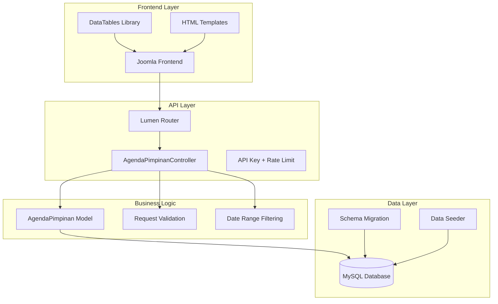
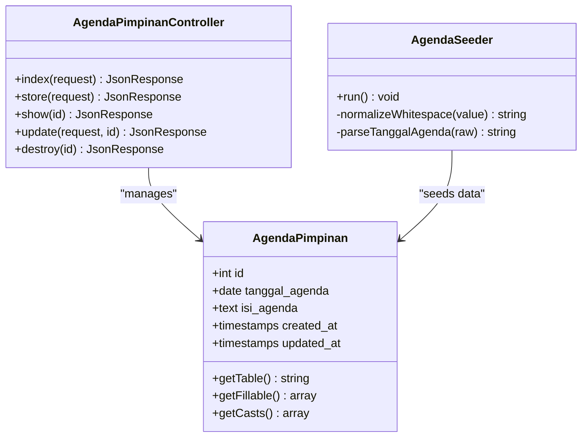
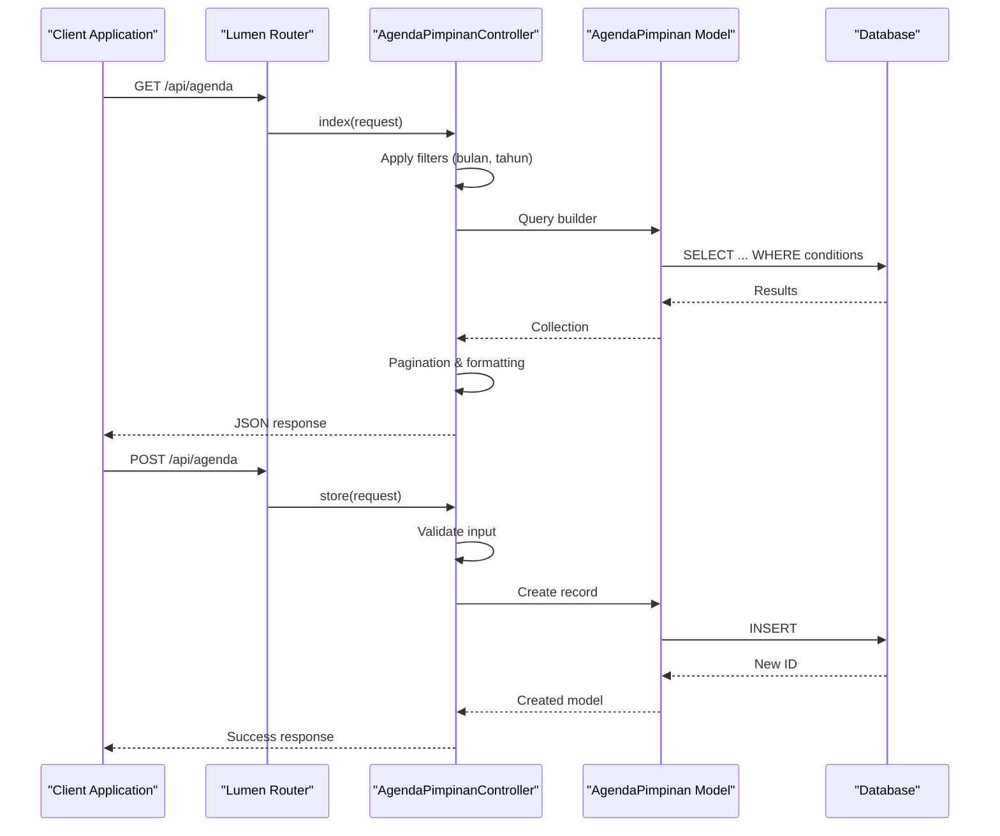
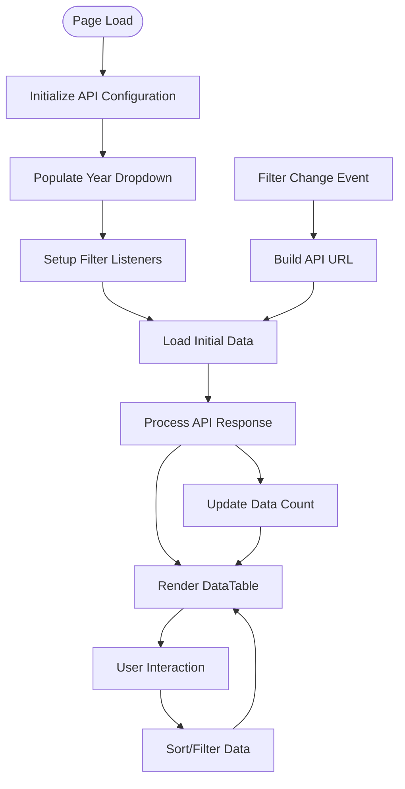
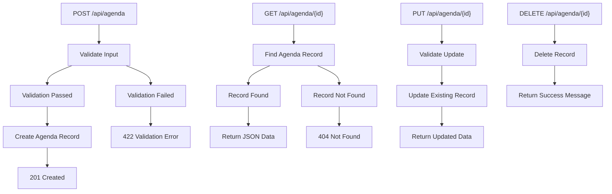
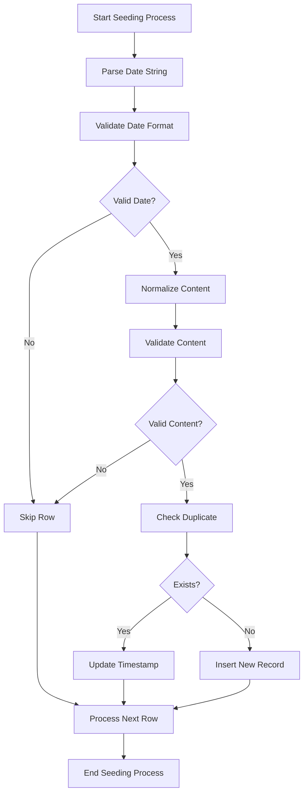
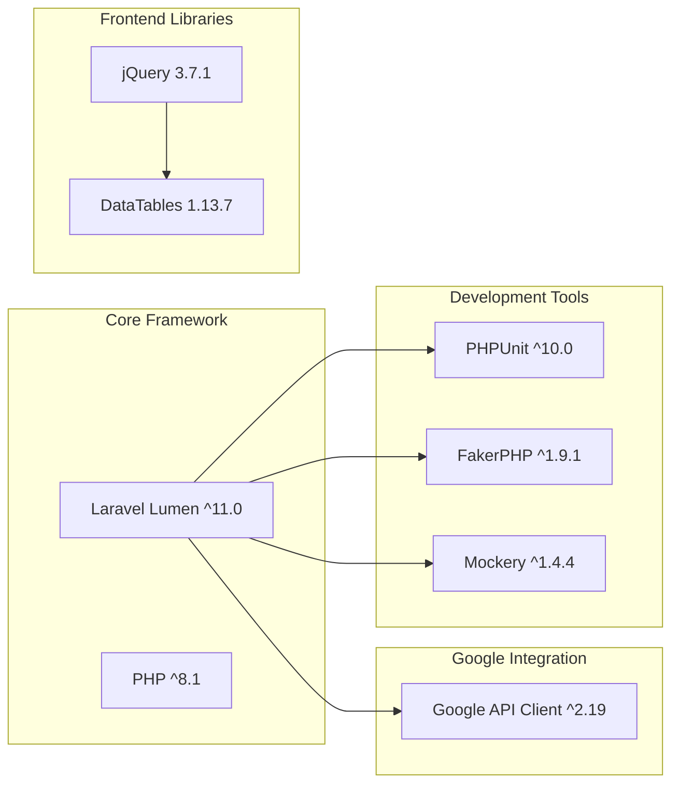
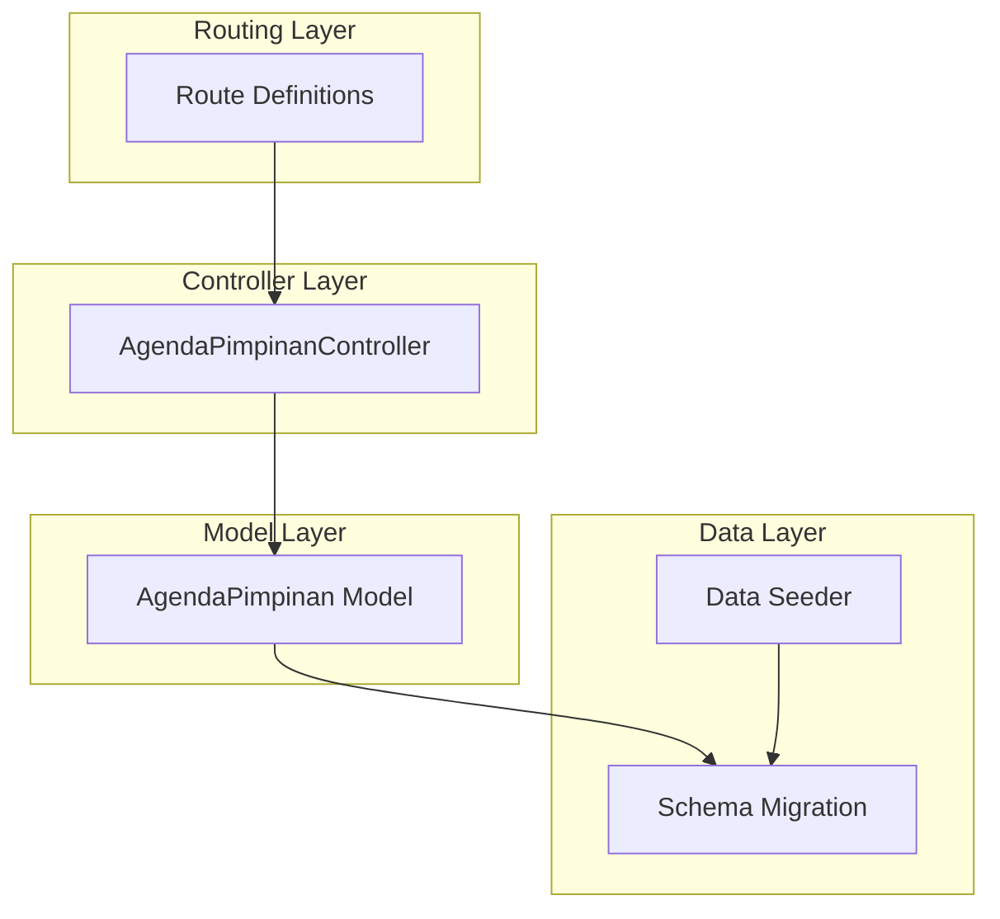

# Agenda Pimpinan Model

<cite>
**Referenced Files in This Document**
- [AgendaPimpinan.php](file://app/Models/AgendaPimpinan.php)
- [2026_01_26_000000_create_agenda_pimpinan_table.php](file://database/migrations/2026_01_26_000000_create_agenda_pimpinan_table.php)
- [AgendaPimpinanController.php](file://app/Http/Controllers/AgendaPimpinanController.php)
- [AgendaSeeder.php](file://database/seeders/AgendaSeeder.php)
- [web.php](file://routes/web.php)
- [joomla-integration-agenda-pimpinan.html](file://docs/joomla-integration-agenda-pimpinan.html)
- [composer.json](file://composer.json)
</cite>

## Table of Contents
1. [Introduction](#introduction)
2. [Project Structure](#project-structure)
3. [Core Components](#core-components)
4. [Architecture Overview](#architecture-overview)
5. [Detailed Component Analysis](#detailed-component-analysis)
6. [Dependency Analysis](#dependency-analysis)
7. [Performance Considerations](#performance-considerations)
8. [Troubleshooting Guide](#troubleshooting-guide)
9. [Conclusion](#conclusion)

## Introduction
The Agenda Pimpinan model manages leadership schedules and administrative meeting planning for Pengadilan Agama Penajam (Penajam Religious Court). This system captures daily leadership activities, administrative meetings, and official events, serving as a centralized repository for court leadership coordination and public transparency. The model integrates with leadership calendars, meeting room reservations, and administrative workflow automation to streamline court operations.

The system supports filtering by date ranges, pagination, and provides both API endpoints and frontend integration for public access to leadership schedules.

## Project Structure
The Agenda Pimpinan implementation follows Laravel/Lumen MVC architecture with clear separation of concerns:

**Diagram sources**
- [web.php:29-31](file://routes/web.php#L29-L31)
- [AgendaPimpinanController.php:17-58](file://app/Http/Controllers/AgendaPimpinanController.php#L17-L58)
- [AgendaPimpinan.php:7-34](file://app/Models/AgendaPimpinan.php#L7-L34)

**Section sources**
- [web.php:1-165](file://routes/web.php#L1-L165)
- [composer.json:1-47](file://composer.json#L1-L47)

## Core Components

### Model Definition
The AgendaPimpinan model serves as the primary data structure for storing leadership schedule information:

**Diagram sources**
- [AgendaPimpinan.php:7-34](file://app/Models/AgendaPimpinan.php#L7-L34)
- [AgendaPimpinanController.php:9-164](file://app/Http/Controllers/AgendaPimpinanController.php#L9-L164)
- [AgendaSeeder.php:9-887](file://database/seeders/AgendaSeeder.php#L9-L887)

### Database Schema
The underlying database structure provides robust support for leadership scheduling:

| Field | Type | Description | Constraints |
|-------|------|-------------|-------------|
| `id` | bigint unsigned | Primary key | Auto-increment |
| `tanggal_agenda` | date | Agenda date | Required, indexed |
| `isi_agenda` | text | Agenda content/description | Required |
| `created_at` | timestamp | Creation timestamp | Nullable |
| `updated_at` | timestamp | Last update timestamp | Nullable |

**Section sources**
- [2026_01_26_000000_create_agenda_pimpinan_table.php:13-18](file://database/migrations/2026_01_26_000000_create_agenda_pimpinan_table.php#L13-L18)
- [AgendaPimpinan.php:21-33](file://app/Models/AgendaPimpinan.php#L21-L33)

## Architecture Overview

### API Integration Flow
The system provides comprehensive API endpoints for agenda management:

**Diagram sources**
- [web.php:29-31](file://routes/web.php#L29-L31)
- [AgendaPimpinanController.php:17-87](file://app/Http/Controllers/AgendaPimpinanController.php#L17-L87)

### Frontend Integration Architecture
The system integrates seamlessly with Joomla frontend through AJAX calls:

**Diagram sources**
- [joomla-integration-agenda-pimpinan.html:174-310](file://docs/joomla-integration-agenda-pimpinan.html#L174-L310)

**Section sources**
- [joomla-integration-agenda-pimpinan.html:1-310](file://docs/joomla-integration-agenda-pimpinan.html#L1-L310)

## Detailed Component Analysis

### Model Implementation Details

#### Data Structure and Casting
The model implements precise data typing for optimal performance and data integrity:

- **Mass Assignment Protection**: Only `tanggal_agenda` and `isi_agenda` fields are mass assignable
- **Date Casting**: `tanggal_agenda` automatically casts to PHP DateTime objects
- **Timestamp Management**: Automatic `created_at` and `updated_at` handling

#### Validation Rules
The controller enforces strict validation for data integrity:

| Field | Validation Rule | Purpose |
|-------|----------------|---------|
| `tanggal_agenda` | `required|date` | Ensures valid date format |
| `isi_agenda` | `required|string` | Validates content presence and type |

**Section sources**
- [AgendaPimpinan.php:21-33](file://app/Models/AgendaPimpinan.php#L21-L33)
- [AgendaPimpinanController.php:68-78](file://app/Http/Controllers/AgendaPimpinanController.php#L68-L78)

### Controller Operations

#### CRUD Operations
The controller provides comprehensive CRUD functionality:

**Diagram sources**
- [AgendaPimpinanController.php:66-162](file://app/Http/Controllers/AgendaPimpinanController.php#L66-L162)

#### Advanced Filtering Capabilities
The index method supports sophisticated filtering:

- **Monthly Filtering**: Filter by specific month (01-12)
- **Yearly Filtering**: Filter by calendar year
- **Pagination Control**: Configurable page sizes with `per_page` parameter
- **Default Sorting**: Latest dates first for chronological organization

**Section sources**
- [AgendaPimpinanController.php:17-58](file://app/Http/Controllers/AgendaPimpinanController.php#L17-L58)

### Data Seeding and Normalization

#### Automated Data Processing
The AgendaSeeder implements intelligent data normalization:

**Diagram sources**
- [AgendaSeeder.php:63-887](file://database/seeders/AgendaSeeder.php#L63-L887)

#### Content Processing Features
- **Date Parsing**: Converts Indonesian month names to numeric format
- **Whitespace Normalization**: Removes extra spaces and line breaks
- **Duplicate Detection**: Prevents data redundancy during seeding
- **Error Handling**: Graceful skipping of invalid records

**Section sources**
- [AgendaSeeder.php:11-61](file://database/seeders/AgendaSeeder.php#L11-L61)
- [AgendaSeeder.php:849-887](file://database/seeders/AgendaSeeder.php#L849-L887)

### Frontend Integration Components

#### Dynamic Filtering System
The frontend implementation provides sophisticated user interaction:

- **Year Selection**: Dynamic dropdown populated from 2024 to current year
- **Month Filtering**: Optional monthly refinement
- **Real-time Updates**: AJAX-based data refresh on filter changes
- **Responsive Design**: Mobile-friendly table layout

#### Data Presentation
- **Formatted Dates**: Localized Indonesian date display
- **Day Badges**: Visual day indicators for better readability
- **Pagination Controls**: Configurable page sizes (10, 25, 50, All)
- **Search Functionality**: Integrated DataTables search capabilities

**Section sources**
- [joomla-integration-agenda-pimpinan.html:130-168](file://docs/joomla-integration-agenda-pimpinan.html#L130-L168)
- [joomla-integration-agenda-pimpinan.html:225-293](file://docs/joomla-integration-agenda-pimpinan.html#L225-L293)

## Dependency Analysis

### External Dependencies
The project relies on several key external libraries:

**Diagram sources**
- [composer.json:11-21](file://composer.json#L11-L21)

### Internal Component Dependencies
The system exhibits clean architectural separation:

**Diagram sources**
- [web.php:29-102](file://routes/web.php#L29-L102)
- [AgendaPimpinanController.php:5-7](file://app/Http/Controllers/AgendaPimpinanController.php#L5-L7)

**Section sources**
- [composer.json:22-33](file://composer.json#L22-L33)

## Performance Considerations

### Database Optimization
- **Indexing Strategy**: Date field indexing for efficient filtering operations
- **Pagination Implementation**: Server-side pagination prevents memory issues with large datasets
- **Query Optimization**: Selective field retrieval reduces bandwidth usage

### API Performance
- **Rate Limiting**: 100 requests per minute protects against abuse
- **Caching Opportunities**: Potential for Redis caching of frequently accessed agendas
- **Response Optimization**: Minimal payload structure reduces response times

### Frontend Performance
- **AJAX Loading**: Dynamic content loading improves initial page load times
- **Client-side Filtering**: Reduces server load through client-side DataTables processing
- **Responsive Design**: Optimized for mobile devices reduces bandwidth usage

## Troubleshooting Guide

### Common Issues and Solutions

#### API Request Validation Errors
**Problem**: Validation errors when creating/updating agendas
**Solution**: Ensure `tanggal_agenda` is a valid date and `isi_agenda` is present and non-empty

#### Data Import Failures
**Problem**: AgendaSeeder skips records during data import
**Solution**: Verify date format follows "DD Month YYYY" pattern and content is not empty

#### Frontend Display Issues
**Problem**: Agenda table shows incorrect data or fails to load
**Solution**: Check API endpoint accessibility and verify filter parameters are correctly formatted

#### Performance Degradation
**Problem**: Slow response times with large datasets
**Solution**: Use pagination parameters and apply appropriate date filters

**Section sources**
- [AgendaPimpinanController.php:73-78](file://app/Http/Controllers/AgendaPimpinanController.php#L73-L78)
- [AgendaSeeder.php:853-863](file://database/seeders/AgendaSeeder.php#L853-L863)

## Conclusion

The Agenda Pimpinan model provides a robust foundation for court leadership scheduling and administrative coordination. Its clean architecture, comprehensive validation, and flexible filtering capabilities make it suitable for both internal administrative use and public transparency initiatives.

The system successfully integrates frontend and backend components, providing a seamless experience for both administrators and the public. The modular design allows for easy extension to support additional features such as participant tracking, meeting room reservations, and leadership calendar synchronization.

Key strengths include:
- **Data Integrity**: Strict validation and normalization ensure reliable data quality
- **Scalability**: Efficient database design and pagination support growth
- **Usability**: Comprehensive filtering and responsive frontend design
- **Maintainability**: Clean separation of concerns and well-documented code structure

Future enhancements could include participant management integration, meeting room booking systems, and automated workflow notifications to further streamline court administrative processes.