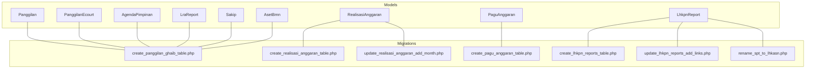
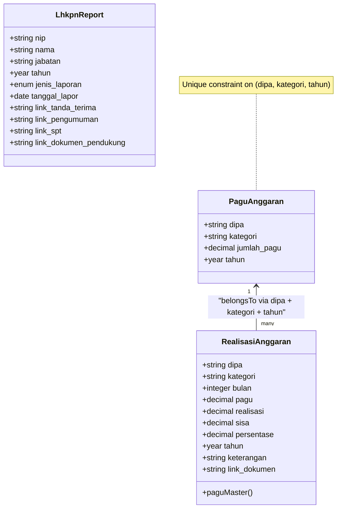
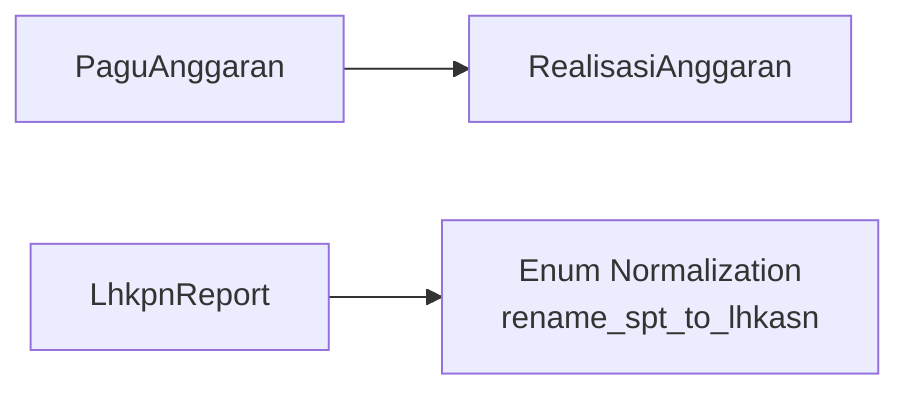

# Core Models

<cite>
**Referenced Files in This Document**
- [Panggilan.php](file://app/Models/Panggilan.php)
- [RealisasiAnggaran.php](file://app/Models/RealisasiAnggaran.php)
- [LhkpnReport.php](file://app/Models/LhkpnReport.php)
- [PaguAnggaran.php](file://app/Models/PaguAnggaran.php)
- [PanggilanEcourt.php](file://app/Models/PanggilanEcourt.php)
- [AgendaPimpinan.php](file://app/Models/AgendaPimpinan.php)
- [LraReport.php](file://app/Models/LraReport.php)
- [Sakip.php](file://app/Models/Sakip.php)
- [AsetBmn.php](file://app/Models/AsetBmn.php)
- [create_panggilan_ghaib_table.php](file://database/migrations/2026_01_21_000001_create_panggilan_ghaib_table.php)
- [create_realisasi_anggaran_table.php](file://database/migrations/2026_02_10_000000_create_realisasi_anggaran_table.php)
- [update_realisasi_anggaran_add_month.php](file://database/migrations/2026_02_10_000001_update_realisasi_anggaran_add_month.php)
- [create_pagu_anggaran_table.php](file://database/migrations/2026_02_10_000002_create_pagu_anggaran_table.php)
- [create_lhkpn_reports_table.php](file://database/migrations/2026_02_02_162040_create_lhkpn_reports_table.php)
- [update_lhkpn_reports_add_links.php](file://database/migrations/2026_02_10_000003_update_lhkpn_reports_add_links.php)
- [rename_spt_to_lhkasn.php](file://database/migrations/2026_02_10_000004_rename_spt_to_lhkasn.php)
</cite>

## Table of Contents
1. [Introduction](#introduction)
2. [Project Structure](#project-structure)
3. [Core Components](#core-components)
4. [Architecture Overview](#architecture-overview)
5. [Detailed Component Analysis](#detailed-component-analysis)
6. [Dependency Analysis](#dependency-analysis)
7. [Performance Considerations](#performance-considerations)
8. [Troubleshooting Guide](#troubleshooting-guide)
9. [Conclusion](#conclusion)

## Introduction
This document describes the core data models that represent primary business entities in the system. It focuses on:
- Panggilan (primary case management for absent parties)
- RealisasiAnggaran (budget execution tracking)
- LhkpnReport (asset declarations)
- Supporting models such as PaguAnggaran, PanggilanEcourt, AgendaPimpinan, LraReport, Sakip, and AsetBmn

For each model, we document field definitions, data types, validation rules, business logic, Eloquent relationships, scopes and query builders, lifecycle hooks, attribute casting, serialization patterns, polymorphic relationships, shared behaviors, common queries, data transformations, and performance considerations.

## Project Structure
The models are located under app/Models and correspond to Laravel migration files under database/migrations. Each migration defines the database schema and indexes for the respective model.

**Diagram sources**
- [Panggilan.php:1-55](file://app/Models/Panggilan.php#L1-L55)
- [RealisasiAnggaran.php:1-46](file://app/Models/RealisasiAnggaran.php#L1-L46)
- [PaguAnggaran.php:1-30](file://app/Models/PaguAnggaran.php#L1-L30)
- [LhkpnReport.php:1-28](file://app/Models/LhkpnReport.php#L1-L28)
- [PanggilanEcourt.php:1-33](file://app/Models/PanggilanEcourt.php#L1-L33)
- [AgendaPimpinan.php:1-35](file://app/Models/AgendaPimpinan.php#L1-L35)
- [LraReport.php:1-24](file://app/Models/LraReport.php#L1-L24)
- [Sakip.php:1-24](file://app/Models/Sakip.php#L1-L24)
- [AsetBmn.php:1-21](file://app/Models/AsetBmn.php#L1-L21)
- [create_panggilan_ghaib_table.php:1-42](file://database/migrations/2026_01_21_000001_create_panggilan_ghaib_table.php#L1-L42)
- [create_realisasi_anggaran_table.php:1-36](file://database/migrations/2026_02_10_000000_create_realisasi_anggaran_table.php#L1-L36)
- [update_realisasi_anggaran_add_month.php:1-30](file://database/migrations/2026_02_10_000001_update_realisasi_anggaran_add_month.php#L1-L30)
- [create_pagu_anggaran_table.php:1-33](file://database/migrations/2026_02_10_000002_create_pagu_anggaran_table.php#L1-L33)
- [create_lhkpn_reports_table.php:1-36](file://database/migrations/2026_02_02_162040_create_lhkpn_reports_table.php#L1-L36)
- [update_lhkpn_reports_add_links.php:1-30](file://database/migrations/2026_02_10_000003_update_lhkpn_reports_add_links.php#L1-L30)
- [rename_spt_to_lhkasn.php:1-31](file://database/migrations/2026_02_10_000004_rename_spt_to_lhkasn.php#L1-L31)

**Section sources**
- [Panggilan.php:1-55](file://app/Models/Panggilan.php#L1-L55)
- [RealisasiAnggaran.php:1-46](file://app/Models/RealisasiAnggaran.php#L1-L46)
- [LhkpnReport.php:1-28](file://app/Models/LhkpnReport.php#L1-L28)
- [PaguAnggaran.php:1-30](file://app/Models/PaguAnggaran.php#L1-L30)
- [PanggilanEcourt.php:1-33](file://app/Models/PanggilanEcourt.php#L1-L33)
- [AgendaPimpinan.php:1-35](file://app/Models/AgendaPimpinan.php#L1-L35)
- [LraReport.php:1-24](file://app/Models/LraReport.php#L1-L24)
- [Sakip.php:1-24](file://app/Models/Sakip.php#L1-L24)
- [AsetBmn.php:1-21](file://app/Models/AsetBmn.php#L1-L21)
- [create_panggilan_ghaib_table.php:1-42](file://database/migrations/2026_01_21_000001_create_panggilan_ghaib_table.php#L1-L42)
- [create_realisasi_anggaran_table.php:1-36](file://database/migrations/2026_02_10_000000_create_realisasi_anggaran_table.php#L1-L36)
- [update_realisasi_anggaran_add_month.php:1-30](file://database/migrations/2026_02_10_000001_update_realisasi_anggaran_add_month.php#L1-L30)
- [create_pagu_anggaran_table.php:1-33](file://database/migrations/2026_02_10_000002_create_pagu_anggaran_table.php#L1-L33)
- [create_lhkpn_reports_table.php:1-36](file://database/migrations/2026_02_02_162040_create_lhkpn_reports_table.php#L1-L36)
- [update_lhkpn_reports_add_links.php:1-30](file://database/migrations/2026_02_10_000003_update_lhkpn_reports_add_links.php#L1-L30)
- [rename_spt_to_lhkasn.php:1-31](file://database/migrations/2026_02_10_000004_rename_spt_to_lhkasn.php#L1-L31)

## Core Components
This section summarizes the primary models and their roles in the system.

- Panggilan: Case management for absent parties with multiple call dates, court session date, and optional documents.
- RealisasiAnggaran: Tracks budget execution per DIPA, category, month, and year, linked to PaguAnggaran via composite keys.
- PaguAnggaran: Master budget records per DIPA and category per year with unique constraint.
- LhkpnReport: Asset declaration records with links to supporting documents and report types.
- Supporting models: PanggilanEcourt, AgendaPimpinan, LraReport, Sakip, AsetBmn for related administrative and reporting needs.

**Section sources**
- [Panggilan.php:1-55](file://app/Models/Panggilan.php#L1-L55)
- [RealisasiAnggaran.php:1-46](file://app/Models/RealisasiAnggaran.php#L1-L46)
- [PaguAnggaran.php:1-30](file://app/Models/PaguAnggaran.php#L1-L30)
- [LhkpnReport.php:1-28](file://app/Models/LhkpnReport.php#L1-L28)
- [PanggilanEcourt.php:1-33](file://app/Models/PanggilanEcourt.php#L1-L33)
- [AgendaPimpinan.php:1-35](file://app/Models/AgendaPimpinan.php#L1-L35)
- [LraReport.php:1-24](file://app/Models/LraReport.php#L1-L24)
- [Sakip.php:1-24](file://app/Models/Sakip.php#L1-L24)
- [AsetBmn.php:1-21](file://app/Models/AsetBmn.php#L1-L21)

## Architecture Overview
The models form a cohesive domain layer with explicit relationships and constraints. RealisasiAnggaran references PaguAnggaran through a composite foreign key relationship, ensuring budget tracking aligns with master budgets. LhkpnReport supports multiple document links and standardized report types. Panggilan and related models capture procedural and administrative events.

**Diagram sources**
- [PaguAnggaran.php:1-30](file://app/Models/PaguAnggaran.php#L1-L30)
- [RealisasiAnggaran.php:1-46](file://app/Models/RealisasiAnggaran.php#L1-L46)
- [create_pagu_anggaran_table.php:1-33](file://database/migrations/2026_02_10_000002_create_pagu_anggaran_table.php#L1-L33)
- [create_realisasi_anggaran_table.php:1-36](file://database/migrations/2026_02_10_000000_create_realisasi_anggaran_table.php#L1-L36)
- [update_realisasi_anggaran_add_month.php:1-30](file://database/migrations/2026_02_10_000001_update_realisasi_anggaran_add_month.php#L1-L30)

## Detailed Component Analysis

### Panggilan (Case Management)
- Purpose: Manage absent-party case data including multiple call dates, court session date, and procedural links.
- Table: panggilan_ghaib
- Fillable fields: year, case number, name, origin address, call dates, session date, PIP, letter link, and remarks.
- Attribute casting: call dates and session date as date; timestamps as datetime.
- Computed accessors: normalized date outputs for call dates and session date.
- Indexes: year and case number indexed for fast filtering.
- Validation rules: enforced at controller level; typical constraints include non-empty case number, valid date ranges, and optional links.
- Business logic: supports case tracking across multiple stages; optional fields accommodate missing data.
- Lifecycle hooks: none defined; rely on timestamps managed by Eloquent.
- Serialization: defaults to array; accessors ensure consistent date formatting.
- Relationships: no foreign keys in current model; can be extended to link to related entities (e.g., case metadata).
- Polymorphic relationships: not used here; can be introduced later for shared behaviors.
- Common queries:
  - Filter by year and case number.
  - Sort by session date or latest update.
- Data transformations: date accessor normalization ensures consistent output format.
- Performance considerations: index on case number and year improves search performance.

**Section sources**
- [Panggilan.php:1-55](file://app/Models/Panggilan.php#L1-L55)
- [create_panggilan_ghaib_table.php:1-42](file://database/migrations/2026_01_21_000001_create_panggilan_ghaib_table.php#L1-L42)

### RealisasiAnggaran (Budget Execution Tracking)
- Purpose: Track monthly budget execution against master pagu per DIPA and category.
- Table: realisasi_anggaran
- Fillable fields: DIPA, category, month, pagu, realisasi, sisa, persentase, tahun, keterangan, link_dokumen.
- Attribute casting: numeric fields as floats; year and month as integers.
- Relationship: belongsTo PaguAnggaran via composite keys (dipa, kategori, tahun).
- Validation rules: ensure numeric values are non-negative; month within 1–12; unique combination per period.
- Business logic: computes remaining balance and percentage based on pagu and realisasi.
- Lifecycle hooks: none defined; calculations can be centralized in accessors or observers.
- Serialization: defaults to array; numeric casts ensure consistent representation.
- Polymorphic relationships: not used; belongsTo relationship is straightforward.
- Common queries:
  - Monthly summary per DIPA and category.
  - Yearly totals grouped by category.
  - Trend analysis across months.
- Data transformations: numeric casting ensures precision; computed fields can be exposed via accessors.
- Performance considerations: index on dipa and additional composite indexes on (dipa, tahun, kategori) can improve join performance.

**Section sources**
- [RealisasiAnggaran.php:1-46](file://app/Models/RealisasiAnggaran.php#L1-L46)
- [create_realisasi_anggaran_table.php:1-36](file://database/migrations/2026_02_10_000000_create_realisasi_anggaran_table.php#L1-L36)
- [update_realisasi_anggaran_add_month.php:1-30](file://database/migrations/2026_02_10_000001_update_realisasi_anggaran_add_month.php#L1-L30)
- [PaguAnggaran.php:1-30](file://app/Models/PaguAnggaran.php#L1-L30)
- [create_pagu_anggaran_table.php:1-33](file://database/migrations/2026_02_10_000002_create_pagu_anggaran_table.php#L1-L33)

### PaguAnggaran (Master Budget)
- Purpose: Store approved budget amounts per DIPA, category, and year.
- Table: pagu_anggaran
- Fillable fields: DIPA, category, jumlah_pagu, tahun.
- Attribute casting: jumlah_pagu as decimal with 2 decimals; tahun as integer.
- Mutators/accessors: jumlah_pagu stored as string to prevent overflow; returned as float for calculations.
- Unique constraint: (dipa, kategori, tahun) ensures single budget per category per year per DIPA.
- Validation rules: non-empty DIPA and category; positive jumlah_pagu; unique constraint enforced at persistence layer.
- Business logic: serves as the authoritative budget source for RealisasiAnggaran.
- Lifecycle hooks: none defined; integrity ensured via schema and mutator.
- Serialization: numeric fields serialized as numbers; string storage avoids precision loss.
- Polymorphic relationships: not used; standalone master record.
- Common queries:
  - Lookup pagu by DIPA and category for a given year.
  - Cross-year comparison per DIPA and category.
- Data transformations: mutator/accessor pair ensures safe numeric handling.
- Performance considerations: unique index on (dipa, kategori, tahun) supports fast lookups.

**Section sources**
- [PaguAnggaran.php:1-30](file://app/Models/PaguAnggaran.php#L1-L30)
- [create_pagu_anggaran_table.php:1-33](file://database/migrations/2026_02_10_000002_create_pagu_anggaran_table.php#L1-L33)

### LhkpnReport (Asset Declarations)
- Purpose: Record asset declaration reports with supporting document links.
- Table: lhkpn_reports
- Fillable fields: NIP, name, position, tahun, jenis_laporan, tanggal_lapor, and multiple document links.
- Attribute casting: tahun as integer; tanggal_lapor as date.
- Enum type: jenis_laporan restricted to predefined values; migration updates enum to standardize report types.
- Validation rules: enforce enum membership; ensure valid dates and optional URLs.
- Business logic: tracks submission date and maintains links to official receipts, announcements, and supporting documents.
- Lifecycle hooks: none defined; relies on timestamps.
- Serialization: defaults to array; enum values persisted as strings.
- Polymorphic relationships: not used; straightforward record model.
- Common queries:
  - List submissions per year and report type.
  - Search by NIP and report type.
- Data transformations: enum normalization ensures consistent values across migrations.
- Performance considerations: index on NIP improves lookup performance.

**Section sources**
- [LhkpnReport.php:1-28](file://app/Models/LhkpnReport.php#L1-L28)
- [create_lhkpn_reports_table.php:1-36](file://database/migrations/2026_02_02_162040_create_lhkpn_reports_table.php#L1-L36)
- [update_lhkpn_reports_add_links.php:1-30](file://database/migrations/2026_02_10_000003_update_lhkpn_reports_add_links.php#L1-L30)
- [rename_spt_to_lhkasn.php:1-31](file://database/migrations/2026_02_10_000004_rename_spt_to_lhkasn.php#L1-L31)

### Supporting Models

#### PanggilanEcourt
- Purpose: Extended absent-party call tracking with additional call stage.
- Fields: similar to Panggilan with an extra call date and consistent casting.
- Indexes: none defined; consider adding indexes for frequent filters.

**Section sources**
- [PanggilanEcourt.php:1-33](file://app/Models/PanggilanEcourt.php#L1-L33)

#### AgendaPimpinan
- Purpose: Executive agenda entries with date-cast field.
- Indexes: none defined; consider adding index on date for range queries.

**Section sources**
- [AgendaPimpinan.php:1-35](file://app/Models/AgendaPimpinan.php#L1-L35)

#### LraReport
- Purpose: Reporting module entries with file and cover URLs.
- Indexes: none defined; consider adding indexes on year and type for filtering.

**Section sources**
- [LraReport.php:1-24](file://app/Models/LraReport.php#L1-L24)

#### Sakip
- Purpose: Strategic, Results, and Implementation Plan documents.
- Indexes: none defined; consider adding indexes on year and document type.

**Section sources**
- [Sakip.php:1-24](file://app/Models/Sakip.php#L1-L24)

#### AsetBmn
- Purpose: State assets inventory reports.
- Indexes: none defined; consider adding indexes on year and report type.

**Section sources**
- [AsetBmn.php:1-21](file://app/Models/AsetBmn.php#L1-L21)

## Dependency Analysis
The following diagram illustrates the primary dependency between RealisasiAnggaran and PaguAnggaran, along with the enum normalization for LhkpnReport.

**Diagram sources**
- [RealisasiAnggaran.php:1-46](file://app/Models/RealisasiAnggaran.php#L1-L46)
- [PaguAnggaran.php:1-30](file://app/Models/PaguAnggaran.php#L1-L30)
- [rename_spt_to_lhkasn.php:1-31](file://database/migrations/2026_02_10_000004_rename_spt_to_lhkasn.php#L1-L31)

**Section sources**
- [RealisasiAnggaran.php:1-46](file://app/Models/RealisasiAnggaran.php#L1-L46)
- [PaguAnggaran.php:1-30](file://app/Models/PaguAnggaran.php#L1-L30)
- [rename_spt_to_lhkasn.php:1-31](file://database/migrations/2026_02_10_000004_rename_spt_to_lhkasn.php#L1-L31)

## Performance Considerations
- Indexing strategy:
  - Panggilan: index on year and case number to accelerate filtering and sorting.
  - RealisasiAnggaran: index on DIPA; consider composite index on (dipa, tahun, kategori) to optimize joins.
  - LhkpnReport: index on NIP for efficient lookups.
- Numeric precision:
  - PaguAnggaran jumlah_pagu stored as string with accessor returning float prevents overflow while maintaining precision.
  - RealisasiAnggaran numeric fields cast to float for arithmetic operations.
- Query patterns:
  - Prefer filtered queries with indexed columns.
  - Use select only required columns to reduce payload size.
  - Batch reads for trend analysis to minimize round trips.
- Storage considerations:
  - Text fields for document links; ensure URLs are validated and sanitized at ingestion.

[No sources needed since this section provides general guidance]

## Troubleshooting Guide
- Date casting anomalies:
  - Verify date accessor normalization for consistent output across models.
- Enum value mismatches:
  - Confirm enum normalization migration executed; ensure application logic aligns with standardized values.
- Foreign key mismatch:
  - Ensure composite keys (dipa, kategori, tahun) match between RealisasiAnggaran and PaguAnggaran.
- Numeric precision errors:
  - Validate numeric casts and ensure consistent handling of decimals across models.

**Section sources**
- [Panggilan.php:35-53](file://app/Models/Panggilan.php#L35-L53)
- [rename_spt_to_lhkasn.php:1-31](file://database/migrations/2026_02_10_000004_rename_spt_to_lhkasn.php#L1-L31)
- [RealisasiAnggaran.php:37-44](file://app/Models/RealisasiAnggaran.php#L37-L44)
- [PaguAnggaran.php:16-28](file://app/Models/PaguAnggaran.php#L16-L28)

## Conclusion
The core models define a robust domain layer for case management, budget execution, and asset declarations. Clear relationships, casting, and schema constraints enable reliable data operations. Extending indexes and adopting consistent validation patterns will further enhance performance and maintainability.

[No sources needed since this section summarizes without analyzing specific files]