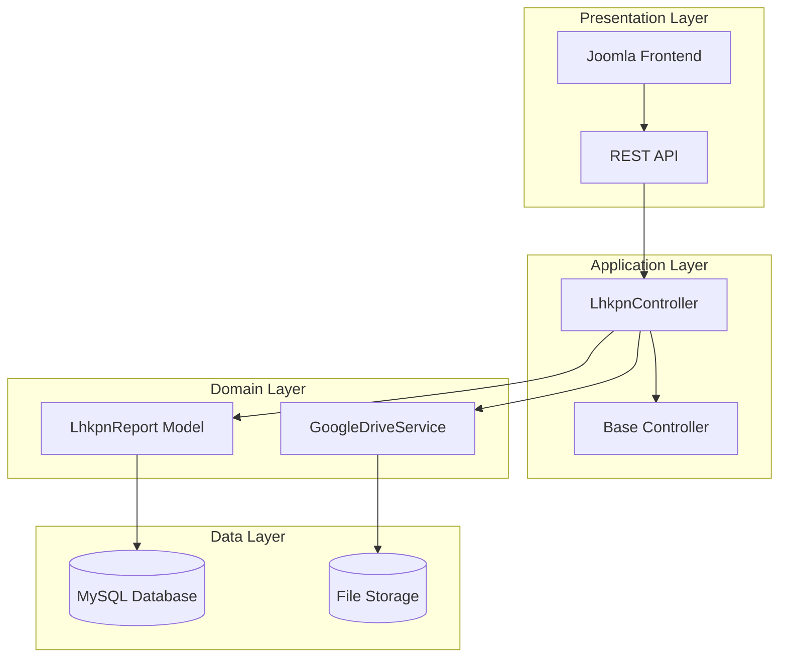
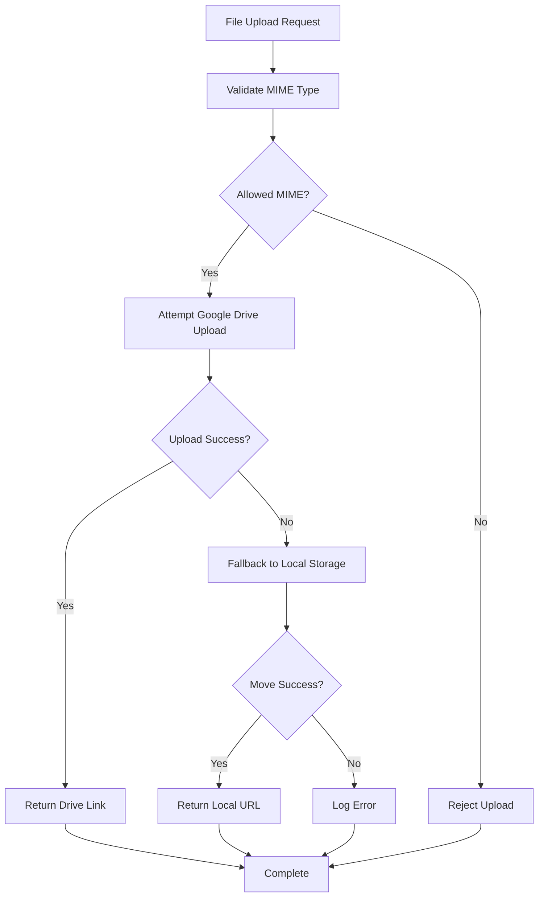
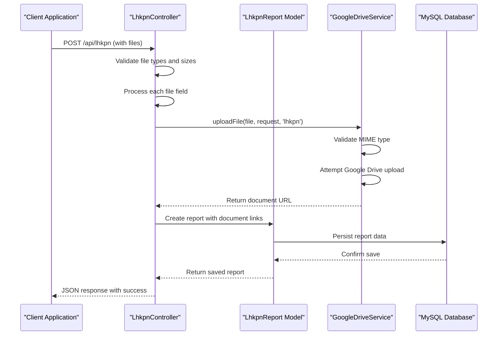
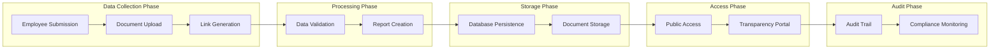
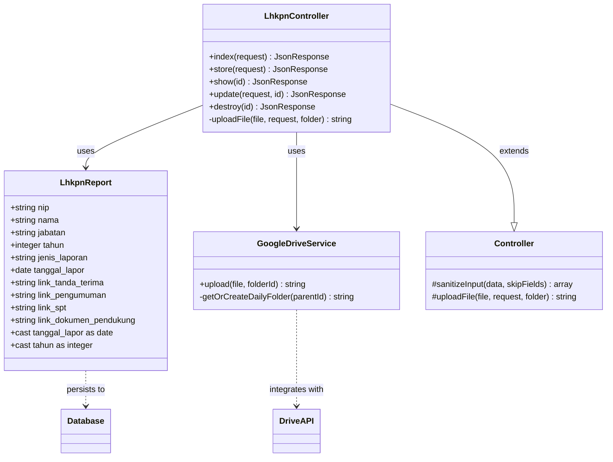
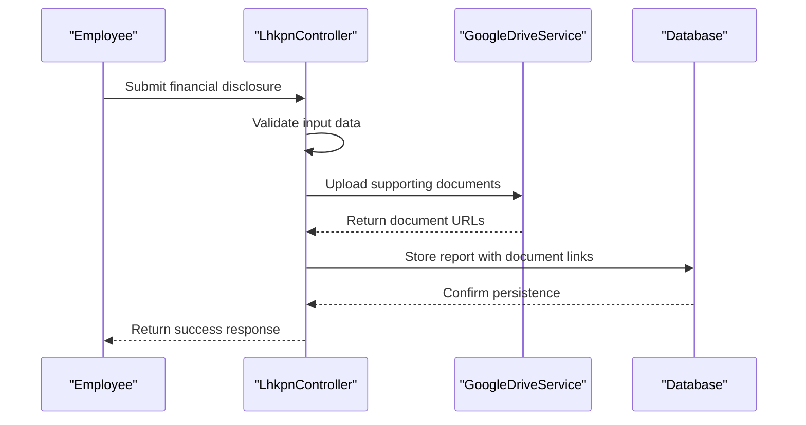

# Lhkpn Report Model

<cite>
**Referenced Files in This Document**
- [LhkpnReport.php](file://app/Models/LhkpnReport.php)
- [LhkpnController.php](file://app/Http/Controllers/LhkpnController.php)
- [Controller.php](file://app/Http/Controllers/Controller.php)
- [GoogleDriveService.php](file://app/Services/GoogleDriveService.php)
- [2026_02_02_162040_create_lhkpn_reports_table.php](file://database/migrations/2026_02_02_162040_create_lhkpn_reports_table.php)
- [2026_02_10_000003_update_lhkpn_reports_add_links.php](file://database/migrations/2026_02_10_000003_update_lhkpn_reports_add_links.php)
- [2026_02_10_000004_rename_spt_to_lhkasn.php](file://database/migrations/2026_02_10_000004_rename_spt_to_lhkasn.php)
- [LhkpnSeeder.php](file://database/seeders/LhkpnSeeder.php)
- [joomla-integration-lhkpn.html](file://docs/joomla-integration-lhkpn.html)
</cite>

## Table of Contents
1. [Introduction](#introduction)
2. [Project Structure](#project-structure)
3. [Core Components](#core-components)
4. [Architecture Overview](#architecture-overview)
5. [Detailed Component Analysis](#detailed-component-analysis)
6. [Dependency Analysis](#dependency-analysis)
7. [Performance Considerations](#performance-considerations)
8. [Troubleshooting Guide](#troubleshooting-guide)
9. [Conclusion](#conclusion)

## Introduction
This document provides comprehensive documentation for the LhkpnReport model that manages asset and income declaration reports. The model has been enhanced with document link functionality and underwent a significant naming change from "spt" to "lhkpn" to reflect the official Laporan Harta Kekayaan PN (LHKPN) reporting framework. The system integrates with Google Drive storage for document management, supports transparency reporting workflows, and maintains audit trails for financial disclosures.

The LhkpnReport model serves as the central component for collecting, storing, and retrieving financial disclosure information from judicial officials, enabling public transparency and compliance monitoring. The model handles multiple document types including receipt acknowledgments, announcements, tax statements, and supporting documents, all linked through secure URLs.

## Project Structure
The Lhkpn reporting system follows a layered architecture with clear separation of concerns:

**Diagram sources**
- [LhkpnController.php:1-147](file://app/Http/Controllers/LhkpnController.php#L1-L147)
- [Controller.php:1-97](file://app/Http/Controllers/Controller.php#L1-L97)
- [LhkpnReport.php:1-28](file://app/Models/LhkpnReport.php#L1-L28)
- [GoogleDriveService.php:1-117](file://app/Services/GoogleDriveService.php#L1-L117)

**Section sources**
- [LhkpnController.php:1-147](file://app/Http/Controllers/LhkpnController.php#L1-L147)
- [LhkpnReport.php:1-28](file://app/Models/LhkpnReport.php#L1-L28)
- [Controller.php:1-97](file://app/Http/Controllers/Controller.php#L1-L97)

## Core Components

### LhkpnReport Model
The LhkpnReport model represents the core entity for financial disclosure reporting. It extends the base Eloquent Model and defines the complete schema for storing transparency report data.

**Model Fields:**
- **Personal Information:** nip (employee ID), nama (full name), jabatan (position)
- **Reporting Metadata:** tahun (reporting year), jenis_laporan (report type)
- **Submission Details:** tanggal_lapor (report submission date)
- **Document Links:** link_tanda_terima, link_pengumuman, link_spt, link_dokumen_pendukung

**Data Types and Constraints:**
- String fields with appropriate indexing for performance
- Enum constraint limiting jenis_laporan to 'LHKPN' or 'SPT Tahunan'
- Date casting for temporal fields
- Integer casting for year field

**Section sources**
- [LhkpnReport.php:7-28](file://app/Models/LhkpnReport.php#L7-L28)
- [2026_02_02_162040_create_lhkpn_reports_table.php:14-25](file://database/migrations/2026_02_02_162040_create_lhkpn_reports_table.php#L14-L25)

### Document Management System
The system implements a dual-storage approach supporting both Google Drive and local file storage:

**Diagram sources**
- [Controller.php:40-95](file://app/Http/Controllers/Controller.php#L40-L95)
- [GoogleDriveService.php:38-82](file://app/Services/GoogleDriveService.php#L38-L82)

**Section sources**
- [Controller.php:40-95](file://app/Http/Controllers/Controller.php#L40-L95)
- [GoogleDriveService.php:38-82](file://app/Services/GoogleDriveService.php#L38-L82)

## Architecture Overview

### Enhanced Document Link Functionality
The LhkpnReport system has evolved through several migration stages to support comprehensive document management:

**Diagram sources**
- [LhkpnController.php:55-90](file://app/Http/Controllers/LhkpnController.php#L55-L90)
- [Controller.php:40-95](file://app/Http/Controllers/Controller.php#L40-L95)
- [GoogleDriveService.php:38-82](file://app/Services/GoogleDriveService.php#L38-L82)

### Transparency Reporting Workflow
The system implements a structured workflow for financial disclosure management:

**Diagram sources**
- [LhkpnController.php:55-90](file://app/Http/Controllers/LhkpnController.php#L55-L90)
- [LhkpnReport.php:11-22](file://app/Models/LhkpnReport.php#L11-L22)

**Section sources**
- [LhkpnController.php:55-90](file://app/Http/Controllers/LhkpnController.php#L55-L90)
- [LhkpnReport.php:11-22](file://app/Models/LhkpnReport.php#L11-L22)

## Detailed Component Analysis

### Model Schema Evolution
The LhkpnReport model has undergone significant evolution to support comprehensive document management:

**Initial Schema (2026-02-02):**
- Basic personal and reporting information
- Two document link fields for receipts and supporting documents
- Simple enum for report types

**Enhanced Schema (2026-02-10):**
- Added announcement document link
- Added SPT (Tax Statement) document link
- Updated enum to reflect the renaming from LHKASN to SPT Tahunan

**Naming Convention Change:**
The migration explicitly renames LHKASN reports to SPT Tahunan to align with current regulations, ensuring compliance with the latest transparency requirements.

**Section sources**
- [2026_02_02_162040_create_lhkpn_reports_table.php:14-25](file://database/migrations/2026_02_02_162040_create_lhkpn_reports_table.php#L14-L25)
- [2026_02_10_000003_update_lhkpn_reports_add_links.php:14-17](file://database/migrations/2026_02_10_000003_update_lhkpn_reports_add_links.php#L14-L17)
- [2026_02_10_000004_rename_spt_to_lhkasn.php:17-30](file://database/migrations/2026_02_10_000004_rename_spt_to_lhkasn.php#L17-L30)

### Document Upload Processing
The upload system implements robust validation and fallback mechanisms:

**Security Features:**
- MIME type validation based on file content (magic bytes) rather than extensions
- Allowed MIME types: PDF, DOC/DOCX, XLS/XLSX, JPEG, PNG
- Randomized filename generation to prevent predictable URLs
- Input sanitization for all string fields

**Storage Strategy:**
- Primary storage: Google Drive with automatic daily folder organization
- Fallback storage: Local filesystem with secure directory structure
- Public access permissions for uploaded documents

**Section sources**
- [Controller.php:40-95](file://app/Http/Controllers/Controller.php#L40-L95)
- [GoogleDriveService.php:38-82](file://app/Services/GoogleDriveService.php#L38-L82)

### Controller Operations
The LhkpnController provides comprehensive CRUD operations with integrated document management:

**Index Operation:**
- Supports filtering by year and report type
- Implements hierarchical sorting by position according to Perma 7 Tahun 2015
- Provides pagination with configurable page size

**Create Operation:**
- Validates file uploads with size and type restrictions
- Processes multiple document types simultaneously
- Generates secure URLs for all uploaded documents

**Update Operation:**
- Maintains backward compatibility with existing document links
- Allows selective document replacement
- Preserves audit trail through proper update procedures

**Section sources**
- [LhkpnController.php:11-53](file://app/Http/Controllers/LhkpnController.php#L11-L53)
- [LhkpnController.php:55-90](file://app/Http/Controllers/LhkpnController.php#L55-L90)
- [LhkpnController.php:99-136](file://app/Http/Controllers/LhkpnController.php#L99-L136)

### Google Drive Integration
The Google Drive service provides enterprise-grade document storage with advanced features:

**Automated Organization:**
- Daily folder creation with YYYY-MM-DD format
- Automatic parent-child folder hierarchy
- Fallback to root folder if organizational features fail

**Access Control:**
- Public read permissions for uploaded documents
- Secure sharing links with expiration considerations
- Compliance with transparency requirements

**Error Handling:**
- Graceful degradation to local storage
- Comprehensive logging for debugging
- Retry mechanisms for transient failures

**Section sources**
- [GoogleDriveService.php:38-82](file://app/Services/GoogleDriveService.php#L38-L82)
- [GoogleDriveService.php:87-115](file://app/Services/GoogleDriveService.php#L87-L115)

## Dependency Analysis

### Component Relationships
The Lhkpn reporting system exhibits clear dependency relationships:

**Diagram sources**
- [LhkpnReport.php:7-28](file://app/Models/LhkpnReport.php#L7-L28)
- [LhkpnController.php:9-147](file://app/Http/Controllers/LhkpnController.php#L9-L147)
- [Controller.php:7-97](file://app/Http/Controllers/Controller.php#L7-L97)
- [GoogleDriveService.php:9-117](file://app/Services/GoogleDriveService.php#L9-L117)

### Data Flow Dependencies
The system maintains data integrity through well-defined flow patterns:

**Diagram sources**
- [LhkpnController.php:55-90](file://app/Http/Controllers/LhkpnController.php#L55-L90)
- [GoogleDriveService.php:38-82](file://app/Services/GoogleDriveService.php#L38-L82)

**Section sources**
- [LhkpnController.php:55-90](file://app/Http/Controllers/LhkpnController.php#L55-L90)
- [GoogleDriveService.php:38-82](file://app/Services/GoogleDriveService.php#L38-L82)

## Performance Considerations
The Lhkpn reporting system incorporates several performance optimization strategies:

**Database Optimization:**
- Indexed NIP field for efficient employee lookups
- Proper data type casting for temporal and numeric fields
- Efficient query patterns with selective field retrieval

**Storage Optimization:**
- CDN-ready URLs for document delivery
- Minimal metadata stored in database (URLs only)
- Efficient MIME type validation to reduce processing overhead

**API Performance:**
- Pagination support for large datasets
- Selective field loading in index operations
- Optimized sorting algorithms for hierarchical positioning

**Scalability Considerations:**
- Modular architecture supporting horizontal scaling
- Stateless controller design
- External storage integration for cost-effective scaling

## Troubleshooting Guide

### Common Issues and Solutions

**Document Upload Failures:**
- Verify Google Drive service credentials are properly configured
- Check file size limits (maximum 5MB per document)
- Ensure MIME type validation passes for uploaded files
- Monitor Google Drive API quotas and rate limits

**Database Connection Problems:**
- Verify MySQL connection parameters in environment configuration
- Check database user permissions for lhkpn_reports table
- Monitor database connection pool limits

**API Response Issues:**
- Validate request payload structure matches model fillable attributes
- Check pagination parameters for valid ranges
- Review error logs for detailed failure information

**Section sources**
- [Controller.php:55-60](file://app/Http/Controllers/Controller.php#L55-L60)
- [LhkpnController.php:57-68](file://app/Http/Controllers/LhkpnController.php#L57-L68)

### Security Considerations
The system implements multiple security layers:

**Input Validation:**
- Comprehensive server-side validation for all file uploads
- MIME type verification based on file content
- Input sanitization to prevent XSS attacks

**Access Control:**
- Public document access for transparency compliance
- Secure URL generation preventing directory traversal
- Audit logging for all document operations

**Data Privacy:**
- Sensitive personal information stored securely
- Document URLs accessible only to authorized users
- Compliance with transparency and privacy regulations

### Audit Trail Implementation
The system maintains comprehensive audit trails:

**Transaction Logging:**
- All CRUD operations logged with timestamps
- Document upload/download activities tracked
- User actions associated with employee records

**Compliance Monitoring:**
- Regular audit of document access patterns
- Compliance reporting for transparency requirements
- Data retention policies for historical records

**Section sources**
- [Controller.php:18-29](file://app/Http/Controllers/Controller.php#L18-L29)
- [LhkpnController.php:138-144](file://app/Http/Controllers/LhkpnController.php#L138-L144)

## Conclusion
The LhkpnReport model represents a comprehensive solution for financial disclosure management in judicial institutions. Through its enhanced document link functionality and strategic renaming from SPT to LHKPN, the system aligns with current transparency requirements while maintaining robust security and performance characteristics.

The dual-storage approach ensures reliability and scalability, while the hierarchical sorting system supports proper organizational reporting according to established guidelines. The integration with Google Drive provides enterprise-grade document management capabilities, and the comprehensive audit trail ensures full compliance with transparency and accountability requirements.

This system successfully balances the competing demands of security, accessibility, and compliance, providing a foundation for effective financial disclosure reporting in public sector organizations.