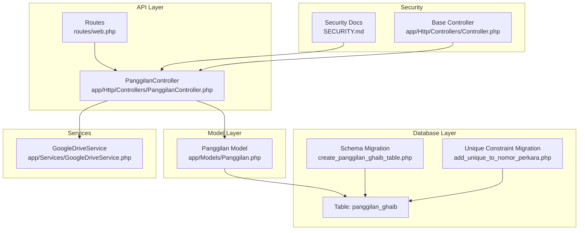
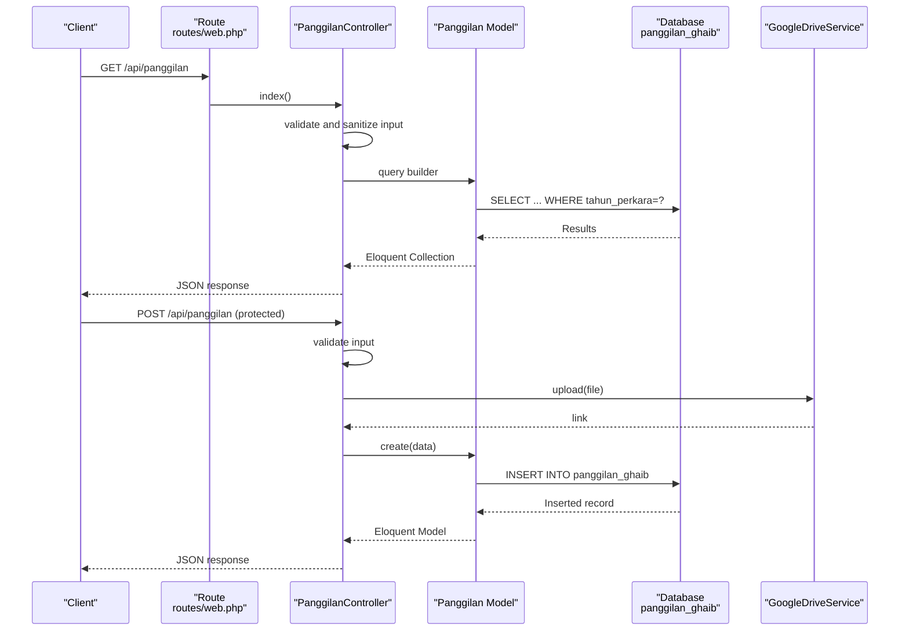

# Panggilan Model

<cite>
**Referenced Files in This Document**
- [Panggilan.php](file://app/Models/Panggilan.php)
- [2026_01_21_000001_create_panggilan_ghaib_table.php](file://database/migrations/2026_01_21_000001_create_panggilan_ghaib_table.php)
- [2026_01_21_000002_add_unique_to_nomor_perkara.php](file://database/migrations/2026_01_21_000002_add_unique_to_nomor_perkara.php)
- [PanggilanController.php](file://app/Http/Controllers/PanggilanController.php)
- [Controller.php](file://app/Http/Controllers/Controller.php)
- [GoogleDriveService.php](file://app/Services/GoogleDriveService.php)
- [web.php](file://routes/web.php)
- [SECURITY.md](file://SECURITY.md)
- [PanggilanSeeder.php](file://database/seeders/PanggilanSeeder.php)
</cite>

## Table of Contents
1. [Introduction](#introduction)
2. [Project Structure](#project-structure)
3. [Core Components](#core-components)
4. [Architecture Overview](#architecture-overview)
5. [Detailed Component Analysis](#detailed-component-analysis)
6. [Dependency Analysis](#dependency-analysis)
7. [Performance Considerations](#performance-considerations)
8. [Troubleshooting Guide](#troubleshooting-guide)
9. [Conclusion](#conclusion)

## Introduction
This document provides comprehensive documentation for the Panggilan model, which serves as the primary case management entity for the "Panggilan Ghaib" (Ghost Call) module. The model manages case-related information for legal proceedings, including case identifiers, parties involved, procedural dates, and supporting documentation links. It is mapped to the database table panggilan_ghaib and exposes a RESTful API for read-only operations with additional write operations protected by API key authentication.

## Project Structure
The Panggilan model and its ecosystem are organized across several key areas:
- Model definition and attribute casting
- Database schema and indexes
- API controller with validation and security measures
- Routing configuration
- File upload service integration
- Security documentation and middleware configuration



**Diagram sources**
- [Panggilan.php:1-55](file://app/Models/Panggilan.php#L1-L55)
- [2026_01_21_000001_create_panggilan_ghaib_table.php:1-42](file://database/migrations/2026_01_21_000001_create_panggilan_ghaib_table.php#L1-L42)
- [2026_01_21_000002_add_unique_to_nomor_perkara.php:1-37](file://database/migrations/2026_01_21_000002_add_unique_to_nomor_perkara.php#L1-L37)
- [PanggilanController.php:1-333](file://app/Http/Controllers/PanggilanController.php#L1-L333)
- [web.php:1-165](file://routes/web.php#L1-L165)
- [GoogleDriveService.php:1-117](file://app/Services/GoogleDriveService.php#L1-L117)
- [SECURITY.md:1-63](file://SECURITY.md#L1-L63)
- [Controller.php:1-29](file://app/Http/Controllers/Controller.php#L1-L29)

**Section sources**
- [Panggilan.php:1-55](file://app/Models/Panggilan.php#L1-L55)
- [2026_01_21_000001_create_panggilan_ghaib_table.php:1-42](file://database/migrations/2026_01_21_000001_create_panggilan_ghaib_table.php#L1-L42)
- [PanggilanController.php:1-333](file://app/Http/Controllers/PanggilanController.php#L1-L333)
- [web.php:1-165](file://routes/web.php#L1-L165)

## Core Components
The Panggilan model encapsulates the case management entity with the following characteristics:

- Table mapping: The model is mapped to the database table panggilan_ghaib.
- Fillable attributes: The model defines 12 fillable attributes representing case metadata and procedural dates.
- Date casting: Four calendar fields are cast to date type for consistent handling.
- Accessor methods: Custom accessors format date fields for output in YYYY-MM-DD format.
- Validation patterns: The controller enforces strict validation rules for input fields.
- Search capabilities: Filtering by year is supported via the API endpoint.

**Section sources**
- [Panggilan.php:9-54](file://app/Models/Panggilan.php#L9-L54)
- [2026_01_21_000001_create_panggilan_ghaib_table.php:13-31](file://database/migrations/2026_01_21_000001_create_panggilan_ghaib_table.php#L13-L31)
- [PanggilanController.php:118-130](file://app/Http/Controllers/PanggilanController.php#L118-L130)

## Architecture Overview
The system follows a layered architecture with clear separation of concerns:
- Model layer: Defines data structure, casting, and accessors.
- Database layer: Provides schema and indexes for efficient querying.
- API layer: Exposes endpoints with robust validation and security.
- Service layer: Handles external integrations (e.g., Google Drive).
- Security layer: Implements authentication, rate limiting, and input sanitization.



**Diagram sources**
- [web.php:14-84](file://routes/web.php#L14-L84)
- [PanggilanController.php:31-198](file://app/Http/Controllers/PanggilanController.php#L31-L198)
- [Panggilan.php:7-54](file://app/Models/Panggilan.php#L7-L54)
- [GoogleDriveService.php:38-82](file://app/Services/GoogleDriveService.php#L38-L82)

## Detailed Component Analysis

### Model Definition and Attributes
The Panggilan model defines the following 12 fillable attributes:
- tahun_perkara: Year of the case (integer)
- nomor_perkara: Case number (string, max 50)
- nama_dipanggil: Name of the person called (string, max 255)
- alamat_asal: Original address (text, nullable)
- panggilan_1: First call date (date, nullable)
- panggilan_2: Second call date (date, nullable)
- panggilan_ikrar: Oath call date (date, nullable)
- tanggal_sidang: Court session date (date, nullable)
- pip: Session information (string, max 100, nullable)
- link_surat: Document link (string, max 500, nullable)
- keterangan: Description/comments (text, nullable)

Date casting ensures that the four calendar fields are consistently handled as dates at the application level. Custom accessors format these dates for output in YYYY-MM-DD format.

**Section sources**
- [Panggilan.php:11-23](file://app/Models/Panggilan.php#L11-L23)
- [Panggilan.php:25-32](file://app/Models/Panggilan.php#L25-L32)
- [Panggilan.php:35-53](file://app/Models/Panggilan.php#L35-L53)

### Database Schema and Indexing
The database schema for panggilan_ghaib includes:
- Primary key: auto-incrementing id
- Year field: tahun_perkara (year type)
- String fields: nomor_perkara (unique), nama_dipanggil
- Text fields: alamat_asal, keterangan
- Date fields: panggilan_1, panggilan_2, panggilan_ikrar, tanggal_sidang
- String field: pip
- String field: link_surat
- Timestamps: created_at, updated_at

Indexes are defined on tahun_perkara and nomor_perkara to optimize filtering and lookups. A unique constraint is enforced on nomor_perkara to prevent duplicates.

**Section sources**
- [2026_01_21_000001_create_panggilan_ghaib_table.php:13-31](file://database/migrations/2026_01_21_000001_create_panggilan_ghaib_table.php#L13-L31)
- [2026_01_21_000002_add_unique_to_nomor_perkara.php:14-24](file://database/migrations/2026_01_21_000002_add_unique_to_nomor_perkara.php#L14-L24)

### Validation Patterns and Input Sanitization
The controller enforces strict validation rules:
- tahun_perkara: required integer between 2000 and 2100
- nomor_perkara: required string, max 50, regex pattern allowing digits, slashes, periods, and letters
- nama_dipanggil: required string, max 255
- alamat_asal: optional string, max 1000
- panggilan_1, panggilan_2, panggilan_ikrar, tanggal_sidang: optional dates
- pip: optional string, max 100
- file_upload: optional file, mime types pdf, doc, docx, jpg, jpeg, png, max 5MB
- keterangan: optional string, max 1000

Input sanitization strips HTML tags from string fields except for specific fields (link_surat, nomor_perkara) to prevent XSS while preserving intended formatting.

**Section sources**
- [PanggilanController.php:118-130](file://app/Http/Controllers/PanggilanController.php#L118-L130)
- [Controller.php:18-29](file://app/Http/Controllers/Controller.php#L18-L29)

### API Endpoints and Query Capabilities
The API provides the following endpoints:
- GET /api/panggilan: List all cases with optional year filter and pagination
- GET /api/panggilan/{id}: Retrieve a specific case by ID
- GET /api/panggilan/tahun/{tahun}: Filter cases by year
- POST /api/panggilan: Create a new case (protected)
- PUT/POST /api/panggilan/{id}: Update an existing case (protected)
- DELETE /api/panggilan/{id}: Delete a case (protected)

Filtering by year is supported through the index endpoint with parameter validation and sanitization. Pagination limits prevent excessive memory usage.

**Section sources**
- [web.php:16-18](file://routes/web.php#L16-L18)
- [PanggilanController.php:31-57](file://app/Http/Controllers/PanggilanController.php#L31-L57)
- [PanggilanController.php:62-82](file://app/Http/Controllers/PanggilanController.php#L62-L82)

### File Upload Integration
The controller integrates with GoogleDriveService for file uploads:
- Attempts to upload to Google Drive first
- Falls back to local storage if Google Drive is unavailable
- Generates public links for uploaded files
- Logs upload attempts and errors for monitoring

**Section sources**
- [PanggilanController.php:139-189](file://app/Http/Controllers/PanggilanController.php#L139-L189)
- [GoogleDriveService.php:38-82](file://app/Services/GoogleDriveService.php#L38-L82)

### Security Measures
Multiple security layers protect the API:
- API key authentication for write operations
- Rate limiting (100 requests/minute for public, 30 for protected)
- Input validation and sanitization
- XSS prevention through strip_tags
- SQL injection prevention via Eloquent ORM
- Mass assignment protection via allowed fields whitelist

**Section sources**
- [SECURITY.md:11-51](file://SECURITY.md#L11-L51)
- [web.php:79-84](file://routes/web.php#L79-L84)
- [PanggilanController.php:132-133](file://app/Http/Controllers/PanggilanController.php#L132-L133)

## Dependency Analysis
The Panggilan model and its ecosystem form a cohesive dependency graph:

```mermaid
classDiagram
class Panggilan {
+int id
+int tahun_perkara
+string nomor_perkara
+string nama_dipanggil
+string alamat_asal
+date panggilan_1
+date panggilan_2
+date panggilan_ikrar
+date tanggal_sidang
+string pip
+string link_surat
+string keterangan
+datetime created_at
+datetime updated_at
+getPanggilan1Attribute(value) string
+getPanggilan2Attribute(value) string
+getPanggilanIkrarAttribute(value) string
+getTanggalSidangAttribute(value) string
}
class PanggilanController {
+index(request) JsonResponse
+byYear(tahun) JsonResponse
+show(id) JsonResponse
+store(request) JsonResponse
+update(request, id) JsonResponse
+destroy(id) JsonResponse
-allowedFields array
-sanitizeInput(data, skipFields) array
}
class GoogleDriveService {
+upload(file, folderId) string
-getOrCreateDailyFolder(parentId) string
}
class Controller {
#sanitizeInput(data, skipFields) array
}
class Route {
+GET /api/panggilan
+GET /api/panggilan/{id}
+GET /api/panggilan/tahun/{tahun}
+POST /api/panggilan
+PUT /api/panggilan/{id}
+DELETE /api/panggilan/{id}
}
PanggilanController --> Panggilan : "uses"
PanggilanController --> GoogleDriveService : "uses"
PanggilanController --> Controller : "extends"
Route --> PanggilanController : "maps to"
```

**Diagram sources**
- [Panggilan.php:7-54](file://app/Models/Panggilan.php#L7-L54)
- [PanggilanController.php:9-333](file://app/Http/Controllers/PanggilanController.php#L9-L333)
- [GoogleDriveService.php:9-117](file://app/Services/GoogleDriveService.php#L9-L117)
- [Controller.php:7-29](file://app/Http/Controllers/Controller.php#L7-L29)
- [web.php:14-84](file://routes/web.php#L14-L84)

**Section sources**
- [Panggilan.php:7-54](file://app/Models/Panggilan.php#L7-L54)
- [PanggilanController.php:9-333](file://app/Http/Controllers/PanggilanController.php#L9-L333)
- [GoogleDriveService.php:9-117](file://app/Services/GoogleDriveService.php#L9-L117)
- [web.php:14-84](file://routes/web.php#L14-L84)

## Performance Considerations
Several factors influence performance for large datasets:

- Database indexes: The combination of indexes on tahun_perkara and nomor_perkara enables efficient filtering and lookups. Consider adding composite indexes for frequently used query patterns.
- Pagination: The API limits results per page to prevent memory exhaustion. Adjust limit values based on client requirements.
- File storage: Google Drive integration reduces database storage overhead but introduces network latency. Monitor upload performance and implement caching strategies for frequently accessed documents.
- Query optimization: Use selective field retrieval and avoid N+1 queries by eager loading related data when extending functionality.
- Caching: Implement Redis or cache layers for frequently accessed case lists filtered by year.
- Connection pooling: Configure database connection pooling for high-throughput scenarios.

**Section sources**
- [2026_01_21_000001_create_panggilan_ghaib_table.php:28-31](file://database/migrations/2026_01_21_000001_create_panggilan_ghaib_table.php#L28-L31)
- [PanggilanController.php:44](file://app/Http/Controllers/PanggilanController.php#L44)
- [PanggilanController.php:139-189](file://app/Http/Controllers/PanggilanController.php#L139-L189)

## Troubleshooting Guide
Common issues and their resolutions:

- Invalid year parameter: The API validates year values between 2000 and 2100. Ensure clients send valid numeric years.
- Duplicate case numbers: The nomor_perkara field has a unique constraint. Handle duplicate entries gracefully in bulk imports.
- File upload failures: The system falls back from Google Drive to local storage. Check file permissions and disk space if local uploads fail.
- API key errors: Write operations require a valid API key. Verify the X-API-Key header and rate limit compliance.
- XSS prevention: Input sanitization removes HTML tags. Preserve intended formatting by avoiding HTML in sensitive fields.
- Database connectivity: Monitor connection pool exhaustion under high load. Implement retry logic and circuit breakers.

**Section sources**
- [PanggilanController.php:64-70](file://app/Http/Controllers/PanggilanController.php#L64-L70)
- [2026_01_21_000002_add_unique_to_nomor_perkara.php:14-24](file://database/migrations/2026_01_21_000002_add_unique_to_nomor_perkara.php#L14-L24)
- [PanggilanController.php:154-188](file://app/Http/Controllers/PanggilanController.php#L154-L188)
- [SECURITY.md:11-51](file://SECURITY.md#L11-L51)

## Conclusion
The Panggilan model provides a robust foundation for managing case-related data with strong validation, security measures, and extensible architecture. Its design supports efficient querying through strategic indexing, secure file handling via Google Drive integration, and comprehensive API coverage for both read and write operations. The documented patterns enable reliable scaling and maintenance for growing datasets while maintaining data integrity and user safety.